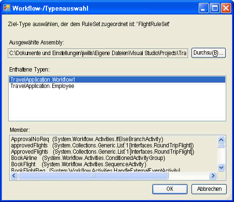

# <a name="external-ruleset-toolkit"></a>Externes RuleSet-Toolkit

Wenn Regeln innerhalb einer Workflowanwendung verwendet werden, sind die Regeln normalerweise ein Teil der Assembly. Bei einigen Szenarien möchten Sie die RuleSets eventuell getrennt von der Assembly aufbewahren, damit sie ohne erneutes Erstellen und Bereitstellen der Workflowassembly aktualisiert werden können. In diesem Beispiel können Sie RuleSets in einer Datenbank verwalten und bearbeiten und von einem Workflow zur Laufzeit auf diese RuleSets zugreifen. Dadurch ist es möglich, dass die ausgeführten Workflowinstanzen RuleSet-Änderungen automatisch integrieren.

Das Beispiel für ein externes RuleSet-Toolkit enthält ein Windows Forms-basiertes Tool, das Sie zum Verwalten und Bearbeiten der RuleSet-Versionen in einer Datenbank verwenden können. Es bietet auch eine Aktivität und einen Hostdienst zum Ausführen dieser Regeln.

> [!NOTE]
> Für dieses Beispiel ist [Microsoft SQL Server](https://go.microsoft.com/fwlink/?LinkId=96181)erforderlich.

Visual Studio stellt einen RuleSet-Editor als Teil des Windows Workflow Foundation (WF) bereit. Sie können diesen Editor starten, indem Sie auf die `Policy`-Aktivität in einem Workflow doppelklicken. Dadurch wird das definierte RuleSet-Objekt in die dem Workflow zugeordnete RULES-Datei serialisiert (eine `Policy`-Aktivität führt eine RuleSet-Instanz für den Workflow aus). Die RULES-Datei wird beim Erstellen des Workflowprojekts als Ressource in die Assembly kompiliert.

Die Komponenten dieses Beispiel umfassen:

- Ein grafisches RuleSet-Benutzeroberflächentool, mit dem Sie RuleSet-Versionen in der Datenbank bearbeiten und verwalten können.

- Einen RuleSet-Dienst, der auf der Hostanwendung konfiguriert wird und auf RuleSets aus der Datenbank zugreift.

- Eine `ExternalPolicy`-Aktivität, die ein RuleSet vom RuleSet-Dienst anfordert und das RuleSet für den Workflow ausführt.

Die Interaktion der Komponenten ist in der folgenden Abbildung dargestellt. In den nachfolgenden Abschnitten werden die einzelnen Komponenten beschrieben.


> [!IMPORTANT]
> Die Beispiele sind möglicherweise bereits auf dem Computer installiert. Suchen Sie nach dem folgenden Verzeichnis (Standardverzeichnis), bevor Sie fortfahren.
>
> `<InstallDrive>:\WF_WCF_Samples`
>
> Wenn dieses Verzeichnis nicht vorhanden ist, wechseln Sie zu [Windows Communication Foundation (WCF) und Windows Workflow Foundation (WF)-Beispiele für .NET Framework 4](https://www.microsoft.com/download/details.aspx?id=21459) , um alle Windows Communication Foundation (WCF) und [!INCLUDE[wf1](../../../../includes/wf1-md.md)] Beispiele herunterzuladen. Dieses Beispiel befindet sich im folgenden Verzeichnis.
>
> `<InstallDrive>:\WF_WCF_Samples\WF\Scenario\ExternalRuleSetToolKit`

## <a name="ruleset-tool"></a>RuleSet-Tool

Das folgende Bild ist ein Screenshot des RuleSet-Tools. Im Menü " **Regel Speicher** " können Sie die verfügbaren RuleSets aus der Datenbank laden und geänderte RuleSets wieder in den Speicher speichern. Eine Anwendungskonfigurationsdatei stellt eine Datenbank-Verbindungszeichenfolge für die RuleSet-Datenbank bereit. Wenn Sie das Tool starten, werden die RuleSets automatisch aus der konfigurierten Datenbank geladen.


Das RuleSet-Tool weist den RuleSets Haupt- und Nebenversionsnummern zu, wodurch Sie mehrere Versionen gleichzeitig verwalten und speichern können (das Tool bietet keinen Sperrmechanismus oder andere Konfigurationsverwaltungsfunktionen zusätzlich zur Versionsverwaltungsoption). Mit dem Tool können Sie neue RuleSet-Versionen erstellen oder vorhandene Versionen löschen. Wenn Sie auf **neu**klicken, erstellt das Tool einen neuen RuleSet-Namen und wendet die Version 1,0 an. Wenn Sie eine Version kopieren, erstellt das Tool eine Kopie der ausgewählten RuleSet-Version, einschließlich der enthaltenen Regeln, und weist neue, eindeutige Versionsnummern zu. Diese Versionsnummern basieren auf den Versionsnummern von vorhandenen RuleSets. Sie können den RuleSet-Namen und die Versionsnummern mit den zugeordneten Feldern des Formulars ändern.

Wenn Sie auf **Regeln bearbeiten**klicken, wird der RuleSet-Editor gestartet, wie in der folgenden Abbildung dargestellt:


Dabei handelt es sich um ein erneutes Hosting des Editor Dialogfelds, das Teil des Windows Workflow Foundation Visual Studio-Add-Ins ist. Es stellt die gleiche Funktionalität bereit, einschließlich der Intellisense-Unterstützung. Die Regeln werden für einen Zieltyp (z. b. einen Workflow) erstellt, der dem RuleSet im Tool zugeordnet ist. Wenn Sie im Haupt Dialogfeld des Tools auf **Durchsuchen** klicken, wird das Dialogfeld **Workflow-/Typselektor** angezeigt, wie in Abbildung 4 dargestellt.



Abbildung 4: Workflow/Type Selector

Sie können das Dialogfeld **Workflow/Typauswahl** verwenden, um eine Assembly und einen bestimmten Typ innerhalb dieser Assembly anzugeben. Dieser Typ ist der Zieltyp, für den die Regeln entwickelt (und ausgeführt) werden. In vielen Fällen ist der Zieltyp ein Workflow oder ein anderer Aktivitätstyp. Sie können jedoch für jeden .NET-Typ ein RuleSet ausführen.

Der Pfad zur Assemblydatei und der Typ `name are stored with the` RuleSet in der Datenbank, sodass das Tool beim Abrufen des RuleSets aus der Datenbank automatisch den Zieltyp lädt.

Wenn Sie im Dialogfeld **Workflow/Typauswahl** auf **OK** klicken, wird der ausgewählte Typ anhand des RuleSets überprüft, um sicherzustellen, dass der Zieltyp alle Elemente enthält, auf die von den Regeln verwiesen wird. Fehler werden im Dialogfeld Überprüfungs **Fehler** angezeigt. Sie können die Änderung trotz der Fehler fortsetzen oder auf **Abbrechen**klicken. Über das **Menü Extras** im Dialogfeld Haupt Tool können **Sie auf über** prüfen klicken, um die RuleSet-Version für die Ziel Aktivität erneut zu validieren.


Im Menü " **Daten** " des Tools können Sie RuleSets importieren und exportieren. Wenn Sie auf **importieren**klicken, wird ein Dialogfeld für die Dateiauswahl angezeigt, in dem Sie eine rules-Datei auswählen können. Dies kann eine Datei sein, die anfänglich in Visual Studio erstellt wurde. Die RULES-Datei sollte eine serialisierte `RuleDefinitions`-Instanz enthalten, die wiederum eine Auflistung der Bedingungen und RuleSets enthält. Das Tool verwendet die Bedingungs Auflistung nicht, verwendet jedoch das `RuleDefinitions`. Rules-Format, um die Interaktion mit der Visual Studio-Umgebung zuzulassen.

Nach dem Auswählen einer Rules-Datei wird ein **Regelsatz-Auswahl** Dialogfeld angezeigt. Mit dem Dialogfeld können Sie die RuleSets aus der Datei auswählen, die Sie importieren möchten (als Standard sind alle RuleSets angegeben). Die RuleSets in der RULES-Datei weisen keine Versionsnummern auf, da ihre Versionsverwaltung in einem WF-Projekt der Version der Assembly entspricht. Beim Import Vorgang weist das Tool automatisch die nächste verfügbare Hauptversionsnummer zu (die Sie nach dem Importieren ändern können). Sie können die zugewiesenen Versionsnummern in der Liste der **Regelsatz-Selektoren** sehen.

Für jedes importierte RuleSet versucht das Tool, den zugeordneten Typ im Ordner bin\Debug unterhalb des Verzeichnisses der RULES-Datei (falls vorhanden) basierend auf den im RuleSet verwendeten Membern zu finden. Falls mehrere passende Typen gefunden werden, versucht das Tool, einen Typ basierend auf einer Übereinstimmung zwischen der RULES-Datei und dem Typnamen zu finden (z.&#160;B. entspricht der `Workflow1`-Typ Workflow1.rules). Wenn mehrere Übereinstimmungen vorhanden sind, werden Sie aufgefordert, den Typ auszuwählen. Wenn bei diesem automatischen Identifizierungs Mechanismus keine passende Assembly oder derselbe Typ gefunden werden kann, können Sie nach dem importieren im Haupt Dialogfeld des Tools auf **Durchsuchen** klicken, um zum zugeordneten Typ zu navigieren. Die folgende Abbildung zeigt den Regelsatz-Selektor:


Wenn Sie im Hauptmenü des Tools auf **Daten-Export** klicken, wird das Dialogfeld **RuleSet Selector** erneut angezeigt, in dem Sie die RuleSets aus der zu exportierenden Datenbank ermitteln können. Wenn Sie auf **OK**klicken, wird das Dialogfeld **Datei speichern** angezeigt, in dem Sie den Namen und den Speicherort der resultierenden Rules-Datei angeben können. Da die RULES-Datei keine Versionsinformationen enthält, können Sie lediglich eine RuleSet-Version mit einem bestimmten RuleSet-Namen auswählen.

## <a name="policyfromservice-activity"></a>PolicyFromService-Aktivität

Der Code für die `PolicyFromService`-Aktivität ist einfach. Er funktioniert wie die mit WF bereitgestellte `Policy`-Aktivität. Statt jedoch das Ziel-RuleSet aus der RULES-Datei abzurufen, wird ein Hostdienst zum Abrufen der RuleSet-Instanz aufgerufen. Anschließend wird das RuleSet für die Stammaktivität der Workflowinstanz ausgeführt.

Um die Aktivität in einem Workflow zu verwenden, fügen Sie der `PolicyActivities`-Assembly und der `RuleSetService`-Assembly aus dem Workflowprojekt einen Verweis hinzu. Weitere Informationen erhalten Sie in dem am Ende dieses Themas beschriebenen Verfahren über das Hinzufügen der Aktivität zur Toolbox.

Nachdem die Aktivität in Ihren Workflow integriert wurde, müssen Sie den Namen des auszuführenden RuleSet angeben. Sie können den Wert als Literalwert angeben oder an eine Workflowvariable oder Eigenschaft einer anderen Aktivität binden. Optional können Sie für das auszuführende RuleSet Versionsnummern eingeben. Falls Sie den Standardwert 0 für die Haupt- und Nebenversionsnummern unverändert lassen, wird in der Datenbank für die Aktivität automatisch die neueste Versionsnummer verwendet.

## <a name="ruleset-service"></a>RuleSet-Dienst

Der Dienst ist für das Abrufen der angegebenen RuleSet-Version aus der Datenbank und das Zurückgeben an die aufrufende Aktivität verantwortlich. Wie zuvor bereits erläutert, ruft der Dienst die neueste Version ab, falls der Haupt- und der Nebenversionswert, die beim `GetRuleSet`-Aufruf übergeben werden, beide 0 betragen. An diesem Punkt werden keine RuleSet-Definitionen oder Instanzen zwischengespeichert. Außerdem gibt es keine Features zum Kennzeichnen von RuleSet-Versionen als "bereitgestellt", um sie von aktuell verarbeiteten RuleSets zu unterscheiden.

Die Datenbank, auf die vom Dienst zugegriffen werden soll, sollte anhand einer Anwendungskonfigurationsdatei auf dem Host konfiguriert werden.

#### <a name="to-run-the-tool"></a>So führen Sie das Tool aus

1. Der Ordner, mit dem die vom Tool und Dienst verwendete RuleSet-Tabelle eingerichtet wird, enthält eine Setup.sql-Datei. Sie können die Setup.cmd-Batchdatei ausführen, um die Regeldatenbank in SQL Express zu erstellen und die RuleSet-Tabelle einzurichten.

2. Falls Sie die Batchdatei oder Setup.sql bearbeiten und festlegen, dass SQL Express nicht verwendet wird oder dass die Tabelle in einer Datenbank mit einem anderen Namen als `Rules` abgelegt werden soll, sollten die Anwendungskonfigurationsdateien im RuleSet-Tool und die `UsageSample`-Projekte mit denselben Informationen bearbeitet werden.

3. Nachdem Sie das Setup.sql-Skript ausgeführt haben, können Sie die `ExternalRuleSetToolkit`-Projektmappe erstellen und das RuleSet-Tool aus dem ExternalRuleSetTool-Projekt starten.

4. Die Projektmappe der `RuleSetToolkitUsageSample`-Konsolenanwendung für sequentielle Workflows schließt einen Beispielworkflow ein. Der Workflow besteht aus einer `PolicyFromService`-Aktivität und zwei Variablen, `orderValue` und `discount`, für die das Ziel-RuleSet ausgeführt wird.

5. Um das Beispiel zu verwenden, erstellen Sie die `RuleSetToolkitUsageSample`-Projektmappe. Klicken Sie dann im Hauptmenü des RuleSet-Tools auf **Daten-importieren** , und zeigen Sie auf die Datei diszähltruleset. Rules im Ordner RuleSetToolkitUsageSample. Klicken Sie auf die Menüoption " **Regel Speicher-speichern** ", um den importierten RuleSet in der Datenbank zu speichern.

6. Da die `PolicyActivities`-Assembly im Beispielworkflowprojekt referenziert wird, wird die `PolicyFromService`-Aktivität im Workflow angezeigt. Sie wird jedoch nicht standardmäßig in der Toolbox angezeigt. Falls Sie sie der Toolbox hinzufügen möchten, gehen Sie wie folgt vor:

    - Klicken Sie mit der rechten Maustaste auf die Toolbox, und wählen Sie **Elemente auswählen** (Dies kann eine Weile dauern).

    - Wenn das Dialogfeld **Toolbox Elemente auswählen** angezeigt wird, klicken Sie auf die Registerkarte **Aktivitäten** .

    - Navigieren Sie zur `PolicyActivities` Assembly in der `ExternalRuleSetToolkit`-Projekt Mappe, und klicken Sie auf **Öffnen**.

    - Stellen Sie sicher, dass im Dialogfeld **Toolbox Elemente auswählen** die `PolicyFromService` Aktivität ausgewählt ist, und klicken Sie dann auf **OK**.

    - Die-Aktivität sollte nun in der Toolbox in der Kategorie **RuleSetToolkitUsageSample Components** angezeigt werden.

7. Der RuleSet-Dienst ist bereits mit der folgenden Anweisung in Program.cs auf dem Konsolenanwendungshost konfiguriert.

    ```csharp
    workflowRuntime.AddService(new RuleSetService());
    ```

8. Sie können den Dienst auch anhand einer Konfigurationsdatei auf dem Host konfigurieren. Weitere Informationen finden Sie in der SDK-Dokumentation.

9. Dem Workflowprojekt wird eine Anwendungskonfigurationsdatei hinzugefügt, um die Verbindungszeichenfolge für die vom Dienst zu verwendende Datenbank anzugeben. Dabei sollte es sich um dieselbe Verbindungszeichenfolge handeln, die vom RuleSet-Tool verwendet wird und die auf die Datenbank verweist, welche die RuleSet-Tabelle enthält.

10. Sie können jetzt das `RuleSetToolkitUsageSample`-Projekt so ausführen, wie Sie jede andere Workflowkonsolenanwendung ausführen würden. Drücken Sie in Visual Studio F5 oder STRG + F5, oder führen Sie die Datei RuleSetToolkitUsageSample. exe direkt aus.

    > [!NOTE]
    > Sie müssen das RuleSet-Tool schließen, um das Anwendungsbeispiel erneut zu kompilieren, da die Anwendungsbeispielassembly vom Tool geladen wird.
