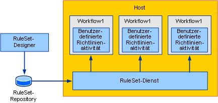
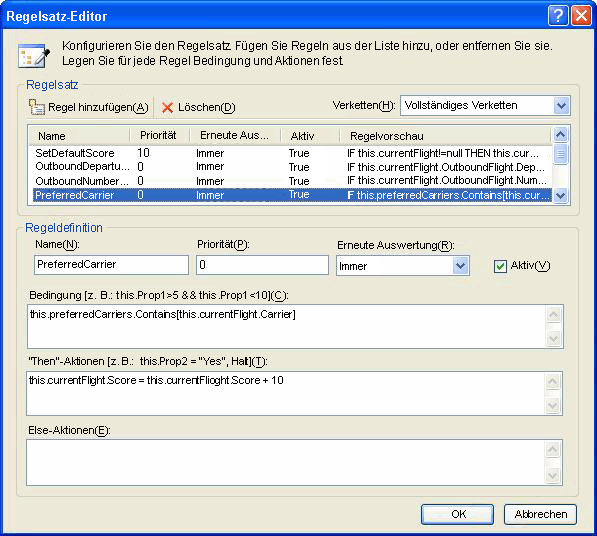
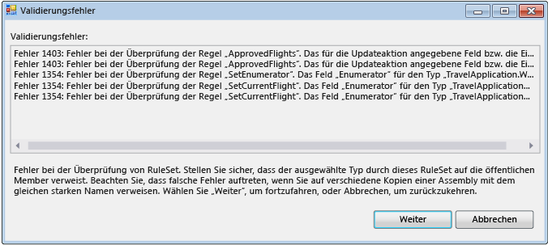
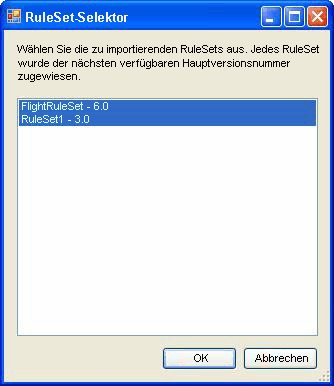

# <a name="external-ruleset-toolkit"></a>Externes RuleSet-Toolkit
Wenn Regeln innerhalb einer Workflowanwendung verwendet werden, sind die Regeln normalerweise ein Teil der Assembly. Bei einigen Szenarien möchten Sie die RuleSets eventuell getrennt von der Assembly aufbewahren, damit sie ohne erneutes Erstellen und Bereitstellen der Workflowassembly aktualisiert werden können. In diesem Beispiel können Sie RuleSets in einer Datenbank verwalten und bearbeiten und von einem Workflow zur Laufzeit auf diese RuleSets zugreifen. Dadurch ist es möglich, dass die ausgeführten Workflowinstanzen RuleSet-Änderungen automatisch integrieren.  
  
 Das Beispiel für ein externes RuleSet-Toolkit enthält ein Windows Forms-basiertes Tool, das Sie zum Verwalten und Bearbeiten der RuleSet-Versionen in einer Datenbank verwenden können. Es bietet auch eine Aktivität und einen Hostdienst zum Ausführen dieser Regeln.  
  
> [!NOTE]
>  Dieses Beispiel erfordert [Microsoft SQL Server](https://go.microsoft.com/fwlink/?LinkId=96181).  
  
 [!INCLUDE[vsprvsext](../../../../includes/vsprvsext-md.md)] stellt einen RuleSet-Editor als Teil von Windows Workflow Foundation (WF) bereit. Sie können diesen Editor starten, indem Sie auf die `Policy`-Aktivität in einem Workflow doppelklicken. Dadurch wird das definierte RuleSet-Objekt in die dem Workflow zugeordnete RULES-Datei serialisiert (eine `Policy`-Aktivität führt eine RuleSet-Instanz für den Workflow aus). Die RULES-Datei wird beim Erstellen des Workflowprojekts als Ressource in die Assembly kompiliert.  
  
 Die Komponenten dieses Beispiel umfassen:  
  
-   Ein grafisches RuleSet-Benutzeroberflächentool, mit dem Sie RuleSet-Versionen in der Datenbank bearbeiten und verwalten können.  
  
-   Einen RuleSet-Dienst, der auf der Hostanwendung konfiguriert wird und auf RuleSets aus der Datenbank zugreift.  
  
-   Eine `ExternalPolicy`-Aktivität, die ein RuleSet vom RuleSet-Dienst anfordert und das RuleSet für den Workflow ausführt.  
  
 Die Interaktion der Komponenten ist in Abbildung 1 dargestellt. In den nachfolgenden Abschnitten werden die einzelnen Komponenten beschrieben.  
  
   
  
 Abbildung 1: Beispielübersicht  
  
> [!IMPORTANT]
>  Die Beispiele sind möglicherweise bereits auf dem Computer installiert. Suchen Sie nach dem folgenden Verzeichnis (Standardverzeichnis), bevor Sie fortfahren.  
>   
>  `<InstallDrive>:\WF_WCF_Samples`  
>   
>  Wenn dieses Verzeichnis nicht vorhanden ist, fahren Sie mit [Windows Communication Foundation (WCF) und Windows Workflow Foundation (WF) Samples für .NET Framework 4](https://go.microsoft.com/fwlink/?LinkId=150780) alle Windows Communication Foundation (WCF) herunterladen und [!INCLUDE[wf1](../../../../includes/wf1-md.md)] Beispiele. Dieses Beispiel befindet sich im folgenden Verzeichnis.  
>   
>  `<InstallDrive>:\WF_WCF_Samples\WF\Scenario\ExternalRuleSetToolKit`  
  
## <a name="ruleset-tool"></a>RuleSet-Tool  
 Eine Bildschirmabbildung des RuleSet-Tools ist in Abbildung 2 dargestellt. Von der **Regel Store** Menü können Sie die verfügbaren RuleSets aus der Datenbank laden und geänderten ruleSets im Speicher. Eine Anwendungskonfigurationsdatei stellt eine Datenbank-Verbindungszeichenfolge für die RuleSet-Datenbank bereit. Wenn Sie das Tool starten, werden die RuleSets automatisch aus der konfigurierten Datenbank geladen.  
  
   
  
 Abbildung 2: RuleSet-Browser  
  
 Das RuleSet-Tool weist den RuleSets Haupt- und Nebenversionsnummern zu, wodurch Sie mehrere Versionen gleichzeitig verwalten und speichern können (das Tool bietet keinen Sperrmechanismus oder andere Konfigurationsverwaltungsfeatures zusätzlich zur Versionsverwaltungsoption). Mit dem Tool können Sie neue RuleSet-Versionen erstellen oder vorhandene Versionen löschen. Beim Klicken auf **neu**, das Tool erstellt einen neuen RuleSet-Namen und übernimmt Version 1.0. Wenn Sie eine Version kopieren, erstellt das Tool eine Kopie der ausgewählten RuleSet-Version, einschließlich der enthaltenen Regeln, und weist neue, eindeutige Versionsnummern zu. Diese Versionsnummern basieren auf den Versionsnummern von vorhandenen RuleSets. Sie können den RuleSet-Namen und die Versionsnummern mit den zugeordneten Feldern des Formulars ändern.  
  
 Beim Klicken auf **Bearbeiten von Regeln**, startet der RuleSet-Editor, wie in Abbildung 3 dargestellt.  
  
   
  
 Abbildung 3: RuleSet-Editor  
  
 Dies ist ein rehosting im Editor-Dialogfeld, das Teil des Visual Studio für Windows Workflow Foundation-add-Ins ist. Es stellt die gleiche Funktionalität bereit, einschließlich der Intellisense-Unterstützung. Die Regeln werden anhand eines Zieltyps (z. B. eines Workflows) erstellt, die dem RuleSet im Tool zugeordnet ist; Beim Klicken auf **Durchsuchen** in des Hauptdialogfelds der **Workflow/Type Selector** Dialogfeld wird angezeigt, wie in Abbildung 4 dargestellt.  
  
   
  
 Abbildung 4: Workflow/Type Selector  
  
 Sie können die **Workflow/Type Selector** Dialogfeld, um eine Assembly und einen bestimmten Typ innerhalb dieser Assembly angeben. Dieser Typ ist der Zieltyp, für den die Regeln entwickelt (und ausgeführt) werden. In vielen Fällen ist der Zieltyp ein Workflow oder ein anderer Aktivitätstyp. Sie können jedoch für jeden .NET-Typ ein RuleSet ausführen.  
  
 Der Pfad der Assemblydatei und der Typname `name are stored with the` RuleSet in der Datenbank, sodass Wenn RuleSet aus der Datenbank abgerufen wird das Tool versucht, automatisch den Zieltyp lädt.  
  
 Beim Klicken auf **OK** in die **Workflow/Type Selector** Dialogfeld überprüft den ausgewählten Typ anhand des RuleSet aus, um sicherzustellen, dass der Zieltyp alle Elemente, die von den Regeln verwiesen wird. Fehler werden angezeigt, einem **Validierungsfehler** Dialogfeld (siehe Abbildung 5). Sie können trotz der Fehler mit der Änderung fortfahren oder auf **Abbrechen**. Von der **Tools** Menü im Hauptdialogfeld des Tools, die Sie klicken können **überprüfen** die RuleSet-Version anhand der Zielaktivität erneut zu überprüfen.  
  
   
  
 Abbildung 5: Validierungsfehler  
  
 Von der **Daten** Menü Tool für die Sie importieren und exportieren Sie die RuleSets. Beim Klicken auf **Import**, ein Dateiauswahl-Dialogfeld angezeigt wird, von dem Sie eine rules-Datei auswählen können. Dies kann oder möglicherweise nicht in eine Datei, die zunächst in Visual Studio erstellt. Die RULES-Datei sollte eine serialisierte `RuleDefinitions`-Instanz enthalten, die wiederum eine Auflistung der Bedingungen und RuleSets enthält. Das Tool verwendet keine der bedingungenauflistung es unterstützt jedoch die Verwendung der `RuleDefinitions` Rules-Format, um die Interaktion mit der Visual Studio-Umgebung zu ermöglichen.  
  
 Nach der Auswahl einer rules-Datei eine **RuleSet-Selektor** angezeigt (siehe Abbildung 6). Mit dem Dialogfeld können Sie die RuleSets aus der Datei auswählen, die Sie importieren möchten (als Standard sind alle RuleSets angegeben). Die RuleSets in der RULES-Datei weisen keine Versionsnummern auf, da ihre Versionsverwaltung in einem WF-Projekt der Version der Assembly entspricht. Während des Importvorgangs weist das Tool automatisch die nächste verfügbare Hauptversionsnummer (die Sie nach dem Import ändern können); sehen Sie die zugewiesenen Versionsnummern in der **RuleSet-Selektor** Liste.  
  
 Für jedes importierte RuleSet versucht das Tool, den zugeordneten Typ im Ordner bin\Debug unterhalb des Verzeichnisses der RULES-Datei (falls vorhanden) basierend auf den im RuleSet verwendeten Membern zu finden. Falls mehrere passende Typen gefunden werden, versucht das Tool, einen Typ basierend auf einer Übereinstimmung zwischen der RULES-Datei und dem Typnamen zu finden (z.&#160;B. entspricht der `Workflow1`-Typ Workflow1.rules). Wenn mehrere Übereinstimmungen vorhanden sind, werden Sie aufgefordert, den Typ auszuwählen. Wenn dieser Mechanismus für die automatische Identifizierung keine übereinstimmende Assembly oder keinen ersten Typ findet, nach dem Import können Sie auf **Durchsuchen** auf des Hauptdialogfelds, an den zugeordneten Typ zu navigieren.  
  
   
  
 Abbildung 6: RuleSet Selector  
  
 Beim Klicken auf **Data-Export** im Hauptdialogfeld des Tools-Menü die **RuleSet-Selektor** Dialogfeld erneut angezeigt, von dem Sie die RuleSets aus der Datenbank bestimmen können, die exportiert werden sollen. Beim Klicken auf **OK**, **Datei speichern** Dialogfeld wird angezeigt, in dem Sie den Namen und Speicherort der resultierenden rules-Datei angeben können. Da die RULES-Datei keine Versionsinformationen enthält, können Sie lediglich eine RuleSet-Version mit einem bestimmten RuleSet-Namen auswählen.  
  
## <a name="policyfromservice-activity"></a>PolicyFromService-Aktivität  
 Der Code für die `PolicyFromService`-Aktivität ist einfach. Er funktioniert wie die mit WF bereitgestellte `Policy`-Aktivität. Statt jedoch das Ziel-RuleSet aus der RULES-Datei abzurufen, wird ein Hostdienst zum Abrufen der RuleSet-Instanz aufgerufen. Anschließend wird das RuleSet für die Stammaktivität der Workflowinstanz ausgeführt.  
  
 Um die Aktivität in einem Workflow zu verwenden, fügen Sie der `PolicyActivities`-Assembly und der `RuleSetService`-Assembly aus dem Workflowprojekt einen Verweis hinzu. Weitere Informationen erhalten Sie in dem am Ende dieses Themas beschriebenen Verfahren über das Hinzufügen der Aktivität zur Toolbox.  
  
 Nachdem die Aktivität in Ihren Workflow integriert wurde, müssen Sie den Namen des auszuführenden RuleSet angeben. Sie können den Wert als Literalwert angeben oder an eine Workflowvariable oder Eigenschaft einer anderen Aktivität binden. Optional können Sie für das auszuführende RuleSet Versionsnummern eingeben. Falls Sie den Standardwert 0 für die Haupt- und Nebenversionsnummern unverändert lassen, wird in der Datenbank für die Aktivität automatisch die neueste Versionsnummer verwendet.  
  
## <a name="ruleset-service"></a>RuleSet-Dienst  
 Der Dienst ist für das Abrufen der angegebenen RuleSet-Version aus der Datenbank und das Zurückgeben an die aufrufende Aktivität verantwortlich. Wie zuvor bereits erläutert, ruft der Dienst die neueste Version ab, falls der Haupt- und der Nebenversionswert, die beim `GetRuleSet`-Aufruf übergeben werden, beide 0 betragen. An diesem Punkt werden keine RuleSet-Definitionen oder Instanzen zwischengespeichert. Außerdem gibt es keine Features zum Kennzeichnen von RuleSet-Versionen als "bereitgestellt", um sie von aktuell verarbeiteten RuleSets zu unterscheiden.  
  
 Die Datenbank, auf die vom Dienst zugegriffen werden soll, sollte anhand einer Anwendungskonfigurationsdatei auf dem Host konfiguriert werden.  
  
#### <a name="to-run-the-tool"></a>So führen Sie das Tool aus  
  
1.  Der Ordner, mit dem die vom Tool und Dienst verwendete RuleSet-Tabelle eingerichtet wird, enthält eine Setup.sql-Datei. Sie können die Setup.cmd-Batchdatei ausführen, um die Regeldatenbank in SQL Express zu erstellen und die RuleSet-Tabelle einzurichten.  
  
2.  Falls Sie die Batchdatei oder Setup.sql bearbeiten und festlegen, dass SQL Express nicht verwendet wird oder dass die Tabelle in einer Datenbank mit einem anderen Namen als `Rules` abgelegt werden soll, sollten die Anwendungskonfigurationsdateien im RuleSet-Tool und die `UsageSample`-Projekte mit denselben Informationen bearbeitet werden.  
  
3.  Nachdem Sie das Setup.sql-Skript ausgeführt haben, können Sie die `ExternalRuleSetToolkit`-Projektmappe erstellen und das RuleSet-Tool aus dem ExternalRuleSetTool-Projekt starten.  
  
4.  Die Projektmappe der `RuleSetToolkitUsageSample`-Konsolenanwendung für sequentielle Workflows schließt einen Beispielworkflow ein. Der Workflow besteht aus einer `PolicyFromService`-Aktivität und zwei Variablen, `orderValue` und `discount`, für die das Ziel-RuleSet ausgeführt wird.  
  
5.  Um das Beispiel zu verwenden, erstellen Sie die `RuleSetToolkitUsageSample`-Projektmappe. Klicken Sie dann auf klicken Sie im Hauptmenü RuleSet-Tool **Datenimport** und zeigen Sie auf die Datei discountruleset.Rules im Ordner RuleSetToolkitUsageSample. Klicken Sie auf die **Rule Store speichern** Menüoption aus, um das importierte RuleSet in der Datenbank zu speichern.  
  
6.  Da die `PolicyActivities`-Assembly im Beispielworkflowprojekt referenziert wird, wird die `PolicyFromService`-Aktivität im Workflow angezeigt. Sie wird jedoch nicht standardmäßig in der Toolbox angezeigt. Falls Sie sie der Toolbox hinzufügen möchten, gehen Sie wie folgt vor:  
  
    -   Mit der rechten Maustaste in der Toolbox, und wählen Sie **Elemente auswählen** (Dies kann eine Weile dauern).  
  
    -   Wenn die **Toolboxelemente** Dialogfeld erscheint, klicken Sie auf der **Aktivitäten** Registerkarte.  
  
    -   Navigieren Sie zu der `PolicyActivities` Assembly in den `ExternalRuleSetToolkit` Lösung, und klicken Sie auf **öffnen**.  
  
    -   Sicherstellen, dass die `PolicyFromService` Aktivität ausgewählt ist, der **Toolboxelemente auswählen** Dialogfeld, und klicken Sie dann auf **OK**.  
  
    -   Die Aktivität sollte jetzt angezeigt werden, in der Toolbox in die **RuleSetToolkitUsageSample-Komponenten** Kategorie.  
  
7.  Der RuleSet-Dienst ist bereits mit der folgenden Anweisung in Program.cs auf dem Konsolenanwendungshost konfiguriert.  
  
    ```  
    workflowRuntime.AddService(new RuleSetService());  
    ```  
  
8.  Sie können den Dienst auch anhand einer Konfigurationsdatei auf dem Host konfigurieren. Weitere Informationen finden Sie in der SDK-Dokumentation.  
  
9. Dem Workflowprojekt wird eine Anwendungskonfigurationsdatei hinzugefügt, um die Verbindungszeichenfolge für die vom Dienst zu verwendende Datenbank anzugeben. Dabei sollte es sich um dieselbe Verbindungszeichenfolge handeln, die vom RuleSet-Tool verwendet wird und die auf die Datenbank verweist, welche die RuleSet-Tabelle enthält.  
  
10. Sie können jetzt das `RuleSetToolkitUsageSample`-Projekt so ausführen, wie Sie jede andere Workflowkonsolenanwendung ausführen würden. Drücken Sie F5 oder STRG + F5 in Visual Studio, oder führen Sie die Datei RuleSetToolkitUsageSample.exe direkt.  
  
    > [!NOTE]
    >  Sie müssen das RuleSet-Tool schließen, um das Anwendungsbeispiel erneut zu kompilieren, da die Anwendungsbeispielassembly vom Tool geladen wird.