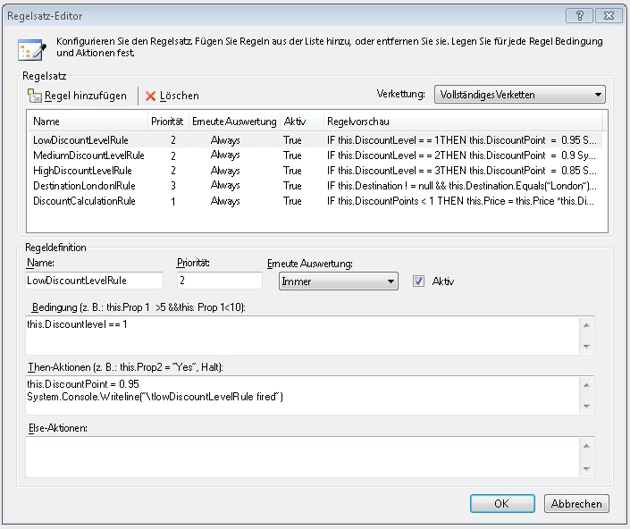
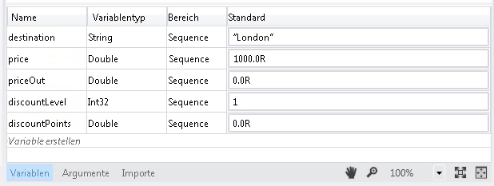
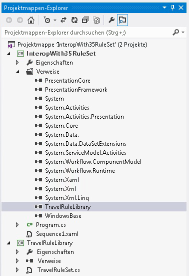
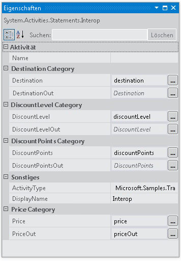

# <a name="interop-with-35-rule-set"></a><span data-ttu-id="c8775-102">Zusammenarbeit mit dem 3.5-Regelsatz</span><span class="sxs-lookup"><span data-stu-id="c8775-102">Interop with 3.5 Rule Set</span></span>
<span data-ttu-id="c8775-103">Dieses Beispiel veranschaulicht die Verwendung von der <xref:System.Activities.Statements.Interop> -Aktivität zur Integration mit einer benutzerdefinierten Aktivität in [!INCLUDE[netfx35_short](../../../../includes/netfx35-short-md.md)] mit <!--zz <xref:System.Workflow.Activities.Policy> --> `System.Workflow.Activities.Policy` und Regeln.</span><span class="sxs-lookup"><span data-stu-id="c8775-103">This sample demonstrates the use of the <xref:System.Activities.Statements.Interop> activity to integrate with a custom activity in [!INCLUDE[netfx35_short](../../../../includes/netfx35-short-md.md)] using <!--zz <xref:System.Workflow.Activities.Policy> --> `System.Workflow.Activities.Policy` and rules.</span></span> <span data-ttu-id="c8775-104">Es übergibt Daten an die benutzerdefinierte Aktivität, indem es [!INCLUDE[netfx_current_long](../../../../includes/netfx-current-long-md.md)]-Variablen an die von der benutzerdefinierten Aktivität verfügbar gemachten Abhängigkeitseigenschaften bindet.</span><span class="sxs-lookup"><span data-stu-id="c8775-104">It passes data to the custom activity by binding [!INCLUDE[netfx_current_long](../../../../includes/netfx-current-long-md.md)] variables to the dependency properties exposed by the custom activity.</span></span>  
  
## <a name="requirements"></a><span data-ttu-id="c8775-105">Anforderungen</span><span class="sxs-lookup"><span data-stu-id="c8775-105">Requirements</span></span>  
  
1.  [!INCLUDE[vs_current_long](../../../../includes/vs-current-long-md.md)]  
  
2.  [!INCLUDE[netfx_current_long](../../../../includes/netfx-current-long-md.md)]  
  
3.  [!INCLUDE[netfx35_long](../../../../includes/netfx35-long-md.md)]  
  
## <a name="demonstrates"></a><span data-ttu-id="c8775-106">Veranschaulicht</span><span class="sxs-lookup"><span data-stu-id="c8775-106">Demonstrates</span></span>  
 <span data-ttu-id="c8775-107"><xref:System.Activities.Statements.Interop> Aktivität <!--zz <xref:System.Workflow.Activities.Policy> --> `System.Workflow.Activities.Policy` -Aktivität in [!INCLUDE[netfx35_short](../../../../includes/netfx35-short-md.md)] mit Abhängigkeitseigenschaften</span><span class="sxs-lookup"><span data-stu-id="c8775-107"><xref:System.Activities.Statements.Interop> activity, <!--zz <xref:System.Workflow.Activities.Policy> --> `System.Workflow.Activities.Policy` activity in [!INCLUDE[netfx35_short](../../../../includes/netfx35-short-md.md)] with dependency properties</span></span>  
  
## <a name="discussion"></a><span data-ttu-id="c8775-108">Diskussion</span><span class="sxs-lookup"><span data-stu-id="c8775-108">Discussion</span></span>  
 <span data-ttu-id="c8775-109">Im Beispiel wird eines der Integrationsszenarien zum Integrieren in eine [!INCLUDE[netfx35_short](../../../../includes/netfx35-short-md.md)]-Aktivität veranschaulicht.</span><span class="sxs-lookup"><span data-stu-id="c8775-109">The sample demonstrates one of the integration scenarios for integrating with a [!INCLUDE[netfx35_short](../../../../includes/netfx35-short-md.md)] activity.</span></span> <span data-ttu-id="c8775-110">Dieses Beispiel enthält eine [!INCLUDE[netfx35_short](../../../../includes/netfx35-short-md.md)] benutzerdefinierte Aktivität, die aufruft, ein <!--zz <xref:System.Workflow.Activities.Policy> --> `System.Workflow.Activities.Policy` Aktivität.</span><span class="sxs-lookup"><span data-stu-id="c8775-110">This sample includes a [!INCLUDE[netfx35_short](../../../../includes/netfx35-short-md.md)] custom activity that invokes a <!--zz <xref:System.Workflow.Activities.Policy> --> `System.Workflow.Activities.Policy` activity.</span></span>  
  
## <a name="travelrulelibrary"></a><span data-ttu-id="c8775-111">TravelRuleLibrary</span><span class="sxs-lookup"><span data-stu-id="c8775-111">TravelRuleLibrary</span></span>  
 <span data-ttu-id="c8775-112">Beim Öffnen von TravelRuleSet.cs im Designer wird eine benutzerdefinierte sequenzielle Aktivität angezeigt, die eine Richtlinienaktivität enthält:</span><span class="sxs-lookup"><span data-stu-id="c8775-112">Opening TravelRuleSet.cs in the designer shows a custom sequential activity that contains a Policy activity as follows</span></span>  
  
 <span data-ttu-id="c8775-113"></span><span class="sxs-lookup"><span data-stu-id="c8775-113"></span></span>  
  
 <span data-ttu-id="c8775-114">Doppelklicken Sie auf die **DiscountPolicy** richtlinienaktivität, um die Regeln zu überprüfen.</span><span class="sxs-lookup"><span data-stu-id="c8775-114">Double-click the **DiscountPolicy** policy activity to examine the rules.</span></span> <span data-ttu-id="c8775-115">Der Regeleditor scheint die Regeln anzuzeigen.</span><span class="sxs-lookup"><span data-stu-id="c8775-115">The Rules editor appears to show the rules.</span></span>  
  
 <span data-ttu-id="c8775-116"></span><span class="sxs-lookup"><span data-stu-id="c8775-116"></span></span>  
  
 <span data-ttu-id="c8775-117">Mit der rechten Maustaste die **DiscountPolicy** Aktivität, und wählen die **Anzeigecode** Option aus, um den Code-beside-C#-Code zu untersuchen, die mit dieser Aktivität wechselt.</span><span class="sxs-lookup"><span data-stu-id="c8775-117">Right-click the **DiscountPolicy** activity and select the **View Code** option to examine the code-beside C# code that goes with this activity.</span></span> <span data-ttu-id="c8775-118">Achten Sie auf die Einstellung der Abhängigkeitseigenschaft für `DiscountLevel`.</span><span class="sxs-lookup"><span data-stu-id="c8775-118">Observe the dependency property setting for `DiscountLevel`.</span></span> <span data-ttu-id="c8775-119">Diese entspricht einem <xref:System.Activities.Argument> in [!INCLUDE[netfx_current_short](../../../../includes/netfx-current-short-md.md)].</span><span class="sxs-lookup"><span data-stu-id="c8775-119">This is equivalent to an <xref:System.Activities.Argument> in [!INCLUDE[netfx_current_short](../../../../includes/netfx-current-short-md.md)].</span></span>  
  
```  
public static DependencyProperty DiscountLevelProperty = DependencyProperty.Register("DiscountLevel", typeof(int), typeof(TravelRuleSet));  
  
[DescriptionAttribute("DiscountLevel")]  
[CategoryAttribute("DiscountLevel Category")]  
[BrowsableAttribute(true)]  
[DesignerSerializationVisibilityAttribute(DesignerSerializationVisibility.Visible)]  
public int DiscountLevel  
{  
   get  
   {  
return ((int)base.GetValue(TravelRuleSet.DiscountLevelProperty)));  
   }  
   set  
   {  
base.SetValue(TravelRuleSet.DiscountLevelProperty, value);  
   }  
}  
```  
  
## <a name="interopwith35ruleset"></a><span data-ttu-id="c8775-120">InteropWith35RuleSet</span><span class="sxs-lookup"><span data-stu-id="c8775-120">InteropWith35RuleSet</span></span>  
 <span data-ttu-id="c8775-121">Dies ist ein sequenzielles Workflowprojekt von [!INCLUDE[netfx_current_short](../../../../includes/netfx-current-short-md.md)], das die <xref:System.Activities.Statements.Interop>-Aktivität für die Integration mit dem im TravelRuleLibrary-Projekt erstellten benutzerdefinierten Regelsatz verwendet.</span><span class="sxs-lookup"><span data-stu-id="c8775-121">This is a [!INCLUDE[netfx_current_short](../../../../includes/netfx-current-short-md.md)] sequential workflow project that uses the <xref:System.Activities.Statements.Interop> activity to integrate with the custom rule set created in the TravelRuleLibrary project.</span></span> <span data-ttu-id="c8775-122">Variablen werden wie folgt auf der <xref:System.Activities.Statements.Sequence> der obersten Ebene erstellt.</span><span class="sxs-lookup"><span data-stu-id="c8775-122">Variables are created on the top-level <xref:System.Activities.Statements.Sequence> as follows.</span></span>  
  
 <span data-ttu-id="c8775-123"></span><span class="sxs-lookup"><span data-stu-id="c8775-123"></span></span>  
  
 <span data-ttu-id="c8775-124"></span><span class="sxs-lookup"><span data-stu-id="c8775-124"></span></span>  
  
 <span data-ttu-id="c8775-125">Schließlich wird die <xref:System.Activities.Statements.Interop>-Aktivität für die Integration mit TravelRuleSet verwendet.</span><span class="sxs-lookup"><span data-stu-id="c8775-125">Lastly, the <xref:System.Activities.Statements.Interop> activity is used to integrate with the TravelRuleSet.</span></span> <span data-ttu-id="c8775-126">Die Variablen, die zuvor in der <xref:System.Activities.Statements.Sequence> deklariert wurden, werden zum Binden an die Abhängigkeitseigenschaften verwendet.</span><span class="sxs-lookup"><span data-stu-id="c8775-126">The variables that were declared earlier on the <xref:System.Activities.Statements.Sequence> are used to bind to the dependency properties.</span></span>  
  
 <span data-ttu-id="c8775-127"></span><span class="sxs-lookup"><span data-stu-id="c8775-127"></span></span>  
  
 <span data-ttu-id="c8775-128"></span><span class="sxs-lookup"><span data-stu-id="c8775-128"></span></span>  
  
 <span data-ttu-id="c8775-129"></span><span class="sxs-lookup"><span data-stu-id="c8775-129"></span></span>  
  
> [!IMPORTANT]
>  <span data-ttu-id="c8775-130">Die Beispiele sind möglicherweise bereits auf dem Computer installiert.</span><span class="sxs-lookup"><span data-stu-id="c8775-130">The samples may already be installed on your machine.</span></span> <span data-ttu-id="c8775-131">Suchen Sie nach dem folgenden Verzeichnis (Standardverzeichnis), bevor Sie fortfahren.</span><span class="sxs-lookup"><span data-stu-id="c8775-131">Check for the following (default) directory before continuing.</span></span>  
>   
>  `<InstallDrive>:\WF_WCF_Samples`  
>   
>  <span data-ttu-id="c8775-132">Wenn dieses Verzeichnis nicht vorhanden ist, fahren Sie mit [Windows Communication Foundation (WCF) und Windows Workflow Foundation (WF) Samples für .NET Framework 4](https://go.microsoft.com/fwlink/?LinkId=150780) alle Windows Communication Foundation (WCF) herunterladen und [!INCLUDE[wf1](../../../../includes/wf1-md.md)] Beispiele.</span><span class="sxs-lookup"><span data-stu-id="c8775-132">If this directory does not exist, go to [Windows Communication Foundation (WCF) and Windows Workflow Foundation (WF) Samples for .NET Framework 4](https://go.microsoft.com/fwlink/?LinkId=150780) to download all Windows Communication Foundation (WCF) and [!INCLUDE[wf1](../../../../includes/wf1-md.md)] samples.</span></span> <span data-ttu-id="c8775-133">Dieses Beispiel befindet sich im folgenden Verzeichnis.</span><span class="sxs-lookup"><span data-stu-id="c8775-133">This sample is located in the following directory.</span></span>  
>   
>  `<InstallDrive>:\WF_WCF_Samples\WF\Basic\Built-InActivities\InteropWith35RuleSet`
