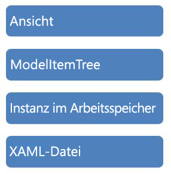

# <a name="programming-model-item-tree"></a><span data-ttu-id="1b3dd-102">Programmiermodell-Elementstruktur</span><span class="sxs-lookup"><span data-stu-id="1b3dd-102">Programming Model Item Tree</span></span>
<span data-ttu-id="1b3dd-103">In diesem Beispiel wird veranschaulicht, wie zum Navigieren der <xref:System.Activities.Presentation.Model.ModelItem> -Struktur mit der deklarativen Datenbindung der Windows Presentation Foundation (WPF)-Strukturansicht.</span><span class="sxs-lookup"><span data-stu-id="1b3dd-103">This sample demonstrates how to navigate the <xref:System.Activities.Presentation.Model.ModelItem> tree using declarative data binding from the Windows Presentation Foundation (WPF) Tree View.</span></span>

## <a name="sample-details"></a><span data-ttu-id="1b3dd-104">Beispieldetails</span><span class="sxs-lookup"><span data-stu-id="1b3dd-104">Sample Details</span></span>
 <span data-ttu-id="1b3dd-105">Die <xref:System.Activities.Presentation.Model.ModelItem>-Struktur ist die von der [!INCLUDE[wfd1](../../../../includes/wfd1-md.md)]-Infrastruktur verwendete Abstraktion zur Verfügbarmachung der Daten zur zugrunde liegenden Instanz, die bearbeitet wird.</span><span class="sxs-lookup"><span data-stu-id="1b3dd-105">The <xref:System.Activities.Presentation.Model.ModelItem> tree is the abstraction that is used by the [!INCLUDE[wfd1](../../../../includes/wfd1-md.md)] infrastructure to expose the data about the underlying instance being edited.</span></span> <span data-ttu-id="1b3dd-106">Die folgende Abbildung ist eine Darstellung der verschiedenen Ebenen der Infrastruktur innerhalb des [!INCLUDE[wfd2](../../../../includes/wfd2-md.md)].</span><span class="sxs-lookup"><span data-stu-id="1b3dd-106">The following illustration is a depiction of the various layers of infrastructure within the [!INCLUDE[wfd2](../../../../includes/wfd2-md.md)].</span></span>

 <span data-ttu-id="1b3dd-107"></span><span class="sxs-lookup"><span data-stu-id="1b3dd-107"></span></span>

 <span data-ttu-id="1b3dd-108">Ein <xref:System.Activities.Presentation.Model.ModelItem> enthält einen Zeiger auf den zugrunde liegenden Wert sowie eine Auflistung von <xref:System.Activities.Presentation.Model.ModelProperty>-Objekten.</span><span class="sxs-lookup"><span data-stu-id="1b3dd-108">A <xref:System.Activities.Presentation.Model.ModelItem> consists of a pointer to the underlying value, as well as a collection of <xref:System.Activities.Presentation.Model.ModelProperty> objects.</span></span> <span data-ttu-id="1b3dd-109">Ein <xref:System.Activities.Presentation.Model.ModelProperty>-Objekt umfasst wiederum Daten wie beispielsweise Name und Typ der Eigenschaft und einen Zeiger auf den Wert, bei dem es sich wiederum um ein <xref:System.Activities.Presentation.Model.ModelItem> handelt.</span><span class="sxs-lookup"><span data-stu-id="1b3dd-109">A <xref:System.Activities.Presentation.Model.ModelProperty> object in turn, consists of data such as the name and type of the property and then a pointer to the value, which in turn, is another <xref:System.Activities.Presentation.Model.ModelItem>.</span></span> <span data-ttu-id="1b3dd-110">Einige der von einer <xref:System.Activities.Presentation.Model.ModelItem> zurückgegebenen <xref:System.Activities.Presentation.Model.ModelProperty>-Elemente werden mit einem Wertkonverter bearbeitet, um sie korrekt in der Strukturansicht anzuzeigen.</span><span class="sxs-lookup"><span data-stu-id="1b3dd-110">A value converter is used to manipulate some of the <xref:System.Activities.Presentation.Model.ModelItem>s returned from a <xref:System.Activities.Presentation.Model.ModelProperty> to make them appear correctly in the tree view.</span></span> <span data-ttu-id="1b3dd-111">Im Beispiel wird dann die imperative Programmierung für die <xref:System.Activities.Presentation.Model.ModelItem>-Struktur mit der imperativen Syntax veranschaulicht wie im Folgenden gezeigt.</span><span class="sxs-lookup"><span data-stu-id="1b3dd-111">The sample then demonstrates how to imperatively program against the <xref:System.Activities.Presentation.Model.ModelItem> tree using the imperative syntax, as seen in the following example.</span></span>

```csharp
ModelItem mi = wd.Context.Services.GetService<ModelService>().Root;
ModelProperty mp = mi.Properties["Activities"];
mp.Collection.Add(new Persist());
ModelItem justAdded = mp.Collection.Last();
justAdded.Properties["DisplayName"].SetValue("new name");
```

#### <a name="to-use-this-sample"></a><span data-ttu-id="1b3dd-112">So verwenden Sie dieses Beispiel</span><span class="sxs-lookup"><span data-stu-id="1b3dd-112">To use this sample</span></span>

1.  <span data-ttu-id="1b3dd-113">Öffnen Sie die ProgrammingModelItemTree.sln-Projektmappe in Visual Studio 2010 ein.</span><span class="sxs-lookup"><span data-stu-id="1b3dd-113">Open the ProgrammingModelItemTree.sln solution in Visual Studio 2010.</span></span>

2.  <span data-ttu-id="1b3dd-114">Erstellen Sie die Projektmappe durch Auswahl **Projektmappe** aus der **erstellen** Menü.</span><span class="sxs-lookup"><span data-stu-id="1b3dd-114">Build the solution by selecting **Build Solution** from the **Build** menu.</span></span>

3.  <span data-ttu-id="1b3dd-115">Drücken Sie F5, um die Anwendung auszuführen.</span><span class="sxs-lookup"><span data-stu-id="1b3dd-115">Press F5 to run the application.</span></span> <span data-ttu-id="1b3dd-116">Das [!INCLUDE[avalon2](../../../../includes/avalon2-md.md)]-Formular wird angezeigt.</span><span class="sxs-lookup"><span data-stu-id="1b3dd-116">The [!INCLUDE[avalon2](../../../../includes/avalon2-md.md)] form is then displayed.</span></span>

4.  <span data-ttu-id="1b3dd-117">Klicken Sie auf die **Load WF** Schaltfläche, um das Laden der <xref:System.Activities.Presentation.Model.ModelItem> und an die Strukturansicht zu binden.</span><span class="sxs-lookup"><span data-stu-id="1b3dd-117">Click the **Load WF** button to load the <xref:System.Activities.Presentation.Model.ModelItem> and bind it to the tree view.</span></span>

5.  <span data-ttu-id="1b3dd-118">Klicken auf die **Change Model Item Tree** Schaltfläche führt den vorangehenden Code zum Hinzufügen eines Elements in der Struktur und eine Eigenschaft festzulegen.</span><span class="sxs-lookup"><span data-stu-id="1b3dd-118">Clicking the **Change Model Item Tree** button executes the preceding code to add an item into the tree and set a property.</span></span>

> [!IMPORTANT]
>  <span data-ttu-id="1b3dd-119">Die Beispiele sind möglicherweise bereits auf dem Computer installiert.</span><span class="sxs-lookup"><span data-stu-id="1b3dd-119">The samples may already be installed on your computer.</span></span> <span data-ttu-id="1b3dd-120">Suchen Sie nach dem folgenden Verzeichnis (Standardverzeichnis), bevor Sie fortfahren.</span><span class="sxs-lookup"><span data-stu-id="1b3dd-120">Check for the following (default) directory before continuing.</span></span>  
>   
>  `<InstallDrive>:\WF_WCF_Samples`  
>   
>  <span data-ttu-id="1b3dd-121">Wenn dieses Verzeichnis nicht vorhanden ist, fahren Sie mit [Windows Communication Foundation (WCF) und Windows Workflow Foundation (WF) Samples für .NET Framework 4](https://go.microsoft.com/fwlink/?LinkId=150780) alle Windows Communication Foundation (WCF) herunterladen und [!INCLUDE[wf1](../../../../includes/wf1-md.md)] Beispiele.</span><span class="sxs-lookup"><span data-stu-id="1b3dd-121">If this directory does not exist, go to [Windows Communication Foundation (WCF) and Windows Workflow Foundation (WF) Samples for .NET Framework 4](https://go.microsoft.com/fwlink/?LinkId=150780) to download all Windows Communication Foundation (WCF) and [!INCLUDE[wf1](../../../../includes/wf1-md.md)] samples.</span></span> <span data-ttu-id="1b3dd-122">Dieses Beispiel befindet sich im folgenden Verzeichnis.</span><span class="sxs-lookup"><span data-stu-id="1b3dd-122">This sample is located in the following directory.</span></span>  
>   
>  `<InstallDrive>:\WF_WCF_Samples\WF\Basic\Designer\ProgrammingModelItemTree`  
  
## <a name="see-also"></a><span data-ttu-id="1b3dd-123">Siehe auch</span><span class="sxs-lookup"><span data-stu-id="1b3dd-123">See Also</span></span>  
 <xref:System.Windows.Data.IValueConverter>
