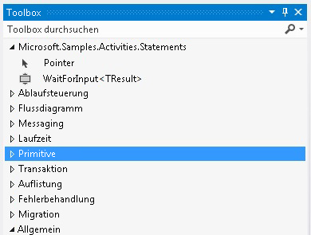

# Warten auf EingabeaktivitätWait For Input Activity
Dieses Beispiel veranschaulicht, wie benannte Lesezeichen in einem Workflow erstellt werden.This sample demonstrates how to create named bookmarks in a workflow. Windows Workflow Foundation (WF) stellt keine Aktivität zur deklarativen lesezeichenerstellung bereit.Windows Workflow Foundation (WF) does not provide an activity for declarative bookmark creation. Wenn Sie daher in Ihrem Workflow ein Lesezeichen erstellen möchten, müssen Sie eine benutzerdefinierte Aktivität schreiben, die eines erstellt.Therefore, when you want to create a bookmark in your workflow, you must write a custom activity that creates it. Die in diesem Beispiel definierte `WaitForInput`-Aktivität stellt diese Funktionalität bereit, damit Benutzer Lesezeichen deklarativ innerhalb eines Workflows erstellen können.The `WaitForInput` activity defined in this sample provides this functionality, so that users can create bookmarks declaratively within a workflow.  
  
## Projekte in diesem BeispielProjects in this sample  
  
|**Projektname****Project Name**|**Beschreibung****Description**|**Hauptdateien****Main Files**|  
|-|-|-|  
|WaitForInputWaitForInput|Enthält die `WaitForInput`-Aktivität und ihren Designer.Contains `WaitForInput` activity and its designer|WaitForInput.csWaitForInput.cs   Definition der `WaitForInput`-Aktivität.`WaitForInput` activity definition.|  
|||WaitForInputDesigner.xamlWaitForInputDesigner.xaml   Benutzerdefinierter Designer für die `WaitForInput`-Aktivität.Custom designer for the `WaitForInput` activity.|  
|||TypeToFirstGenericArgumentConverter.csTypeToFirstGenericArgumentConverter.cs   WPF-Typkonverter, der verwendet wird, um den generischen Typ der Aktivität im Designer zu aktualisieren.WPF type converter used to update the generic type of the activity in the designer.|  
|WaitForInputTestClientWaitForInputTestClient|Beispielclientanwendung, die mithilfe des Workflow-Designers unter Verwendung mehrerer WaitForInput-Aktivitäten einen Workflow konfiguriert und ausführt.Sample client application that configures and runs a workflow using several WaitForInput activities using the workflow designer.|Sequence1.xamlSequence1.xaml   Ein sequenzieller Workflow, der die `WaitForInput`-Aktivität verwendet.A sequential workflow that uses the `WaitForInput` activity.|  
|||Program.csProgram.cs   Führt eine Instanz des in "Sequence1.xaml" definierten Workflows aus.Runs an instance of the workflow defined in Sequence1.xaml.|  
  
## WaitForInput-AktivitätWaitForInput Activity  
 Die `WaitForInput`-Aktivität erstellt in einem Workflow ein benanntes Lesezeichen.The `WaitForInput` activity creates a named bookmark in a workflow. Das Lesezeichen wartet auf ein Signal und empfängt Daten von seinem konfigurierten Typ.The bookmark waits for a signal and receives data of its configured type. Nachdem das Lesezeichen wiederaufgenommen wurde, sind die an den Workflow übergebenen Daten über die `Result`-Eigenschaft verfügbar.After the bookmark is resumed the data passed into the workflow is available through the `Result` property.  
  
 Die `WaitForInput`-Aktivität wird von der <xref:System.Activities.NativeActivity>-Klasse abgeleitet, da sie Lesezeichen erstellen muss, auf die nur durch die <xref:System.Activities.NativeActivityContext>-Klasse zugegriffen werden kann.The `WaitForInput` activity derives from the <xref:System.Activities.NativeActivity> class because it must create bookmarks, which are only accessible through the <xref:System.Activities.NativeActivityContext> class.  
  
 Auf die Aktivität können zur Bindung an einen Designer, zum Hinzufügen der generischen Argumentfunktion, die aktualisiert werden kann, und zum Festlegen der standardmäßigen generischen Typs auf "Zeichenfolge" drei Attribute angewendet werden.The activity has three attributes applied to it for binding a designer, adding the generic argument feature that can be updated, and setting the default generic type to string. Die Aktivität weist auch die in der folgenden Tabelle aufgeführten Argumente auf.The activity also has the arguments  listed in the following table.  
  
|**Name****Name**|**Type****Type**|**Beschreibung****Description**|  
|-|-|-|  
|TResultTResult|Generisches Argument (TResult)Generic argument (TResult)|Der Typ des Lesezeichens.Type of the bookmark. Dies ist der Typ der Daten, der beim Wiederaufnehmen des Lesezeichens an das Lesezeichen übergeben werden soll.This is the type of the data to be passed to the bookmark when resumed.|  
|BookmarkNameBookmarkName|InArgument\<Zeichenfolge >InArgument\<string>|Der Name des Lesezeichens.Name of the bookmark.|  
|ErgebnisResult|InArgument\<TResult >InArgument\<TResult>|Die Daten, die an die Aktivität übergeben werden, wenn das Lesezeichen wiederaufgenommen wird.Data passed to the activity when the bookmark is resumed.|  
  
## WaitForInput-AktivitätsdesignerWaitForInput activity designer  
 Der `WaitForInput`-Aktivitätsdesigner wird in der Datei "WaitForInputDesigner.xaml" implementiert.The `WaitForInput` activity designer is implemented in the WaitForInputDesigner.xaml file. Die `WaitForInput`-Aktivität und ihr Designer sind in derselben Assembly enthalten.The `WaitForInput` activity and its designer are included in the same assembly. In der folgenden Abbildung ist die `WaitForInput`-Aktivität in der Toolbox innerhalb einer Kategorie dargestellt, die denselben Namen wie die Assembly hat.The following graphic shows the `WaitForInput` activity in the toolbox within a category that has the same name as the assembly.  
  
   
  
 In der folgenden Abbildung ist der `WaitForInput`-Designer dargestellt.The following graphic shows the `WaitForInput` designer. Da die `WaitForInput`-Aktivität ist sehr einfach ist, können alle Argumente im Designer direkt in der Designeroberfläche festgelegt werden.Because, the `WaitForInput` activity is very basic, the designer allows setting all its arguments directly in the designer surface.  
  
   
  
#### So verwenden Sie dieses BeispielTo use this sample  
  
1.  Öffnen Sie Datei "WaitForInput.sln" in [!INCLUDE[vs2010](../../../../includes/vs2010-md.md)].Using [!INCLUDE[vs2010](../../../../includes/vs2010-md.md)], open the WaitForInput.sln file.  
  
2.  Drücken Sie STRG+UMSCHALT+B, um die Projektmappe zu erstellen.To build the solution, press CTRL+SHIFT+B.  
  
3.  Drücken Sie STRG+F5, um den das Beispiel zu starten.To start the sample without debugging, press CTRL+F5.  
  
> [!IMPORTANT]
>  Die Beispiele sind möglicherweise bereits auf dem Computer installiert.The samples may already be installed on your machine. Suchen Sie nach dem folgenden Verzeichnis (Standardverzeichnis), bevor Sie fortfahren.Check for the following (default) directory before continuing.  
>   
>  `<InstallDrive>:\WF_WCF_Samples`  
>   
>  Wenn dieses Verzeichnis nicht vorhanden ist, fahren Sie mit [Windows Communication Foundation (WCF) und Windows Workflow Foundation (WF) Samples für .NET Framework 4](https://go.microsoft.com/fwlink/?LinkId=150780) alle Windows Communication Foundation (WCF) herunterladen und [!INCLUDE[wf1](../../../../includes/wf1-md.md)] Beispiele.If this directory does not exist, go to [Windows Communication Foundation (WCF) and Windows Workflow Foundation (WF) Samples for .NET Framework 4](https://go.microsoft.com/fwlink/?LinkId=150780) to download all Windows Communication Foundation (WCF) and [!INCLUDE[wf1](../../../../includes/wf1-md.md)] samples. Dieses Beispiel befindet sich im folgenden Verzeichnis.This sample is located in the following directory.  
>   
>  `<InstallDrive>:\WF_WCF_Samples\WF\Scenario\ActivityLibrary\WaitForInput`