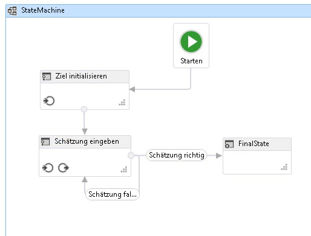
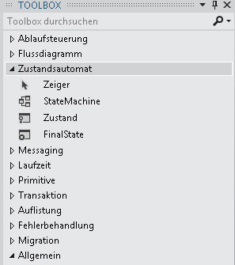

# ZustandsautomatworkflowsState Machine Workflows
Ein Zustandsautomat ist ein bekanntes Paradigma zum Entwickeln von Anwendungen.A state machine is a well-known paradigm for developing programs. Die <xref:System.Activities.Statements.StateMachine>-Aktivität kann zusammen mit <xref:System.Activities.Statements.State>, <xref:System.Activities.Statements.Transition> und anderen Aktivitäten verwendet werden, um Zustandsautomatenworkflow-Programme zu erstellen.The <xref:System.Activities.Statements.StateMachine> activity, along with <xref:System.Activities.Statements.State>, <xref:System.Activities.Statements.Transition>, and other activities can be used to build state machine workflow programs. Dieses Thema bietet eine Übersicht über das Erstellen von Zustandsautomatenworkflows.This topic provides an overview of creating state machine workflows.  
  
## Übersicht über ZustandsautomatenworkflowsState Machine Workflow Overview  
 Zustandsautomatenworkflows bieten eine Möglichkeit, Workflows in einer ereignisgesteuerten Weise zu modellieren.State machine workflows provide a modeling style with which you can model your workflow in an event-driven manner. Eine <xref:System.Activities.Statements.StateMachine>-Aktivität enthält die Zustände und Übergänge, aus denen sich die Logik des Zustandsautomaten aufbaut, und kann überall dort verwendet werden, wo eine Aktivität verwendet werden kann.A <xref:System.Activities.Statements.StateMachine> activity contains the states and transitions that make up the logic of the state machine, and can be used anywhere an activity can be used. Es gibt mehrere Klassen in der Zustandsautomat-Laufzeit:There are several classes in the state machine runtime:  
  
-   <xref:System.Activities.Statements.StateMachine>  
  
-   <xref:System.Activities.Statements.State>  
  
-   <xref:System.Activities.Statements.Transition>  
  
 Um einen Zustandsautomatenworkflow erstellen, werden die Zustände einer <xref:System.Activities.Statements.StateMachine>-Aktivität hinzugefügt. Übergänge werden verwendet, um den Fluss zwischen den Zuständen zu steuern.To create a state machine workflow, states are added to a <xref:System.Activities.Statements.StateMachine> activity, and transitions are used control the flow between states. Der folgende Screenshot aus der [Lernprogramm für erste Schritte](../../../docs/framework/windows-workflow-foundation/getting-started-tutorial.md) Schritt [Vorgehensweise: Erstellen Sie einen Zustandsautomatworkflow](../../../docs/framework/windows-workflow-foundation/how-to-create-a-state-machine-workflow.md), zeigt ein zustandsautomatenworkflow mit drei Zustände und Übergänge drei.The following screenshot, from the [Getting Started Tutorial](../../../docs/framework/windows-workflow-foundation/getting-started-tutorial.md) step [How to: Create a State Machine Workflow](../../../docs/framework/windows-workflow-foundation/how-to-create-a-state-machine-workflow.md), shows a state machine workflow with three states and three transitions. **Ziel initialisieren** ist der Anfangszustand und stellt den ersten Zustand im Workflow dar.**Initialize Target** is the initial state and represents the first state in the workflow. Dadurch wird festgelegt, durch die Linie, die führende aus der **starten** Knoten.This is designated by the line leading to it from the **Start** node. Der Endzustand im Workflow wird mit dem Namen **FinalState**, und stellt den Punkt, an dem der Workflow abgeschlossen ist.The final state in the workflow is named **FinalState**, and represents the point at which the workflow is completed.  
  
   
  
 Ein Zustandsautomatenworkflow muss über genau einen Anfangszustand und mindestens einen Endzustand verfügen.A state machine workflow must have one and only one initial state, and at least one final state. Jeder Zustand, der kein Endzustand ist, muss mindestens einen Übergang enthalten.Each state that is not a final state must have at least one transition. In den folgenden Abschnitten wird das Erstellen und Konfigurieren von Zuständen und Übergängen erläutert.The following sections cover creating and configuring states and transitions.  
  
## Erstellen und Konfigurieren von ZuständenCreating and Configuring States  
 <xref:System.Activities.Statements.State> stellt einen Zustand dar, in dem sich ein Zustandsautomat befinden kann.A <xref:System.Activities.Statements.State> represents a state in which a state machine can be in. Hinzufügen einer <xref:System.Activities.Statements.State> für einen Workflow, ziehen Sie die **Status** Aktivitäts-Designer aus der **Zustandsautomat** im Abschnitt der **Toolbox** und legen ihn auf eine <xref:System.Activities.Statements.StateMachine> Aktivität auf die [!INCLUDE[wfd1](../../../includes/wfd1-md.md)] Oberfläche.To add a <xref:System.Activities.Statements.State> to a workflow, drag the **State** activity designer from the **State Machine** section of the **Toolbox** and drop it onto a <xref:System.Activities.Statements.StateMachine> activity on the [!INCLUDE[wfd1](../../../includes/wfd1-md.md)] surface.  
  
   
  
 So konfigurieren Sie einen Zustand als das **Anfangszustand**mit der rechten Maustaste auf den Zustand, und wählen Sie **als Anfangszustand festlegen**.To configure a state as the **Initial State**, right-click the state and select **Set as Initial State**. Darüber hinaus ist kein Anfangszustand, der anfängliche Zustand kann gekennzeichnet werden durch Ziehen eine Zeile aus der **starten** Knoten am oberen Rand des Workflows auf den gewünschten Zustand.Additionally, if there is no current initial state, the initial state can be designated by dragging a line from the **Start** node at the top of the workflow to the desired state. Wenn eine <xref:System.Activities.Statements.StateMachine> Aktivität dem Workflow-Designer abgelegt wird, wird Sie vorkonfiguriert, dass mit einem Anfangszustand mit dem Namen **State1**.When a <xref:System.Activities.Statements.StateMachine> activity is dropped onto the workflow designer, it is pre-configured with an initial state named **State1**. Ein Zustandsautomatenworkflow muss über genau einen Anfangszustand verfügen.A state machine workflow must have one and only one initial state.  
  
 Ein Zustand, der einen beendenden Zustand in einem Zustandsautomaten darstellt, wird als Endzustand bezeichnet.A state that represents a terminating state in a state machine is called a final state. Ein Endzustand ist ein Zustand, dessen <xref:System.Activities.Statements.State.IsFinal%2A>-Eigenschaft auf `true` festgelegt ist, der keine <xref:System.Activities.Statements.State.Exit%2A>-Aktivität aufweist und von dem keine Übergänge ausgehen.A final state is a state that has its <xref:System.Activities.Statements.State.IsFinal%2A> property set to `true`, has no <xref:System.Activities.Statements.State.Exit%2A> activity, and no transitions originating from it. Um einem Workflow einen Endzustand hinzuzufügen, ziehen Sie eine **FinalState** Aktivitäts-Designer aus der **Zustandsautomat** Teil der **Toolbox** und legen ihn auf eine <xref:System.Activities.Statements.StateMachine> Aktivität auf die [!INCLUDE[wfd1](../../../includes/wfd1-md.md)] Oberfläche.To add a final state to a workflow, drag a **FinalState** activity designer from the **State Machine** section of the **Toolbox** and drop it onto a <xref:System.Activities.Statements.StateMachine> activity on the [!INCLUDE[wfd1](../../../includes/wfd1-md.md)] surface. Ein Zustandsautomatenworkflow muss über mindestens einen Endzustand verfügen.A state machine workflow must have at least one final state.  
  
### Konfigurieren von Eingangs- und AusgangsaktionenConfiguring Entry and Exit Actions  
 Ein Zustand kann über eine <xref:System.Activities.Statements.State.Entry%2A>-Aktion und eine <xref:System.Activities.Statements.State.Exit%2A>-Aktion verfügen.A state can have an <xref:System.Activities.Statements.State.Entry%2A> and an <xref:System.Activities.Statements.State.Exit%2A> action. (Ein als Endzustand konfigurierter Zustand darf nur über eine Eingangsaktion verfügen.)(A state configured as a final state may have only an entry action). Wenn eine Workflowinstanz in einen Zustand wechselt, werden alle Aktivitäten in der Eingangsaktion ausgeführt.When a workflow instance enters a state, any activities in the entry action execute. Wenn die Eingangsaktion abgeschlossen ist, werden die Trigger für die Übergänge des Zustands geplant.When the entry action is complete, the triggers for the state’s transitions are scheduled. Wenn ein Übergang zu einem anderen Status bestätigt wird, werden die Aktivitäten in der Ausgangsaktion auch dann ausgeführt, wenn der Zustand wieder in denselben Zustand übergeht.When a transition to another state is confirmed, the activities in the exit action are executed, even if the state transitions back to the same state. Nachdem die Ausgangsaktion abgeschlossen wurde, werden die Aktivitäten in der Aktion des Übergangs ausgeführt. Anschließend findet ein Übergang in den neuen Zustand statt, und dessen Eingangsaktionen werden geplant.After the exit action completes, the activities in the transition’s action execute, and then the new state is transitioned to, and its entry actions are scheduled.  
  
> [!NOTE]
>  Wenn Sie einen Zustandsautomatenworkflow debuggen, können Haltepunkte für die Stammaktivität des Zustandsautomaten und für Zustände innerhalb des Zustandsautomatenworkflows festgelegt werden.When debugging a state machine workflow, breakpoints can be placed on the root state machine activity and states within the state machine workflow. Haltepunkte können nicht direkt in die Übergänge eingefügt werden, sie können jedoch für alle Aktivitäten festgelegt werden, die in den Zuständen und Übergängen enthalten sind.Breakpoints may not be placed directly on the transitions, but they may be placed on any activities contained within the states and transitions.  
  
## Erstellen und Konfigurieren von ÜbergängenCreating and Configuring Transitions  
 Alle Zustände mit Ausnahme eines Endzustands, der keine Übergänge aufweisen darf, müssen über mindestens einen Übergang verfügen.All states must have at least one transition, except for a final state which may not have any transitions. Übergänge können hinzugefügt werden, nachdem ein Zustand einem Zustandsautomatenworkflow hinzugefügt wurde, oder sie können beim Ablegen des Zustands erstellt werden.Transitions may be added after a state is added to a state machine workflow, or they can be created as the state is dropped.  
  
 Hinzufügen einer <xref:System.Activities.Statements.State> und einen Übergang zu erstellen, in einem Schritt, ziehen Sie eine **Status** Aktivität aus der **Zustandsautomat** Teil der **Toolbox** und zeigen sie auf einen anderen Zustand im der Workflowdesigner.To add a <xref:System.Activities.Statements.State> and create a transition in one step, drag a **State** activity from the **State Machine** section of the **Toolbox** and hover it over another state in the workflow designer. Sobald sich der gezogene <xref:System.Activities.Statements.State> über einem anderen <xref:System.Activities.Statements.State> befindet, werden vier Dreiecke um den anderen <xref:System.Activities.Statements.State> herum eingeblendet.When the dragged <xref:System.Activities.Statements.State> is over another <xref:System.Activities.Statements.State>, four triangles will appear around the other <xref:System.Activities.Statements.State>. Wenn <xref:System.Activities.Statements.State> auf einem der vier Dreiecke abgelegt wird, wird er dem Zustandsautomaten hinzugefügt, und es wird ein Übergang vom Quell-<xref:System.Activities.Statements.State> zum abgelegten Ziel-<xref:System.Activities.Statements.State> erstellt.If the <xref:System.Activities.Statements.State> is dropped onto one of the four triangles, it is added to the state machine and a transition is created from the source <xref:System.Activities.Statements.State> to the dropped destination <xref:System.Activities.Statements.State>. Weitere Informationen finden Sie unter [Übergangsaktivitäts-Designer](/visualstudio/workflow-designer/transition-activity-designer).For more information, see [Transition Activity Designer](/visualstudio/workflow-designer/transition-activity-designer).  
  
 Um einen Übergang zu erstellen, nachdem ein Zustand hinzugefügt wurde, gibt es zwei Möglichkeiten.To create a transition after a state is added, there are two options. Die erste Möglichkeit besteht darin, den Zustand aus der Workflow-Designeroberfläche auf einen vorhandenen Zustand zu ziehen und auf einem der Ablegepunkte abzulegen.The first option is to drag the state from the workflow designer surface and hover it over an existing state and drop it on one of the drop points. Dies ist der Methode sehr ähnlich, die im vorherigen Abschnitt beschrieben wird.This is very similar to the method described in the previous section. Sie können auch mit der Maus auf den gewünschten Quellzustand zeigen und eine Linie zum gewünschten Zielzustand ziehen.You can also hover the mouse over the desired source state, and drag a line to the desired destination state.  
  
> [!NOTE]
>  Ein einzelner Zustand eines Zustandsautomaten kann bis zu 76 Übergänge aufweisen, die mithilfe des Workflow-Designers erstellt wurden.A single state in a state machine can have up to 76 transitions created using the workflow designer. Die Anzahl der Zustandsübergänge für Workflows, die außerhalb des Designers erstellt werden, wird nur durch die verfügbaren Systemressourcen beschränkt.The limit on transitions for a state for workflows created outside the designer is limited only by system resources.  
  
 Ein Übergang kann über <xref:System.Activities.Statements.Transition.Trigger%2A>, <xref:System.Activities.Statements.Transition.Condition%2A> und <xref:System.Activities.Statements.Transition.Action%2A> verfügen.A transition may have a <xref:System.Activities.Statements.Transition.Trigger%2A>, a <xref:System.Activities.Statements.Transition.Condition%2A>, and an <xref:System.Activities.Statements.Transition.Action%2A>. Der <xref:System.Activities.Statements.Transition.Trigger%2A> eines Übergangs wird geplant, wenn die <xref:System.Activities.Statements.State.Entry%2A>-Aktion der Quelle des Übergangs abgeschlossen ist.A transition’s <xref:System.Activities.Statements.Transition.Trigger%2A> is scheduled when the transition’s source state’s <xref:System.Activities.Statements.State.Entry%2A> action is complete. In der Regel ist <xref:System.Activities.Statements.Transition.Trigger%2A> eine Aktivität, die darauf wartet, dass ein Ereignis eintritt. Er kann jedoch auch eine beliebige oder gar keine Aktivität darstellen.Typically the <xref:System.Activities.Statements.Transition.Trigger%2A> is an activity that waits for some type of event to occur, but it can be any activity, or no activity at all. Sobald die <xref:System.Activities.Statements.Transition.Trigger%2A>-Aktivität abgeschlossen ist, wird <xref:System.Activities.Statements.Transition.Condition%2A> ausgewertet, falls vorhanden.Once the <xref:System.Activities.Statements.Transition.Trigger%2A> activity is complete, the <xref:System.Activities.Statements.Transition.Condition%2A>, if present, is evaluated. Wenn keine <xref:System.Activities.Statements.Transition.Trigger%2A>-Aktivität vorhanden ist, wird <xref:System.Activities.Statements.Transition.Condition%2A> sofort ausgewertet.If there is no <xref:System.Activities.Statements.Transition.Trigger%2A> activity then the <xref:System.Activities.Statements.Transition.Condition%2A> is immediately evaluated. Wenn die Bedingung `false` ergibt, wird der Übergang abgebrochen und die <xref:System.Activities.Statements.Transition.Trigger%2A>-Aktivität für alle Übergänge aus dem Zustand neu geplant.If the condition evaluates to `false`, the transition is cancelled, and the <xref:System.Activities.Statements.Transition.Trigger%2A> activity for all transitions from the state are rescheduled. Sind andere Übergänge vorhanden, die den gleichen Quellzustand wie der aktuelle Übergang aufweisen, werden diese <xref:System.Activities.Statements.Transition.Trigger%2A>-Aktionen ebenfalls abgebrochen und neu geplant.If there are other transitions that share the same source state as the current transition, those <xref:System.Activities.Statements.Transition.Trigger%2A> actions are cancelled and rescheduled as well. Wenn <xref:System.Activities.Statements.Transition.Condition%2A>`true` ergibt oder keine Bedingung vorhanden ist, wird die <xref:System.Activities.Statements.State.Exit%2A>-Aktion des Quellzustands ausgeführt, und dann wird <xref:System.Activities.Statements.Transition.Action%2A> des Übergangs ausgeführt.If the <xref:System.Activities.Statements.Transition.Condition%2A> evaluates to `true`, or there is no condition, then the <xref:System.Activities.Statements.State.Exit%2A> action of the source state is executed, and then the <xref:System.Activities.Statements.Transition.Action%2A> of the transition is executed. Wenn die <xref:System.Activities.Statements.Transition.Action%2A> abgeschlossen ist, die Steuerung an die **Ziel** ZustandWhen the <xref:System.Activities.Statements.Transition.Action%2A> completes, control passes to the **Target** state  
  
 Übergänge, die einen gemeinsamen Trigger verwenden, werden als gemeinsamer Triggerübergang bezeichnet.Transitions that share a common trigger are known as shared trigger transitions. Jeder Übergang in einer Gruppe von gemeinsamen Triggerübergängen verfügt über denselben Trigger, aber über eine eindeutige <xref:System.Activities.Statements.Transition.Condition%2A> und eine eindeutige Aktion.Each transition in a group of shared trigger transitions has the same trigger, but a unique <xref:System.Activities.Statements.Transition.Condition%2A> and Action. Um einem Übergang zusätzliche Aktionen hinzuzufügen und einen gemeinsamen Übergang zu erstellen, klicken Sie auf den Kreis, der den Anfang des gewünschten Übergangs angibt, und ziehen Sie ihn auf den gewünschten Zustand.To add additional actions to a transition and create a shared transition, click the circle that indicates the start of the desired transition and drag it to the desired state. Der neue Übergang verwendet denselben Trigger wie der Anfangsübergang, besitzt jedoch eine eindeutige Bedingung und Aktion.The new transition will share a same trigger as the initial transition, but it will have a unique condition and action. Gemeinsame Übergänge können auch aus erstellt werden innerhalb des Übergangs-Designers durch Klicken auf **gemeinsamen triggerübergang hinzufügen** am unteren Rand des Übergangs-Designers, und wählen Sie dann den gewünschten Zielzustand aus der  **Verfügbare Zustände für Verbindung** Dropdownliste aus.Shared transitions can also be created from within the transition designer by clicking **Add shared trigger transition** at the bottom of the transition designer, and then selecting the desired target state from the **Available states to connect** drop-down.  
  
> [!NOTE]
>  Wenn die <xref:System.Activities.Statements.Transition.Condition%2A>-Aktivität eines Übergangs mit `False` ausgewertet wird (oder alle Bedingungen eines Übergangs mit freigegebenem Trigger mit `False` ausgewertet werden), erfolgt der Übergang nicht, und die Trigger aller Übergänge aus dem Zustand werden neu geplant.Note that if the <xref:System.Activities.Statements.Transition.Condition%2A> of a transition evaluates to `False` (or all of the conditions of a shared trigger transition evaluate to `False`), the transition will not occur and all triggers for all the transitions from the state will be rescheduled.  
  
 Weitere Informationen zum Erstellen von Zustandsautomatworkflows, finden Sie unter [Vorgehensweise: Erstellen Sie einen Zustandsautomatworkflow](../../../docs/framework/windows-workflow-foundation/how-to-create-a-state-machine-workflow.md), [StateMachine-Aktivitäts-Designer](/visualstudio/workflow-designer/statemachine-activity-designer), [Zustand Aktivitäts-Designer](/visualstudio/workflow-designer/state-activity-designer), [FinalState-Aktivitäts-Designer](/visualstudio/workflow-designer/finalstate-activity-designer), und [Übergang Aktivitäts-Designer](/visualstudio/workflow-designer/transition-activity-designer).For more information on creating state machine workflows, see [How to: Create a State Machine Workflow](../../../docs/framework/windows-workflow-foundation/how-to-create-a-state-machine-workflow.md), [StateMachine Activity Designer](/visualstudio/workflow-designer/statemachine-activity-designer), [State Activity Designer](/visualstudio/workflow-designer/state-activity-designer), [FinalState Activity Designer](/visualstudio/workflow-designer/finalstate-activity-designer), and [Transition Activity Designer](/visualstudio/workflow-designer/transition-activity-designer).  
  
## Terminologie für ZustandsautomatenState Machine Terminology  
 In diesem Abschnitt werden die in diesem Thema verwendeten Begriffe im Hinblick auf Zustandsautomaten erläutert.This section defines the state machine vocabulary used throughout this topic.  
  
 ZustandState  
 Die Basiseinheit, aus der ein Zustandsautomat besteht.The basic unit that composes a state machine. Ein Zustandsautomat kann zu einem bestimmten Zeitpunkt jeweils einen Zustand aufweisen.A state machine can be in one state at any particular time.  
  
 EingangsaktionEntry Action  
 Eine Aktivität, die beim Eintritt in den Zustand ausgeführt wird.An activity executed when entering the state  
  
 AusgangsaktionExit Action  
 Eine Aktivität, die beim Austritt aus dem Zustand ausgeführt wird.An activity executed when exiting the state  
  
 ÜbergangTransition  
 Eine spezielle Beziehung zwischen zwei Zuständen, die die vollständige Antwort eines Zustandsautomaten auf das Eintreten eines Ereignisses eines bestimmten Typs darstellt.A directed relationship between two states which represents the complete response of a state machine to an occurrence of an event of a particular type.  
  
 Gemeinsamer ÜbergangShared Transition  
 Ein Übergang, der denselben Quellzustand und Trigger wie mindestens ein anderer Übergang verwendet, jedoch über eine eindeutige Bedingung und Aktion verfügt.A transition that shares a source state and trigger with one or more transitions, but has a unique condition and action.  
  
 TriggerTrigger  
 Eine Triggeraktivität, die einen Übergang auslöst.A triggering activity that causes a transition to occur.  
  
 BedingungCondition  
 Eine Einschränkung, die nach dem Auftreten des Triggers `true` ergeben muss, damit der Übergang abgeschlossen wird.A constraint which must evaluate to `true` after the trigger occurs in order for the transition to complete.  
  
 ÜbergangsaktionTransition Action  
 Eine Aktivität, die ausgeführt wird, wenn ein bestimmter Übergang ausgeführt wird.An activity which is executed when performing a certain transition.  
  
 Bedingter ÜbergangConditional Transition  
 Ein Übergang mit einer expliziten Bedingung.A transition with an explicit condition.  
  
 SelbstübergangSelf-transition  
 Ein Übergang, der von einem Zustand in denselben Übergang übergeht.A transition which transits from a state to itself.  
  
 AnfangszustandInitial State  
 Ein Zustand, der den Anfangspunkt des Zustandsautomaten darstellt.A state which represents the starting point of the state machine.  
  
 EndzustandFinal State  
 Ein Zustand, der den Abschluss des Zustandsautomaten darstellt.A state which represents the completion of the state machine.  
  
## Siehe auchSee Also  
 [Vorgehensweise: Erstellen eines ZustandsautomatenworkflowsHow to: Create a State Machine Workflow](../../../docs/framework/windows-workflow-foundation/how-to-create-a-state-machine-workflow.md)  
 [StateMachine-AktivitätsdesignerStateMachine Activity Designer](/visualstudio/workflow-designer/statemachine-activity-designer)  
 [Zustands-AktivitätsdesignerState Activity Designer](/visualstudio/workflow-designer/state-activity-designer)  
 [FinalState-AktivitätsdesignerFinalState Activity Designer](/visualstudio/workflow-designer/finalstate-activity-designer)  
 [Übergangsaktivitäts-DesignerTransition Activity Designer](/visualstudio/workflow-designer/transition-activity-designer)
