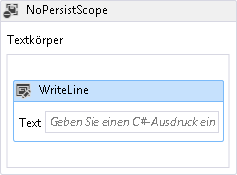
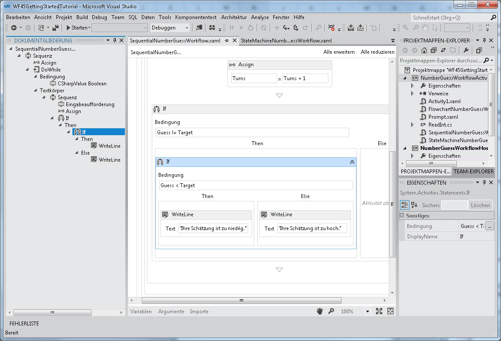
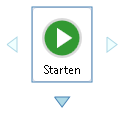
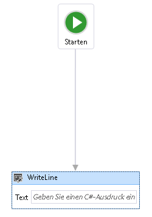
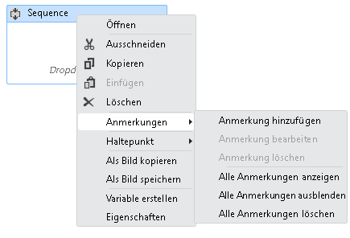

# <a name="what39s-new-in-windows-workflow-foundation-in-net-45"></a><span data-ttu-id="7fc4e-102">Was &#39; s neu in Windows Workflow Foundation in .NET 4.5</span><span class="sxs-lookup"><span data-stu-id="7fc4e-102">What&#39;s New in Windows Workflow Foundation in .NET 4.5</span></span>
[!INCLUDE[wf](../../../includes/wf-md.md)]<span data-ttu-id="7fc4e-103"> in [!INCLUDE[net_v45](../../../includes/net-v45-md.md)] verfügt über viele neue Funktionen wie neue Aktivitäten, Designer-Funktionen und Modelle für die Workflowentwicklung.</span><span class="sxs-lookup"><span data-stu-id="7fc4e-103"> in [!INCLUDE[net_v45](../../../includes/net-v45-md.md)] introduces many new features, such as new activities, designer capabilities, and workflow development models.</span></span> <span data-ttu-id="7fc4e-104">Viele, aber nicht alle der neuen mit [!INCLUDE[net_v45](../../../includes/net-v45-md.md)] eingeführten Workflowfunktionen werden im neu gehosteten Workflow-Designer unterstützt.</span><span class="sxs-lookup"><span data-stu-id="7fc4e-104">Many, but not all, of the new workflow features introduced in [!INCLUDE[net_v45](../../../includes/net-v45-md.md)] are supported in the re-hosted workflow designer.</span></span> [!INCLUDE[crabout](../../../includes/crabout-md.md)]<span data-ttu-id="7fc4e-105">die neuen Funktionen, die unterstützt werden, finden Sie unter [Unterstützung für neue Workflow Foundation 4.5-Funktionen im Workflow-Designer neu gehostet](../../../docs/framework/windows-workflow-foundation/wf-features-in-the-rehosted-workflow-designer.md).</span><span class="sxs-lookup"><span data-stu-id="7fc4e-105"> the new features that are supported, see [Support for New Workflow Foundation 4.5 Features in the Rehosted Workflow Designer](../../../docs/framework/windows-workflow-foundation/wf-features-in-the-rehosted-workflow-designer.md).</span></span> [!INCLUDE[crabout](../../../includes/crabout-md.md)]<span data-ttu-id="7fc4e-106">Migrieren von .NET 3.0 und .NET 3.5 workflowanwendungen verwenden Sie die neueste Version finden Sie unter [Migrationsanleitung](../../../docs/framework/windows-workflow-foundation/migration-guidance.md).</span><span class="sxs-lookup"><span data-stu-id="7fc4e-106"> migrating .NET 3.0 and .NET 3.5 workflow applications to use the latest version, see [Migration Guidance](../../../docs/framework/windows-workflow-foundation/migration-guidance.md).</span></span> <span data-ttu-id="7fc4e-107">Dieses Thema bietet eine Übersicht über die neuen Workflowfunktionen, die mit [!INCLUDE[net_v45](../../../includes/net-v45-md.md)] eingeführt wurden.</span><span class="sxs-lookup"><span data-stu-id="7fc4e-107">This topic provides an overview of the new workflow features introduced in [!INCLUDE[net_v45](../../../includes/net-v45-md.md)].</span></span>  
  
> [!WARNING]
>  <span data-ttu-id="7fc4e-108">Die neuen, in [!INCLUDE[wf2](../../../includes/wf2-md.md)] eingeführten [!INCLUDE[net_v45](../../../includes/net-v45-md.md)]-Funktionen sind nicht für Projekte verfügbar, die frühere Versionen des Frameworks als Zielframework verwenden.</span><span class="sxs-lookup"><span data-stu-id="7fc4e-108">The new [!INCLUDE[wf2](../../../includes/wf2-md.md)] features introduced in [!INCLUDE[net_v45](../../../includes/net-v45-md.md)] are not available for projects that target previous versions of the framework.</span></span> <span data-ttu-id="7fc4e-109">Wenn ein Projekt, das [!INCLUDE[net_v45](../../../includes/net-v45-md.md)] als Zielframework verwendet, auf eine frühere Frameworkversion verwiesen wird, treten mehrere Probleme auf.</span><span class="sxs-lookup"><span data-stu-id="7fc4e-109">If a project that targets [!INCLUDE[net_v45](../../../includes/net-v45-md.md)] is re-targeted to a previous version of the framework, several issues can occur.</span></span>  
>   
>  -   <span data-ttu-id="7fc4e-110">C#-Ausdrücke ersetzt werden im Designer mit der Meldung **Wert wurde in XAML festgelegt**.</span><span class="sxs-lookup"><span data-stu-id="7fc4e-110">C# expressions will be replaced in the designer with the message **Value was set in XAML**.</span></span>  
> -   <span data-ttu-id="7fc4e-111">Viele Erstellungsfehler einschließlich des folgenden Fehlers treten auf.</span><span class="sxs-lookup"><span data-stu-id="7fc4e-111">Many build errors will occur, including the following error.</span></span>  
>   
>  <span data-ttu-id="7fc4e-112">**Das Dateiformat ist nicht mit der aktuellen Zielframework kompatibel. Zum Konvertieren des Dateiformats müssen Sie die Datei explizit speichern. Diese Fehlermeldung wird behoben, nachdem Sie die Datei speichern und im Designer erneut.**</span><span class="sxs-lookup"><span data-stu-id="7fc4e-112">**The file format is not compatible with current targeting framework. To convert the file format, please explicitly save the file. This error message will go away after you save the file and reopen the designer.**</span></span>  
  
##  <a name="BKMK_Versioning"></a><span data-ttu-id="7fc4e-113">Workflowversionsverwaltung</span><span class="sxs-lookup"><span data-stu-id="7fc4e-113">Workflow Versioning</span></span>  
 <span data-ttu-id="7fc4e-114">In [!INCLUDE[net_v45](../../../includes/net-v45-md.md)] wurden neue Versionsverwaltungsfunktionen eingeführt, die auf der neuen <xref:System.Activities.WorkflowIdentity>-Klasse basieren.</span><span class="sxs-lookup"><span data-stu-id="7fc4e-114">[!INCLUDE[net_v45](../../../includes/net-v45-md.md)] introduced several new versioning features based around the new <xref:System.Activities.WorkflowIdentity> class.</span></span> <span data-ttu-id="7fc4e-115"><xref:System.Activities.WorkflowIdentity> bietet Anwendern von Workflowanwendungen einen Mechanismus, um ihrer Definition eine persistente Workflowinstanz zuzuordnen.</span><span class="sxs-lookup"><span data-stu-id="7fc4e-115"><xref:System.Activities.WorkflowIdentity> provides workflow application authors a mechanism for mapping a persisted workflow instance with its definition.</span></span>  
  
-   <span data-ttu-id="7fc4e-116">Entwickler, die das <xref:System.Activities.WorkflowApplication>-Hosting verwenden, können mit <xref:System.Activities.WorkflowIdentity> das parallele Hosten mehrerer Versionen eines Workflows aktivieren.</span><span class="sxs-lookup"><span data-stu-id="7fc4e-116">Developers using <xref:System.Activities.WorkflowApplication> hosting can use <xref:System.Activities.WorkflowIdentity> to enable hosting multiple versions of a workflow side-by-side.</span></span> <span data-ttu-id="7fc4e-117">Persistente Workflowinstanzen können mit der neuen <xref:System.Activities.WorkflowApplicationInstance>-Klasse geladen werden, und anschließend kann <xref:System.Activities.WorkflowApplicationInstance.DefinitionIdentity%2A> vom Host verwendet werden, um beim Instanziieren von <xref:System.Activities.WorkflowApplication> die richtige Version der Workflowdefinition bereitzustellen.</span><span class="sxs-lookup"><span data-stu-id="7fc4e-117">Persisted workflow instances can be loaded using the new <xref:System.Activities.WorkflowApplicationInstance> class, and then the <xref:System.Activities.WorkflowApplicationInstance.DefinitionIdentity%2A> can be used by the host to provide the correct version of the workflow definition when instantiating the <xref:System.Activities.WorkflowApplication>.</span></span> <span data-ttu-id="7fc4e-118">Weitere Informationen finden Sie unter [Verwenden von WorkflowIdentity und Versionsverwaltung](../../../docs/framework/windows-workflow-foundation/using-workflowidentity-and-versioning.md) und [Vorgehensweise: Host mehrere Versionen einer Workflow-Seite-an-Seite](../../../docs/framework/windows-workflow-foundation/how-to-host-multiple-versions-of-a-workflow-side-by-side.md).</span><span class="sxs-lookup"><span data-stu-id="7fc4e-118">For more information, see [Using WorkflowIdentity and Versioning](../../../docs/framework/windows-workflow-foundation/using-workflowidentity-and-versioning.md) and [How to: Host Multiple Versions of a Workflow Side-by-Side](../../../docs/framework/windows-workflow-foundation/how-to-host-multiple-versions-of-a-workflow-side-by-side.md).</span></span>  
  
-   <span data-ttu-id="7fc4e-119"><xref:System.ServiceModel.WorkflowServiceHost> ist jetzt ein versionsübergreifender Host.</span><span class="sxs-lookup"><span data-stu-id="7fc4e-119"><xref:System.ServiceModel.WorkflowServiceHost> is now a multi-version host.</span></span> <span data-ttu-id="7fc4e-120">Wenn eine neue Version eines Workflowdiensts bereitgestellt wird, werden neue Instanzen mithilfe des neuen Diensts erstellt, während vorhandene Instanzen mit der vorherigen Version abgeschlossen werden.</span><span class="sxs-lookup"><span data-stu-id="7fc4e-120">When a new version of a workflow service is deployed, new instances are created using the new service, but existing instances complete using the previous version.</span></span> <span data-ttu-id="7fc4e-121">Weitere Informationen finden Sie unter [parallele Versionsverwaltung in WorkflowServiceHost](../../../docs/framework/wcf/feature-details/side-by-side-versioning-in-workflowservicehost.md).</span><span class="sxs-lookup"><span data-stu-id="7fc4e-121">For more information, see [Side by Side Versioning in WorkflowServiceHost](../../../docs/framework/wcf/feature-details/side-by-side-versioning-in-workflowservicehost.md).</span></span>  
  
-   <span data-ttu-id="7fc4e-122">Dynamische Updates werden eingeführt, die einen Mechanismus zum Aktualisieren der Definition einer persistenten Workflowinstanz bereitstellen.</span><span class="sxs-lookup"><span data-stu-id="7fc4e-122">Dynamic update is introduced which provides a mechanism for updating the definition of a persisted workflow instance.</span></span> <span data-ttu-id="7fc4e-123">Weitere Informationen finden Sie unter [dynamisches Update](../../../docs/framework/windows-workflow-foundation/dynamic-update.md) und [Vorgehensweise: Aktualisieren Sie die Definition einer Workflowinstanz ausgeführt](../../../docs/framework/windows-workflow-foundation/how-to-update-the-definition-of-a-running-workflow-instance.md).</span><span class="sxs-lookup"><span data-stu-id="7fc4e-123">For more information, see [Dynamic Update](../../../docs/framework/windows-workflow-foundation/dynamic-update.md) and [How to: Update the Definition of a Running Workflow Instance](../../../docs/framework/windows-workflow-foundation/how-to-update-the-definition-of-a-running-workflow-instance.md).</span></span>  
  
-   <span data-ttu-id="7fc4e-124">Ein SqlWorkflowInstanceStoreSchemaUpgrade.sql-Datenbankskript wird bereitgestellt, um ein Upgrade für Persistenzdatenbanken auszuführen, die mit [!INCLUDE[netfx40_short](../../../includes/netfx40-short-md.md)]-Datenbankskripts erstellt wurden.</span><span class="sxs-lookup"><span data-stu-id="7fc4e-124">A SqlWorkflowInstanceStoreSchemaUpgrade.sql database script is provided to upgrade persistence databases created using the [!INCLUDE[netfx40_short](../../../includes/netfx40-short-md.md)] database scripts.</span></span> <span data-ttu-id="7fc4e-125">Dieses Skript aktualisiert [!INCLUDE[netfx40_short](../../../includes/netfx40-short-md.md)]-Persistenzdatenbanken, um die neuen Versionsverwaltungsfunktionen zu unterstützen, die in [!INCLUDE[net_v45](../../../includes/net-v45-md.md)] eingeführt wurden.</span><span class="sxs-lookup"><span data-stu-id="7fc4e-125">This script updates [!INCLUDE[netfx40_short](../../../includes/netfx40-short-md.md)] persistence databases to support the new versioning capabilities introduced in [!INCLUDE[net_v45](../../../includes/net-v45-md.md)].</span></span> <span data-ttu-id="7fc4e-126">Den persistenten Workflowinstanzen in der Datenbank werden Standardversionswerte zugeordnet, und sie können an einer parallelen Ausführung und an dynamischen Updates beteiligt sein.</span><span class="sxs-lookup"><span data-stu-id="7fc4e-126">The persisted workflow instances in the database are given default versioning values, and can participate in side-by-side execution and dynamic update.</span></span> [!INCLUDE[crdefault](../../../includes/crdefault-md.md)]<span data-ttu-id="7fc4e-127">[Aktualisieren von .NET Framework 4-Persistenzdatenbanken zur Unterstützung der Workflowversionsverwaltung](../../../docs/framework/windows-workflow-foundation/using-workflowidentity-and-versioning.md#UpdatingWF4PersistenceDatabases).</span><span class="sxs-lookup"><span data-stu-id="7fc4e-127"> [Upgrading .NET Framework 4 Persistence Databases to Support Workflow Versioning](../../../docs/framework/windows-workflow-foundation/using-workflowidentity-and-versioning.md#UpdatingWF4PersistenceDatabases).</span></span>  
  
##  <a name="BKMK_NewActivities"></a><span data-ttu-id="7fc4e-128">Aktivitäten</span><span class="sxs-lookup"><span data-stu-id="7fc4e-128">Activities</span></span>  
 <span data-ttu-id="7fc4e-129">Die integrierte Aktivitätsbibliothek enthält neue Aktivitäten und neue Funktionen für vorhandene Aktivitäten.</span><span class="sxs-lookup"><span data-stu-id="7fc4e-129">The built-in activity library contains new activities and new features for existing activities.</span></span>  
  
###  <a name="BKMK_NoPersistScope"></a><span data-ttu-id="7fc4e-130">NoPersist-Bereich</span><span class="sxs-lookup"><span data-stu-id="7fc4e-130">NoPersist Scope</span></span>  
 <span data-ttu-id="7fc4e-131"><xref:System.Activities.Statements.NoPersistScope> ist eine neue Containeraktivität, die verhindert, dass ein Workflow persistent gespeichert wird, wenn die untergeordneten Aktivitäten von NoPersistScopes ausgeführt werden.</span><span class="sxs-lookup"><span data-stu-id="7fc4e-131"><xref:System.Activities.Statements.NoPersistScope> is a new container activity that prevents a workflow from being persisted when the NoPersistScope’s child activities are executing.</span></span> <span data-ttu-id="7fc4e-132">Dies ist in Szenarien hilfreich, in denen die persistente Speicherung des Workflows nicht angebracht ist, beispielsweise, wenn der Workflow computerspezifische Ressourcen wie Dateihandles verwendet, oder im Verlauf von Datenbanktransaktionen.</span><span class="sxs-lookup"><span data-stu-id="7fc4e-132">This is useful in scenarios where it is not appropriate for the workflow to be persisted, such as when the workflow is using machine-specific resources such as file handles, or during database transactions.</span></span> <span data-ttu-id="7fc4e-133">Um zu vermeiden, dass die Persistenz während der Ausführung einer Aktivität auftritt, war früher eine benutzerdefinierte <xref:System.Activities.NativeActivity> erforderlich, die einen <xref:System.Activities.NoPersistHandle> verwendete.</span><span class="sxs-lookup"><span data-stu-id="7fc4e-133">Previously, to prevent persistence from occurring during an activity's execution, a custom <xref:System.Activities.NativeActivity> that used a <xref:System.Activities.NoPersistHandle> was required.</span></span>  
  
###  <a name="BKMK_NewFlowchartCapabilities"></a><span data-ttu-id="7fc4e-134">Neue Flussdiagrammfunktionen</span><span class="sxs-lookup"><span data-stu-id="7fc4e-134">New Flowchart Capabilities</span></span>  
 <span data-ttu-id="7fc4e-135">Flussdiagramme wurden für [!INCLUDE[net_v45](../../../includes/net-v45-md.md)] überarbeitet und weisen die folgenden neuen Funktionen auf:</span><span class="sxs-lookup"><span data-stu-id="7fc4e-135">Flowcharts are updated for [!INCLUDE[net_v45](../../../includes/net-v45-md.md)] and have the following new capabilities:</span></span>  
  
-   <span data-ttu-id="7fc4e-136">Die `DisplayName`-Eigenschaft einer <xref:System.Activities.Statements.FlowSwitch%601>-Aktivität oder <xref:System.Activities.Statements.FlowDecision>-Aktivität ist bearbeitbar.</span><span class="sxs-lookup"><span data-stu-id="7fc4e-136">The `DisplayName` property of a <xref:System.Activities.Statements.FlowSwitch%601> or <xref:System.Activities.Statements.FlowDecision> activity is editable.</span></span> <span data-ttu-id="7fc4e-137">Auf diese Weise kann der Aktivitäts-Designer mehr Informationen über den Zweck der Aktivität anzeigen.</span><span class="sxs-lookup"><span data-stu-id="7fc4e-137">This will let the activity designer show more information about the activity's purpose.</span></span>  
  
-   <span data-ttu-id="7fc4e-138">Flussdiagramme weisen eine neue Eigenschaft auf, die <xref:System.Activities.Statements.Flowchart.ValidateUnconnectedNodes%2A> genannt wird. Der Standardwert für diese Eigenschaft ist `False`.</span><span class="sxs-lookup"><span data-stu-id="7fc4e-138">Flowcharts have a new property called <xref:System.Activities.Statements.Flowchart.ValidateUnconnectedNodes%2A>; the default for this property is `False`.</span></span> <span data-ttu-id="7fc4e-139">Wenn diese Eigenschaft auf `True` festgelegt ist, führen nicht verbundene Flussdiagrammknoten zu Validierungsfehlern.</span><span class="sxs-lookup"><span data-stu-id="7fc4e-139">If this property is set to `True`, then unconnected flowchart nodes will produce validation errors.</span></span>  
  
## <a name="support-for-partial-trust"></a><span data-ttu-id="7fc4e-140">Unterstützung für teilweise Vertrauenswürdigkeit</span><span class="sxs-lookup"><span data-stu-id="7fc4e-140">Support for Partial Trust</span></span>  
 <span data-ttu-id="7fc4e-141">Workflows in [!INCLUDE[netfx40_long](../../../includes/netfx40-long-md.md)] benötigen eine voll vertrauenswürdige Anwendungsdomäne.</span><span class="sxs-lookup"><span data-stu-id="7fc4e-141">Workflows in [!INCLUDE[netfx40_long](../../../includes/netfx40-long-md.md)] required a fully trusted application domain.</span></span> <span data-ttu-id="7fc4e-142">In [!INCLUDE[net_v45](../../../includes/net-v45-md.md)] können Workflows in einer teilweise vertrauenswürdigen Umgebung ausgeführt werden.</span><span class="sxs-lookup"><span data-stu-id="7fc4e-142">In [!INCLUDE[net_v45](../../../includes/net-v45-md.md)], workflows can operate in a partial trust environment.</span></span> <span data-ttu-id="7fc4e-143">In einer teilweise vertrauenswürdigen Umgebung können Komponenten von Drittanbietern eingesetzt werden, ohne ihnen vollen Zugriff auf die Ressourcen des Hosts zu gewähren.</span><span class="sxs-lookup"><span data-stu-id="7fc4e-143">In a partial trust environment, third-party components can be used without granting them full access to the resources of the host.</span></span> <span data-ttu-id="7fc4e-144">Mögliche Bedenken zum Ausführen von Workflows unter teilweiser Vertrauenswürdigkeit:</span><span class="sxs-lookup"><span data-stu-id="7fc4e-144">Some concerns about running workflows in partial trust are as follows:</span></span>  
  
1.  <span data-ttu-id="7fc4e-145">Das Verwenden älterer, in der <xref:System.Activities.Statements.Interop>-Aktivität enthaltener Komponenten (einschließlich Regeln) wird unter teilweiser Vertrauenswürdigkeit nicht unterstützt.</span><span class="sxs-lookup"><span data-stu-id="7fc4e-145">Using legacy components (including Rules) contained in the <xref:System.Activities.Statements.Interop> activity is not supported under partial trust.</span></span>  
  
2.  <span data-ttu-id="7fc4e-146">Das Ausführen von Workflows unter teilweiser Vertrauenswürdigkeit in <xref:System.ServiceModel.WorkflowServiceHost> wird nicht unterstützt.</span><span class="sxs-lookup"><span data-stu-id="7fc4e-146">Running workflows in partial trust in <xref:System.ServiceModel.WorkflowServiceHost> is not supported.</span></span>  
  
3.  <span data-ttu-id="7fc4e-147">Persistente Ausnahmen in einem teilweise vertrauenswürdigen Szenario stellen ein Sicherheitsrisiko dar.</span><span class="sxs-lookup"><span data-stu-id="7fc4e-147">Persisting exceptions in a partial-trust scenario is a potential security threat.</span></span> <span data-ttu-id="7fc4e-148">Um die Persistenz von Ausnahmen zu deaktivieren, muss dem Projekt eine Erweiterung des Typs <xref:System.Activities.ExceptionPersistenceExtension> hinzugefügt werden.</span><span class="sxs-lookup"><span data-stu-id="7fc4e-148">To disable persisting of exceptions, an extension of type <xref:System.Activities.ExceptionPersistenceExtension> must be added to the project in order to opt out of persisting exceptions.</span></span> <span data-ttu-id="7fc4e-149">Im folgenden Codebeispiel wird die Implementierung dieses Typs veranschaulicht.</span><span class="sxs-lookup"><span data-stu-id="7fc4e-149">The following code example demonstrates how to implement this type.</span></span>  
  
    ```  
    public class ExceptionPersistenceExtension   
    {  
        public ExceptionPersistenceExtension()   
        {   
            this.PersistExceptions = false;   
        }   
        public bool PersistExceptions { get; set; }   
    }  
    ```  
  
     <span data-ttu-id="7fc4e-150">Wenn Ausnahmen nicht serialisiert werden müssen, stellen Sie sicher, dass Ausnahmen in <xref:System.Activities.Statements.NoPersistScope> verwendet werden.</span><span class="sxs-lookup"><span data-stu-id="7fc4e-150">If exceptions are not to be serialized, ensure that exceptions are used within a <xref:System.Activities.Statements.NoPersistScope>.</span></span>  
  
4.  <span data-ttu-id="7fc4e-151">Aktivitätsautoren sollten <xref:System.Activities.Activity.CacheMetadata%2A> überschreiben, damit während der Workflowlaufzeit nicht automatisch eine Reflektion für den Typ ausgeführt wird.</span><span class="sxs-lookup"><span data-stu-id="7fc4e-151">Activity authors should override <xref:System.Activities.Activity.CacheMetadata%2A> to avoid having the workflow runtime automatically execute reflection against the type.</span></span> <span data-ttu-id="7fc4e-152">Argumente und untergeordnete Aktivitäten dürfen nicht NULL sein, und <xref:System.Activities.ActivityMetadata.Bind%2A> muss explizit aufgerufen werden.</span><span class="sxs-lookup"><span data-stu-id="7fc4e-152">Arguments and child activities must be non-null, and <xref:System.Activities.ActivityMetadata.Bind%2A> must be called explicitly.</span></span> <span data-ttu-id="7fc4e-153">Weitere Informationen zum Überschreiben <xref:System.Activities.Activity.CacheMetadata%2A>, finden Sie unter [Verfügbarmachen von Daten mit CacheMetadata](../../../docs/framework/windows-workflow-foundation/exposing-data-with-cachemetadata.md).</span><span class="sxs-lookup"><span data-stu-id="7fc4e-153">For more information on overriding <xref:System.Activities.Activity.CacheMetadata%2A>, see [Exposing data with CacheMetadata](../../../docs/framework/windows-workflow-foundation/exposing-data-with-cachemetadata.md).</span></span> <span data-ttu-id="7fc4e-154">Außerdem müssen Instanzen von Argumenten, die von einem Typ ist `internal` oder **private** muss explizit erstellt werden, <xref:System.Activities.Activity.CacheMetadata%2A> zum Erstellung mittels Reflektion zu vermeiden.</span><span class="sxs-lookup"><span data-stu-id="7fc4e-154">Also, instances of arguments that are of a type that is `internal` or **private** must be explicitly created in  <xref:System.Activities.Activity.CacheMetadata%2A> to avoid being created by reflection.</span></span>  
  
5.  <span data-ttu-id="7fc4e-155">Die Typen verwenden nicht <xref:System.Runtime.Serialization.ISerializable> oder <xref:System.SerializableAttribute> für die Serialisierung. Die zu serialisierenden Typen müssen <xref:System.Runtime.Serialization.DataContractSerializer> unterstützen.</span><span class="sxs-lookup"><span data-stu-id="7fc4e-155">Types will not use <xref:System.Runtime.Serialization.ISerializable> or <xref:System.SerializableAttribute> for serialization; types that are to be serialized must support <xref:System.Runtime.Serialization.DataContractSerializer>.</span></span>  
  
6.  <span data-ttu-id="7fc4e-156">Ausdrücke, die <xref:System.Activities.Expressions.LambdaValue%601> verwenden, setzen <xref:System.Security.Permissions.ReflectionPermissionAttribute.RestrictedMemberAccess%2A> voraus und funktionieren deshalb nicht unter teilweiser Vertrauenswürdigkeit.</span><span class="sxs-lookup"><span data-stu-id="7fc4e-156">Expressions that use <xref:System.Activities.Expressions.LambdaValue%601> require <xref:System.Security.Permissions.ReflectionPermissionAttribute.RestrictedMemberAccess%2A>, and thus will not work under partial trust.</span></span> <span data-ttu-id="7fc4e-157">Bei Workflows, die <xref:System.Activities.Expressions.LambdaValue%601> verwenden, sollten diese Ausdrücke durch Aktivitäten ersetzt werden, die von <xref:System.Activities.CodeActivity%601> abgeleitet sind.</span><span class="sxs-lookup"><span data-stu-id="7fc4e-157">Workflows that use <xref:System.Activities.Expressions.LambdaValue%601> should replace those expressions with activities that derive from <xref:System.Activities.CodeActivity%601>.</span></span> <span data-ttu-id="7fc4e-158">sein.</span><span class="sxs-lookup"><span data-stu-id="7fc4e-158">.</span></span>  
  
7.  <span data-ttu-id="7fc4e-159">Ausdrücke können nicht mit <xref:System.Activities.XamlIntegration.TextExpressionCompiler> oder dem von Visual Basic gehosteten Compiler für teilweise Vertrauenswürdigkeit kompiliert werden, zuvor kompilierte Ausdrücke können jedoch ausgeführt werden.</span><span class="sxs-lookup"><span data-stu-id="7fc4e-159">Expressions cannot be compiled using <xref:System.Activities.XamlIntegration.TextExpressionCompiler> or the Visual Basic hosted compiler in partial trust, but previously compiled expressions can be run.</span></span>  
  
8.  <span data-ttu-id="7fc4e-160">Eine einzelne Assembly, die verwendet [Transparenz der Ebene 2](http://aka.ms/Level2Transparency) kann nicht verwendet werden, [!INCLUDE[netfx40_short](../../../includes/netfx40-short-md.md)], [!INCLUDE[netfx_current_short](../../../includes/netfx-current-short-md.md)] mit voller Vertrauenswürdigkeit und [!INCLUDE[netfx_current_short](../../../includes/netfx-current-short-md.md)] unter teilweiser Vertrauenswürdigkeit.</span><span class="sxs-lookup"><span data-stu-id="7fc4e-160">A single assembly that uses [Level 2 Transparency](http://aka.ms/Level2Transparency) cannot be used in [!INCLUDE[netfx40_short](../../../includes/netfx40-short-md.md)], [!INCLUDE[netfx_current_short](../../../includes/netfx-current-short-md.md)] in full trust, and [!INCLUDE[netfx_current_short](../../../includes/netfx-current-short-md.md)] in partial trust.</span></span>  
  
##  <a name="BKMK_NewDesignerCapabilites"></a><span data-ttu-id="7fc4e-161">Neue Designer-Funktionen</span><span class="sxs-lookup"><span data-stu-id="7fc4e-161">New Designer Capabilities</span></span>  
  
###  <a name="BKMK_DesignerSearch"></a><span data-ttu-id="7fc4e-162">Designer-Suche</span><span class="sxs-lookup"><span data-stu-id="7fc4e-162">Designer Search</span></span>  
 <span data-ttu-id="7fc4e-163">Um größere Workflows überschaubarer zu halten, können sie jetzt nach Schlüsselwort durchsucht werden.</span><span class="sxs-lookup"><span data-stu-id="7fc4e-163">To make larger workflows more manageable, workflows can now be searched by keyword.</span></span> <span data-ttu-id="7fc4e-164">Diese Funktion ist nur in [!INCLUDE[vs_current_short](../../../includes/vs-current-short-md.md)], nicht aber in einem neu gehosteten Designer verfügbar.</span><span class="sxs-lookup"><span data-stu-id="7fc4e-164">This feature is only available in [!INCLUDE[vs_current_short](../../../includes/vs-current-short-md.md)]; this feature is not available in a rehosted designer.</span></span> <span data-ttu-id="7fc4e-165">Es gibt zwei Arten von Suchen:</span><span class="sxs-lookup"><span data-stu-id="7fc4e-165">There are two kinds of searches available:</span></span>  
  
-   <span data-ttu-id="7fc4e-166">Schnellsuche: entweder mit initiiert **STRG + F** oder **bearbeiten**, **suchen und Ersetzen**, **Schnellsuche**.</span><span class="sxs-lookup"><span data-stu-id="7fc4e-166">Quick Find, initiated with either **Ctrl+F** or **Edit**, **Find and Replace**, **Quick Find**.</span></span>  
  
-   <span data-ttu-id="7fc4e-167">Suchen in Dateien, entweder mit initiiert **STRG + UMSCHALT + F** oder **bearbeiten**, **suchen und Ersetzen**, **in Dateien suchen**.</span><span class="sxs-lookup"><span data-stu-id="7fc4e-167">Find in Files, initiated with either **Ctrl+Shift+F** or **Edit**, **Find and Replace**, **Find in Files**.</span></span>  
  
 <span data-ttu-id="7fc4e-168">Beachten Sie, dass der Ersetzungsvorgang nicht unterstützt wird.</span><span class="sxs-lookup"><span data-stu-id="7fc4e-168">Note that Replace is not supported.</span></span>  
  
####  <a name="BKMK_QuickFind"></a><span data-ttu-id="7fc4e-169">Schnellsuche</span><span class="sxs-lookup"><span data-stu-id="7fc4e-169">Quick Find</span></span>  
 <span data-ttu-id="7fc4e-170">Schlüsselwörter, die in den Workflows gesucht werden, entsprechen den folgenden Designerelementen:</span><span class="sxs-lookup"><span data-stu-id="7fc4e-170">Keywords searched in workflows will match the following designer items:</span></span>  
  
-   <span data-ttu-id="7fc4e-171">Eigenschaften von <xref:System.Activities.Activity>-Objekten, <xref:System.Activities.Statements.FlowNode>-Objekten, <xref:System.Activities.Statements.State>-Objekten, <xref:System.Activities.Statements.Transition>-Objekten und anderen benutzerdefinierten Flusssteuerungselementen.</span><span class="sxs-lookup"><span data-stu-id="7fc4e-171">Properties of <xref:System.Activities.Activity> objects, <xref:System.Activities.Statements.FlowNode> objects, <xref:System.Activities.Statements.State> objects, <xref:System.Activities.Statements.Transition> objects, and other custom flow-control items.</span></span>  
  
-   <span data-ttu-id="7fc4e-172">Variablen</span><span class="sxs-lookup"><span data-stu-id="7fc4e-172">Variables</span></span>  
  
-   <span data-ttu-id="7fc4e-173">Argumente</span><span class="sxs-lookup"><span data-stu-id="7fc4e-173">Arguments</span></span>  
  
-   <span data-ttu-id="7fc4e-174">Ausdrücke</span><span class="sxs-lookup"><span data-stu-id="7fc4e-174">Expressions</span></span>  
  
 <span data-ttu-id="7fc4e-175">Die Schnellsuche wird in der <xref:System.Activities.Presentation.Model.ModelItem>-Struktur des Designers ausgeführt.</span><span class="sxs-lookup"><span data-stu-id="7fc4e-175">Quick Find is performed on the designer's <xref:System.Activities.Presentation.Model.ModelItem> tree.</span></span> <span data-ttu-id="7fc4e-176">Die Schnellsuche findet keine Namespaces, die in die Workflowdefinition importiert wurden.</span><span class="sxs-lookup"><span data-stu-id="7fc4e-176">Quick Find will not locate namespaces imported in the workflow definition.</span></span>  
  
####  <a name="BKMK_FindInFiles"></a><span data-ttu-id="7fc4e-177">In Dateien suchen</span><span class="sxs-lookup"><span data-stu-id="7fc4e-177">Find in Files</span></span>  
 <span data-ttu-id="7fc4e-178">Schlüsselwörter, die in den Workflows gesucht werden, stimmen mit dem tatsächlichen Inhalt der Workflowdateien überein.</span><span class="sxs-lookup"><span data-stu-id="7fc4e-178">Keywords searched in workflows will match the actual content of the workflow files.</span></span> <span data-ttu-id="7fc4e-179">Die Suchergebnisse werden im Visual Studio-Ansichtsbereich Suchergebnisse angezeigt.</span><span class="sxs-lookup"><span data-stu-id="7fc4e-179">The search results will be shown in Visual Studio Find Results view pane.</span></span> <span data-ttu-id="7fc4e-180">Durch Doppelklicken auf das Ergebniselement navigieren Sie im Workflow-Designer zur Aktivität, in der die Übereinstimmung enthalten ist.</span><span class="sxs-lookup"><span data-stu-id="7fc4e-180">Double-clicking the result item will navigate to the activity which contains the match in workflow designer.</span></span>  
  
###  <a name="BKMK_VariableDeleteContextMenu"></a><span data-ttu-id="7fc4e-181">Löschen von Kontextmenüelementen im Variablen- und Argument-designer</span><span class="sxs-lookup"><span data-stu-id="7fc4e-181">Delete context menu item in variable and argument designer</span></span>  
 <span data-ttu-id="7fc4e-182">In [!INCLUDE[netfx40_short](../../../includes/netfx40-short-md.md)] konnten Variablen und Argumente nur im Designer und mithilfe der Tastatur gelöscht werden.</span><span class="sxs-lookup"><span data-stu-id="7fc4e-182">In [!INCLUDE[netfx40_short](../../../includes/netfx40-short-md.md)], variables and arguments could only be deleted in the designer using the keyboard.</span></span> <span data-ttu-id="7fc4e-183">Ab [!INCLUDE[net_v45](../../../includes/net-v45-md.md)] können Variablen und Argumente mithilfe des Kontextmenüs gelöscht werden.</span><span class="sxs-lookup"><span data-stu-id="7fc4e-183">Starting with [!INCLUDE[net_v45](../../../includes/net-v45-md.md)], variables and arguments can be deleted using the context menu.</span></span>  
  
 <span data-ttu-id="7fc4e-184">Das folgende Bildschirmfoto zeigt das Kontextmenü des Variablen- und Argument-Designers.</span><span class="sxs-lookup"><span data-stu-id="7fc4e-184">The following screenshot shows the variable and argument designer context menu.</span></span>  
  
 <span data-ttu-id="7fc4e-185"></span><span class="sxs-lookup"><span data-stu-id="7fc4e-185"></span></span>  
  
###  <a name="BKMK_AutoSurround"></a><span data-ttu-id="7fc4e-186">Automatisches Umschließen mit Sequenz</span><span class="sxs-lookup"><span data-stu-id="7fc4e-186">Auto-surround with Sequence</span></span>  
 <span data-ttu-id="7fc4e-187">Da ein Workflow oder bestimmte Containeraktivitäten (z. B. <xref:System.Activities.Statements.NoPersistScope>) nur eine einzelne Textkörperaktivität enthalten können, musste der Entwickler zum Hinzufügen einer zweiten Aktivität die erste Aktivität löschen, eine <xref:System.Activities.Statements.Sequence>-Aktivität hinzufügen und der Sequenzaktivität dann beide Aktivitäten hinzufügen.</span><span class="sxs-lookup"><span data-stu-id="7fc4e-187">Since a workflow or certain container activities (such as <xref:System.Activities.Statements.NoPersistScope>) can only contain a single body activity, adding a second activity required the developer to delete the first activity, add a <xref:System.Activities.Statements.Sequence> activity, and then add both activities to the sequence activity.</span></span> <span data-ttu-id="7fc4e-188">Wenn der Designeroberfläche ab [!INCLUDE[net_v45](../../../includes/net-v45-md.md)] eine zweite Aktivität hinzugefügt wird, wird automatisch eine `Sequence`-Aktivität erstellt, um beide Aktivitäten zu umschließen.</span><span class="sxs-lookup"><span data-stu-id="7fc4e-188">Starting with [!INCLUDE[net_v45](../../../includes/net-v45-md.md)], when adding a second activity to the designer surface, a `Sequence` activity will be automatically created to wrap both activities.</span></span>  
  
 <span data-ttu-id="7fc4e-189">Die folgende Bildschirmaufnahme zeigt eine `WriteLine`-Aktivität in `Body` von `NoPersistScope`.</span><span class="sxs-lookup"><span data-stu-id="7fc4e-189">The following screenshot shows a `WriteLine` activity in the `Body` of a `NoPersistScope`.</span></span>  
  
 <span data-ttu-id="7fc4e-190"></span><span class="sxs-lookup"><span data-stu-id="7fc4e-190"></span></span>  
  
 <span data-ttu-id="7fc4e-191">Die folgende Bildschirmaufnahme zeigt die automatisch erstellte `Sequence`-Aktivität in `Body`, wenn eine zweite `WriteLine`-Komponente unterhalb der ersten abgelegt wird.</span><span class="sxs-lookup"><span data-stu-id="7fc4e-191">The following screenshot shows the automatically created `Sequence` activity in the `Body` when a second `WriteLine` is dropped below the first.</span></span>  
  
 <span data-ttu-id="7fc4e-192"></span><span class="sxs-lookup"><span data-stu-id="7fc4e-192"></span></span>  
  
###  <a name="BKMK_PanMode"></a><span data-ttu-id="7fc4e-193">Schwenkmodus</span><span class="sxs-lookup"><span data-stu-id="7fc4e-193">Pan Mode</span></span>  
 <span data-ttu-id="7fc4e-194">Um in einem umfangreichen Workflow einfacher im Designer zu navigieren, kann der Schwenkmodus aktiviert werden, der es dem Entwickler ermöglicht, den sichtbaren Teil des Workflows durch Klicken und Ziehen zu verschieben, anstatt die Bildlaufleisten zu verwenden.</span><span class="sxs-lookup"><span data-stu-id="7fc4e-194">To more easily navigate a large workflow in the designer, pan mode can be enabled, allowing the developer to click and drag to move the visible portion of the workflow, rather than needing to use the scroll bars.</span></span> <span data-ttu-id="7fc4e-195">Die Schaltfläche zum Aktivieren des Schwenkmodus befindet sich in der rechten unteren Ecke des Designers.</span><span class="sxs-lookup"><span data-stu-id="7fc4e-195">The button to activate pan mode is in the lower right corner of the designer.</span></span>  
  
 <span data-ttu-id="7fc4e-196">Das folgende Bildschirmfoto zeigt die Schaltfläche zum Schwenken, die sich in der unteren rechten Ecke des Workflow-Designers befindet.</span><span class="sxs-lookup"><span data-stu-id="7fc4e-196">The following screenshot shows the pan button which is located at the bottom right corner of the workflow designer.</span></span>  
  
 <span data-ttu-id="7fc4e-197"></span><span class="sxs-lookup"><span data-stu-id="7fc4e-197"></span></span>  
  
 <span data-ttu-id="7fc4e-198">Die mittlere Maustaste oder die LEERTASTE kann ebenfalls verwendet werden, um den Workflow-Designer zu schwenken.</span><span class="sxs-lookup"><span data-stu-id="7fc4e-198">The middle mouse button or space bar can also be used to pan the workflow designer.</span></span>  
  
###  <a name="BKMK_MultiSelect"></a><span data-ttu-id="7fc4e-199">Mehrfachauswahl</span><span class="sxs-lookup"><span data-stu-id="7fc4e-199">Multi-select</span></span>  
 <span data-ttu-id="7fc4e-200">Mehrere Aktivitäten können gleichzeitig ausgewählt werden, indem Sie entweder ein Rechteck darum ziehen (wenn der Schwenkmodus nicht aktiviert ist), oder indem Sie die STRG-TASTE gedrückt halten und nacheinander auf die gewünschten Aktivitäten klicken.</span><span class="sxs-lookup"><span data-stu-id="7fc4e-200">Multiple activities can be selected at one time, either by dragging a rectangle around them (when pan mode is not enabled), or by holding down Ctrl and click the desired activities one by one.</span></span>  
  
 <span data-ttu-id="7fc4e-201">Mehrere ausgewählte Aktivitäten können auch im Designer gezogen und abgelegt und über das Kontextmenü bearbeitet werden.</span><span class="sxs-lookup"><span data-stu-id="7fc4e-201">Multiple activity selections can also be dragged and dropped within the designer, and can also be interacted with using the context menu.</span></span>  
  
###  <a name="BKMK_DocumentOutline"></a><span data-ttu-id="7fc4e-202">Gliederungsansicht der Workflowelemente</span><span class="sxs-lookup"><span data-stu-id="7fc4e-202">Outline view of workflow items</span></span>  
 <span data-ttu-id="7fc4e-203">Um das Navigieren in hierarchischen Workflows zu erleichtern, werden die Komponenten eines Workflows in einer strukturähnlichen Gliederungsansicht angezeigt.</span><span class="sxs-lookup"><span data-stu-id="7fc4e-203">In order to make hierarchical workflows easier to navigate, components of a workflow are shown in a tree-style outline view.</span></span> <span data-ttu-id="7fc4e-204">Die Gliederungsansicht wird angezeigt, der **Dokumentgliederung** anzeigen.</span><span class="sxs-lookup"><span data-stu-id="7fc4e-204">The outline view is displayed in the **Document Outline** view.</span></span> <span data-ttu-id="7fc4e-205">Wählen Sie zum Öffnen dieser Sicht in der oberen Menüleiste **Ansicht**, **Weitere Fenster**, **Dokumentgliederung**, oder drücken Sie STRG + W + u</span><span class="sxs-lookup"><span data-stu-id="7fc4e-205">To open this view, from the top menu, select **View**, **Other Windows**, **Document Outline**, or press Ctrl W,U.</span></span> <span data-ttu-id="7fc4e-206">Wenn Sie auf einen Knoten in der Gliederungsansicht klicken, wechseln Sie automatisch zur entsprechenden Aktivität im Workflow-Designer, und die Gliederungsansicht wird aktualisiert, um die im Designer ausgewählten Aktivitäten anzuzeigen.</span><span class="sxs-lookup"><span data-stu-id="7fc4e-206">Clicking on a node in outline view will navigate to the corresponding activity in the workflow designer, and the outline view will be updated to show activities that are selected in the designer.</span></span>  
  
 <span data-ttu-id="7fc4e-207">Der folgende Screenshot des abgeschlossenen Workflows aus dem [Lernprogramm für erste Schritte](../../../docs/framework/windows-workflow-foundation/getting-started-tutorial.md) zeigt die Gliederungsansicht ein sequenzieller Workflow.</span><span class="sxs-lookup"><span data-stu-id="7fc4e-207">The following screenshot of the completed workflow from the [Getting Started Tutorial](../../../docs/framework/windows-workflow-foundation/getting-started-tutorial.md) shows the outline view with a sequential workflow.</span></span>  
  
 <span data-ttu-id="7fc4e-208"></span><span class="sxs-lookup"><span data-stu-id="7fc4e-208"></span></span>  
  
###  <a name="BKMK_CSharpExpressions"></a><span data-ttu-id="7fc4e-209">C#-Ausdrücke</span><span class="sxs-lookup"><span data-stu-id="7fc4e-209">C# Expressions</span></span>  
 <span data-ttu-id="7fc4e-210">Vor [!INCLUDE[net_v45](../../../includes/net-v45-md.md)] konnten alle Ausdrücke in Workflows nur in Visual Basic geschrieben werden.</span><span class="sxs-lookup"><span data-stu-id="7fc4e-210">Prior to [!INCLUDE[net_v45](../../../includes/net-v45-md.md)], all expressions in workflows could only be written in Visual Basic.</span></span> <span data-ttu-id="7fc4e-211">In [!INCLUDE[net_v45](../../../includes/net-v45-md.md)] werden Visual Basic-Ausdrücke nur für Projekte verwendet, die mit Visual Basic erstellt wurden.</span><span class="sxs-lookup"><span data-stu-id="7fc4e-211">In [!INCLUDE[net_v45](../../../includes/net-v45-md.md)], Visual Basic expressions are only used for projects created using Visual Basic.</span></span> <span data-ttu-id="7fc4e-212">Visual C#-Projekte verwenden jetzt die Programmiersprache C# für Ausdrücke.</span><span class="sxs-lookup"><span data-stu-id="7fc4e-212">Visual C# projects now use C# for expressions.</span></span> <span data-ttu-id="7fc4e-213">Ein voll funktionaler C#-Ausdrucks-Editor wird mit Funktionen wie IntelliSense und der Hervorhebung grammatikalischer Fehler bereitgestellt.</span><span class="sxs-lookup"><span data-stu-id="7fc4e-213">A fully functional C# expression editor is provided which capabilities such as grammar highlighting and intellisense.</span></span> <span data-ttu-id="7fc4e-214">Die in früheren Versionen erstellten C#-Workflowprojekte, die Visual Basic-Ausdrücke verwenden, sind weiterhin funktionsfähig.</span><span class="sxs-lookup"><span data-stu-id="7fc4e-214">C# workflow projects created in previous versions that use Visual Basic expressions will continue to work.</span></span>  
  
 <span data-ttu-id="7fc4e-215">C#-Ausdrücke werden zur Entwurfszeit validiert.</span><span class="sxs-lookup"><span data-stu-id="7fc4e-215">C# expressions are validated at design-time.</span></span> <span data-ttu-id="7fc4e-216">Fehler in C#-Ausdrücken werden mit einer roten wellenförmigen Unterstreichung gekennzeichnet.</span><span class="sxs-lookup"><span data-stu-id="7fc4e-216">Errors in C# expressions will be marked with a red wavy underline.</span></span>  
  
 [!INCLUDE[crabout](../../../includes/crabout-md.md)]<span data-ttu-id="7fc4e-217">C#-Ausdrücke finden Sie unter [C#-Ausdrücke](../../../docs/framework/windows-workflow-foundation/csharp-expressions.md).</span><span class="sxs-lookup"><span data-stu-id="7fc4e-217"> C# expressions, see [C# Expressions](../../../docs/framework/windows-workflow-foundation/csharp-expressions.md).</span></span>  
  
###  <a name="BKMK_Visibility"></a><span data-ttu-id="7fc4e-218">Mehr Kontrolle über die Sichtbarkeit der shellleiste und Headerelemente Elemente</span><span class="sxs-lookup"><span data-stu-id="7fc4e-218">More control of visibility of shell bar and header items</span></span>  
 <span data-ttu-id="7fc4e-219">In einem neu gehosteten Designer sind einige standardmäßigen Benutzeroberflächen-Steuerelemente für einen bestimmten Workflow möglicherweise bedeutungslos und deaktiviert.</span><span class="sxs-lookup"><span data-stu-id="7fc4e-219">In a rehosted designer, some of the standard UI controls may not have meaning for a given workflow, and may be turned off.</span></span> <span data-ttu-id="7fc4e-220">In [!INCLUDE[netfx40_short](../../../includes/netfx40-short-md.md)] wird diese Anpassung nur von der Shellleiste im unteren Bereich des Designers unterstützt.</span><span class="sxs-lookup"><span data-stu-id="7fc4e-220">In [!INCLUDE[netfx40_short](../../../includes/netfx40-short-md.md)], this customization is only supported by the shell bar at the bottom of the designer.</span></span> <span data-ttu-id="7fc4e-221">In [!INCLUDE[net_v45](../../../includes/net-v45-md.md)] kann die Sichtbarkeit der Shellheaderelemente am oberen Rand des Designers angepasst werden, indem <xref:System.Activities.Presentation.View.DesignerView.WorkflowShellHeaderItemsVisibility%2A> mit dem entsprechenden <xref:System.Activities.Presentation.View.ShellHeaderItemsVisibility>-Wert festgelegt wird.</span><span class="sxs-lookup"><span data-stu-id="7fc4e-221">In [!INCLUDE[net_v45](../../../includes/net-v45-md.md)], the visibility of shell header items at the top of the designer can be adjusted by setting <xref:System.Activities.Presentation.View.DesignerView.WorkflowShellHeaderItemsVisibility%2A> with the appropriate <xref:System.Activities.Presentation.View.ShellHeaderItemsVisibility> value.</span></span>  
  
###  <a name="BKMK_AutoConnect"></a><span data-ttu-id="7fc4e-222">Verbinden Sie Automatisches und Einfügen in Flussdiagramm- und workflows</span><span class="sxs-lookup"><span data-stu-id="7fc4e-222">Auto-connect and auto-insert in Flowchart and State Machine workflows</span></span>  
 <span data-ttu-id="7fc4e-223">In [!INCLUDE[netfx40_short](../../../includes/netfx40-short-md.md)] mussten Verbindungen zwischen Knoten in einem Flussdiagramm-Workflow manuell hinzugefügt werden.</span><span class="sxs-lookup"><span data-stu-id="7fc4e-223">In [!INCLUDE[netfx40_short](../../../includes/netfx40-short-md.md)], connections between nodes in a Flowchart workflow had to be added manually.</span></span> <span data-ttu-id="7fc4e-224">In [!INCLUDE[net_v45](../../../includes/net-v45-md.md)] weisen Flussdiagramm- und Zustandsautomatknoten Punkte für die automatische Verbindung auf, die sichtbar werden, wenn eine Aktivität aus der Toolbox auf die Designeroberfläche gezogen wird.</span><span class="sxs-lookup"><span data-stu-id="7fc4e-224">In [!INCLUDE[net_v45](../../../includes/net-v45-md.md)], Flowchart and State Machine nodes have auto-connect points that become visible when an activity is dragged from the toolbox onto the designer surface.</span></span> <span data-ttu-id="7fc4e-225">Durch Ablegen einer Aktivität auf einem dieser Punkte wird die Aktivität automatisch zusammen mit der erforderlichen Verbindung hinzugefügt.</span><span class="sxs-lookup"><span data-stu-id="7fc4e-225">Dropping an activity on one of these points automatically adds the activity along with the necessary connection.</span></span>  
  
 <span data-ttu-id="7fc4e-226">Das folgende Bildschirmfoto zeigt die Anfügepunkte, die sichtbar werden, wenn eine Aktivität aus der Toolbox gezogen wird.</span><span class="sxs-lookup"><span data-stu-id="7fc4e-226">The following screenshot shows the attachment points that become visible when an activity is dragged from the toolbox.</span></span>  
  
 <span data-ttu-id="7fc4e-227"></span><span class="sxs-lookup"><span data-stu-id="7fc4e-227"></span></span>  
  
 <span data-ttu-id="7fc4e-228">Aktivitäten können auch auf Verbindungen zwischen Flussdiagrammknoten und -zuständen gezogen werden, um den Knoten automatisch zwischen zwei anderen Knoten einzufügen.</span><span class="sxs-lookup"><span data-stu-id="7fc4e-228">Activities can also be dragged onto connections between flowchart nodes and states to auto-insert the node between two other nodes.</span></span> <span data-ttu-id="7fc4e-229">Das folgende Bildschirmfoto zeigt die hervorgehobene Verbindungslinie, auf die Aktivitäten aus der Toolbox gezogen und abgelegt werden können.</span><span class="sxs-lookup"><span data-stu-id="7fc4e-229">The following screenshot shows the highlighted connecting line where activities can be dragged from the toolbox and dropped.</span></span>  
  
 <span data-ttu-id="7fc4e-230"></span><span class="sxs-lookup"><span data-stu-id="7fc4e-230"></span></span>  
  
###  <a name="BKMK_Annotations"></a><span data-ttu-id="7fc4e-231">Designer-Anmerkungen</span><span class="sxs-lookup"><span data-stu-id="7fc4e-231">Designer Annotations</span></span>  
 <span data-ttu-id="7fc4e-232">Zur einfacheren Entwicklung größerer Workflows unterstützt der Designer jetzt das Hinzufügen von Anmerkungen, um den Entwurfsprozess nachzuverfolgen.</span><span class="sxs-lookup"><span data-stu-id="7fc4e-232">To facilitate developing larger workflows, the designer now supports adding annotations to help keep track of the design process.</span></span> <span data-ttu-id="7fc4e-233">Aktivitäten, Zustände, Flussdiagrammknoten, Variablen und Argumente können mit Anmerkungen versehen werden.</span><span class="sxs-lookup"><span data-stu-id="7fc4e-233">Annotation can be added to activities, states, flowchart nodes, variables and arguments.</span></span> <span data-ttu-id="7fc4e-234">Das folgende Bildschirmfoto zeigt das Kontextmenü, das verwendet wird, um dem Designer Anmerkungen hinzuzufügen.</span><span class="sxs-lookup"><span data-stu-id="7fc4e-234">The following screenshot shows the context menu used to add annotations to the designer.</span></span>  
  
 <span data-ttu-id="7fc4e-235"></span><span class="sxs-lookup"><span data-stu-id="7fc4e-235"></span></span>  
  
### <a name="debugging-states"></a><span data-ttu-id="7fc4e-236">Debugzustände</span><span class="sxs-lookup"><span data-stu-id="7fc4e-236">Debugging states</span></span>  
 <span data-ttu-id="7fc4e-237">In [!INCLUDE[netfx40_short](../../../includes/netfx40-short-md.md)] konnten Nicht-Aktivitätselemente keine Debughaltepunkte unterstützen, da sie keine Ausführungseinheiten bildeten.</span><span class="sxs-lookup"><span data-stu-id="7fc4e-237">In [!INCLUDE[netfx40_short](../../../includes/netfx40-short-md.md)], non-activity elements could not support debug breakpoints since they were not units of execution.</span></span> <span data-ttu-id="7fc4e-238">Diese Version stellt einen Mechanismus bereit, um <xref:System.Activities.Statements.State>-Objekten Haltepunkte hinzuzufügen.</span><span class="sxs-lookup"><span data-stu-id="7fc4e-238">This release provides a mechanism for adding breakpoints to <xref:System.Activities.Statements.State> objects.</span></span> <span data-ttu-id="7fc4e-239">Wenn ein Haltepunkt für <xref:System.Activities.Statements.State> festgelegt wird, wird die Ausführung unterbrochen, wenn vor der Planung der Eintragsaktivitäten oder Trigger ein Zustandsübergang stattfindet.</span><span class="sxs-lookup"><span data-stu-id="7fc4e-239">When a breakpoint is set on a <xref:System.Activities.Statements.State>, execution will break when the state is transitioned to, before its entry activities or triggers are scheduled.</span></span>  
  
###  <a name="BKMK_ActivityDelegates"></a><span data-ttu-id="7fc4e-240">Definieren und Nutzen von ActivityDelegate-Objekten im designer</span><span class="sxs-lookup"><span data-stu-id="7fc4e-240">Define and consume ActivityDelegate objects in the designer</span></span>  
 <span data-ttu-id="7fc4e-241">Aktivitäten in [!INCLUDE[netfx40_short](../../../includes/netfx40-short-md.md)] verwendeten <xref:System.Activities.ActivityDelegate>-Objekte, um Ausführungspunkte verfügbar zu machen, in denen andere Teile des Workflows mit der Ausführung eines Workflows interagieren konnten. Zur Verwendung dieser Ausführungspunkte war normalerweise jedoch beträchtlicher Code erforderlich.</span><span class="sxs-lookup"><span data-stu-id="7fc4e-241">Activities in [!INCLUDE[netfx40_short](../../../includes/netfx40-short-md.md)] used <xref:System.Activities.ActivityDelegate> objects to expose execution points where other parts of the workflow could interact with a workflow's execution, but using these execution points usually required a fair amount of code.</span></span> <span data-ttu-id="7fc4e-242">In diesem Release können Entwickler die Aktivitätsdelegaten mit dem Workflow-Designer definieren und nutzen.</span><span class="sxs-lookup"><span data-stu-id="7fc4e-242">In this release, developers can define and consume activity delegates using the workflow designer.</span></span> <span data-ttu-id="7fc4e-243">Weitere Informationen finden Sie unter [wie: definieren und Verarbeiten von aktivitätsdelegaten im Workflow-Designer](/visualstudio/workflow-designer/how-to-define-and-consume-activity-delegates-in-the-workflow-designer).</span><span class="sxs-lookup"><span data-stu-id="7fc4e-243">For more information, see [How to: Define and consume activity delegates in the Workflow Designer](/visualstudio/workflow-designer/how-to-define-and-consume-activity-delegates-in-the-workflow-designer).</span></span>  
  
###  <a name="BKMK_BuildTimeValidation"></a><span data-ttu-id="7fc4e-244">Validierung zur Buildzeit</span><span class="sxs-lookup"><span data-stu-id="7fc4e-244">Build-time validation</span></span>  
 <span data-ttu-id="7fc4e-245">In [!INCLUDE[netfx40_short](../../../includes/netfx40-short-md.md)] galten Workflowvalidierungsfehler während der Erstellung eines Workflowprojekts nicht als Erstellungsfehler.</span><span class="sxs-lookup"><span data-stu-id="7fc4e-245">In [!INCLUDE[netfx40_short](../../../includes/netfx40-short-md.md)], workflow validation errors weren’t counted as build errors during the build of a workflow project.</span></span> <span data-ttu-id="7fc4e-246">Das bedeutete, dass das Erstellen eines Workflowprojekts erfolgreich gewesen sein konnte, obwohl Workflowvalidierungsfehler auftraten.</span><span class="sxs-lookup"><span data-stu-id="7fc4e-246">This meant that building a workflow project could succeed even when there were workflow validation errors.</span></span> <span data-ttu-id="7fc4e-247">In [!INCLUDE[net_v45](../../../includes/net-v45-md.md)] bewirken Workflowvalidierungsfehler, dass die Erstellung fehlschlägt.</span><span class="sxs-lookup"><span data-stu-id="7fc4e-247">In [!INCLUDE[net_v45](../../../includes/net-v45-md.md)], workflow validation errors cause the build to fail.</span></span>  
  
###  <a name="BKMK_DesignTimeValidation"></a><span data-ttu-id="7fc4e-248">Hintergrundvalidierung zur Entwurfszeit</span><span class="sxs-lookup"><span data-stu-id="7fc4e-248">Design-time background validation</span></span>  
 <span data-ttu-id="7fc4e-249">In [!INCLUDE[netfx40_short](../../../includes/netfx40-short-md.md)] wurde die Workflowvalidierung als Vordergrundprozess ausgeführt, was bei komplexen oder zeitaufwändigen Validierungsprozessen dazu führen konnte, dass die Benutzeroberfläche hängen blieb.</span><span class="sxs-lookup"><span data-stu-id="7fc4e-249">In [!INCLUDE[netfx40_short](../../../includes/netfx40-short-md.md)], workflows were validated as a foreground process, which could potentially hang the UI during complex or time-consuming validation processes.</span></span> <span data-ttu-id="7fc4e-250">Da die Workflowvalidierung nun in einem Hintergrundthread stattfindet, wird die Benutzeroberfläche nicht blockiert.</span><span class="sxs-lookup"><span data-stu-id="7fc4e-250">Workflow validation now takes place on a background thread, so that the UI is not blocked.</span></span>  
  
###  <a name="BKMK_ViewState"></a><span data-ttu-id="7fc4e-251">Ansichtszustand in einem separaten Ort in XAML-Dateien</span><span class="sxs-lookup"><span data-stu-id="7fc4e-251">View state located in a separate location in XAML files</span></span>  
 <span data-ttu-id="7fc4e-252">In [!INCLUDE[netfx40_short](../../../includes/netfx40-short-md.md)] werden die Ansichtszustandsinformationen für einen Workflow an vielen verschiedenen Orten in der XAML-Datei gespeichert.</span><span class="sxs-lookup"><span data-stu-id="7fc4e-252">In [!INCLUDE[netfx40_short](../../../includes/netfx40-short-md.md)], the view state information for a workflow is stored across the XAML file in many different locations.</span></span> <span data-ttu-id="7fc4e-253">Dies ist für Entwickler, die XAML direkt lesen oder Code zum Entfernen von Ansichtszustandsinformationen schreiben möchten, ungünstig.</span><span class="sxs-lookup"><span data-stu-id="7fc4e-253">This is inconvenient for developers who want to read XAML directly, or write code to remove the view state information.</span></span> <span data-ttu-id="7fc4e-254">In [!INCLUDE[net_v45](../../../includes/net-v45-md.md)], die Informationen zum Ansichtszustand in der XAML-Datei als separates Element in der XAML-Datei serialisiert wird.</span><span class="sxs-lookup"><span data-stu-id="7fc4e-254">In [!INCLUDE[net_v45](../../../includes/net-v45-md.md)], the view state information in the XAML file is serialized as a separate element in the XAML file.</span></span>  <span data-ttu-id="7fc4e-255">Entwickler können problemlos suchen und bearbeiten die Ansichtszustandsinformationen aus einer Aktivität oder den Ansichtszustand vollständig entfernen.</span><span class="sxs-lookup"><span data-stu-id="7fc4e-255">Developers can easily locate and edit the view state information of an activity, or remove the view state altogether.</span></span>  
  
###  <a name="BKMK_ExpressionExtensibility"></a><span data-ttu-id="7fc4e-256">Erweiterbarkeit von Ausdrücken</span><span class="sxs-lookup"><span data-stu-id="7fc4e-256">Expression extensibility</span></span>  
 <span data-ttu-id="7fc4e-257">In [!INCLUDE[net_v45](../../../includes/net-v45-md.md)] haben Entwickler die Möglichkeit, eigene Ausdrücke zu erstellen und eine Umgebung zum Erstellen von Ausdrücken zu nutzen, die als Plug-In für den Workflow-Designer verfügbar ist.</span><span class="sxs-lookup"><span data-stu-id="7fc4e-257">In [!INCLUDE[net_v45](../../../includes/net-v45-md.md)], we provide a way for developers to create their own expression and expression authoring experience that can be plugged into the workflow designer.</span></span>  
  
###  <a name="BKMK_BackwardCompatRehostedDesigner"></a><span data-ttu-id="7fc4e-258">Opt-in für Workflow 4.5-Funktionen im neu gehosteten designer</span><span class="sxs-lookup"><span data-stu-id="7fc4e-258">Opt-in for Workflow 4.5 features in rehosted designer</span></span>  
 <span data-ttu-id="7fc4e-259">Um die Abwärtskompatibilität zu gewährleisten, werden einige neue Funktionen in [!INCLUDE[net_v45](../../../includes/net-v45-md.md)] im neu gehosteten Designer standardmäßig nicht aktiviert.</span><span class="sxs-lookup"><span data-stu-id="7fc4e-259">To preserve backward compatibility, some new features included in [!INCLUDE[net_v45](../../../includes/net-v45-md.md)] are not enabled by default in the rehosted designer.</span></span> <span data-ttu-id="7fc4e-260">Dadurch wird sichergestellt, dass vorhandene Anwendungen, die den neu gehosteten Designer verwenden, nicht beeinträchtigt werden, indem ein Update auf die neueste Version ausgeführt wird.</span><span class="sxs-lookup"><span data-stu-id="7fc4e-260">This is to ensure that existing applications that use the rehosted designer are not broken by updating to the latest version.</span></span> <span data-ttu-id="7fc4e-261">Um neue Funktionen im neu gehosteten Designer zu aktivieren, legen Sie entweder <xref:System.Activities.Presentation.DesignerConfigurationService.TargetFrameworkName%2A> auf ".NET Framework 4.5" oder einzelne Member von <xref:System.Activities.Presentation.DesignerConfigurationService> fest, um einzelne Funktionen zu aktivieren.</span><span class="sxs-lookup"><span data-stu-id="7fc4e-261">To enable new features in the rehosted designer, either set <xref:System.Activities.Presentation.DesignerConfigurationService.TargetFrameworkName%2A> to ".NET Framework 4.5", or set individual members of <xref:System.Activities.Presentation.DesignerConfigurationService> to enable individual features.</span></span>  
  
##  <a name="BKMK_NewWFModels"></a><span data-ttu-id="7fc4e-262">Neue Modelle für die Workflowentwicklung</span><span class="sxs-lookup"><span data-stu-id="7fc4e-262">New Workflow Development Models</span></span>  
 <span data-ttu-id="7fc4e-263">Zusätzlich zu den Entwicklungsmodellen für sequenzielle oder Flussdiagramm-Workflows umfasst dieses Release Zustandsautomatworkflows und Vertrag zuerst-Workflowdienste.</span><span class="sxs-lookup"><span data-stu-id="7fc4e-263">In addition to flowchart and sequential workflow development models, this release includes State Machine workflows, and contract-first workflow services.</span></span>  
  
###  <a name="BKMK_StateMachine"></a><span data-ttu-id="7fc4e-264">Zustandsautomatworkflows</span><span class="sxs-lookup"><span data-stu-id="7fc4e-264">State machine workflows</span></span>  
 <span data-ttu-id="7fc4e-265">Zustandsautomatworkflows wurden als Teil von .NET Framework 4, Version 4.0.1, im eingeführt der [Microsoft .NET Framework 4 Plattformupdate 1](http://go.microsoft.com/fwlink/?LinkID=215092).</span><span class="sxs-lookup"><span data-stu-id="7fc4e-265">State machine workflows were introduced as part of the .NET Framework 4, version 4.0.1 in the [Microsoft .NET Framework 4 Platform Update 1](http://go.microsoft.com/fwlink/?LinkID=215092).</span></span> <span data-ttu-id="7fc4e-266">Dieses Update umfasste verschiedene neue Klassen und Aktivitäten, die es den Entwicklern ermöglichten, Zustandsautomatworkflows zu erstellen.</span><span class="sxs-lookup"><span data-stu-id="7fc4e-266">This update included several new classes and activities which allowed developers to create state machine workflows.</span></span> <span data-ttu-id="7fc4e-267">Diese Klassen und Aktivitäten wurden für [!INCLUDE[net_v45](../../../includes/net-v45-md.md)] aktualisiert.</span><span class="sxs-lookup"><span data-stu-id="7fc4e-267">These classes and activities have been updated for [!INCLUDE[net_v45](../../../includes/net-v45-md.md)].</span></span> <span data-ttu-id="7fc4e-268">Updates umfassen:</span><span class="sxs-lookup"><span data-stu-id="7fc4e-268">Updates include:</span></span>  
  
1.  <span data-ttu-id="7fc4e-269">Festlegen von Haltepunkten für Zustände</span><span class="sxs-lookup"><span data-stu-id="7fc4e-269">The ability to set breakpoints on states</span></span>  
  
2.  <span data-ttu-id="7fc4e-270">Kopieren und Einfügen von Übergängen im Workflow-Designer</span><span class="sxs-lookup"><span data-stu-id="7fc4e-270">The ability to copy and paste transitions in the workflow designer</span></span>  
  
3.  <span data-ttu-id="7fc4e-271">Designerunterstützung für das Erstellen von freigegebenen Triggerübergängen</span><span class="sxs-lookup"><span data-stu-id="7fc4e-271">Designer support for shared trigger transition creation</span></span>  
  
4.  <span data-ttu-id="7fc4e-272">Aktivitäten, die zum Erstellen von Zustandsautomatworkflows verwendet werden, darunter: <xref:System.Activities.Statements.StateMachine>, <xref:System.Activities.Statements.State> und <xref:System.Activities.Statements.Transition></span><span class="sxs-lookup"><span data-stu-id="7fc4e-272">Activities used to create State Machine workflows, including: <xref:System.Activities.Statements.StateMachine>, <xref:System.Activities.Statements.State>, and <xref:System.Activities.Statements.Transition></span></span>  
  
 <span data-ttu-id="7fc4e-273">Der folgende Screenshot zeigt den abgeschlossenen Zustandsautomat-Workflow aus dem [Lernprogramm für erste Schritte](../../../docs/framework/windows-workflow-foundation/getting-started-tutorial.md) Schritt [wie: Erstellen Sie einen Zustandsautomatworkflow](../../../docs/framework/windows-workflow-foundation/how-to-create-a-state-machine-workflow.md).</span><span class="sxs-lookup"><span data-stu-id="7fc4e-273">The following screenshot shows the completed state machine workflow from the [Getting Started Tutorial](../../../docs/framework/windows-workflow-foundation/getting-started-tutorial.md) step [How to: Create a State Machine Workflow](../../../docs/framework/windows-workflow-foundation/how-to-create-a-state-machine-workflow.md).</span></span>  
  
 <span data-ttu-id="7fc4e-274"></span><span class="sxs-lookup"><span data-stu-id="7fc4e-274"></span></span>  
  
 <span data-ttu-id="7fc4e-275">Weitere Informationen zum Erstellen von Zustandsautomatworkflows, finden Sie unter [Zustandsautomatworkflows](../../../docs/framework/windows-workflow-foundation/state-machine-workflows.md).</span><span class="sxs-lookup"><span data-stu-id="7fc4e-275">For more information on creating state machine workflows, see [State Machine Workflows](../../../docs/framework/windows-workflow-foundation/state-machine-workflows.md).</span></span>  
  
###  <a name="BKMK_ContractFirst"></a><span data-ttu-id="7fc4e-276">Vertrag zuerst-Workflowentwicklung</span><span class="sxs-lookup"><span data-stu-id="7fc4e-276">Contract-first workflow development</span></span>  
 <span data-ttu-id="7fc4e-277">Das Tool für die Vertrag zuerst-Workflowentwicklung ermöglicht es dem Entwickler, einen Vertrag zuerst im Code zu entwerfen und dann mit wenigen Klicks in [!INCLUDE[vs_current_short](../../../includes/vs-current-short-md.md)] automatisch eine Aktivitätsvorlage in der Toolbox zu generieren, die jeden Vorgang darstellt.</span><span class="sxs-lookup"><span data-stu-id="7fc4e-277">The contract-first workflow development tool allows the developer to design a contract in code first, then, with a few clicks in [!INCLUDE[vs_current_short](../../../includes/vs-current-short-md.md)], automatically generate an activity template in the toolbox representing each operation.</span></span> <span data-ttu-id="7fc4e-278">Diese Aktivitäten werden dann verwendet, um einen Workflow zu erstellen, der die vom Vertrag definierten Vorgänge implementiert.</span><span class="sxs-lookup"><span data-stu-id="7fc4e-278">These activities are then used to create a workflow that implements the operations defined by the contract.</span></span> <span data-ttu-id="7fc4e-279">Der Workflow-Designer überprüft den Workflowdienst, um sicherzustellen, dass diese Vorgänge implementiert wurden und dass die Signatur des Workflows mit der Vertragssignatur übereinstimmt.</span><span class="sxs-lookup"><span data-stu-id="7fc4e-279">The workflow designer will validate the workflow service to ensure that these operations are implemented and the signature of the workflow matches the contract signature.</span></span> <span data-ttu-id="7fc4e-280">Der Entwickler kann einen Workflowdienst auch einer Auflistung implementierter Verträge zuordnen.</span><span class="sxs-lookup"><span data-stu-id="7fc4e-280">The developer can also associate a workflow service with a collection of implemented contracts.</span></span> <span data-ttu-id="7fc4e-281">Weitere Informationen zum Entwickeln von Vertrag zuerst-Workflow, finden Sie unter [Vorgehensweise: Erstellen eines Workflowdiensts, der einem vorhandenen Dienstvertrag nutzt](../../../docs/framework/windows-workflow-foundation/how-to-create-a-workflow-service-that-consumes-an-existing-service-contract.md).</span><span class="sxs-lookup"><span data-stu-id="7fc4e-281">For more information on contract-first workflow service development, see [How to: Create a workflow service that consumes an existing service contract](../../../docs/framework/windows-workflow-foundation/how-to-create-a-workflow-service-that-consumes-an-existing-service-contract.md).</span></span>
