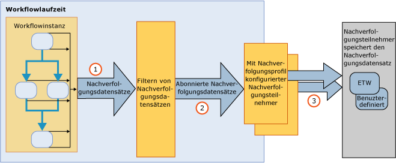

# Nachverfolgung und Ablaufverfolgung f&#252;r Workflows
Die Windows Workflow\-Überwachung ist eine [!INCLUDE[netfx_current_long](../../../includes/netfx-current-long-md.md)]\-Funktion, die für Sichtbarkeit in die Workflowausführung ausgelegt ist.Sie stellt eine Überwachungsinfrastruktur bereit, um die Ausführung einer Workflowinstanz nachzuverfolgen.Die Infrastruktur für die WF\-Überwachung verwendet auf transparente Weise einen Workflow, um während der Ausführung Datensätze auszugeben, die Schlüsselereignisse festhalten.Diese Funktionalität ist standardmäßig für alle [!INCLUDE[netfx_current_short](../../../includes/netfx-current-short-md.md)]\-Workflows verfügbar.An einem [!INCLUDE[netfx_current_long](../../../includes/netfx-current-long-md.md)]\-Workflow müssen keine Änderungen vorgenommen werden, damit eine Überwachung erfolgt.Es geht nur darum, zu entscheiden, wie viele Überwachungsdaten Sie empfangen möchten.Wenn eine Workflowinstanz gestartet oder abgeschlossen wird, werden die zugehörigen Überwachungsdatensätze ausgegeben.Die Überwachung kann auch geschäftsrelevante, den Workflowvariablen zugeordnete Daten extrahieren.Wenn zum Beispiel der Workflow ein System zur Verarbeitung von Bestellungen darstellt, kann die Bestellungs\-ID zusammen mit dem <xref:System.Activities.Tracking.TrackingRecord>\-Objekt extrahiert werden.Im Allgemeinen erleichtert die WF\-Überwachung den Zugriff auf Diagnose\- oder Geschäftsanalysedaten über eine Workflowausführung.  
  
 Diese Überwachungskomponenten entsprechen dem Überwachungsdienst in [!INCLUDE[vstecwinfx](../../../includes/vstecwinfx-md.md)].Die [!INCLUDE[netfx_current_short](../../../includes/netfx-current-short-md.md)] wurde die Leistung für die WF\-Überwachungsfunktion erhöht und das Programmiermodell dafür vereinfacht.Die Überwachungslaufzeit verwendet eine Workflowinstanz, um Ereignisse in Verbindung mit dem Workflow\-Lebenszyklus, den Workflowaktivitäten und benutzerdefinierten Ereignissen auszugeben.  
  
 Windows Server AppFabric bietet auch die Möglichkeit, die Ausführung von WCF und Workflowdiensten zu überwachen.[!INCLUDE[crdefault](../../../includes/crdefault-md.md)][Überwachung mit Windows Server AppFabric](http://go.microsoft.com/fwlink/?LinkId=201273) und [Überwachen von Anwendungen mit Windows Server AppFabric](http://go.microsoft.com/fwlink/?LinkId=201287)  
  
 Zur Fehlerbehandlung der Workflowlaufzeit können Sie die Workflow\-Ablaufverfolgung zur Diagnose aktivieren.[!INCLUDE[crdefault](../../../includes/crdefault-md.md)][Workflowüberwachung](../../../docs/framework/windows-workflow-foundation//workflow-tracing.md).  
  
 Für ein besseres Verständnis des Programmiermodells werden in diesem Thema die Hauptkomponenten der Überwachungsinfrastruktur erläutert:  
  
-   Von der Workflowlaufzeit ausgegebene <xref:System.Activities.Tracking.TrackingRecord>\-Objekte.[!INCLUDE[crdefault](../../../includes/crdefault-md.md)][Nachverfolgungsdatensätze](../../../docs/framework/windows-workflow-foundation//tracking-records.md).  
  
-   <xref:System.Activities.Tracking.TrackingParticipant>\-Objekte abonnieren <xref:System.Activities.Tracking.TrackingRecord>\-Objekte.Die Überwachungsteilnehmer enthalten die Logik zur Verarbeitung der Nutzdaten der <xref:System.Activities.Tracking.TrackingRecord>\-Objekte \(beispielsweise für das Schreiben in eine Datei\).[!INCLUDE[crdefault](../../../includes/crdefault-md.md)][Überwachungsteilnehmer](../../../docs/framework/windows-workflow-foundation//tracking-participants.md).  
  
-   <xref:System.Activities.Tracking.TrackingProfile>\-Objekte filtern die von einer Workflowinstanz ausgegebenen Überwachungsdatensätze.[!INCLUDE[crdefault](../../../includes/crdefault-md.md)][Überwachungsprofile](../../../docs/framework/windows-workflow-foundation//tracking-profiles.md).  
  
## Infrastruktur für die Workflowüberwachung  
 Die Infrastruktur für die Workflowüberwachung erfolgt als Veröffentlichen\-und\-Abonnieren\-Paradigma.Die Workflowinstanz ist der Verleger von Überwachungsdatensätzen, während Abonnenten der Überwachungsdatensätze als Erweiterungen des Workflows registriert werden.Diese Erweiterungen, die <xref:System.Activities.Tracking.TrackingRecord>\-Objekte abonnieren, werden als Überwachungsteilnehmer bezeichnet.Überwachungsteilnehmer sind Erweiterbarkeitspunkte mit Zugriff auf <xref:System.Activities.Tracking.TrackingRecord>\-Objekte. Sie verarbeiten diese auf jede Weise, die Ihnen angegeben wird.Die Überwachungsinfrastruktur ermöglicht die Anwendung eines Filters für ausgehende Überwachungsdatensätze, sodass ein Teilnehmer eine Teilmenge der Datensätze abonnieren kann.Dieser Filtermechanismus wird durch eine Überwachungsprofildatei erzielt.  
  
 In der folgenden Abbildung wird eine allgemein gehaltene Ansicht der Überwachungsinfrastruktur gezeigt.  
  
   
  
## Inhalt dieses Abschnitts  
 [Nachverfolgungsdatensätze](../../../docs/framework/windows-workflow-foundation//tracking-records.md)  
 Beschreibt die Überwachungsdatensätze, die von der Workflowlaufzeit ausgegeben werden.  
  
 [Überwachungsprofile](../../../docs/framework/windows-workflow-foundation//tracking-profiles.md)  
 Erläutert die Verwendung von Überwachungsprofilen.  
  
 [Überwachungsteilnehmer](../../../docs/framework/windows-workflow-foundation//tracking-participants.md)  
 Beschreibt, wie ein vom System bereitgestellter Überwachungsteilnehmer verwendet wird oder wie benutzerdefinierte Überwachungsteilnehmer erstellt werden.  
  
 [Konfigurieren der Nachverfolgung für einen Workflow](../../../docs/framework/windows-workflow-foundation//configuring-tracking-for-a-workflow.md)  
 Beschreibt, wie die Überwachung des Workflows konfiguriert wird.  
  
 [Workflowüberwachung](../../../docs/framework/windows-workflow-foundation//workflow-tracing.md)  
 Beschreibt die zwei Möglichkeiten, die Debugüberwachung eines Workflows zu aktivieren.  
  
 [Bestimmen der Workflowausführungsdauer mithilfe der Ablaufverfolgung](../../../docs/framework/windows-workflow-foundation//determining-workflow-execution-duration-using-tracing.md)  
 Beschreibt, wie Ablaufverfolgungsmeldungen verwendet werden, um die Workflowausführungsdauer zu bestimmen.  
  
## Siehe auch  
 [SQL\-Nachverfolgung](../../../docs/framework/windows-workflow-foundation/samples/sql-tracking.md)