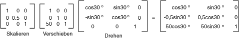

# Globale und lokale Transformationen
Eine globale Transformation ist eine Transformation, die für jedes Element, das vom gilt eine bestimmte <xref:System.Drawing.Graphics> Objekt. Im Gegensatz dazu ist eine lokale Transformation eine Transformation, die gilt zu einem bestimmten Element gezeichnet werden soll.  
  
## Globale Transformationen  
 Um eine globale Transformation zu erstellen, erstellen eine <xref:System.Drawing.Graphics> Objekt aus, und Sie bearbeiten die <xref:System.Drawing.Graphics.Transform%2A> Eigenschaft. Die <xref:System.Drawing.Graphics.Transform%2A> -Eigenschaft ist eine <xref:System.Drawing.Drawing2D.Matrix> Objekt, damit sie eine beliebige Sequenz von affine Transformationen enthalten kann. Die Transformation gespeichert, der <xref:System.Drawing.Graphics.Transform%2A> Eigenschaft wird die globale Transformation aufgerufen. Die <xref:System.Drawing.Graphics> Klasse bietet mehrere Methoden für die Erstellung von einer zusammengesetzten globalen Transformation: <xref:System.Drawing.Graphics.MultiplyTransform%2A>, <xref:System.Drawing.Graphics.RotateTransform%2A>, <xref:System.Drawing.Graphics.ScaleTransform%2A>, und <xref:System.Drawing.Graphics.TranslateTransform%2A>. Im folgende Beispiel zeichnet eine Ellipse zweimal: einmal vor dem Erstellen einer globalen Transformation und einmal nach. Die Transformation zunächst um den Faktor 0,5 in y-Richtung skaliert werden kann und dann 50 Einheiten in der X-Richtung übersetzt und anschließend eine Drehung um 30°.  
  
 [!code-csharp[System.Drawing.CoordinateSystems#21](~/samples/snippets/csharp/VS_Snippets_Winforms/System.Drawing.CoordinateSystems/CS/Class1.cs#21)]
 [!code-vb[System.Drawing.CoordinateSystems#21](~/samples/snippets/visualbasic/VS_Snippets_Winforms/System.Drawing.CoordinateSystems/VB/Class1.vb#21)]  
  
 Die folgende Abbildung zeigt die Matrizen, die bei der Transformation verwendeten.  
  
   
  
> [!NOTE]
>  Im vorherigen Beispiel wird die Ellipse den Ursprung des Koordinatensystems, gedreht, auf der linken oberen Ecke des Clientbereichs. Dies erzeugt ein anderes Ergebnis als das die Ellipse aus, um ihren Mittelpunkt zu drehen.  
  
## Lokale Transformationen  
 Eine lokale Transformation gilt für ein bestimmtes Element gezeichnet werden soll. Z. B. eine <xref:System.Drawing.Drawing2D.GraphicsPath> Objekt verfügt über eine <xref:System.Drawing.Drawing2D.GraphicsPath.Transform%2A> -Methode, die Sie die Datenpunkte des Pfades transformieren kann. Im folgende Beispiel zeichnet ein Rechteck ohne Transformation und ein Pfad mit der eine Drehtransformation an. (Wird davon ausgegangen Sie, dass keine globalen Transformation vorhanden ist.)  
  
 [!code-csharp[System.Drawing.CoordinateSystems#22](~/samples/snippets/csharp/VS_Snippets_Winforms/System.Drawing.CoordinateSystems/CS/Class1.cs#22)]
 [!code-vb[System.Drawing.CoordinateSystems#22](~/samples/snippets/visualbasic/VS_Snippets_Winforms/System.Drawing.CoordinateSystems/VB/Class1.vb#22)]  
  
 Sie können die globale Transformation mit lokalen Transformationen, um eine Vielzahl von Ergebnisse zu erzielen, kombinieren. Beispielsweise können Sie die globale Transformation das Koordinatensystem ändern und lokale Transformationen zum Drehen und Skalieren von Objekten, die auf das neue Koordinatensystem gezeichnet.  
  
 Angenommen Sie, Sie einem Koordinatensystem, die dessen Ursprung 200 Pixel vom linken Rand des Clientbereichs und 150 Pixel vom oberen Rand des Clientbereichs verfügt. Darüber hinaus wird davon ausgegangen Sie, dass Sie die Maßeinheit der Pixel, mit der x-Achse nach rechts und die y-Achse nach oben zeigt sein soll. Das Standardkoordinatensystem hat die y-Achse nach unten, zeigen an, sodass Sie eine Spiegelung entlang der horizontalen Achse durchführen müssen. Die folgende Abbildung zeigt die Matrix für eine solche Spiegelung.  
  
   
  
 Als Nächstes wird davon ausgegangen Sie, dass Sie eine Verschiebung um 200 Einheiten nach rechts und 150 Einheiten nach unten durchführen müssen.  
  
 Im folgende Beispiel wird das Koordinatensystem, die nur durch Festlegen der globalen Transformation beschrieben eine <xref:System.Drawing.Graphics> Objekt.  
  
 [!code-csharp[System.Drawing.CoordinateSystems#23](~/samples/snippets/csharp/VS_Snippets_Winforms/System.Drawing.CoordinateSystems/CS/Class1.cs#23)]
 [!code-vb[System.Drawing.CoordinateSystems#23](~/samples/snippets/visualbasic/VS_Snippets_Winforms/System.Drawing.CoordinateSystems/VB/Class1.vb#23)]  
  
 Der folgende Code (am Ende des vorherigen Beispiels platziert) erstellt einen Pfad, der ein einzelnes Rechteck mit der unteren linken Ecke auf den Ursprung des Koordinatensystems neue besteht. Das Rechteck wird einmal ohne lokale Transformation und einmal mit einer lokalen Transformation gefüllt. Die lokale Transformation besteht eine horizontale Skalierung mit einem Faktor von 2, gefolgt von einem 30-Grad-Drehung aus.  
  
 [!code-csharp[System.Drawing.CoordinateSystems#24](~/samples/snippets/csharp/VS_Snippets_Winforms/System.Drawing.CoordinateSystems/CS/Class1.cs#24)]
 [!code-vb[System.Drawing.CoordinateSystems#24](~/samples/snippets/visualbasic/VS_Snippets_Winforms/System.Drawing.CoordinateSystems/VB/Class1.vb#24)]  
  
 Die folgende Abbildung zeigt das neue Koordinatensystem und den zwei Rechtecken.  
  
   
  
## Siehe auch

- [Koordinatensysteme und Transformationen](coordinate-systems-and-transformations.md)
- [Verwenden von Transformationen in Managed GDI+](using-transformations-in-managed-gdi.md)
