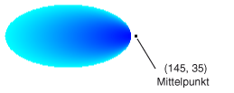

# Gewusst wie: Erstellen eines linearen PfadfarbverlaufsHow to: Create a Path Gradient
Die <xref:System.Drawing.Drawing2D.PathGradientBrush> -Klasse ermöglicht es Ihnen die Möglichkeit, die Sie ausfüllen einer Form mit allmählich Ändern der Farben anpassen.The <xref:System.Drawing.Drawing2D.PathGradientBrush> class allows you to customize the way you fill a shape with gradually changing colors. Beispielsweise können Sie eine Farbe für den Mittelpunkt eines Pfads und eine andere Farbe für die Grenze eines Pfads angeben.For example, you can specify one color for the center of a path and another color for the boundary of a path. Sie können auch separate Farben für jede mehrere Punkte entlang der Grenze eines Pfads angeben.You can also specify separate colors for each of several points along the boundary of a path.  
  
> [!NOTE]
>  In [!INCLUDE[ndptecgdiplus](../../../../includes/ndptecgdiplus-md.md)], ein Pfads ist eine Sequenz von Linien und Kurven von verwaltet eine <xref:System.Drawing.Drawing2D.GraphicsPath> Objekt.In [!INCLUDE[ndptecgdiplus](../../../../includes/ndptecgdiplus-md.md)], a path is a sequence of lines and curves maintained by a <xref:System.Drawing.Drawing2D.GraphicsPath> object. Weitere Informationen zu [!INCLUDE[ndptecgdiplus](../../../../includes/ndptecgdiplus-md.md)] Aktualisierungspfaden finden Sie unter [Grafikpfade in GDI +](../../../../docs/framework/winforms/advanced/graphics-paths-in-gdi.md) und [Constructing und Zeichnen von Pfaden](../../../../docs/framework/winforms/advanced/constructing-and-drawing-paths.md).For more information about [!INCLUDE[ndptecgdiplus](../../../../includes/ndptecgdiplus-md.md)] paths, see [Graphics Paths in GDI+](../../../../docs/framework/winforms/advanced/graphics-paths-in-gdi.md) and [Constructing and Drawing Paths](../../../../docs/framework/winforms/advanced/constructing-and-drawing-paths.md).  
  
### Zum Auffüllen einer Ellipse, die mit eines linearen PfadfarbverlaufsTo fill an ellipse with a path gradient  
  
-   Das folgende Beispiel füllt eine Ellipse mit einem Pinsel mit Farbverlauf.The following example fills an ellipse with a path gradient brush. Die Farbe in der Mitte Blau und Farbe der Begrenzung Hellblau festgelegt ist.The center color is set to blue and the boundary color is set to aqua. Die folgende Abbildung zeigt das ausgefüllte Ellipse.The following illustration shows the filled ellipse.  
  
       
  
     Standardmäßig erweitert ein Pinsel mit Farbverlauf nicht außerhalb der Grenzen des Pfads.By default, a path gradient brush does not extend outside the boundary of the path. Wenn Sie Pfadfarbverlaufs verwenden, um eine Abbildung zu füllen, die die Grenze des Pfads überschreitet, wird der Bereich des Bildschirms außerhalb des Pfads nicht aufgefüllt.If you use the path gradient brush to fill a figure that extends beyond the boundary of the path, the area of the screen outside the path will not be filled.  
  
     Die folgende Abbildung zeigt, was geschieht, wenn Sie ändern, die <xref:System.Drawing.Graphics.FillEllipse%2A> rufen Sie in den folgenden Code hinzu `e.Graphics.FillRectangle(pthGrBrush, 0, 10, 200, 40)`.The following illustration shows what happens if you change the <xref:System.Drawing.Graphics.FillEllipse%2A> call in the following code to `e.Graphics.FillRectangle(pthGrBrush, 0, 10, 200, 40)`.  
  
       
  
     [!code-csharp[System.Drawing.UsingaGradientBrush#11](../../../../samples/snippets/csharp/VS_Snippets_Winforms/System.Drawing.UsingaGradientBrush/CS/Class1.cs#11)]
     [!code-vb[System.Drawing.UsingaGradientBrush#11](../../../../samples/snippets/visualbasic/VS_Snippets_Winforms/System.Drawing.UsingaGradientBrush/VB/Class1.vb#11)]  
  
     Im vorangehenden Codebeispiel ist für die Verwendung mit Windows Forms konzipiert und erfordert die <xref:System.Windows.Forms.PaintEventArgs> e, die ein Parameter ist der <xref:System.Windows.Forms.PaintEventHandler>.The preceding code example is designed for use with Windows Forms, and it requires the <xref:System.Windows.Forms.PaintEventArgs> e, which is a parameter of <xref:System.Windows.Forms.PaintEventHandler>.  
  
### Punkte für die Grenze angeben.To specify points on the boundary  
  
-   Das folgende Beispiel erstellt eine Pfadfarbverlaufs aus einem Pfad sternförmiger.The following example constructs a path gradient brush from a star-shaped path. Der Code legt die <xref:System.Drawing.Drawing2D.PathGradientBrush.CenterColor%2A> -Eigenschaft, die die Farbe auf den Schwerpunkt des Sterns Rot festlegt.The code sets the <xref:System.Drawing.Drawing2D.PathGradientBrush.CenterColor%2A> property, which sets the color at the centroid of the star to red. Anschließend legt der Code die <xref:System.Drawing.Drawing2D.PathGradientBrush.SurroundColors%2A> Eigenschaft verschiedener Farben angeben (gespeichert der `colors` Array) an den einzelnen Positionen im die `points` Array.Then the code sets the <xref:System.Drawing.Drawing2D.PathGradientBrush.SurroundColors%2A> property to specify various colors (stored in the `colors` array) at the individual points in the `points` array. Das endgültige Code-Anweisung füllt den sternförmiger Pfad mit dem Pinsel mit Farbverlauf.The final code statement fills the star-shaped path with the path gradient brush.  
  
     [!code-csharp[System.Drawing.UsingaGradientBrush#12](../../../../samples/snippets/csharp/VS_Snippets_Winforms/System.Drawing.UsingaGradientBrush/CS/Class1.cs#12)]
     [!code-vb[System.Drawing.UsingaGradientBrush#12](../../../../samples/snippets/visualbasic/VS_Snippets_Winforms/System.Drawing.UsingaGradientBrush/VB/Class1.vb#12)]  
  
-   Im folgende Beispiel zeichnet ein linearen Pfadfarbverlaufs ohne eine <xref:System.Drawing.Drawing2D.GraphicsPath> Objekt im Code.The following example draws a path gradient without a <xref:System.Drawing.Drawing2D.GraphicsPath> object in the code. Die jeweilige <xref:System.Drawing.Drawing2D.PathGradientBrush.%23ctor%2A> Konstruktor in diesem Beispiel empfängt ein Array von Punkten, erfordert aber kein <xref:System.Drawing.Drawing2D.GraphicsPath> Objekt.The particular <xref:System.Drawing.Drawing2D.PathGradientBrush.%23ctor%2A> constructor in the example receives an array of points but does not require a <xref:System.Drawing.Drawing2D.GraphicsPath> object. Beachten Sie außerdem, dass die <xref:System.Drawing.Drawing2D.PathGradientBrush> wird verwendet, um ein Rechteck, keinen Pfad zu füllen.Also, note that the <xref:System.Drawing.Drawing2D.PathGradientBrush> is used to fill a rectangle, not a path. Das Rechteck ist größer als der geschlossenen Pfad verwendet, um den Pinsel definieren, damit einige des Rechtecks nicht durch den Pinsel gezeichnet wird.The rectangle is larger than the closed path used to define the brush, so some of the rectangle is not painted by the brush. Die folgende Abbildung zeigt das Rechteck (gepunktete Linie) und der Teil der mit Pfadfarbverlaufs gezeichnetes Rechteck.The following illustration shows the rectangle (dotted line) and the portion of the rectangle painted by the path gradient brush.  
  
       
  
     [!code-csharp[System.Drawing.UsingaGradientBrush#13](../../../../samples/snippets/csharp/VS_Snippets_Winforms/System.Drawing.UsingaGradientBrush/CS/Class1.cs#13)]
     [!code-vb[System.Drawing.UsingaGradientBrush#13](../../../../samples/snippets/visualbasic/VS_Snippets_Winforms/System.Drawing.UsingaGradientBrush/VB/Class1.vb#13)]  
  
### Anpassen ein linearen PfadfarbverlaufsTo customize a path gradient  
  
-   Eine Möglichkeit, einen Pinsel mit Farbverlauf anzupassen ist, legen Sie dessen <xref:System.Drawing.Drawing2D.PathGradientBrush.FocusScales%2A> Eigenschaft.One way to customize a path gradient brush is to set its <xref:System.Drawing.Drawing2D.PathGradientBrush.FocusScales%2A> property. Die Skalierungen Fokus geben Sie einen inneren Pfad, der innerhalb der Hauptausführungspfad liegt.The focus scales specify an inner path that lies inside the main path. Die Farbe in der Mitte wird überall innerhalb des inneren Pfades statt nur im Mittelpunkt angezeigt.The center color is displayed everywhere inside that inner path rather than only at the center point.  
  
     Im folgende Beispiel wird basierend auf einem Pfad elliptischen Pfadfarbverlaufs erstellt.The following example creates a path gradient brush based on an elliptical path. Der Code legt die Farbe der Begrenzung Blau, legt die Farbe in der Mitte Hellblau und klicken Sie dann Pfadfarbverlaufs zum Ausfüllen des elliptischen Pfads verwendet.The code sets the boundary color to blue, sets the center color to aqua, and then uses the path gradient brush to fill the elliptical path.  
  
     Als Nächstes wird durch den Code der Fokus Größenordnungen Pfadfarbverlaufs.Next, the code sets the focus scales of the path gradient brush. X Fokus Skala 0,3 festgelegt ist, und die y-Skala den Fokus auf 0,8 festgelegt ist.The x focus scale is set to 0.3, and the y focus scale is set to 0.8. Der Code Ruft die <xref:System.Drawing.Graphics.TranslateTransform%2A> Methode eine <xref:System.Drawing.Graphics> Objekt, damit nachfolgenden Aufruf an <xref:System.Drawing.Graphics.FillPath%2A> füllt eine Ellipse, die rechts neben die erste Ellipse befindet.The code calls the <xref:System.Drawing.Graphics.TranslateTransform%2A> method of a <xref:System.Drawing.Graphics> object so that the subsequent call to <xref:System.Drawing.Graphics.FillPath%2A> fills an ellipse that sits to the right of the first ellipse.  
  
     Angenommen Sie, um die Auswirkung der Fokus Skalen angezeigt wird, eine kleine Ellipse, die ihren Mittelpunkt und die wichtigsten Ellipse gemeinsam verwendet wird.To see the effect of the focus scales, imagine a small ellipse that shares its center with the main ellipse. Kleinere (innere) Ellipse ist die wichtigsten Ellipse skaliert (über ihren Mittelpunkt) horizontal mit dem Faktor 0,3 und vertikal um einen Faktor 0,8.The small (inner) ellipse is the main ellipse scaled (about its center) horizontally by a factor of 0.3 and vertically by a factor of 0.8. Wenn Sie die Grenze der äußeren Ellipse auf die Begrenzung der inneren Ellipse verschieben, ändert sich die Farbe allmählich von Blau Hellblau.As you move from the boundary of the outer ellipse to the boundary of the inner ellipse, the color changes gradually from blue to aqua. Wie Sie die Grenze der inneren Ellipse des freigegebenen Center, bleibt die Farbe Aqua verschieben.As you move from the boundary of the inner ellipse to the shared center, the color remains aqua.  
  
     In der folgenden Abbildung ist das Ergebnis des angegebenen Codes dargestellt.The following illustration shows the output of the following code. Ellipse auf der linken Seite ist nur im Mittelpunkt hellblau.The ellipse on the left is aqua only at the center point. Ellipse auf der rechten Seite ist Hellblau überall innerhalb des inneren Pfades.The ellipse on the right is aqua everywhere inside the inner path.  
  
   
  
 [!code-csharp[System.Drawing.UsingaGradientBrush#14](../../../../samples/snippets/csharp/VS_Snippets_Winforms/System.Drawing.UsingaGradientBrush/CS/Class1.cs#14)]
 [!code-vb[System.Drawing.UsingaGradientBrush#14](../../../../samples/snippets/visualbasic/VS_Snippets_Winforms/System.Drawing.UsingaGradientBrush/VB/Class1.vb#14)]  
  
### Mit Interpolation anpassenTo customize with interpolation  
  
-   Eine weitere Möglichkeit zum Anpassen einer Pfadfarbverlaufs ist ein Array von Farben und ein Array von Interpolationspositionen an.Another way to customize a path gradient brush is to specify an array of interpolation colors and an array of interpolation positions.  
  
     Das folgende Beispiel erstellt einen Pinsel mit Farbverlauf auf der Grundlage eines Dreiecks.The following example creates a path gradient brush based on a triangle. Der Code legt die <xref:System.Drawing.Drawing2D.PathGradientBrush.InterpolationColors%2A> Eigenschaft Pfadfarbverlaufs an ein Array von Farben (Dunkelgrün, Aqua, Blau) und ein Array von Interpolationspositionen (0, 0.25, 1).The code sets the <xref:System.Drawing.Drawing2D.PathGradientBrush.InterpolationColors%2A> property of the path gradient brush to specify an array of interpolation colors (dark green, aqua, blue) and an array of interpolation positions (0, 0.25, 1). Sie von der Begrenzung des Dreiecks für den Mittelpunkt verschieben, ändert sich die Farbe graduell von Dunkelgrün Hellblau und dann von Hellblau Blau.As you move from the boundary of the triangle to the center point, the color changes gradually from dark green to aqua and then from aqua to blue. Die Änderung von Dunkelgrün Aqua erfolgt in 25 Prozent der Entfernung von Dunkelgrün Blau.The change from dark green to aqua happens in 25 percent of the distance from dark green to blue.  
  
     Die folgende Abbildung zeigt das Dreieck mit benutzerdefinierten Pfadfarbverlaufs gefüllt.The following illustration shows the triangle filled with the custom path gradient brush.  
  
       
  
     [!code-csharp[System.Drawing.UsingaGradientBrush#15](../../../../samples/snippets/csharp/VS_Snippets_Winforms/System.Drawing.UsingaGradientBrush/CS/Class1.cs#15)]
     [!code-vb[System.Drawing.UsingaGradientBrush#15](../../../../samples/snippets/visualbasic/VS_Snippets_Winforms/System.Drawing.UsingaGradientBrush/VB/Class1.vb#15)]  
  
### Den Mittelpunkt festlegenTo set the center point  
  
-   Standardmäßig ist der Mittelpunkt des Pfadfarbverlaufs an der Schwerpunkt des Pfads verwendet, um den Pinsel erstellen.By default, the center point of a path gradient brush is at the centroid of the path used to construct the brush. Sie können den Speicherort des Mittelpunkts ändern, durch Festlegen der <xref:System.Drawing.Drawing2D.PathGradientBrush.CenterPoint%2A> Eigenschaft von der <xref:System.Drawing.Drawing2D.PathGradientBrush> Klasse.You can change the location of the center point by setting the <xref:System.Drawing.Drawing2D.PathGradientBrush.CenterPoint%2A> property of the <xref:System.Drawing.Drawing2D.PathGradientBrush> class.  
  
     Das folgende Beispiel erstellt einen Pinsel mit Farbverlauf auf der Grundlage einer Ellipse, die an.The following example creates a path gradient brush based on an ellipse. Befindet sich auf die Mitte der Ellipse (70, 35), aber der Mittelpunkt des Pfadfarbverlaufs auf festgelegt ist (120, 40).The center of the ellipse is at (70, 35), but the center point of the path gradient brush is set to (120, 40).  
  
     [!code-csharp[System.Drawing.UsingaGradientBrush#16](../../../../samples/snippets/csharp/VS_Snippets_Winforms/System.Drawing.UsingaGradientBrush/CS/Class1.cs#16)]
     [!code-vb[System.Drawing.UsingaGradientBrush#16](../../../../samples/snippets/visualbasic/VS_Snippets_Winforms/System.Drawing.UsingaGradientBrush/VB/Class1.vb#16)]  
  
     Die folgende Abbildung zeigt das ausgefüllte Ellipse und der Mittelpunkt des Pfadfarbverlaufs.The following illustration shows the filled ellipse and the center point of the path gradient brush.  
  
       
  
-   Sie können den Mittelpunkt des Pfadfarbverlaufs an einen Speicherort außerhalb des Pfads festlegen, die zum Erstellen des Pinsels verwendet wurde.You can set the center point of a path gradient brush to a location outside the path that was used to construct the brush. Im folgende Beispiel ersetzt der Aufruf zum Festlegen der <xref:System.Drawing.Drawing2D.PathGradientBrush.CenterPoint%2A> Eigenschaft im vorangehenden Code.The following example replaces the call to set the <xref:System.Drawing.Drawing2D.PathGradientBrush.CenterPoint%2A> property in the preceding code.  
  
     [!code-csharp[System.Drawing.UsingaGradientBrush#17](../../../../samples/snippets/csharp/VS_Snippets_Winforms/System.Drawing.UsingaGradientBrush/CS/Class1.cs#17)]
     [!code-vb[System.Drawing.UsingaGradientBrush#17](../../../../samples/snippets/visualbasic/VS_Snippets_Winforms/System.Drawing.UsingaGradientBrush/VB/Class1.vb#17)]  
  
     Die folgende Abbildung zeigt die Ausgabe dieser Änderung.The following illustration shows the output with this change.  
  
       
  
     In der vorherigen Abbildung sind die Punkte ganz rechts in der Ellipse nicht reine Blau (obwohl sie sehr nahe sind).In the preceding illustration, the points at the far right of the ellipse are not pure blue (although they are very close). Die Farben im Farbverlauf werden positioniert, als wäre die Füllung für den Punkt (145, 35) erreicht, in dem die Farbe reines Blau (0, 0, 255) wäre.The colors in the gradient are positioned as if the fill reached the point (145, 35) where the color would be pure blue (0, 0, 255). Aber die Füllung nie erreicht (145, 35), da nur innerhalb des Pfads ein Pinsel mit Farbverlauf zeichnet.But the fill never reaches (145, 35) because a path gradient brush paints only inside its path.  
  
## Kompilieren des CodesCompiling the Code  
 Siehe vorstehende Beispiele sind für die Verwendung mit Windows Forms konzipiert und erfordern <xref:System.Windows.Forms.PaintEventArgs> `e`, einen Parameter von der <xref:System.Windows.Forms.Control.Paint> -Ereignishandler.The preceding examples are designed for use with Windows Forms, and they require <xref:System.Windows.Forms.PaintEventArgs> `e`, which is a parameter of the <xref:System.Windows.Forms.Control.Paint> event handler.  
  
## Siehe auchSee Also  
 [Verwenden eines Pinsels für Farbverläufe zum Ausfüllen von FormenUsing a Gradient Brush to Fill Shapes](../../../../docs/framework/winforms/advanced/using-a-gradient-brush-to-fill-shapes.md)
