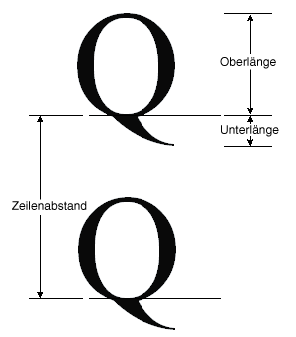

# Vorgehensweise: Abrufen von SchriftarteigenschaftenHow to: Obtain Font Metrics
Die <xref:System.Drawing.FontFamily> Klasse stellt die folgenden Methoden, die verschiedene Metriken für eine bestimmte Produktfamilie / "Style" abrufen:The <xref:System.Drawing.FontFamily> class provides the following methods that retrieve various metrics for a particular family/style combination:  
  
-   <xref:System.Drawing.FontFamily.GetEmHeight%2A>(FontStyle)(FontStyle)  
  
-   <xref:System.Drawing.FontFamily.GetCellAscent%2A>(FontStyle)(FontStyle)  
  
-   <xref:System.Drawing.FontFamily.GetCellDescent%2A>(FontStyle)(FontStyle)  
  
-   <xref:System.Drawing.FontFamily.GetLineSpacing%2A>(FontStyle)(FontStyle)  
  
 Die Zahlen, die von diesen Methoden zurückgegeben werden, sodass sie unabhängig von Größe und Einheiten eines bestimmten sind in Schriftentwurfseinheiten <xref:System.Drawing.Font> Objekt.The numbers returned by these methods are in font design units, so they are independent of the size and units of a particular <xref:System.Drawing.Font> object.  
  
 Die folgende Abbildung zeigt die verschiedenen Metriken.The following illustration shows the various metrics.  
  
   
  
## BeispielExample  
 Das folgende Beispiel zeigt die Metriken für den Schriftschnitt der Schriftart Arial-Familie.The following example displays the metrics for the regular style of the Arial font family. Der Code erstellt außerdem eine <xref:System.Drawing.Font> Objekt (basierend auf der Arial-Kategorie), mit der Größe von 16 Pixel und zeigt die Metriken (in Pixel) für die jeweilige <xref:System.Drawing.Font> Objekt.The code also creates a <xref:System.Drawing.Font> object (based on the Arial family) with size 16 pixels and displays the metrics (in pixels) for that particular <xref:System.Drawing.Font> object.  
  
 Die folgende Abbildung zeigt die Ausgabe des Beispielcodes.The following illustration shows the output of the example code.  
  
   
  
 Beachten Sie die ersten beiden Zeilen der Ausgabe in der vorherigen Abbildung.Note the first two lines of output in the preceding illustration. Die <xref:System.Drawing.Font> -Objekt zurückgibt, eine Größe von 16, und die <xref:System.Drawing.FontFamily> Objekt eine Geviertgröße von 2.048 zurück.The <xref:System.Drawing.Font> object returns a size of 16, and the <xref:System.Drawing.FontFamily> object returns an em height of 2,048. Diese beiden Zahlen (16 und 2.048) sind der Schlüssel zum Konvertieren zwischen Schriftentwurfseinheiten und die Einheiten (in diesem Fall Pixel), der die <xref:System.Drawing.Font> Objekt.These two numbers (16 and 2,048) are the key to converting between font design units and the units (in this case pixels) of the <xref:System.Drawing.Font> object.  
  
 Beispielsweise können Sie die Versalhöhe aus Entwurfseinheiten an Pixeln wie folgt konvertieren:For example, you can convert the ascent from design units to pixels as follows:  
  
   
  
 Der folgende Code Text wird vertikal positioniert, durch Festlegen der <xref:System.Drawing.PointF.Y%2A> Datenmember einer <xref:System.Drawing.PointF> Objekt.The following code positions text vertically by setting the <xref:System.Drawing.PointF.Y%2A> data member of a <xref:System.Drawing.PointF> object. Die y-Koordinate wird erhöht, `font.Height` für jede neue Zeile des Texts.The y-coordinate is increased by `font.Height` for each new line of text. Die <xref:System.Drawing.Font.Height%2A> Eigenschaft eine <xref:System.Drawing.Font> Objekts gibt den Zeilenabstand (in Pixel) für die jeweilige <xref:System.Drawing.Font> Objekt.The <xref:System.Drawing.Font.Height%2A> property of a <xref:System.Drawing.Font> object returns the line spacing (in pixels) for that particular <xref:System.Drawing.Font> object. In diesem Beispiel wird die Anzahl von zurückgegebenen <xref:System.Drawing.Font.Height%2A> ist 19.In this example, the number returned by <xref:System.Drawing.Font.Height%2A> is 19. Beachten Sie, dass dies die Anzahl (in eine ganze Zahl aufgerundet) abgerufen, indem Sie die Metrik Zeilenabstand in Pixel konvertiert identisch ist.Note that this is the same as the number (rounded up to an integer) obtained by converting the line-spacing metric to pixels.  
  
 Beachten Sie, dass die Gevierthöhe (auch als Größe oder die Em-Größe) nicht die Summe der Versalhöhe und die Unterlänge ist.Note that the em height (also called size or em size) is not the sum of the ascent and the descent. Die Summe der Versalhöhe und die Unterlänge wird die Zellenhöhe aufgerufen.The sum of the ascent and the descent is called the cell height. Die Zellenhöhe minus der internen vorangestellten ist die Gevierthöhe gleich.The cell height minus the internal leading is equal to the em height. Die Zellenhöhe sowie der externe Abstand ist gleich den Zeilenabstand.The cell height plus the external leading is equal to the line spacing.  
  
 [!code-csharp[System.Drawing.FontsAndText#71](~/samples/snippets/csharp/VS_Snippets_Winforms/System.Drawing.FontsAndText/CS/Class1.cs#71)]
 [!code-vb[System.Drawing.FontsAndText#71](~/samples/snippets/visualbasic/VS_Snippets_Winforms/System.Drawing.FontsAndText/VB/Class1.vb#71)]  
  
## Kompilieren des CodesCompiling the Code  
 Das obige Beispiel ist für die Verwendung mit Windows Forms konzipiert und erfordert <xref:System.Windows.Forms.PaintEventArgs> `e`, d.h. ein Parameter vom <xref:System.Windows.Forms.PaintEventHandler>.The preceding example is designed for use with Windows Forms, and it requires <xref:System.Windows.Forms.PaintEventArgs> `e`, which is a parameter of <xref:System.Windows.Forms.PaintEventHandler>.  
  
## Siehe auchSee also

- [Grafik und Zeichnen in Windows FormsGraphics and Drawing in Windows Forms](graphics-and-drawing-in-windows-forms.md)
- [Verwenden von Schriftarten und TextUsing Fonts and Text](using-fonts-and-text.md)
