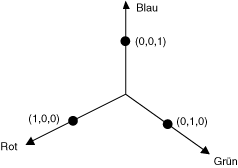
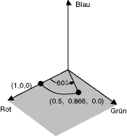
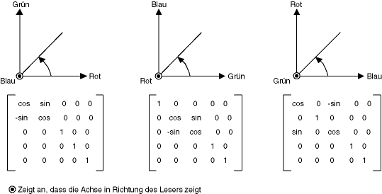
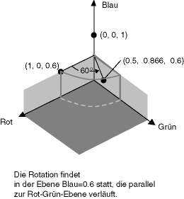

# Gewusst wie: Drehen von FarbenHow to: Rotate Colors
Drehungswinkel in einem vierdimensionalen Farbraum ist schwer zu visualisieren.Rotation in a four-dimensional color space is difficult to visualize. Wir können Drehung zu visualisieren, indem Sie einverstanden sind, behalten Sie eine der festen Farbe Komponenten vereinfachen.We can make it easier to visualize rotation by agreeing to keep one of the color components fixed. Angenommen Sie, wir akzeptieren Sie den Alphaanteil auf 1 festgesetzt (vollständig deckend) beibehalten.Suppose we agree to keep the alpha component fixed at 1 (fully opaque). Dann können wir einen dreidimensionale Farbraum mit Rot-, Grün- und Blau-Achsen darstellen, in der folgenden Abbildung dargestellt.Then we can visualize a three-dimensional color space with red, green, and blue axes as shown in the following illustration.  
  
   
  
 Eine Farbe kann als ein Punkt im 3D-Raum betrachtet werden.A color can be thought of as a point in 3-D space. Z. B. den Punkt (1, 0, 0) im Raum darstellt, die Farbe Rot und der Punkt im Raum (0, 1, 0) stellt die Farbe Grün.For example, the point (1, 0, 0) in space represents the color red, and the point (0, 1, 0) in space represents the color green.  
  
 Die folgende Abbildung zeigt worum es sich dabei um die Farbe (1, 0, 0) drehen, durch einen Winkel von 60 Grad in Rot-Grün-Ebene.The following illustration shows what it means to rotate the color (1, 0, 0) through an angle of 60 degrees in the Red-Green plane. Drehungswinkel in einer Ebene Parallel zur Rot-Grün-Ebene kann als Drehung der blauen Achse betrachtet werden.Rotation in a plane parallel to the Red-Green plane can be thought of as rotation about the blue axis.  
  
   
  
 Die folgende Abbildung zeigt, wie eine Farbmatrix zum Ausführen von Drehungen zu jeder der drei-Koordinate Achsen (Rot, Grün, Blau) initialisiert werden.The following illustration shows how to initialize a color matrix to perform rotations about each of the three coordinate axes (red, green, blue).  
  
   
  
## BeispielExample  
 Im folgenden Beispiel wird ein Bild, das alle einfarbig (1, 0, 0,6) und eine Drehung 60 Grad der blauen Achse gilt.The following example takes an image that is all one color (1, 0, 0.6) and applies a 60-degree rotation about the blue axis. Der Winkel der Drehung ist in einer Ebene, die parallel zur Rot-Grün ist, out überflüssig.The angle of the rotation is swept out in a plane that is parallel to the red-green plane.  
  
 Die folgende Abbildung zeigt das ursprüngliche Bild auf der linken Seite und die Farbe gedreht Bild auf der rechten Seite.The following illustration shows the original image on the left and the color-rotated image on the right.  
  
   
  
 Die folgende Abbildung zeigt eine Visualisierung der Drehung Farbe, die in den folgenden Code ausgeführt.The following illustration shows a visualization of the color rotation performed in the following code.  
  
   
  
 [!code-csharp[System.Drawing.RotateColors#1](../../../../samples/snippets/csharp/VS_Snippets_Winforms/System.Drawing.RotateColors/CS/Form1.cs#1)]
 [!code-vb[System.Drawing.RotateColors#1](../../../../samples/snippets/visualbasic/VS_Snippets_Winforms/System.Drawing.RotateColors/VB/Form1.vb#1)]  
  
## Kompilieren des CodesCompiling the Code  
 Das obige Beispiel ist für die Verwendung mit Windows Forms konzipiert und erfordert <xref:System.Windows.Forms.PaintEventArgs> `e`, einen Parameter von der <xref:System.Windows.Forms.Control.Paint> -Ereignishandler.The preceding example is designed for use with Windows Forms, and it requires <xref:System.Windows.Forms.PaintEventArgs>`e`, which is a parameter of the <xref:System.Windows.Forms.Control.Paint> event handler. Ersetzen Sie `RotationInput.bmp` mit einem Dateinamen und Pfad auf Ihrem System gültig.Replace `RotationInput.bmp` with an image file name and path valid on your system.  
  
## Siehe auchSee Also  
 <xref:System.Drawing.Imaging.ColorMatrix>  
 <xref:System.Drawing.Imaging.ImageAttributes>  
 [Grafik und Zeichnen in Windows FormsGraphics and Drawing in Windows Forms](../../../../docs/framework/winforms/advanced/graphics-and-drawing-in-windows-forms.md)  
 [Neufärben von BildernRecoloring Images](../../../../docs/framework/winforms/advanced/recoloring-images.md)
