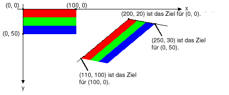

# Gewusst wie: Drehen, Spiegeln und Zerren von Bildern
Sie können drehen, wider und ein Bild von Zielpunkte für die oberen linken, oberen rechten und unteren linken Ecke des ursprünglichen Bilds verzerren. Die drei Zielpunkte bestimmen eine affine Transformation, die ein Parallelogramm dem ursprungsabbild rechteckigen zuordnet.  
  
## Beispiel  
 Nehmen wir beispielsweise an, die das ursprüngliche Bild ist ein Rechteck mit der linken oberen Ecke an (0, 0), rechten oberen Ecke an (100, 0), und der unteren linken Ecke auf (0, 50). Jetzt angenommen, Sie ordnen Sie die Punkte drei Zielpunkte wie folgt.  
  
|Ursprüngliche Punkt|Zielpunkt|  
|--------------------|-----------------------|  
|Linke (0, 0)|(200, 20)|  
|Rechts (100, 0)|(110, 100)|  
|Unten links (0, 50)|(250, 30)|  
  
 Die folgende Abbildung zeigt das ursprüngliche Image und das Bild, das Parallelogramm zugeordnet ist. Das ursprüngliche Image wurde verzerrt wiedergegeben, gedreht übersetzt und wurden. Die Zeile, die ausgeführt, über wird die x-Achse entlang des oberen Randes des ursprünglichen Bilds zugeordnet ist (200, 20) und (110, 100). Die Zeile, die ausgeführt, über wird die y-Achse entlang des linken Randes des ursprünglichen Bilds zugeordnet ist (200, 20) und (250, 30).  
  
   
  
 Die folgende Abbildung zeigt eine ähnliche Transformation auf ein Foto angewendet.  
  
   
  
 Die folgende Abbildung zeigt eine ähnliche Transformation, die auf eine Metadatei angewendet.  
  
   
  
 Im folgenden Beispiel wird die Bilder, die in der ersten Abbildung gezeigt.  
  
 [!code-csharp[System.Drawing.WorkingWithImages#61](../../../../samples/snippets/csharp/VS_Snippets_Winforms/System.Drawing.WorkingWithImages/CS/Class1.cs#61)]
 [!code-vb[System.Drawing.WorkingWithImages#61](../../../../samples/snippets/visualbasic/VS_Snippets_Winforms/System.Drawing.WorkingWithImages/VB/Class1.vb#61)]  
  
## Kompilieren des Codes  
 Das obige Beispiel ist für die Verwendung in Windows Forms konzipiert und erfordert <xref:System.Windows.Forms.PaintEventArgs>`e`, einen Parameter des <xref:System.Windows.Forms.Control.Paint>-Ereignishandlers. Achten Sie darauf, ersetzen Sie `Stripes.bmp` durch den Pfad zu einem Bild, das auf Ihrem System gültig ist.  
  
## Siehe auch  
 [Arbeiten mit Bildern, Bitmaps, Symbolen und Metadateien](../../../../docs/framework/winforms/advanced/working-with-images-bitmaps-icons-and-metafiles.md)
