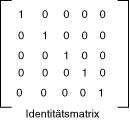

# Vorgehensweise: Verwenden einer Farbmatrix zum Transformieren einer Farbe
[!INCLUDE[ndptecgdiplus](../../../../includes/ndptecgdiplus-md.md)] Stellt die <xref:System.Drawing.Image> und <xref:System.Drawing.Bitmap> Klassen zum Speichern und Bearbeiten von Bildern. <xref:System.Drawing.Image> und <xref:System.Drawing.Bitmap> Objekte speichern die Farbe jedes Pixels als 32-Bit-Zahl: jeweils 8 Bit für Rot, Grün, Blau und Alpha. Jede der vier Komponenten ist es sich um eine Zahl zwischen 0 und 255, wobei 0 für keine Intensität und 255, die vollständigen Intensität darstellt. Die alpha-Komponente gibt die Transparenz der Farbe an: 0 vollständig transparent ist, und 255 vollständig deckend ist.  
  
 Ein Vektor Farbe ist ein 4-Tupel der Form (Rot, Grün, Blau, Alpha). Beispielsweise steht der Color-Vektor (0, 255, 0, 255) eine nicht transparente Farbe, die ohne Rot oder Blau, jedoch mit vollständigen Intensität.  
  
 Eine andere Konvention für die Darstellung von Farben verwendet die Zahl 1 für vollständigen Intensität. Verwenden diese Konvention, würde die Farbe, die im vorherigen Absatz beschriebene um den Vektor (0, 1, 0, 1) dargestellt werden. [!INCLUDE[ndptecgdiplus](../../../../includes/ndptecgdiplus-md.md)] die Konvention von 1 als vollständigen Intensität bei verwendet Farbe Transformationen wird.  
  
 Sie können Farbe Vektoren vorhersagestunden wird die Farbe Vektoren mit einer 4 × 4-Matrix lineare Transformationen (Drehung, Skalierung und ähnliches) zuweisen. Eine 4 x 4-Matrix können Sie jedoch eine Übersetzung (nicht lineare) ausführen. Wenn Sie eine dummy fünfte Koordinate (z. B. die Nummer 1) aller die Vektoren Farbe hinzufügen, können Sie eine 5 x 5-Matrix, um eine beliebige Kombination von linearen Transformationen und Konvertierungen anzuwenden. Eine Transformation, bestehend aus eine lineare Umformung gefolgt von einer Übersetzung wird eine affine Transformation aufgerufen.  
  
 Nehmen wir beispielsweise an, dass Sie mit der Farbe ("0.2", "0.0", "0,4", "1.0") beginnen und die folgenden Transformationen anwenden möchten:  
  
1. Verdoppelung des Rotanteils  
  
2. Die Komponenten roten, grünen und blauen 0,2 hinzugefügt  
  
 Die folgende Matrixmultiplikation führt die beiden Transformationen in entsprechender Reihenfolge aufgelistet.  
  
   
  
 Die Elemente einer Farbmatrix werden von Zeilen- und klicken Sie dann (die nullbasierte) indiziert. Beispielsweise ist der Eintrag in der fünften Zeile und dritten Spalte der Matrix M durch M [4] [2] gekennzeichnet.  
  
 Die 5 x 5-Identitätsmatrix (in der folgenden Abbildung dargestellt) verfügt über 1 s, auf der diagonalen und 0, die alle anderen Elemente. Wenn Sie einen Vektor Farbe durch die Identitätsmatrix multiplizieren, ändert sich der Vektor Farbe nicht. Eine einfache Möglichkeit, bilden die Matrix eine Farbe-Transformation ist mit die Identitätsmatrix beginnen, und stellen eine kleine Änderung, die die gewünschte Transformation erzeugt.  
  
   
  
 Eine ausführlichere Erläuterung von Matrizen und Transformationen, finden Sie unter [Koordinatensysteme und Transformationen](coordinate-systems-and-transformations.md).  
  
## Beispiel  
 Im folgenden Beispiel wird ein Bild an, die alle eine Farbe ("0.2", "0.0", "0,4", "1.0") und wendet die Transformation, die in den vorherigen Absätzen beschrieben.  
  
 Die folgende Abbildung zeigt das ursprüngliche Bild auf der linken Seite und die transformierten auf der rechten Seite an.  
  
   
  
 Der Code im folgenden Beispiel verwendet die folgenden Schritte aus, um die über erneutes Einfärben auszuführen:  
  
1. Initialisiert eine <xref:System.Drawing.Imaging.ColorMatrix> Objekt.  
  
2. Erstellen einer <xref:System.Drawing.Imaging.ImageAttributes> Objekt, und übergeben die <xref:System.Drawing.Imaging.ColorMatrix> -Objekt an die <xref:System.Drawing.Imaging.ImageAttributes.SetColorMatrix%2A> -Methode der der <xref:System.Drawing.Imaging.ImageAttributes> Objekt.  
  
3. Übergeben der <xref:System.Drawing.Imaging.ImageAttributes> -Objekt an die <xref:System.Drawing.Graphics.DrawImage%2A> Methode eine <xref:System.Drawing.Graphics> Objekt.  
  
 [!code-csharp[System.Drawing.RecoloringImages#21](~/samples/snippets/csharp/VS_Snippets_Winforms/System.Drawing.RecoloringImages/CS/Class1.cs#21)]
 [!code-vb[System.Drawing.RecoloringImages#21](~/samples/snippets/visualbasic/VS_Snippets_Winforms/System.Drawing.RecoloringImages/VB/Class1.vb#21)]  
  
## Kompilieren des Codes  
 Das obige Beispiel ist für die Verwendung mit Windows Forms konzipiert und erfordert <xref:System.Windows.Forms.PaintEventArgs> `e`, ein Parameter von der <xref:System.Windows.Forms.Control.Paint> -Ereignishandler.  
  
## Siehe auch

- [Neufärben von Bildern](recoloring-images.md)
- [Koordinatensysteme und Transformationen](coordinate-systems-and-transformations.md)
