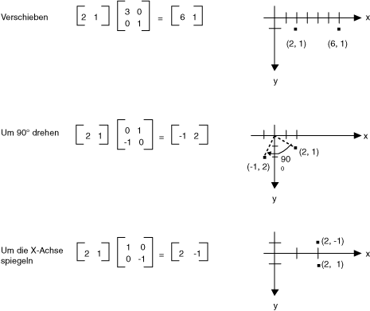
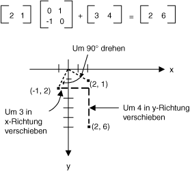
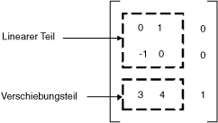

# Matrixdarstellung von Transformationen
Eine m x n Matrix ist ein Satz von Zahlen, die in Zeilen m und n Spalten angeordnet sind. Die folgende Abbildung zeigt mehrere Matrizen.  
  
   
  
 Sie können zwei Matrizen mit derselben Größe hinzufügen, indem Sie einzelne Elemente hinzufügen. Die folgende Abbildung zeigt zwei Beispiele für die Matrix hinzufügen.  
  
   
  
 Kann eine m x n-Matrix ein n × p Matrix multipliziert, und das Ergebnis ist eine m × p-Matrix. Die Anzahl der Spalten in der ersten Matrix muss identisch mit der Anzahl der Zeilen in die zweite Matrix. Eine 4 x 2-Matrix kann z. B. mit einer 2 x 3-Matrix erstellt eine 4 x 3-Matrix multipliziert werden.  
  
 Punkte in der Ebene und Zeilen und Spalten einer Matrix können als Vektoren betrachtet werden. Beispielsweise (2, 5) ist ein Vektor mit zwei Komponenten, und (3, 7, 1) ist ein Vektor mit drei Komponenten. Das Skalarprodukt zweier Vektoren wird wie folgt definiert:  
  
 (a, b) • (C, d) = Ac + bd  
  
 (a, b, c) • (d, e, f) = Ad + + Cf  
  
 Z. B. das Skalarprodukt aus (2, 3) und (5, 4) ist ((2)(5) + ((3)(4) = 22. Das Skalarprodukt aus (2, 5, 1) und (4, 3, 1) ist (2)(4) + (5)(3) + (1)(1) = 24. Beachten Sie, dass das Skalarprodukt zweier Vektoren eine Zahl, die nicht in einer anderen Vektor ist. Beachten Sie außerdem, dass Sie das Skalarprodukt berechnen können, nur, wenn die beiden Vektoren die gleiche Anzahl von Komponenten haben.  
  
 Lassen Sie A(i, j) werden den Eintrag in der Matrix ein, in der i-ten Zeile und Spalte j. Zum Beispiel ein (3, 2) ist der Eintrag in der Matrix ein, in der 3. Zeile und der 2. Spalte. Angenommen, A, B und C Matrizen, und AB, c = Die Einträge des C werden folgendermaßen errechnet:  
  
 C (i, j) = (Zeile i von A) • (Spalte j von B)  
  
 Die folgende Abbildung zeigt einige Beispiele für Matrixmultiplikation.  
  
   
  
 Wenn Sie einen Punkt in einer Ebene als eine 1 x 2-Matrix vorstellen, können Sie diesen Punkt transformieren, durch Multiplikation mit einer 2 x 2-Matrix. Die folgende Abbildung zeigt mehrere Transformationen für den Punkt (2, 1).  
  
   
  
 Alle Transformationen in der obigen Abbildung sind lineare Transformationen. Andere Transformationen, z. B. Übersetzung, sind nicht linear und können nicht als Multiplikation mit einer 2 x 2-Matrix ausgedrückt werden. Angenommen, Sie möchten zum Einstieg der Punkt (2, 1), um 90 Grad drehen, um 3 Einheiten in der X-Richtung zu übersetzen und 4 Einheiten in der y-Richtung zu übersetzen. Sie erreichen dies, indem Sie eine Matrixmultiplikation, gefolgt von einer Matrix hinzufügen.  
  
   
  
 Eine lineare Transformation (Multiplikation mit einer 2 x 2-Matrix), gefolgt von einer Verschiebung (Addition eine 1 x 2-Matrix) wird eine affine Transformation aufgerufen werden. Eine Alternative zum Speichern einer affinen Transformation in einem Paar von Matrizen (eine für den linearen Teil) und eine für die Übersetzung wird die gesamte Transformation in eine 3 x 3-Matrix gespeichert. Damit dies funktioniert, muss ein Punkt in der Ebene in einer 1 × 3-Matrix mit einer dummy 3. Koordinate gespeichert werden. Die übliche Vorgehensweise besteht darin alle 3. Koordinaten gleich 1. Beispielsweise wird der Punkt (2, 1) mit der Matrix [2 1 1] dargestellt. Die folgende Abbildung zeigt eine affine Transformation (um 90 Grad drehen; übersetzen 3 Einheiten entlang der x-Achse an, um 4 Einheiten in der y-Richtung) ausgedrückt als Multiplikation mit einer einzigen 3 x 3-Matrix.  
  
   
  
 Im vorherigen Beispiel wird der Punkt (2, 1) den Punkt (2, 6) zugeordnet. Beachten Sie, dass die dritte Spalte die 3 x 3-Matrix die Zahlen 0, 0, 1 enthält. Dies wird immer der Fall für die 3 x 3-Matrix einer affinen Transformation sein. Die wichtigen Zahlen sind die sechs Zahlen in den Spalten 1 und 2. Der linken oberen 2 x 2-Teil der Matrix darstellt, des linearen Teils der Transformation, und die ersten beiden Einträge in der 3. Zeile darstellen, die Übersetzung.  
  
   
  
 In [!INCLUDE[ndptecgdiplus](../../../../includes/ndptecgdiplus-md.md)] können Sie eine affine Transformation in Speichern einer <xref:System.Drawing.Drawing2D.Matrix> Objekt. Da immer die dritte Spalte einer Matrix, die eine affine Transformation darstellt ist (0, 0, 1), geben Sie nur die sechs Ziffern in den ersten beiden Spalten beim Erstellen einer <xref:System.Drawing.Drawing2D.Matrix> Objekt. Die Anweisung `Matrix myMatrix = new Matrix(0, 1, -1, 0, 3, 4)` erstellt die Matrix, die in der obigen Abbildung gezeigt.  
  
## Zusammengesetzte Transformationen  
 Eine zusammengesetzte Transformation ist eine Sequenz von Transformationen gefolgt von den anderen. Betrachten Sie die Matrizen und Transformationen in der folgenden Liste:  
  
|||  
|-|-|  
|Matrix ein|Um 90 Grad drehen|  
|Matrix B|Skalieren Sie, indem Sie einen Faktor von 2 entlang der x-Achse an|  
|Matrix C|Übersetzen von 3 Einheiten in der y-Richtung|  
  
 Wenn wir mit dem Punkt (2, 1 beginnen) – dargestellt durch die Matrix [2 1 1] – und Multiplizieren Sie mit ein, klicken Sie dann B dann C, die der Punkt (2, 1) die folgenden drei Transformationen in der aufgeführten Reihenfolge unterzogen wird.  
  
 [2 1 1] ABC = [-2 5 1]  
  
 Stattdessen als die drei Teile der zusammengesetzten Transformation in drei separate Matrizen gespeichert werden, Sie können Multiplizieren A, B und C gemeinsam eine einzelne 3 x 3-Matrix abrufen, die die gesamte zusammengesetzte Transformation speichert. Nehmen wir an ABC = D. Erteilt anschließend ein Punkt D multipliziert zum gleiche Ergebnis wie einen Punkt, multipliziert mit ein, klicken Sie dann B dann C.  
  
 [2 1 1] D = [-2 5 1]  
  
 Die folgende Abbildung zeigt die Matrizen, A, B, C und D.  
  
   
  
 Die Tatsache, dass die Matrix eine zusammengesetzte Transformation gebildet werden kann, durch die einzelnen Transformationsmatrizen Multiplikation bedeutet, dass es sich bei einer beliebigen Folge von affine Transformationen in einem einzelnen speicherbare <xref:System.Drawing.Drawing2D.Matrix> Objekt.  
  
> [!CAUTION]
>  Die Reihenfolge der eine zusammengesetzte Transformation ist wichtig. Im Allgemeinen drehen, skalieren dann übersetzen ist nicht identisch mit skalieren, drehen und anschließend zu übersetzen. Ebenso ist die Reihenfolge der Matrixmultiplikation wichtig. ABC ist im Allgemeinen nicht identisch mit PK.  
  
 Die <xref:System.Drawing.Drawing2D.Matrix> -Klasse stellt mehrere Methoden zum Erstellen einer zusammengesetzten Transformations: <xref:System.Drawing.Drawing2D.Matrix.Multiply%2A>, <xref:System.Drawing.Drawing2D.Matrix.Rotate%2A>, <xref:System.Drawing.Drawing2D.Matrix.RotateAt%2A>, <xref:System.Drawing.Drawing2D.Matrix.Scale%2A>, <xref:System.Drawing.Drawing2D.Matrix.Shear%2A>, und <xref:System.Drawing.Drawing2D.Matrix.Translate%2A>. Das folgende Beispiel erstellt die Matrix eine zusammengesetzte Transformation, die ersten 30 Grad gedreht und dann mit einem Faktor von 2 in Richtung der y-Achse skaliert und übersetzt dann 5 Einheiten entlang der x-Achse an:  
  
 [!code-csharp[System.Drawing.CoordinateSystems#11](../../../../samples/snippets/csharp/VS_Snippets_Winforms/System.Drawing.CoordinateSystems/CS/Class1.cs#11)]
 [!code-vb[System.Drawing.CoordinateSystems#11](../../../../samples/snippets/visualbasic/VS_Snippets_Winforms/System.Drawing.CoordinateSystems/VB/Class1.vb#11)]  
  
 Die folgende Abbildung zeigt die Matrix.  
  
   
  
## Siehe auch  
 [Koordinatensysteme und Transformationen](../../../../docs/framework/winforms/advanced/coordinate-systems-and-transformations.md)  
 [Verwenden von Transformationen in Managed GDI+](../../../../docs/framework/winforms/advanced/using-transformations-in-managed-gdi.md)
