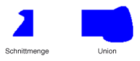

# Bereiche in GDI+
Ein Bereich ist ein Teil der Anzeigebereich des ein Ausgabegerät. Regionen können es sich um einfache (ein einzelnes Rechteck) oder komplexe (eine Kombination von Polygonen und geschlossene Kurven) sein. Die folgende Abbildung zeigt zwei Regionen: eine von einem Rechteck erstellt und die andere erstellt aus einem Pfad.  
  
   
  
## Verwenden von Bereichen  
 Regionen werden häufig für das Clipping verwendet und den Treffertest durchführen. Clipping wird beschränkt Zeichnen in einer bestimmten Region des Anzeigebereichs, normalerweise der Teil, der aktualisiert werden muss. Treffertests umfasst das Überprüfen, um festzustellen, ob der Cursor befindet sich in einer bestimmten Region des Bildschirms, wenn eine Maustaste gedrückt wird.  
  
 Sie können eine Region aus einem Rechteck oder einen Pfad erstellen. Sie können auch komplexe Regionen erstellen, durch die Kombination der vorhandener Regions. Die <xref:System.Drawing.Region> Klasse stellt die folgenden Methoden zum Kombinieren von Bereichen: <xref:System.Drawing.Region.Intersect%2A>, <xref:System.Drawing.Region.Union%2A>, <xref:System.Drawing.Region.Xor%2A>, <xref:System.Drawing.Region.Exclude%2A>, und <xref:System.Drawing.Region.Complement%2A>.  
  
 Die Schnittmenge von zwei Regionen ist die Menge aller Punkte, die in beiden Regionen gehören. Die Union ist die Menge aller Punkte, die zu den anderen oder beide Regionen gehören. Das Komplement eines Bereichs ist die Menge aller Punkte, die nicht in der Region sind. Die folgende Abbildung zeigt die Schnittmenge und die Union der beiden Regionen in der vorherigen Abbildung dargestellt.  
  
   
  
 Die <xref:System.Drawing.Region.Xor%2A> -Methode angewendet wird, auf ein Paar von Regionen, generiert einen Bereich, der alle Punkte enthält, die zu einer Region oder die andere aber nicht beide gehören. Die <xref:System.Drawing.Region.Exclude%2A> -Methode angewendet wird, auf ein Paar von Regionen, generiert einen Bereich, der alle Punkte in der ersten Region enthält, die nicht in der zweiten Region sind. Die folgende Abbildung zeigt die Bereiche, die aus der Anwendung führen die <xref:System.Drawing.Region.Xor%2A> und <xref:System.Drawing.Region.Exclude%2A> Methoden, um die beiden Bereiche am Anfang dieses Themas.  
  
   
  
 Um eine Region zu füllen, müssen Sie eine <xref:System.Drawing.Graphics> Objekt eine <xref:System.Drawing.Brush> Objekt und ein <xref:System.Drawing.Region> Objekt. Die <xref:System.Drawing.Graphics> -Objekt ermöglicht die <xref:System.Drawing.Graphics.FillRegion%2A> -Methode, und die <xref:System.Drawing.Brush> -Objekt speichert Attribute für die Füllung, z. B. Farbe oder einem Muster. Das folgende Beispiel füllt einen Bereich mit einer Volltonfarbe aus.  
  
 [!code-csharp[LinesCurvesAndShapes#61](~/samples/snippets/csharp/VS_Snippets_Winforms/LinesCurvesAndShapes/CS/Class1.cs#61)]
 [!code-vb[LinesCurvesAndShapes#61](~/samples/snippets/visualbasic/VS_Snippets_Winforms/LinesCurvesAndShapes/VB/Class1.vb#61)]  
  
## Siehe auch

- <xref:System.Drawing.Region?displayProperty=nameWithType>
- [Linien, Kurven und Formen](lines-curves-and-shapes.md)
- [Verwenden von Bereichen](using-regions.md)
