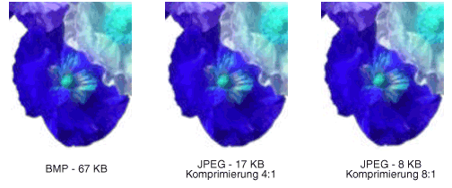

# BitmaptypenTypes of Bitmaps
Eine Bitmap ist ein Array von Bits, das die Farbe der einzelnen Pixel in einem rechteckigen Array von Pixeln angibt.A bitmap is an array of bits that specify the color of each pixel in a rectangular array of pixels. Die Anzahl von Bits, die einem einzelnen Pixel zugeordnet ist, bestimmt die Anzahl von Farben, die diesem Pixel zugewiesen werden können.The number of bits devoted to an individual pixel determines the number of colors that can be assigned to that pixel. Wenn beispielsweise jedes Pixel durch 4 Bits dargestellt wird, kann einem bestimmten Pixel eine von 16 verschiedenen Farben (2 ^ 4 = 16) zugewiesen werden.For example, if each pixel is represented by 4 bits, then a given pixel can be assigned one of 16 different colors (2^4 = 16). Die folgende Tabelle zeigt einige Beispiele für die Anzahl von Farben, die einem Pixel zugewiesen werden können, das durch eine bestimmte Anzahl von Bits dargestellt wird.The following table shows a few examples of the number of colors that can be assigned to a pixel represented by a given number of bits.  
  
|Bits pro PixelBits per pixel|Anzahl von Farben, die einem Pixel zugewiesen werden könnenNumber of colors that can be assigned to a pixel|  
|--------------------|------------------------------------------------------|  
|11|2^1 = 22^1 = 2|  
|22|2^2 = 42^2 = 4|  
|44|2^4 = 162^4 = 16|  
|88|2^8 = 2562^8 = 256|  
|1616|2^16 = 65,5362^16 = 65,536|  
|2424|2^24 = 16,777,2162^24 = 16,777,216|  
  
 Datenträger Dateien, die Bitmaps speichern, enthalten in der Regel mindestens einen Informationsblock, in dem Informationen wie die Anzahl der Bits pro Pixel, die Anzahl der Pixel in den einzelnen Zeilen und die Anzahl der Zeilen im Array gespeichert werden.Disk files that store bitmaps usually contain one or more information blocks that store information such as the number of bits per pixel, number of pixels in each row, and number of rows in the array. Eine solche Datei kann auch eine Farbtabelle (manchmal auch als Farbpalette bezeichnet) enthalten.Such a file might also contain a color table (sometimes called a color palette). In einer Farbtabelle werden Zahlen in der Bitmap bestimmten Farben zugeordnet.A color table maps numbers in the bitmap to specific colors. In der folgenden Abbildung wird ein erweitertes Bild zusammen mit dessen Bitmap und Farbtabelle dargestellt.The following illustration shows an enlarged image along with its bitmap and color table. Jedes Pixel wird durch eine 4-Bit-Zahl dargestellt, sodass in der Farbtabelle 2 ^ 4 = 16 Farben vorhanden sind.Each pixel is represented by a 4-bit number, so there are 2^4 = 16 colors in the color table. Jede Farbe in der Tabelle wird durch eine 24-Bit-Zahl dargestellt: 8 Bits für Rot, 8 Bits für Grün und 8 Bits für blau.Each color in the table is represented by a 24-bit number: 8 bits for red, 8 bits for green, and 8 bits for blue. Die Zahlen werden im Hexadezimal Format (Basis 16) angezeigt: A = 10, B = 11, C = 12, D = 13, E = 14, F = 15.The numbers are shown in hexadecimal (base 16) form: A = 10, B = 11, C = 12, D = 13, E = 14, F = 15.  
  
   
  
 Sehen Sie sich das Pixel in Zeile 3, Spalte 5 des Bilds an.Look at the pixel in row 3, column 5 of the image. Die entsprechende Zahl in der Bitmap ist 1.The corresponding number in the bitmap is 1. Die Color-Tabelle gibt an, dass 1 die Farbe rot darstellt, damit das Pixel rot ist.The color table tells us that 1 represents the color red so the pixel is red. Alle Einträge in der obersten Zeile der Bitmap sind 3.All the entries in the top row of the bitmap are 3. Die Color-Tabelle gibt an, dass 3 blau darstellt, sodass alle Pixel in der oberen Zeile des Bilds blau sind.The color table tells us that 3 represents blue, so all the pixels in the top row of the image are blue.  
  
> [!NOTE]
> Einige Bitmaps werden im unteren Format gespeichert. die Zahlen in der ersten Zeile der Bitmap entsprechen den Pixeln in der unteren Zeile des Bilds.Some bitmaps are stored in bottom-up format; the numbers in the first row of the bitmap correspond to the pixels in the bottom row of the image.  
  
 Eine Bitmap, die Indizes in einer Farbtabelle speichert, wird als palettenindiziertes Bitmap bezeichnet.A bitmap that stores indexes into a color table is called a palette-indexed bitmap. Für einige Bitmaps ist eine Farbtabelle nicht erforderlich.Some bitmaps have no need for a color table. Wenn eine Bitmap z. b. 24 Bits pro Pixel verwendet, kann diese Bitmap anstelle von Indizes in einer Farbtabelle die Farben selbst speichern.For example, if a bitmap uses 24 bits per pixel, that bitmap can store the colors themselves rather than indexes into a color table. Die folgende Abbildung zeigt eine Bitmap, die Farben direkt (24 Bits pro Pixel) speichert, anstatt eine Farbtabelle zu verwenden.The following illustration shows a bitmap that stores colors directly (24 bits per pixel) rather than using a color table. Die Abbildung zeigt auch eine vergrößerte Ansicht des entsprechenden Bilds.The illustration also shows an enlarged view of the corresponding image. In der Bitmap steht FFFFFF für weiß, FF0000 stellt rot, 00FF00 für Grün und 0000FF für Blau dar.In the bitmap, FFFFFF represents white, FF0000 represents red, 00FF00 represents green, and 0000FF represents blue.  
  
   
  
## Grafikdatei FormateGraphics File Formats  
 Es gibt viele Standardformate für das Speichern von Bitmaps in Datenträger Dateien.There are many standard formats for saving bitmaps in disk files. GDI+ unterstützt die in den folgenden Abschnitten beschriebenen Grafikdatei Formate.GDI+ supports the graphics file formats described in the following paragraphs.  
  
### BMPBMP  
 BMP ist ein Standardformat, das von Windows verwendet wird, um geräteunabhängige und Anwendungs unabhängige Images zu speichern.BMP is a standard format used by Windows to store device-independent and application-independent images. Die Anzahl der Bits pro Pixel (1, 4, 8, 15, 24, 32 oder 64) für eine bestimmte BMP-Datei wird in einem Dateiheader angegeben.The number of bits per pixel (1, 4, 8, 15, 24, 32, or 64) for a given BMP file is specified in a file header. BMP-Dateien mit 24 Bits pro Pixel sind üblich.BMP files with 24 bits per pixel are common. BMP-Dateien werden normalerweise nicht komprimiert und sind daher nicht gut für die Übertragung über das Internet geeignet.BMP files are usually not compressed and, therefore, are not well suited for transfer across the Internet.  
  
### Graphics Interchange Format (GIF)Graphics Interchange Format (GIF)  
 GIF ist ein gängiges Format für Bilder, die auf Webseiten angezeigt werden.GIF is a common format for images that appear on Web pages. Die GIFs funktionieren gut für Linienzeichnungen, Bilder mit Blöcken mit voll Tonfarbe und Bilder mit Spitzen Grenzen zwischen Farben.GIFs work well for line drawings, pictures with blocks of solid color, and pictures with sharp boundaries between colors. Die GIFs werden komprimiert, während der Komprimierungs Vorgang aber keine Informationen verloren gehen. ein entkomprimiertes Bild ist exakt mit dem Original identisch.GIFs are compressed, but no information is lost in the compression process; a decompressed image is exactly the same as the original. Eine Farbe in einem GIF kann als transparent festgelegt werden, sodass das Bild die Hintergrundfarbe jeder beliebigen Webseite hat, auf der es angezeigt wird.One color in a GIF can be designated as transparent, so that the image will have the background color of any Web page that displays it. Eine Sequenz von GIF-Bildern kann in einer einzelnen Datei gespeichert werden, um eine animierte GIF zu bilden.A sequence of GIF images can be stored in a single file to form an animated GIF. Der Wert von "GIFs" ist höchstens 8 Bits pro Pixel, sodass Sie auf 256 Farben beschränkt sind.GIFs store at most 8 bits per pixel, so they are limited to 256 colors.  
  
### JPEG (Joint Photographic Experts Group)Joint Photographic Experts Group (JPEG)  
 JPEG ist ein Komprimierungs Schema, das für natürliche Szenen wie z. b. gescannte Fotos gut funktioniert.JPEG is a compression scheme that works well for natural scenes such as scanned photographs. Einige Informationen gehen im Komprimierungs Prozess verloren, aber häufig ist der Verlust für das menschliche Auge nicht wahrnehmbar.Some information is lost in the compression process, but often the loss is imperceptible to the human eye. Jpeer speichert 24 Bits pro Pixel, sodass Sie mehr als 16 Millionen Farben anzeigen können.JPEGs store 24 bits per pixel, so they are capable of displaying more than 16 million colors. Jpeer unterstützt keine Transparenz oder Animation.JPEGs do not support transparency or animation.  
  
 Der Komprimierungs Grad in JPEG-Bildern ist konfigurierbar, höhere Komprimierungs Stufen (kleinere Dateien) führen jedoch zu einem größeren Informationsverlust.The level of compression in JPEG images is configurable, but higher compression levels (smaller files) result in more loss of information. Ein 20:1-Komprimierungs Verhältnis erzeugt häufig ein Bild, das dem Menschen schwer zu unterscheiden ist.A 20:1 compression ratio often produces an image that the human eye finds difficult to distinguish from the original. Die folgende Abbildung zeigt ein BMP-Bild und zwei JPEG-Bilder, die von diesem BMP-Bild komprimiert wurden.The following illustration shows a BMP image and two JPEG images that were compressed from that BMP image. Das erste JPEG hat ein Komprimierungs Verhältnis von 4:1, und das zweite JPEG hat ein Komprimierungs Verhältnis von ungefähr 8:1.The first JPEG has a compression ratio of 4:1 and the second JPEG has a compression ratio of about 8:1.  
  
   
  
 Die JPEG-Komprimierung funktioniert nicht gut für Linienzeichnungen, Blöcke mit voll Tonfarbe und Spitzen Grenzen.JPEG compression does not work well for line drawings, blocks of solid color, and sharp boundaries. Die folgende Abbildung zeigt eine BMP zusammen mit zwei jpeer-und GIF-Funktionen.The following illustration shows a BMP along with two JPEGs and a GIF. Die jpeer-und GIF-Datei wurden aus dem BMP komprimiert.The JPEGs and the GIF were compressed from the BMP. Das Komprimierungs Verhältnis beträgt 4:1 für GIF, 4:1 für das kleinere JPEG und 8:3 für das größere JPEG.The compression ratio is 4:1 for the GIF, 4:1 for the smaller JPEG, and 8:3 for the larger JPEG. Beachten Sie, dass das GIF die Spitzen Grenzen entlang der Linien beibehält, aber die jpeer-Einheiten neigen dazu, die Grenzen zu verwischen.Note that the GIF maintains the sharp boundaries along the lines, but the JPEGs tend to blur the boundaries.  
  
   
  
 JPEG ist ein Komprimierungs Schema, kein Dateiformat.JPEG is a compression scheme, not a file format. Das JPEG-Dateiaustauschformat (JFI) ist ein Datei Format, das häufig zum Speichern und übertragen von Images verwendet wird, die gemäß dem JPEG-Schema komprimiert wurden.JPEG File Interchange Format (JFIF) is a file format commonly used for storing and transferring images that have been compressed according to the JPEG scheme. JFI-Dateien, die von Webbrowsern angezeigt werden, verwenden die Erweiterung. jpg.JFIF files displayed by Web browsers use the .jpg extension.  
  
### Austauschbare Bilddatei (EXIF)Exchangeable Image File (EXIF)  
 EXIF ist ein Dateiformat für Fotos, die von Digitalkameras aufgezeichnet werden.EXIF is a file format used for photographs captured by digital cameras. Eine EXIF-Datei enthält ein Bild, das gemäß der JPEG-Spezifikation komprimiert wird.An EXIF file contains an image that is compressed according to the JPEG specification. Eine EXIF-Datei enthält außerdem Informationen über das Foto (ergriffene Daten, die Auslösezeit usw.) und Informationen zur Kamera (Hersteller, Modell usw.).An EXIF file also contains information about the photograph (date taken, shutter speed, exposure time, and so on) and information about the camera (manufacturer, model, and so on).  
  
### Portable Network Graphics (PNG)Portable Network Graphics (PNG)  
 Das PNG-Format behält viele der Vorteile des gif-Formats bei, bietet aber auch Funktionen, die über die von GIF hinausgehen.The PNG format retains many of the advantages of the GIF format but also provides capabilities beyond those of GIF. Wie bei GIF-Dateien werden PNG-Dateien ohne Informationsverlust komprimiert.Like GIF files, PNG files are compressed with no loss of information. PNG-Dateien können Farben mit 8, 24 oder 48 Bits pro Pixel und Graustufen mit 1, 2, 4, 8 oder 16 Bits pro Pixel speichern.PNG files can store colors with 8, 24, or 48 bits per pixel and grayscales with 1, 2, 4, 8, or 16 bits per pixel. Im Gegensatz dazu können GIF-Dateien nur 1, 2, 4 oder 8 Bits pro Pixel verwenden.In contrast, GIF files can use only 1, 2, 4, or 8 bits per pixel. Eine PNG-Datei kann auch einen Alphawert für jedes Pixel speichern, der den Grad angibt, in dem die Farbe dieses Pixels mit der Hintergrundfarbe gemischt wird.A PNG file can also store an alpha value for each pixel, which specifies the degree to which the color of that pixel is blended with the background color.  
  
 PNG verbessert in seiner Fähigkeit, ein Bild progressiv anzuzeigen (d. h., um bessere und bessere Näherungen des Bilds anzuzeigen, wenn es über eine Netzwerkverbindung gelangt).PNG improves on GIF in its ability to progressively display an image (that is, to display better and better approximations of the image as it arrives over a network connection). PNG-Dateien können Gammakorrektur-und Farbkorrektur Informationen enthalten, damit die Bilder auf einer Vielzahl von Anzeigegeräten exakt gerendert werden können.PNG files can contain gamma correction and color correction information so that the images can be accurately rendered on a variety of display devices.  
  
### Tagbild Datei Format (TIFF)Tag Image File Format (TIFF)  
 TIFF ist ein flexibles und erweiterbares Format, das von einer Vielzahl von Plattformen und Bildverarbeitungsanwendungen unterstützt wird.TIFF is a flexible and extendable format that is supported by a wide variety of platforms and image-processing applications. TIFF-Dateien können Bilder mit einer beliebigen Anzahl von Bits pro Pixel speichern und verschiedene Komprimierungs Algorithmen verwenden.TIFF files can store images with an arbitrary number of bits per pixel and can employ a variety of compression algorithms. Mehrere Bilder können in einer einzelnen, mehrseitigen TIFF-Datei gespeichert werden.Several images can be stored in a single, multiple-page TIFF file. Informationen im Zusammenhang mit dem Image (Scanner, Host Computer, Komprimierungstyp, Ausrichtung, Beispiele pro Pixel usw.) können in der Datei gespeichert und durch die Verwendung von Tags angeordnet werden.Information related to the image (scanner make, host computer, type of compression, orientation, samples per pixel, and so on) can be stored in the file and arranged through the use of tags. Das TIFF-Format kann je nach Bedarf durch die Genehmigung und Addition neuer Tags erweitert werden.The TIFF format can be extended as needed by the approval and addition of new tags.  
  
## Weitere InformationenSee also

- <xref:System.Drawing.Image?displayProperty=nameWithType>
- <xref:System.Drawing.Bitmap?displayProperty=nameWithType>
- <xref:System.Drawing.Imaging.PixelFormat?displayProperty=nameWithType>
- [Bilder, Bitmaps und MetadateienImages, Bitmaps, and Metafiles](images-bitmaps-and-metafiles.md)
- [Arbeiten mit Bildern, Bitmaps, Symbolen und MetadateienWorking with Images, Bitmaps, Icons, and Metafiles](working-with-images-bitmaps-icons-and-metafiles.md)
