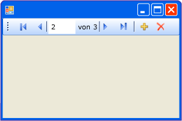

# Übersicht über das BindingNavigator-Steuerelement (Windows Forms)
Mit dem <xref:System.Windows.Forms.BindingNavigator>-Steuerelement können Sie ein standardisiertes Instrument erstellen, mit dem Benutzer Daten in einem Windows Form suchen und ändern können. <xref:System.Windows.Forms.BindingNavigator> wird häufig zusammen mit der <xref:System.Windows.Forms.BindingSource>-Komponente verwendet, damit Benutzer Datensätze in einem Formular durchlaufen und bearbeiten können.  
  
## So funktioniert der BindingNavigator  
 Das <xref:System.Windows.Forms.BindingNavigator>-Steuerelement besteht aus einem <xref:System.Windows.Forms.ToolStrip>-Objekt mit einer Reihe von <xref:System.Windows.Forms.ToolStripItem>-Objekten für die meisten gängigen datenbezogenen Aktionen: Hinzufügen von Daten, Löschen von Daten und Navigieren durch Daten. Standardmäßig enthält das <xref:System.Windows.Forms.BindingNavigator>-Steuerelement enthält diese Standardschaltflächen. Die folgende Abbildung zeigt das <xref:System.Windows.Forms.BindingNavigator>-Steuerelement in einem Formular.  
  
   
  
 In der folgende Tabelle sind die Steuerelemente aufgelistet und deren Funktionen beschrieben.  
  
|Steuerelement|Funktion|  
|-------------|--------------|  
|<xref:System.Windows.Forms.BindingNavigator.AddNewItem%2A>-Schaltfläche|Fügt eine neue Zeile in der zugrunde liegenden Datenquelle ein.|  
|<xref:System.Windows.Forms.BindingNavigator.DeleteItem%2A>-Schaltfläche|Löscht die aktuelle Zeile aus der zugrunde liegenden Datenquelle.|  
|<xref:System.Windows.Forms.BindingNavigator.MoveFirstItem%2A>-Schaltfläche|Wechselt zum ersten Element in der zugrunde liegenden Datenquelle.|  
|<xref:System.Windows.Forms.BindingNavigator.MoveLastItem%2A>-Schaltfläche|Wechselt zum letzten Element in der zugrunde liegenden Datenquelle.|  
|<xref:System.Windows.Forms.BindingNavigator.MoveNextItem%2A>-Schaltfläche|Wechselt zum nächsten Element in der zugrunde liegenden Datenquelle.|  
|<xref:System.Windows.Forms.BindingNavigator.MovePreviousItem%2A>-Schaltfläche|Wechselt zum vorherigen Element in der zugrunde liegenden Datenquelle.|  
|<xref:System.Windows.Forms.BindingNavigator.PositionItem%2A>-Textfeld|Gibt die aktuelle Position in der zugrunde liegenden Datenquelle zurück.|  
|<xref:System.Windows.Forms.BindingNavigator.CountItem%2A>-Textfeld|Gibt die Gesamtzahl von Elementen in der zugrunde liegenden Datenquelle zurück.|  
  
 Für jedes Steuerelement in dieser Auflistung gibt es einen entsprechenden Member der <xref:System.Windows.Forms.BindingSource>-Komponente, die dieselbe Funktionalität programmgesteuert bereitstellt. Beispielsweise entspricht die <xref:System.Windows.Forms.BindingNavigator.MoveFirstItem%2A>-Schaltfläche der <xref:System.Windows.Forms.BindingSource.MoveFirst%2A>-Methode der <xref:System.Windows.Forms.BindingSource>-Komponente, die <xref:System.Windows.Forms.BindingNavigator.DeleteItem%2A>-Schaltfläche der <xref:System.Windows.Forms.BindingSource.RemoveCurrent%2A>-Methode usw.  
  
 Wenn die Standardschaltflächen für Ihre Anwendung nicht geeignet sind, oder wenn Sie weitere Schaltflächen benötigen, um andere Funktionalitäten zu unterstützen, können Sie Ihre eigenen <xref:System.Windows.Forms.ToolStrip>-Schaltflächen bereitstellen. Siehe auch [Vorgehensweise: Hinzufügen der Schaltflächen für das Laden, Speichern und Abbrechen zum BindingNavigator-Steuerelement in Windows Forms](../../../../docs/framework/winforms/controls/load-save-and-cancel-bindingnavigator.md).  
  
## Siehe auch  
 <xref:System.Windows.Forms.BindingNavigator>  
 <xref:System.Windows.Forms.BindingSource>  
 [BindingNavigator-Steuerelement](../../../../docs/framework/winforms/controls/bindingnavigator-control-windows-forms.md)
