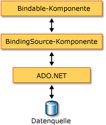

# Übersicht über die BindingSource-KomponenteBindingSource Component Overview
Die <xref:System.Windows.Forms.BindingSource>-Komponente vereinfacht den Bindungsvorgang von Steuerelementen an eine zugrunde liegende Datenquelle.The <xref:System.Windows.Forms.BindingSource> component is designed to simplify the process of binding controls to an underlying data source. Die <xref:System.Windows.Forms.BindingSource>-Komponente fungiert als Kanal sowie als Datenquelle für andere Steuerelemente, an die eine Bindung erfolgen soll.The <xref:System.Windows.Forms.BindingSource> component acts as both a conduit and a data source for other controls to bind to. Sie stellt eine Abstraktion der Datenverbindung Ihres Formulars bereit, während Befehle an die zugrunde liegende Liste der Daten übergeben werden.It provides an abstraction of your form's data connection while passing through commands to the underlying list of data. Außerdem können Sie Daten direkt hinzufügen. Die Komponente selbst fungiert daher als Datenquelle.Additionally, you can add data directly to it, so that the component itself functions as a data source.  
  
## „BindingSource“-Komponente als ZwischenelementBindingSource Component as an Intermediary  
 Die <xref:System.Windows.Forms.BindingSource>-Komponente fungiert als Datenquelle für einige oder alle Steuerelemente im Formular.The <xref:System.Windows.Forms.BindingSource> component acts as the data source for some or all of the controls on the form. In Visual Studio die <xref:System.Windows.Forms.BindingSource> gebunden werden kann, auf ein Steuerelement von der `DataBindings` Eigenschaft, die über die **Eigenschaften** Fenster.In Visual Studio, the <xref:System.Windows.Forms.BindingSource> can be bound to a control by means of the `DataBindings` property, which is accessible from the **Properties** window. Weitere Informationen hierzu finden Sie auch unter [Gewusst wie: Binden von Windows Forms-Steuerelementen mithilfe der BindingSource-Komponente, die mithilfe des Designers](bind-wf-controls-with-the-bindingsource.md).Also see [How to: Bind Windows Forms Controls with the BindingSource Component Using the Designer](bind-wf-controls-with-the-bindingsource.md).  
  
 Sie können die <xref:System.Windows.Forms.BindingSource>-Komponente an einfache Datenquellen (etwa eine einzelne Eigenschaft eines Objekts oder eine Basisauflistung wie <xref:System.Collections.ArrayList>) und komplexe Datenquellen (etwa eine Datenbanktabelle) binden.You can bind the <xref:System.Windows.Forms.BindingSource> component to both simple data sources, like a single property of an object or a basic collection like <xref:System.Collections.ArrayList>, and complex data sources, like a database table. Die <xref:System.Windows.Forms.BindingSource>-Komponente fungiert als Zwischenelement, das Bindungs- und Währungsverwaltungsdienste bereitstellt.The <xref:System.Windows.Forms.BindingSource> component acts as an intermediary that provides binding and currency management services. Sie können eine <xref:System.Windows.Forms.BindingSource>-Komponente zur Entwurfszeit oder zur Laufzeit an eine komplexe Datenquelle durch Festlegen der Eigenschaften <xref:System.Windows.Forms.BindingSource.DataSource%2A> und <xref:System.Windows.Forms.BindingSource.DataMember%2A> an die Datenbank bzw. die Tabelle binden.At design time or run time, you can bind a <xref:System.Windows.Forms.BindingSource> component to a complex data source by setting its <xref:System.Windows.Forms.BindingSource.DataSource%2A> and <xref:System.Windows.Forms.BindingSource.DataMember%2A> properties to the database and table, respectively. Die folgende Abbildung zeigt, wie sich die <xref:System.Windows.Forms.BindingSource>-Komponente in die vorhandene Datenbindungsarchitektur einfügt.The following illustration demonstrates where the <xref:System.Windows.Forms.BindingSource> component fits into the existing data-binding architecture.  
  
   
  
> [!NOTE]
>  Zur Entwurfszeit erstellen einige Aktionen (z. B. das Ziehen einer Datenbanktabelle aus einem Datenfenster in ein leeres Formular) die <xref:System.Windows.Forms.BindingSource>-Komponente, binden diese an die zugrunde liegenden Datenquelle und fügen datenkompatible Steuerelemente in einem Vorgang hinzu.At design time, some actions, like dragging a database table from a data window onto a blank form, will create the <xref:System.Windows.Forms.BindingSource> component, bind it to the underlying data source, and add data-aware controls all in one operation. Siehe auch [Binden von Windows Forms-Steuerelementen an Daten in Visual Studio](/visualstudio/data-tools/bind-windows-forms-controls-to-data-in-visual-studio).Also see [Bind Windows Forms controls to data in Visual Studio](/visualstudio/data-tools/bind-windows-forms-controls-to-data-in-visual-studio).  
  
## BindingSource-Komponente als DatenquelleBindingSource Component as a Data Source  
 Wenn Sie damit beginnen, der <xref:System.Windows.Forms.BindingSource>-Komponente Elemente hinzuzufügen, ohne zunächst eine Liste anzugeben, an die die Bindung erfolgen soll, agiert die Komponente wie eine Listendatenquelle und akzeptiert diese hinzugefügten Elemente.If you start adding items to the <xref:System.Windows.Forms.BindingSource> component without first specifying a list to be bound to, the component will act like a list-style data source and accept these added items.  
  
 Außerdem können Sie Code schreiben, um benutzerdefinierte "AddNew"-Funktionalität mithilfe des Ereignisses <xref:System.Windows.Forms.BindingSource.AddingNew> bereitzustellen, das ausgelöst wird, wenn die Methode <xref:System.Windows.Forms.BindingSource.AddNew%2A> aufgerufen wird, bevor das Element der Liste hinzugefügt wird.Additionally, you can write code to provide custom "AddNew" functionality by means of the <xref:System.Windows.Forms.BindingSource.AddingNew> event, which is raised when the <xref:System.Windows.Forms.BindingSource.AddNew%2A> method is called prior to the item being added to the list. Weitere Informationen finden Sie unter [Architektur der BindingSource-Komponente](bindingsource-component-architecture.md).For more information, see [BindingSource Component Architecture](bindingsource-component-architecture.md).  
  
## NavigationNavigation  
 Für Benutzer, die in den Daten eines Formulars navigieren müssen, ermöglicht die <xref:System.Windows.Forms.BindingNavigator>-Komponente das Navigieren und Bearbeiten von Daten in Kombination mit einer <xref:System.Windows.Forms.BindingSource>-Komponente.For users that need to navigate the data on a form, the <xref:System.Windows.Forms.BindingNavigator> component enables you to navigate and manipulate data, in coordination with a <xref:System.Windows.Forms.BindingSource> component. Weitere Informationen finden Sie unter [BindingNavigator-Steuerelement](bindingnavigator-control-windows-forms.md).For more information, see [BindingNavigator Control](bindingnavigator-control-windows-forms.md).  
  
## DatenbearbeitungData Manipulation  
 Die <xref:System.Windows.Forms.BindingSource> fungiert als ein <xref:System.Windows.Forms.CurrencyManager> für alle Bindungen und kann daher Zugriff auf Währungs- und Positionsinformationen hinsichtlich der Datenquelle bereitstellen.The: <xref:System.Windows.Forms.BindingSource> acts as a <xref:System.Windows.Forms.CurrencyManager> for all of its bindings and can, therefore, provide access to currency and position information regarding the data source. Die folgende Tabelle enthält die Elemente, die die <xref:System.Windows.Forms.BindingSource>-Komponente für den Zugriff auf die und das Bearbeiten der zugrunde liegenden Daten bereitstellt.The following table shows the members that the <xref:System.Windows.Forms.BindingSource> component provides for accessing and manipulating the underlying data.  
  
|MemberMember|BeschreibungDescription|  
|------------|-----------------|  
|<xref:System.Windows.Forms.BindingSource.Current%2A> -Eigenschaft<xref:System.Windows.Forms.BindingSource.Current%2A> property|Ruft das aktuelle Element der Datenquelle ab.Gets the current item of the data source.|  
|<xref:System.Windows.Forms.BindingSource.Position%2A> -Eigenschaft<xref:System.Windows.Forms.BindingSource.Position%2A> property|Ruft die aktuelle Position in der zugrunde liegenden Liste ab oder legt diese fest.Gets or sets the current position in the underlying list.|  
|<xref:System.Windows.Forms.BindingSource.List%2A> -Eigenschaft<xref:System.Windows.Forms.BindingSource.List%2A> property|Ruft die Liste ab, die die Auswertung der Auswertung <xref:System.Windows.Forms.BindingSource.DataSource%2A> und <xref:System.Windows.Forms.BindingSource.DataMember%2A> darstellt.Gets the list that is the evaluation of the <xref:System.Windows.Forms.BindingSource.DataSource%2A> and <xref:System.Windows.Forms.BindingSource.DataMember%2A> evaluation. Wenn <xref:System.Windows.Forms.BindingSource.DataMember%2A> nicht festgelegt ist, wird die durch <xref:System.Windows.Forms.BindingSource.DataSource%2A> angegebene Liste zurückgegeben.If <xref:System.Windows.Forms.BindingSource.DataMember%2A> is not set, returns the list specified by <xref:System.Windows.Forms.BindingSource.DataSource%2A>.|  
|<xref:System.Windows.Forms.BindingSource.Insert%2A>-Methode<xref:System.Windows.Forms.BindingSource.Insert%2A> method|Fügt ein Element am angegebenen Index in die Liste ein.Inserts an item in the list at the specified index.|  
|<xref:System.Windows.Forms.BindingSource.RemoveCurrent%2A>-Methode<xref:System.Windows.Forms.BindingSource.RemoveCurrent%2A> method|Entfernt das aktuelle Element aus der Liste.Removes the current item from the list.|  
|<xref:System.Windows.Forms.BindingSource.EndEdit%2A>-Methode<xref:System.Windows.Forms.BindingSource.EndEdit%2A> method|Wendet anstehende Änderungen auf die zugrunde liegende Datenquelle an.Applies pending changes to the underlying data source.|  
|<xref:System.Windows.Forms.BindingSource.CancelEdit%2A>-Methode<xref:System.Windows.Forms.BindingSource.CancelEdit%2A> method|Bricht den aktuellen Bearbeitungsvorgang ab.Cancels the current edit operation.|  
|<xref:System.Windows.Forms.BindingSource.AddNew%2A>-Methode<xref:System.Windows.Forms.BindingSource.AddNew%2A> method|Fügt der zugrunde liegenden Liste ein neues Element hinzu.Adds a new item to the underlying list. Wenn die Datenquelle <xref:System.ComponentModel.IBindingList> implementiert und ein Element aus dem <xref:System.Windows.Forms.BindingSource.AddingNew>-Ereignis zurückgibt, wird dieses Element hinzugefügt.If the data source implements <xref:System.ComponentModel.IBindingList> and returns an item from the <xref:System.Windows.Forms.BindingSource.AddingNew> event, adds this item. Andernfalls wird die Anforderung an die Methode <xref:System.ComponentModel.IBindingList.AddNew%2A> der Liste übergeben.Otherwise, the request is passed to the list's <xref:System.ComponentModel.IBindingList.AddNew%2A> method. Wenn die zugrunde liegende Liste keine <xref:System.ComponentModel.IBindingList> ist, wird das Element automatisch über seinen öffentlichen Standardkonstruktor erstellt.If the underlying list is not an <xref:System.ComponentModel.IBindingList>, the item is automatically created through its public default constructor.|  
  
## Sortieren und FilternSorting and Filtering  
 In der Regel sollten Sie mit einer sortierten oder gefilterten Sicht der Datenquelle arbeiten.Usually, you should work with an ordered or filtered view of the data source. Die folgende Tabelle zeigt die Elemente, die die <xref:System.Windows.Forms.BindingSource>-Komponentendatenquelle bereitstellt.The following table shows the members that the <xref:System.Windows.Forms.BindingSource> component data source provides.  
  
|MemberMember|BeschreibungDescription|  
|------------|-----------------|  
|<xref:System.Windows.Forms.BindingSource.Sort%2A> -Eigenschaft<xref:System.Windows.Forms.BindingSource.Sort%2A> property|Wenn die Datenquelle eine <xref:System.ComponentModel.IBindingList> ist, wird ein Spaltenname abgerufen oder festgelegt, der für das Sortieren und für Informationen zur Sortierreihenfolge verwendet wird.If the data source is an <xref:System.ComponentModel.IBindingList>, gets or sets a column name used for sorting and sort order information. Wenn die Datenquelle eine <xref:System.ComponentModel.IBindingListView> ist und erweiterte Sortierung unterstützt, werden mehrere Spaltennamen abgerufen, die für das Sortieren und für Informationen zur Sortierreihenfolge verwendet werden.If the data source is an <xref:System.ComponentModel.IBindingListView> and supports advanced sorting, gets multiple column names used for sorting and sort order information|  
|<xref:System.Windows.Forms.BindingSource.Filter%2A> -Eigenschaft<xref:System.Windows.Forms.BindingSource.Filter%2A> property|Wenn die Datenquelle eine <xref:System.ComponentModel.IBindingListView> ist, wird der Ausdruck abgerufen, der zum Filtern der anzuzeigenden Zeilen verwendet wird, oder dieser Ausdruck wird festgelegt.If the data source is an <xref:System.ComponentModel.IBindingListView>, gets or sets the expression used to filter which rows are viewed.|  
  
## Siehe auchSee also

- <xref:System.Windows.Forms.BindingSource>
- <xref:System.Windows.Forms.BindingNavigator>
- [Architektur der BindingSource-KomponenteBindingSource Component Architecture](bindingsource-component-architecture.md)
- [BindingSource-KomponenteBindingSource Component](bindingsource-component.md)
- [BindingNavigator-SteuerelementBindingNavigator Control](bindingnavigator-control-windows-forms.md)
- [Windows Forms-DatenbindungWindows Forms Data Binding](../windows-forms-data-binding.md)
- [Windows Forms-SteuerelementeControls to Use on Windows Forms](controls-to-use-on-windows-forms.md)
