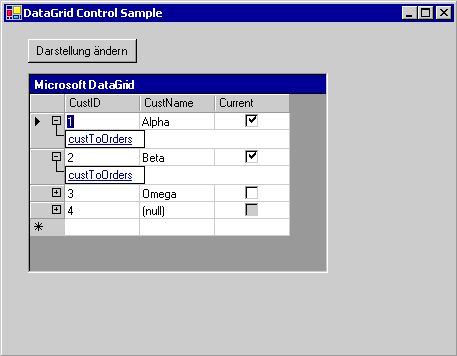

# Übersicht über das DataGrid-Steuerelement (Windows Forms)
> [!NOTE]
>  Obwohl das <xref:System.Windows.Forms.DataGridView>-Steuerelement das <xref:System.Windows.Forms.DataGrid>-Steuerelement ersetzt und funktionell erweitert, wird das <xref:System.Windows.Forms.DataGrid>-Steuerelement sowohl aus Gründen der Abwärtskompatibilität als auch, falls gewünscht, für die zukünftige Verwendung beibehalten. Weitere Informationen finden Sie unter [Unterschiede zwischen dem DataGridView-Steuerelement und dem DataGrid-Steuerelement in Windows Forms](../../../../docs/framework/winforms/controls/differences-between-the-windows-forms-datagridview-and-datagrid-controls.md).  
  
 Das <xref:System.Windows.Forms.DataGrid>-Steuerelement in Windows Forms zeigt Daten in einer Gruppe von Zeilen und Spalten an. Der einfachste Fall liegt vor, wenn das Raster an eine Datenquelle gebunden ist, die aus einer einzigen Tabelle ohne Beziehungen besteht. In diesem Fall werden die Daten wie in einer Kalkulationstabelle in einfachen Zeilen und Spalten angezeigt. Weitere Informationen über die Bindung von Daten an andere Steuerelemente finden Sie unter [Datenbindung und Windows Forms](../../../../docs/framework/winforms/data-binding-and-windows-forms.md).  
  
 Wenn das <xref:System.Windows.Forms.DataGrid>-Steuerelement an Daten mit mehreren verknüpften Tabellen gebunden ist und die Navigation für das Raster aktiviert ist, werden in jeder Zeile des Rasters Erweiterungen angezeigt. Mit einer Erweiterung kann der Benutzer von einer übergeordneten Tabelle zu einer untergeordneten Tabelle navigieren. Durch Klicken auf einen Knoten wird die untergeordnete Tabelle angezeigt, und durch Klicken auf die Schaltfläche "Zurück" wird die ursprüngliche übergeordnete Tabelle angezeigt. Auf diese Weise zeigt das Raster die hierarchischen Beziehungen zwischen Tabellen an.  
  
 Im folgenden Screenshot ist ein an Daten mit mehreren Tabellen gebundenes DataGrid-Steuerelement dargestellt.  
  
   
Ein DataGrid-Steuerelement mit einer Bindung an Daten in mehreren Tabellen  
  
 Das <xref:System.Windows.Forms.DataGrid>-Steuerelement kann eine Benutzeroberfläche für ein DataSet, die Navigation zwischen verknüpften Tabellen sowie umfangreiche Formatierungs- und Bearbeitungsfunktionen bereitstellen.  
  
 Das Anzeigen und das Bearbeiten von Daten sind verschiedene Funktionen: Das Steuerelement ist für die Benutzeroberfläche zuständig, während die Datenbindungsarchitektur von Windows Forms und [!INCLUDE[dnprdnshort](../../../../includes/dnprdnshort-md.md)]-Datenanbieter für Datenaktualisierungen zuständig sind. Aus diesem Grund werden mehrere Steuerelemente, die an die gleiche Datenquelle gebunden sind, immer synchronisiert.  
  
> [!NOTE]
>  Wenn Sie mit dem DataGrid-Steuerelement in Visual Basic 6.0 vertraut sind, werden Ihnen beim <xref:System.Windows.Forms.DataGrid>-Steuerelement in Windows Forms wesentliche Unterschiede auffallen.  
  
 Wenn das Raster an ein <xref:System.Data.DataSet> gebunden ist, werden die Spalten und Zeilen automatisch erstellt, formatiert und gefüllt. Weitere Informationen finden Sie unter [Datenbindung und Windows Forms](../../../../docs/framework/winforms/data-binding-and-windows-forms.md). Nach dem Generieren des <xref:System.Windows.Forms.DataGrid>-Steuerelements können Sie Spalten und Zeilen Ihren Anforderungen entsprechend hinzufügen, löschen, neu anordnen und formatieren.  
  
## Binden von Daten an das Steuerelement  
 Damit das <xref:System.Windows.Forms.DataGrid>-Steuerelement funktioniert, muss es zur Entwurfszeit mit der <xref:System.Windows.Forms.DataGrid.DataSource%2A>-Eigenschaft und der <xref:System.Windows.Forms.DataGrid.DataMember%2A>-Eigenschaft oder zur Laufzeit mit der <xref:System.Windows.Forms.DataGrid.SetDataBinding%2A>-Methode an eine Datenquelle gebunden werden. Diese Bindung verweist das <xref:System.Windows.Forms.DataGrid>-Steuerelement auf ein instanziiertes Datenquellenobjekt, beispielsweise auf ein <xref:System.Data.DataSet> oder eine <xref:System.Data.DataTable>. Das <xref:System.Windows.Forms.DataGrid>-Steuerelement zeigt die Ergebnisse der für die Daten ausgeführten Aktionen an. Die meisten datenspezifischen Aktionen werden nicht vom <xref:System.Windows.Forms.DataGrid>-Steuerelement, sondern von der Datenquelle ausgeführt.  
  
 Wenn die Daten im gebundenen DataSet auf beliebige Weise aktualisiert werden, spiegelt das <xref:System.Windows.Forms.DataGrid>-Steuerelement die Änderungen wider. Wenn das Datenraster und dessen Tabellen- und Spaltenformate haben die `ReadOnly` -Eigenschaft auf festgelegt `false`, die Daten in Datasets können aktualisiert werden, über die <xref:System.Windows.Forms.DataGrid> Steuerelement.  
  
 Es kann jeweils nur eine Tabelle im <xref:System.Windows.Forms.DataGrid> angezeigt werden. Wenn zwischen Tabellen Beziehungen zwischen über- und untergeordneten Elementen definiert sind, kann der Benutzer zwischen den verknüpften Tabellen navigieren, um die im <xref:System.Windows.Forms.DataGrid>-Steuerelement anzuzeigende Tabelle auszuwählen. Informationen zum Binden einer <xref:System.Windows.Forms.DataGrid> die Steuerung an eine [!INCLUDE[vstecado](../../../../includes/vstecado-md.md)] -Datenquelle zur Entwurfszeit oder zur Laufzeit finden Sie unter [Vorgehensweise: Binden des DataGrid-Steuerelements in Windows Forms an eine Datenquelle](../../../../docs/framework/winforms/controls/how-to-bind-the-windows-forms-datagrid-control-to-a-data-source.md).  
  
 Gültige Datenquellen für das <xref:System.Windows.Forms.DataGrid>-Steuerelement umfassen Folgendes:  
  
-   <xref:System.Data.DataTable>-Klasse  
  
-   <xref:System.Data.DataView>-Klasse  
  
-   <xref:System.Data.DataSet>-Klasse  
  
-   <xref:System.Data.DataViewManager>-Klasse  
  
 Wenn es sich bei der Quelle um ein DataSet handelt, kann das DataSet ein Objekt im Formular oder ein Objekt sein, das von einem XML-Webdienst an das Formular übergeben wurde. Sie können das Steuerelement an typisierte oder nicht typisierte DataSets binden.  
  
 Sie können ein <xref:System.Windows.Forms.DataGrid>-Steuerelement auch an zusätzliche Strukturen binden, wenn die Objekte in der Struktur, beispielsweise die Elemente in einem Array, öffentliche Eigenschaften anzeigen. Im Raster werden alle öffentlichen Eigenschaften der Elemente in der Struktur angezeigt. Wenn Sie z. B. das <xref:System.Windows.Forms.DataGrid>-Steuerelement an ein Array von Customer-Objekten binden, werden im Raster alle öffentlichen Eigenschaften dieser Customer-Objekte angezeigt. In einigen Fällen bedeutet dies, dass zwar eine Bindung an die Struktur möglich ist, aber die resultierende gebundene Struktur keine praktische Anwendung findet. So ist beispielsweise die Bindung an ein Array von Ganzzahlen möglich, aber weil der Datentyp `Integer` keine öffentlichen Eigenschaften unterstützt, kann das Raster keine Daten anzeigen.  
  
 Sie können an die folgenden Strukturen binden, wenn die zugehörigen Elemente öffentliche Eigenschaften anzeigen:  
  
-   Komponenten, die die <xref:System.Collections.IList>-Schnittstelle implementieren. Dazu gehören eindimensionale Arrays.  
  
-   Komponenten, die die <xref:System.ComponentModel.IListSource>-Schnittstelle implementieren.  
  
-   Komponenten, die die <xref:System.ComponentModel.IBindingList>-Schnittstelle implementieren.  
  
 Weitere Informationen zu möglichen Datenquellen finden Sie unter [Von Windows Forms unterstützte Datenquellen](../../../../docs/framework/winforms/data-sources-supported-by-windows-forms.md).  
  
## Rasteranzeige  
 Das <xref:System.Windows.Forms.DataGrid>-Steuerelement wird häufig zum Anzeigen einer einzelnen Tabelle mit Daten aus einem DataSet verwendet. Das Steuerelement kann jedoch auch zum Anzeigen mehrerer Tabellen (einschließlich verknüpfter Tabellen) verwendet werden. Die Anzeige des Rasters wird automatisch an die Datenquelle angepasst. Der folgenden Tabelle können Sie entnehmen, was für verschiedene Konfigurationen angezeigt wird.  
  
|Inhalt des DataSets|Anzeige|  
|--------------------------|-----------------------|  
|Einzelne Tabelle|Die Tabelle wird in einem Raster angezeigt.|  
|Mehrere Tabellen|Im Raster kann eine Strukturansicht angezeigt werden, in der Benutzer navigieren können, um nach der anzuzeigenden Tabelle zu suchen.|  
|Mehrere verknüpfte Tabellen|Im Raster kann eine Strukturansicht angezeigt werden, in der Tabellen ausgewählt werden können. Sie können aber auch angeben, dass im Raster die übergeordnete Tabelle angezeigt werden soll. Mithilfe von Datensätzen in der übergeordneten Tabelle können Benutzer zu den entsprechenden untergeordneten Zeilen navigieren.|  
  
> [!NOTE]
>  Tabellen in einem DataSet werden mithilfe eines <xref:System.Data.DataRelation>-Objekts verknüpft.  Siehe auch [HYPERLINK "http://msdn.microsoft.com/library/dbwcse3d(v=vs.110)" Beziehungen in Datasets](https://msdn.microsoft.com/library/dbwcse3d\(v=vs.110\)) oder [Beziehungen in Datasets](https://msdn.microsoft.com/library/dbwcse3d\(v=vs.120\)).  
  
 Wenn das <xref:System.Windows.Forms.DataGrid>-Steuerelement eine Tabelle anzeigt und die <xref:System.Windows.Forms.DataGrid.AllowSorting%2A>-Eigenschaft auf `true` festgelegt ist, können die Daten durch Klicken auf die Spaltenheader sortiert werden. Der Benutzer kann auch Zeilen hinzufügen und Zellen bearbeiten.  
  
 Die Beziehungen zwischen mehreren Tabellen werden in einer hierarchischen Navigationsstruktur (mit über-und untergeordneten Elementen) angezeigt. Übergeordnete Tabellen befinden sich auf der obersten Datenebene, und untergeordnete Tabellen stellen Datentabellen dar, die von den jeweiligen Auflistungen in den übergeordneten Tabellen abgeleitet werden. In allen übergeordneten Zeilen, die eine untergeordnete Tabelle enthalten, werden Erweiterungen angezeigt. Durch Klicken auf eine Erweiterung wird eine Liste mit Links zu den untergeordneten Tabellen generiert, die mit einer Liste von Weblinks vergleichbar ist. Wenn der Benutzer auf einen Link klickt, wird die untergeordnete Tabelle angezeigt. Durch Klicken auf das Symbol zum Ein- und Ausblenden von übergeordneten Zeilen () werden die Informationen zur übergeordneten Tabelle ausgeblendet bzw. wieder eingeblendet, wenn sie zuvor vom Benutzer ausgeblendet wurden. Der Benutzer kann auf die Schaltfläche "Zurück" klicken, um zur vorherigen Tabelle zurückzukehren.  
  
## Spalten und Zeilen  
 Das <xref:System.Windows.Forms.DataGrid>-Steuerelement besteht aus einer Auflistung von <xref:System.Windows.Forms.DataGridTableStyle>-Objekten, die in der <xref:System.Windows.Forms.DataGrid.TableStyles%2A>-Eigenschaft des <xref:System.Windows.Forms.DataGrid>-Steuerelements enthalten sind. Ein Tabellenformat kann eine Auflistung von <xref:System.Windows.Forms.DataGridColumnStyle>-Objekten enthalten, die in der <xref:System.Windows.Forms.DataGridTableStyle.GridColumnStyles%2A>-Eigenschaft von <xref:System.Windows.Forms.DataGridTableStyle> enthalten sind. Können Sie bearbeiten die <xref:System.Windows.Forms.DataGrid.TableStyles%2A> und <xref:System.Windows.Forms.DataGridTableStyle.GridColumnStyles%2A> Eigenschaften mithilfe von auflistungs-Editoren, die über Zugriff auf die **Eigenschaften** Fenster.  
  
 Auf jede <xref:System.Windows.Forms.DataGridTableStyle>-Eigenschaft, die dem <xref:System.Windows.Forms.DataGrid>-Steuerelement zugeordnet ist, kann über <xref:System.Windows.Forms.GridTableStylesCollection> zugegriffen werden. Die <xref:System.Windows.Forms.GridTableStylesCollection> kann im Designer mit dem <xref:System.Windows.Forms.DataGridTableStyle>-Auflistungs-Editor oder programmgesteuert über die <xref:System.Windows.Forms.DataGrid.TableStyles%2A>-Eigenschaft des <xref:System.Windows.Forms.DataGrid>-Steuerelements bearbeitet werden.  
  
   
In der folgenden Abbildung sind die im DataGrid-Steuerelement enthaltenen Objekte dargestellt.  
  
 Tabellen- und Spaltenformate werden mit <xref:System.Data.DataTable>- und <xref:System.Data.DataColumn>-Objekten synchronisiert, indem ihre `MappingName`-Eigenschaften auf die entsprechende <xref:System.Data.DataTable.TableName%2A>-Eigenschaft und die <xref:System.Data.DataColumn.ColumnName%2A>-Eigenschaft festgelegt werden. Wenn ein <xref:System.Windows.Forms.DataGridTableStyle> ohne Spaltenformate einem <xref:System.Windows.Forms.DataGrid>-Steuerelement hinzugefügt wird, das an eine gültige Datenquelle gebunden ist, und die <xref:System.Windows.Forms.DataGridTableStyle.MappingName%2A>-Eigenschaft dieses Tabellenformats auf eine gültige <xref:System.Data.DataTable.TableName%2A>-Eigenschaft festgelegt ist, wird für dieses Tabellenformat eine Auflistung von <xref:System.Windows.Forms.DataGridColumnStyle>-Objekten erstellt. Für jede <xref:System.Data.DataColumn>, die in der <xref:System.Data.DataTable.Columns%2A>-Auflistung der <xref:System.Data.DataTable> enthalten ist, wird der <xref:System.Windows.Forms.GridColumnStylesCollection> ein entsprechendes <xref:System.Windows.Forms.DataGridColumnStyle> hinzugefügt. Der Zugriff auf die <xref:System.Windows.Forms.GridColumnStylesCollection> erfolgt über die <xref:System.Windows.Forms.DataGridTableStyle.GridColumnStyles%2A>-Eigenschaft von <xref:System.Windows.Forms.DataGridTableStyle>. Sie können dem Raster Spalten hinzufügen oder Spalten daraus löschen, indem Sie die <xref:System.Windows.Forms.GridColumnStylesCollection.Add%2A>- bzw. die <xref:System.Windows.Forms.GridColumnStylesCollection.Remove%2A>-Methode für die <xref:System.Windows.Forms.GridColumnStylesCollection> verwenden. Weitere Informationen finden Sie unter [Gewusst wie: Hinzufügen von Tabellen und Spalten zum DataGrid-Steuerelement](../../../../docs/framework/winforms/controls/how-to-add-tables-and-columns-to-the-windows-forms-datagrid-control.md) in Windows Forms und [Gewusst wie: Löschen oder Ausblenden von Spalten aus dem DataGrid-Steuerelement in Windows Forms](../../../../docs/framework/winforms/controls/how-to-delete-or-hide-columns-in-the-windows-forms-datagrid-control.md).  
  
 Eine Auflistung von Spaltentypen erweitert die <xref:System.Windows.Forms.DataGridColumnStyle>-Klasse umfangreiche Formatierungs-und Bearbeitungsfunktionen. Alle Spaltentypen erben von der <xref:System.Windows.Forms.DataGridColumnStyle>-Basisklasse. Die erstellte Klasse hängt von der <xref:System.Data.DataColumn.DataType%2A>-Eigenschaft der <xref:System.Data.DataColumn> ab, auf der die <xref:System.Web.UI.WebControls.DataGridColumn> basiert. Eine <xref:System.Data.DataColumn>, deren <xref:System.Data.DataColumn.DataType%2A>-Eigenschaft auf <xref:System.Boolean> festgelegt ist, wird beispielsweise der <xref:System.Windows.Forms.DataGridBoolColumn> zugeordnet. In der folgenden Tabelle werden die einzelnen Spaltentypen beschrieben.  
  
|Spaltentyp|Beschreibung|  
|-----------------|-----------------|  
|<xref:System.Windows.Forms.DataGridTextBoxColumn>|Akzeptiert Daten und zeigt sie als formatierte oder unformatierte Zeichenfolgen an. Die Bearbeitungsfunktionen entsprechen den Funktionen für die Bearbeitung von Daten in einem einfachen <xref:System.Windows.Forms.TextBox>. Erbt von <xref:System.Windows.Forms.DataGridColumnStyle>.|  
|<xref:System.Windows.Forms.DataGridBoolColumn>|Akzeptiert die Werte `true`, `false` und NULL und zeigt sie an. Erbt von <xref:System.Windows.Forms.DataGridColumnStyle>.|  
  
 Wenn Sie auf den rechten Rand einer Spalte doppelklicken, wird die Größe der Spalte so geändert, dass die vollständige Beschriftung und der längste Eintrag angezeigt werden.  
  
## Tabellenformate und Spaltenformate  
 Sobald Sie das Standardformat des <xref:System.Windows.Forms.DataGrid>-Steuerelements festgelegt haben, können Sie die Farben anpassen, die beim Anzeigen bestimmter Tabellen im Datenraster verwendet werden.  
  
 Erstellen Sie hierzu Instanzen der <xref:System.Windows.Forms.DataGridTableStyle>-Klasse. Mit Tabellenformaten wird die Formatierung bestimmter Tabellen festgelegt, die sich von der Standardformatierung des <xref:System.Windows.Forms.DataGrid>-Steuerelements unterscheidet. Für jede Tabelle kann jeweils nur ein Tabellenformat definiert werden.  
  
 In einigen Fällen kann es sich als sinnvoll erweisen, in einer bestimmten Datentabelle eine bestimmte Spalte in einem anderen Format anzuzeigen als die übrigen Spalten. Sie können einen benutzerdefinierten Satz von Spaltenformaten mit der <xref:System.Windows.Forms.DataGridTableStyle.GridColumnStyles%2A>-Eigenschaft erstellen.  
  
 Spaltenformate werden mit Spalten in einem DataSet auf die gleiche Weise verknüpft wie Tabellenformate mit Datentabellen. So wie Sie für jede Tabelle jeweils nur ein Tabellenformat definieren können, kann auch in einem bestimmten Tabellenformat für jede Spalte nur ein Spaltenformat definiert werden. Diese Beziehung wird in der <xref:System.Windows.Forms.DataGridColumnStyle.MappingName%2A>-Eigenschaft der Spalte definiert.  
  
 Wenn Sie ein Tabellenformat ohne Spaltenformate darauf erstellt haben, wird Visual Studio Standardspaltenformate hinzugefügt, wenn das Formular und das Raster zur Laufzeit erstellt werden. Jedoch, wenn Sie ein Tabellenformat und Spaltenformate es hinzugefügt haben, wird Visual Studio keine Spaltenformate erstellt. Außerdem müssen Sie Spaltenformate definieren und diesen den Zuordnungsnamen zuweisen, damit die gewünschten Spalten im Raster angezeigt werden.  
  
 Da Sie die im Raster enthaltenen Spalten angeben, indem Sie diesen ein Spaltenformat zuweisen, den Spalten jedoch kein Spaltenformat zugewiesen wurde, können Sie im DataSet Datenspalten einfügen, die nicht im Raster angezeigt werden. Da die Datenspalte jedoch im DataSet enthalten ist, können Sie die nicht angezeigten Daten programmgesteuert bearbeiten.  
  
> [!NOTE]
>  Im Allgemeinen sollten Sie Spaltenformate erstellen und der Auflistung der Spaltenformate hinzufügen, bevor Sie Tabellenformate zur Auflistung der Tabellenformate hinzufügen. Wenn Sie der Auflistung ein leeres Tabellenformat hinzufügen, werden die Spaltenformate automatisch generiert. Infolgedessen wird eine Ausnahme ausgelöst, wenn Sie versuchen, der Auflistung der Spaltenformate neue Spaltenformate mit doppelten <xref:System.Windows.Forms.DataGridColumnStyle.MappingName%2A>-Werten hinzuzufügen.  
>   
>  In einigen Fällen möchten Sie nur eine Spalte unter vielen Spalten optimieren. Beispielsweise möchten Sie in einem DataSet mit 50 Spalten nur 49 Spalten übernehmen. In diesem Fall es ist einfacher, alle 50 Spalten zu importieren und eine Spalte programmgesteuert zu entfernen, statt die gewünschten 49 Spalten einzeln programmgesteuert hinzuzufügen.  
  
## Formatierung  
 Zu den Formatierungen, die dem <xref:System.Windows.Forms.DataGrid>-Steuerelement zugewiesen werden können, gehören Rahmenarten, Rasterlinienstile, Schriftarten, Beschriftungseigenschaften, die Datenausrichtung sowie alternative Hintergrundfarben zwischen Zeilen. Weitere Informationen finden Sie unter [Gewusst wie: Formatieren des DataGrid-Steuerelements in Windows Forms](../../../../docs/framework/winforms/controls/how-to-format-the-windows-forms-datagrid-control.md).  
  
## Ereignisse  
 Neben den allgemeinen Steuerelementereignissen wie <xref:System.Windows.Forms.Control.MouseDown>, <xref:System.Windows.Forms.Control.Enter> und <xref:System.Windows.Forms.DataGrid.Scroll> unterstützt das <xref:System.Windows.Forms.DataGrid>-Steuerelement auch Ereignisse im Zusammenhang mit der Bearbeitung und Navigation innerhalb des Rasters. Die <xref:System.Windows.Forms.DataGrid.CurrentCell%2A>-Eigenschaft bestimmt, welche Zelle ausgewählt wird. Das <xref:System.Windows.Forms.DataGrid.CurrentCellChanged>-Ereignis wird ausgelöst, wenn der Benutzer zu einer anderen Zelle navigiert. Wenn der Benutzer über hierarchische Beziehungen zu einer neuen Tabelle navigiert, wird das <xref:System.Windows.Forms.DataGrid.Navigate>-Ereignis ausgelöst. Das <xref:System.Windows.Forms.DataGrid.BackButtonClick>-Ereignis wird ausgelöst, wenn der Benutzer beim Anzeigen einer untergeordneten Tabelle auf die Schaltfläche "Zurück" klickt. Und das <xref:System.Windows.Forms.DataGrid.ShowParentDetailsButtonClick>-Ereignis wird beim Klicken auf das Symbol zum Ein- und Ausblenden von übergeordneten Zeilen ausgelöst.  
  
## Siehe auch  
 [DataGrid-Steuerelement](../../../../docs/framework/winforms/controls/datagrid-control-windows-forms.md)  
 [Gewusst wie: Binden des DataGrid-Steuerelements in Windows Forms an eine Datenquelle](../../../../docs/framework/winforms/controls/how-to-bind-the-windows-forms-datagrid-control-to-a-data-source.md)  
 [Gewusst wie: Hinzufügen von Tabellen und Spalten zum DataGrid-Steuerelement in Windows Forms](../../../../docs/framework/winforms/controls/how-to-add-tables-and-columns-to-the-windows-forms-datagrid-control.md)  
 [Gewusst wie: Löschen oder Ausblenden von Spalten aus dem DataGrid-Steuerelement in Windows Forms](../../../../docs/framework/winforms/controls/how-to-delete-or-hide-columns-in-the-windows-forms-datagrid-control.md)  
 [Gewusst wie: Formatieren des DataGrid-Steuerelements in Windows Forms](../../../../docs/framework/winforms/controls/how-to-format-the-windows-forms-datagrid-control.md)
