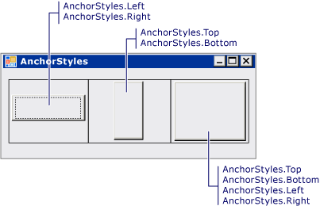

# Vorgehensweise: Verankern und Andocken von untergeordneten Steuerelementen in einem TableLayoutPanel-SteuerelementHow to: Anchor and Dock Child Controls in a TableLayoutPanel Control
Das <xref:System.Windows.Forms.TableLayoutPanel>-Steuerelement unterstützt die Eigenschaften <xref:System.Windows.Forms.Control.Anchor%2A> und <xref:System.Windows.Forms.Control.Dock%2A> in seinen untergeordneten Steuerelementen.The <xref:System.Windows.Forms.TableLayoutPanel> control supports the <xref:System.Windows.Forms.Control.Anchor%2A> and <xref:System.Windows.Forms.Control.Dock%2A> properties in its child controls.  
  
### So richten Sie ein untergeordnetes Steuerelement in einer TableLayoutPanel-Zelle ausTo align a child control in a TableLayoutPanel cell  
  
1. Erstellen Sie ein <xref:System.Windows.Forms.TableLayoutPanel>-Steuerelement auf dem Formular.Create a <xref:System.Windows.Forms.TableLayoutPanel> control on your form.  
  
2. Legen Sie den Wert, der die <xref:System.Windows.Forms.TableLayoutPanel> des Steuerelements <xref:System.Windows.Forms.TableLayoutPanel.ColumnCount%2A> und <xref:System.Windows.Forms.TableLayoutPanel.RowCount%2A> Eigenschaften **1**.Set the value of the <xref:System.Windows.Forms.TableLayoutPanel> control's <xref:System.Windows.Forms.TableLayoutPanel.ColumnCount%2A> and <xref:System.Windows.Forms.TableLayoutPanel.RowCount%2A> properties to **1**.  
  
3. Erstellen Sie ein <xref:System.Windows.Forms.Button>-Steuerelement im <xref:System.Windows.Forms.TableLayoutPanel>-Steuerelement.Create a <xref:System.Windows.Forms.Button> control in the <xref:System.Windows.Forms.TableLayoutPanel> control. Das <xref:System.Windows.Forms.Button> nimmt die obere linke Ecke der Zelle ein.The <xref:System.Windows.Forms.Button> occupies the upper-left corner of the cell.  
  
4. Ändern Sie den Wert der <xref:System.Windows.Forms.Button> -Eigenschaft des <xref:System.Windows.Forms.Control.Anchor%2A> -Steuerelements in `Left`.Change the value of the <xref:System.Windows.Forms.Button> control's <xref:System.Windows.Forms.Control.Anchor%2A> property to `Left`. Das <xref:System.Windows.Forms.Button>-Steuerelement wird so verschoben, dass es sich am linken Rand der Zelle ausrichtet.The <xref:System.Windows.Forms.Button> control moves to align with the left border of the cell.  
  
    > [!NOTE]
    >  Dieses Verhalten weicht vom Verhalten anderer Containersteuerelemente ab.This behavior differs from the behavior of other container controls. Bei anderen Containersteuerelementen wird das untergeordnete Steuerelement nicht verschoben, wenn die <xref:System.Windows.Forms.Control.Anchor%2A>-Eigenschaft festgelegt wird, und der Abstand zwischen dem verankerten Steuerelement und der Grenze des übergeordneten Containers ist zum Zeitpunkt der Festlegung der <xref:System.Windows.Forms.Control.Anchor%2A>-Eigenschaft fixiert.In other container controls, the child control does not move when the <xref:System.Windows.Forms.Control.Anchor%2A> property is set, and the distance between the anchored control and the parent container's boundary is fixed at the time the <xref:System.Windows.Forms.Control.Anchor%2A> property is set.  
  
5. Ändern Sie den Wert der <xref:System.Windows.Forms.Button> -Eigenschaft des <xref:System.Windows.Forms.Control.Anchor%2A> -Steuerelements in `Top, Left`.Change the value of the <xref:System.Windows.Forms.Button> control's <xref:System.Windows.Forms.Control.Anchor%2A> property to `Top, Left`. Das <xref:System.Windows.Forms.Button>-Steuerelement wird so verschoben, dass es die ober linke Ecke der Zelle einnimmt.The <xref:System.Windows.Forms.Button> control moves to occupy the top-left corner of the cell.  
  
6. Wiederholen Sie Schritt 5 mit dem Wert des `Top, Right` zum Verschieben der <xref:System.Windows.Forms.Button> Steuerelement auf der oberen rechten Ecke der Zelle.Repeat step 5 with a value of `Top, Right` to move the <xref:System.Windows.Forms.Button> control to the top-right corner of the cell. Wiederholen Sie diesen Schritt mit den Werten `Bottom, Left` und `Bottom, Right`.Repeat with values of `Bottom, Left` and `Bottom, Right`.  
  
### So strecken Sie ein untergeordnetes Steuerelement in einer TableLayoutPanel-ZelleTo stretch a child control in a TableLayoutPanel cell  
  
1. Ändern Sie den Wert der <xref:System.Windows.Forms.Button> -Eigenschaft des <xref:System.Windows.Forms.Control.Anchor%2A> -Steuerelements in `Left, Right`.Change the value of the <xref:System.Windows.Forms.Button> control's <xref:System.Windows.Forms.Control.Anchor%2A> property to `Left, Right`. Die Größe des <xref:System.Windows.Forms.Button>-Steuerelements wird so angepasst, dass es die gesamte Breite der Zelle einnimmt.The <xref:System.Windows.Forms.Button> control is resized to stretch across the cell.  
  
    > [!NOTE]
    >  Dieses Verhalten weicht vom Verhalten anderer Containersteuerelemente ab.This behavior differs from the behavior of other container controls. In anderen Containersteuerelementen wird das untergeordnete Steuerelement nicht angepasst, wenn die <xref:System.Windows.Forms.Control.Anchor%2A> -Eigenschaftensatz auf `Left, Right` oder `Top, Bottom`.In other container controls, the child control is not resized when the <xref:System.Windows.Forms.Control.Anchor%2A> property is set to `Left, Right` or `Top, Bottom`.  
  
2. Ändern Sie den Wert der <xref:System.Windows.Forms.Button> -Eigenschaft des <xref:System.Windows.Forms.Control.Anchor%2A> -Steuerelements in `Top, Bottom`.Change the value of the <xref:System.Windows.Forms.Button> control's <xref:System.Windows.Forms.Control.Anchor%2A> property to `Top, Bottom`. Die Größe des <xref:System.Windows.Forms.Button>-Steuerelements wird so angepasst, dass es die gesamte Höhe der Zelle einnimmt.The <xref:System.Windows.Forms.Button> control is resized to stretch from the top to the bottom of the cell.  
  
3. Ändern Sie den Wert der <xref:System.Windows.Forms.Button> -Eigenschaft des <xref:System.Windows.Forms.Control.Anchor%2A> -Steuerelements in `Top, Bottom, Left, Right`.Change the value of the <xref:System.Windows.Forms.Button> control's <xref:System.Windows.Forms.Control.Anchor%2A> property to `Top, Bottom, Left, Right`. Die Größe des <xref:System.Windows.Forms.Button>-Steuerelements wird so geändert, dass es die gesamte Zelle ausfüllt.The <xref:System.Windows.Forms.Button> control is resized to fill the cell.  
  
4. Ändern Sie den Wert der <xref:System.Windows.Forms.Button> -Eigenschaft des <xref:System.Windows.Forms.Control.Anchor%2A> -Steuerelements in `None`.Change the value of the <xref:System.Windows.Forms.Button> control's <xref:System.Windows.Forms.Control.Anchor%2A> property to `None`. Die Größe des <xref:System.Windows.Forms.Button>-Steuerelements wird geändert, und es wird mittig in der Zelle positioniert.The <xref:System.Windows.Forms.Button> control is resized and centered in the cell.  
  
5. Ändern Sie den Wert der <xref:System.Windows.Forms.Control.Dock%2A>-Eigenschaft des <xref:System.Windows.Forms.Button>-Steuerelements in <xref:System.Windows.Forms.DockStyle.Left>.Change the value of the <xref:System.Windows.Forms.Button> control's <xref:System.Windows.Forms.Control.Dock%2A> property to <xref:System.Windows.Forms.DockStyle.Left>. Das <xref:System.Windows.Forms.Button>-Steuerelement wird so verschoben, dass es sich am linken Rand der Zelle ausrichtet.The <xref:System.Windows.Forms.Button> control moves to align with the left border of the cell. Das <xref:System.Windows.Forms.Button>-Steuerelement behält seine Breite, aber seine Höhe wird so angepasst, dass es die gesamte Zellenhöhe einnimmt.The <xref:System.Windows.Forms.Button> control retains its width, but its height is resized to fill the cell vertically.  
  
    > [!NOTE]
    >  Dies ist dasselbe Verhalten, das in anderen Containersteuerelementen auftritt.This is the same behavior that occurs in other container controls.  
  
6. Ändern Sie den Wert der <xref:System.Windows.Forms.Control.Dock%2A>-Eigenschaft des <xref:System.Windows.Forms.Button>-Steuerelements in <xref:System.Windows.Forms.DockStyle.Fill>.Change the value of the <xref:System.Windows.Forms.Button> control's <xref:System.Windows.Forms.Control.Dock%2A> property to <xref:System.Windows.Forms.DockStyle.Fill>. Die Größe des <xref:System.Windows.Forms.Button>-Steuerelements wird so geändert, dass es die gesamte Zelle ausfüllt.The <xref:System.Windows.Forms.Button> control is resized to fill the cell.  
  
## BeispielExample  
 Die folgende Abbildung zeigt fünf Schaltflächen, die in fünf separaten <xref:System.Windows.Forms.TableLayoutPanel>-Zellen verankert sind.The following illustration shows five buttons anchored in five separate <xref:System.Windows.Forms.TableLayoutPanel> cells.  
  
   
  
 Die folgende Abbildung zeigt vier Schaltflächen, die in den Ecken von vier separaten <xref:System.Windows.Forms.TableLayoutPanel>-Zellen verankert sind.The following illustration shows four buttons anchored in the corners of four separate <xref:System.Windows.Forms.TableLayoutPanel> cells.  
  
   
  
 Die folgende Abbildung zeigt drei Schaltflächen, die durch die Verankerung in drei separaten <xref:System.Windows.Forms.TableLayoutPanel>-Zellen gestreckt wurden.The following illustration shows three buttons stretched by anchoring in three separate <xref:System.Windows.Forms.TableLayoutPanel> cells.  
  
   
  
 Das folgende Codebeispiel veranschaulicht alle Kombinationen aus <xref:System.Windows.Forms.Control.Anchor%2A>-Eigenschaftswerte für ein <xref:System.Windows.Forms.Button>-Steuerelement in einem <xref:System.Windows.Forms.TableLayoutPanel>-Steuerelement.The following code example demonstrates all the combinations of <xref:System.Windows.Forms.Control.Anchor%2A> property values for a <xref:System.Windows.Forms.Button> control in a <xref:System.Windows.Forms.TableLayoutPanel> control.  
  
 [!code-csharp[System.Windows.Forms.TableLayoutPanel.AnchorExampleForm#1](~/samples/snippets/csharp/VS_Snippets_Winforms/System.Windows.Forms.TableLayoutPanel.AnchorExampleForm/CS/TlpAnchorExampleForm.cs#1)]
 [!code-vb[System.Windows.Forms.TableLayoutPanel.AnchorExampleForm#1](~/samples/snippets/visualbasic/VS_Snippets_Winforms/System.Windows.Forms.TableLayoutPanel.AnchorExampleForm/VB/TlpAnchorExampleForm.vb#1)]  
  
## Kompilieren des CodesCompiling the Code  
 Für dieses Beispiel benötigen Sie Folgendes:This example requires:  
  
-   Verweise auf die Assemblys "System", "System.Data", "System.Drawing" und "System.Windows.Forms".References to the System, System.Data, System.Drawing and System.Windows.Forms assemblies.  
  
 Informationen zum Erstellen dieses Beispiels über die Befehlszeile für Visual Basic oder Visual c# finden Sie unter [erstellen über die Befehlszeile](../../../visual-basic/reference/command-line-compiler/building-from-the-command-line.md) oder [Befehlszeile mit csc.exe](../../../csharp/language-reference/compiler-options/command-line-building-with-csc-exe.md).For information about building this example from the command line for Visual Basic or Visual C#, see [Building from the Command Line](../../../visual-basic/reference/command-line-compiler/building-from-the-command-line.md) or [Command-line Building With csc.exe](../../../csharp/language-reference/compiler-options/command-line-building-with-csc-exe.md). Sie können auch in diesem Beispiel in Visual Studio erstellen, indem Sie den Code in ein neues Projekt einfügen.You can also build this example in Visual Studio by pasting the code into a new project.  
  
## Siehe auchSee also

- <xref:System.Windows.Forms.TableLayoutPanel>
- [TableLayoutPanel-SteuerelementTableLayoutPanel Control](tablelayoutpanel-control-windows-forms.md)
