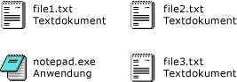

# <a name="how-to-enable-tile-view-in-a-windows-forms-listview-control"></a>Gewusst wie: Aktivieren der Tile-Ansicht in einem ListView-Steuerelement von Windows Forms
Mit dem Feature für "Ansicht 'Nebeneinander'" des <xref:System.Windows.Forms.ListView>-Steuerelements können Sie eine visuelle Balance zwischen grafischen und textbasierten Daten herstellen. Die textbasierten Daten, die für ein Element in der Ansicht "Nebeneinander" angezeigt werden, sind die gleichen wie die Spalteninformationen, die für die Detailansicht definiert wurden. Die Ansicht "Nebeneinander" funktioniert in Kombination mit den Features "Gruppieren" oder "Einfügemarke" des <xref:System.Windows.Forms.ListView>-Steuerelements.  
  
 Für die Ansicht "Nebeneinander" wird ein 32 x 32 Pixel großes Symbol mit mehreren Textzeilen verwendet, wie in den folgenden Abbildungen dargestellt.  
  
   
Symbole und Text der Ansicht "Nebeneinander"  
  
 Um die Ansicht "Nebeneinander" zu aktivieren, legen Sie die <xref:System.Windows.Forms.ListView.View%2A>-Eigenschaft auf <xref:System.Windows.Forms.View.Tile> fest. Sie können die Größe der Kacheln anpassen, indem Sie die <xref:System.Windows.Forms.ListView.TileSize%2A>-Eigenschaft festlegen, und Sie können die Anzahl der angezeigten Textzeilen festlegen, indem Sie die <xref:System.Windows.Forms.ListView.Columns%2A>-Auflistung anpassen.  
  
> [!NOTE]
>  Die Ansicht "Nebeneinander" steht unter [!INCLUDE[WinXpFamily](../../../../includes/winxpfamily-md.md)] nur zur Verfügung, wenn die Anwendung die <xref:System.Windows.Forms.Application.EnableVisualStyles%2A?displayProperty=nameWithType>-Methode aufruft. Unter älteren Betriebssystemen hat Code in Bezug auf die Ansicht "Nebeneinander" keine Auswirkungen, und das <xref:System.Windows.Forms.ListView>-Steuerelement wird in der Ansicht "Große Symbole" angezeigt. Weitere Informationen finden Sie unter <xref:System.Windows.Forms.ListView.View%2A?displayProperty=nameWithType>.  
  
### <a name="to-set-tile-view-programmatically"></a>So legen Sie die Ansicht "Nebeneinander" programmgesteuert fest  
  
1.  Verwenden Sie die <xref:System.Windows.Forms.View>-Enumeration des <xref:System.Windows.Forms.ListView>-Steuerelements.  
  
    ```vb  
    ListView1.View = View.Tile  
    ```  
  
    ```csharp  
    listView1.View = View.Tile;  
    ```  
  
## <a name="example"></a>Beispiel  
 Die folgenden vollständigen Codebeispiele zeigen die Ansicht "Nebeneinander" mit Kacheln, die so geändert wurden, dass drei Textzeilen angezeigt werden. Die Kachelgröße wurde angepasst, um Zeilenumbrüche zu vermeiden.  
  
 [!code-cpp[System.Windows.Forms.ListView.Tiling#1](../../../../samples/snippets/cpp/VS_Snippets_Winforms/System.Windows.Forms.ListView.Tiling/CPP/listviewtilingexample.cpp#1)]
 [!code-csharp[System.Windows.Forms.ListView.Tiling#1](../../../../samples/snippets/csharp/VS_Snippets_Winforms/System.Windows.Forms.ListView.Tiling/CS/listviewtilingexample.cs#1)]
 [!code-vb[System.Windows.Forms.ListView.Tiling#1](../../../../samples/snippets/visualbasic/VS_Snippets_Winforms/System.Windows.Forms.ListView.Tiling/VB/listviewtilingexample.vb#1)]  
  
## <a name="compiling-the-code"></a>Kompilieren des Codes  
 Für dieses Beispiel benötigen Sie Folgendes:  
  
-   Verweise auf die Assemblys "System" und "System.Windows.Forms".  
  
-   Eine Symboldatei mit Namen "book.ico", die sich im selben Verzeichnis befinden wie die ausführbare Datei.  
  
 Informationen zum Erstellen dieses Beispiels über die Befehlszeile für Visual Basic oder Visual c# finden Sie unter [erstellen über die Befehlszeile](~/docs/visual-basic/reference/command-line-compiler/building-from-the-command-line.md) oder [Befehlszeile mit csc.exe](~/docs/csharp/language-reference/compiler-options/command-line-building-with-csc-exe.md). Sie können dieses Beispiel auch in [!INCLUDE[vsprvs](../../../../includes/vsprvs-md.md)] erstellen, indem Sie den Code in ein neues Projekt einfügen.  Siehe auch [Gewusst wie: Kompilieren und Ausführen eines vollständigen Windows Forms-Codebeispiels mit Visual Studio](http://msdn.microsoft.com/library/Bb129228\(v=vs.110\)).  
  
## <a name="see-also"></a>Siehe auch  
 <xref:System.Windows.Forms.ListView>  
 <xref:System.Windows.Forms.ListView.TileSize%2A>  
 [ListView-Steuerelement](../../../../docs/framework/winforms/controls/listview-control-windows-forms.md)  
 [Übersicht über das ListView-Steuerelement](../../../../docs/framework/winforms/controls/listview-control-overview-windows-forms.md)  
 [Windows XP-Features und Windows Forms-Steuerelemente](http://msdn.microsoft.com/library/bc7fab94-fce9-4bf1-a8ad-a5837c91c3c0)
