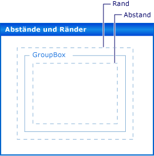

# Rand und Abstand in Windows Forms-SteuerelementenMargin and Padding in Windows Forms Controls
Die präzise Platzierung von Steuerelementen auf dem Formular hat für viele Anwendungen einen hohen Stellenwert.Precise placement of controls on your form is a high priority for many applications. Der <xref:System.Windows.Forms?displayProperty=nameWithType>-Namespace bietet Ihnen hierfür zahlreiche Layoutfunktionen.The <xref:System.Windows.Forms?displayProperty=nameWithType> namespace gives you many layout features to accomplish this. Zwei der wichtigsten Funktionen sind die <xref:System.Windows.Forms.Control.Margin%2A>-Eigenschaft und die <xref:System.Windows.Forms.Control.Padding%2A>-Eigenschaft.Two of the most important are the <xref:System.Windows.Forms.Control.Margin%2A> and <xref:System.Windows.Forms.Control.Padding%2A> properties.  
  
 Die <xref:System.Windows.Forms.Control.Margin%2A>-Eigenschaft definiert den Bereich um das Steuerelement, durch den andere Steuerelemente einen bestimmten Abstand von den Rändern des Steuerelements einhalten müssen.The <xref:System.Windows.Forms.Control.Margin%2A> property defines the space around the control that keeps other controls a specified distance from the control's borders.  
  
 Die <xref:System.Windows.Forms.Control.Padding%2A>-Eigenschaft definiert den Bereich innerhalb eines Steuerelements, durch den der Inhalt des Steuerelements (z. B. der Wert seiner <xref:System.Windows.Forms.Control.Text%2A>-Eigenschaft) einen bestimmten Abstand von den Rändern des Steuerelements einhalten muss.The <xref:System.Windows.Forms.Control.Padding%2A> property defines the space in the interior of a control that keeps the control's content (for example, the value of its <xref:System.Windows.Forms.Control.Text%2A> property) a specified distance from the control's borders.  
  
 Die folgende Abbildung zeigt die <xref:System.Windows.Forms.Control.Padding%2A>-Eigenschaft und die <xref:System.Windows.Forms.Control.Margin%2A>-Eigenschaft für ein Steuerelement.The following illustration shows the <xref:System.Windows.Forms.Control.Padding%2A> and <xref:System.Windows.Forms.Control.Margin%2A> properties on a control.  
  
   
  
 Diese Funktion wird zur Entwurfszeit in Visual Studio unterstützt.There is design-time support for this feature in Visual Studio. Siehe auch Exemplarische Vorgehensweise: Anordnen [von Windows Forms-Steuerelementen mit Auffüll Zeichen, Rändern und der AutoSize-Eigenschaft](windows-forms-controls-padding-autosize.md).Also see [Walkthrough: Laying Out Windows Forms Controls with Padding, Margins, and the AutoSize Property](windows-forms-controls-padding-autosize.md).  
  
## Weitere InformationenSee also

- <xref:System.Windows.Forms.Control.AutoSize%2A>
- <xref:System.Windows.Forms.Control.Margin%2A>
- <xref:System.Windows.Forms.Control.Padding%2A>
- <xref:System.Windows.Forms.Control.LayoutEngine%2A>
- <xref:System.Windows.Forms.TableLayoutPanel>
- <xref:System.Windows.Forms.FlowLayoutPanel>
