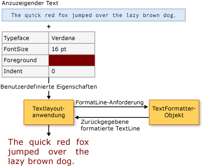

# Erweiterte Textformatierung
Die [!INCLUDE[TLA#tla_wpf](../../../../includes/tlasharptla-wpf-md.md)] bietet einen Reihe zuverlässiger [!INCLUDE[TLA#tla_api#plural](../../../../includes/tlasharptla-apisharpplural-md.md)] zum Einschließen von Text in der Anwendung. Layout und [!INCLUDE[TLA#tla_ui](../../../../includes/tlasharptla-ui-md.md)] [!INCLUDE[TLA2#tla_api#plural](../../../../includes/tla2sharptla-apisharpplural-md.md)], wie z. B. <xref:System.Windows.Controls.TextBlock>, geben Sie die am häufigsten verwendeten und allgemeine Elemente für die Textdarstellung verwendet. Zeichnen von [!INCLUDE[TLA2#tla_api#plural](../../../../includes/tla2sharptla-apisharpplural-md.md)], wie z. B. <xref:System.Windows.Media.GlyphRunDrawing> und <xref:System.Windows.Media.FormattedText>, bieten eine Möglichkeit zum Einschließen von formatierten Texts in Zeichnungen. Das am häufigsten Premiummitglied [!INCLUDE[TLA2#tla_wpf](../../../../includes/tla2sharptla-wpf-md.md)] stellt eine erweiterbare textformatierung-Modul ausgeführt, um alle Aspekte des Text-Präsentationen wie Text Store Verwaltung, Formatierung TextRun-Verwaltung, und eingebettete Objekte zu steuern.  
  
 Dieses Thema enthält eine Einführung in die [!INCLUDE[TLA2#tla_wpf](../../../../includes/tla2sharptla-wpf-md.md)] textformatierung. Der Schwerpunkt liegt auf Clientimplementierung und Verwendung von der [!INCLUDE[TLA2#tla_wpf](../../../../includes/tla2sharptla-wpf-md.md)] textformatierung-Modul.  
  
> [!NOTE]
>  Alle Codebeispiele in diesem Dokument finden Sie in der [Advanced Text Formatting Sample](http://go.microsoft.com/fwlink/?LinkID=159965).  
  

  
   
## Erforderliche Komponenten  
 In diesem Thema wird davon ausgegangen, dass Sie mit der höheren Ebene vertraut sind [!INCLUDE[TLA2#tla_api#plural](../../../../includes/tla2sharptla-apisharpplural-md.md)] für die Textdarstellung verwendet. Die meisten Benutzerszenarios erfordert keinen erweiterten textformatierung [!INCLUDE[TLA2#tla_api#plural](../../../../includes/tla2sharptla-apisharpplural-md.md)] in diesem Thema erläutert. Eine Einführung in die anderen Text [!INCLUDE[TLA2#tla_api#plural](../../../../includes/tla2sharptla-apisharpplural-md.md)], finden Sie unter [Dokumente in WPF](../../../../docs/framework/wpf/advanced/documents-in-wpf.md).  
  
   
## Erweiterte Textformatierung  
 Das Textlayout und [!INCLUDE[TLA2#tla_ui](../../../../includes/tla2sharptla-ui-md.md)] steuert in [!INCLUDE[TLA2#tla_wpf](../../../../includes/tla2sharptla-wpf-md.md)] Geben Sie Formatierungseigenschaften, mit denen Sie problemlos formatierten Text in Ihre Anwendung integrieren können. Diese Steuerelemente bieten eine Reihe von Eigenschaften, um die Darstellung von Text zu bearbeiten, u.a. dessen Schriftart, Größe und Farbe. Unter normalen Umständen können diese Steuerelemente den Großteil der Textdarstellung in Ihrer Anwendung behandeln. Einige erweiterten Szenarios erfordern jedoch das Steuerelement des Textspeichers sowie die Textdarstellung. [!INCLUDE[TLA2#tla_wpf](../../../../includes/tla2sharptla-wpf-md.md)] stellt ein erweiterbares Textformatierungsmodul für diesen Zweck bereit.  
  
 In der erweiterten Text Formatierungsfunktionen gefunden [!INCLUDE[TLA2#tla_wpf](../../../../includes/tla2sharptla-wpf-md.md)] bestehen aus einem Text-Modul, einen Textspeicher, textausführungen Formatierung und Formatierungseigenschaften. Datenbankmodul, die textformatierung <xref:System.Windows.Media.TextFormatting.TextFormatter>, erstellt der Textzeilen für Präsentation verwendet werden soll. Dies erfolgt durch die Zeile Formatierung zu initiieren und Aufrufen der TextFormatter <xref:System.Windows.Media.TextFormatting.TextFormatter.FormatLine%2A>. Die TextFormatter ruft textausführungen aus Ihrer Textspeicher ab, durch den Aufruf des Geschäfts <xref:System.Windows.Media.TextFormatting.TextSource.GetTextRun%2A> Methode. Die <xref:System.Windows.Media.TextFormatting.TextRun> Objekte werden dann in gebildet <xref:System.Windows.Media.TextFormatting.TextLine> Objekte vom Textformatierungsprogramm, und die Anwendung zur Überprüfung oder Anzeige.  
  
   
## Verwendung des Textformatierers  
 <xref:System.Windows.Media.TextFormatting.TextFormatter>ist die [!INCLUDE[TLA2#tla_wpf](../../../../includes/tla2sharptla-wpf-md.md)] textformatierung-engine und stellt Dienste zum Formatieren und unterteilen von Textzeilen. Der Textformatierer kann unterschiedliche Textzeichenformate und Absatzformatvorlagen verarbeiten und enthält Unterstützung für internationales Textlayout.  
  
 Im Gegensatz zu herkömmlichen Text [!INCLUDE[TLA#tla_api](../../../../includes/tlasharptla-api-md.md)]die <xref:System.Windows.Media.TextFormatting.TextFormatter> interagiert mit einer Textlayout-Clients über eine Reihe von Rückrufmethoden. Es muss der Client diese Methoden in einer Implementierung von der <xref:System.Windows.Media.TextFormatting.TextSource> Klasse. Das folgende Diagramm veranschaulicht die Text-Layout-Interaktion zwischen der Clientanwendung und <xref:System.Windows.Media.TextFormatting.TextFormatter>.  
  
   
Interaktion zwischen Anwendung und TextFormatter  
  
 Das Textformatierungsprogramm wird verwendet, um formatierten Textzeilen aus dem Store Text Abrufen der ist eine Implementierung von <xref:System.Windows.Media.TextFormatting.TextSource>. Dazu wird zunächst eine Instanz des Textformatierungsprogramms erstellt, mit der <xref:System.Windows.Media.TextFormatting.TextFormatter.Create%2A> Methode. Diese Methode erstellt eine Instanz des Textformatierungsprogramms und legt die maximalen Werte für Zeilenhöhe und -breite fest. Als eine Instanz des Textformatierungsprogramms erstellt wird, wird der Erstellungsvorgang für Zeile gestartet, durch Aufrufen der <xref:System.Windows.Media.TextFormatting.TextFormatter.FormatLine%2A> Methode. <xref:System.Windows.Media.TextFormatting.TextFormatter>Ruft wieder an der Datenquelle zum Abrufen von Text und Formatierung Parameter für die Ausführung des Texts, die dieses Formular einer Zeile.  
  
 Im folgenden Beispiel wird der Formatierungsprozess eines Textspeichers gezeigt. Die <xref:System.Windows.Media.TextFormatting.TextFormatter> Objekt dient zum Abrufen von Textzeilen aus dem Textspeicher und formatieren Sie die Textzeile zum Zeichnen der <xref:System.Windows.Media.DrawingContext>.  
  
 [!code-csharp[TextFormatterExample#100](../../../../samples/snippets/csharp/VS_Snippets_Wpf/TextFormatterExample/CSharp/Window1.xaml.cs#100)]
 [!code-vb[TextFormatterExample#100](../../../../samples/snippets/visualbasic/VS_Snippets_Wpf/TextFormatterExample/VisualBasic/Window1.xaml.vb#100)]  
  
   
## Implementieren des Clienttextspeichers  
 Wenn Sie das Textformatierungsmodul erweitern, müssen Sie alle Aspekte des Textspeichers implementieren und verwalten. Dies ist keine einfache Aufgabe. Der Textspeicher ist für die Nachverfolgung von Lauftexteigenschaften, Absatzeigenschaften, für das Einbetten von Objekten und anderen ähnlichen Inhalt verantwortlich. Sie bietet außerdem die TextFormatter mit einzelnen <xref:System.Windows.Media.TextFormatting.TextRun> -Objekte, die die TextFormatter zum Erstellen verwendet <xref:System.Windows.Media.TextFormatting.TextLine> Objekte.  
  
 Um die Virtualisierung der Textspeicher behandeln zu können, muss der Textspeicher von abgeleitet werden <xref:System.Windows.Media.TextFormatting.TextSource>. <xref:System.Windows.Media.TextFormatting.TextSource>definiert die Methode, mit der TextFormatter textausführungen aus dem Textspeicher abzurufen. <xref:System.Windows.Media.TextFormatting.TextSource.GetTextRun%2A>ist, dass die Methode des Formatierungsprogramms Text zum Abrufen von Text verwendet beim Formatieren der Zeile ausgeführt wird. Der Aufruf von <xref:System.Windows.Media.TextFormatting.TextSource.GetTextRun%2A> erfolgt wiederholt vom Textformatierungsprogramm, bis eines der folgenden Bedingungen eintritt:  
  
-   Ein <xref:System.Windows.Media.TextFormatting.TextEndOfLine> oder eine Unterklasse zurückgegeben.  
  
-   Die akkumulierte Breite des textausführungen überschreitet die maximale Linienstärke entweder den Aufruf der TextFormatter erstellen oder den Aufruf an des Text Formatierers angegeben <xref:System.Windows.Media.TextFormatting.TextFormatter.FormatLine%2A> Methode.  
  
-   Ein [!INCLUDE[TLA#tla_unicode](../../../../includes/tlasharptla-unicode-md.md)] Zeilenvorschub-Sequenz, z. B. "CF", "LF" oder "CRLF", zurückgegeben.  
  
   
## Bereitstellen von Lauftext  
 Der wichtigste Teil des Textformatierunsprozesses ist die Interaktion zwischen Textformatierer und Textspeicher. Ihre Implementierung von <xref:System.Windows.Media.TextFormatting.TextSource> bietet die TextFormatter mit der <xref:System.Windows.Media.TextFormatting.TextRun> Objekte und die Eigenschaften, die zum Formatieren des Texts ausgeführt wird. Diese Interaktion erfolgt durch die <xref:System.Windows.Media.TextFormatting.TextSource.GetTextRun%2A> Methode, die vom Textformatierungsprogramm aufgerufen wird.  
  
 Die folgende Tabelle zeigt einige der vordefinierten <xref:System.Windows.Media.TextFormatting.TextRun> Objekte.  
  
|TextRun-Typ|Verwendung|  
|------------------|-----------|  
|<xref:System.Windows.Media.TextFormatting.TextCharacters>|Der spezialisierte Lauftext, der zum Übergeben einer Darstellung von Zeichensymbolen zurück an den Textformatierer verwendet wird|  
|<xref:System.Windows.Media.TextFormatting.TextEmbeddedObject>|Der spezialisierte Lauftext, der zum Bereitstellen von Inhalt verwendet wird, in dem Messungen, Treffertests und Zeichnungen komplett ausgeführt werden, z.B. eine Schaltfläche oder ein Bild im Text|  
|<xref:System.Windows.Media.TextFormatting.TextEndOfLine>|Der spezialisierte Lauftext, der zum Kennzeichnen des Zeilenendes verwendet wird|  
|<xref:System.Windows.Media.TextFormatting.TextEndOfParagraph>|Der spezialisierte Lauftext, der zum Kennzeichnen eines Absatzendes verwendet wird|  
|<xref:System.Windows.Media.TextFormatting.TextEndOfSegment>|Die spezielle textausführung verwendet, um das Ende eines Segments, wie z. B. markieren, um den Bereich von einer früheren betroffen zu beenden <xref:System.Windows.Media.TextFormatting.TextModifier> ausführen.|  
|<xref:System.Windows.Media.TextFormatting.TextHidden>|Der spezialisierte Lauftext, der verwendet wird, um eine Reihe ausgeblendeter Zeichen zu kennzeichnen|  
|<xref:System.Windows.Media.TextFormatting.TextModifier>|Der spezialisierte Lauftext, der verwendet wird, um Eigenschaften der Lauftexte in deren Bereich zu ändern. Der Bereich erweitert wird, zum nächsten übereinstimmenden <xref:System.Windows.Media.TextFormatting.TextEndOfSegment> textausführung oder bei der nächsten <xref:System.Windows.Media.TextFormatting.TextEndOfParagraph>.|  
  
 Eine der vordefinierten <xref:System.Windows.Media.TextFormatting.TextRun> Objekte können als Unterklasse definiert werden. Dadurch kann Ihre Textquelle den Textformatierer mit Lauftexten bereitstellen, die benutzerdefinierte Daten enthalten.  
  
 Das folgende Beispiel zeigt eine <xref:System.Windows.Media.TextFormatting.TextSource.GetTextRun%2A> Methode. Gibt diesen Textspeicher <xref:System.Windows.Media.TextFormatting.TextRun> Objekte an den Text Formatierer für die Verarbeitung.  
  
 [!code-csharp[TextFormatterExample#101](../../../../samples/snippets/csharp/VS_Snippets_Wpf/TextFormatterExample/CSharp/CustomTextSource.cs#101)]
 [!code-vb[TextFormatterExample#101](../../../../samples/snippets/visualbasic/VS_Snippets_Wpf/TextFormatterExample/VisualBasic/CustomTextSource.vb#101)]  
  
> [!NOTE]
>  In diesem Beispiel stellt der Textspeicher die gleichen Texteigenschaften für den gesamten Text bereit. Erweiterte Textspeicher müssen ihre eigene Verwaltung für Bereiche implementieren, damit einzelne Zeichen über unterschiedliche Eigenschaften verfügen können.  
  
   
## Angeben von Formatierungseigenschaften  
 <xref:System.Windows.Media.TextFormatting.TextRun>Objekte werden mithilfe der Textspeicher bereitgestellten Eigenschaften formatiert. Diese Eigenschaften gibt es zwei Arten <xref:System.Windows.Media.TextFormatting.TextParagraphProperties> und <xref:System.Windows.Media.TextFormatting.TextRunProperties>. <xref:System.Windows.Media.TextFormatting.TextParagraphProperties>Behandeln Sie Eigenschaften wie z. B. <xref:System.Windows.TextAlignment> und <xref:System.Windows.FlowDirection>. <xref:System.Windows.Media.TextFormatting.TextRunProperties>Eigenschaften, die sich bei jeder TextRun innerhalb eines Absatzes, z. B. Vordergrundpinsel, unterscheiden können <xref:System.Windows.Media.Typeface>, und der Schriftgrad. Um benutzerdefinierte Absatz und benutzerdefinierte TextRun-Eigenschaftentypen zu implementieren, muss Ihre Anwendung zu erstellen von abgeleiteten Klassen <xref:System.Windows.Media.TextFormatting.TextParagraphProperties> und <xref:System.Windows.Media.TextFormatting.TextRunProperties> bzw.  
  
## Siehe auch  
 [Typografie in WPF](../../../../docs/framework/wpf/advanced/typography-in-wpf.md)  
 [Dokumente in WPF](../../../../docs/framework/wpf/advanced/documents-in-wpf.md)
