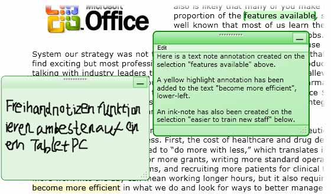
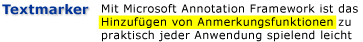
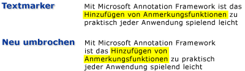

# Übersicht über Anmerkungen
Das Schreiben von Notizen oder Kommentare auf Papierdokumenten ist solch eine verbreitete Aktivität, dass wir sie als selbstverständlich erachten. Diese Notizen oder Kommentare sind „Anmerkungen“, die wir einem Dokument hinzufügen, um Informationen zu kennzeichnen oder um interessante Elemente für einen späteren Zeitpunkt zu markieren. Obwohl das Schreiben von Notizen auf gedruckte Dokumente einfach und üblich ist, ist die Möglichkeit, persönliche Kommentare auf elektronischen Dokumenten hinzuzufügen, in der Regel nur sehr eingeschränkt, falls diese Möglichkeit überhaupt verfügbar ist.  
  
 In diesem Thema werden verschiedene häufige Arten von Anmerkungen, insbesondere Haftnotizen und Hervorhebungen, behandelt und veranschaulicht, wie Microsoft Annotations Framework diese Arten von Anmerkungen in Anwendungen über die Windows Presentation Foundation (WPF) erleichtert. ) Dokumentanzeigesteuerelemente.  WPF-Dokumentanzeigesteuerelemente, die <xref:System.Windows.Controls.FlowDocumentReader> Anmerkungen unterstützen, enthalten <xref:System.Windows.Controls.FlowDocumentScrollViewer> <xref:System.Windows.Controls.Primitives.DocumentViewerBase> und <xref:System.Windows.Controls.DocumentViewer> sowie <xref:System.Windows.Controls.FlowDocumentPageViewer>Steuerelemente, die von z. B. und abgeleitet sind.  

## Kurznotizen  
 Eine normale Kurznotiz enthält Informationen, die auf ein kleines Stück farbiges Papier geschrieben werden, das dann auf ein Dokument „geklebt“ wird. Digitale Haftnotizen bieten ähnliche Funktionen für elektronische Dokumente, aber mit der zusätzlichen Flexibilität, viele andere Arten von Inhalten wie typisierten Text, handschriftliche Notizen (z. B. "Tintenstriche" für Tablet PC) oder Weblinks einzubeziehen.  
  
 Die folgende Abbildung zeigt einige Beispiele von Hervorhebungen, Kurznotizen und Freihandnotizanmerkungen.  
  
   
  
 Das folgende Beispiel zeigt die Methode, die Sie zum Aktivieren der Unterstützung von Kommentaren in der Anwendung verwenden können.  
  
 [!code-csharp[DocViewerAnnotationsXml#DocViewXmlStartAnnotations](~/samples/snippets/csharp/VS_Snippets_Wpf/DocViewerAnnotationsXml/CSharp/Window1.xaml.cs#docviewxmlstartannotations)]
 [!code-vb[DocViewerAnnotationsXml#DocViewXmlStartAnnotations](~/samples/snippets/visualbasic/VS_Snippets_Wpf/DocViewerAnnotationsXml/visualbasic/window1.xaml.vb#docviewxmlstartannotations)]  
  

## Highlights  
 Personen, die kreative Methoden verwenden, können Aufmerksamkeit auf Elemente ziehen, wenn Sie ein Papierdokument beschreiben, z.B. Wörter in einem Satz unterstreichen, markieren, einkreisen oder Markierungen oder Notationen am Rand hinzufügen.  Hervorhebungsanmerkungen in Microsoft Annotations Framework bieten eine ähnliche Funktion zum Markieren von Informationen, die in WPF-Dokumentanzeigesteuerelementen angezeigt werden.  
  
 In der folgenden Abbildung ist ein Beispiel einer markierten Anmerkung dargestellt:  
  
   
  
 Benutzer erstellen in der Regel Anmerkungen, indem sie zuerst Text oder ein <xref:System.Windows.Controls.ContextMenu> Element von Interesse auswählen und dann mit der rechten Maustaste klicken, um eine der Anmerkungsoptionen anzuzeigen.  Das folgende Beispiel [!INCLUDE[TLA#tla_xaml](../../../../includes/tlasharptla-xaml-md.md)] zeigt die, <xref:System.Windows.Controls.ContextMenu> mit denen Sie eine mit gerouteten Befehlen deklarieren können, auf die Benutzer zugreifen können, um Anmerkungen zu erstellen und zu verwalten.  
  
 [!code-xaml[DocViewerAnnotationsXps#CreateDeleteAnnotations](~/samples/snippets/csharp/VS_Snippets_Wpf/DocViewerAnnotationsXps/CSharp/Window1.xaml#createdeleteannotations)]  
  

## Verankerung von Daten  
 Das Anmerkungsframework bindet Anmerkungen an die Daten, die der Benutzer auswählt, und nicht nur an eine Position in der Anzeigeansicht. Deshalb bleibt die Anmerkung bei der Datenauswahl, an die sie gebunden ist, wenn der Benutzer das Anzeigefenster nach oben oder unten verschiebt oder die Größe ändert, wenn sich die Dokumentansicht ändert. Die folgende Abbildung zeigt z.B. eine Anmerkung, die der Benutzer für einen Textausschnitt erstellt hat. Wenn sich die Dokumentansicht ändert (durch Bildlauf, Größenänderung, Skalierung usw.), wird die hervorgehobene Anmerkung mit den ausgewählten Daten verschoben.  
  
   
  

## Abgleichen von Anmerkung mit Objekten mit Anmerkungen  
 Sie können Anmerkungen den entsprechenden kommentierten Objekten zuordnen. Betrachten Sie beispielsweise eine einfache Dokumentleseranwendung, die über einen Kommentarbereich verfügt. Der Kommentarbereich ist möglicherweise ein Listenfeld, das den Text aus einer Liste von Anmerkungen anzeigt, die mit einem Dokument verankert sind. Wenn der Benutzer ein Element im Listenfeld auswählt, zeigt die Anwendung den Abschnitt im Dokument, mit dem das entsprechende Anmerkungsobjekt verankert ist.  
  
 Im folgenden Beispiel wird veranschaulicht, wie der Ereignishandler eines solchen Listenfelds, das als Kommentarbereich dient, implementiert wird.  
  
 [!code-csharp[FlowDocumentAnnotatedViewer#Handler](~/samples/snippets/csharp/VS_Snippets_Wpf/FlowDocumentAnnotatedViewer/CSharp/Window1.xaml.cs#handler)]
 [!code-vb[FlowDocumentAnnotatedViewer#Handler](~/samples/snippets/visualbasic/VS_Snippets_Wpf/FlowDocumentAnnotatedViewer/visualbasic/window1.xaml.vb#handler)]  
  
 Ein weiteres Beispielszenario umfasst Anwendungen, die den Austausch von Anmerkungen und Haftnotizen zwischen Dokumentlesern per E-Mail ermöglichen. Diese Funktion ermöglicht diesen Programmen, den Leser zu der Seite zu navigieren, die die Anmerkung enthält, die gerade ausgetauscht wird.  
  
## Weitere Informationen

- <xref:System.Windows.Controls.Primitives.DocumentViewerBase>
- <xref:System.Windows.Controls.DocumentViewer>
- <xref:System.Windows.Controls.FlowDocumentPageViewer>
- <xref:System.Windows.Controls.FlowDocumentScrollViewer>
- <xref:System.Windows.Controls.FlowDocumentReader>
- <xref:System.Windows.Annotations.IAnchorInfo>
- [Annotations-Schema](annotations-schema.md)
- [Übersicht über ContextMenu](../controls/contextmenu-overview.md)
- [Befehlsübersicht](commanding-overview.md)
- [Übersicht über Flussdokumente](flow-document-overview.md)
- [How to: Add a Command to a MenuItem (Vorgehensweise: Hinzufügen eines Befehls zu einem MenuItem)](https://docs.microsoft.com/previous-versions/dotnet/netframework-3.5/ms741839(v=vs.90))
