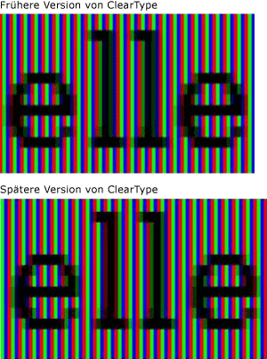
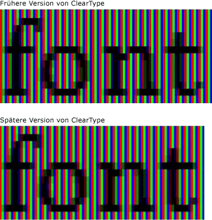
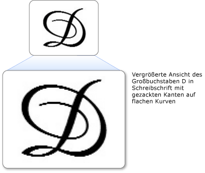

# Übersicht über ClearType
Dieses Thema bietet einen Überblick über die [!INCLUDE[TLA#tla_winclient](../../../../includes/tlasharptla-winclient-md.md)]Microsoft ClearType-Technologie im .  

## Technologieübersicht  
 ClearType ist eine von Microsoft entwickelte Softwaretechnologie, die die Lesbarkeit von Text auf vorhandenen LCDs (Liquid Crystal Displays) wie Laptop-Bildschirmen, Pocket-PC-Bildschirmen und Flachbildschirmen verbessert.  ClearType funktioniert, indem es auf die einzelnen vertikalen Farbstreifenelemente in jedem Pixel eines LCD-Bildschirms zugreift. Vor ClearType war die kleinste Detailgenauigkeit, die ein Computer anzeigen konnte, ein einzelnes Pixel, aber da ClearType auf einem LCD-Monitor ausgeführt wird, können wir jetzt Textfeatures anzeigen, die nur einen Bruchteil eines Pixels in der Breite aufweisen. Die zusätzliche Auflösung verbessert die Schärfe der kleinen Details in der Textanzeige, was das Lesen über lange Zeiträume hinweg erleichtert.  
  
 Der ClearType [!INCLUDE[TLA#tla_winclient](../../../../includes/tlasharptla-winclient-md.md)] ist die neueste Generation von ClearType, die mehrere Verbesserungen gegenüber der Version in Microsoft Windows Graphics Device Interface (GDI) enthält.  
  

## Subpixel-Positionierung  
 Eine deutliche Verbesserung gegenüber der vorherigen Version von ClearType ist die Verwendung der Subpixelpositionierung. Im Gegensatz zur ClearType-Implementierung in GDI [!INCLUDE[TLA#tla_winclient](../../../../includes/tlasharptla-winclient-md.md)] ermöglicht der in ClearType gefundene ClearType den Start von Glyphen innerhalb des Pixels und nicht nur der Anfangsgrenze des Pixels. Aufgrund dieser zusätzlichen Auflösung bei der Positionierung von Glyphen sind deren Abstände und Proportionen präziser und einheitlicher.  
  
 In den folgenden zwei Beispielen wird gezeigt, dass Glyphen auf jeder Subpixelgrenze beginnen können, wenn die Subpixel-Positionierung verwendet wird. Das Beispiel auf der linken Seite wird mit der früheren Version des ClearType-Renderers gerendert, der keine Subpixelpositionierung verwendet hat. Das Beispiel auf der rechten Seite wird mithilfe der neuen Version des ClearType-Renderers unter Verwendung der Subpixelpositionierung gerendert. Beachten Sie, dass die Buchstaben **e** und **l** im Bild rechts minimal anders gerendert werden, da jedes auf einem anderen Subpixel beginnt. Wenn den Text in Normalgröße auf dem Bildschirm angezeigt wird, ist dieser Unterschied aufgrund des hohen Kontrasts des Glyphenbilds nicht wahrnehmbar. Dies ist nur durch eine ausgeklügelte Farbfilterung möglich, die in ClearType integriert ist.  
  
   
Mit zwei Versionen von ClearType angezeigter Text  
  
 In den folgenden beiden Beispielen wird die Ausgabe des früheren ClearType-Renderers mit der neuen Version des ClearType-Renderers verglichen. Die rechts dargestellte Subpixel-Positionierung verbessert den Abstand zwischen Buchstaben auf dem Bildschirm erheblich, insbesondere bei kleinen Schriftgrößen, bei denen der Unterschied zwischen einem Subpixel und einem Pixel einen bedeutenden Anteil an der Glyphenbreite ausmacht. Es ist deutlich zu sehen, dass der Abstand zwischen den Buchstaben im zweiten Bild gleichmäßiger ist. Der kumulative Vorteil der Subpixelpositionierung für das Gesamtbild eines Textbildschirms wird erheblich erhöht und stellt eine signifikante Weiterentwicklung der ClearType-Technologie dar.  
  
   
Mit einer früheren Version von ClearType angezeigter Text  
  

## Antialiasing auf der y-Achse  
 Eine weitere Verbesserung [!INCLUDE[TLA#tla_winclient](../../../../includes/tlasharptla-winclient-md.md)] von ClearType in ist y-Richtung Anti-Aliasing. Der ClearType in GDI ohne y-Richtungs-Antialiasing bietet eine bessere Auflösung auf der x-Achse, nicht aber auf der y-Achse. Die Lesbarkeit wird über und unter flachen Kurven durch gezackte Kanten beeinträchtigt.  
  
 Im folgenden Beispiel werden die Auswirkungen von fehlendem Antialiasing auf der y-Achse dargestellt. Die gezackten Kanten oben und unten am Buchstaben treten deutlich hervor.  
  
   
Text mit Flatterrändern an flachen Kurven  
  
 ClearType [!INCLUDE[TLA#tla_winclient](../../../../includes/tlasharptla-winclient-md.md)] in bietet Antialiasing auf der y-Richtungsebene, um alle gezackten Kanten zu glätten. Dies ist besonders für die Verbesserung der Lesbarkeit ostasiatischer Sprachen wichtig, in denen Ideogramme über nahezu gleiche Anteile von horizontalen und vertikalen flachen Kurven verfügen.  
  
 Im folgenden Beispiel wird die Auswirkung von Antialiasing auf der y-Achse gezeigt. In diesem Fall weisen der obere und untere Rand des Buchstabens eine glatte Kurve auf.  
  
   
Text mit ClearType-Antialiasing auf der y-Achse  
  

## Hardwarebeschleunigung  
 ClearType [!INCLUDE[TLA#tla_winclient](../../../../includes/tlasharptla-winclient-md.md)] in kann die Hardwarebeschleunigung nutzen, um eine bessere Leistung zu erzielen und cpulast- und Systemspeicheranforderungen zu reduzieren. Durch die Verwendung der Pixel-Shader und des Videospeichers einer Grafikkarte bietet ClearType eine schnellere Wiedergabe von Text, insbesondere wenn Animationen verwendet werden.  
  
 ClearType [!INCLUDE[TLA#tla_winclient](../../../../includes/tlasharptla-winclient-md.md)] in ändert die systemweiten ClearType-Einstellungen nicht. Durch deaktivierenvon ClearType [!INCLUDE[TLA#tla_winclient](../../../../includes/tlasharptla-winclient-md.md)] in Windows wird Antialiasing in den Graustufenmodus versetzt. Darüber hinaus ändert [!INCLUDE[TLA#tla_winclient](../../../../includes/tlasharptla-winclient-md.md)] ClearType in die Einstellungen des [ClearType Tuner PowerToy](https://www.microsoft.com/typography/ClearTypePowerToy.mspx)nicht .  
  
 Eine der Designentscheidungen hinsichtlich der Architektur von [!INCLUDE[TLA#tla_winclient](../../../../includes/tlasharptla-winclient-md.md)] bestand darin, dass das von Auflösung unabhängige Layout höher auflösende DPI-Monitore besser unterstützen soll, da diese immer mehr Verbreitung finden. [!INCLUDE[TLA#tla_winclient](../../../../includes/tlasharptla-winclient-md.md)] unterstützt daher weder Textrendering mit Aliasing noch die Bitmaps in bestimmten ostasiatischen Schriftarten, da beides von der Auflösung abhängt.  
  

## Weitere Informationen  
 [ClearType Information (ClearType-Informationen)](https://www.microsoft.com/typography/ClearTypeInfo.mspx)  
  
 [ClearType Tuner PowerToy](https://www.microsoft.com/typography/ClearTypePowerToy.mspx)  
  
## Weitere Informationen

- [ClearType Registry Settings (ClearType-Registrierungseinstellungen)](cleartype-registry-settings.md)
