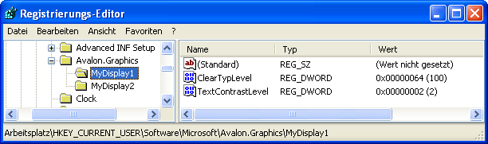
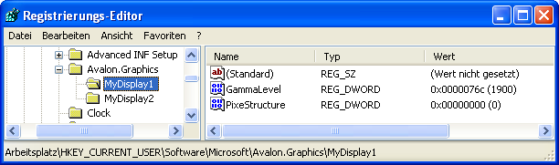

# ClearType-Registrierungseinstellungen
Dieses Thema bietet eine Übersicht über die [!INCLUDE[TLA2#tla_winclient](../../../../includes/tla2sharptla-winclient-md.md)] [!INCLUDE[TLA#tla_ct](../../../../includes/tlasharptla-ct-md.md)] registrierungseinstellungen, mit denen [!INCLUDE[TLA2#tla_winclient](../../../../includes/tla2sharptla-winclient-md.md)] Anwendungen.  
  
  
   
## Übersicht über die Technologie  
 [!INCLUDE[TLA2#tla_winclient](../../../../includes/tla2sharptla-winclient-md.md)]Anwendungen, die Text an eine Anzeige Gerät Verwendung Rendern [!INCLUDE[TLA2#tla_ct](../../../../includes/tla2sharptla-ct-md.md)] -Funktionen, die eine verbesserte Übersichtlichkeit. [!INCLUDE[TLA2#tla_ct](../../../../includes/tla2sharptla-ct-md.md)] ist eine von [!INCLUDE[TLA#tla_ms](../../../../includes/tlasharptla-ms-md.md)] entwickelte Softwaretechnologie, mit der die Lesbarkeit von Text auf vorhandenen LCDs (Liquid Crystal Displays), z.B. auf Laptopbildschirmen, Pocket PC-Bildschirmen und Flachbildschirmen, optimiert wird. [!INCLUDE[TLA2#tla_ct](../../../../includes/tla2sharptla-ct-md.md)] greift dabei auf die einzelnen vertikalen Farbstreifenelemente in jedem Pixel auf einem LCD-Bildschirm zu. Weitere Informationen zu [!INCLUDE[TLA2#tla_ct](../../../../includes/tla2sharptla-ct-md.md)], finden Sie unter [ClearType-Übersicht](../../../../docs/framework/wpf/advanced/cleartype-overview.md).  
  
 Text, der mit gerendert wird [!INCLUDE[TLA2#tla_ct](../../../../includes/tla2sharptla-ct-md.md)] stehen erheblich anders aus, wenn auf verschiedenen Anzeigegeräte angezeigt. Z. B. eine kleine Anzahl von Monitoren implementieren, Stripe Farbelemente in Blau, Grün, Rot Reihenfolge statt der gängigeren Rot, Grün, Blau ( [!INCLUDE[TLA#tla_rgb](../../../../includes/tlasharptla-rgb-md.md)]) Reihenfolge.  
  
 Text, der mit gerendert wird [!INCLUDE[TLA2#tla_ct](../../../../includes/tla2sharptla-ct-md.md)] stehen auch erheblich anders aus, wenn von Personen mit unterschiedlichem Sensitivität Farbe angezeigt. Manche Benutzer erkennen leichte Farbunterschiede besser als andere.  
  
 In jedem dieser Fälle [!INCLUDE[TLA2#tla_ct](../../../../includes/tla2sharptla-ct-md.md)] Funktionen müssen geändert werden, um die optimale Lesbarkeit für den einzelnen bereitzustellen.  
  
   
## Registrierungseinstellungen  
 [!INCLUDE[TLA2#tla_winclient](../../../../includes/tla2sharptla-winclient-md.md)]Gibt an, vier registrierungseinstellungen zum Steuern von [!INCLUDE[TLA2#tla_ct](../../../../includes/tla2sharptla-ct-md.md)] Funktionen:  
  
|Einstellung|Beschreibung|  
|-------------|-----------------|  
|[!INCLUDE[TLA2#tla_ct](../../../../includes/tla2sharptla-ct-md.md)]-Ebene|Beschreibt den Grad der [!INCLUDE[TLA2#tla_ct](../../../../includes/tla2sharptla-ct-md.md)] Klarheit Farbe.|  
|Gammastufe|Beschreibt die Ebene der Pixelfarbkomponente für ein Anzeigegerät.|  
|Pixelstruktur|Beschreibt die Anordnung der Pixel für ein Anzeigegerät.|  
|Textkontrastebene|Beschreibt die Kontrastebene für den angezeigten Text.|  
  
 Diese Einstellungen über eine externe Konfigurationshilfsprogramm, die weiß, wie die angegebene verweisen möglich [!INCLUDE[TLA2#tla_winclient](../../../../includes/tla2sharptla-winclient-md.md)] [!INCLUDE[TLA2#tla_ct](../../../../includes/tla2sharptla-ct-md.md)] registrierungseinstellungen. Diese Einstellungen können auch erstellt oder geändert werden, indem Sie direkt über den [!INCLUDE[TLA#tla_mswin](../../../../includes/tlasharptla-mswin-md.md)]-Registrierungs-Editor auf die Werte zugreifen.  
  
 Wenn die [!INCLUDE[TLA2#tla_winclient](../../../../includes/tla2sharptla-winclient-md.md)] [!INCLUDE[TLA2#tla_ct](../../../../includes/tla2sharptla-ct-md.md)] registrierungseinstellungen werden nicht (Standardstatus) festgelegt, die [!INCLUDE[TLA2#tla_winclient](../../../../includes/tla2sharptla-winclient-md.md)] Anwendungsabfragen der [!INCLUDE[TLA#tla_mswin](../../../../includes/tlasharptla-mswin-md.md)] Parameter Systeminformationen für Einstellungen für die schriftartglättung.  
  
> [!NOTE]
>  Informationen zum Auflisten von Anzeigenamen Gerät sind, finden Sie unter der `SystemParametersInfo` [!INCLUDE[TLA2#tla_win32](../../../../includes/tla2sharptla-win32-md.md)] Funktion.  
  
   
## ClearType-Ebene  
 Die [!INCLUDE[TLA2#tla_ct](../../../../includes/tla2sharptla-ct-md.md)] Ebene ermöglicht es Ihnen, passen Sie die Darstellung von Text anhand der Empfindlichkeit Farbe und das Gefühl einer Einzelperson. Für einige Personen, die die Darstellung von Text, verwendet [!INCLUDE[TLA2#tla_ct](../../../../includes/tla2sharptla-ct-md.md)] auf der höchsten Ebene generiert keine optimalen Lesbarkeit.  
  
 Die [!INCLUDE[TLA2#tla_ct](../../../../includes/tla2sharptla-ct-md.md)] Ebene ist ein Ganzzahlwert, die zwischen 0 und 100. Der Standardwert ist 100, d. h. [!INCLUDE[TLA2#tla_ct](../../../../includes/tla2sharptla-ct-md.md)] verwendet die maximale Kapazität der Farbelemente Stripe des Geräts angezeigt. Allerdings eine [!INCLUDE[TLA2#tla_ct](../../../../includes/tla2sharptla-ct-md.md)] Ebene 0 Text Graustufen gerendert. Durch Festlegen der [!INCLUDE[TLA2#tla_ct](../../../../includes/tla2sharptla-ct-md.md)] Ebene irgendwo zwischen 0 und 100 liegen, können Sie eine gewisse, die eine einzelne Farbe Empfindlichkeit eignet erstellen.  
  
### Registrierungseinstellung  
 Der Registrierungsspeicherort-Einstellung für die [!INCLUDE[TLA2#tla_ct](../../../../includes/tla2sharptla-ct-md.md)] Ebene ist ein einzelner Benutzer-Einstellung, die in einem bestimmten Gerät Anzeigenamen entspricht:  
  
 `HKEY_CURRENT_USER\SOFTWARE\Microsoft\Avalon.Graphics\<displayName>`  
  
 Für jedes Gerät Anzeigenamen für einen Benutzer einer `ClearTypeLevel` DWORD-Wert definiert ist. Der folgende Screenshot zeigt die Registrierungs-Editor-Einstellung für die [!INCLUDE[TLA2#tla_ct](../../../../includes/tla2sharptla-ct-md.md)] Ebene.  
  
   
  
> [!NOTE]
>  [!INCLUDE[TLA2#tla_winclient](../../../../includes/tla2sharptla-winclient-md.md)]Anwendungen Rendern von Text in einem der beiden Modi mit und ohne [!INCLUDE[TLA2#tla_ct](../../../../includes/tla2sharptla-ct-md.md)]. Wenn Text gerendert wird, ohne [!INCLUDE[TLA2#tla_ct](../../../../includes/tla2sharptla-ct-md.md)], wird er als Graustufenrendering bezeichnet.  
  
   
## Gammastufe  
 Die Gammastufe bezieht sich auf die nicht lineare Beziehung zwischen einem Pixelwert und der Leuchtdichte. Die Einstellung der Gammastufe muss mit den physischen Eigenschaften des Anzeigegeräts übereinstimmen. Andernfalls wird die gerenderte Ausgabe möglicherweise verzerrt dargestellt. So kann der Text beispielsweise zu breit oder zu schmal angezeigt werden, oder es treten Farbränder an vertikalen Symbolstrichen auf.  
  
 Die Gammastufe ist ein Ganzzahlwert zwischen 1000 und 2200. Der Standardwert ist 1900.  
  
### Registrierungseinstellung  
 Der Ort für die Registrierungseinstellung der Gammastufe ist eine lokale Computereinstellung und entspricht einem bestimmten Anzeigegerätenamen:  
  
 `HKEY_LOCAL_MACHINE\SOFTWARE\Microsoft\Avalon.Graphics\<displayName>`  
  
 Für jedes Gerät Anzeigenamen für einen Benutzer einer `GammaLevel` DWORD-Wert definiert ist. Der folgende Screenshot zeigt die Registrierungs-Editor-Einstellung für die Gammastufe.  
  
   
  
   
## Pixelstruktur  
 Die Pixelstruktur beschreibt den Pixeltyp, aus dem ein Anzeigegerät besteht. Die Pixelstruktur ist definiert als eine der folgenden drei Typen:  
  
|Typ|Wert|Beschreibung|  
|----------|-----------|-----------------|  
|Flach|0|Das Anzeigegerät hat keine Pixelstruktur. Das bedeutet, dass Lichtquellen für jede Farbe gleichmäßig über den Pixelbereich verteilt werden, was auch als Graustufenrendering bezeichnet wird. Auf diese Weise funktioniert ein Standardanzeigegerät. [!INCLUDE[TLA2#tla_ct](../../../../includes/tla2sharptla-ct-md.md)] wird nie auf den gerenderten Text angewendet.|  
|RGB|1|Das Anzeigegerät hat Pixel, die aus drei Farbstreifen in der folgenden Reihenfolge bestehen: Rot, Grün und Blau. [!INCLUDE[TLA2#tla_ct](../../../../includes/tla2sharptla-ct-md.md)] wird auf den gerenderten Text angewendet.|  
|BGR|2|Das Anzeigegerät hat Pixel, die aus drei Farbstreifen in der folgenden Reihenfolge bestehen: Blau, Grün und Rot. [!INCLUDE[TLA2#tla_ct](../../../../includes/tla2sharptla-ct-md.md)] wird auf den gerenderten Text angewendet. Beachten Sie, wie hier die Reihenfolge des RGB-Typs umgekehrt wird.|  
  
 Die Pixelstruktur entspricht einem Ganzzahlwert zwischen 0 und 2. Der Standardwert ist 0, was einer flachen Pixelstruktur entspricht.  
  
> [!NOTE]
>  Informationen zum Auflisten von Anzeigenamen Gerät sind, finden Sie unter der `EnumDisplayDevices` [!INCLUDE[TLA2#tla_win32](../../../../includes/tla2sharptla-win32-md.md)] Funktion.  
  
### Registrierungseinstellung  
 Der Ort für die Registrierungseinstellung der Pixelstruktur ist eine lokale Computereinstellung und entspricht einem bestimmten Anzeigegerätenamen:  
  
 `HKEY_LOCAL_MACHINE\SOFTWARE\Microsoft\Avalon.Graphics\<displayName>`  
  
 Für jedes Gerät Anzeigenamen für einen Benutzer einer `PixelStructure` DWORD-Wert definiert ist. Der folgende Screenshot zeigt die Registrierungs-Editor-Einstellung für die Pixelstruktur.  
  
   
  
   
## Textkontraststufe  
 Mithilfe der Textkontraststufe können Sie das Textrendering an die Strichstärke von Symbolen anpassen. Die Textkontraststufe ist ein Ganzzahlwert zwischen 0 und 6. Hierbei gilt: Je größer der Wert, desto breiter die Strichstärke. Der Standardwert ist 1.  
  
### Registrierungseinstellung  
 Der Ort für die Registrierungseinstellung der Textkontraststufe ist eine lokale Benutzereinstellung und entspricht einem bestimmten Anzeigegerätenamen:  
  
 `HKEY_CURRENT_USER\Software\Microsoft\Avalon.Graphics\<displayName>`  
  
 Für jedes Gerät Anzeigenamen für einen Benutzer einer `TextContrastLevel` DWORD-Wert definiert ist. Der folgende Screenshot zeigt die Registrierungs-Editor-Einstellung für die Textkontraststufe.  
  
   
  
## Siehe auch  
 [Übersicht über ClearType](../../../../docs/framework/wpf/advanced/cleartype-overview.md)  
 [ClearType-Antialiasing](https://msdn.microsoft.com/library/dd183433(v=vs.85).aspx)
