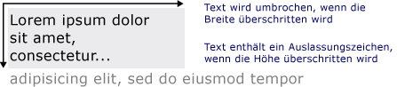

# Zeichnen von formatiertem Text
Dieses Thema bietet eine Übersicht über die Funktionen von der <xref:System.Windows.Media.FormattedText> Objekt. Dieses Objekt bietet die Steuerung auf niedriger Ebene für das Zeichnen von Text in [!INCLUDE[TLA#tla_winclient](../../../../includes/tlasharptla-winclient-md.md)]-Anwendungen.  
  
  
## Technologieübersicht  
 Die <xref:System.Windows.Media.FormattedText> Objekts können Sie mehrzeilige Zeichnen von Text, in dem jedes Zeichen im Text einzeln formatiert werden kann. Das folgende Beispiel zeigt Text mit mehreren angewendeten Formaten:  
  
   
Angezeigter Text mit der FormattedText-Methode  
  
> [!NOTE]
>  Für Entwickler, die von der [!INCLUDE[TLA#tla_win32](../../../../includes/tlasharptla-win32-md.md)]-API migrieren, listet die Tabelle im [Win32-Migration](#win32_migration)-Abschnitt die [!INCLUDE[TLA#tla_win32](../../../../includes/tlasharptla-win32-md.md)]-DrawText-Flags und deren ungefähre Entsprechung in [!INCLUDE[TLA#tla_winclient](../../../../includes/tlasharptla-winclient-md.md)] auf.  
  
### Gründe für das Verwenden von formatiertem Text  
 [!INCLUDE[TLA2#tla_winclient](../../../../includes/tla2sharptla-winclient-md.md)] enthält zahlreiche Steuerelemente für das Zeichnen von Text auf dem Bildschirm. Jedes Steuerelement ist einem bestimmten Szenario zugeordnet und besitzt eine eigene Liste von Funktionen und Einschränkungen. Im Allgemeinen die <xref:System.Windows.Controls.TextBlock> -Element sollte verwendet werden, wenn begrenzte-Text-Unterstützung erforderlich sind, z. B. eine kurze Satzes im wird eine [!INCLUDE[TLA#tla_ui](../../../../includes/tlasharptla-ui-md.md)]. <xref:System.Windows.Controls.Label>kann verwendet werden, wenn wenig Text-Unterstützung erforderlich ist. Weitere Informationen finden Sie unter [Dokumente in WPF](../../../../docs/framework/wpf/advanced/documents-in-wpf.md).  
  
 Die <xref:System.Windows.Media.FormattedText> Objekt bietet umfassendere Funktionen als [!INCLUDE[TLA#tla_winclient](../../../../includes/tlasharptla-winclient-md.md)] Textsteuerelemente, und kann hilfreich in Fällen, in denen Text als dekorativen Element verwendet werden soll. Weitere Informationen finden Sie im folgenden Abschnitt [Konvertieren von formatiertem Text in eine Geometrie](#converting_formatted_text).  
  
 Darüber hinaus die <xref:System.Windows.Media.FormattedText> Objekt ist nützlich zum Erstellen von textorientierte <xref:System.Windows.Media.DrawingVisual>--abgeleitete Objekte. <xref:System.Windows.Media.DrawingVisual>ist eine einfache zeichnen-Klasse, die zum Rendern von Formen, Bildern oder Text verwendet wird. Weitere Informationen finden Sie unter [Beispiel für Treffertests mit DrawingVisuals](http://go.microsoft.com/fwlink/?LinkID=159994).  
  
## Verwenden des FormattedText-Objekts  
 Um formatierten Text zu erstellen, rufen Sie die <xref:System.Windows.Media.FormattedText.%23ctor%2A> Konstruktor zur Erstellung einer <xref:System.Windows.Media.FormattedText> Objekt. Nachdem Sie die Anfangszeichenfolge für formatierten Text erstellt haben, können Sie eine Reihe von Formatvorlagen anwenden.  
  
 Verwenden der <xref:System.Windows.Media.FormattedText.MaxTextWidth%2A> Eigenschaft, die den Text an einer bestimmten Breite zu beschränken. Der Text wird automatisch umgebrochen, um die angegebene Breite nicht zu überschreiten. Verwenden der <xref:System.Windows.Media.FormattedText.MaxTextHeight%2A> Eigenschaft, die den Text an einer bestimmten Höhe zu beschränken. Der Text zeigt Auslassungspunkte „...“ an, wenn die angegebene Höhe überschritten wird.  
  
   
Angezeigter Text mit Zeilenumbruch und Auslassungspunkten  
  
 Sie können mehrere Formatvorlagen auf ein oder mehrere Zeichen anwenden. Sie können z. B. Aufrufen sowohl die <xref:System.Windows.Media.FormattedText.SetFontSize%2A> und <xref:System.Windows.Media.FormattedText.SetForegroundBrush%2A> Methoden, um die Formatierung der ersten fünf Zeichen im Text ändern.  
  
 Das folgende Codebeispiel erstellt eine <xref:System.Windows.Media.FormattedText> Objekt, und klicken Sie dann mehrere Formatierungsstile auf den Text angewendet.  
  
 [!code-csharp[FormattedTextSnippets#FormattedTextSnippets1](../../../../samples/snippets/csharp/VS_Snippets_Wpf/FormattedTextSnippets/CSharp/Window1.xaml.cs#formattedtextsnippets1)]
 [!code-vb[FormattedTextSnippets#FormattedTextSnippets1](../../../../samples/snippets/visualbasic/VS_Snippets_Wpf/FormattedTextSnippets/visualbasic/window1.xaml.vb#formattedtextsnippets1)]  
  
### Maßeinheit für den Schriftgrad  
 Wie bei anderen Textobjekten in [!INCLUDE[TLA#tla_winclient](../../../../includes/tlasharptla-winclient-md.md)] Anwendungen, die <xref:System.Windows.Media.FormattedText> Objekt geräteunabhängige Pixel als Maßeinheit verwendet. Die meisten [!INCLUDE[TLA#tla_win32](../../../../includes/tlasharptla-win32-md.md)]-Anwendungen verwenden jedoch Punkte als Maßeinheit. Möchten Sie in [!INCLUDE[TLA#tla_winclient](../../../../includes/tlasharptla-winclient-md.md)]-Anwendungen Punkte als Maßeinheit für angezeigten Text verwenden, müssen Sie [!INCLUDE[TLA#tla_dipixel#plural](../../../../includes/tlasharptla-dipixelsharpplural-md.md)] in Punkte konvertieren. Der folgende Code veranschaulicht diese Konvertierung:  
  
 [!code-csharp[FormattedTextSnippets#FormattedTextSnippets2](../../../../samples/snippets/csharp/VS_Snippets_Wpf/FormattedTextSnippets/CSharp/Window1.xaml.cs#formattedtextsnippets2)]
 [!code-vb[FormattedTextSnippets#FormattedTextSnippets2](../../../../samples/snippets/visualbasic/VS_Snippets_Wpf/FormattedTextSnippets/visualbasic/window1.xaml.vb#formattedtextsnippets2)]  
  
   
### Konvertieren von formatiertem Text in eine Geometrie  
 Sie können auch formatierten Text in konvertieren <xref:System.Windows.Media.Geometry> Objekte, sodass Sie andere Arten von visuell interessante Text zu erstellen. Sie können z. B. Erstellen einer <xref:System.Windows.Media.Geometry> Objekt auf Grundlage der Gliederung einer Textzeichenfolge.  
  
   
Textkontur mit einem linearen Farbverlaufspinsel  
  
 Die folgenden Beispiele zeigen verschiedene Möglichkeiten zum Erstellen von visuell interessanten Effekten durch Ändern von Strich, Füllung und Hervorhebung des konvertierten Texts.  
  
   
Beispiel für das Festlegen von unterschiedlichen Farben für Strich und Füllung  
  
   
Beispiel für die Anwendung eines Bildpinsels auf den Strich  
  
   
Beispiel für die Anwendung eines Bildpinsels auf den Strich und die Hervorhebung  
  
 Wenn Text konvertiert wird, wird ein <xref:System.Windows.Media.Geometry> -Objekt, es ist nicht mehr eine Auflistung von Zeichen – die Zeichen in der Textzeichenfolge kann nicht geändert werden. Sie können jedoch die Darstellung des konvertierten Texts durch Ändern der Strich- und Füllungseigenschaften ändern. Der Strich bezieht sich auf die Kontur des konvertierten Texts und die Füllung auf den Bereich innerhalb der Kontur. Weitere Informationen finden Sie unter [Erstellen von Text mit Kontur](../../../../docs/framework/wpf/advanced/how-to-create-outlined-text.md).  
  
 Sie können auch formatierten Text zum Konvertieren einer <xref:System.Windows.Media.PathGeometry> -Objekt und das Objekt zum Hervorheben des Texts verwenden. Sie konnten z. B. Animation Anwenden der <xref:System.Windows.Media.PathGeometry> Objekt, sodass die Animation die Kontur des formatierten Text folgt.  
  
 Das folgende Beispiel zeigt der formatierte Text, der in konvertiert wurde ein <xref:System.Windows.Media.PathGeometry> Objekt. Eine animierte Ellipse folgt dem Strichpfad des gerenderten Texts.  
  
   
Kugel, die der Pfadgeometrie des Textes folgt  
  
 Weitere Informationen finden Sie unter [Vorgehensweise: Erstellen einer PathGeometry-Animation für Text](http://msdn.microsoft.com/en-us/29f8051e-798a-463f-a926-a099a99e9c67).  
  
 Sie können weitere interessanten Verwendungsmöglichkeiten für formatierten Text erstellen, sobald es in konvertiert wurde ein <xref:System.Windows.Media.PathGeometry> Objekt. So können Sie beispielsweise ein zugeschnittenes Video darin anzeigen.  
  
   
Video, das in der Pfadgeometrie von Text angezeigt wird  
  
   
## Win32-Migration  
 Die Funktionen von <xref:System.Windows.Media.FormattedText> zum Zeichnen von Text ähneln die Funktionen von der [!INCLUDE[TLA#tla_win32](../../../../includes/tlasharptla-win32-md.md)] DrawText-Funktion. Für Entwickler, die von der [!INCLUDE[TLA#tla_win32](../../../../includes/tlasharptla-win32-md.md)]-API migrieren, listet die folgende Tabelle die [!INCLUDE[TLA#tla_win32](../../../../includes/tlasharptla-win32-md.md)]-DrawText-Flags und deren ungefähre Entsprechung in [!INCLUDE[TLA#tla_winclient](../../../../includes/tlasharptla-winclient-md.md)] auf.  
  
|DrawText-Flag|WPF-Entsprechung|Notizen|  
|-------------------|--------------------|-----------|  
|DT_BOTTOM|<xref:System.Windows.Media.FormattedText.Height%2A>|Verwenden der <xref:System.Windows.Media.FormattedText.Height%2A> Eigenschaft zur Berechnung einer entsprechenden [!INCLUDE[TLA#tla_win32](../../../../includes/tlasharptla-win32-md.md)] DrawText 'y'-Position.|  
|DT_CALCRECT|<xref:System.Windows.Media.FormattedText.Height%2A>, <xref:System.Windows.Media.FormattedText.Width%2A>|Verwenden der <xref:System.Windows.Media.FormattedText.Height%2A> und <xref:System.Windows.Media.FormattedText.Width%2A> Eigenschaften, um das Ausgaberechteck zu berechnen.|  
|DT_CENTER|<xref:System.Windows.Media.FormattedText.TextAlignment%2A>|Verwenden der <xref:System.Windows.Media.FormattedText.TextAlignment%2A> Eigenschaft mit dem Wert <xref:System.Windows.TextAlignment.Center>.|  
|DT_EDITCONTROL|Keine|Nicht erforderlich Rendern von Abstandsbreite und letzter Zeile sind identisch mit dem Edit-Steuerelement für Framework.|  
|DT_END_ELLIPSIS|<xref:System.Windows.Media.FormattedText.Trimming%2A>|Verwenden der <xref:System.Windows.Media.FormattedText.Trimming%2A> Eigenschaft mit dem Wert <xref:System.Windows.TextTrimming.CharacterEllipsis>.   Verwendung <xref:System.Windows.TextTrimming.WordEllipsis> abzurufenden [!INCLUDE[TLA#tla_win32](../../../../includes/tlasharptla-win32-md.md)] DT_END_ELLIPSIS mit DT_WORD_ELIPSIS enden mit den Auslassungspunkten – in diesem Fall Zeichen mit den Auslassungspunkten tritt nur auf Wörter, die nicht groß genug ist in einer einzelnen Zeile.|  
|DT_EXPAND_TABS|Keine|Nicht erforderlich Registerkarten werden automatisch auf Zwischenstopps nach jeweils 4 em erweitert. Dies entspricht etwa der Breite von 8 sprachunabhängigen Zeichen.|  
|DT_EXTERNALLEADING|Keine|Nicht erforderlich Der externe Abstand ist immer im Zeilenabstand enthalten. Verwenden der <xref:System.Windows.Media.FormattedText.LineHeight%2A> Eigenschaft zum Erstellen von benutzerdefinierten Zeilenabstand.|  
|DT_HIDEPREFIX|Keine|Wird nicht unterstützt. Entfernen Sie die "&" aus der Zeichenfolge vor der Erstellung der <xref:System.Windows.Media.FormattedText> Objekt.|  
|DT_LEFT|<xref:System.Windows.Media.FormattedText.TextAlignment%2A>|Dies ist die standardmäßige Textausrichtung. Verwenden der <xref:System.Windows.Media.FormattedText.TextAlignment%2A> Eigenschaft mit dem Wert <xref:System.Windows.TextAlignment.Left>. (nur für WPF)|  
|DT_MODIFYSTRING|Keine|Wird nicht unterstützt.|  
|DT_NOCLIP|<xref:System.Windows.Media.Visual.VisualClip%2A>|Clipping geschieht nicht automatisch. Verwenden Sie nach Bedarf Clip-Text, der <xref:System.Windows.Media.Visual.VisualClip%2A> Eigenschaft.|  
|DT_NOFULLWIDTHCHARBREAK|Keine|Wird nicht unterstützt.|  
|DT_NOPREFIX|Keine|Nicht erforderlich Das &-Zeichen innerhalb der Zeichenfolgen wird immer als normales Zeichen behandelt.|  
|DT_PATHELLIPSIS|Keine|Verwenden der <xref:System.Windows.Media.FormattedText.Trimming%2A> Eigenschaft mit dem Wert <xref:System.Windows.TextTrimming.WordEllipsis>.|  
|DT_PREFIX|Keine|Wird nicht unterstützt. Verwenden Sie, wenn Sie Unterstriche für Text, z. B. eine Zugriffstaste oder Link verwenden möchten die <xref:System.Windows.Media.FormattedText.SetTextDecorations%2A> Methode.|  
|DT_PREFIXONLY|Keine|Wird nicht unterstützt.|  
|DT_RIGHT|<xref:System.Windows.Media.FormattedText.TextAlignment%2A>|Verwenden der <xref:System.Windows.Media.FormattedText.TextAlignment%2A> Eigenschaft mit dem Wert <xref:System.Windows.TextAlignment.Right>. (nur für WPF)|  
|DT_RTLREADING|<xref:System.Windows.Media.FormattedText.FlowDirection%2A>|Legen Sie die <xref:System.Windows.Media.FormattedText.FlowDirection%2A>-Eigenschaft auf <xref:System.Windows.FlowDirection.RightToLeft> fest.|  
|DT_SINGLELINE|Keine|Nicht erforderlich <xref:System.Windows.Media.FormattedText>Objekte verhalten sich wie ein einzeiliges Steuerelement, es sei denn, entweder die <xref:System.Windows.Media.FormattedText.MaxTextWidth%2A> Eigenschaft festgelegt ist, oder den Text enthält, einen Wagenrücklauf/Zeilenvorschub (CR/LF).|  
|DT_TABSTOP|Keine|Keine Unterstützung für benutzerdefinierte Tabstopppositionen.|  
|DT_TOP|<xref:System.Windows.Media.FormattedText.Height%2A>|Nicht erforderlich Obere Ausrichtung ist die Standardeinstellung. Andere Werte für vertikale Positionierung können definiert werden, indem die <xref:System.Windows.Media.FormattedText.Height%2A> Eigenschaft zur Berechnung einer entsprechenden [!INCLUDE[TLA#tla_win32](../../../../includes/tlasharptla-win32-md.md)] DrawText 'y'-Position.|  
|DT_VCENTER|<xref:System.Windows.Media.FormattedText.Height%2A>|Verwenden der <xref:System.Windows.Media.FormattedText.Height%2A> Eigenschaft zur Berechnung einer entsprechenden [!INCLUDE[TLA#tla_win32](../../../../includes/tlasharptla-win32-md.md)] DrawText 'y'-Position.|  
|DT_WORDBREAK|Keine|Nicht erforderlich Worttrennung geschieht automatisch bei <xref:System.Windows.Media.FormattedText> Objekte. Sie kann nicht deaktiviert werden.|  
|DT_WORD_ELLIPSIS|<xref:System.Windows.Media.FormattedText.Trimming%2A>|Verwenden der <xref:System.Windows.Media.FormattedText.Trimming%2A> Eigenschaft mit dem Wert <xref:System.Windows.TextTrimming.WordEllipsis>.|  
  
## Siehe auch  
 <xref:System.Windows.Media.FormattedText>  
 [Dokumente in WPF](../../../../docs/framework/wpf/advanced/documents-in-wpf.md)  
 [Typografie in WPF](../../../../docs/framework/wpf/advanced/typography-in-wpf.md)  
 [Erstellen von Text mit Kontur](../../../../docs/framework/wpf/advanced/how-to-create-outlined-text.md)  
 [Vorgehensweise: Erstellen einer PathGeometry-Animation für Text](http://msdn.microsoft.com/en-us/29f8051e-798a-463f-a926-a099a99e9c67)
