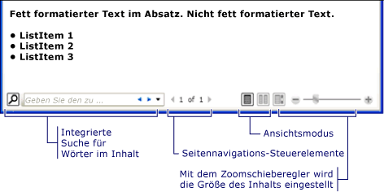
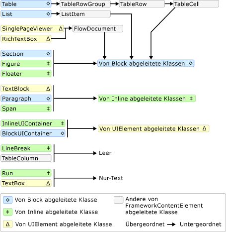
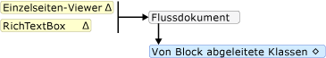
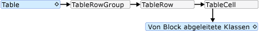
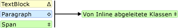
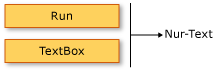

# <a name="flow-document-overview"></a><span data-ttu-id="a3ed4-103">Übersicht über Flussdokumente</span><span class="sxs-lookup"><span data-stu-id="a3ed4-103">Flow Document Overview</span></span>

<span data-ttu-id="a3ed4-104">Flussdokumente dienen der Optimierung der Anzeige und Lesbarkeit.</span><span class="sxs-lookup"><span data-stu-id="a3ed4-104">Flow documents are designed to optimize viewing and readability.</span></span> <span data-ttu-id="a3ed4-105">Flussdokumente sind nicht auf ein vordefiniertes Layout festgelegt, sondern passen ihren Inhalt auf Grundlage von Laufzeitvariablen wie Fenstergröße, Geräteauflösung und optionalen Benutzereinstellungen dynamisch an und brechen ihn dynamisch um.</span><span class="sxs-lookup"><span data-stu-id="a3ed4-105">Rather than being set to one predefined layout, flow documents dynamically adjust and reflow their content based on run-time variables such as window size, device resolution, and optional user preferences.</span></span> <span data-ttu-id="a3ed4-106">Zudem bieten Flussdokumente erweiterte Dokumentfunktionen, z.B. Paginierung und Spalten.</span><span class="sxs-lookup"><span data-stu-id="a3ed4-106">In addition, flow documents offer advanced document features, such as pagination and columns.</span></span> <span data-ttu-id="a3ed4-107">Dieses Thema enthält eine Übersicht über Flussdokumente und deren Erstellung.</span><span class="sxs-lookup"><span data-stu-id="a3ed4-107">This topic provides an overview of flow documents and how to create them.</span></span>

<a name="what_is_a_flow_document"></a>

## <a name="what-is-a-flow-document"></a><span data-ttu-id="a3ed4-108">Was ist ein Flussdokument?</span><span class="sxs-lookup"><span data-stu-id="a3ed4-108">What is a Flow Document</span></span>

<span data-ttu-id="a3ed4-109">Ein Flussdokument wurde konzipiert, um abhängig von der Fenstergröße, der Geräteauflösung und anderen Umgebungsvariablen den „Inhalt dynamisch umzubrechen“.</span><span class="sxs-lookup"><span data-stu-id="a3ed4-109">A flow document is designed to "reflow content" depending on window size, device resolution, and other environment variables.</span></span> <span data-ttu-id="a3ed4-110">Zudem verfügen Flussdokumente über eine Vielzahl integrierter Funktionen, inklusive der Suche, Anzeigemodi zur Optimierung der Lesbarkeit und der Möglichkeit zum Ändern der Größe und Darstellung von Schriftarten.</span><span class="sxs-lookup"><span data-stu-id="a3ed4-110">In addition, flow documents have a number of built in features including search, viewing modes that optimize readability, and the ability to change the size and appearance of fonts.</span></span> <span data-ttu-id="a3ed4-111">Flussdokumente werden am besten verwendet, wenn das erleichterte Lesen das Hauptgebrauchsszenario des Dokuments darstellt.</span><span class="sxs-lookup"><span data-stu-id="a3ed4-111">Flow Documents are best utilized when ease of reading is the primary document consumption scenario.</span></span> <span data-ttu-id="a3ed4-112">Im Gegensatz dazu sind fixierte Dokumente für eine statische Darstellung entworfen.</span><span class="sxs-lookup"><span data-stu-id="a3ed4-112">In contrast, Fixed Documents are designed to have a static presentation.</span></span> <span data-ttu-id="a3ed4-113">Fixierte Dokumente sind hilfreich, wenn die Originaltreue des Quellinhalts wichtig ist.</span><span class="sxs-lookup"><span data-stu-id="a3ed4-113">Fixed Documents are useful when fidelity of the source content is essential.</span></span> <span data-ttu-id="a3ed4-114">Weitere Informationen zu verschiedenen Dokumenttypen finden Sie unter [Dokumente in WPF](documents-in-wpf.md) .</span><span class="sxs-lookup"><span data-stu-id="a3ed4-114">See [Documents in WPF](documents-in-wpf.md) for more information on different types of documents.</span></span>

<span data-ttu-id="a3ed4-115">Die folgende Abbildung zeigt ein Beispielflussdokument in mehreren Fenstern von verschiedener Größe.</span><span class="sxs-lookup"><span data-stu-id="a3ed4-115">The following illustration shows a sample flow document viewed in several windows of different sizes.</span></span> <span data-ttu-id="a3ed4-116">Wenn sich der Bildschirmbereich ändert, bricht der Inhalt dynamisch um, um den verfügbaren Platz bestmöglich auszunutzen.</span><span class="sxs-lookup"><span data-stu-id="a3ed4-116">As the display area changes, the content reflows to make the best use of the available space.</span></span>

<span data-ttu-id="a3ed4-117"></span><span class="sxs-lookup"><span data-stu-id="a3ed4-117"></span></span>

<span data-ttu-id="a3ed4-118">Wie in dem Bild oben dargestellt, kann fortlaufender Inhalt viele Komponenten umfassen, einschließlich Absätzen, Listen, Bilder usw.</span><span class="sxs-lookup"><span data-stu-id="a3ed4-118">As seen in the image above, flow content can include many components including paragraphs, lists, images, and more.</span></span> <span data-ttu-id="a3ed4-119">Diese Komponenten entsprechen Elementen im Markup und Objekten in prozeduralem Code.</span><span class="sxs-lookup"><span data-stu-id="a3ed4-119">These components correspond to elements in markup and objects in procedural code.</span></span> <span data-ttu-id="a3ed4-120">Diese Klassen werden weiter unten im Abschnitt [Fluss bezogene Klassen](#flow_related_classes) dieser Übersicht ausführlich erläutert.</span><span class="sxs-lookup"><span data-stu-id="a3ed4-120">We will go over these classes in detail later in the [Flow Related Classes](#flow_related_classes) section of this overview.</span></span> <span data-ttu-id="a3ed4-121">Im folgenden finden Sie ein einfaches Codebeispiel, in dem ein Fluss Dokument erstellt wird, das aus einem Absatz mit fett formatiertem Text und einer Liste besteht.</span><span class="sxs-lookup"><span data-stu-id="a3ed4-121">For now, here is a simple code example that creates a flow document consisting of a paragraph with some bold text and a list.</span></span>

[!code-xaml[FlowOvwSnippets_snip#SimpleFlowExampleWholePage](~/samples/snippets/csharp/VS_Snippets_Wpf/FlowOvwSnippets_snip/CS/SimpleFlowExample.xaml#simpleflowexamplewholepage)]

[!code-csharp[FlowOvwSnippets_procedural_snip#SimpleFlowCodeOnlyExampleWholePage](~/samples/snippets/csharp/VS_Snippets_Wpf/FlowOvwSnippets_procedural_snip/CSharp/SimpleFlowExample.cs#simpleflowcodeonlyexamplewholepage)]
[!code-vb[FlowOvwSnippets_procedural_snip#SimpleFlowCodeOnlyExampleWholePage](~/samples/snippets/visualbasic/VS_Snippets_Wpf/FlowOvwSnippets_procedural_snip/VisualBasic/SimpleFlowExample.vb#simpleflowcodeonlyexamplewholepage)]

<span data-ttu-id="a3ed4-122">In der folgenden Abbildung wird gezeigt, wie dieser Codeausschnitt aussieht.</span><span class="sxs-lookup"><span data-stu-id="a3ed4-122">The illustration below shows what this code snippet looks like.</span></span>

<span data-ttu-id="a3ed4-123"></span><span class="sxs-lookup"><span data-stu-id="a3ed4-123"></span></span>

<span data-ttu-id="a3ed4-124">In diesem Beispiel wird das- <xref:System.Windows.Controls.FlowDocumentReader> Steuerelement verwendet, um den fortlaufenden Inhalt zu hosten.</span><span class="sxs-lookup"><span data-stu-id="a3ed4-124">In this example, the <xref:System.Windows.Controls.FlowDocumentReader> control is used to host the flow content.</span></span> <span data-ttu-id="a3ed4-125">Weitere Informationen zu flowinhaltshostingsteuerelementen finden Sie unter [Fluss Dokumenttypen](#flow_document_types) .</span><span class="sxs-lookup"><span data-stu-id="a3ed4-125">See [Flow Document Types](#flow_document_types) for more information on flow content hosting controls.</span></span> <span data-ttu-id="a3ed4-126"><xref:System.Windows.Documents.Paragraph><xref:System.Windows.Documents.List>-, <xref:System.Windows.Documents.ListItem> -,-und- <xref:System.Windows.Documents.Bold> Elemente werden verwendet, um die Inhalts Formatierung basierend auf ihrer Reihenfolge im Markup zu steuern.</span><span class="sxs-lookup"><span data-stu-id="a3ed4-126"><xref:System.Windows.Documents.Paragraph>, <xref:System.Windows.Documents.List>, <xref:System.Windows.Documents.ListItem>, and <xref:System.Windows.Documents.Bold> elements are used to control content formatting, based on their order in markup.</span></span> <span data-ttu-id="a3ed4-127">Das- <xref:System.Windows.Documents.Bold> Element erstreckt sich z. b. nur über einen Teil des Texts im Absatz, daher ist nur dieser Teil des Texts fett formatiert.</span><span class="sxs-lookup"><span data-stu-id="a3ed4-127">For example, the <xref:System.Windows.Documents.Bold> element spans across only part of the text in the paragraph; as a result, only that part of the text is bold.</span></span> <span data-ttu-id="a3ed4-128">Wenn Sie HTML verwendet haben, wird Ihnen dies vertraut sein.</span><span class="sxs-lookup"><span data-stu-id="a3ed4-128">If you have used HTML, this will be familiar to you.</span></span>

<span data-ttu-id="a3ed4-129">Wie in der obigen Abbildung hervorgehoben, gibt es mehrere Funktionen, die in Fluss Dokumente integriert sind:</span><span class="sxs-lookup"><span data-stu-id="a3ed4-129">As highlighted in the illustration above, there are several features built into Flow Documents:</span></span>

- <span data-ttu-id="a3ed4-130">Suche: Ermöglicht dem Benutzer, eine Volltextsuche auf ein ganzes Dokument auszuführen.</span><span class="sxs-lookup"><span data-stu-id="a3ed4-130">Search: Allows the user to perform a full text search of an entire document.</span></span>

- <span data-ttu-id="a3ed4-131">Anzeigemodus: Der Benutzer kann seinen bevorzugten Anzeigemodus auswählen, darunter der Anzeigemodus „Einzelne Seite“ (Seite-für-Seite), der Anzeigemodus „Zwei Seiten“ (Buchleseformat) und der fortlaufende Anzeigemodus „Fensterinhalt verschieben“ (unbeschränkt).</span><span class="sxs-lookup"><span data-stu-id="a3ed4-131">Viewing Mode: The user can select their preferred viewing mode including a single-page (page-at-a-time) viewing mode, a two-page-at-a-time (book reading format) viewing mode, and a continuous scrolling (bottomless) viewing mode.</span></span>  <span data-ttu-id="a3ed4-132">Weitere Informationen zu diesen Anzeigemodi finden Sie unter <xref:System.Windows.Controls.FlowDocumentReaderViewingMode> .</span><span class="sxs-lookup"><span data-stu-id="a3ed4-132">For more information about these viewing modes, see <xref:System.Windows.Controls.FlowDocumentReaderViewingMode>.</span></span>

- <span data-ttu-id="a3ed4-133">Steuerelemente für die Seitennavigation: Wenn der Anzeigemodus des Dokuments Seiten verwendet, umfassen die Steuerelemente für die Seitennavigation eine Schaltfläche zum Springen auf die nächste Seite (Pfeil nach unten) oder die vorherige Seite (Pfeil nach oben) sowie Indikatoren für die aktuelle Seitennummer und die Gesamtzahl der Seiten.</span><span class="sxs-lookup"><span data-stu-id="a3ed4-133">Page Navigation Controls: If the viewing mode of the document uses pages, the page navigation controls include a button to jump to the next page (the down arrow) or previous page (the up arrow), as well as indicators for the current page number and total number of pages.</span></span> <span data-ttu-id="a3ed4-134">Das Blättern durch Seiten funktioniert auch mithilfe der Pfeiltasten auf der Tastatur.</span><span class="sxs-lookup"><span data-stu-id="a3ed4-134">Flipping through pages can also be accomplished using the keyboard arrow keys.</span></span>

- <span data-ttu-id="a3ed4-135">Zoom: Die Zoomsteuerelemente ermöglichen es dem Benutzer, die Zoomstufe zu erhöhen oder zu verringern, indem er entsprechend auf die Plus- oder Minusschaltfächen klickt.</span><span class="sxs-lookup"><span data-stu-id="a3ed4-135">Zoom: The zoom controls enable the user to increase or decrease the zoom level by clicking the plus or minus buttons, respectively.</span></span> <span data-ttu-id="a3ed4-136">Die Zoomsteuerelemente umfassen zudem einen Schieberegler zum Anpassen der Zoomstufe.</span><span class="sxs-lookup"><span data-stu-id="a3ed4-136">The zoom controls also include a slider for adjusting the zoom level.</span></span> <span data-ttu-id="a3ed4-137">Weitere Informationen finden Sie unter <xref:System.Windows.Controls.FlowDocumentReader.Zoom%2A>.</span><span class="sxs-lookup"><span data-stu-id="a3ed4-137">For more information, see <xref:System.Windows.Controls.FlowDocumentReader.Zoom%2A>.</span></span>

<span data-ttu-id="a3ed4-138">Diese Funktionen können basierend auf dem zum Hosten des fortlaufenden Inhalts verwendeten Steuerelement bearbeitet werden.</span><span class="sxs-lookup"><span data-stu-id="a3ed4-138">These features can be modified based upon the control used to host the flow content.</span></span> <span data-ttu-id="a3ed4-139">Im nächsten Abschnitt werden die verschiedenen Steuerelemente beschrieben.</span><span class="sxs-lookup"><span data-stu-id="a3ed4-139">The next section describes the different controls.</span></span>

<a name="flow_document_types"></a>

## <a name="flow-document-types"></a><span data-ttu-id="a3ed4-140">Flussdokumenttypen</span><span class="sxs-lookup"><span data-stu-id="a3ed4-140">Flow Document Types</span></span>

<span data-ttu-id="a3ed4-141">Die Anzeige und Darstellung von Flussdokumentinhalt hängt davon ab, welches Objekt zum Hosten des fortlaufenden Inhalts verwendet wird.</span><span class="sxs-lookup"><span data-stu-id="a3ed4-141">Display of flow document content and how it appears is dependent upon what object is used to host the flow content.</span></span> <span data-ttu-id="a3ed4-142">Es gibt vier Steuerelemente, die die Anzeige von fortlaufendem Inhalt unterstützen: <xref:System.Windows.Controls.FlowDocumentReader> , <xref:System.Windows.Controls.FlowDocumentPageViewer> , <xref:System.Windows.Controls.RichTextBox> und <xref:System.Windows.Controls.FlowDocumentScrollViewer> .</span><span class="sxs-lookup"><span data-stu-id="a3ed4-142">There are four controls that support viewing of flow content: <xref:System.Windows.Controls.FlowDocumentReader>, <xref:System.Windows.Controls.FlowDocumentPageViewer>, <xref:System.Windows.Controls.RichTextBox>, and <xref:System.Windows.Controls.FlowDocumentScrollViewer>.</span></span> <span data-ttu-id="a3ed4-143">Diese Steuerelemente werden nachstehend kurz beschrieben.</span><span class="sxs-lookup"><span data-stu-id="a3ed4-143">These controls are briefly described below.</span></span>

> [!NOTE]
> <span data-ttu-id="a3ed4-144"><xref:System.Windows.Documents.FlowDocument>ist erforderlich, um fortlaufenden Inhalt direkt zu hosten. Daher verwenden alle diese Anzeige Steuerelemente einen, um das Hosting von fortlaufendem <xref:System.Windows.Documents.FlowDocument> Inhalt zu</span><span class="sxs-lookup"><span data-stu-id="a3ed4-144"><xref:System.Windows.Documents.FlowDocument> is required to directly host flow content, so all of these viewing controls consume a <xref:System.Windows.Documents.FlowDocument> to enable flow content hosting.</span></span>

### <a name="flowdocumentreader"></a><span data-ttu-id="a3ed4-145">FlowDocumentReader</span><span class="sxs-lookup"><span data-stu-id="a3ed4-145">FlowDocumentReader</span></span>

<span data-ttu-id="a3ed4-146"><xref:System.Windows.Controls.FlowDocumentReader>enthält Funktionen, die es dem Benutzer ermöglichen, dynamisch zwischen verschiedenen Anzeigemodi zu wählen, z. b. einem einseitigen Anzeigemodus (seitenweise), einem bidirektionalen Anzeigemodus (Buch lese Format) und einem fortlaufenden Scrollmodus (in der untersten Größe).</span><span class="sxs-lookup"><span data-stu-id="a3ed4-146"><xref:System.Windows.Controls.FlowDocumentReader> includes features that enable the user to dynamically choose between various viewing modes, including a single-page (page-at-a-time) viewing mode, a two-page-at-a-time (book reading format) viewing mode, and a continuous scrolling (bottomless) viewing mode.</span></span> <span data-ttu-id="a3ed4-147">Weitere Informationen zu diesen Anzeigemodi finden Sie unter <xref:System.Windows.Controls.FlowDocumentReaderViewingMode> .</span><span class="sxs-lookup"><span data-stu-id="a3ed4-147">For more information about these viewing modes, see <xref:System.Windows.Controls.FlowDocumentReaderViewingMode>.</span></span> <span data-ttu-id="a3ed4-148">, Wenn Sie nicht in der Lage sein müssen, dynamisch zwischen verschiedenen Anzeigemodi zu wechseln, <xref:System.Windows.Controls.FlowDocumentPageViewer> und einen <xref:System.Windows.Controls.FlowDocumentScrollViewer> Auslagerungs Inhalts-Viewer mit leichteren Gewichtungen bereitstellen, die in einem bestimmten Anzeigemodus korrigiert sind.</span><span class="sxs-lookup"><span data-stu-id="a3ed4-148">If you do not need the ability to dynamically switch between different viewing modes, <xref:System.Windows.Controls.FlowDocumentPageViewer> and <xref:System.Windows.Controls.FlowDocumentScrollViewer> provide lighter-weight flow content viewers that are fixed in a particular viewing mode.</span></span>

### <a name="flowdocumentpageviewer-and-flowdocumentscrollviewer"></a><span data-ttu-id="a3ed4-149">FlowDocumentPageViewer und FlowDocumentScrollViewer</span><span class="sxs-lookup"><span data-stu-id="a3ed4-149">FlowDocumentPageViewer and FlowDocumentScrollViewer</span></span>

<span data-ttu-id="a3ed4-150"><xref:System.Windows.Controls.FlowDocumentPageViewer>zeigt den Inhalt im Seiten-zu-Zeit-Anzeigemodus an, während <xref:System.Windows.Controls.FlowDocumentScrollViewer> Inhalt im fortlaufenden Scrollmodus angezeigt wird.</span><span class="sxs-lookup"><span data-stu-id="a3ed4-150"><xref:System.Windows.Controls.FlowDocumentPageViewer> shows content in page-at-a-time viewing mode, while <xref:System.Windows.Controls.FlowDocumentScrollViewer> shows content in continuous scrolling mode.</span></span> <span data-ttu-id="a3ed4-151">Sowohl <xref:System.Windows.Controls.FlowDocumentPageViewer> als auch <xref:System.Windows.Controls.FlowDocumentScrollViewer> werden in einem bestimmten Anzeigemodus korrigiert.</span><span class="sxs-lookup"><span data-stu-id="a3ed4-151">Both <xref:System.Windows.Controls.FlowDocumentPageViewer> and <xref:System.Windows.Controls.FlowDocumentScrollViewer> are fixed to a particular viewing mode.</span></span> <span data-ttu-id="a3ed4-152">Vergleichen mit <xref:System.Windows.Controls.FlowDocumentReader> , das Funktionen enthält, die es dem Benutzer ermöglichen, sich dynamisch zwischen verschiedenen Anzeigemodi (wie von der-Enumeration bereitgestellt) zu entscheiden <xref:System.Windows.Controls.FlowDocumentReaderViewingMode> , um ressourcenintensiver als oder zu sein <xref:System.Windows.Controls.FlowDocumentPageViewer> <xref:System.Windows.Controls.FlowDocumentScrollViewer> .</span><span class="sxs-lookup"><span data-stu-id="a3ed4-152">Compare to <xref:System.Windows.Controls.FlowDocumentReader>, which includes features that enable the user to dynamically choose between various viewing modes (as provided by the <xref:System.Windows.Controls.FlowDocumentReaderViewingMode> enumeration), at the cost of being more resource intensive than <xref:System.Windows.Controls.FlowDocumentPageViewer> or <xref:System.Windows.Controls.FlowDocumentScrollViewer>.</span></span>

<span data-ttu-id="a3ed4-153">Standardmäßig wird eine vertikale Scrollleiste immer angezeigt, und eine horizontale Scrollleiste wird bei Bedarf angezeigt.</span><span class="sxs-lookup"><span data-stu-id="a3ed4-153">By default, a vertical scrollbar is always shown, and a horizontal scrollbar becomes visible if needed.</span></span> <span data-ttu-id="a3ed4-154">Die Standardbenutzer Oberfläche für <xref:System.Windows.Controls.FlowDocumentScrollViewer> enthält keine Symbolleiste <xref:System.Windows.Controls.FlowDocumentScrollViewer.IsToolBarVisible%2A> . die-Eigenschaft kann jedoch verwendet werden, um eine integrierte Symbolleiste zu aktivieren.</span><span class="sxs-lookup"><span data-stu-id="a3ed4-154">The default UI for <xref:System.Windows.Controls.FlowDocumentScrollViewer> does not include a toolbar; however, the <xref:System.Windows.Controls.FlowDocumentScrollViewer.IsToolBarVisible%2A> property can be used to enable a built-in toolbar.</span></span>

### <a name="richtextbox"></a><span data-ttu-id="a3ed4-155">RichTextBox</span><span class="sxs-lookup"><span data-stu-id="a3ed4-155">RichTextBox</span></span>

<span data-ttu-id="a3ed4-156">Sie verwenden eine <xref:System.Windows.Controls.RichTextBox> , wenn Sie es dem Benutzer ermöglichen möchten, den fortlaufenden Inhalt zu bearbeiten.</span><span class="sxs-lookup"><span data-stu-id="a3ed4-156">You use a <xref:System.Windows.Controls.RichTextBox> when you want to allow the user to edit flow content.</span></span> <span data-ttu-id="a3ed4-157">Wenn Sie z. b. einen Editor erstellen möchten, der es einem Benutzer ermöglicht, Elemente wie Tabellen, kursiv Formatierung und Fett Formatierung usw. zu bearbeiten, verwenden Sie eine <xref:System.Windows.Controls.RichTextBox> .</span><span class="sxs-lookup"><span data-stu-id="a3ed4-157">For example, if you wanted to create an editor that allowed a user to manipulate things like tables, italic and bold formatting, etc, you would use a <xref:System.Windows.Controls.RichTextBox>.</span></span> <span data-ttu-id="a3ed4-158">Weitere Informationen finden Sie unter [Übersicht über RichTextBox](../controls/richtextbox-overview.md) .</span><span class="sxs-lookup"><span data-stu-id="a3ed4-158">See [RichTextBox Overview](../controls/richtextbox-overview.md) for more information.</span></span>

> [!NOTE]
> <span data-ttu-id="a3ed4-159">Fortlaufendem Inhalt in einem <xref:System.Windows.Controls.RichTextBox> verhält sich nicht genau wie fortlaufenden Inhalt in anderen Steuerelementen.</span><span class="sxs-lookup"><span data-stu-id="a3ed4-159">Flow content inside a <xref:System.Windows.Controls.RichTextBox> does not behave exactly like flow content contained in other controls.</span></span> <span data-ttu-id="a3ed4-160">Beispielsweise gibt es keine Spalten in einem <xref:System.Windows.Controls.RichTextBox> und somit kein automatisches Verhalten bei der Änderung der Größe.</span><span class="sxs-lookup"><span data-stu-id="a3ed4-160">For example, there are no columns in a <xref:System.Windows.Controls.RichTextBox> and hence no automatic resizing behavior.</span></span> <span data-ttu-id="a3ed4-161">Außerdem sind die, die in der Regel in Funktionen von fortlaufendem Inhalt wie suchen, Anzeigemodus, Seitennavigation und Zoom integriert sind, in einer nicht verfügbar <xref:System.Windows.Controls.RichTextBox> .</span><span class="sxs-lookup"><span data-stu-id="a3ed4-161">Also, the typically built in features of flow content like search, viewing mode, page navigation, and zoom are not available within a <xref:System.Windows.Controls.RichTextBox>.</span></span>

<a name="creating_flow_content"></a>

## <a name="creating-flow-content"></a><span data-ttu-id="a3ed4-162">Erstellen von fortlaufendem Inhalt</span><span class="sxs-lookup"><span data-stu-id="a3ed4-162">Creating Flow Content</span></span>

<span data-ttu-id="a3ed4-163">Fortlaufendem Inhalt kann komplex sein und aus verschiedenen Elementen bestehen, einschließlich Text, Bildern, Tabellen und sogar <xref:System.Windows.UIElement> abgeleiteten Klassen wie Steuerelementen.</span><span class="sxs-lookup"><span data-stu-id="a3ed4-163">Flow content can be complex, consisting of various elements including text, images, tables, and even <xref:System.Windows.UIElement> derived classes like controls.</span></span> <span data-ttu-id="a3ed4-164">Um zu verstehen, wie komplexer fortlaufender Inhalt erstellt wird, sind die folgenden Punkte wichtig:</span><span class="sxs-lookup"><span data-stu-id="a3ed4-164">To understand how to create complex flow content, the following points are critical:</span></span>

- <span data-ttu-id="a3ed4-165">**Flussbezogene Klassen**: Jede in fortlaufendem Inhalt verwendete Klasse hat einen bestimmten Zweck.</span><span class="sxs-lookup"><span data-stu-id="a3ed4-165">**Flow-related Classes**: Each class used in flow content has a specific purpose.</span></span> <span data-ttu-id="a3ed4-166">Darüber hinaus hilft Ihnen die hierarchische Beziehung zwischen Flussklassen dabei, zu verstehen, wie sie verwendet werden.</span><span class="sxs-lookup"><span data-stu-id="a3ed4-166">In addition, the hierarchical relation between flow classes helps you understand how they are used.</span></span> <span data-ttu-id="a3ed4-167">Beispielsweise werden von der-Klasse abgeleitete Klassen <xref:System.Windows.Documents.Block> verwendet, um andere Objekte zu enthalten, während von abgeleitete Klassen- <xref:System.Windows.Documents.Inline> Objekte enthalten, die angezeigt werden.</span><span class="sxs-lookup"><span data-stu-id="a3ed4-167">For example, classes derived from the <xref:System.Windows.Documents.Block> class are used to contain other objects while classes derived from <xref:System.Windows.Documents.Inline> contain objects that are displayed.</span></span>

- <span data-ttu-id="a3ed4-168">**Inhaltsschema**: Ein Flussdokument kann eine beträchtliche Anzahl von geschachtelten Elementen erfordern.</span><span class="sxs-lookup"><span data-stu-id="a3ed4-168">**Content Schema**: A flow document can require a substantial number of nested elements.</span></span> <span data-ttu-id="a3ed4-169">Das Inhaltsschema gibt mögliche Übergeordnet/Untergeordnet-Beziehungen zwischen Elementen an.</span><span class="sxs-lookup"><span data-stu-id="a3ed4-169">The content schema specifies possible parent/child relationships between elements.</span></span>

<span data-ttu-id="a3ed4-170">In den folgenden Abschnitten wird jeder dieser Bereiche ausführlicher erklärt.</span><span class="sxs-lookup"><span data-stu-id="a3ed4-170">The following sections will go over each of these areas in more detail.</span></span>

<a name="flow_related_classes"></a>

## <a name="flow-related-classes"></a><span data-ttu-id="a3ed4-171">Flussbezogene Klassen</span><span class="sxs-lookup"><span data-stu-id="a3ed4-171">Flow Related Classes</span></span>

<span data-ttu-id="a3ed4-172">Das folgende Diagramm zeigt die am häufigsten bei fortlaufendem Inhalt verwendeten Objekte:</span><span class="sxs-lookup"><span data-stu-id="a3ed4-172">The diagram below shows the objects most typically used with flow content:</span></span>

<span data-ttu-id="a3ed4-173"></span><span class="sxs-lookup"><span data-stu-id="a3ed4-173"></span></span>

<span data-ttu-id="a3ed4-174">Für die Zwecke des fortlaufenden Inhalts gibt es zwei wichtige Kategorien:</span><span class="sxs-lookup"><span data-stu-id="a3ed4-174">For the purposes of flow content, there are two important categories:</span></span>

1. <span data-ttu-id="a3ed4-175">**Blockabgeleitete Klassen**: Auch „Blockinhaltselemente“ oder einfach „Blockelemente“ genannt.</span><span class="sxs-lookup"><span data-stu-id="a3ed4-175">**Block-derived classes**: Also called "Block content elements" or just "Block Elements".</span></span> <span data-ttu-id="a3ed4-176">Elemente, die von erben, <xref:System.Windows.Documents.Block> können verwendet werden, um Elemente unter einem gemeinsamen übergeordneten Element zu gruppieren oder um allgemeine Attribute auf eine Gruppe anzuwenden.</span><span class="sxs-lookup"><span data-stu-id="a3ed4-176">Elements that inherit from <xref:System.Windows.Documents.Block> can be used to group elements under a common parent or to apply common attributes to a group.</span></span>

2. <span data-ttu-id="a3ed4-177">**Inlineabgeleitete Klassen**: Auch „Inlineinhaltselemente“ oder einfach „Inlineelemente“ genannt.</span><span class="sxs-lookup"><span data-stu-id="a3ed4-177">**Inline-derived classes**: Also called "Inline content elements" or just "Inline Elements".</span></span> <span data-ttu-id="a3ed4-178">Elemente, die von erben, <xref:System.Windows.Documents.Inline> sind entweder in einem Block Element oder einem anderen Inline Element enthalten.</span><span class="sxs-lookup"><span data-stu-id="a3ed4-178">Elements that inherit from <xref:System.Windows.Documents.Inline> are either contained within a Block Element or another Inline Element.</span></span> <span data-ttu-id="a3ed4-179">Inlineelemente werden oft als direkter Container für Inhalt verwendet, der auf dem Bildschirm gerendert wird.</span><span class="sxs-lookup"><span data-stu-id="a3ed4-179">Inline Elements are often used as the direct container of content that is rendered to the screen.</span></span> <span data-ttu-id="a3ed4-180">Ein- <xref:System.Windows.Documents.Paragraph> Element (Block-Element) kann z. b. ein- <xref:System.Windows.Documents.Run> Element (Inline Element) enthalten, aber das-Element <xref:System.Windows.Documents.Run> enthält tatsächlich den auf dem Bildschirm gerenderten Text.</span><span class="sxs-lookup"><span data-stu-id="a3ed4-180">For example, a <xref:System.Windows.Documents.Paragraph> (Block Element) can contain a <xref:System.Windows.Documents.Run> (Inline Element) but the <xref:System.Windows.Documents.Run> actually contains the text that is rendered on the screen.</span></span>

<span data-ttu-id="a3ed4-181">Jede Klasse in diesen zwei Kategorien wird nachstehend kurz beschrieben.</span><span class="sxs-lookup"><span data-stu-id="a3ed4-181">Each class in these two categories is briefly described below.</span></span>

### <a name="block-derived-classes"></a><span data-ttu-id="a3ed4-182">Blockabgeleitete Klassen</span><span class="sxs-lookup"><span data-stu-id="a3ed4-182">Block-derived Classes</span></span>

<span data-ttu-id="a3ed4-183">**Abschnitt**</span><span class="sxs-lookup"><span data-stu-id="a3ed4-183">**Paragraph**</span></span>

<span data-ttu-id="a3ed4-184"><xref:System.Windows.Documents.Paragraph>wird normalerweise zum Gruppieren von Inhalten in einem Absatz verwendet.</span><span class="sxs-lookup"><span data-stu-id="a3ed4-184"><xref:System.Windows.Documents.Paragraph> is typically used to group content into a paragraph.</span></span> <span data-ttu-id="a3ed4-185">Die einfachste und häufigste Verwendung von Paragraph ist, einen Textabsatz zu erstellen.</span><span class="sxs-lookup"><span data-stu-id="a3ed4-185">The simplest and most common use of Paragraph is to create a paragraph of text.</span></span>

[!code-xaml[FlowOvwSnippets_snip#ParagraphExampleWholePage](~/samples/snippets/csharp/VS_Snippets_Wpf/FlowOvwSnippets_snip/CS/ParagraphExample.xaml#paragraphexamplewholepage)]

[!code-csharp[FlowOvwSnippets_procedural_snip#ParagraphCodeOnlyExampleWholePage](~/samples/snippets/csharp/VS_Snippets_Wpf/FlowOvwSnippets_procedural_snip/CSharp/ParagraphExample.cs#paragraphcodeonlyexamplewholepage)]
[!code-vb[FlowOvwSnippets_procedural_snip#ParagraphCodeOnlyExampleWholePage](~/samples/snippets/visualbasic/VS_Snippets_Wpf/FlowOvwSnippets_procedural_snip/VisualBasic/ParagraphExample.vb#paragraphcodeonlyexamplewholepage)]

<span data-ttu-id="a3ed4-186">Sie können jedoch auch andere Inline abgeleitete Elemente enthalten, wie Sie unten sehen werden.</span><span class="sxs-lookup"><span data-stu-id="a3ed4-186">However, you can also contain other inline-derived elements as you will see below.</span></span>

<span data-ttu-id="a3ed4-187">**Bereich**</span><span class="sxs-lookup"><span data-stu-id="a3ed4-187">**Section**</span></span>

<span data-ttu-id="a3ed4-188"><xref:System.Windows.Documents.Section>wird nur verwendet, um andere von <xref:System.Windows.Documents.Block> abgeleitete Elemente zu enthalten.</span><span class="sxs-lookup"><span data-stu-id="a3ed4-188"><xref:System.Windows.Documents.Section> is used only to contain other <xref:System.Windows.Documents.Block>-derived elements.</span></span> <span data-ttu-id="a3ed4-189">Sie wendet keine Standardformatierungen auf die Elemente an, die sie einschließt.</span><span class="sxs-lookup"><span data-stu-id="a3ed4-189">It does not apply any default formatting to the elements it contains.</span></span> <span data-ttu-id="a3ed4-190">Alle Eigenschaftswerte, die für einen festgelegt werden, <xref:System.Windows.Documents.Section> gelten jedoch für die untergeordneten Elemente.</span><span class="sxs-lookup"><span data-stu-id="a3ed4-190">However, any property values set on a <xref:System.Windows.Documents.Section> applies to its child elements.</span></span> <span data-ttu-id="a3ed4-191">Eine Section-Klasse ermöglicht es Ihnen auch, ihre untergeordnete Auflistung programmgesteuert zu durchlaufen.</span><span class="sxs-lookup"><span data-stu-id="a3ed4-191">A section also enables you to programmatically iterate through its child collection.</span></span> <span data-ttu-id="a3ed4-192"><xref:System.Windows.Documents.Section>wird auf ähnliche Weise wie das- \<DIV> Tag in HTML verwendet.</span><span class="sxs-lookup"><span data-stu-id="a3ed4-192"><xref:System.Windows.Documents.Section> is used in a similar manner to the \<DIV> tag in HTML.</span></span>

<span data-ttu-id="a3ed4-193">Im folgenden Beispiel werden drei Absätze unter eins definiert <xref:System.Windows.Documents.Section> .</span><span class="sxs-lookup"><span data-stu-id="a3ed4-193">In the example below, three paragraphs are defined under one <xref:System.Windows.Documents.Section>.</span></span> <span data-ttu-id="a3ed4-194">Der-Wert des-Abschnitts hat den- <xref:System.Windows.Documents.TextElement.Background%2A> Eigenschafts Wert "Red", daher ist die Hintergrundfarbe der Absätze ebenfalls rot.</span><span class="sxs-lookup"><span data-stu-id="a3ed4-194">The section has a <xref:System.Windows.Documents.TextElement.Background%2A> property value of Red, therefore the background color of the paragraphs is also red.</span></span>

[!code-xaml[FlowOvwSnippets_snip#SectionExampleWholePage](~/samples/snippets/csharp/VS_Snippets_Wpf/FlowOvwSnippets_snip/CS/SectionExample.xaml#sectionexamplewholepage)]

[!code-csharp[FlowOvwSnippets_procedural_snip#SectionCodeOnlyExampleWholePage](~/samples/snippets/csharp/VS_Snippets_Wpf/FlowOvwSnippets_procedural_snip/CSharp/SectionExample.cs#sectioncodeonlyexamplewholepage)]
[!code-vb[FlowOvwSnippets_procedural_snip#SectionCodeOnlyExampleWholePage](~/samples/snippets/visualbasic/VS_Snippets_Wpf/FlowOvwSnippets_procedural_snip/VisualBasic/SectionExample.vb#sectioncodeonlyexamplewholepage)]

<span data-ttu-id="a3ed4-195">**BlockUIContainer**</span><span class="sxs-lookup"><span data-stu-id="a3ed4-195">**BlockUIContainer**</span></span>

<span data-ttu-id="a3ed4-196"><xref:System.Windows.Documents.BlockUIContainer>ermöglicht <xref:System.Windows.UIElement> , dass Elemente (d. h. ein <xref:System.Windows.Controls.Button> ) in von einem Block abgeleitete fortlaufenden Inhalt eingebettet werden.</span><span class="sxs-lookup"><span data-stu-id="a3ed4-196"><xref:System.Windows.Documents.BlockUIContainer> enables <xref:System.Windows.UIElement> elements (i.e. a <xref:System.Windows.Controls.Button>) to be embedded  in block-derived flow content.</span></span> <span data-ttu-id="a3ed4-197"><xref:System.Windows.Documents.InlineUIContainer>(siehe unten) wird zum <xref:System.Windows.UIElement> Einbetten von Elementen in Inline abgeleiteter fortlaufendem Inhalt verwendet.</span><span class="sxs-lookup"><span data-stu-id="a3ed4-197"><xref:System.Windows.Documents.InlineUIContainer> (see below) is used to embed <xref:System.Windows.UIElement> elements in inline-derived flow content.</span></span> <span data-ttu-id="a3ed4-198"><xref:System.Windows.Documents.BlockUIContainer>und <xref:System.Windows.Documents.InlineUIContainer> sind wichtig, da es keine andere Möglichkeit gibt, einen in Flow-Inhalt zu verwenden, es <xref:System.Windows.UIElement> sei denn, er ist in einem dieser beiden Elemente enthalten.</span><span class="sxs-lookup"><span data-stu-id="a3ed4-198"><xref:System.Windows.Documents.BlockUIContainer> and <xref:System.Windows.Documents.InlineUIContainer> are important because there is no other way to use a <xref:System.Windows.UIElement> in flow content unless it is contained within one of these two elements.</span></span>

<span data-ttu-id="a3ed4-199">Im folgenden Beispiel wird gezeigt, wie das- <xref:System.Windows.Documents.BlockUIContainer> Element zum Hosten <xref:System.Windows.UIElement> von Objekten innerhalb von fortlaufendem Inhalt verwendet wird</span><span class="sxs-lookup"><span data-stu-id="a3ed4-199">The following example shows how to use the <xref:System.Windows.Documents.BlockUIContainer> element to host <xref:System.Windows.UIElement> objects within flow content.</span></span>

[!code-xaml[SpanSnippets#_BlockUIXAML](~/samples/snippets/csharp/VS_Snippets_Wpf/SpanSnippets/CSharp/Window1.xaml#_blockuixaml)]

<span data-ttu-id="a3ed4-200">Die folgende Abbildung zeigt, wie dieses Beispiel gerendert wird:</span><span class="sxs-lookup"><span data-stu-id="a3ed4-200">The following figure shows how this example renders:</span></span>


<span data-ttu-id="a3ed4-202">**Liste**</span><span class="sxs-lookup"><span data-stu-id="a3ed4-202">**List**</span></span>

<span data-ttu-id="a3ed4-203"><xref:System.Windows.Documents.List>dient zum Erstellen einer aufzurufenen oder numerischen Liste.</span><span class="sxs-lookup"><span data-stu-id="a3ed4-203"><xref:System.Windows.Documents.List> is used to create a bulleted or numeric list.</span></span> <span data-ttu-id="a3ed4-204">Legen Sie die- <xref:System.Windows.Documents.List.MarkerStyle%2A> Eigenschaft auf einen- <xref:System.Windows.TextMarkerStyle> Enumerationswert fest, um den Stil der Liste zu bestimmen.</span><span class="sxs-lookup"><span data-stu-id="a3ed4-204">Set the <xref:System.Windows.Documents.List.MarkerStyle%2A> property to a <xref:System.Windows.TextMarkerStyle> enumeration value to determine the style of the list.</span></span> <span data-ttu-id="a3ed4-205">Das folgende Beispiel zeigt, wie Sie eine einfache Liste erstellen.</span><span class="sxs-lookup"><span data-stu-id="a3ed4-205">The example below shows how to create a simple list.</span></span>

[!code-xaml[FlowOvwSnippets_snip#ListExampleWholePage](~/samples/snippets/csharp/VS_Snippets_Wpf/FlowOvwSnippets_snip/CS/ListExample.xaml#listexamplewholepage)]

[!code-csharp[FlowOvwSnippets_procedural_snip#ListCodeOnlyExampleWholePage](~/samples/snippets/csharp/VS_Snippets_Wpf/FlowOvwSnippets_procedural_snip/CSharp/ListExample.cs#listcodeonlyexamplewholepage)]
[!code-vb[FlowOvwSnippets_procedural_snip#ListCodeOnlyExampleWholePage](~/samples/snippets/visualbasic/VS_Snippets_Wpf/FlowOvwSnippets_procedural_snip/VisualBasic/ListExample.vb#listcodeonlyexamplewholepage)]

> [!NOTE]
> <span data-ttu-id="a3ed4-206"><xref:System.Windows.Documents.List>ist das einzige Flow-Element, das verwendet, um untergeordnete <xref:System.Windows.Documents.ListItemCollection> Elemente zu verwalten.</span><span class="sxs-lookup"><span data-stu-id="a3ed4-206"><xref:System.Windows.Documents.List> is the only flow element that uses the <xref:System.Windows.Documents.ListItemCollection> to manage child elements.</span></span>

<span data-ttu-id="a3ed4-207">**Table**</span><span class="sxs-lookup"><span data-stu-id="a3ed4-207">**Table**</span></span>

<span data-ttu-id="a3ed4-208"><xref:System.Windows.Documents.Table>wird verwendet, um eine Tabelle zu erstellen.</span><span class="sxs-lookup"><span data-stu-id="a3ed4-208"><xref:System.Windows.Documents.Table> is used to create a table.</span></span> <span data-ttu-id="a3ed4-209"><xref:System.Windows.Documents.Table>ähnelt dem <xref:System.Windows.Controls.Grid> -Element, verfügt jedoch über mehr Funktionen und erfordert daher einen höheren Ressourcen Aufwand.</span><span class="sxs-lookup"><span data-stu-id="a3ed4-209"><xref:System.Windows.Documents.Table> is similar to the <xref:System.Windows.Controls.Grid> element but it has more capabilities and, therefore, requires greater resource overhead.</span></span> <span data-ttu-id="a3ed4-210">Da <xref:System.Windows.Controls.Grid> ein ist <xref:System.Windows.UIElement> , kann es nicht in fortlaufendem Inhalt verwendet werden, es sei denn, er ist in einem oder in enthalten <xref:System.Windows.Documents.BlockUIContainer> <xref:System.Windows.Documents.InlineUIContainer> .</span><span class="sxs-lookup"><span data-stu-id="a3ed4-210">Because <xref:System.Windows.Controls.Grid> is a <xref:System.Windows.UIElement>, it cannot be used in flow content unless it is contained in a <xref:System.Windows.Documents.BlockUIContainer> or <xref:System.Windows.Documents.InlineUIContainer>.</span></span> <span data-ttu-id="a3ed4-211">Weitere Informationen zu <xref:System.Windows.Documents.Table> finden Sie unter [Tabellen Übersicht](table-overview.md).</span><span class="sxs-lookup"><span data-stu-id="a3ed4-211">For more information on <xref:System.Windows.Documents.Table>, see [Table Overview](table-overview.md).</span></span>

### <a name="inline-derived-classes"></a><span data-ttu-id="a3ed4-212">Inlineabgeleitete Klassen</span><span class="sxs-lookup"><span data-stu-id="a3ed4-212">Inline-derived Classes</span></span>

<span data-ttu-id="a3ed4-213">**Ausführen**</span><span class="sxs-lookup"><span data-stu-id="a3ed4-213">**Run**</span></span>

<span data-ttu-id="a3ed4-214"><xref:System.Windows.Documents.Run>wird verwendet, um unformatierten Text zu enthalten.</span><span class="sxs-lookup"><span data-stu-id="a3ed4-214"><xref:System.Windows.Documents.Run> is used to contain unformatted text.</span></span> <span data-ttu-id="a3ed4-215">Sie erwarten möglicherweise <xref:System.Windows.Documents.Run> , dass Objekte im fortlaufenden Inhalt häufig verwendet werden.</span><span class="sxs-lookup"><span data-stu-id="a3ed4-215">You might expect <xref:System.Windows.Documents.Run> objects to be used extensively in flow content.</span></span> <span data-ttu-id="a3ed4-216">Allerdings müssen Elemente im Markup <xref:System.Windows.Documents.Run> nicht explizit verwendet werden.</span><span class="sxs-lookup"><span data-stu-id="a3ed4-216">However, in markup, <xref:System.Windows.Documents.Run> elements are not required to be used explicitly.</span></span> <span data-ttu-id="a3ed4-217"><xref:System.Windows.Documents.Run>muss beim Erstellen oder Bearbeiten von Fluss Dokumenten mithilfe von Code verwendet werden.</span><span class="sxs-lookup"><span data-stu-id="a3ed4-217"><xref:System.Windows.Documents.Run> is required to be used when creating or manipulating flow documents by using code.</span></span> <span data-ttu-id="a3ed4-218">Im folgenden Markup gibt z. b. das erste <xref:System.Windows.Documents.Paragraph> explizit das-Element an, <xref:System.Windows.Documents.Run> während das zweite nicht.</span><span class="sxs-lookup"><span data-stu-id="a3ed4-218">For example, in the markup below, the first <xref:System.Windows.Documents.Paragraph> specifies the <xref:System.Windows.Documents.Run> element explicitly while the second does not.</span></span> <span data-ttu-id="a3ed4-219">Beide Absätze generieren eine identische Ausgabe.</span><span class="sxs-lookup"><span data-stu-id="a3ed4-219">Both paragraphs generate identical output.</span></span>

[!code-xaml[FlowOvwSnippets_snip#RunExample1](~/samples/snippets/csharp/VS_Snippets_Wpf/FlowOvwSnippets_snip/CS/RunSnippetsExample.xaml#runexample1)]

> [!NOTE]
> <span data-ttu-id="a3ed4-220">Beginnend mit dem .NET Framework 4 ist die- <xref:System.Windows.Documents.Run.Text%2A> Eigenschaft des- <xref:System.Windows.Documents.Run> Objekts eine Abhängigkeits Eigenschaft.</span><span class="sxs-lookup"><span data-stu-id="a3ed4-220">Starting in the .NET Framework 4, the <xref:System.Windows.Documents.Run.Text%2A> property of the <xref:System.Windows.Documents.Run> object is a dependency property.</span></span> <span data-ttu-id="a3ed4-221">Sie können die <xref:System.Windows.Documents.Run.Text%2A> Eigenschaft an eine Datenquelle binden, z. b <xref:System.Windows.Controls.TextBlock> . an.</span><span class="sxs-lookup"><span data-stu-id="a3ed4-221">You can bind the <xref:System.Windows.Documents.Run.Text%2A> property to a data source, such as a <xref:System.Windows.Controls.TextBlock>.</span></span> <span data-ttu-id="a3ed4-222">Die- <xref:System.Windows.Documents.Run.Text%2A> Eigenschaft unterstützt vollständig eine unidirektionale Bindung.</span><span class="sxs-lookup"><span data-stu-id="a3ed4-222">The <xref:System.Windows.Documents.Run.Text%2A> property fully supports one-way binding.</span></span> <span data-ttu-id="a3ed4-223">Die-Eigenschaft unterstützt auch die bidirektionale <xref:System.Windows.Documents.Run.Text%2A> Bindung, mit Ausnahme von <xref:System.Windows.Controls.RichTextBox> .</span><span class="sxs-lookup"><span data-stu-id="a3ed4-223">The <xref:System.Windows.Documents.Run.Text%2A> property also supports two-way binding, except for <xref:System.Windows.Controls.RichTextBox>.</span></span> <span data-ttu-id="a3ed4-224">Ein Beispiel finden Sie unter <xref:System.Windows.Documents.Run.Text%2A?displayProperty=nameWithType>.</span><span class="sxs-lookup"><span data-stu-id="a3ed4-224">For an example, see <xref:System.Windows.Documents.Run.Text%2A?displayProperty=nameWithType>.</span></span>

<span data-ttu-id="a3ed4-225">**Spanne**</span><span class="sxs-lookup"><span data-stu-id="a3ed4-225">**Span**</span></span>

<span data-ttu-id="a3ed4-226"><xref:System.Windows.Documents.Span>gruppiert andere Inline Inhaltselemente.</span><span class="sxs-lookup"><span data-stu-id="a3ed4-226"><xref:System.Windows.Documents.Span> groups other inline content elements together.</span></span> <span data-ttu-id="a3ed4-227">Ein inhärentes Rendering wird nicht auf den Inhalt in einem- <xref:System.Windows.Documents.Span> Element angewendet.</span><span class="sxs-lookup"><span data-stu-id="a3ed4-227">No inherent rendering is applied to content within a <xref:System.Windows.Documents.Span> element.</span></span> <span data-ttu-id="a3ed4-228">Elemente, die von Erben <xref:System.Windows.Documents.Span> , einschließlich <xref:System.Windows.Documents.Hyperlink> , <xref:System.Windows.Documents.Bold> <xref:System.Windows.Documents.Italic> und, <xref:System.Windows.Documents.Underline> wenden Formatierungen auf Text an.</span><span class="sxs-lookup"><span data-stu-id="a3ed4-228">However, elements that inherit from <xref:System.Windows.Documents.Span> including <xref:System.Windows.Documents.Hyperlink>, <xref:System.Windows.Documents.Bold>, <xref:System.Windows.Documents.Italic> and <xref:System.Windows.Documents.Underline> do apply formatting to text.</span></span>

<span data-ttu-id="a3ed4-229">Im folgenden finden Sie ein Beispiel für eine <xref:System.Windows.Documents.Span> , die verwendet wird, um Inline Inhalte einschließlich Text, ein <xref:System.Windows.Documents.Bold> -Element und ein-Element zu enthalten <xref:System.Windows.Controls.Button> .</span><span class="sxs-lookup"><span data-stu-id="a3ed4-229">Below is an example of a <xref:System.Windows.Documents.Span> being used to contain inline content including text, a <xref:System.Windows.Documents.Bold> element, and a <xref:System.Windows.Controls.Button>.</span></span>

[!code-xaml[FlowOvwSnippets_snip#SpanExampleWholePage](~/samples/snippets/csharp/VS_Snippets_Wpf/FlowOvwSnippets_snip/CS/SpanExample.xaml#spanexamplewholepage)]

<span data-ttu-id="a3ed4-230">Der folgende Screenshot zeigt, wie dieses Beispiel gerendert wird.</span><span class="sxs-lookup"><span data-stu-id="a3ed4-230">The following screenshot shows how this example renders.</span></span>

<span data-ttu-id="a3ed4-231"></span><span class="sxs-lookup"><span data-stu-id="a3ed4-231"></span></span>

<span data-ttu-id="a3ed4-232">**InlineUIContainer**</span><span class="sxs-lookup"><span data-stu-id="a3ed4-232">**InlineUIContainer**</span></span>

<span data-ttu-id="a3ed4-233"><xref:System.Windows.Documents.InlineUIContainer>ermöglicht <xref:System.Windows.UIElement> , dass Elemente (d. h. ein Steuer <xref:System.Windows.Controls.Button> Element wie) in ein <xref:System.Windows.Documents.Inline> Inhalts Element eingebettet werden.</span><span class="sxs-lookup"><span data-stu-id="a3ed4-233"><xref:System.Windows.Documents.InlineUIContainer> enables <xref:System.Windows.UIElement> elements (i.e. a control like <xref:System.Windows.Controls.Button>) to be embedded in an <xref:System.Windows.Documents.Inline> content element.</span></span> <span data-ttu-id="a3ed4-234">Dieses Element ist das Inline Äquivalent zu den <xref:System.Windows.Documents.BlockUIContainer> oben beschriebenen.</span><span class="sxs-lookup"><span data-stu-id="a3ed4-234">This element is the inline equivalent to <xref:System.Windows.Documents.BlockUIContainer> described above.</span></span> <span data-ttu-id="a3ed4-235">Im folgenden finden Sie ein Beispiel, in dem verwendet wird <xref:System.Windows.Documents.InlineUIContainer> , um ein <xref:System.Windows.Controls.Button> Inline in eine einzufügen <xref:System.Windows.Documents.Paragraph> .</span><span class="sxs-lookup"><span data-stu-id="a3ed4-235">Below is an example that uses <xref:System.Windows.Documents.InlineUIContainer> to insert a <xref:System.Windows.Controls.Button> inline in a <xref:System.Windows.Documents.Paragraph>.</span></span>

[!code-xaml[FlowOvwSnippets_snip#InlineUIContainerExampleWholePage](~/samples/snippets/csharp/VS_Snippets_Wpf/FlowOvwSnippets_snip/CS/InlineUIContainerExample.xaml#inlineuicontainerexamplewholepage)]

[!code-csharp[FlowOvwSnippets_procedural_snip#InlineUIContainerCodeOnlyExampleWholePage](~/samples/snippets/csharp/VS_Snippets_Wpf/FlowOvwSnippets_procedural_snip/CSharp/InlineUIContainerExample.cs#inlineuicontainercodeonlyexamplewholepage)]
[!code-vb[FlowOvwSnippets_procedural_snip#InlineUIContainerCodeOnlyExampleWholePage](~/samples/snippets/visualbasic/VS_Snippets_Wpf/FlowOvwSnippets_procedural_snip/VisualBasic/InlineUIContainerExample.vb#inlineuicontainercodeonlyexamplewholepage)]

> [!NOTE]
> <span data-ttu-id="a3ed4-236"><xref:System.Windows.Documents.InlineUIContainer>muss nicht explizit im Markup verwendet werden.</span><span class="sxs-lookup"><span data-stu-id="a3ed4-236"><xref:System.Windows.Documents.InlineUIContainer> does not need to be used explicitly in markup.</span></span> <span data-ttu-id="a3ed4-237">Wenn Sie sie weglassen, <xref:System.Windows.Documents.InlineUIContainer> wird bei der Kompilierung des Codes trotzdem ein erstellt.</span><span class="sxs-lookup"><span data-stu-id="a3ed4-237">If you omit it, an <xref:System.Windows.Documents.InlineUIContainer> will be created anyway when the code is compiled.</span></span>

<span data-ttu-id="a3ed4-238">**Figure und Floater**</span><span class="sxs-lookup"><span data-stu-id="a3ed4-238">**Figure and Floater**</span></span>

<span data-ttu-id="a3ed4-239"><xref:System.Windows.Documents.Figure>und <xref:System.Windows.Documents.Floater> dienen zum Einbetten von Inhalten in Fluss Dokumenten mit Platzierungs Eigenschaften, die unabhängig vom primären Inhalts Fluss angepasst werden können.</span><span class="sxs-lookup"><span data-stu-id="a3ed4-239"><xref:System.Windows.Documents.Figure> and <xref:System.Windows.Documents.Floater> are used to embed content in Flow Documents with placement properties that can be customized independent of the primary content flow.</span></span> <span data-ttu-id="a3ed4-240"><xref:System.Windows.Documents.Figure>-oder- <xref:System.Windows.Documents.Floater> Elemente werden häufig verwendet, um Inhalts Teile hervorzuheben oder hervorzuheben, um unterstützende Bilder oder andere Inhalte innerhalb des Hauptinhalts Flusses zu hosten oder um lose verwandte Inhalte wie Ankündigungen einzufügen.</span><span class="sxs-lookup"><span data-stu-id="a3ed4-240"><xref:System.Windows.Documents.Figure> or <xref:System.Windows.Documents.Floater> elements are often used to highlight or accentuate portions of content, to host supporting images or other content within the main content flow, or to inject loosely related content such as advertisements.</span></span>

<span data-ttu-id="a3ed4-241">Im folgenden Beispiel wird gezeigt, wie ein <xref:System.Windows.Documents.Figure> in einen Text Absatz eingebettet wird.</span><span class="sxs-lookup"><span data-stu-id="a3ed4-241">The following example shows how to embed a <xref:System.Windows.Documents.Figure> into a paragraph of text.</span></span>

[!code-xaml[FlowOvwSnippets_snip#FigureExampleWholePage](~/samples/snippets/csharp/VS_Snippets_Wpf/FlowOvwSnippets_snip/CS/FigureExample.xaml#figureexamplewholepage)]

[!code-csharp[FlowOvwSnippets_procedural_snip#FigureCodeOnlyExampleWholePage](~/samples/snippets/csharp/VS_Snippets_Wpf/FlowOvwSnippets_procedural_snip/CSharp/FigureExample.cs#figurecodeonlyexamplewholepage)]
[!code-vb[FlowOvwSnippets_procedural_snip#FigureCodeOnlyExampleWholePage](~/samples/snippets/visualbasic/VS_Snippets_Wpf/FlowOvwSnippets_procedural_snip/VisualBasic/FigureExample.vb#figurecodeonlyexamplewholepage)]

<span data-ttu-id="a3ed4-242">Die folgende Abbildung zeigt, wie dieses Beispiel gerendert wird.</span><span class="sxs-lookup"><span data-stu-id="a3ed4-242">The following illustration shows how this example renders.</span></span>

<span data-ttu-id="a3ed4-243"></span><span class="sxs-lookup"><span data-stu-id="a3ed4-243"></span></span>

<span data-ttu-id="a3ed4-244"><xref:System.Windows.Documents.Figure>und <xref:System.Windows.Documents.Floater> unterscheiden sich auf verschiedene Weise und werden für verschiedene Szenarien verwendet.</span><span class="sxs-lookup"><span data-stu-id="a3ed4-244"><xref:System.Windows.Documents.Figure> and <xref:System.Windows.Documents.Floater> differ in several ways and are used for different scenarios.</span></span>

<span data-ttu-id="a3ed4-245">**Abbildung:**</span><span class="sxs-lookup"><span data-stu-id="a3ed4-245">**Figure:**</span></span>

- <span data-ttu-id="a3ed4-246">Kann positioniert werden: Sie können die horizontalen und vertikalen Textmarken so festlegen, dass diese relativ an der Seite, dem Inhalt, der Spalte oder dem Absatz andocken.</span><span class="sxs-lookup"><span data-stu-id="a3ed4-246">Can be positioned: You can set its horizontal and vertical anchors to dock it relative to the page, content, column or paragraph.</span></span> <span data-ttu-id="a3ed4-247">Sie können auch die <xref:System.Windows.Documents.Figure.HorizontalOffset%2A> Eigenschaften und verwenden <xref:System.Windows.Documents.Figure.VerticalOffset%2A> , um beliebige Offsets anzugeben.</span><span class="sxs-lookup"><span data-stu-id="a3ed4-247">You can also use its <xref:System.Windows.Documents.Figure.HorizontalOffset%2A> and <xref:System.Windows.Documents.Figure.VerticalOffset%2A> properties to specify arbitrary offsets.</span></span>

- <span data-ttu-id="a3ed4-248">Kann für mehr als eine Spalte festgelegt werden: Sie können <xref:System.Windows.Documents.Figure> Height und Width auf Vielfache von Seiten-, Inhalts-oder Spalten Höhe oder-Breite festlegen.</span><span class="sxs-lookup"><span data-stu-id="a3ed4-248">Is sizable to more than one column: You can set <xref:System.Windows.Documents.Figure> height and width to multiples of page, content or column height or width.</span></span> <span data-ttu-id="a3ed4-249">Beachten Sie, dass im Fall von Seiten und Inhalt keine Vielfachen über 1 zulässig sind.</span><span class="sxs-lookup"><span data-stu-id="a3ed4-249">Note that in the case of page and content, multiples greater than 1 are not allowed.</span></span> <span data-ttu-id="a3ed4-250">Beispielsweise können Sie die Breite eines <xref:System.Windows.Documents.Figure> auf "0,5 page" oder "0,25 Content" oder "2 Column" festlegen.</span><span class="sxs-lookup"><span data-stu-id="a3ed4-250">For example, you can set the width of a <xref:System.Windows.Documents.Figure> to be "0.5 page" or "0.25 content" or "2 Column".</span></span> <span data-ttu-id="a3ed4-251">Sie können die Höhe und Breite auch auf absolute Pixelwerte festlegen.</span><span class="sxs-lookup"><span data-stu-id="a3ed4-251">You can also set height and width to absolute pixel values.</span></span>

- <span data-ttu-id="a3ed4-252">Wird nicht paginiert: Wenn der Inhalt in einem <xref:System.Windows.Documents.Figure> nicht in den passt <xref:System.Windows.Documents.Figure> , wird der Inhalt, der passend ist, und der verbleibende Inhalt geht verloren.</span><span class="sxs-lookup"><span data-stu-id="a3ed4-252">Does not paginate: If the content inside a <xref:System.Windows.Documents.Figure> does not fit inside the <xref:System.Windows.Documents.Figure>, it will render whatever content does fit and the remaining content is lost</span></span>

<span data-ttu-id="a3ed4-253">**Floater:**</span><span class="sxs-lookup"><span data-stu-id="a3ed4-253">**Floater:**</span></span>

- <span data-ttu-id="a3ed4-254">Kann nicht positioniert werden und wird gerendert, wo Speicherplatz dafür verfügbar gemacht werden kann.</span><span class="sxs-lookup"><span data-stu-id="a3ed4-254">Cannot be positioned and will render wherever space can be made available for it.</span></span> <span data-ttu-id="a3ed4-255">Sie können den Offset nicht festlegen oder einen verankern <xref:System.Windows.Documents.Floater> .</span><span class="sxs-lookup"><span data-stu-id="a3ed4-255">You cannot set the offset or anchor a <xref:System.Windows.Documents.Floater>.</span></span>

- <span data-ttu-id="a3ed4-256">Kann nicht auf mehr als eine Spalte skaliert werden: standardmäßig <xref:System.Windows.Documents.Floater> in einer Spalte.</span><span class="sxs-lookup"><span data-stu-id="a3ed4-256">Cannot be sized to more than one column: By default, <xref:System.Windows.Documents.Floater> sizes at one column.</span></span> <span data-ttu-id="a3ed4-257">Sie verfügt über eine- <xref:System.Windows.Documents.Floater.Width%2A> Eigenschaft, die auf einen absoluten Pixelwert festgelegt werden kann. Wenn dieser Wert jedoch größer als eine Spaltenbreite ist, wird er ignoriert, und der Floater wird in einer Spalte formatiert.</span><span class="sxs-lookup"><span data-stu-id="a3ed4-257">It has a <xref:System.Windows.Documents.Floater.Width%2A> property that can be set to an absolute pixel value, but if this value is greater than one column width it is ignored and the floater is sized at one column.</span></span> <span data-ttu-id="a3ed4-258">Sie können die Größe auf weniger als eine Spalte festlegen, indem Sie die richtige Pixel Breite festlegen, aber die Größe ist nicht Spalten bezogen, sodass "0,5 Column" kein gültiger Ausdruck für die <xref:System.Windows.Documents.Floater> Breite ist.</span><span class="sxs-lookup"><span data-stu-id="a3ed4-258">You can size it to less than one column by setting the correct pixel width, but sizing is not column-relative, so "0.5Column" is not a valid expression for <xref:System.Windows.Documents.Floater> width.</span></span> <span data-ttu-id="a3ed4-259"><xref:System.Windows.Documents.Floater>hat keine Height-Eigenschaft, und die Höhe kann nicht festgelegt werden. die Höhe hängt vom Inhalt ab.</span><span class="sxs-lookup"><span data-stu-id="a3ed4-259"><xref:System.Windows.Documents.Floater> has no height property and it's height cannot be set, it’s height depends on the content</span></span>

- <span data-ttu-id="a3ed4-260"><xref:System.Windows.Documents.Floater>paginiert: wenn sein Inhalt mit der angegebenen Breite auf mehr als eine Spalten Höhe erweitert wird, unterbricht Floater und paginiert die nächste Spalte, die nächste Seite usw.</span><span class="sxs-lookup"><span data-stu-id="a3ed4-260"><xref:System.Windows.Documents.Floater> paginates: If its content at its specified width extends to more than 1 column height, floater breaks and paginates to the next column, the next page, etc.</span></span>

 <span data-ttu-id="a3ed4-261"><xref:System.Windows.Documents.Figure>ist ein guter Ort, um eigenständigen Inhalt zu platzieren, in dem Sie die Größe und Positionierung steuern möchten, und Sie sind sicher, dass der Inhalt in die angegebene Größe passt.</span><span class="sxs-lookup"><span data-stu-id="a3ed4-261"><xref:System.Windows.Documents.Figure> is a good place to put standalone content where you want to control the size and positioning, and are confident that the content will fit in the specified size.</span></span> <span data-ttu-id="a3ed4-262"><xref:System.Windows.Documents.Floater>ist ein guter Ausgangspunkt, um mehr frei fließenden Inhalt zu platzieren, der dem Inhalt der Hauptseite ähnlich ist, aber von ihm getrennt ist.</span><span class="sxs-lookup"><span data-stu-id="a3ed4-262"><xref:System.Windows.Documents.Floater> is a good place to put more free-flowing content that flows similar to the main page content, but is separated from it.</span></span>

<span data-ttu-id="a3ed4-263">**LineBreak**</span><span class="sxs-lookup"><span data-stu-id="a3ed4-263">**LineBreak**</span></span>

<span data-ttu-id="a3ed4-264"><xref:System.Windows.Documents.LineBreak>bewirkt, dass ein Zeilenumbruch im fortlaufenden Inhalt auftritt.</span><span class="sxs-lookup"><span data-stu-id="a3ed4-264"><xref:System.Windows.Documents.LineBreak> causes a line break to occur in flow content.</span></span> <span data-ttu-id="a3ed4-265">Das folgende Beispiel veranschaulicht die Verwendung von <xref:System.Windows.Documents.LineBreak>.</span><span class="sxs-lookup"><span data-stu-id="a3ed4-265">The following example demonstrates the use of <xref:System.Windows.Documents.LineBreak>.</span></span>

[!code-xaml[FlowOvwSnippets_snip#LineBreakExampleWholePage](~/samples/snippets/csharp/VS_Snippets_Wpf/FlowOvwSnippets_snip/CS/LineBreakExample.xaml#linebreakexamplewholepage)]

<span data-ttu-id="a3ed4-266">Der folgende Screenshot zeigt, wie dieses Beispiel gerendert wird.</span><span class="sxs-lookup"><span data-stu-id="a3ed4-266">The following screenshot shows how this example renders.</span></span>

<span data-ttu-id="a3ed4-267"></span><span class="sxs-lookup"><span data-stu-id="a3ed4-267"></span></span>

### <a name="flow-collection-elements"></a><span data-ttu-id="a3ed4-268">Flussauflistungselemente</span><span class="sxs-lookup"><span data-stu-id="a3ed4-268">Flow Collection Elements</span></span>

<span data-ttu-id="a3ed4-269">In vielen der obigen Beispiele <xref:System.Windows.Documents.BlockCollection> <xref:System.Windows.Documents.InlineCollection> werden und zum programmgesteuerten Erstellen von fortlaufendem Inhalt verwendet.</span><span class="sxs-lookup"><span data-stu-id="a3ed4-269">In many of the examples above, the <xref:System.Windows.Documents.BlockCollection> and <xref:System.Windows.Documents.InlineCollection> are used to construct flow content programmatically.</span></span> <span data-ttu-id="a3ed4-270">Wenn Sie z. b. einer Elemente hinzufügen möchten <xref:System.Windows.Documents.Paragraph> , können Sie die folgende Syntax verwenden:</span><span class="sxs-lookup"><span data-stu-id="a3ed4-270">For example, to add elements to a <xref:System.Windows.Documents.Paragraph>, you can use the syntax:</span></span>

```csharp
myParagraph.Inlines.Add(new Run("Some text"));
```

<span data-ttu-id="a3ed4-271">Dadurch wird eine <xref:System.Windows.Documents.Run> zum hinzugefügt <xref:System.Windows.Documents.InlineCollection> <xref:System.Windows.Documents.Paragraph> .</span><span class="sxs-lookup"><span data-stu-id="a3ed4-271">This adds a <xref:System.Windows.Documents.Run> to the <xref:System.Windows.Documents.InlineCollection> of the <xref:System.Windows.Documents.Paragraph>.</span></span>  <span data-ttu-id="a3ed4-272">Dies entspricht dem impliziten, das <xref:System.Windows.Documents.Run> <xref:System.Windows.Documents.Paragraph> in einem in Markup gefunden wurde:</span><span class="sxs-lookup"><span data-stu-id="a3ed4-272">This is the same as the implicit <xref:System.Windows.Documents.Run> found inside a <xref:System.Windows.Documents.Paragraph> in markup:</span></span>

```xml
<Paragraph>
Some Text
</Paragraph>
```

<span data-ttu-id="a3ed4-273">Im <xref:System.Windows.Documents.BlockCollection> folgenden Beispiel wird ein neues erstellt <xref:System.Windows.Documents.Section> und dann mit der **Add** -Methode dem Inhalt eine neue hinzugefügt <xref:System.Windows.Documents.Paragraph> <xref:System.Windows.Documents.Section> .</span><span class="sxs-lookup"><span data-stu-id="a3ed4-273">As an example of using the <xref:System.Windows.Documents.BlockCollection>, the following example creates a new <xref:System.Windows.Documents.Section> and then uses the **Add** method to add a new <xref:System.Windows.Documents.Paragraph> to the <xref:System.Windows.Documents.Section> contents.</span></span>

[!code-csharp[FlowDocumentSnippets#_SectionBlocksAdd](~/samples/snippets/csharp/VS_Snippets_Wpf/FlowDocumentSnippets/CSharp/Window1.xaml.cs#_sectionblocksadd)]
[!code-vb[FlowDocumentSnippets#_SectionBlocksAdd](~/samples/snippets/visualbasic/VS_Snippets_Wpf/FlowDocumentSnippets/visualbasic/window1.xaml.vb#_sectionblocksadd)]

<span data-ttu-id="a3ed4-274">Neben dem Hinzufügen von Elementen zu einer Flussauflistung können Sie auch Elemente entfernen.</span><span class="sxs-lookup"><span data-stu-id="a3ed4-274">In addition to adding items to a flow collection, you can remove items as well.</span></span>  <span data-ttu-id="a3ed4-275">Im folgenden Beispiel wird das letzte- <xref:System.Windows.Documents.Inline> Element in gelöscht <xref:System.Windows.Documents.Span> .</span><span class="sxs-lookup"><span data-stu-id="a3ed4-275">The following example deletes the last <xref:System.Windows.Documents.Inline> element in the <xref:System.Windows.Documents.Span>.</span></span>

[!code-csharp[SpanSnippets#_SpanInlinesRemoveLast](~/samples/snippets/csharp/VS_Snippets_Wpf/SpanSnippets/CSharp/Window1.xaml.cs#_spaninlinesremovelast)]
[!code-vb[SpanSnippets#_SpanInlinesRemoveLast](~/samples/snippets/visualbasic/VS_Snippets_Wpf/SpanSnippets/visualbasic/window1.xaml.vb#_spaninlinesremovelast)]

<span data-ttu-id="a3ed4-276">Im folgenden Beispiel wird der gesamte Inhalt (- <xref:System.Windows.Documents.Inline> Elemente) aus dem gelöscht <xref:System.Windows.Documents.Span> .</span><span class="sxs-lookup"><span data-stu-id="a3ed4-276">The following example clears all of the contents (<xref:System.Windows.Documents.Inline> elements) from the <xref:System.Windows.Documents.Span>.</span></span>

[!code-csharp[SpanSnippets#_SpanInlinesClear](~/samples/snippets/csharp/VS_Snippets_Wpf/SpanSnippets/CSharp/Window1.xaml.cs#_spaninlinesclear)]
[!code-vb[SpanSnippets#_SpanInlinesClear](~/samples/snippets/visualbasic/VS_Snippets_Wpf/SpanSnippets/visualbasic/window1.xaml.vb#_spaninlinesclear)]

<span data-ttu-id="a3ed4-277">Beim programmgesteuerten Arbeiten mit fortlaufendem Inhalt werden Sie diese Auflistungen wahrscheinlich häufig verwenden.</span><span class="sxs-lookup"><span data-stu-id="a3ed4-277">When working with flow content programmatically, you will likely make extensive use of these collections.</span></span>

<span data-ttu-id="a3ed4-278">Ob ein Flow-Element ein <xref:System.Windows.Documents.InlineCollection> (Inline) oder <xref:System.Windows.Documents.BlockCollection> (Blocks) verwendet, um seine untergeordneten Elemente zu enthalten, hängt davon ab, welcher Typ von untergeordneten Elementen ( <xref:System.Windows.Documents.Block> oder <xref:System.Windows.Documents.Inline> ) in der übergeordneten Elements enthalten sein kann.</span><span class="sxs-lookup"><span data-stu-id="a3ed4-278">Whether a flow element uses an <xref:System.Windows.Documents.InlineCollection> (Inlines) or <xref:System.Windows.Documents.BlockCollection> (Blocks) to contain its child elements depends on what type of child elements (<xref:System.Windows.Documents.Block> or <xref:System.Windows.Documents.Inline>) can be contained by the parent.</span></span> <span data-ttu-id="a3ed4-279">Einschlussregeln für Flussinhaltselemente sind im Inhaltsschema im nächsten Abschnitt zusammengefasst.</span><span class="sxs-lookup"><span data-stu-id="a3ed4-279">Containment rules for flow content elements are summarized in the content schema in the next section.</span></span>

> [!NOTE]
> <span data-ttu-id="a3ed4-280">Es gibt einen dritten Sammlungstyp, der mit dem fortlaufenden Inhalt verwendet wird, <xref:System.Windows.Documents.ListItemCollection> aber diese Auflistung wird nur mit verwendet <xref:System.Windows.Documents.List> .</span><span class="sxs-lookup"><span data-stu-id="a3ed4-280">There is a third type of collection used with flow content, the <xref:System.Windows.Documents.ListItemCollection>, but this collection is only used with a <xref:System.Windows.Documents.List>.</span></span> <span data-ttu-id="a3ed4-281">Außerdem gibt es mehrere Sammlungen, die mit verwendet werden <xref:System.Windows.Documents.Table> .</span><span class="sxs-lookup"><span data-stu-id="a3ed4-281">In addition, there are several collections used with <xref:System.Windows.Documents.Table>.</span></span> <span data-ttu-id="a3ed4-282">Weitere Informationen finden Sie unter [Tabellen Übersicht](table-overview.md) .</span><span class="sxs-lookup"><span data-stu-id="a3ed4-282">See [Table Overview](table-overview.md) for more information.</span></span>

<a name="content_schema"></a>

## <a name="content-schema"></a><span data-ttu-id="a3ed4-283">Inhaltsschema</span><span class="sxs-lookup"><span data-stu-id="a3ed4-283">Content Schema</span></span>

<span data-ttu-id="a3ed4-284">In Anbetracht der Anzahl verschiedener Flussinhaltselemente kann es überwältigend sein, den Überblick darüber zu behalten, welchen Typ von untergeordnetem Element ein Element einschließen kann.</span><span class="sxs-lookup"><span data-stu-id="a3ed4-284">Given the number of different flow content elements, it can be overwhelming to keep track of what type of child elements an element can contain.</span></span> <span data-ttu-id="a3ed4-285">Das folgende Diagramm fasst die Einschlussregeln für Inhaltselemente zusammen.</span><span class="sxs-lookup"><span data-stu-id="a3ed4-285">The diagram below summarizes the containment rules for flow elements.</span></span> <span data-ttu-id="a3ed4-286">Die Pfeile stellen die möglichen Übergeordnet/Untergeordnet-Beziehungen dar.</span><span class="sxs-lookup"><span data-stu-id="a3ed4-286">The arrows represent the possible parent/child relationships.</span></span>

<span data-ttu-id="a3ed4-287"></span><span class="sxs-lookup"><span data-stu-id="a3ed4-287"></span></span>

<span data-ttu-id="a3ed4-288">Wie aus dem obigen Diagramm ersichtlich ist, werden die untergeordneten Elemente, die für ein Element zulässig sind, nicht notwendigerweise bestimmt, ob es sich um ein- <xref:System.Windows.Documents.Block> Element oder ein- <xref:System.Windows.Documents.Inline> Element handelt.</span><span class="sxs-lookup"><span data-stu-id="a3ed4-288">As can be seen from the diagram above, the children allowed for an element are not necessarily determined by whether it is a <xref:System.Windows.Documents.Block> element or an <xref:System.Windows.Documents.Inline> element.</span></span> <span data-ttu-id="a3ed4-289">Beispielsweise kann ein- <xref:System.Windows.Documents.Span> Element (ein- <xref:System.Windows.Documents.Inline> Element) nur untergeordnete Elemente aufweisen, <xref:System.Windows.Documents.Inline> während ein <xref:System.Windows.Documents.Figure> (auch ein- <xref:System.Windows.Documents.Inline> Element) nur untergeordnete Elemente aufweisen kann <xref:System.Windows.Documents.Block> .</span><span class="sxs-lookup"><span data-stu-id="a3ed4-289">For example, a <xref:System.Windows.Documents.Span> (an <xref:System.Windows.Documents.Inline> element) can only have <xref:System.Windows.Documents.Inline> child elements while a <xref:System.Windows.Documents.Figure> (also an <xref:System.Windows.Documents.Inline> element) can only have <xref:System.Windows.Documents.Block> child elements.</span></span> <span data-ttu-id="a3ed4-290">Aus diesem Grund ist ein Diagramm nützlich, um schnell zu bestimmen, welches Element in einem anderen eingeschlossen sein kann.</span><span class="sxs-lookup"><span data-stu-id="a3ed4-290">Therefore, a diagram is useful for quickly determining what element can be contained in another.</span></span> <span data-ttu-id="a3ed4-291">Als Beispiel verwenden wir das Diagramm, um zu bestimmen, wie der fortlaufende Inhalt eines erstellt wird <xref:System.Windows.Controls.RichTextBox> .</span><span class="sxs-lookup"><span data-stu-id="a3ed4-291">As an example, let's use the diagram to determine how to construct the flow content of a <xref:System.Windows.Controls.RichTextBox>.</span></span>

<span data-ttu-id="a3ed4-292">**1.** ein <xref:System.Windows.Controls.RichTextBox> muss einen enthalten <xref:System.Windows.Documents.FlowDocument> , der wiederum ein von <xref:System.Windows.Documents.Block> abgeleitetes Objekt enthalten muss.</span><span class="sxs-lookup"><span data-stu-id="a3ed4-292">**1.** A <xref:System.Windows.Controls.RichTextBox> must contain a <xref:System.Windows.Documents.FlowDocument> which in turn must contain a <xref:System.Windows.Documents.Block>-derived object.</span></span> <span data-ttu-id="a3ed4-293">Im Folgenden finden Sie das entsprechende Segment aus dem Diagramm oben.</span><span class="sxs-lookup"><span data-stu-id="a3ed4-293">Below is the corresponding segment from the diagram above.</span></span>

<span data-ttu-id="a3ed4-294"></span><span class="sxs-lookup"><span data-stu-id="a3ed4-294"></span></span>

<span data-ttu-id="a3ed4-295">Bis jetzt könnte das Markup wie folgt aussehen.</span><span class="sxs-lookup"><span data-stu-id="a3ed4-295">Thus far, this is what the markup might look like.</span></span>

[!code-xaml[FlowOvwSnippets_snip#SchemaWalkThrough1](~/samples/snippets/csharp/VS_Snippets_Wpf/FlowOvwSnippets_snip/CS/MiscSnippets.xaml#schemawalkthrough1)]

<span data-ttu-id="a3ed4-296">**2.** gemäß dem Diagramm gibt es mehrere Elemente, <xref:System.Windows.Documents.Block> aus denen Sie auswählen können <xref:System.Windows.Documents.Paragraph> ,,, <xref:System.Windows.Documents.Section> <xref:System.Windows.Documents.Table> <xref:System.Windows.Documents.List> und <xref:System.Windows.Documents.BlockUIContainer> (siehe von Block abgeleitete Klassen oben).</span><span class="sxs-lookup"><span data-stu-id="a3ed4-296">**2.** According to the diagram, there are several <xref:System.Windows.Documents.Block> elements to choose from including <xref:System.Windows.Documents.Paragraph>, <xref:System.Windows.Documents.Section>, <xref:System.Windows.Documents.Table>, <xref:System.Windows.Documents.List>, and <xref:System.Windows.Documents.BlockUIContainer> (see Block-derived classes above).</span></span> <span data-ttu-id="a3ed4-297">Nehmen wir an, wir möchten ein <xref:System.Windows.Documents.Table> .</span><span class="sxs-lookup"><span data-stu-id="a3ed4-297">Let's say we want a <xref:System.Windows.Documents.Table>.</span></span> <span data-ttu-id="a3ed4-298">Gemäß dem obigen Diagramm enthält eine eine <xref:System.Windows.Documents.Table> <xref:System.Windows.Documents.TableRowGroup> enthaltende <xref:System.Windows.Documents.TableRow> Elemente, die Elemente enthalten, <xref:System.Windows.Documents.TableCell> die ein von <xref:System.Windows.Documents.Block> abgeleitetes Objekt enthalten.</span><span class="sxs-lookup"><span data-stu-id="a3ed4-298">According to the diagram above, a <xref:System.Windows.Documents.Table> contains a <xref:System.Windows.Documents.TableRowGroup> containing <xref:System.Windows.Documents.TableRow> elements, which contain <xref:System.Windows.Documents.TableCell> elements which contain a <xref:System.Windows.Documents.Block>-derived object.</span></span> <span data-ttu-id="a3ed4-299">Im folgenden finden Sie das entsprechende Segment, das <xref:System.Windows.Documents.Table> aus dem obigen Diagramm entnommen wurde.</span><span class="sxs-lookup"><span data-stu-id="a3ed4-299">Below is the corresponding segment for <xref:System.Windows.Documents.Table> taken from the diagram above.</span></span>

<span data-ttu-id="a3ed4-300"></span><span class="sxs-lookup"><span data-stu-id="a3ed4-300"></span></span>

<span data-ttu-id="a3ed4-301">Im Folgenden finden Sie das entsprechende Markup.</span><span class="sxs-lookup"><span data-stu-id="a3ed4-301">Below is the corresponding markup.</span></span>

[!code-xaml[FlowOvwSnippets_snip#SchemaWalkThrough2](~/samples/snippets/csharp/VS_Snippets_Wpf/FlowOvwSnippets_snip/CS/MiscSnippets.xaml#schemawalkthrough2)]

<span data-ttu-id="a3ed4-302">**3.** ein oder mehrere- <xref:System.Windows.Documents.Block> Elemente sind unterhalb von erforderlich. <xref:System.Windows.Documents.TableCell></span><span class="sxs-lookup"><span data-stu-id="a3ed4-302">**3.** Again, one or more <xref:System.Windows.Documents.Block> elements are required underneath a <xref:System.Windows.Documents.TableCell>.</span></span> <span data-ttu-id="a3ed4-303">Um es einfach zu gestalten, fügen wir Text in die Zelle ein.</span><span class="sxs-lookup"><span data-stu-id="a3ed4-303">To make it simple, let's place some text inside the cell.</span></span> <span data-ttu-id="a3ed4-304">Dies ist mit einem- <xref:System.Windows.Documents.Paragraph> <xref:System.Windows.Documents.Run> Element möglich.</span><span class="sxs-lookup"><span data-stu-id="a3ed4-304">We can do this using a <xref:System.Windows.Documents.Paragraph> with a <xref:System.Windows.Documents.Run> element.</span></span> <span data-ttu-id="a3ed4-305">Im folgenden finden Sie die entsprechenden Segmente aus dem Diagramm, die zeigen, dass ein <xref:System.Windows.Documents.Paragraph> <xref:System.Windows.Documents.Inline> -Element akzeptiert und ein <xref:System.Windows.Documents.Run> (ein- <xref:System.Windows.Documents.Inline> Element) nur nur-Text annehmen kann.</span><span class="sxs-lookup"><span data-stu-id="a3ed4-305">Below is the corresponding segments from the diagram showing that a <xref:System.Windows.Documents.Paragraph> can take an <xref:System.Windows.Documents.Inline> element and that a <xref:System.Windows.Documents.Run> (an <xref:System.Windows.Documents.Inline> element) can only take plain text.</span></span>

<span data-ttu-id="a3ed4-306"></span><span class="sxs-lookup"><span data-stu-id="a3ed4-306"></span></span>

<span data-ttu-id="a3ed4-307"></span><span class="sxs-lookup"><span data-stu-id="a3ed4-307"></span></span>

<span data-ttu-id="a3ed4-308">Nachstehend finden Sie das gesamte Beispiel im Markup.</span><span class="sxs-lookup"><span data-stu-id="a3ed4-308">Below is the entire example in markup.</span></span>

[!code-xaml[FlowOvwSnippets_snip#SchemaExampleWholePage](~/samples/snippets/csharp/VS_Snippets_Wpf/FlowOvwSnippets_snip/CS/SchemaExample.xaml#schemaexamplewholepage)]

<a name="customizing_text"></a>

## <a name="customizing-text"></a><span data-ttu-id="a3ed4-309">Anpassen von Text</span><span class="sxs-lookup"><span data-stu-id="a3ed4-309">Customizing Text</span></span>

<span data-ttu-id="a3ed4-310">In der Regel ist Text der am weitesten verbreitete Inhaltstyp in einem Flussdokument.</span><span class="sxs-lookup"><span data-stu-id="a3ed4-310">Usually text is the most prevalent type of content in a flow document.</span></span> <span data-ttu-id="a3ed4-311">Obwohl die oben eingeführten Objekte verwendet werden können, um die meisten Aspekte beim Rendern von Text zu steuern, gibt es einige andere Methoden zum Anpassen von Text, die in diesem Abschnitt abgedeckt werden.</span><span class="sxs-lookup"><span data-stu-id="a3ed4-311">Although the objects introduced above can be used to control most aspects of how text is rendered, there are some other methods for customizing text that is covered in this section.</span></span>

### <a name="text-decorations"></a><span data-ttu-id="a3ed4-312">Textverzierungen</span><span class="sxs-lookup"><span data-stu-id="a3ed4-312">Text Decorations</span></span>

<span data-ttu-id="a3ed4-313">Textverzierungen ermöglichen es Ihnen, die Effekte „Unterstreichen“, „Überstreichen“, „Grundlinie“ und „Durchgestrichen“ auf den Text anzuwenden (siehe Bilder unten).</span><span class="sxs-lookup"><span data-stu-id="a3ed4-313">Text decorations allow you to apply the underline, overline, baseline, and strikethrough effects to text (see pictures below).</span></span> <span data-ttu-id="a3ed4-314">Diese Dekorationen werden mithilfe der- <xref:System.Windows.Documents.Inline.TextDecorations%2A> Eigenschaft hinzugefügt, die durch eine Reihe von-Objekten verfügbar gemacht wird, einschließlich <xref:System.Windows.Documents.Inline> , <xref:System.Windows.Documents.Paragraph> , <xref:System.Windows.Controls.TextBlock> und <xref:System.Windows.Controls.TextBox> .</span><span class="sxs-lookup"><span data-stu-id="a3ed4-314">These decorations are added using the <xref:System.Windows.Documents.Inline.TextDecorations%2A> property that is exposed by a number of objects including <xref:System.Windows.Documents.Inline>, <xref:System.Windows.Documents.Paragraph>, <xref:System.Windows.Controls.TextBlock>, and <xref:System.Windows.Controls.TextBox>.</span></span>

<span data-ttu-id="a3ed4-315">Das folgende Beispiel veranschaulicht das Festlegen der <xref:System.Windows.Documents.Paragraph.TextDecorations%2A>-Eigenschaft einer <xref:System.Windows.Documents.Paragraph>.</span><span class="sxs-lookup"><span data-stu-id="a3ed4-315">The following example shows how to set the <xref:System.Windows.Documents.Paragraph.TextDecorations%2A> property of a <xref:System.Windows.Documents.Paragraph>.</span></span>

[!code-xaml[InlineSnippets#_Paragraph_TextDecXAML](~/samples/snippets/csharp/VS_Snippets_Wpf/InlineSnippets/CSharp/Window1.xaml#_paragraph_textdecxaml)]

[!code-csharp[InlineSnippets#_Paragraph_TextDec](~/samples/snippets/csharp/VS_Snippets_Wpf/InlineSnippets/CSharp/Window1.xaml.cs#_paragraph_textdec)]
[!code-vb[InlineSnippets#_Paragraph_TextDec](~/samples/snippets/visualbasic/VS_Snippets_Wpf/InlineSnippets/visualbasic/window1.xaml.vb#_paragraph_textdec)]

<span data-ttu-id="a3ed4-316">Die folgende Abbildung zeigt, wie dieses Beispiel gerendert wird.</span><span class="sxs-lookup"><span data-stu-id="a3ed4-316">The following figure shows how this example renders.</span></span>

<span data-ttu-id="a3ed4-317"></span><span class="sxs-lookup"><span data-stu-id="a3ed4-317"></span></span>

<span data-ttu-id="a3ed4-318">Die folgenden Abbildungen zeigen, wie die über-, **Baseline**-und unter **Strich** -Dekorationen **dargestellt**werden.</span><span class="sxs-lookup"><span data-stu-id="a3ed4-318">The following figures show how the **Overline**, **Baseline**, and **Underline** decorations render, respectively.</span></span>

<span data-ttu-id="a3ed4-319"></span><span class="sxs-lookup"><span data-stu-id="a3ed4-319"></span></span>

<span data-ttu-id="a3ed4-320"></span><span class="sxs-lookup"><span data-stu-id="a3ed4-320"></span></span>

<span data-ttu-id="a3ed4-321"></span><span class="sxs-lookup"><span data-stu-id="a3ed4-321"></span></span>

### <a name="typography"></a><span data-ttu-id="a3ed4-322">Typografie</span><span class="sxs-lookup"><span data-stu-id="a3ed4-322">Typography</span></span>

<span data-ttu-id="a3ed4-323">Die- <xref:System.Windows.Documents.TextElement.Typography%2A> Eigenschaft wird von den meisten Fluss bezogenen Inhalten <xref:System.Windows.Documents.TextElement> , einschließlich, <xref:System.Windows.Documents.FlowDocument> , <xref:System.Windows.Controls.TextBlock> und <xref:System.Windows.Controls.TextBox> , verfügbar gemacht.</span><span class="sxs-lookup"><span data-stu-id="a3ed4-323">The <xref:System.Windows.Documents.TextElement.Typography%2A> property is exposed by most flow-related content including <xref:System.Windows.Documents.TextElement>, <xref:System.Windows.Documents.FlowDocument>, <xref:System.Windows.Controls.TextBlock>, and <xref:System.Windows.Controls.TextBox>.</span></span> <span data-ttu-id="a3ed4-324">Diese Eigenschaft wird verwendet, um typografische Eigenschaften/Variationen von Text (d.h. Kapitälchen oder Großbuchstaben, hoch- und tiefgestellter Text usw.) zu steuern.</span><span class="sxs-lookup"><span data-stu-id="a3ed4-324">This property is used to control typographical characteristics/variations of text (i.e. small or large caps, making superscripts and subscripts, etc).</span></span>

<span data-ttu-id="a3ed4-325">Im folgenden Beispiel wird gezeigt, wie das- <xref:System.Windows.Documents.TextElement.Typography%2A> Attribut mithilfe von <xref:System.Windows.Documents.Paragraph> als Beispiel Element festgelegt wird.</span><span class="sxs-lookup"><span data-stu-id="a3ed4-325">The following example shows how to set the <xref:System.Windows.Documents.TextElement.Typography%2A> attribute, using <xref:System.Windows.Documents.Paragraph> as the example element.</span></span>

[!code-xaml[TextElementSnippets#_TextElement_TypogXAML](~/samples/snippets/csharp/VS_Snippets_Wpf/TextElementSnippets/CSharp/Window1.xaml#_textelement_typogxaml)]

<span data-ttu-id="a3ed4-326">Die folgende Abbildung zeigt, wie dieses Beispiel gerendert wird.</span><span class="sxs-lookup"><span data-stu-id="a3ed4-326">The following figure shows how this example renders.</span></span>

<span data-ttu-id="a3ed4-327"></span><span class="sxs-lookup"><span data-stu-id="a3ed4-327"></span></span>

<span data-ttu-id="a3ed4-328">Im Gegensatz dazu zeigt die folgende Abbildung, wie ein ähnliches Beispiel mit typografischen Standardeigenschaften gerendert wird.</span><span class="sxs-lookup"><span data-stu-id="a3ed4-328">In contrast, the following figure shows how a similar example with default typographic properties renders.</span></span>

<span data-ttu-id="a3ed4-329"></span><span class="sxs-lookup"><span data-stu-id="a3ed4-329"></span></span>

<span data-ttu-id="a3ed4-330">Im folgenden Beispiel wird gezeigt, wie die-Eigenschaft Programm gesteuert festgelegt wird <xref:System.Windows.Controls.TextBox.Typography%2A> .</span><span class="sxs-lookup"><span data-stu-id="a3ed4-330">The following example shows how to set the <xref:System.Windows.Controls.TextBox.Typography%2A> property programmatically.</span></span>

[!code-csharp[TextElementSnippets#_TextElement_Typog](~/samples/snippets/csharp/VS_Snippets_Wpf/TextElementSnippets/CSharp/Window1.xaml.cs#_textelement_typog)]
[!code-vb[TextElementSnippets#_TextElement_Typog](~/samples/snippets/visualbasic/VS_Snippets_Wpf/TextElementSnippets/visualbasic/window1.xaml.vb#_textelement_typog)]

<span data-ttu-id="a3ed4-331">Weitere Informationen zur Typografie finden Sie unter [Typografie in WPF](typography-in-wpf.md) .</span><span class="sxs-lookup"><span data-stu-id="a3ed4-331">See [Typography in WPF](typography-in-wpf.md) for more information on typography.</span></span>

## <a name="see-also"></a><span data-ttu-id="a3ed4-332">Siehe auch</span><span class="sxs-lookup"><span data-stu-id="a3ed4-332">See also</span></span>

- [<span data-ttu-id="a3ed4-333">Text</span><span class="sxs-lookup"><span data-stu-id="a3ed4-333">Text</span></span>](optimizing-performance-text.md)
- [<span data-ttu-id="a3ed4-334">Typografie in WPF</span><span class="sxs-lookup"><span data-stu-id="a3ed4-334">Typography in WPF</span></span>](typography-in-wpf.md)
- [<span data-ttu-id="a3ed4-335">Artikel zu Vorgehensweisen</span><span class="sxs-lookup"><span data-stu-id="a3ed4-335">How-to Topics</span></span>](flow-content-elements-how-to-topics.md)
- [<span data-ttu-id="a3ed4-336">Übersicht über das TextElement-Inhaltsmodell</span><span class="sxs-lookup"><span data-stu-id="a3ed4-336">TextElement Content Model Overview</span></span>](textelement-content-model-overview.md)
- [<span data-ttu-id="a3ed4-337">Übersicht über RichTextBox</span><span class="sxs-lookup"><span data-stu-id="a3ed4-337">RichTextBox Overview</span></span>](../controls/richtextbox-overview.md)
- [<span data-ttu-id="a3ed4-338">Dokumente in WPF</span><span class="sxs-lookup"><span data-stu-id="a3ed4-338">Documents in WPF</span></span>](documents-in-wpf.md)
- [<span data-ttu-id="a3ed4-339">Tabellen Übersicht</span><span class="sxs-lookup"><span data-stu-id="a3ed4-339">Table Overview</span></span>](table-overview.md)
- [<span data-ttu-id="a3ed4-340">Übersicht über Anmerkungen</span><span class="sxs-lookup"><span data-stu-id="a3ed4-340">Annotations Overview</span></span>](annotations-overview.md)
