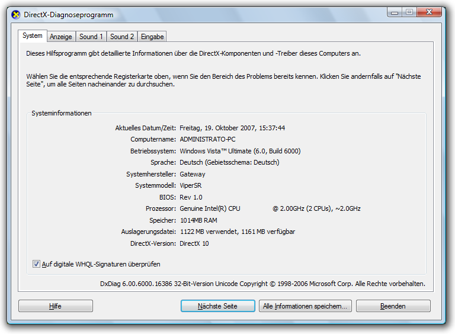

# Renderingebenen für Grafiken
Eine Renderingebene definiert eine Ebene der Grafikleistung eines Geräts, auf dem eine [!INCLUDE[TLA2#tla_winclient](../../../../includes/tla2sharptla-winclient-md.md)]-Anwendung ausgeführt wird.  

   
## Grafikhardware  
 Die Funktionen der Grafikhardware, die sich am stärksten auf die Renderingebenen auswirken, sind:  
  
- **Video-RAM**: Die Videospeichermenge der Grafikhardware bestimmt die Größe und Anzahl der Puffer, die für die Zusammensetzung von Grafiken verwendet werden kann.  
  
- **Pixel-Shader**: Ein Pixel-Shader ist eine Grafikprozessorfunktion, die Auswirkungen auf eine Pro-Pixel-Basis berechnet. Abhängig von der Auflösung der angezeigten Grafiken kann es mehrere Millionen Pixel geben, die für jeden Frame des Displays verarbeitet werden müssen.  
  
- **Vertex-Shader**: Ein Vertex-Shader ist eine Grafikprozessorfunktion, die mathematische Operationen für die Vertexdaten des Objekts ausführt.  
  
- **Multitexturunterstützung**: Bei Multitexturunterstützung handelt es sich um die Möglichkeit, zwei oder mehr unterschiedliche Texturen während eines Mischvorgangs für ein 3D-Grafikobjekt anzuwenden. Der Grad der Multitexturunterstützung wird durch die Anzahl der Multitextureinheiten in der Grafikhardware bestimmt.  
  
   
## Definitionen von Renderingebenen  
 Die Funktionen der Grafikhardware bestimmen die Renderingfunktion einer [!INCLUDE[TLA2#tla_winclient](../../../../includes/tla2sharptla-winclient-md.md)]-Anwendung. Das [!INCLUDE[TLA2#tla_winclient](../../../../includes/tla2sharptla-winclient-md.md)]-System definiert drei Renderingebenen:  
  
- **Renderingebene 0**: Keine Beschleunigung der Grafikhardware. Alle Grafikfunktionen verwenden Softwarebeschleunigung. Die DirectX-Versions Ebene ist kleiner als Version 9,0.  
  
- **Renderingebene 1**: Einige Grafikfunktionen verwenden die Beschleunigung der Grafikhardware. Die DirectX-Versions Ebene ist größer als oder gleich Version 9,0.  
  
- **Renderingebene 2**: Die meisten Grafikfunktionen verwenden die Beschleunigung der Grafikhardware. Die DirectX-Versions Ebene ist größer als oder gleich Version 9,0.  
  
 Die <xref:System.Windows.Media.RenderCapability.Tier%2A?displayProperty=nameWithType>-Eigenschaft ermöglicht es Ihnen, die Renderingebene zur Laufzeit der Anwendung abzurufen. Sie verwenden die Renderingebene für die Bestimmung, ob das Gerät bestimmte hardwarebeschleunigte Grafikfunktionen unterstützt. Ihre Anwendung kann dann unterschiedliche Codepfade zur Laufzeit verwenden, je nach der vom Gerät unterstützten Renderingebene.  
  
### Renderingebene 0  
 Der Wert 0 der Renderingebene bedeutet, dass keine Beschleunigung der Grafikhardware vorhanden ist, die für die Anwendung auf dem Gerät verfügbar ist. Auf dieser Ebene sollten Sie davon ausgehen, dass alle Grafiken von Software ohne Hardwarebeschleunigung gerendert werden. Die Funktionalität dieser Ebene entspricht einer DirectX-Version, die kleiner als 9,0 ist.  
  
### Renderingebene 1 und Renderingebene 2  
  
> [!NOTE]
> Ab dem .NET Framework 4 wurde die Renderingebene 1 neu definiert, sodass nur Grafikhardware enthalten ist, die DirectX 9,0 oder höher unterstützt. Grafikhardware, die DirectX 7 oder 8 unterstützt, ist nun als Renderingebene 0 definiert.  
  
 Renderingebene 1 oder 2 bedeutet, dass die meisten der Grafikfunktionen von [!INCLUDE[TLA2#tla_winclient](../../../../includes/tla2sharptla-winclient-md.md)] Hardwarebeschleunigung verwenden, wenn die erforderlichen Systemressourcen verfügbar sind und nicht ausgeschöpft wurden. Dies entspricht einer DirectX-Version, die größer oder gleich 9,0 ist.  
  
 Die folgende Tabelle zeigt die Unterschiede in den Anforderungen der Grafikhardware für die Renderingebene 1 und 2:  
  
|Feature|Ebene 1|Ebene 2|  
|-------------|------------|------------|  
|DirectX-Version|Muss größer als oder gleich 9.0 sein.|Muss größer als oder gleich 9.0 sein.|  
|Video-RAM|Muss größer als oder gleich 60 MB sein.|Muss größer als oder gleich 120 MB sein.|  
|Pixel-Shader|Die Versionsebene muss größer als oder gleich 2.0 sein.|Die Versionsebene muss größer als oder gleich 2.0 sein.|  
|Vertex-Shader|Keine Anforderung.|Die Versionsebene muss größer als oder gleich 2.0 sein.|  
|Multitextur-Einheiten|Keine Anforderung.|Die Anzahl der Einheiten muss größer als oder gleich 4 sein.|  
  
 Die folgenden Features und Funktionen sind für die Renderingebene 1 und 2 hardwarebeschleunigt:  
  
|Feature|Hinweise|  
|-------------|-----------|  
|2D-Rendering|Das meiste 2D-Rendering wird unterstützt.|  
|3D-Rasterung|Die meisten 3D-Rasterungen werden unterstützt.|  
|Anisotrope 3D-Filterung|[!INCLUDE[TLA2#tla_winclient](../../../../includes/tla2sharptla-winclient-md.md)] versucht beim Rendering von 3D-Inhalten anisotrope Filterung zu verwenden. Anisotrope Filterung bezieht sich auf die verbesserte Bildqualität von Texturen auf Oberflächen, die in Bezug auf die Kamera weit entfernt und stark angewinkelt sind.|  
|3D-MIP-Zuordnung|[!INCLUDE[TLA2#tla_winclient](../../../../includes/tla2sharptla-winclient-md.md)] versucht beim Rendering von 3D-Inhalten MIP-Zuordnung zu verwenden. Die MIP-Zuordnung verbessert die Qualität des Textur Rendering, wenn eine Textur ein kleineres Ansichts Feld in einem <xref:System.Windows.Controls.Viewport3D>einnimmt.|  
|Radiale Farbverläufe|Vermeiden Sie die Verwendung von <xref:System.Windows.Media.RadialGradientBrush> bei großen Objekten, während dies unterstützt wird.|  
|3D-Beleuchtungsberechnungen|[!INCLUDE[TLA2#tla_winclient](../../../../includes/tla2sharptla-winclient-md.md)] führt die Pro-Vertex-Beleuchtung aus, was bedeutet, dass eine Lichtstärke bei jedem Vertex für jedes auf ein Mesh angewendetes Material berechnet werden muss.|  
|Rendering von Text|Das Rendering der Subpixel-Schriftart verwendet verfügbare Pixel-Shader in der Grafikhardware.|  
  
 Die folgenden Features und Funktionen sind nur für die Renderingebene 2 hardwarebeschleunigt:  
  
|Feature|Hinweise|  
|-------------|-----------|  
|3D-Antialiasing|3D-Antialiasing wird nur unter Betriebssystemen unterstützt, die Windows Display Driver Model (WDDM) unterstützen, wie z. b. Windows Vista und Windows 7.|  
  
 Die folgenden Features und Funktionen sind **nicht** hardwarebeschleunigt:  
  
|Feature|Hinweise|  
|-------------|-----------|  
|Gedruckter Inhalt|Jeder gedruckte Inhalt wird mithilfe der [!INCLUDE[TLA2#tla_winclient](../../../../includes/tla2sharptla-winclient-md.md)]-Softwarepipeline gerendert.|  
|Rasterisierter Inhalt, der <xref:System.Windows.Media.Imaging.RenderTargetBitmap> verwendet|Alle Inhalte, die mit der <xref:System.Windows.Media.Imaging.RenderTargetBitmap.Render%2A>-Methode von <xref:System.Windows.Media.Imaging.RenderTargetBitmap>gerendert werden.|  
|Gekachelter Inhalt, der <xref:System.Windows.Media.TileBrush> verwendet|Alle gekachelten Inhalte, in denen die <xref:System.Windows.Media.TileBrush.TileMode%2A>-Eigenschaft des <xref:System.Windows.Media.TileBrush> auf <xref:System.Windows.Media.TileMode.Tile>festgelegt ist.|  
|Flächen, die die maximale Texturgröße der Grafikhardware überschreiten|Bei der meisten Grafikhardware sind große Flächen 2048 x 2048 oder 4096 x 4096 Pixel groß.|  
|Jeder Vorgang, dessen Video-RAM-Anforderung den Arbeitsspeicher der Grafikhardware überschreitet|Sie können den Video-RAM-Verbrauch der Anwendung mithilfe des Perforatortools überwachen, das Bestandteil der [WPF Performance Suite](https://docs.microsoft.com/previous-versions/dotnet/netframework-4.0/aa969767(v=vs.100)) im Windows SDK ist.|  
|Überlappende Fenster|Überlappende Fenster ermöglichen den [!INCLUDE[TLA2#tla_winclient](../../../../includes/tla2sharptla-winclient-md.md)]-Anwendungen das Rendering von Inhalt auf dem Bildschirm in einem nicht rechteckigen Fenster. Bei Betriebssystemen, die Windows Display Driver Model (WDDM) unterstützen, wie z. b. Windows Vista und Windows 7, sind mehrstufige Fenster Hardware beschleunigt. Auf anderen Systemen, wie z.B. [!INCLUDE[winxp](../../../../includes/winxp-md.md)], werden überlappende Fenster von Software ohne Hardwarebeschleunigung gerendert.   Sie können überlappende Fenster in [!INCLUDE[TLA2#tla_winclient](../../../../includes/tla2sharptla-winclient-md.md)] aktivieren, indem Sie die folgenden <xref:System.Windows.Window> Eigenschaften festlegen:   -   <xref:System.Windows.Window.WindowStyle%2A> = <xref:System.Windows.WindowStyle.None> -   <xref:System.Windows.Window.AllowsTransparency%2A> = `true` -   <xref:System.Windows.Controls.Control.Background%2A> = <xref:System.Windows.Media.Brushes.Transparent%2A>|  
  
   
## Weitere Ressourcen  
 Die folgenden Ressourcen können Ihnen bei der Analyse der Leistungsmerkmale Ihrer [!INCLUDE[TLA2#tla_winclient](../../../../includes/tla2sharptla-winclient-md.md)]-Anwendung helfen.  
  
### Registrierungseinstellungen für das Rendern von Grafiken  
 [!INCLUDE[TLA2#tla_winclient](../../../../includes/tla2sharptla-winclient-md.md)] bietet vier Registrierungseinstellungen zum Steuern des [!INCLUDE[TLA2#tla_winclient](../../../../includes/tla2sharptla-winclient-md.md)]-Rendering:  
  
|-Einstellung|Beschreibung|  
|-------------|-----------------|  
|**Option zum Deaktivieren der Hardwarebeschleunigung**|Gibt an, ob die Hardwarebeschleunigung aktiviert werden soll|  
|**Maximaler Wert für Multisampling**|Gibt den Grad des multisamplinggrad für das Antialiasing von 3D-Inhalten an.|  
|**Einstellung für das erforderliche Videotreiberdatum**|Gibt an, ob das System die Hardwarebeschleunigung für Treiber deaktiviert, die vor November 2004 veröffentlicht wurden|  
|**Option zum Verwenden des Referenzrasters**|Gibt an, ob [!INCLUDE[TLA2#tla_winclient](../../../../includes/tla2sharptla-winclient-md.md)] das Referenzraster verwendet werden soll|  
  
 Diese Einstellungen stehen für alle externen Konfigurationshilfsprogramme zur Verfügung, die auf die [!INCLUDE[TLA2#tla_winclient](../../../../includes/tla2sharptla-winclient-md.md)]-Registrierungseinstellungen verweisen können. Diese Einstellungen können auch erstellt oder geändert werden, indem Sie direkt über den Windows-Registrierungs-Editor auf die Werte zugreifen. Weitere Informationen finden Sie unter [Registrierungseinstellungen für das Rendern von Grafiken](../graphics-multimedia/graphics-rendering-registry-settings.md).  
  
### WPF-Leistungsprofilerstellungstools  
 [!INCLUDE[TLA2#tla_winclient](../../../../includes/tla2sharptla-winclient-md.md)] stellt eine Suite von Leistungsprofilerstellungstools bereit, mit deren Hilfe Sie das Laufzeitverhalten der Anwendung analysieren und die Typen der anwendbaren Leistungsoptimierungen bestimmen können. In der folgenden Tabelle sind die Leistungsprofil Erstellungs Tools aufgelistet, die im Windows SDK Tool WPF Performance Suite enthalten sind:  
  
|Tool|Beschreibung|  
|----------|-----------------|  
|Perforator|Wird für die Analyse von Renderingverhalten verwendet.|  
|Visual Profiler|Wird zum Erstellen eines Profils der Verwendung von [!INCLUDE[TLA2#tla_winclient](../../../../includes/tla2sharptla-winclient-md.md)]-Diensten durch Elemente in der visuellen Struktur verwendet, z.B. Layout- und Ereignisbehandlung.|  
  
 WPF Performance Suite bietet eine umfassende grafische Ansicht von Leistungsdaten. Weitere Informationen zu WPF-Leistungstools finden Sie unter [WPF Performance Suite](https://docs.microsoft.com/previous-versions/dotnet/netframework-4.0/aa969767(v=vs.100)).  
  
### DirectX-Diagnosetool  
 Das DirectX-Diagnose Tool dxdiag. exe ist so konzipiert, dass Sie bei der Behandlung von DirectX-bezogenen Problemen helfen können. Der Standard Installationsordner für das DirectX-Diagnose Tool lautet wie folgt:  
  
 `~\Windows\System32`  
  
 Wenn Sie das DirectX-Diagnose Tool ausführen, enthält das Hauptfenster eine Reihe von Registerkarten, mit denen Sie DirectX-bezogene Informationen anzeigen und diagnostizieren können. Beispielsweise werden auf der Registerkarte **System** Systeminformationen zu Ihrem Computer und die auf dem Computer installierte DirectX-Version angegeben.  
  
   
Hauptfenster des DirectX-Diagnosetools  
  
## Siehe auch

- <xref:System.Windows.Media.RenderCapability>
- <xref:System.Windows.Media.RenderOptions>
- [Optimieren der WPF-Anwendungsleistung](optimizing-wpf-application-performance.md)
- [WPF Performance Suite](https://docs.microsoft.com/previous-versions/dotnet/netframework-4.0/aa969767(v=vs.100))
- [Registrierungseinstellungen für das Rendern von Grafiken](../graphics-multimedia/graphics-rendering-registry-settings.md)
- [Tipps und Tricks zu Animationen](../graphics-multimedia/animation-tips-and-tricks.md)
