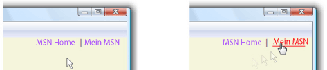

# Gewusst wie: Angeben, ob ein Hyperlink unterstrichen wird
Die <xref:System.Windows.Documents.Hyperlink> Objekt ist ein Inhaltselement Inlineebene, der Ihnen das Hosten von links im fortlaufenden Inhalt ermöglicht. Standardmäßig <xref:System.Windows.Documents.Hyperlink> verwendet ein <xref:System.Windows.TextDecoration> Objekt, das eine Unterstreichung anzuzeigen. <xref:System.Windows.TextDecoration> Objekte können ressourcenintensiv sein zu instanziieren, insbesondere, wenn Sie viele haben <xref:System.Windows.Documents.Hyperlink> Objekte. Wenn Sie eine umfangreiche nutzen <xref:System.Windows.Documents.Hyperlink> Elemente, Sie sollten in Betracht ziehen einen Unterstrich nur, wenn ein Ereignis auslösen, z. B. Anzeigen der <xref:System.Windows.ContentElement.MouseEnter> Ereignis.  
  
 Im folgenden Beispiel wird die Unterstreichung für den Link "My MSN" dynamische – es wird nur angezeigt, wenn die <xref:System.Windows.ContentElement.MouseEnter> Ereignis wird ausgelöst.  
  
   
Links mit TextDecorations definiert  
  
## Beispiel  
 Das folgende Markup-Beispiel zeigt eine <xref:System.Windows.Documents.Hyperlink> mit und ohne Unterstreichung definiert:  
  
 [!code-xaml[Performance#PerformanceSnippet11](../../../../samples/snippets/csharp/VS_Snippets_Wpf/Performance/CSharp/Hyperlink.xaml#performancesnippet11)]  
  
 Im folgenden Codebeispiel wird gezeigt, wie zum Erstellen einer Unterstreichung für die <xref:System.Windows.Documents.Hyperlink> auf die <xref:System.Windows.ContentElement.MouseEnter> Ereignis, und entfernen Sie es auf die <xref:System.Windows.ContentElement.MouseLeave> Ereignis.  
  
 [!code-csharp[Performance#PerformanceSnippet15](../../../../samples/snippets/csharp/VS_Snippets_Wpf/Performance/CSharp/Hyperlink.xaml.cs#performancesnippet15)]
 [!code-vb[Performance#PerformanceSnippet15](../../../../samples/snippets/visualbasic/VS_Snippets_Wpf/Performance/visualbasic/hyperlink.xaml.vb#performancesnippet15)]  
  
## Siehe auch  
 <xref:System.Windows.TextDecoration>  
 <xref:System.Windows.Documents.Hyperlink>  
 [Optimieren der WPF-Anwendungsleistung](../../../../docs/framework/wpf/advanced/optimizing-wpf-application-performance.md)  
 [Erstellen einer Textdekoration](../../../../docs/framework/wpf/advanced/how-to-create-a-text-decoration.md)
