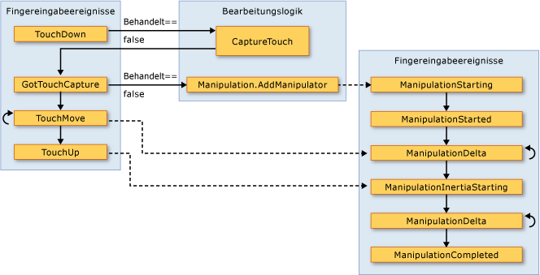

# Übersicht über die Eingabe
 Die [!INCLUDE[TLA#tla_winclient](../../../../includes/tlasharptla-winclient-md.md)] -Subsystem bietet eine leistungsstarke [!INCLUDE[TLA#tla_api](../../../../includes/tlasharptla-api-md.md)] zum Abrufen von Eingabe aus einer Vielzahl von Geräten, einschließlich der Maus, Tastatur, Touch- und Stift. In diesem Thema werden die Dienste beschrieben, die von [!INCLUDE[TLA2#tla_winclient](../../../../includes/tla2sharptla-winclient-md.md)] bereitgestellt werden sowie die Architektur des Eingabesystems.

## Eingabe-API
 Die primäre Eingabe-API--Darlegung finden Sie in den Basiselementklassen: <xref:System.Windows.UIElement>, <xref:System.Windows.ContentElement>, <xref:System.Windows.FrameworkElement>, und <xref:System.Windows.FrameworkContentElement>.  Weitere Informationen zu den Basiselementen finden Sie unter [Übersicht über Basiselemente](base-elements-overview.md).  Diese Klassen bieten Funktionen für Eingabeereignisse, die im Zusammenhang mit Tastatureingaben, Maustasten, dem Mausrad, der Bewegung der Maus, der Fokusverwaltung und Mauseingabe stehen, um nur einige zu nennen. Platzieren die Eingabe-API in den Basiselementen, anstatt alle Eingabeereignisse als einen Dienst zu behandeln, ermöglicht die Eingabearchitektur für die die Eingabeereignisse von einem bestimmten Objekt in der Benutzeroberfläche stammen und ein ereignisroutingschema unterstützen, bei dem mehr als ein Element ein Opp hat Ortunity, ein Eingabeereignis zu behandeln. Vielen Eingabeereignissen ist ein Paar von Ereignissen zugeordnet.  Z. B. das KeyDown-Ereignis zugeordnet ist die <xref:System.Windows.Input.Keyboard.KeyDown> und <xref:System.Windows.Input.Keyboard.PreviewKeyDown> Ereignisse.  Der Unterschied zwischen diesen Ereignissen ist, wie an das Zielelement weitergeleitet werden.  Vorschauereignisse tunneln die Elementstruktur vom Stammelement hinunter zum Zielelement.  Bubbling-Ereignisse übergeben vom Zielelement an das Stammelement.  Das Ereignisrouting in [!INCLUDE[TLA2#tla_winclient](../../../../includes/tla2sharptla-winclient-md.md)] wird ausführlicher unten in dieser Übersicht und unter der [Übersicht über Routingereignisse](routed-events-overview.md) behandelt.

### Tastatur- und Mausklassen
 Zusätzlich zu den Eingabe-API in den Basiselementklassen die <xref:System.Windows.Input.Keyboard> Klasse und <xref:System.Windows.Input.Mouse> Klassen bieten zusätzliche API zum Arbeiten mit Tastatur- und Mauseingaben.

 Beispiele für die Eingabe-API auf der <xref:System.Windows.Input.Keyboard> -Klasse sind der <xref:System.Windows.Input.Keyboard.Modifiers%2A> -Eigenschaft, die gibt die <xref:System.Windows.Input.ModifierKeys> gerade gedrückt wird, und die <xref:System.Windows.Input.Keyboard.IsKeyDown%2A> -Methode, die bestimmt, ob eine bestimmte Taste gedrückt wird.

 Im folgenden Beispiel wird die <xref:System.Windows.Input.Keyboard.GetKeyStates%2A> Methode, um zu bestimmen, ob eine <xref:System.Windows.Input.Key> befindet sich im Zustand "ausgefallen".

 [!code-csharp[keyargssnippetsample#KeyEventArgsKeyBoardGetKeyStates](~/samples/snippets/csharp/VS_Snippets_Wpf/KeyArgsSnippetSample/CSharp/Window1.xaml.cs#keyeventargskeyboardgetkeystates)]
 [!code-vb[keyargssnippetsample#KeyEventArgsKeyBoardGetKeyStates](~/samples/snippets/visualbasic/VS_Snippets_Wpf/KeyArgsSnippetSample/visualbasic/window1.xaml.vb#keyeventargskeyboardgetkeystates)]

 Beispiele für die Eingabe-API auf die <xref:System.Windows.Input.Mouse> -Klasse sind <xref:System.Windows.Input.Mouse.MiddleButton%2A>, die den Zustand der mittleren Maustaste abruft und <xref:System.Windows.Input.Mouse.DirectlyOver%2A>, derzeit ist die den Mauszeiger auf dem Element abruft, über.

 Im folgende Beispiel wird bestimmt, ob die <xref:System.Windows.Input.Mouse.LeftButton%2A> auf die Maus befindet sich in der <xref:System.Windows.Input.MouseButtonState.Pressed> Zustand.

 [!code-csharp[mouserelatedsnippets#MouseRelatedSnippetsGetLeftButtonMouse](~/samples/snippets/csharp/VS_Snippets_Wpf/MouseRelatedSnippets/CSharp/Window1.xaml.cs#mouserelatedsnippetsgetleftbuttonmouse)]
 [!code-vb[mouserelatedsnippets#MouseRelatedSnippetsGetLeftButtonMouse](~/samples/snippets/visualbasic/VS_Snippets_Wpf/MouseRelatedSnippets/visualbasic/window1.xaml.vb#mouserelatedsnippetsgetleftbuttonmouse)]

 Die <xref:System.Windows.Input.Mouse> und <xref:System.Windows.Input.Keyboard> Klassen werden im weiteren Verlauf dieser Übersicht behandelt.

### Stifteingabe
 [!INCLUDE[TLA2#tla_winclient](../../../../includes/tla2sharptla-winclient-md.md)] verfügt über integrierte Unterstützung für die <xref:System.Windows.Input.Stylus>.  Die <xref:System.Windows.Input.Stylus> ist eine Stifteingabe, durch die [!INCLUDE[TLA#tla_tpc](../../../../includes/tlasharptla-tpc-md.md)].  [!INCLUDE[TLA2#tla_winclient](../../../../includes/tla2sharptla-winclient-md.md)] Anwendungen können der Stift als Maus behandeln, mit der Maus-API, aber [!INCLUDE[TLA2#tla_winclient](../../../../includes/tla2sharptla-winclient-md.md)] macht auch eine Stift-Geräteabstraktion, die einem Modell ähnlich der Tastatur und Maus zu verwenden.  Alle dem Stift zugehörigen [!INCLUDE[TLA2#tla_api#plural](../../../../includes/tla2sharptla-apisharpplural-md.md)] enthalten den Begriff „Stylus“ (Stift oder Tablettstift).

 Da der Stift als Maus fungieren kann, können Anwendungen, die nur die Mauseingabe unterstützen, noch immer ein gewisses Maß an automatischer Unterstützung für den Stift erhalten. Wenn der Stift auf diese Weise verwendet wird, bekommt die Anwendung die Gelegenheit, das entsprechende Stiftereignis zu behandeln und behandelt dann das entsprechende Mausereignis. Darüber hinaus sind Dienste auf höherer Ebene (z.B. Freihandeingabe) noch immer über die Stift-Geräteabstraktion verfügbar.  Weitere Informationen zur Freihandeingabe finden Sie unter [Erste Schritte mit Freihandeingaben](getting-started-with-ink.md).

## Ereignisrouting
 Ein <xref:System.Windows.FrameworkElement> können andere Elemente als untergeordnete Elemente im Inhaltsmodell bilden eine Struktur von Elementen enthalten.  Durch die Übergabe von Ereignissen kann das übergeordnete Element in [!INCLUDE[TLA2#tla_winclient](../../../../includes/tla2sharptla-winclient-md.md)] in der Eingabe teilnehmen, die an dessen untergeordnetes Element oder andere indirekt untergeordnete Elemente weitergeleitet wird. Dies ist besonders nützlich, um Steuerelemente aus kleineren Steuerelementen zu erstellen. Dieser Prozess wird als „Zusammensetzung von Steuerelementen“ oder „Zusammensetzen“ bezeichnet. Weitere Informationen über Elementstrukturen und wie sich Elementstrukturen auf Ereignisrouten beziehen, finden Sie unter [Strukturen in WPF](trees-in-wpf.md).

 Das Ereignisrouting ist der Prozess, in dem Ereignisse an mehrere Elemente weitergeleitet werden, sodass ein bestimmtes Objekt oder Element entlang der Route einem Ereignis eine signifikante Antwort (durch Behandlung) anbieten kann, die sonst von einem anderen Element hätte stammen können.  Routingereignisse verwenden einen von drei Routingmechanismen: direkt, Bubbling und Tunneln.  Beim direkten Routing ist das Quellelement das einzige benachrichtigte Element, und das Ereignis wird nicht an andere Elemente weitergeleitet. Das direkte Routingereignis bietet jedoch noch einige zusätzliche Funktionen, die im Gegensatz zu [!INCLUDE[TLA2#tla_clr](../../../../includes/tla2sharptla-clr-md.md)]-Standardereignissen nur für Routingereignisse vorhanden sind. Bubbling arbeitet sich in der Elementstruktur nach oben, indem zuerst das Element benachrichtigt wird, von dem das Ereignis stammt, und anschließend das übergeordnete Element usw.  Tunneling beginnt am Stamm der Elementstruktur, arbeitet sich nach unten und endet mit dem ursprünglichen Quellelement.  Weitere Informationen zu Routingereignissen finden Sie unter [Übersicht über Routingereignisse](routed-events-overview.md).

 [!INCLUDE[TLA2#tla_winclient](../../../../includes/tla2sharptla-winclient-md.md)]-Eingabeereignisse treten generell in Paaren auf, die aus einem Tunneling-Ereignis und einem Bubbling-Ereignis bestehen.  Tunneling-Ereignisse unterscheiden sich von Bubbling-Ereignissen im Präfix „Preview“.  Z. B. <xref:System.Windows.Input.Mouse.PreviewMouseMove> ist die Tunneling-Version ein MouseMove-Ereignis und <xref:System.Windows.Input.Mouse.MouseMove> ist die bubbling-Version dieses Ereignisses. Diese Ereignispaarung ist eine Konvention, die auf der Elementebene implementiert ist, und keine inhärente Funktion des [!INCLUDE[TLA2#tla_winclient](../../../../includes/tla2sharptla-winclient-md.md)]-Ereignissystems, Weitere Informationen finden Sie im Abschnitt „Eingabeereignisse in WPF“ in [Übersicht über Routingereignisse](routed-events-overview.md).

## Behandeln von Eingabeereignissen
 Um Eingaben für ein Element zu erhalten, muss ein Ereignishandler mit diesem speziellen Ereignis verknüpft sein.  In [!INCLUDE[TLA2#tla_xaml](../../../../includes/tla2sharptla-xaml-md.md)] ist dies einfach: Sie verweisen auf den Namen des Ereignisses als ein Attribut des Elements, das für dieses Ereignis überwacht.  Legen Sie anschließend den Wert des Attributs auf den Namen des Ereignishandlers, den Sie basierend auf einen Delegaten definieren, fest.  Der Ereignishandler muss im Code, wie z. B. c# geschrieben werden und kann in einer Code-Behind-Datei eingeschlossen werden.

 Tastaturereignisse treten auf, wenn das Betriebssystem Tastaturaktionen meldet, die auftreten, während sich der Tastaturfokus auf einem Element befindet. Maus- und Stiftereignisse lassen sich in zwei Kategorien unterteilen: Ereignisse, die Änderungen der Zeigerposition relativ zum Element melden sowie Ereignisse, die Änderungen im Status der Geräteschaltflächen melden.

### Beispiel eines Tastatureingabeereignisses
 Das folgende Beispiel überwacht das Drücken der Nach-Links-Taste.  Ein <xref:System.Windows.Controls.StackPanel> wird erstellt, verfügt über eine <xref:System.Windows.Controls.Button>.  Ein Ereignishandler eine Überwachung auf das Drücken der nach-links-Taste angefügt ist die <xref:System.Windows.Controls.Button> Instanz.

 Im ersten Abschnitt des Beispiels erstellt die <xref:System.Windows.Controls.StackPanel> und <xref:System.Windows.Controls.Button> und fügt den Ereignishandler für die <xref:System.Windows.UIElement.KeyDown>.

 [!code-xaml[InputOvw#Input_OvwKeyboardExampleXAML](~/samples/snippets/csharp/VS_Snippets_Wpf/InputOvw/CSharp/Page1.xaml#input_ovwkeyboardexamplexaml)]

 [!code-csharp[InputOvw#Input_OvwKeyboardExampleUICodeBehind](~/samples/snippets/csharp/VS_Snippets_Wpf/InputOvw/CSharp/Page1.xaml.cs#input_ovwkeyboardexampleuicodebehind)]
 [!code-vb[InputOvw#Input_OvwKeyboardExampleUICodeBehind](~/samples/snippets/visualbasic/VS_Snippets_Wpf/InputOvw/VisualBasic/Page1.xaml.vb#input_ovwkeyboardexampleuicodebehind)]

 Der zweite Abschnitt ist in Code geschrieben und definiert den Ereignishandler.  Wenn die-links-Taste gedrückt wird und die <xref:System.Windows.Controls.Button> Tastaturfokus hat, der Handler ausgeführt und die <xref:System.Windows.Controls.Control.Background%2A> Farbe der <xref:System.Windows.Controls.Button> geändert wird.  Wenn die Taste gedrückt wird, aber es nicht die-links-Taste ist, die <xref:System.Windows.Controls.Control.Background%2A> Farbe der <xref:System.Windows.Controls.Button> zurück zur ursprünglichen Farbe geändert wird.

 [!code-csharp[InputOvw#Input_OvwKeyboardExampleHandlerCodeBehind](~/samples/snippets/csharp/VS_Snippets_Wpf/InputOvw/CSharp/Page1.xaml.cs#input_ovwkeyboardexamplehandlercodebehind)]
 [!code-vb[InputOvw#Input_OvwKeyboardExampleHandlerCodeBehind](~/samples/snippets/visualbasic/VS_Snippets_Wpf/InputOvw/VisualBasic/Page1.xaml.vb#input_ovwkeyboardexamplehandlercodebehind)]

### Beispiel für Mauseingabeereignisse
 Im folgenden Beispiel die <xref:System.Windows.Controls.Control.Background%2A> Farbe des eine <xref:System.Windows.Controls.Button> geändert wird, wenn der Mauszeiger wechselt die <xref:System.Windows.Controls.Button>.  Die <xref:System.Windows.Controls.Control.Background%2A> -Farbe wird wiederhergestellt, wenn der Mauszeiger die <xref:System.Windows.Controls.Button>.

 Im ersten Abschnitt des Beispiels erstellt die <xref:System.Windows.Controls.StackPanel> und <xref:System.Windows.Controls.Button> steuern und fügt die Ereignishandler für die <xref:System.Windows.UIElement.MouseEnter> und <xref:System.Windows.UIElement.MouseLeave> Ereignisse an die <xref:System.Windows.Controls.Button>.

 [!code-xaml[InputOvw#Input_OvwMouseExampleXAML](~/samples/snippets/csharp/VS_Snippets_Wpf/InputOvw/CSharp/Page1.xaml#input_ovwmouseexamplexaml)]

 [!code-csharp[InputOvw#Input_OvwMouseExampleUICodeBehind](~/samples/snippets/csharp/VS_Snippets_Wpf/InputOvw/CSharp/Page1.xaml.cs#input_ovwmouseexampleuicodebehind)]
 [!code-vb[InputOvw#Input_OvwMouseExampleUICodeBehind](~/samples/snippets/visualbasic/VS_Snippets_Wpf/InputOvw/VisualBasic/Page1.xaml.vb#input_ovwmouseexampleuicodebehind)]

 Der zweite Abschnitt des Beispiels wird in Code geschrieben und definiert die Ereignishandler.  Wenn die Maus bewegt wird die <xref:System.Windows.Controls.Button>, <xref:System.Windows.Controls.Control.Background%2A> Farbe der <xref:System.Windows.Controls.Button> geändert wird, um <xref:System.Windows.Media.Brushes.SlateGray%2A>.  Wenn der Mauszeiger fortbewegt der <xref:System.Windows.Controls.Button>, <xref:System.Windows.Controls.Control.Background%2A> Farbe der <xref:System.Windows.Controls.Button> geändert wird, an <xref:System.Windows.Media.Brushes.AliceBlue%2A>.

 [!code-csharp[InputOvw#Input_OvwMouseExampleEneterHandler](~/samples/snippets/csharp/VS_Snippets_Wpf/InputOvw/CSharp/Page1.xaml.cs#input_ovwmouseexampleeneterhandler)]
 [!code-vb[InputOvw#Input_OvwMouseExampleEneterHandler](~/samples/snippets/visualbasic/VS_Snippets_Wpf/InputOvw/VisualBasic/Page1.xaml.vb#input_ovwmouseexampleeneterhandler)]

 [!code-csharp[InputOvw#Input_OvwMouseExampleLeaveHandler](~/samples/snippets/csharp/VS_Snippets_Wpf/InputOvw/CSharp/Page1.xaml.cs#input_ovwmouseexampleleavehandler)]
 [!code-vb[InputOvw#Input_OvwMouseExampleLeaveHandler](~/samples/snippets/visualbasic/VS_Snippets_Wpf/InputOvw/VisualBasic/Page1.xaml.vb#input_ovwmouseexampleleavehandler)]

## Texteingabe
 Die <xref:System.Windows.ContentElement.TextInput> Ereignis können Sie für die Texteingabe in einem geräteunabhängig überwachen. Die Tastatur dient primär der Texteingabe, jedoch können Sie auch durch die Sprache, handschriftlich oder mit anderen Eingabegeräten Texteingabe generieren.

 Für die Tastatureingabe [!INCLUDE[TLA2#tla_winclient](../../../../includes/tla2sharptla-winclient-md.md)] zuerst sendet die entsprechende <xref:System.Windows.ContentElement.KeyDown> / <xref:System.Windows.ContentElement.KeyUp> Ereignisse. Wenn diese Ereignisse nicht verarbeitet werden und der Schlüssel Text statt (Steuerungstaste, z.B. Richtungspfeile) oder Funktionstasten wird ein <xref:System.Windows.ContentElement.TextInput> Ereignis wird ausgelöst.  Es ist nicht immer eine einfache 1: 1-Zuordnung zwischen <xref:System.Windows.ContentElement.KeyDown> / <xref:System.Windows.ContentElement.KeyUp> und <xref:System.Windows.ContentElement.TextInput> Ereignisse da mehrere Tastatureingaben ein einzelnes Zeichen von Texteingabe generieren können, und einzelne Tastatureingaben können mit mehreren Zeichen generieren Zeichenfolgen.  Dies gilt insbesondere für Sprachen wie Chinesisch, Japanisch und Koreanisch die [!INCLUDE[TLA#tla_ime#plural](../../../../includes/tlasharptla-imesharpplural-md.md)] zum Generieren von Tausenden von möglichen Zeichen in ihrem jeweiligen Alphabet verwenden.

 Wenn [!INCLUDE[TLA2#tla_winclient](../../../../includes/tla2sharptla-winclient-md.md)] sendet eine <xref:System.Windows.ContentElement.KeyUp> / <xref:System.Windows.ContentElement.KeyDown> Ereignis <xref:System.Windows.Input.KeyEventArgs.Key%2A> nastaven NA hodnotu <xref:System.Windows.Input.Key.System?displayProperty=nameWithType> , wenn die Tastatureingaben Teil zugegriffen werden können eine <xref:System.Windows.ContentElement.TextInput> Ereignisses (Wenn z. B. ALT + S gedrückt wird). Dies ermöglicht es Code in eine <xref:System.Windows.ContentElement.KeyDown> -Ereignishandler zu suchende <xref:System.Windows.Input.Key.System?displayProperty=nameWithType> und, falls gefunden, überlassen Sie die Verarbeitung dem Handler des anschließend ausgelösten <xref:System.Windows.ContentElement.TextInput> Ereignis. In diesen Fällen die verschiedenen Eigenschaften der <xref:System.Windows.Input.TextCompositionEventArgs> Argument kann verwendet werden, um die ursprüngliche Tastatureingabe zu bestimmen. Auf ähnliche Weise, wenn ein [!INCLUDE[TLA2#tla_ime](../../../../includes/tla2sharptla-ime-md.md)] aktiv ist, <xref:System.Windows.Input.Key> hat den Wert des <xref:System.Windows.Input.Key.ImeProcessed?displayProperty=nameWithType>, und <xref:System.Windows.Input.KeyEventArgs.ImeProcessedKey%2A> bietet die usprüngliche.

 Das folgende Beispiel definiert einen Handler für die <xref:System.Windows.Controls.Primitives.ButtonBase.Click> Ereignis und einen Handler für die <xref:System.Windows.UIElement.KeyDown> Ereignis.

 Das erste Segment des Codes oder Markups erstellt die Benutzeroberfläche.

 [!code-xaml[InputOvw#Input_OvwTextInputXAML](~/samples/snippets/csharp/VS_Snippets_Wpf/InputOvw/CSharp/Page1.xaml#input_ovwtextinputxaml)]

 [!code-csharp[InputOvw#Input_OvwTextInputUICodeBehind](~/samples/snippets/csharp/VS_Snippets_Wpf/InputOvw/CSharp/Page1.xaml.cs#input_ovwtextinputuicodebehind)]
 [!code-vb[InputOvw#Input_OvwTextInputUICodeBehind](~/samples/snippets/visualbasic/VS_Snippets_Wpf/InputOvw/VisualBasic/Page1.xaml.vb#input_ovwtextinputuicodebehind)]

 Das zweite Segment des Codes enthält die Ereignishandler.

 [!code-csharp[InputOvw#Input_OvwTextInputHandlersCodeBehind](~/samples/snippets/csharp/VS_Snippets_Wpf/InputOvw/CSharp/Page1.xaml.cs#input_ovwtextinputhandlerscodebehind)]
 [!code-vb[InputOvw#Input_OvwTextInputHandlersCodeBehind](~/samples/snippets/visualbasic/VS_Snippets_Wpf/InputOvw/VisualBasic/Page1.xaml.vb#input_ovwtextinputhandlerscodebehind)]

 Da Eingabeereignisse die Ereignisroute übergeben die <xref:System.Windows.Controls.StackPanel> empfängt die Eingabe, egal welches Element den Tastaturfokus besitzt. Die <xref:System.Windows.Controls.TextBox> Steuerelement wird zuerst benachrichtigt, und die `OnTextInputKeyDown` Handler wird aufgerufen, wenn nur die <xref:System.Windows.Controls.TextBox> hat nicht die Eingabe verarbeitet. Wenn die <xref:System.Windows.UIElement.PreviewKeyDown> Ereignis wird verwendet, statt die <xref:System.Windows.UIElement.KeyDown> -Ereignis, das `OnTextInputKeyDown` Handler zuerst aufgerufen.

 In diesem Beispiel wird die Behandlungslogik zweimal geschrieben: einmal für STRG+O und nochmal für das Click-Ereignis der Schaltfläche. Anstatt die Eingabeereignisse direkt zu behandeln, können Sie dies mithilfe von Befehlen vereinfachen.  Befehle werden in dieser Übersicht unter [Befehlsübersicht](commanding-overview.md) erläutert.

## Fingereingabe (Touch) und-Bearbeitung
 Neue Hardware und API im Windows 7-Betriebssystem bieten Anwendungen die Möglichkeit, Eingabe von mehreren Berührungen gleichzeitig zu erhalten. [!INCLUDE[TLA2#tla_winclient](../../../../includes/tla2sharptla-winclient-md.md)] ermöglicht Anwendungen, Fingereingabe zu erkennen und ähnlich wie auf andere Eingabe zu reagieren, z.B. von einer Maus oder einer Tastatur, durch Auslösen von Ereignissen, wenn eine Fingereingabe erfolgt.

 [!INCLUDE[TLA2#tla_winclient](../../../../includes/tla2sharptla-winclient-md.md)] macht zwei Typen von Ereignissen verfügbar, wenn eine Fingereingabe erfolgt: Berührungsereignisse und Bearbeitungsereignisse. Berührungsereignisse stellen Rohdaten zu jedem Finger auf einem Touchscreen und seiner Bewegung bereit. Bearbeitungsereignisse interpretieren die Eingabe als bestimmte Aktionen. Beide Typen von Ereignissen werden in diesem Abschnitt erläutert.

### Vorraussetzungen
 Sie benötigen die folgenden Komponenten zur Entwicklung einer Anwendung, die auf Fingereingabe reagiert.

- Visual Studio 2010.

- Windows 7

- Ein Gerät, z.B. ein Touchscreen, das Windows Touch unterstützt

### Terminologie
 Die folgenden Begriffe werden verwendet, wenn die Fingereingabe behandelt wird.

- **Touch (Fingereingabe)** ist ein Typ von Benutzereingabe, der von Windows 7 erkannt wird. In der Regel wird die Fingereingabe initiiert, indem ein berührungsempfindlicher Bildschirm mit Fingern berührt wird. Beachten Sie, dass Geräte wie Touchpads, die auf Laptops gang und gäbe sind, keine Fingereingabe unterstützen, wenn das Gerät lediglich die Position und die Bewegung des Fingers als Mauseingabe konvertiert.

- **Multitouch (Mehrfingereingabe)** ist Berührung, die gleichzeitig von mehreren Punkten erfolgt. Windows 7 und [!INCLUDE[TLA2#tla_winclient](../../../../includes/tla2sharptla-winclient-md.md)] unterstützen die Mehrfingereingabe. Wann immer die Fingereingabe in der Dokumentation für [!INCLUDE[TLA2#tla_winclient](../../../../includes/tla2sharptla-winclient-md.md)] erläutert wird, gelten die Konzepte auch für die Mehrfingereingabe.

- Ein **Manipulation** tritt auf, wenn die Berührung als physische Aktion interpretiert wird, die auf ein Objekt angewendet wird. In [!INCLUDE[TLA2#tla_winclient](../../../../includes/tla2sharptla-winclient-md.md)] interpretieren Bearbeitungsereignisse die Eingabe als Übersetzungs-, Erweiterungs- und Drehungsmanipualtion.

- Ein `touch device` stellt ein Gerät dar, das Fingereingabe erzeugt, z.B. ein einzelner Finger auf einem Touchscreen.

### Steuerelemente, die auf Fingereingabe reagieren
 Die folgenden Steuerelemente können gescrollt werden, wenn Sie über Inhalt verfügen, der sich außerhalb der Ansicht befindet, indem Sie mit einem Finger über die Steuerelemente wischen.

- <xref:System.Windows.Controls.ComboBox>

- <xref:System.Windows.Controls.ContextMenu>

- <xref:System.Windows.Controls.DataGrid>

- <xref:System.Windows.Controls.ListBox>

- <xref:System.Windows.Controls.ListView>

- <xref:System.Windows.Controls.MenuItem>

- <xref:System.Windows.Controls.TextBox>

- <xref:System.Windows.Controls.ToolBar>

- <xref:System.Windows.Controls.TreeView>

 Die <xref:System.Windows.Controls.ScrollViewer> definiert die <xref:System.Windows.Controls.ScrollViewer.PanningMode%2A?displayProperty=nameWithType> angefügten Eigenschaft, die es Ihnen die ermöglicht Angabe, ob Touch Schwenken aktiviert ist horizontal, vertikal, beides oder keines von beiden. Die <xref:System.Windows.Controls.ScrollViewer.PanningDeceleration%2A?displayProperty=nameWithType> Eigenschaft gibt an, wie schnell der Bildlauf langsamer wird, wenn der Benutzer den Finger von Touchscreen abhebt. Die <xref:System.Windows.Controls.ScrollViewer.PanningRatio%2A?displayProperty=nameWithType> angefügte Eigenschaft gibt das Verhältnis des Bildlauf-Offsets zum Übersetzen des Manipulations-Offset.

### Berührungsereignisse
 Basisklassen <xref:System.Windows.UIElement>, <xref:System.Windows.UIElement3D>, und <xref:System.Windows.ContentElement>, definieren Ereignisse, die Sie abonnieren können, damit Ihre Anwendung auf Fingereingabe reagiert. Berührungsereignisse sind nützlich, wenn Ihre Anwendung Fingereingabe als etwas anderes als die Bearbeitung eines Objekts interpretiert. Beispielsweise würde eine Anwendung, mit der ein Benutzer mit einem oder mehreren Fingern zeichnen kann, Berührungsereignisse abonnieren.

 Alle drei Klassen definieren die folgenden Ereignisse, die sich ähnlich verhalten, unabhängig von der definierenden Klasse.

- <xref:System.Windows.UIElement.TouchDown>

- <xref:System.Windows.UIElement.TouchMove>

- <xref:System.Windows.UIElement.TouchUp>

- <xref:System.Windows.UIElement.TouchEnter>

- <xref:System.Windows.UIElement.TouchLeave>

- <xref:System.Windows.UIElement.PreviewTouchDown>

- <xref:System.Windows.UIElement.PreviewTouchMove>

- <xref:System.Windows.UIElement.PreviewTouchUp>

- <xref:System.Windows.UIElement.GotTouchCapture>

- <xref:System.Windows.UIElement.LostTouchCapture>

 Wie die Tastatur- und Maus-Ereignisse sind die Berührungsereignisse Routingereignisse. Die Ereignisse, die mit `Preview` beginnen, sind Tunneling-Ereignisse, und die Ereignisse, die mit `Touch` beginnen, sind Bubbling-Ereignisse. Weitere Informationen zu Routingereignissen finden Sie unter [Übersicht über Routingereignisse](routed-events-overview.md). Wenn Sie diese Ereignisse behandeln, können Sie die Position der Eingabe relativ zu der jedes Element erhalten, durch den Aufruf der <xref:System.Windows.Input.TouchEventArgs.GetTouchPoint%2A> oder <xref:System.Windows.Input.TouchEventArgs.GetIntermediateTouchPoints%2A> Methode.

 Um die Interaktion zwischen Berührungsereignissen zu verstehen, denken Sie an das Szenario, bei dem ein Benutzer einen Finger auf ein Element legt, den Finger im Element bewegt und anschließend den Finger vom Element wegnimmt. Die folgende Abbildung zeigt die Ausführung der Bubbling-Ereignisse (die Tunneling-Ereignisse werden der Einfachheit halber ausgelassen).

  Touch-Ereignisse

 Die folgende Liste beschreibt die Abfolge der Ereignisse in der vorherigen Abbildung.

1. Die <xref:System.Windows.UIElement.TouchEnter> -Ereignis tritt einmal, wenn der Benutzer einen Finger auf das Element legt.

2. Die <xref:System.Windows.UIElement.TouchDown> -Ereignis tritt einmal.

3. Die <xref:System.Windows.UIElement.TouchMove> -Ereignis tritt mehrmals auf, wenn der Benutzer den Finger im Element bewegt.

4. Die <xref:System.Windows.UIElement.TouchUp> -Ereignis tritt einmal, wenn der Benutzer den Finger vom Element hebt.

5. Die <xref:System.Windows.UIElement.TouchLeave> -Ereignis tritt einmal.

 Wenn mehr als zwei Finger verwendet werden, treten die Ereignisse für jeden Finger auf.

### Bearbeitungsereignisse
 Für Fälle, die einer Anwendung, in denen einen Benutzer zum Bearbeiten eines Objekts ermöglicht, das <xref:System.Windows.UIElement> Klasse definiert die Bearbeitungsereignisse. Im Gegensatz zu den Berührungsereignissen, die einfach die Position der Berührung melden, melden die Bearbeitungsereignisse, wie die Eingabe interpretiert werden kann. Es gibt drei Arten von Manipulationen, Übersetzung, Erweiterung und Drehung. Die folgende Liste beschreibt, wie die drei Typen von Manipulationen aufgerufen werden.

- Legen Sie einen Finger auf ein Objekt, und verschieben Sie den Finger über den Touchscreen, um eine Übersetzungsmanipulation aufzurufen. Dadurch wird in der Regel das Objekt verschoben.

- Legen Sie zwei Finger auf ein Objekt, und bewegen Sie die Finger näher zusammen oder weiter auseinander, um eine Erweiterungsmanipulation aufzurufen. Dadurch wird in der Regel die Größe des Objekts geändert.

- Legen Sie zwei Finger auf ein Objekt, und drehen Sie einen Finger um den jeweils anderen um eine Drehungsmanipulation aufzurufen. Dadurch wird in der Regel das Objekt gedreht.

 Es kann mehr als eine Manipulation gleichzeitig geschehen.

 Wenn Sie Objekte dazu bringen, auf Manipulationen anzusprechen, können Sie erreichen, dass das Objekt verzögert wird. Dadurch kann Ihr Objekt die physische Welt simulieren. Wenn Sie z.B. ein Buch über einen Tisch schieben, dann bewegt sich das Buch nach dem Loslassen weiter voran, wenn Sie nur kräftig genug anschieben. Mit [!INCLUDE[TLA2#tla_winclient](../../../../includes/tla2sharptla-winclient-md.md)] können Sie dieses Verhalten übernehmen, indem Sie Bearbeitungsereignisse auslösen,nachdem der Benutzer das Objekt losgelassen hat.

 Weitere Informationen zum Erstellen einer Anwendung, die den Benutzer verschieben, skalieren und Drehen eines Objekts ermöglicht, finden Sie unter [Exemplarische Vorgehensweise: Erstellen der ersten Fingereingabeanwendung](walkthrough-creating-your-first-touch-application.md).

 Die <xref:System.Windows.UIElement> definiert folgende Bearbeitungsereignisse.

- <xref:System.Windows.UIElement.ManipulationStarting>

- <xref:System.Windows.UIElement.ManipulationStarted>

- <xref:System.Windows.UIElement.ManipulationDelta>

- <xref:System.Windows.UIElement.ManipulationInertiaStarting>

- <xref:System.Windows.UIElement.ManipulationCompleted>

- <xref:System.Windows.UIElement.ManipulationBoundaryFeedback>

 Standardmäßig eine <xref:System.Windows.UIElement> erhält keine diese Bearbeitungsereignisse. Um Bearbeitungsereignisse auf eine <xref:System.Windows.UIElement>legen <xref:System.Windows.UIElement.IsManipulationEnabled%2A?displayProperty=nameWithType> zu `true`.

#### Der Ausführungspfad von Bearbeitungsereignissen
 Denken Sie an ein Szenario, in dem ein Benutzer ein Objekt „wirft“. Der Benutzer legt einen Finger auf das Objekt, bewegt den Finger etwas über den Touchscreen und hebt dann in der Bewegung den Finger. Dadurch bewegt sich das Objekt unter dem Finger des Benutzers und bewegt sich dann noch weiter, wenn der Benutzer den Finger hebt.

 Die folgende Abbildung zeigt den Ausführungspfad von Bearbeitungsereignissen und wichtige Informationen zu jedem Ereignis.

  Manipulation-Ereignisse

 Die folgende Liste beschreibt die Abfolge der Ereignisse in der vorherigen Abbildung.

1. Die <xref:System.Windows.UIElement.ManipulationStarting> Ereignis tritt auf, wenn der Benutzer einen Finger auf das Objekt platziert. Unter anderem mit diesem Ereignis können Sie festlegen, die <xref:System.Windows.Input.ManipulationStartingEventArgs.ManipulationContainer%2A> Eigenschaft. In den nachfolgenden Ereignissen wird die Position der Manipulation relativ zu den <xref:System.Windows.Input.ManipulationStartingEventArgs.ManipulationContainer%2A>. In anderen Ereignissen als <xref:System.Windows.UIElement.ManipulationStarting>, diese Eigenschaft ist schreibgeschützt, sodass die <xref:System.Windows.UIElement.ManipulationStarting> Ereignis ist das einzige Mal, die Sie diese Eigenschaft festlegen können.

2. Die <xref:System.Windows.UIElement.ManipulationStarted> -Ereignis geschieht als Nächstes. Dieses Ereignis meldet den Ursprung der Manipulation.

3. Die <xref:System.Windows.UIElement.ManipulationDelta> -Ereignis tritt mehrmals als über den Touchscreen des Benutzers Finger bewegt. Die <xref:System.Windows.Input.ManipulationDeltaEventArgs.DeltaManipulation%2A> Eigenschaft der <xref:System.Windows.Input.ManipulationDeltaEventArgs> -Klasse meldet, ob die Manipulation als Bewegung, Erweiterung oder Verschiebung interpretiert wird. Hier können Sie die meisten Bearbeitungen an einem Objekt durchführen.

4. Die <xref:System.Windows.UIElement.ManipulationInertiaStarting> Ereignis tritt auf, wenn die Finger des Benutzers Kontakt mit dem Objekt verlieren. Mit diesem Ereignis können Sie die Verlangsamung der Bearbeitungen während der Verzögerung angeben. So kann Ihr Objekt unterschiedliche physikalische Bereiche oder Attribute Ihrer Wahl emulieren. Nehmen wir beispielsweise an, Ihre Anwendung enthält zwei Objekte, die Elemente in der realen Welt darstellen, und eines massiger als das andere ist. Sie können veranlassen, dass das massige Objekt schneller verlangsamt wird als das leichtere Objekt

5. Die <xref:System.Windows.UIElement.ManipulationDelta> -Ereignis tritt mehrmals auf, wenn die Verzögerung auftritt. Beachten Sie, dass dieses Ereignis auftritt, wenn der Benutzer seine Finger über den Touchscreen bewegt, und wenn [!INCLUDE[TLA2#tla_winclient](../../../../includes/tla2sharptla-winclient-md.md)] Verzögerung simuliert. Das heißt, <xref:System.Windows.UIElement.ManipulationDelta> tritt vor und nach der <xref:System.Windows.UIElement.ManipulationInertiaStarting> Ereignis. Die <xref:System.Windows.Input.ManipulationDeltaEventArgs.IsInertial%2A?displayProperty=nameWithType> Eigenschaftsberichten, ob die <xref:System.Windows.UIElement.ManipulationDelta> Ereignis tritt auf, während der Trägheit, damit Sie diese Eigenschaft überprüfen und unterschiedliche Aktionen je nach Wert durchführen können.

6. Die <xref:System.Windows.UIElement.ManipulationCompleted> Ereignis tritt auf, wenn die Bearbeitung und die Verzögerung beendet. Das heißt, nachdem alle die <xref:System.Windows.UIElement.ManipulationDelta> Ereignisse auftreten, die <xref:System.Windows.UIElement.ManipulationCompleted> Ereignis tritt auf, um zu signalisieren, dass die Bearbeitung abgeschlossen ist.

 Die <xref:System.Windows.UIElement> definiert auch die <xref:System.Windows.UIElement.ManipulationBoundaryFeedback> Ereignis. Dieses Ereignis tritt auf, wenn die <xref:System.Windows.Input.ManipulationDeltaEventArgs.ReportBoundaryFeedback%2A> Methode wird aufgerufen, der <xref:System.Windows.UIElement.ManipulationDelta> Ereignis. Die <xref:System.Windows.UIElement.ManipulationBoundaryFeedback> -Ereignis ermöglicht Anwendungen oder Komponenten von visuellem Feedback, wenn ein Objekt auf eine Begrenzung trifft. Z. B. die <xref:System.Windows.Window> -Klasse behandelt die <xref:System.Windows.UIElement.ManipulationBoundaryFeedback> Ereignis, um das Fenster leicht verschoben wird, wenn dessen Rand erkannt wird.

 Sie können die Bearbeitung abbrechen, durch den Aufruf der <xref:System.Windows.Input.ManipulationStartingEventArgs.Cancel%2A> Methode auf den Ereignisargumenten in jedem Bearbeitungsereignis außer <xref:System.Windows.UIElement.ManipulationBoundaryFeedback> Ereignis. Beim Aufruf <xref:System.Windows.Input.ManipulationStartingEventArgs.Cancel%2A>, die Bearbeitungsereignisse nicht länger ausgelöst und Mausereignisse treten für Touch. Die folgende Tabelle beschreibt die Beziehung zwischen dem Zeitpunkt, an dem die Bearbeitung abgebrochen wird, und den Mausereignissen, die auftreten.

|Das Ereignis zum Abbruch, das aufgerufen wird|Die Mausereignisse, die für die Eingabe auftreten, die bereits aufgetreten sind|
|----------------------------------------|-----------------------------------------------------------------|
|<xref:System.Windows.UIElement.ManipulationStarting> und <xref:System.Windows.UIElement.ManipulationStarted>|Ereignisse mit gedrückter Maustaste|
|<xref:System.Windows.UIElement.ManipulationDelta>|Ereignisse mit gedrückter Maustaste und beim Verschieben der Maus|
|<xref:System.Windows.UIElement.ManipulationInertiaStarting> und <xref:System.Windows.UIElement.ManipulationCompleted>|Ereignisse mit gedrückter Maustaste, beim Verschieben der Maus und beim Loslassen der Maustaste|

 Beachten Sie, dass, wenn Sie aufrufen <xref:System.Windows.Input.ManipulationStartingEventArgs.Cancel%2A> die Methode gibt zurück, bei die Bearbeitung im Trägheit `false` und die Eingabe löst keine Mausereignisse.

### Die Beziehung zwischen Berührungs- und Bearbeitungsereignissen
 Ein <xref:System.Windows.UIElement> kann immer Berührungsereignisse empfangen. Wenn die <xref:System.Windows.UIElement.IsManipulationEnabled%2A> -Eigenschaftensatz auf `true`, <xref:System.Windows.UIElement> jeweils berührungs- und Bearbeitungsereignisse Ereignisse empfangen werden können.  Wenn die <xref:System.Windows.UIElement.TouchDown> -Ereignis nicht behandelt wird (d. h. die <xref:System.Windows.RoutedEventArgs.Handled%2A> -Eigenschaft ist `false`), die Bearbeitungslogik die Berührung auf das Element erfasst und generiert die Bearbeitungsereignisse. Wenn die <xref:System.Windows.RoutedEventArgs.Handled%2A> -Eigenschaftensatz auf `true` in die <xref:System.Windows.UIElement.TouchDown> generiert Ereignis die Bearbeitungslogik keine Bearbeitungsereignisse. Die folgende Abbildung zeigt die Beziehung zwischen Berührungs- und Bearbeitungsereignissen.

  Berührungs-und Bearbeitungsereignissen

 Die folgende Liste beschreibt die Beziehung zwischen Berührungs- und Bearbeitungsereignissen, die in der folgenden Abbildung dargestellt ist.

- Wenn das erste touchgerät generiert eine <xref:System.Windows.UIElement.TouchDown> Ereignis auf einer <xref:System.Windows.UIElement>, ruft die Bearbeitungslogik die <xref:System.Windows.UIElement.CaptureTouch%2A> -Methode, die generiert die <xref:System.Windows.UIElement.GotTouchCapture> Ereignis.

- Wenn die <xref:System.Windows.UIElement.GotTouchCapture> auftritt, ruft die Bearbeitungslogik die <xref:System.Windows.Input.Manipulation.AddManipulator%2A?displayProperty=nameWithType> -Methode, die generiert die <xref:System.Windows.UIElement.ManipulationStarting> Ereignis.

- Wenn die <xref:System.Windows.UIElement.TouchMove> Ereignisse auftreten, generiert die Bearbeitungslogik die <xref:System.Windows.UIElement.ManipulationDelta> Ereignisse, die vor dem Auftreten der <xref:System.Windows.UIElement.ManipulationInertiaStarting> Ereignis.

- Bei der letzten Fingereingabegerät löst das Element aus der <xref:System.Windows.UIElement.TouchUp> Ereignis generiert die Bearbeitungslogik die <xref:System.Windows.UIElement.ManipulationInertiaStarting> Ereignis.

## Fokus
 Es gibt zwei Hauptkonzepte, die den Fokus in [!INCLUDE[TLA2#tla_winclient](../../../../includes/tla2sharptla-winclient-md.md)] betreffen: Tastaturfokus und logischer Fokus.

### Tastaturfokus
 Der Tastaturfokus bezieht sich auf das Element, das Tastatureingaben empfängt.  Es kann nur ein Element auf dem gesamten Desktop geben, das über den Tastaturfokus verfügt.  In [!INCLUDE[TLA2#tla_winclient](../../../../includes/tla2sharptla-winclient-md.md)], das Element, das den Tastaturfokus hat <xref:System.Windows.IInputElement.IsKeyboardFocused%2A> festgelegt `true`.  Die statische <xref:System.Windows.Input.Keyboard> Methode <xref:System.Windows.Input.Keyboard.FocusedElement%2A> gibt das Element, das derzeit Tastaturfokus besitzt.

 Über den Tastaturfokus abgerufen werden kann, indem Sie die TAB-Taste auf ein Element oder durch Klicken mit der Maus auf bestimmte Elemente, wie z. B. eine <xref:System.Windows.Controls.TextBox>.  Tastaturfokus kann auch programmgesteuert mithilfe von abgerufen werden die <xref:System.Windows.Input.Keyboard.Focus%2A> Methode für die <xref:System.Windows.Input.Keyboard> Klasse.  <xref:System.Windows.Input.Keyboard.Focus%2A> versucht, die den angegebene Element den Tastaturfokus erhalten.  Das von zurückgegebene Element <xref:System.Windows.Input.Keyboard.Focus%2A> ist das Element, das derzeit Tastaturfokus besitzt.

 In der Reihenfolge nach einem Element den Tastaturfokus erhalten die <xref:System.Windows.UIElement.Focusable%2A> Eigenschaft und die <xref:System.Windows.UIElement.IsVisible%2A> Eigenschaften müssen festgelegt werden, um **"true"** .  Einige Klassen, z. B. <xref:System.Windows.Controls.Panel>, haben <xref:System.Windows.UIElement.Focusable%2A> festgelegt `false` standardmäßig, möglicherweise müssen Sie diese Eigenschaft auf festgelegt `true` sollten Sie dieses Element Fokus abrufen können.

 Im folgenden Beispiel wird <xref:System.Windows.Input.Keyboard.Focus%2A> festzulegende über den Tastaturfokus auf einen <xref:System.Windows.Controls.Button>.  Der empfohlene Ort Anfangsfokus in einer Anwendung ist in der <xref:System.Windows.FrameworkElement.Loaded> -Ereignishandler.

 [!code-csharp[focussample#FocusSampleSetFocus](~/samples/snippets/csharp/VS_Snippets_Wpf/FocusSample/CSharp/Window1.xaml.cs#focussamplesetfocus)]
 [!code-vb[focussample#FocusSampleSetFocus](~/samples/snippets/visualbasic/VS_Snippets_Wpf/FocusSample/visualbasic/window1.xaml.vb#focussamplesetfocus)]

 Weitere Informationen über den Tastaturfokus finden Sie unter [Fokus – Übersicht](focus-overview.md).

### Logischer Fokus
 Der logische Fokus bezieht sich auf die <xref:System.Windows.Input.FocusManager.FocusedElement%2A?displayProperty=nameWithType> in einem Fokusbereich.  Es können mehrere Elemente vorhanden sein, die über logischen Fokus in einer Anwendung verfügen, jedoch kann es nur ein Element geben, das den logischen Fokus in einem bestimmten Fokusbereich besitzt.

 Ein Fokusbereich ist ein Containerelement, das verfolgt die <xref:System.Windows.Input.FocusManager.FocusedElement%2A> innerhalb seines Bereichs.  Wenn der Fokus einen Fokusbereich verlässt, wird das Element den Tastaturfokus verlieren, jedoch behält es den logischen Fokus.  Wenn der Fokus zum Fokusbereich zurückkehrt, wird das Fokuselement Tastaturfokus erhalten.  Somit kann der Tastaturfokus zwischen mehreren Fokusbereichen geändert werden, aber es wird sichergestellt, dass das Fokuselement im Fokusbereich das Element bleibt, das über den Fokus verfügt, wenn dieser zurückgegeben wird.

 Ein Element kann aktiviert werden, in einen Fokusbereich in [!INCLUDE[TLA#tla_xaml](../../../../includes/tlasharptla-xaml-md.md)] durch Festlegen der <xref:System.Windows.Input.FocusManager> angefügte Eigenschaft <xref:System.Windows.Input.FocusManager.IsFocusScope%2A> zu `true`, oder in Code, indem die angefügte Eigenschaft festlegen, mit der <xref:System.Windows.Input.FocusManager.SetIsFocusScope%2A> Methode.

 Im folgenden Beispiel wird eine <xref:System.Windows.Controls.StackPanel> in einen Fokusbereich durch Festlegen der <xref:System.Windows.Input.FocusManager.IsFocusScope%2A> angefügte Eigenschaft.

 [!code-xaml[MarkupSnippets#MarkupIsFocusScopeXAML](~/samples/snippets/csharp/VS_Snippets_Wpf/MarkupSnippets/CSharp/Window1.xaml#markupisfocusscopexaml)]

 [!code-csharp[FocusSnippets#FocusSetIsFocusScope](~/samples/snippets/csharp/VS_Snippets_Wpf/FocusSnippets/CSharp/Window1.xaml.cs#focussetisfocusscope)]
 [!code-vb[FocusSnippets#FocusSetIsFocusScope](~/samples/snippets/visualbasic/VS_Snippets_Wpf/FocusSnippets/visualbasic/window1.xaml.vb#focussetisfocusscope)]

 Klassen im [!INCLUDE[TLA2#tla_winclient](../../../../includes/tla2sharptla-winclient-md.md)] die standardmäßig Fokusbereiche sind, sind <xref:System.Windows.Window>, <xref:System.Windows.Controls.Menu>, <xref:System.Windows.Controls.ToolBar>, und <xref:System.Windows.Controls.ContextMenu>.

 Ein Element, das den Tastaturfokus verfügt müssen auch den logischen Fokus für den Fokusbereich, der er angehört; aus diesem Grund Festlegen des Fokus auf ein Element mit der <xref:System.Windows.Input.Keyboard.Focus%2A> Methode für die <xref:System.Windows.Input.Keyboard> Klasse oder den Basiselementklassen versucht, die das Element den Tastaturfokus und logischer Fokus zu geben.

 Um das Fokuselement in einem Fokusbereich zu bestimmen, verwenden Sie <xref:System.Windows.Input.FocusManager.GetFocusedElement%2A>. Um das Fokuselement in einem Fokusbereich zu ändern, verwenden <xref:System.Windows.Input.FocusManager.SetFocusedElement%2A>.

 Weitere Informationen über den logischen Fokus finden Sie unter [Fokus – Übersicht](focus-overview.md).

## Mausposition
 Die [!INCLUDE[TLA2#tla_winclient](../../../../includes/tla2sharptla-winclient-md.md)] Eingabe-API stellt hilfreiche Informationen koordinatenbereichen bereit.  Zum Beispiel ist die Koordinate `(0,0)` die Koordinate oben links, aber von welchem Element in der Struktur? Das Element, das das Eingabeziel ist? Das Element, an das Sie Ihren Ereignishandler angefügt haben? Oder doch etwas anderes? Zur Vermeidung von Verwirrung bezüglich der [!INCLUDE[TLA2#tla_winclient](../../../../includes/tla2sharptla-winclient-md.md)] Eingabe-API erfordert, dass Sie Ihren Verweisrahmen angeben, wenn Sie mit der Koordinaten der Maus arbeiten. Die <xref:System.Windows.Input.Mouse.GetPosition%2A> Methode gibt die Koordinate des Mauszeigers relativ zum angegebenen Element zurück.

## Mausaufzeichnung
 Insbesondere Mausgeräte verfügen über modale Eigenschaften, die als Mausaufzeichnung bekannt sind. Die Mausaufzeichnung wird verwendet, um einen vorübergehenden Eingabestatus beizubehalten, wenn ein Drag & Drop-Vorgang gestartet wird, damit andere Vorgänge, einschließlich die nominale Position auf dem Bildschirm, nicht unbedingt auftreten. Während des Ziehens kann der Benutzer nicht klicken, ohne dass der Drag & Drop-Vorgang abgebrochen wird. Darum sind die meisten Mouseover-Cues nicht geeignet, während die Mausaufzeichnung durch die Drag-Quelle gehalten wird. Das Eingabesystem macht [!INCLUDE[TLA2#tla_api#plural](../../../../includes/tla2sharptla-apisharpplural-md.md)] verfügbar, was den Status der Mausaufzeichnung bestimmen kann, sowie [!INCLUDE[TLA2#tla_api#plural](../../../../includes/tla2sharptla-apisharpplural-md.md)], was die Mausaufzeichnung auf ein bestimmtes Element erzwingen oder den Status der Mausaufzeichnung löschen kann. Weitere Informationen zu Drag & Drop-Vorgängen finden Sie unter [Übersicht über Drag & Drop](drag-and-drop-overview.md).

## Befehle
 Befehle ermöglichen die Eingabebehandlung auf einer eher semantischeren Ebene als die Geräteeingabe.  Befehle sind einfache Direktive, wie etwa `Cut`, `Copy`, `Paste` oder `Open`.  Befehle sind nützlich für die Zentralisierung der Befehlslogik.  Der gleiche Befehl zugegriffen werden kann, aus einer <xref:System.Windows.Controls.Menu>auf eine <xref:System.Windows.Controls.ToolBar>, oder über eine Tastenkombination. Befehle stellen außerdem einen Mechanismus zum Deaktivieren von Steuerelementen bereit, wenn der Befehl nicht verfügbar ist.

 <xref:System.Windows.Input.RoutedCommand> ist die [!INCLUDE[TLA2#tla_winclient](../../../../includes/tla2sharptla-winclient-md.md)] Implementierung <xref:System.Windows.Input.ICommand>.  Wenn eine <xref:System.Windows.Input.RoutedCommand> ausgeführt wird, eine <xref:System.Windows.Input.CommandManager.PreviewExecuted> und ein <xref:System.Windows.Input.CommandManager.Executed> Ereignis für das Befehlsziel, das diese Tunneln und bubblen durch die Elementstruktur wie andere Eingabe ausgelöst werden.  Wenn ein Befehlsziel nicht festgelegt ist, wird das Element mit dem Tastaturfokus das Befehlsziel sein.  Die Logik, die der Befehl führt angefügt ist eine <xref:System.Windows.Input.CommandBinding>.  Wenn ein <xref:System.Windows.Input.CommandManager.Executed> Ereignis erreicht eine <xref:System.Windows.Input.CommandBinding> für diesen Befehl, der <xref:System.Windows.Input.ExecutedRoutedEventHandler> auf die <xref:System.Windows.Input.CommandBinding> aufgerufen wird.  Dieser Handler führt die Aktion des Befehls aus.

 Weitere Informationen über Befehle finden Sie unter [Befehlsübersicht](commanding-overview.md).

 [!INCLUDE[TLA2#tla_winclient](../../../../includes/tla2sharptla-winclient-md.md)] Stellt eine Bibliothek mit allgemeinen Befehlen besteht aus <xref:System.Windows.Input.ApplicationCommands>, <xref:System.Windows.Input.MediaCommands>, <xref:System.Windows.Input.ComponentCommands>, <xref:System.Windows.Input.NavigationCommands>, und <xref:System.Windows.Documents.EditingCommands>, oder Sie können Ihren eigenen definieren.

 Das folgende Beispiel zeigt, wie Sie Einrichten einer <xref:System.Windows.Controls.MenuItem> so, dass wenn darauf geklickt wird es aufgerufen der <xref:System.Windows.Input.ApplicationCommands.Paste%2A> Befehl die <xref:System.Windows.Controls.TextBox>, dass die <xref:System.Windows.Controls.TextBox> hat den Tastaturfokus.

 [!code-xaml[CommandingOverviewSnippets#CommandingOverviewSimpleCommand](~/samples/snippets/csharp/VS_Snippets_Wpf/CommandingOverviewSnippets/CSharp/Window1.xaml#commandingoverviewsimplecommand)]

 [!code-csharp[CommandingOverviewSnippets#CommandingOverviewCommandTargetCodeBehind](~/samples/snippets/csharp/VS_Snippets_Wpf/CommandingOverviewSnippets/CSharp/Window1.xaml.cs#commandingoverviewcommandtargetcodebehind)]
 [!code-vb[CommandingOverviewSnippets#CommandingOverviewCommandTargetCodeBehind](~/samples/snippets/visualbasic/VS_Snippets_Wpf/CommandingOverviewSnippets/visualbasic/window1.xaml.vb#commandingoverviewcommandtargetcodebehind)]

 Weitere Informationen über Befehle in [!INCLUDE[TLA2#tla_winclient](../../../../includes/tla2sharptla-winclient-md.md)] finden Sie unter [Befehlsübersicht](commanding-overview.md).

## Das Eingabesystem und die Basiselemente
 Eingabeereignisse, etwa die angefügten Ereignisse von definiert die <xref:System.Windows.Input.Mouse>, <xref:System.Windows.Input.Keyboard>, und <xref:System.Windows.Input.Stylus> Klassen werden vom Eingabesystem ausgelöst und in einer bestimmten Position im Objektmodell basierend auf die visuelle Struktur des Treffertests zur Laufzeit eingefügt.

 Jedes der Ereignisse, die <xref:System.Windows.Input.Mouse>, <xref:System.Windows.Input.Keyboard>, und <xref:System.Windows.Input.Stylus> definieren, wie ein angefügtes Ereignis auch von den Basiselementklassen wieder verfügbar gemacht wird <xref:System.Windows.UIElement> und <xref:System.Windows.ContentElement> als neues Routingereignis. Die Basiselement-Routingereignisse werden von Klassen generiert, die das ursprüngliche angefügte Ereignis behandeln und die Ereignisdaten wiederverwenden.

 Wenn das Eingabeereignis einem bestimmten Quellelement durch seine Implementierung des Eingabeereignisses des Basiselements zugeordnet wird, kann es durch den Rest einer Ereignisroute weitergeleitet werden, die auf einer Kombination von logischen und visuellen Strukturobjekten basiert und vom Anwendungscode behandelt wird.  Im Allgemeinen ist es praktischer, behandeln diese über Routingereignisse Gerät bezogenen Eingabeereignisse <xref:System.Windows.UIElement> und <xref:System.Windows.ContentElement>, da Sie eine intuitivere Ereignishandlersyntax sowohl in verwenden, können [!INCLUDE[TLA2#tla_xaml](../../../../includes/tla2sharptla-xaml-md.md)] und im Code. Sie könnten stattdessen das angefügte Ereignis behandeln, das den Prozess initiiert hat, jedoch würden Sie auf Probleme stoßen: das angefügte Ereignis kann möglicherweise durch die Behandlung der Basiselementklasse behandelt markiert werden, und Sie müssen Accessormethoden verwenden, anstatt die richtige Ereignissyntax, um Handler für angefügte Ereignisse anzufügen.

## Weitere Informationen
 Sie kennen nun verschiedene Methoden, um Eingabe in [!INCLUDE[TLA2#tla_winclient](../../../../includes/tla2sharptla-winclient-md.md)] zu behandeln.  Sie sollten auch ein tieferes Verständnis der verschiedenen Typen von Eingabeereignissen und Routingereignismechanismen haben, die von [!INCLUDE[TLA2#tla_winclient](../../../../includes/tla2sharptla-winclient-md.md)] genutzt werden.

 Es gibt zusätzliche Ressourcen, die [!INCLUDE[TLA2#tla_winclient](../../../../includes/tla2sharptla-winclient-md.md)]-Frameworkelemente und das Ereignisrouting detaillierter beschreiben. In den folgenden Übersichten finden Sie weitere Informationen: [Befehlsübersicht](commanding-overview.md), [Fokus – Übersicht](focus-overview.md), [Übersicht über Basiselemente](base-elements-overview.md), [Strukturen in WPF](trees-in-wpf.md) und [Übersicht über Routingereignisse](routed-events-overview.md).

## Siehe auch

- [Fokus - Übersicht](focus-overview.md)
- [Befehlsübersicht](commanding-overview.md)
- [Übersicht über Routingereignisse](routed-events-overview.md)
- [Übersicht über Basiselemente](base-elements-overview.md)
- [Eigenschaften](properties-wpf.md)
