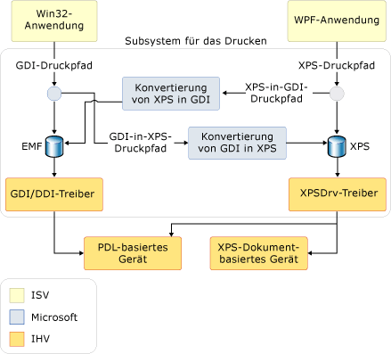

# Übersicht über das DruckenPrinting Overview
Mit Microsoft .NET Framework, Anwendungsentwickler, die mit Windows Presentation Foundation (WPF) verfügen über umfangreiche neue drucken und Druckvorschau systemverwaltung [!INCLUDE[TLA#tla_api#plural](../../../../includes/tlasharptla-apisharpplural-md.md)].With Microsoft .NET Framework, application developers using Windows Presentation Foundation (WPF) have a rich new set of printing and print system management [!INCLUDE[TLA#tla_api#plural](../../../../includes/tlasharptla-apisharpplural-md.md)]. Mit [!INCLUDE[TLA#tla_winvista](../../../../includes/tlasharptla-winvista-md.md)] stehen einige dieser Erweiterungen des Drucksystems auch Entwicklern zur Verfügung, die [!INCLUDE[TLA#tla_winforms](../../../../includes/tlasharptla-winforms-md.md)]-Anwendungen erstellen, sowie Entwicklern, die nicht verwalteten Code verwenden.With [!INCLUDE[TLA#tla_winvista](../../../../includes/tlasharptla-winvista-md.md)], some of these print system enhancements are also available to developers creating [!INCLUDE[TLA#tla_winforms](../../../../includes/tlasharptla-winforms-md.md)] applications and developers using unmanaged code. Im Zentrum dieser neuen Funktionen stehen das neue [!INCLUDE[TLA#tla_xps](../../../../includes/tlasharptla-xps-md.md)]-Dateiformat und der [!INCLUDE[TLA2#tla_xps](../../../../includes/tla2sharptla-xps-md.md)]-Druckpfad.At the core of this new functionality is the new [!INCLUDE[TLA#tla_xps](../../../../includes/tlasharptla-xps-md.md)] file format and the [!INCLUDE[TLA2#tla_xps](../../../../includes/tla2sharptla-xps-md.md)] print path.  
  
 Dieses Thema enthält folgende Abschnitte:This topic contains the following sections.  
  
   
## Info über XPSAbout XPS  
 [!INCLUDE[TLA2#tla_metro](../../../../includes/tla2sharptla-metro-md.md)] ist ein Format für elektronische Dokumente, ein Format für Spooldateien und eine Seitenbeschreibungssprache. is an electronic document format, a spool file format and a page description language. Es handelt sich um ein offenes Dokumentformat, das [!INCLUDE[TLA#tla_xml](../../../../includes/tlasharptla-xml-md.md)], [!INCLUDE[TLA#tla_opc](../../../../includes/tlasharptla-opc-md.md)] und andere Branchenstandards verwendet, um plattformübergreifend nutzbare Dokumente zu erstellen.It is an open document format that uses [!INCLUDE[TLA#tla_xml](../../../../includes/tlasharptla-xml-md.md)], [!INCLUDE[TLA#tla_opc](../../../../includes/tlasharptla-opc-md.md)], and other industry standards to create cross-platform documents. [!INCLUDE[TLA2#tla_metro](../../../../includes/tla2sharptla-metro-md.md)] vereinfacht die Vorgänge beim Erstellen, Teilen, Drucken, Anzeigen und Archivieren von digitalen Dokumenten. simplifies the process by which digital documents are created, shared, printed, viewed, and archived. Weitere Informationen zu [!INCLUDE[TLA2#tla_metro](../../../../includes/tla2sharptla-metro-md.md)], finden Sie unter der [XPS-Website](https://www.microsoft.com/xps).For additional information on [!INCLUDE[TLA2#tla_metro](../../../../includes/tla2sharptla-metro-md.md)], see the [XPS Web Site](https://www.microsoft.com/xps).  
  
 Verschiedene Techniken für das Drucken von [!INCLUDE[TLA2#tla_metro](../../../../includes/tla2sharptla-metro-md.md)]-basierten Inhalten mithilfe von [!INCLUDE[TLA2#tla_wpf](../../../../includes/tla2sharptla-wpf-md.md)] sind in [Programmgesteuertes Drucken von XPS-Dateien](../../../../docs/framework/wpf/advanced/how-to-programmatically-print-xps-files.md) dargestellt.Several techniques for printing [!INCLUDE[TLA2#tla_metro](../../../../includes/tla2sharptla-metro-md.md)] based content using [!INCLUDE[TLA2#tla_wpf](../../../../includes/tla2sharptla-wpf-md.md)] are demonstrated in [Programmatically Print XPS Files](../../../../docs/framework/wpf/advanced/how-to-programmatically-print-xps-files.md). Es kann sinnvoll sein, diese Beispiele beim Durcharbeiten der in diesem Thema enthaltenen Inhalte hinzuzuziehen.You may find it useful to reference these samples during review of content contained in this topic. (Entwickler von nicht verwaltetem Code sollten finden Sie in der Dokumentation für die [MXDC_ESCAPE Funktion](https://msdn.microsoft.com/library/windows/desktop/dd162739.aspx).(Unmanaged code developers should see documentation for the [MXDC_ESCAPE function](https://msdn.microsoft.com/library/windows/desktop/dd162739.aspx). Windows Forms-Entwickler verwenden, müssen die [!INCLUDE[TLA2#tla_api](../../../../includes/tla2sharptla-api-md.md)] in die <xref:System.Drawing.Printing> Namespace, der die vollständige nicht unterstützt. [!INCLUDE[TLA2#tla_xps](../../../../includes/tla2sharptla-xps-md.md)] Druckpfad, wohl aber einen Hybriden GDI-nach-XPS-Druckpfad unterstützt.Windows Forms developers must use the [!INCLUDE[TLA2#tla_api](../../../../includes/tla2sharptla-api-md.md)] in the <xref:System.Drawing.Printing> namespace which does not support the full [!INCLUDE[TLA2#tla_xps](../../../../includes/tla2sharptla-xps-md.md)] print path, but does support a hybrid GDI-to-XPS print path. Weitere Informationen finden Sie unter **Druckpfadarchitektur** unten.)See **Print Path Architecture** below.)  
  
   
## XPS-DruckpfadXPS Print Path  
 Die [!INCLUDE[TLA#tla_metro](../../../../includes/tlasharptla-metro-md.md)] -Druckpfad ist ein neues [!INCLUDE[TLA#tla_mswin](../../../../includes/tlasharptla-mswin-md.md)] -Funktion, die definiert, wie Drucken in Windows-Anwendungen ausgeführt wird.The [!INCLUDE[TLA#tla_metro](../../../../includes/tlasharptla-metro-md.md)] print path is a new [!INCLUDE[TLA#tla_mswin](../../../../includes/tlasharptla-mswin-md.md)] feature that redefines how printing is handled in Windows applications. Da [!INCLUDE[TLA2#tla_xps](../../../../includes/tla2sharptla-xps-md.md)] eine Sprache zur Dokumentdarstellung (wie etwa RTF), ein Druckerspoolerformat (wie etwa WMF) und eine Seitenbeschreibungssprache (wie etwa PCL oder Postscript) ersetzen kann, bleibt im neuen Druckpfad das [!INCLUDE[TLA2#tla_metro](../../../../includes/tla2sharptla-metro-md.md)]-Format von der Veröffentlichung der Anwendung bis zur abschließenden Verarbeitung im Druckertreiber oder -gerät erhalten.Because [!INCLUDE[TLA2#tla_xps](../../../../includes/tla2sharptla-xps-md.md)] can replace a document presentation language (such as RTF), a print spooler format (such as WMF), and a page description language (such as PCL or Postscript); the new print path maintains the [!INCLUDE[TLA2#tla_metro](../../../../includes/tla2sharptla-metro-md.md)] format from application publication to the final processing in the print driver or device.  
  
 Der [!INCLUDE[TLA2#tla_metro](../../../../includes/tla2sharptla-metro-md.md)]-Druckpfad baut auf dem [!INCLUDE[TLA2#tla_metro](../../../../includes/tla2sharptla-metro-md.md)]-Druckermodell (XPSDrv) auf, das für Entwickler eine Reihe von Vorzügen bereithält, wie etwa [!INCLUDE[TLA#tla_wys](../../../../includes/tlasharptla-wys-md.md)]-Druck, verbesserte Farbunterstützung und erheblich gesteigerte Druckleistung.The [!INCLUDE[TLA2#tla_metro](../../../../includes/tla2sharptla-metro-md.md)] print path is built upon the [!INCLUDE[TLA2#tla_metro](../../../../includes/tla2sharptla-metro-md.md)] printer driver model (XPSDrv), which provides several benefits for developers such as [!INCLUDE[TLA#tla_wys](../../../../includes/tlasharptla-wys-md.md)] printing, improved color support, and significantly improved print performance. (Weitere Informationen zu XPSDrv finden Sie unter [Windows-Treiberentwicklungskit](https://msdn.microsoft.com/library/windows/hardware/ff557573.aspx).)(For more on XPSDrv, see the [Windows Driver Development Kit](https://msdn.microsoft.com/library/windows/hardware/ff557573.aspx).)  
  
 Den Betrieb des druckerspoolers ist für [!INCLUDE[TLA2#tla_metro](../../../../includes/tla2sharptla-metro-md.md)] Dokumente entspricht im Wesentlichen wie in früheren Versionen von Windows.The operation of the print spooler for [!INCLUDE[TLA2#tla_metro](../../../../includes/tla2sharptla-metro-md.md)] documents is essentially the same as in previous versions of Windows. Er wurde jedoch verbessert und unterstützt nun über den vorhandenen [!INCLUDE[TLA2#tla_gdi](../../../../includes/tla2sharptla-gdi-md.md)]-Druckpfad hinaus auch den [!INCLUDE[TLA2#tla_metro](../../../../includes/tla2sharptla-metro-md.md)]-Druckpfad.However, it has been enhanced to support the [!INCLUDE[TLA2#tla_metro](../../../../includes/tla2sharptla-metro-md.md)] print path in addition to the existing [!INCLUDE[TLA2#tla_gdi](../../../../includes/tla2sharptla-gdi-md.md)] print path. Der neue Druckpfad nutzt systemeigen eine [!INCLUDE[TLA2#tla_metro](../../../../includes/tla2sharptla-metro-md.md)]-Spooldatei.The new print path natively consumes an [!INCLUDE[TLA2#tla_metro](../../../../includes/tla2sharptla-metro-md.md)] spool file. Zwar funktionieren für frühere Versionen von [!INCLUDE[TLA#tla_mswin](../../../../includes/tlasharptla-mswin-md.md)] erstellte Druckertreiber für den Benutzermodus weiterhin, für den [!INCLUDE[TLA2#tla_metro](../../../../includes/tla2sharptla-metro-md.md)]-Druckpfad ist jedoch ein [!INCLUDE[TLA2#tla_metro](../../../../includes/tla2sharptla-metro-md.md)]-Druckertreiber (XPSDrv) erforderlich.While user-mode printer drivers written for previous versions of [!INCLUDE[TLA#tla_mswin](../../../../includes/tlasharptla-mswin-md.md)] will continue to work, an [!INCLUDE[TLA2#tla_metro](../../../../includes/tla2sharptla-metro-md.md)] printer driver (XPSDrv) is required in order to use the [!INCLUDE[TLA2#tla_metro](../../../../includes/tla2sharptla-metro-md.md)] print path.  
  
 Die Vorzüge des [!INCLUDE[TLA2#tla_metro](../../../../includes/tla2sharptla-metro-md.md)]-Druckpfads sind erheblich und umfassen u.a.:The benefits of the [!INCLUDE[TLA2#tla_metro](../../../../includes/tla2sharptla-metro-md.md)] print path are significant, and include:  
  
-   [!INCLUDE[TLA2#tla_wys](../../../../includes/tla2sharptla-wys-md.md)]-Druckunterstützung print support  
  
-   Systemeigene Unterstützung für erweiterte Farbprofile, die auch 32 Bit pro Kanal (bpc), CMYK, benannte Farben, n-Tinten und systemeigene Unterstützung von Transparenz und Farbverläufen einschließen.Native support of advanced color profiles, which include 32 bits per channel (bpc), CMYK, named-colors, n-inks, and native support of transparency and gradients.  
  
-   Verbesserte druckleistung für .NET Framework und [!INCLUDE[TLA#tla_win32](../../../../includes/tlasharptla-win32-md.md)] -basierte Anwendungen.Improved print performance for both .NET Framework and [!INCLUDE[TLA#tla_win32](../../../../includes/tlasharptla-win32-md.md)] based applications.  
  
-   [!INCLUDE[TLA2#tla_metro](../../../../includes/tla2sharptla-metro-md.md)]-Branchenstandardformat.Industry standard [!INCLUDE[TLA2#tla_metro](../../../../includes/tla2sharptla-metro-md.md)] format.  
  
 Für einfache Druckszenarien ist eine einfache und intuitiv bedienbare [!INCLUDE[TLA2#tla_api](../../../../includes/tla2sharptla-api-md.md)] mit einem einzelnen Einstiegspunkt für Benutzeroberfläche, Konfiguration und Auftragsübergabe verfügbar.For basic print scenarios, a simple and intuitive [!INCLUDE[TLA2#tla_api](../../../../includes/tla2sharptla-api-md.md)] is available with a single entry point for user interface, configuration and job submission. Für erweiterte Szenarien steht jetzt zusätzlich Unterstützung für [!INCLUDE[TLA#tla_ui](../../../../includes/tlasharptla-ui-md.md)]-Anpassung (oder Verzicht auf die [!INCLUDE[TLA2#tla_ui](../../../../includes/tla2sharptla-ui-md.md)]), synchronen oder asynchronen Druck und Funktionen zum Druck von Batchaufträgen zur Verfügung.For advanced scenarios, an additional support is added for [!INCLUDE[TLA#tla_ui](../../../../includes/tlasharptla-ui-md.md)] customization (or no [!INCLUDE[TLA2#tla_ui](../../../../includes/tla2sharptla-ui-md.md)] at all), synchronous or asynchronous printing, and batch printing capabilities. Beide Optionen bieten Druckunterstützung mit vollständigen oder eingeschränkten Vertrauensstellungen.Both options provide print support in full or partial trust mode.  
  
 [!INCLUDE[TLA2#tla_metro](../../../../includes/tla2sharptla-metro-md.md)] wurde im Hinblick auf Erweiterbarkeit entwickelt. was designed with extensibility in mind. Mithilfe des Extensibility Frameworks können [!INCLUDE[TLA2#tla_metro](../../../../includes/tla2sharptla-metro-md.md)] auf modulare Weise Features und Funktionen hinzugefügt werden.By using the extensibility framework, features and capabilities can be added to [!INCLUDE[TLA2#tla_metro](../../../../includes/tla2sharptla-metro-md.md)] in a modular manner. Zu den Erweiterungsfunktionen gehören:Extensibility features include:  
  
-   Druckschema.Print Schema. Das öffentliche Schema wird regelmäßig aktualisiert und ermöglicht die schnelle Erweiterung von Gerätefunktionen.The public schema is updated regularly and enables rapid extension of device capabilities. (Siehe dazu **PrintTicket und PrintCapabilities** unten.)(See **PrintTicket and PrintCapabilities** below.)  
  
-   Erweiterbare Filterpipeline.Extensible Filter Pipeline. Die Filterpipeline des [!INCLUDE[TLA2#tla_metro](../../../../includes/tla2sharptla-metro-md.md)]-Druckertreibers (XPSDrv) wurde dafür ausgelegt, sowohl direkten als auch skalierbaren Druck von [!INCLUDE[TLA2#tla_metro](../../../../includes/tla2sharptla-metro-md.md)]-Dokumenten zu ermöglichen.The [!INCLUDE[TLA2#tla_metro](../../../../includes/tla2sharptla-metro-md.md)] printer driver (XPSDrv) filter pipeline was designed to enable both direct and scalable printing of [!INCLUDE[TLA2#tla_metro](../../../../includes/tla2sharptla-metro-md.md)] documents. (Suche nach "XPSDrv" im der [Windows-Treiberkit](https://msdn.microsoft.com/library/windows/hardware/ff557573.aspx).)(Lookup "XPSDrv" in the [Windows Driver Kit](https://msdn.microsoft.com/library/windows/hardware/ff557573.aspx).)  
  
### DruckpfadarchitekturPrint Path Architecture  
 Während beide [!INCLUDE[TLA2#tla_win32](../../../../includes/tla2sharptla-win32-md.md)] und .NET Framework-Anwendungen unterstützen [!INCLUDE[TLA2#tla_metro](../../../../includes/tla2sharptla-metro-md.md)], [!INCLUDE[TLA2#tla_win32](../../../../includes/tla2sharptla-win32-md.md)] und Windows Forms-Anwendungen verwenden eine [!INCLUDE[TLA2#tla_gdi](../../../../includes/tla2sharptla-gdi-md.md)] zu [!INCLUDE[TLA2#tla_metro](../../../../includes/tla2sharptla-metro-md.md)] Konvertierung um erstellen [!INCLUDE[TLA2#tla_metro](../../../../includes/tla2sharptla-metro-md.md)] formatierten Inhalt für die [!INCLUDE[TLA2#tla_metro](../../../../includes/tla2sharptla-metro-md.md)]-Druckertreiber (XPSDrv).While both [!INCLUDE[TLA2#tla_win32](../../../../includes/tla2sharptla-win32-md.md)] and .NET Framework applications support [!INCLUDE[TLA2#tla_metro](../../../../includes/tla2sharptla-metro-md.md)], [!INCLUDE[TLA2#tla_win32](../../../../includes/tla2sharptla-win32-md.md)] and Windows Forms applications use a [!INCLUDE[TLA2#tla_gdi](../../../../includes/tla2sharptla-gdi-md.md)] to [!INCLUDE[TLA2#tla_metro](../../../../includes/tla2sharptla-metro-md.md)] conversion in order to create [!INCLUDE[TLA2#tla_metro](../../../../includes/tla2sharptla-metro-md.md)] formatted content for the [!INCLUDE[TLA2#tla_metro](../../../../includes/tla2sharptla-metro-md.md)] printer driver (XPSDrv). Diese Anwendungen müssen den [!INCLUDE[TLA2#tla_metro](../../../../includes/tla2sharptla-metro-md.md)]-Druckpfad nicht zwangsläufig verwenden und können weiterhin den [!INCLUDE[TLA#tla_emf](../../../../includes/tlasharptla-emf-md.md)]-basierten Druck verwenden.These applications are not required to use the [!INCLUDE[TLA2#tla_metro](../../../../includes/tla2sharptla-metro-md.md)] print path, and can continue to use [!INCLUDE[TLA#tla_emf](../../../../includes/tlasharptla-emf-md.md)] based printing. Die meisten Features und Verbesserungen von [!INCLUDE[TLA2#tla_metro](../../../../includes/tla2sharptla-metro-md.md)] sind jedoch nur für Anwendungen verfügbar, die den [!INCLUDE[TLA2#tla_metro](../../../../includes/tla2sharptla-metro-md.md)]-Druckpfad zum Ziel haben.However, most [!INCLUDE[TLA2#tla_metro](../../../../includes/tla2sharptla-metro-md.md)] features and enhancements are only available to applications that target the [!INCLUDE[TLA2#tla_metro](../../../../includes/tla2sharptla-metro-md.md)] print path.  
  
 So aktivieren Sie die Verwendung von XPSDrv-basierten Druckern durch [!INCLUDE[TLA2#tla_win32](../../../../includes/tla2sharptla-win32-md.md)] und Windows Forms-Anwendungen, die [!INCLUDE[TLA2#tla_metro](../../../../includes/tla2sharptla-metro-md.md)] -Druckertreiber (XPSDrv) unterstützt die Konvertierung von [!INCLUDE[TLA2#tla_gdi](../../../../includes/tla2sharptla-gdi-md.md)] zu [!INCLUDE[TLA2#tla_metro](../../../../includes/tla2sharptla-metro-md.md)] Format.To enable the use of XPSDrv-based printers by [!INCLUDE[TLA2#tla_win32](../../../../includes/tla2sharptla-win32-md.md)] and Windows Forms applications, the [!INCLUDE[TLA2#tla_metro](../../../../includes/tla2sharptla-metro-md.md)] printer driver (XPSDrv) supports conversion of [!INCLUDE[TLA2#tla_gdi](../../../../includes/tla2sharptla-gdi-md.md)] to [!INCLUDE[TLA2#tla_metro](../../../../includes/tla2sharptla-metro-md.md)] format. Das XPSDrv-Modell umfasst außerdem einen Konverter für das [!INCLUDE[TLA2#tla_metro](../../../../includes/tla2sharptla-metro-md.md)]-Format nach [!INCLUDE[TLA2#tla_gdi](../../../../includes/tla2sharptla-gdi-md.md)], sodass [!INCLUDE[TLA2#tla_win32](../../../../includes/tla2sharptla-win32-md.md)]-Anwendungen [!INCLUDE[TLA2#tla_xps](../../../../includes/tla2sharptla-xps-md.md)]-Dokumente drucken können.The XPSDrv model also provides a converter for [!INCLUDE[TLA2#tla_metro](../../../../includes/tla2sharptla-metro-md.md)] to [!INCLUDE[TLA2#tla_gdi](../../../../includes/tla2sharptla-gdi-md.md)] format so that [!INCLUDE[TLA2#tla_win32](../../../../includes/tla2sharptla-win32-md.md)] applications can print [!INCLUDE[TLA2#tla_xps](../../../../includes/tla2sharptla-xps-md.md)] Documents. Für [!INCLUDE[TLA2#tla_wpf](../../../../includes/tla2sharptla-wpf-md.md)] Anwendungen erfolgt die Konvertierung von [!INCLUDE[TLA2#tla_metro](../../../../includes/tla2sharptla-metro-md.md)] zu [!INCLUDE[TLA2#tla_gdi](../../../../includes/tla2sharptla-gdi-md.md)] Format erfolgt automatisch durch die <xref:System.Windows.Xps.XpsDocumentWriter.Write%2A> und <xref:System.Windows.Xps.XpsDocumentWriter.WriteAsync%2A> Methoden der <xref:System.Windows.Xps.XpsDocumentWriter> Klasse, wenn die Druckerwarteschlange des Schreibvorgangs nicht verfügt einen XPSDrv-Treiber.For [!INCLUDE[TLA2#tla_wpf](../../../../includes/tla2sharptla-wpf-md.md)] applications, conversion of [!INCLUDE[TLA2#tla_metro](../../../../includes/tla2sharptla-metro-md.md)] to [!INCLUDE[TLA2#tla_gdi](../../../../includes/tla2sharptla-gdi-md.md)] format is done automatically by the <xref:System.Windows.Xps.XpsDocumentWriter.Write%2A> and <xref:System.Windows.Xps.XpsDocumentWriter.WriteAsync%2A> methods of the <xref:System.Windows.Xps.XpsDocumentWriter> class whenever the target print queue of the write operation does not have an XPSDrv driver. (Windows Forms-Anwendungen nicht drucken [!INCLUDE[TLA2#tla_xps](../../../../includes/tla2sharptla-xps-md.md)] Dokumente.)(Windows Forms applications cannot print [!INCLUDE[TLA2#tla_xps](../../../../includes/tla2sharptla-xps-md.md)] Documents.)  
  
 Die folgende Abbildung stellt das Drucksubsystem dar und definiert die von [!INCLUDE[TLA#tla_ms](../../../../includes/tlasharptla-ms-md.md)] bereitgestellten sowie die von Software- und Hardwareherstellern definierten Anteile.The following illustration depicts the print subsystem and defines the portions provided by [!INCLUDE[TLA#tla_ms](../../../../includes/tlasharptla-ms-md.md)], and the portions defined by software and hardware vendors.  
  
   
  
### Einfacher XPS-DruckBasic XPS Printing  
 [!INCLUDE[TLA2#tla_wpf](../../../../includes/tla2sharptla-wpf-md.md)] definiert sowohl eine einfache als auch eine erweiterte [!INCLUDE[TLA#tla_api](../../../../includes/tlasharptla-api-md.md)]. defines both a basic and advanced [!INCLUDE[TLA#tla_api](../../../../includes/tlasharptla-api-md.md)]. Für Anwendungen, die keine umfangreichen Druckanpassungen oder Zugriff auf die Gesamtmenge der [!INCLUDE[TLA2#tla_metro](../../../../includes/tla2sharptla-metro-md.md)]-Funktionen erfordern, ist eine Unterstützung für einfachen Druck verfügbar.For those applications that do not require extensive print customization or access to the complete [!INCLUDE[TLA2#tla_metro](../../../../includes/tla2sharptla-metro-md.md)] feature set, basic print support is available. Die einfache Druckunterstützung wird über ein Druckdialogfeld-Steuerelement verfügbar gemacht, das nur minimale Konfiguration erfordert und eine vertraute [!INCLUDE[TLA2#tla_ui](../../../../includes/tla2sharptla-ui-md.md)] bietet.Basic print support is exposed through a print dialog control that requires minimal configuration and features a familiar [!INCLUDE[TLA2#tla_ui](../../../../includes/tla2sharptla-ui-md.md)]. Viele [!INCLUDE[TLA2#tla_metro](../../../../includes/tla2sharptla-metro-md.md)]-Funktionen sind in diesem vereinfachten Druckmodell verfügbar.Many [!INCLUDE[TLA2#tla_metro](../../../../includes/tla2sharptla-metro-md.md)] features are available using this simplified print model.  
  
#### PrintDialogPrintDialog  
 Das <xref:System.Windows.Controls.PrintDialog?displayProperty=nameWithType>-Steuerelement stellt einen einheitlichen Einstiegspunkt für [!INCLUDE[TLA2#tla_ui](../../../../includes/tla2sharptla-ui-md.md)], Konfiguration und [!INCLUDE[TLA2#tla_metro](../../../../includes/tla2sharptla-metro-md.md)]-Auftragsübermittlung bereit.The <xref:System.Windows.Controls.PrintDialog?displayProperty=nameWithType> control provides a single entry point for [!INCLUDE[TLA2#tla_ui](../../../../includes/tla2sharptla-ui-md.md)], configuration, and [!INCLUDE[TLA2#tla_metro](../../../../includes/tla2sharptla-metro-md.md)] job submission. Informationen zum Instanziieren und Verwenden des Steuerelements finden Sie unter [Aufrufen eines Druckdialogfelds](../../../../docs/framework/wpf/advanced/how-to-invoke-a-print-dialog.md).For information about how to instantiate and use the control, see [Invoke a Print Dialog](../../../../docs/framework/wpf/advanced/how-to-invoke-a-print-dialog.md).  
  
### Erweiterter XPS-DruckAdvanced XPS Printing  
 Für den Zugriff auf die Gesamtmenge der [!INCLUDE[TLA2#tla_metro](../../../../includes/tla2sharptla-metro-md.md)]-Funktionen muss die erweiterte Druck-[!INCLUDE[TLA2#tla_api](../../../../includes/tla2sharptla-api-md.md)] verwendet werden.To access the complete set of [!INCLUDE[TLA2#tla_metro](../../../../includes/tla2sharptla-metro-md.md)] features, the advanced print [!INCLUDE[TLA2#tla_api](../../../../includes/tla2sharptla-api-md.md)] must be used. Mehrere relevante [!INCLUDE[TLA2#tla_api](../../../../includes/tla2sharptla-api-md.md)] sind ausführlicher unten beschrieben.Several relevant [!INCLUDE[TLA2#tla_api](../../../../includes/tla2sharptla-api-md.md)] are described in greater detail below. Eine vollständige Liste der [!INCLUDE[TLA2#tla_metro](../../../../includes/tla2sharptla-metro-md.md)] Druckpfad [!INCLUDE[TLA2#tla_api#plural](../../../../includes/tla2sharptla-apisharpplural-md.md)], finden Sie unter den <xref:System.Windows.Xps> und <xref:System.Printing> Namespaceverweise.For a complete list of [!INCLUDE[TLA2#tla_metro](../../../../includes/tla2sharptla-metro-md.md)] print path [!INCLUDE[TLA2#tla_api#plural](../../../../includes/tla2sharptla-apisharpplural-md.md)], see the <xref:System.Windows.Xps> and <xref:System.Printing> namespace references.  
  
#### PrintTicket und PrintCapabilitiesPrintTicket and PrintCapabilities  
 Die <xref:System.Printing.PrintTicket> und <xref:System.Printing.PrintCapabilities> Klassen bilden die Grundlage der erweiterten [!INCLUDE[TLA2#tla_metro](../../../../includes/tla2sharptla-metro-md.md)] Funktionen.The <xref:System.Printing.PrintTicket> and <xref:System.Printing.PrintCapabilities> classes are the foundation of the advanced [!INCLUDE[TLA2#tla_metro](../../../../includes/tla2sharptla-metro-md.md)] features. Beide Objekttypen sind Strukturen druckorientierter Funktionen, wie etwa Sortierung, doppelseitiger Druck, Heftung usw. im [!INCLUDE[TLA#tla_xml](../../../../includes/tlasharptla-xml-md.md)]-Format. Diese Strukturen sind durch das Druckschema definiert.Both types of objects are [!INCLUDE[TLA#tla_xml](../../../../includes/tlasharptla-xml-md.md)] formatted structures of print-oriented features such as collation, two-sided printing, stapling, etc. These structures are defined by the print schema. Ein <xref:System.Printing.PrintTicket> weist einen Drucker an, wie ein Druckauftrag verarbeitet werden muss.A <xref:System.Printing.PrintTicket> instructs a printer how to process a print job. Die <xref:System.Printing.PrintCapabilities> -Klasse definiert die Fähigkeiten eines Druckers.The <xref:System.Printing.PrintCapabilities> class defines the capabilities of a printer. Durch Abfragen der Funktionen eines Druckers kann ein <xref:System.Printing.PrintTicket> erstellt werden, das die von einem Drucker unterstützten Funktionen in vollem Umfang nutzt.By querying the capabilities of a printer, a <xref:System.Printing.PrintTicket> can be created that takes full advantage of a printer's supported features. Analog dazu können nicht unterstützte Funktionen vermieden werden.Similarly, unsupported features can be avoided.  
  
 Im folgenden Beispiel wird das Abfragen der <xref:System.Printing.PrintCapabilities> eines Druckers und das Erstellen eines <xref:System.Printing.PrintTicket> mithilfe von Code gezeigt.The following example demonstrates how to query the <xref:System.Printing.PrintCapabilities> of a printer and create a <xref:System.Printing.PrintTicket> using code.  
  
 [!code-cpp[xpscreate#PrinterCapabilities](../../../../samples/snippets/cpp/VS_Snippets_Wpf/XpsCreate/CPP/XpsCreate.cpp#printercapabilities)]
 [!code-csharp[xpscreate#PrinterCapabilities](../../../../samples/snippets/csharp/VS_Snippets_Wpf/XpsCreate/CSharp/XpsCreate.cs#printercapabilities)]
 [!code-vb[xpscreate#PrinterCapabilities](../../../../samples/snippets/visualbasic/VS_Snippets_Wpf/XpsCreate/visualbasic/xpscreate.vb#printercapabilities)]  
  
#### PrintServer und PrintQueuePrintServer and PrintQueue  
 Die <xref:System.Printing.PrintServer>-Klasse stellt einen Netzwerkdruckerserver und die <xref:System.Printing.PrintQueue>-Klasse einen Drucker mit zugeordneter Auftragswarteschlange dar.The <xref:System.Printing.PrintServer> class represents a network print server and the <xref:System.Printing.PrintQueue> class represents a printer and the output job queue associated with it. In Kombination ermöglichen diese [!INCLUDE[TLA2#tla_api#plural](../../../../includes/tla2sharptla-apisharpplural-md.md)] die erweiterte Verwaltung der Druckaufträge von Servern.Together, these [!INCLUDE[TLA2#tla_api#plural](../../../../includes/tla2sharptla-apisharpplural-md.md)] allow advanced management of a server's print jobs. Ein <xref:System.Printing.PrintServer> oder eine davon abgeleitete Klasse wird verwendet, um eine <xref:System.Printing.PrintQueue> zu verwalten.A <xref:System.Printing.PrintServer>, or one of its derived classes, is used to manage a <xref:System.Printing.PrintQueue>. Die <xref:System.Printing.PrintQueue.AddJob%2A>-Methode wird verwendet, um einen neuen Druckauftrag in die Warteschlange einzustellen.The <xref:System.Printing.PrintQueue.AddJob%2A> method is used to insert a new print job into the queue.  
  
 Das folgende Beispiel zeigt, wie ein <xref:System.Printing.LocalPrintServer> erstellt und mithilfe von Code auf seine Standard-<xref:System.Printing.PrintQueue> zugegriffen wird.The following example demonstrates how to create a <xref:System.Printing.LocalPrintServer> and access its default <xref:System.Printing.PrintQueue> by using code.  
  
 [!code-csharp[xpsprint#PrintQueueSnip](../../../../samples/snippets/csharp/VS_Snippets_Wpf/XpsPrint/CSharp/XpsPrintHelper.cs#printqueuesnip)]
 [!code-vb[xpsprint#PrintQueueSnip](../../../../samples/snippets/visualbasic/VS_Snippets_Wpf/XpsPrint/visualbasic/xpsprinthelper.vb#printqueuesnip)]  
  
#### XpsDocumentWriterXpsDocumentWriter  
 Ein <xref:System.Windows.Xps.XpsDocumentWriter> mit seinen vielen <xref:System.Windows.Xps.XpsDocumentWriter.Write%2A>- und <xref:System.Windows.Xps.XpsDocumentWriter.WriteAsync%2A>-Methoden, wird zum Schreiben von [!INCLUDE[TLA2#tla_metro](../../../../includes/tla2sharptla-metro-md.md)]-Dokumenten in eine <xref:System.Printing.PrintQueue> verwendet.An <xref:System.Windows.Xps.XpsDocumentWriter>, with its many the <xref:System.Windows.Xps.XpsDocumentWriter.Write%2A> and <xref:System.Windows.Xps.XpsDocumentWriter.WriteAsync%2A> methods, is used to write [!INCLUDE[TLA2#tla_metro](../../../../includes/tla2sharptla-metro-md.md)] documents to a <xref:System.Printing.PrintQueue>. So wird z. B. die Methode <xref:System.Windows.Xps.XpsDocumentWriter.Write%28System.Windows.Documents.FixedPage%2CSystem.Printing.PrintTicket%29> verwendet, um ein [!INCLUDE[TLA2#tla_metro](../../../../includes/tla2sharptla-metro-md.md)]-Dokument und ein <xref:System.Printing.PrintTicket> synchron auszugeben.For example, the <xref:System.Windows.Xps.XpsDocumentWriter.Write%28System.Windows.Documents.FixedPage%2CSystem.Printing.PrintTicket%29> method is used to output an [!INCLUDE[TLA2#tla_metro](../../../../includes/tla2sharptla-metro-md.md)] document and <xref:System.Printing.PrintTicket> synchronously. Die Methode <xref:System.Windows.Xps.XpsDocumentWriter.WriteAsync%28System.Windows.Documents.FixedDocument%2CSystem.Printing.PrintTicket%29> wird verwendet, um ein [!INCLUDE[TLA2#tla_metro](../../../../includes/tla2sharptla-metro-md.md)]-Dokument und ein <xref:System.Printing.PrintTicket> asynchron auszugeben.The <xref:System.Windows.Xps.XpsDocumentWriter.WriteAsync%28System.Windows.Documents.FixedDocument%2CSystem.Printing.PrintTicket%29> method is used to output an [!INCLUDE[TLA2#tla_metro](../../../../includes/tla2sharptla-metro-md.md)] document and <xref:System.Printing.PrintTicket> asynchronously.  
  
 Im folgenden Beispiel wird veranschaulicht, wie ein <xref:System.Windows.Xps.XpsDocumentWriter> mithilfe von Code erstellt wird.The following example demonstrates how to create an <xref:System.Windows.Xps.XpsDocumentWriter> using code.  
  
 [!code-csharp[XpsPrint#PrintQueueSnip](../../../../samples/snippets/csharp/VS_Snippets_Wpf/XpsPrint/CSharp/XpsPrintHelper.cs#printqueuesnip)]
 [!code-vb[XpsPrint#PrintQueueSnip](../../../../samples/snippets/visualbasic/VS_Snippets_Wpf/XpsPrint/visualbasic/xpsprinthelper.vb#printqueuesnip)]  
  
 Die <xref:System.Printing.PrintQueue.AddJob%2A>-Methoden stellen ebenfalls Druckmöglichkeiten bereit.The <xref:System.Printing.PrintQueue.AddJob%2A> methods also provide ways to print. Weitere Informationen finden Sie unter [Programmgesteuertes Drucken von XPS-Dateien](../../../../docs/framework/wpf/advanced/how-to-programmatically-print-xps-files.md).See [Programmatically Print XPS Files](../../../../docs/framework/wpf/advanced/how-to-programmatically-print-xps-files.md). .for details.  
  
   
## GDI-DruckpfadGDI Print Path  
 Während [!INCLUDE[TLA2#tla_wpf](../../../../includes/tla2sharptla-wpf-md.md)] Anwendungen nativ unterstützen die [!INCLUDE[TLA2#tla_metro](../../../../includes/tla2sharptla-metro-md.md)] -Druckpfad, [!INCLUDE[TLA2#tla_win32](../../../../includes/tla2sharptla-win32-md.md)] und Windows Forms-Anwendungen können auch einige nutzen [!INCLUDE[TLA2#tla_metro](../../../../includes/tla2sharptla-metro-md.md)] Funktionen.While [!INCLUDE[TLA2#tla_wpf](../../../../includes/tla2sharptla-wpf-md.md)] applications natively support the [!INCLUDE[TLA2#tla_metro](../../../../includes/tla2sharptla-metro-md.md)] print path, [!INCLUDE[TLA2#tla_win32](../../../../includes/tla2sharptla-win32-md.md)] and Windows Forms applications can also take advantage of some [!INCLUDE[TLA2#tla_metro](../../../../includes/tla2sharptla-metro-md.md)] features. Der [!INCLUDE[TLA2#tla_metro](../../../../includes/tla2sharptla-metro-md.md)]-Druckertreiber (XPSDrv) kann [!INCLUDE[TLA2#tla_gdi](../../../../includes/tla2sharptla-gdi-md.md)]-basierte Ausgaben in das [!INCLUDE[TLA2#tla_metro](../../../../includes/tla2sharptla-metro-md.md)]-Format konvertieren.The [!INCLUDE[TLA2#tla_metro](../../../../includes/tla2sharptla-metro-md.md)] printer driver (XPSDrv) can convert [!INCLUDE[TLA2#tla_gdi](../../../../includes/tla2sharptla-gdi-md.md)] based output to [!INCLUDE[TLA2#tla_metro](../../../../includes/tla2sharptla-metro-md.md)] format. Für erweiterte Szenarien wird eine benutzerdefinierte Konvertierung des Inhalts unterstützt, mit der [Microsoft XPS Document Converter (MXDC)](https://msdn.microsoft.com/library/windows/desktop/ff686803.aspx).For advanced scenarios, custom conversion of content is supported using the [Microsoft XPS Document Converter (MXDC)](https://msdn.microsoft.com/library/windows/desktop/ff686803.aspx). Auf ähnliche Weise [!INCLUDE[TLA2#tla_wpf](../../../../includes/tla2sharptla-wpf-md.md)] Anwendungen ebenfalls Ausgaben an den [!INCLUDE[TLA2#tla_gdi](../../../../includes/tla2sharptla-gdi-md.md)] Druckpfad durch Aufrufen einer der der <xref:System.Windows.Xps.XpsDocumentWriter.Write%2A> oder <xref:System.Windows.Xps.XpsDocumentWriter.WriteAsync%2A> Methoden der <xref:System.Windows.Xps.XpsDocumentWriter> Druckwarteschlange für Klassen- und nicht-XpsDrv-Drucker als Ziel festlegen.Similarly, [!INCLUDE[TLA2#tla_wpf](../../../../includes/tla2sharptla-wpf-md.md)] applications can also output to the [!INCLUDE[TLA2#tla_gdi](../../../../includes/tla2sharptla-gdi-md.md)] print path by calling one of the <xref:System.Windows.Xps.XpsDocumentWriter.Write%2A> or <xref:System.Windows.Xps.XpsDocumentWriter.WriteAsync%2A> methods of the <xref:System.Windows.Xps.XpsDocumentWriter> class and designating a non-XpsDrv printer as the target print queue.  

Für Anwendungen, die keine [!INCLUDE[TLA2#tla_metro](../../../../includes/tla2sharptla-metro-md.md)]-Funktion oder -Unterstützung benötigen, bleibt der aktuelle [!INCLUDE[TLA2#tla_gdi](../../../../includes/tla2sharptla-gdi-md.md)]-Druckpfad unverändert.For applications that do not require [!INCLUDE[TLA2#tla_metro](../../../../includes/tla2sharptla-metro-md.md)] functionality or support, the current [!INCLUDE[TLA2#tla_gdi](../../../../includes/tla2sharptla-gdi-md.md)] print path remains unchanged.  
  
-   Für zusätzliches Referenzmaterial für die [!INCLUDE[TLA2#tla_gdi](../../../../includes/tla2sharptla-gdi-md.md)] -Druckerpfad und die verschiedenen [!INCLUDE[TLA2#tla_metro](../../../../includes/tla2sharptla-metro-md.md)] Konvertierungsoptionen, finden Sie unter [Microsoft XPS Document Converter (MXDC)](https://msdn.microsoft.com/library/windows/desktop/ff686803.aspx) und "XPSDrv" im der [Windows Driver Kit](https://msdn.microsoft.com/library/windows/hardware/ff557573.aspx).For additional reference material on the [!INCLUDE[TLA2#tla_gdi](../../../../includes/tla2sharptla-gdi-md.md)] print path and the various [!INCLUDE[TLA2#tla_metro](../../../../includes/tla2sharptla-metro-md.md)] conversion options, see [Microsoft XPS Document Converter (MXDC)](https://msdn.microsoft.com/library/windows/desktop/ff686803.aspx) and "XPSDrv" in the [Windows Driver Kit](https://msdn.microsoft.com/library/windows/hardware/ff557573.aspx).  
  
   
## XPSDrv-TreibermodellXPSDrv Driver Model  
 Der [!INCLUDE[TLA2#tla_metro](../../../../includes/tla2sharptla-metro-md.md)]-Druckpfad verbessert die Effizienz des Spoolings durch Verwendung von [!INCLUDE[TLA2#tla_metro](../../../../includes/tla2sharptla-metro-md.md)] als systemeigenem Druckerspoolerformat beim Drucken auf [!INCLUDE[TLA2#tla_metro](../../../../includes/tla2sharptla-metro-md.md)]-fähigen Druckern oder Treibern.The [!INCLUDE[TLA2#tla_metro](../../../../includes/tla2sharptla-metro-md.md)] print path improves spooler efficiency by using [!INCLUDE[TLA2#tla_metro](../../../../includes/tla2sharptla-metro-md.md)] as the native print spool format when printing to an [!INCLUDE[TLA2#tla_metro](../../../../includes/tla2sharptla-metro-md.md)] -enabled printer or driver. Das vereinfachte Spooling beseitigt die Notwendigkeit, vor dem Spoolen des Dokuments eine temporäre Spoolingdatei, wie etwa eine [!INCLUDE[TLA2#tla_emf](../../../../includes/tla2sharptla-emf-md.md)]-Datendatei, zu generieren.The simplified spooling process eliminates the need to generate an intermediate spool file, such as an [!INCLUDE[TLA2#tla_emf](../../../../includes/tla2sharptla-emf-md.md)] data file, before the document is spooled. Durch geringere Größe der Spooldateien kann der [!INCLUDE[TLA2#tla_metro](../../../../includes/tla2sharptla-metro-md.md)]-Druckpfad den Netzwerkverkehr verringern und die Druckleistung verbessern.Through smaller spool file sizes, the [!INCLUDE[TLA2#tla_metro](../../../../includes/tla2sharptla-metro-md.md)] print path can reduce network traffic and improve print performance.  
  
 [!INCLUDE[TLA2#tla_emf](../../../../includes/tla2sharptla-emf-md.md)] ist ein geschlossenes Format, das Anwendungsausgaben als Abfolge von Aufrufen an [!INCLUDE[TLA2#tla_gdi](../../../../includes/tla2sharptla-gdi-md.md)] für Renderdienste darstellt. is a closed format that represents application output as a series of calls into [!INCLUDE[TLA2#tla_gdi](../../../../includes/tla2sharptla-gdi-md.md)] for rendering services. Im Gegensatz zu [!INCLUDE[TLA2#tla_emf](../../../../includes/tla2sharptla-emf-md.md)] stellt das [!INCLUDE[TLA2#tla_metro](../../../../includes/tla2sharptla-metro-md.md)]-Spoolingformat das tatsächliche Dokument dar, ohne bei der Ausgabe an einen [!INCLUDE[TLA2#tla_metro](../../../../includes/tla2sharptla-metro-md.md)]-basierten Druckertreiber (XPSDrv) weitere Interpretation zu erfordern.Unlike [!INCLUDE[TLA2#tla_emf](../../../../includes/tla2sharptla-emf-md.md)], the [!INCLUDE[TLA2#tla_metro](../../../../includes/tla2sharptla-metro-md.md)] spool format represents the actual document without requiring further interpretation when output to an [!INCLUDE[TLA2#tla_metro](../../../../includes/tla2sharptla-metro-md.md)]-based printer driver (XPSDrv). Die Treiber können direkt mit den Daten im vorliegenden Format arbeiten.The drivers can operate directly on the data in the format. Durch diese Fähigkeit entfallen die Daten- und Farbraumkonvertierungen, die bei der Verwendung von [!INCLUDE[TLA2#tla_emf](../../../../includes/tla2sharptla-emf-md.md)]-Dateien und [!INCLUDE[TLA2#tla_gdi](../../../../includes/tla2sharptla-gdi-md.md)]-basierten Druckertreibern erforderlich sind.This capability eliminates the data and color space conversions required when you use [!INCLUDE[TLA2#tla_emf](../../../../includes/tla2sharptla-emf-md.md)] files and [!INCLUDE[TLA2#tla_gdi](../../../../includes/tla2sharptla-gdi-md.md)]-based print drivers.  
  
 Normalerweise verringert sich die Größe von Spooldateien, wenn [!INCLUDE[TLA2#tla_metro](../../../../includes/tla2sharptla-metro-md.md)]-Dokumente verwendet werden, die einen [!INCLUDE[TLA2#tla_metro](../../../../includes/tla2sharptla-metro-md.md)]-Druckertreiber (XPSDrv) zum Ziel haben, gegenüber ihren [!INCLUDE[TLA2#tla_emf](../../../../includes/tla2sharptla-emf-md.md)]-Entsprechungen; allerdings gibt es Ausnahmen:Spool file sizes are usually reduced when you use [!INCLUDE[TLA2#tla_metro](../../../../includes/tla2sharptla-metro-md.md)] Documents that target an [!INCLUDE[TLA2#tla_metro](../../../../includes/tla2sharptla-metro-md.md)] printer driver (XPSDrv) compared with their [!INCLUDE[TLA2#tla_emf](../../../../includes/tla2sharptla-emf-md.md)] equivalents; however, there are exceptions:  
  
-   Eine Vektorgrafik, die sehr komplex ist, viele Ebenen aufweist oder ineffizient geschrieben wurde, kann größer als die Bitmapversion der gleichen Grafik sein.A vector graphic that is very complex, multi-layered, or inefficiently written can be larger than a bitmapped version of the same graphic.  
  
-   Zum Zweck der Anzeige am Bildschirm werden in XPS-Dateien Geräteschriftarten sowie computerbasierte Schriftarten eingebettet, während in GDI-Spooldateien keine Geräteschriftarten eingebettet sind.For screen display purposes, XPS files embed device fonts as well as computer-based fonts; whereas GDI spool files do not embed device fonts. Beide Schriftarten sind jedoch in Teilmengen gegliedert (siehe unten), und Druckertreiber können die Geräteschriftarten vor der Übertragung der Datei an den Drucker entfernen.But both kinds of fonts are subsetted (see below) and printer drivers can remove the device fonts before transmitting the file to the printer.  
  
 Die Reduzierung der Spoolgröße erfolgt mithilfe mehrerer Mechanismen:Spool size reduction is performed through several mechanisms:  
  
-   **Unterklassen von Schriftarten**.**Font subsetting**. Nur Zeichen, die im Dokument verwendet werden, werden in der [!INCLUDE[TLA2#tla_metro](../../../../includes/tla2sharptla-metro-md.md)]-Datei gespeichert.Only characters used within the actual document are stored in the [!INCLUDE[TLA2#tla_metro](../../../../includes/tla2sharptla-metro-md.md)] file.  
  
-   **Erweiterte Grafikunterstützung**.**Advanced Graphics Support**. Durch die systemeigene Unterstützung von Transparenz und Farbverlaufsprimitiven wird die Rasterung von Inhalten im [!INCLUDE[TLA2#tla_xps](../../../../includes/tla2sharptla-xps-md.md)]-Dokument vermieden.Native support for transparency and gradient primitives avoids rasterization of content in the [!INCLUDE[TLA2#tla_xps](../../../../includes/tla2sharptla-xps-md.md)] Document.  
  
-   **Erkennung gemeinsamer Ressourcen**.**Identification of common resources**. Ressourcen, die mehrfach verwendet werden (wie etwa ein Bild, das ein Firmenlogo darstellt) werden als freigegebene Ressourcen behandelt und nur einmal geladen.Resources that are used multiple times (such as an image that represents a corporate logo) are treated as shared resources and are loaded only once.  
  
-   **ZIP-Komprimierung**.**ZIP compression**. Alle [!INCLUDE[TLA2#tla_metro](../../../../includes/tla2sharptla-metro-md.md)]-Dokumente verwenden ZIP-Komprimierung.All [!INCLUDE[TLA2#tla_metro](../../../../includes/tla2sharptla-metro-md.md)] documents use ZIP compression.  
  
## Siehe auchSee Also  
 <xref:System.Windows.Controls.PrintDialog>  
 <xref:System.Windows.Xps.XpsDocumentWriter>  
 <xref:System.Windows.Xps.Packaging.XpsDocument>  
 <xref:System.Printing.PrintTicket>  
 <xref:System.Printing.PrintCapabilities>  
 <xref:System.Printing.PrintServer>  
 <xref:System.Printing.PrintQueue>  
 [Themen zu VorgehensweisenHow-to Topics](../../../../docs/framework/wpf/advanced/printing-how-to-topics.md)  
 [Dokumente in WPFDocuments in WPF](../../../../docs/framework/wpf/advanced/documents-in-wpf.md)  
 [XPSXPS](https://www.microsoft.com/xps)  
 [Serialisierung und Speicherung von DokumentenDocument Serialization and Storage](../../../../docs/framework/wpf/advanced/document-serialization-and-storage.md)  
 [Microsoft XPS-Dokument Konverter (MXDC)Microsoft XPS Document Converter (MXDC)](https://msdn.microsoft.com/library/windows/desktop/ff686803.aspx)
