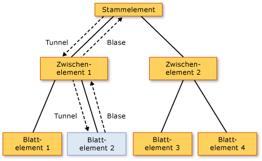

# Übersicht über Routingereignisse
Dieses Thema beschreibt das Konzept von Routingereignissen in [!INCLUDE[TLA#tla_winclient](../../../../includes/tlasharptla-winclient-md.md)]. Das Thema definiert die Terminologie von Routingereignissen, beschreibt, wie Routingereignisse anhand einer Struktur von Elementen weitergeleitet werden und führt Sie in das Erstellen Ihrer eigenen, benutzerdefinierten Routingereignisse ein.
  
   
## Erforderliche Komponenten  
 In diesem Thema wird davon ausgegangen, dass Sie über grundlegende Kenntnisse zu [!INCLUDE[TLA#tla_clr](../../../../includes/tlasharptla-clr-md.md)] und objektorientiertem Programmieren sowie zur Konzeptualisierung der Beziehungen zwischen [!INCLUDE[TLA2#tla_winclient](../../../../includes/tla2sharptla-winclient-md.md)]-Elementen als Struktur verfügen. Um den Beispielen in diesem Thema zu folgen, sollten Sie zudem [!INCLUDE[TLA#tla_xaml](../../../../includes/tlasharptla-xaml-md.md)] verstehen und wissen, wie sehr einfache [!INCLUDE[TLA2#tla_winclient](../../../../includes/tla2sharptla-winclient-md.md)]-Anwendungen oder -Seiten geschrieben werden. Weitere Informationen finden Sie unter [Exemplarische Vorgehensweise: Meine erste WPF-Desktopanwendung](../../../../docs/framework/wpf/getting-started/walkthrough-my-first-wpf-desktop-application.md) und [XAML Overview (WPF)](../../../../docs/framework/wpf/advanced/xaml-overview-wpf.md).  
  
   
## Was ist ein Routingereignis?  
 Stellen Sie sich Routingereignisse entweder aus Sicht der Funktion oder der Implementierung vor. Beide Definitionen werden hier vorgestellt, da Benutzer die Definitionen unterschiedlich hilfreich finden.  
  
 Funktionale Definition: Ein Routingereignis ist ein Ereignis, das Ereignishandler auf mehreren Listenern in einer Elementstruktur aufrufen kann, und nicht nur auf dem Objekt, das das Ereignis ausgelöst hat.  
  
 Implementierungsdefinition: ein Routingereignis ist ein [!INCLUDE[TLA2#tla_clr](../../../../includes/tla2sharptla-clr-md.md)] Ereignis, das von einer Instanz von gesichert wird die <xref:System.Windows.RoutedEvent> -Klasse und wird verarbeitet, indem Sie die [!INCLUDE[TLA#tla_winclient](../../../../includes/tlasharptla-winclient-md.md)] Ereignissystem.  
  
 Eine typische [!INCLUDE[TLA2#tla_winclient](../../../../includes/tla2sharptla-winclient-md.md)]-Anwendung enthält viele Elemente. Egal ob im Code erstellt oder in [!INCLUDE[TLA2#tla_xaml](../../../../includes/tla2sharptla-xaml-md.md)] deklariert, stehen diese Elemente in einer Beziehung einer Elementstruktur zueinander. Die Ereignisroute kann sich abhängig von der Ereignisdefinition in eine von zwei Richtungen bewegen; im Allgemeinen bewegt sie sich vom Quellelement aus und „steigt“ in der Elementstruktur auf, bis sie den Stamm der Elementstruktur erreicht (normalerweise eine Seite oder ein Fenster). Dieses Bubblingkonzept kommt Ihnen möglicherweise bekannt vor, wenn Sie schon einmal mit dem DHTML-Objektmodell gearbeitet haben.  
  
 Betrachten Sie die folgende einfache Elementstruktur:  
  
 [!code-xaml[EventOvwSupport#GroupButton](../../../../samples/snippets/csharp/VS_Snippets_Wpf/EventOvwSupport/CSharp/default.xaml#groupbutton)]  
  
 Diese Elementstruktur erzeugt in etwa Folgendes:  
  
   
  
 In dieser vereinfachten Elementstruktur, die Quelle des eine <xref:System.Windows.Controls.Primitives.ButtonBase.Click> Ereignis ist eines der der <xref:System.Windows.Controls.Button> Elemente, und der <xref:System.Windows.Controls.Button> geklickt wurde das erste Element, das die Gelegenheit hat, die das Ereignis behandelt wird. Jedoch, wenn kein Handler die <xref:System.Windows.Controls.Button> für das Ereignis fungiert, und klicken Sie dann das Ereignis nach oben an weitergeleitet werden die <xref:System.Windows.Controls.Button> übergeordnete Element in der Elementstruktur der <xref:System.Windows.Controls.StackPanel>. Potenziell Ereignis Blasen auf <xref:System.Windows.Controls.Border>, und klicken Sie dann darüber hinaus auf das Stammverzeichnis Seite die Elementstruktur (nicht dargestellt).  
  
 In anderen Worten: der Ereignisroute dafür <xref:System.Windows.Controls.Primitives.ButtonBase.Click> Ereignis ist:  
  
 Button-->StackPanel-->Border-->...  
  
### Szenarios auf oberster Ebene für Routingereignisse  
 Im folgenden wird eine kurze Zusammenfassung der Szenarios dargestellt, die das Konzept der Routingereignisse motiviert haben; außerdem wird erläutert, warum ein herkömmliches [!INCLUDE[TLA2#tla_clr](../../../../includes/tla2sharptla-clr-md.md)]-Ereignis für die folgenden Szenarios nicht ausreichend ist:  
  
 **Zusammensetzung und Kapselung von Steuerelementen:** Verschiedene Steuerelemente in [!INCLUDE[TLA2#tla_winclient](../../../../includes/tla2sharptla-winclient-md.md)] verfügen über ein umfangreiches Inhaltsmodell. Sie können z. B. ein Bild innerhalb eines Platzieren einer <xref:System.Windows.Controls.Button>, die effektiv die visuelle Struktur der Schaltfläche Erweitert. Das hinzugefügte Image muss jedoch nicht unterbrechen die Treffertest-Verhalten, das bewirkt, eine Schaltfläche dass Reaktion auf eine <xref:System.Windows.Controls.Primitives.ButtonBase.Click> des Inhalts, selbst wenn der Benutzer auf Pixel klickt, die technisch Teil des Bilds.  
  
 **Einzelne Anfügepunkte für Handler:** In [!INCLUDE[TLA#tla_winforms](../../../../includes/tlasharptla-winforms-md.md)] müssen Sie den gleichen Handler mehrmals zur Verarbeitung der Ereignisse anfügen, die von mehreren Elementen ausgelöst werden können. Routingereignisse ermöglichen es Ihnen, diesen Handler nur einmal anzufügen, wie im vorherigen Beispiel gezeigt wurde, und verwenden Handlerlogik, um ggf. zu bestimmen, woher das Ereignis stammt. Dies kann z.B. der Handler für die zuvor gezeigte [!INCLUDE[TLA2#tla_xaml](../../../../includes/tla2sharptla-xaml-md.md)] sein:  
  
 [!code-csharp[EventOvwSupport#GroupButtonCodeBehind](../../../../samples/snippets/csharp/VS_Snippets_Wpf/EventOvwSupport/CSharp/default.xaml.cs#groupbuttoncodebehind)]
 [!code-vb[EventOvwSupport#GroupButtonCodeBehind](../../../../samples/snippets/visualbasic/VS_Snippets_Wpf/EventOvwSupport/visualbasic/default.xaml.vb#groupbuttoncodebehind)]  
  
 **Klassenbehandlung:** Routingereignisse akzeptieren einen statischen Handler, der von der Klasse definiert ist. Dieser Klassenhandler hat die Möglichkeit, ein Ereignis vor angefügten Instanzhandlern zu behandeln.  
  
 **Verweisen auf ein Ereignis ohne Reflektion:** Bestimmte Code- und Markuptechniken erfordern eine Möglichkeit, ein bestimmtes Ereignis zu identifizieren. Erstellt ein Routingereignis ein <xref:System.Windows.RoutedEvent> Feld als Bezeichner an, die eine robuste Ereignis Kennung Technik bereitstellt, die keine statischen oder zur Laufzeit Reflektion erforderlich ist.  
  
### So werden Routingereignis implementiert  
 Ein Routingereignis ist ein [!INCLUDE[TLA2#tla_clr](../../../../includes/tla2sharptla-clr-md.md)] Ereignis, das von einer Instanz von gesichert wird die <xref:System.Windows.RoutedEvent> -Klasse sowie die Anzahl der [!INCLUDE[TLA2#tla_winclient](../../../../includes/tla2sharptla-winclient-md.md)] Ereignissystem. Die <xref:System.Windows.RoutedEvent> Instanz aus der Registrierung abgerufen wird in der Regel als aufbewahrt eine `public` `static` `readonly` Feldmembers der Klasse, die registriert und somit "Eigentümer" des Routingereignisses. Die Verbindung mit dem identisch benannten [!INCLUDE[TLA2#tla_clr](../../../../includes/tla2sharptla-clr-md.md)]-Ereignis (das manchmal auch als „Wrapper“-Ereignis bezeichnet wird) erfolgt durch das Außerkraftsetzen der `add`- und `remove`-Implementierungen für das [!INCLUDE[TLA2#tla_clr](../../../../includes/tla2sharptla-clr-md.md)]-Ereignis. Normalerweise bleiben `add` und `remove` als impliziter Standard bestehen, der die entsprechende sprachspezifische Ereignissyntax zum Hinzufügen und Entfernen von Handlern dieses Ereignisses verwendet. Das Routingereignis sichern und die Verbindungszeichenfolge Mechanismus gleicht konzeptionell, wie eine Abhängigkeitseigenschaft eine [!INCLUDE[TLA2#tla_clr](../../../../includes/tla2sharptla-clr-md.md)] -Eigenschaft, die durch gesichert wird die <xref:System.Windows.DependencyProperty> -Klasse sowie die Anzahl der [!INCLUDE[TLA2#tla_winclient](../../../../includes/tla2sharptla-winclient-md.md)] Eigenschaftensystem.  
  
 Das folgende Beispiel zeigt die Deklaration für eine benutzerdefinierte `Tap` Routingereignis, einschließlich der Registrierung und das Verfügbarmachen von der <xref:System.Windows.RoutedEvent> Bezeichnerfeld und `add` und `remove` Implementierungen für die `Tap` [!INCLUDE[TLA2#tla_clr](../../../../includes/tla2sharptla-clr-md.md)] Ereignis.  
  
 [!code-csharp[RoutedEventCustom#AddRemoveHandler](../../../../samples/snippets/csharp/VS_Snippets_Wpf/RoutedEventCustom/CSharp/SDKSampleLibrary/class1.cs#addremovehandler)]
 [!code-vb[RoutedEventCustom#AddRemoveHandler](../../../../samples/snippets/visualbasic/VS_Snippets_Wpf/RoutedEventCustom/VB/SDKSampleLibrary/Class1.vb#addremovehandler)]  
  
### Routingereignishandler und XAML  
 Um einen Handler für ein Ereignis mit [!INCLUDE[TLA2#tla_xaml](../../../../includes/tla2sharptla-xaml-md.md)] hinzuzufügen, deklarieren Sie den Ereignisnamen als Attribut auf dem Element, das ein Ereignislistener ist. Der Wert des Attributs ist der Name Ihrer implementierten Handlermethode, die in der partiellen Klasse der CodeBehind-Datei vorhanden sein muss.  
  
 [!code-xaml[EventOvwSupport#SimplestSyntax](../../../../samples/snippets/csharp/VS_Snippets_Wpf/EventOvwSupport/CSharp/default.xaml#simplestsyntax)]  
  
 Die [!INCLUDE[TLA2#tla_xaml](../../../../includes/tla2sharptla-xaml-md.md)]-Syntax zum Hinzufügen von Standard-[!INCLUDE[TLA2#tla_clr](../../../../includes/tla2sharptla-clr-md.md)]-Ereignishandlern ist die gleiche wie für das Hinzufügen von Routingereignishandlern, da Sie genauso Handler in den [!INCLUDE[TLA2#tla_clr](../../../../includes/tla2sharptla-clr-md.md)]-Ereigniswrapper einfügen, dem eine Routingereignisimplementierung zu Grunde liegt . Weitere Informationen zum Hinzufügen von Ereignishandlern in [!INCLUDE[TLA2#tla_xaml](../../../../includes/tla2sharptla-xaml-md.md)] finden Sie unter [Übersicht über XAML (WPF)](../../../../docs/framework/wpf/advanced/xaml-overview-wpf.md).  
  
   
## Routingstrategien  
 Routingereignisse verwenden eine von drei Routingstrategien:  
  
-   **Bubbling:** Ereignishandler werden auf der Ereignisquelle aufgerufen. Das Routingereignis wird dann auf nachfolgenden übergeordnete Elemente weitergeleitet, bis es den Stamm der Elementstruktur erreicht. Die meisten Routingereignisse verwenden die Bubblingroutingstrategie. Bubblingroutingereignisse werden üblicherweise verwendet, um Eingabe- oder Zustandänderungen von unterschiedlichen Steuerelemente oder andere Elementen der Benutzeroberfläche zu melden.  
  
-   **Direkt:** Nur das Quellelement selbst kann als Reaktion Handler aufrufen. Dies entspricht dem „Routing“, das [!INCLUDE[TLA#tla_winforms](../../../../includes/tlasharptla-winforms-md.md)] für Ereignisse verwendet. Anders als bei einer normalen [!INCLUDE[TLA2#tla_clr](../../../../includes/tla2sharptla-clr-md.md)] Ereignis, direkte Routingereignisse unterstützen Klassenbehandlung (Klassenbehandlung wird in einem späteren Abschnitt erläutert) und kann verwendet werden, indem <xref:System.Windows.EventSetter> und <xref:System.Windows.EventTrigger>.  
  
-   **Tunneling:** Zunächst werden Ereignishandler am Stamm der Elementstruktur aufgerufen. Das Routingereignis bewegt sich dann über eine Route durch die nachfolgenden untergeordneten Elemente in Richtung des Knotenelements, das die Quelle des Routingereignisses ist (das Element, das das Routingereignis ausgelöst). Tunnelingroutingereignisse werden oft als Teil der Zusammensetzung eines Steuerelements verwendet oder behandelt, sodass Elemente der einzelnen Teile von Ereignissen, die für das vollständige Steuerelement spezifisch sind, bewusst unterdrückt oder ersetzt werden können. Eingabeereignisse aus [!INCLUDE[TLA2#tla_winclient](../../../../includes/tla2sharptla-winclient-md.md)] sind oft als Tunneling/Bubbling-Paar implementiert. Tunnelingereignisse werden manchmal auch als Vorschauereignisse bezeichnet; dies liegt an einer Benennungskonvention für Paare.  
  
   
## Was ist der Vorteil von Routingereignissen?  
 Als Anwendungsentwickler müssen Sie nicht immer wissen oder sicherstellen, dass das Ereignis, das Sie behandeln, als Routingereignis implementiert wird. Weitergeleitete Ereignisse weisen ein besonderes Verhalten auf, aber dieses Verhalten ist weitestgehend unsichtbar, wenn Sie ein Ereignisses auf dem Element behandeln, in dem es ausgelöst wurde.  
  
 Routingereignisse erweisen sich besonders dort als sehr nützlich, wo Sie eines der folgenden Szenarios verwenden: beim Definieren von gängigen Handlern am gängigen Stamm, beim Zusammensetzen eines eigenen Steuerelements oder beim Definieren Ihrer eigenen, benutzerdefinierten Steuerelementklasse.  
  
 Routingereignislistener und Routingereignisquellen müssen kein gemeinsames Ereignis in ihrer Hierarchie aufweisen. Alle <xref:System.Windows.UIElement> oder <xref:System.Windows.ContentElement> können ein Ereignislistener für jedes beliebige Routingereignis sein. Daher können Sie den kompletten Satz an Routingereignissen, die durch die Arbeits-[!INCLUDE[TLA2#tla_api](../../../../includes/tla2sharptla-api-md.md)] zur Verfügung stehen, als konzeptionelle „Schnittstelle“ verwenden, über die unterschiedliche Elemente in der Anwendung Ereignisinformationen austauschen können. Dieses „Schnittstellen“-Konzept für Routingereignisse kann besonders auf Eingabeereignisse angewendet werden.  
  
 Routingereignisse können auch für die Kommunikation durch die Elementstruktur verwendet werden, da die Ereignisdaten für jedes Element auf der Route aufrechterhalten werden. Ein Element könnte die Ereignisdaten ändern, und diese Änderung wäre für das nächste Element auf der Route verfügbar.  
  
 Neben dem Routingaspekt gibt es zwei andere Gründe, aus denen ein beliebiges [!INCLUDE[TLA2#tla_winclient](../../../../includes/tla2sharptla-winclient-md.md)]-Ereignis möglicherweise als Routingereignis statt als [!INCLUDE[TLA2#tla_clr](../../../../includes/tla2sharptla-clr-md.md)]-Standardereignis implementiert wird. Wenn Sie Ihr eigenes Ereignis implementieren, können Sie auch folgende Prinzipien berücksichtigen:  
  
-   Bestimmte [!INCLUDE[TLA2#tla_winclient](../../../../includes/tla2sharptla-winclient-md.md)] Erstellen von Formaten und Vorlagen Features wie z. B. <xref:System.Windows.EventSetter> und <xref:System.Windows.EventTrigger> ein Routingereignis sein müssen. Dies ist das Szenario mit einem Ereignisbezeichner, das weiter oben erwähnt wurde.  
  
-   Routingereignisse unterstützen einen Mechanismus zur Klassenbehandlung, durch den die Klasse statische Methoden angeben kann, die die Möglichkeit haben, Routingereignisse zu behandeln, bevor registrierte Instanzenhandler darauf zugreifen können. Dies ist beim Entwerfen von Steuerelementen hilfreich, da Ihre Klasse ereignisgesteuertes Klassenverhalten erzwingen kann, das nicht versehentlich durch das Behandeln eines Ereignisses auf einer Instanz unterdrückt werden kann.  
  
 Jeder der oben genannten Aspekte wird in einem separaten Abschnitt dieses Themas erläutert.  
  
   
## Hinzufügen und implementieren eines Ereignishandlers für ein Routingereignis  
 Zum Hinzufügen eines Ereignishandlers in [!INCLUDE[TLA2#tla_xaml](../../../../includes/tla2sharptla-xaml-md.md)] müssen Sie einfach nur den Ereignisnamen als Attribut in ein Element einfügen und den Attributwert auf den Namen des Ereignishandlers festlegen, der einen angemessenen Delegaten implementiert, wie in folgendem Beispiel veranschaulicht.  
  
 [!code-xaml[EventOvwSupport#SimplestSyntax](../../../../samples/snippets/csharp/VS_Snippets_Wpf/EventOvwSupport/CSharp/default.xaml#simplestsyntax)]  
  
 `b1SetColor`Der Name des der implementierten Handler, der den Code enthält, die behandelt die <xref:System.Windows.Controls.Primitives.ButtonBase.Click> Ereignis. `b1SetColor`benötigen Sie die gleiche Signatur wie die <xref:System.Windows.RoutedEventHandler> -Delegat, der den Ereignishandlerdelegaten ist für die <xref:System.Windows.Controls.Primitives.ButtonBase.Click> Ereignis. Der erste Parameter aller Delegaten von Routingereignishandlern gibt das Element an, dem der Ereignishandler hinzugefügt wird, und der zweite Parameter gibt die Daten des Ereignisses an.  
  
[!code-csharp[EventOvwSupport#SimpleHandlerA](../../../../samples/snippets/csharp/VS_Snippets_Wpf/EventOvwSupport/CSharp/default.xaml.cs#simplehandlera)]
[!code-vb[EventOvwSupport#SimpleHandlerA](../../../../samples/snippets/visualbasic/VS_Snippets_Wpf/EventOvwSupport/visualbasic/default.xaml.vb#simplehandlera)]  
  
 <xref:System.Windows.RoutedEventHandler>ist die grundlegende Routingereignishandler-Delegat. Für Routingereignisse, die auf bestimmte Steuerelemente oder Szenarien ausgelegt sind, können die für die Routingereignishandler zu verwendenden Delegaten möglicherweise so spezialisiert werden, dass sie spezialisierte Ereignisdaten übertragen können. Z. B. in einem Szenario mit allgemeinen Eingabe Sie möglicherweise Behandeln einer <xref:System.Windows.UIElement.DragEnter> Routingereignis. Der Handler sollte implementieren die <xref:System.Windows.DragEventHandler> delegieren. Sie können mithilfe der spezifischste Delegat verarbeiten die <xref:System.Windows.DragEventArgs> im Handler und lesen die <xref:System.Windows.DragEventArgs.Data%2A> -Eigenschaft, die in die Zwischenablagennutzlast des Ziehvorgangs enthält.  
  
 Ein vollständiges Beispiel zum Hinzufügen eines Ereignishandlers in ein Element mit [!INCLUDE[TLA2#tla_xaml](../../../../includes/tla2sharptla-xaml-md.md)] finden Sie unter [Behandeln eines Routingereignisses](../../../../docs/framework/wpf/advanced/how-to-handle-a-routed-event.md).  
  
 Das Hinzufügen eines Handlers für ein Routingereignis in einer Anwendung, die im Code erstellt wird, ist einfach. Routingereignishandler können immer hinzugefügt werden, über eine Hilfsmethode <xref:System.Windows.UIElement.AddHandler%2A> (Dies ist die gleiche Methode, die der vorhandenen unterstützende erfordert `add`.) Allerdings haben vorhandene [!INCLUDE[TLA2#tla_winclient](../../../../includes/tla2sharptla-winclient-md.md)]-Routingereignisse für gewöhnlich Unterstützungsimplementierungen mit `add`- und `remove`-Logik, die es ermöglichen, dass die Handler für die Routingereignisse von einer sprachspezifischen Ereignissyntax hinzugefügt werden können; diese Syntax ist viel intuitiver als die Hilfsmethode. Im Folgenden wird die Hilfsmethode in einem Beispiel verwendet:  
  
 [!code-csharp[EventOvwSupport#AddHandlerCode](../../../../samples/snippets/csharp/VS_Snippets_Wpf/EventOvwSupport/CSharp/default.xaml.cs#addhandlercode)]
 [!code-vb[EventOvwSupport#AddHandlerCode](../../../../samples/snippets/visualbasic/VS_Snippets_Wpf/EventOvwSupport/visualbasic/default.xaml.vb#addhandlercode)]  
  
 Das folgende Beispiel zeigt die [!INCLUDE[TLA#tla_cshrp](../../../../includes/tlasharptla-cshrp-md.md)]-Operatorsyntax ([!INCLUDE[TLA2#tla_visualb](../../../../includes/tla2sharptla-visualb-md.md)] hat eine geringfügig andere Operatorsyntax aufgrund seiner Behandlung von Dereferenzierung):  
  
 [!code-csharp[EventOvwSupport#AddHandlerPlusEquals](../../../../samples/snippets/csharp/VS_Snippets_Wpf/EventOvwSupport/CSharp/default.xaml.cs#addhandlerplusequals)]
 [!code-vb[EventOvwSupport#AddHandlerPlusEquals](../../../../samples/snippets/visualbasic/VS_Snippets_Wpf/EventOvwSupport/visualbasic/default.xaml.vb#addhandlerplusequals)]  
  
 Ein Beispiel für das Hinzufügen eines Ereignishandlers in Code finden Sie unter [Hinzufügen eines Ereignishandlers mithilfe von Code](../../../../docs/framework/wpf/advanced/how-to-add-an-event-handler-using-code.md).  
  
 Wenn Sie [!INCLUDE[TLA2#tla_visualb](../../../../includes/tla2sharptla-visualb-md.md)] verwenden, können Sie auch das Schlüsselwort `Handles` verwenden, um Handler als Teil der Handlerdeklarationen hinzufügen. Weitere Informationen finden Sie unter [Visual Basic- und WPF-Ereignisbehandlung](../../../../docs/framework/wpf/advanced/visual-basic-and-wpf-event-handling.md).  
  
   
### Das Handled-Konzept  
 Alle Routingereignisse verwenden eine gemeinsame Ereignis Daten-Basisklasse <xref:System.Windows.RoutedEventArgs>. <xref:System.Windows.RoutedEventArgs>definiert die <xref:System.Windows.RoutedEventArgs.Handled%2A> -Eigenschaft, die einen booleschen Wert annimmt. Der Zweck der <xref:System.Windows.RoutedEventArgs.Handled%2A> Eigenschaft besteht darin, alle Ereignishandler entlang der Route, markieren Sie das Routingereignis als zu aktivieren *behandelt*, durch Festlegen des Werts der <xref:System.Windows.RoutedEventArgs.Handled%2A> auf `true`. Nachdem die freigegebenen Ereignisdaten vom Handler an einem Element auf der Route verarbeitet wurden, werden die Daten wieder jedem Listener auf der Route gemeldet.  
  
 Der Wert des <xref:System.Windows.RoutedEventArgs.Handled%2A> wirkt sich auf wie ein Routingereignis gemeldet oder verarbeitet werden, während der Übertragung weiter auf der Route. Wenn <xref:System.Windows.RoutedEventArgs.Handled%2A> ist `true` im Ereignis für ein Routingereignis, Handler, die für das Routingereignis auf andere Elemente zu überwachen sind im Allgemeinen nicht mehr aufgerufen für diese Instanz spezifische Ereignis. Dies gilt sowohl für in [!INCLUDE[TLA2#tla_xaml](../../../../includes/tla2sharptla-xaml-md.md)] angefügte Handler als auch für Handler, die von anderen sprachspezifischen Anfügesyntaxen für Ereignishandlern, wie z.B. `+=` oder `Handles`, hinzugefügt wurden. Für die häufigsten Szenarien für Handler, markieren Sie ein Ereignis als behandelt, indem <xref:System.Windows.RoutedEventArgs.Handled%2A> zu `true` "beendet" routing für eine Tunneling-Route oder eine bubbling-Route sowie für alle Ereignisse, die an einem Punkt in der Route, die von einem Klassenhandler behandelt wird.  
  
 Besteht jedoch ein "HandledEventsToo"-Mechanismus, bei dem Listener dennoch Handler als Reaktion auf Routingereignisse ausführen können, in denen <xref:System.Windows.RoutedEventArgs.Handled%2A> ist `true` in den Ereignisdaten. Das heißt, ist die Ereignisroute nicht wirklich durch Markieren der Ereignisdaten als behandelt beendet. Sie können den HandledEventsToo-Mechanismus nur verwenden, im Code oder in einer <xref:System.Windows.EventSetter>:  
  
-   Im Code, anstatt eine sprachspezifische Ereignissyntax, die funktioniert für allgemeine [!INCLUDE[TLA2#tla_clr](../../../../includes/tla2sharptla-clr-md.md)] rufen Sie die Ereignisse, die [!INCLUDE[TLA2#tla_winclient](../../../../includes/tla2sharptla-winclient-md.md)] Methode <xref:System.Windows.UIElement.AddHandler%28System.Windows.RoutedEvent%2CSystem.Delegate%2CSystem.Boolean%29> den Handler hinzufügen. Legen Sie den Wert von `handledEventsToo` auf `true` fest.  
  
-   In einer <xref:System.Windows.EventSetter>legen die <xref:System.Windows.EventSetter.HandledEventsToo%2A> Attribut `true`.  
  
 Zusätzlich zu dem Verhalten, <xref:System.Windows.RoutedEventArgs.Handled%2A> Zustand erzeugt in Routingereignisse, das Konzept der <xref:System.Windows.RoutedEventArgs.Handled%2A> wirkt sich aber dazu, wie Sie beim Anwendungsentwurf und schreiben den Ereignishandlercode sollte. Sie können den beschrieben vorzustellen <xref:System.Windows.RoutedEventArgs.Handled%2A> als ein einfaches Protokoll, das von Routingereignissen verfügbar gemacht wird. Genau wie Sie dieses Protokoll verwenden bis zu Sie jedoch die Konzeption wie ist der Wert des <xref:System.Windows.RoutedEventArgs.Handled%2A> verwendet werden soll lautet wie folgt:  
  
-   Wenn ein Routingereignis als behandelt markiert ist, muss es nicht von anderen Elementen auf dieser Route erneut verarbeitet werden.  
  
-   Wenn ein Routingereignis nicht als behandelt markiert ist, andere Listener, die zuvor entlang der Route haben entweder nicht an einen Handler registriert, oder der Handler, die registrierten ausgewählt haben, nicht zum Bearbeiten von Daten für das Ereignis, und legen Sie wurden <xref:System.Windows.RoutedEventArgs.Handled%2A> auf `true`. (Es ist selbstverständlich auch möglich, dass der aktuelle Listener der erste Punkt auf der Route ist.) Handler auf dem aktuellen Listener verfügen jetzt über drei mögliche Vorgehensweisen:  
  
    -   Führen Sie keine Aktion durch; das Ereignis bleibt unbehandelt und wird an den nächsten Listener weitergeleitet.  
  
    -   Führen Sie Code als Reaktion auf das Ereignis aus, aber seien Sie sich im Klaren, dass die Aktion nicht umfangreich genug war, um ein Markieren des Ereignisses als „handled“ zu rechtfertigen. Das Ereignis wird an den nächsten Listener weitergeleitet.  
  
    -   Führen Sie Code als Reaktion auf das Ereignis aus. Markieren Sie das Ereignis in den an den Handler übergebenen Ereignisdaten als „handled“, weil die ausgeführte Aktion umfangreich genug war, um das Markieren als „handled“ zu rechtfertigen. Das Ereignis wird immer noch weitergeleitet, in den nächsten Listener, jedoch mit <xref:System.Windows.RoutedEventArgs.Handled%2A> = `true` in den Ereignisdaten, sodass nur `handledEventsToo` Listener haben die Möglichkeit, weitere Handler aufzurufen.  
  
 Dieser grundlegende Entwurf wird durch das Routingverhalten, die zuvor erwähnten bestätigt: ist es schwieriger (Obwohl in Code oder Stilen immer noch möglich), Handler für Routingereignisse anzufügen, die aufgerufen werden, selbst wenn bereitsvoneinvorherigenHandlerentlangderRoutefestgelegthat<xref:System.Windows.RoutedEventArgs.Handled%2A>auf `true`.  
  
 Weitere Informationen zu <xref:System.Windows.RoutedEventArgs.Handled%2A>Klassenbehandlung der Routingereignisse und wenn es sich um Empfehlungen, die für ein Routingereignis als markieren geeignet <xref:System.Windows.RoutedEventArgs.Handled%2A>, finden Sie unter [Routingereignisse als bearbeitete sowie die Behandlung von Klasse markieren](../../../../docs/framework/wpf/advanced/marking-routed-events-as-handled-and-class-handling.md).  
  
 In Anwendungen ist es üblich, lediglich ein Bubblingroutingereignis auf dem Objekt zu behandeln, das es ausgelöst hat, ohne die Routingmerkmale des Ereignisses zu berücksichtigen. Allerdings empfiehlt es sich immer noch, das Routingereignis in den Ereignisdaten als „handled“ zu markieren, um unvorhergesehene Nebeneffekte zu verhindern, nur für den Fall, dass ein Element, das sich weiter oben in der Elementstruktur befindet, auch einen angefügten Handler für das gleiche Routingereignis aufweist.  
  
   
## Klassenhandler  
 Wenn Sie eine abgeleitete Klasse definieren, in irgendeiner Form von <xref:System.Windows.DependencyObject>, können Sie auch definieren und fügen Sie einen Klassenhandler für ein Routingereignis, das einer Klasse deklarierten oder geerbten Ereignisses angehört. Klassenhandler werden vor Handler für Instanzlistener, die an eine Instanz dieser Klasse angefügt sind, aufgerufen, immer dann, wenn ein Routingevent eine Elementinstanz auf seiner Route erreicht.  
  
 Einige [!INCLUDE[TLA2#tla_winclient](../../../../includes/tla2sharptla-winclient-md.md)]-Steuerelemente verfügen über inhärente Klassenbehandlung für bestimmte Routingereignisse. Dies kann nach außen den Anschein erwecken, als dass das Routingereignis nicht einmal ausgelöst wird, aber in Wirklichkeit wird es von einer Klasse behandelt, und das Routingereignis kann immer noch von Ihren Instanzhandlern behandelt werden, wenn Sie bestimmte Techniken verwenden. Außerdem machen viele Basisklassen und Steuerelemente virtuelle Methoden verfügbar, die zum Außerkraftsetzen von Klassenbehandlungsverhalten verwendet werden können. Weitere Informationen sowohl zum Umgehen unerwünschter Klassenbehandlung als auch zum Definieren Ihres eigenen Klassenverhaltens in einer benutzerdefinierten Klasse finden Sie unter [Markieren von Routingereignissen als behandelt und Klassenbehandlung](../../../../docs/framework/wpf/advanced/marking-routed-events-as-handled-and-class-handling.md).  
  
   
## Angefügte Ereignisse in WPF  
 Die [!INCLUDE[TLA2#tla_xaml](../../../../includes/tla2sharptla-xaml-md.md)]-Sprache definiert auch eine besondere Art von Ereignissen, die als *angefügte Ereignisse* bezeichnet werden. Mit einem angefügten Ereignis können Sie einen Ereignishandler für ein bestimmtes Ereignis zu einem beliebigen Element hinzuzufügen. Das Element, das das Ereignis behandelt, muss das angefügte Ereignis weder definieren noch erben; zudem muss weder das Objekt, dass das Ereignis möglicherweise auslöst, noch die dafür zuständige Instanz dieses Ereignis als Klassenmember definieren oder „besitzen“.  
  
 Das [!INCLUDE[TLA2#tla_winclient](../../../../includes/tla2sharptla-winclient-md.md)]-Eingabesystem verwendet angefügte Ereignisse in großem Umfang. Fast alle dieser angefügten Ereignisse werden jedoch über Basiselemente weitergeleitet. Die Eingabeereignisse erscheinen dann als äquivalente nicht angefügte Routingereignisse, die Member der Basiselementklasse sind. Für die Instanz, die zugrunde liegende angefügtes Ereignis <xref:System.Windows.Input.Mouse.MouseDown?displayProperty=nameWithType> können mehrere problemlos verarbeitet werden auf einem gegebenen <xref:System.Windows.UIElement> mit <xref:System.Windows.UIElement.MouseDown> auf, die <xref:System.Windows.UIElement> anstatt Umgang mit angefügtes Ereignissyntax entweder in [!INCLUDE[TLA2#tla_xaml](../../../../includes/tla2sharptla-xaml-md.md)] oder Code.  
  
 Weitere Informationen zu angefügten Ereignissen in [!INCLUDE[TLA2#tla_winclient](../../../../includes/tla2sharptla-winclient-md.md)] finden Sie unter [Übersicht über angefügte Ereignisse](../../../../docs/framework/wpf/advanced/attached-events-overview.md).  
  
   
## Qualifizierte Ereignisnamen in XAML  
 Wenn Sie Handler für Routingereignisse anfügen, die von untergeordneten Elementen ausgelöst werden, ist dies so ähnlich wie der Gebrauch einer *typename*.*eventname* angefügten Ereignissyntax, obwohl es sich dabei genau genommen nicht um den Gebrauch eines angefügten Ereignisses handelt. Fügen Sie die Handler an ein gemeinsames übergeordnetes Element an, um von Ereignisrouting zu profitieren, auch wenn das gemeinsame übergeordnete Element möglicherweise das relevante Routingereignis nicht als Member enthält. Schauen Sie sich dieses Beispiel erneut an:  
  
 [!code-xaml[EventOvwSupport#GroupButton](../../../../samples/snippets/csharp/VS_Snippets_Wpf/EventOvwSupport/CSharp/default.xaml#groupbutton)]  
  
 Der Listener des übergeordneten Elements, wo der Ereignishandler hinzugefügt wird, ist eine <xref:System.Windows.Controls.StackPanel>. Allerdings ist es hinzufügen, einen Handler für ein Routingereignis, das wurde deklariert und ausgelöst werden soll, indem Sie die <xref:System.Windows.Controls.Button> Klasse (<xref:System.Windows.Controls.Primitives.ButtonBase> tatsächlich jedoch zur Verfügung <xref:System.Windows.Controls.Button> durch Vererbung). <xref:System.Windows.Controls.Button>"besitzt", das Ereignis, aber das System lässt Routingereignishandler für alle Routingereignisse an ein beliebiges angefügt werden <xref:System.Windows.UIElement> oder <xref:System.Windows.ContentElement> Instanz Listener, die andernfalls für Listener anfügen konnte eine [!INCLUDE[TLA#tla_clr](../../../../includes/tlasharptla-clr-md.md)] Ereignis. Der Standard-xmlns-Namespace für diese qualifizierten Attributnamen ist in der Regel der Standard-[!INCLUDE[TLA2#tla_winclient](../../../../includes/tla2sharptla-winclient-md.md)]-xmlns-Namespace, aber Sie können auch Namespaces mit Präfix für benutzerdefinierte Routingereignisse angeben. Weitere Informationen zu xmlns finden Sie unter [XAML-Namespaces und Namespacezuordnung für WPF-XAML](../../../../docs/framework/wpf/advanced/xaml-namespaces-and-namespace-mapping-for-wpf-xaml.md).  
  
   
## Eingabeereignisse in WPF  
 Routingereignisse werden auf der [!INCLUDE[TLA2#tla_winclient](../../../../includes/tla2sharptla-winclient-md.md)]-Plattform häufig für Eingabeereignisse verwendet. In [!INCLUDE[TLA2#tla_winclient](../../../../includes/tla2sharptla-winclient-md.md)] erhalten Namen von Tunnelingroutingereignissen per Konvention das Wort „Preview“ (Vorschau) als Präfix. Eingabeereignisse treten oft paarweise auf – wobei das eine ein Bubblingereignis und das andere ein Tunnelingereignis ist. Z. B. die <xref:System.Windows.ContentElement.KeyDown> Ereignis und die <xref:System.Windows.ContentElement.PreviewKeyDown> Objektereignis dieselbe Signatur, wobei ersteres bubbling Eingabeereignis und der letztgenannte das tunneling Eingabeereignis. Manchmal haben Eingabeereignisse nur eine Bubblingversion oder nur eine direkte Routingversion. In der Dokumentation verweisen die Themen zu Routingereignissen auf ähnliche Routingereignisse mit alternativen Routingstrategien, falls derartige Routingereignisse vorhanden sind; Abschnitte auf den Seiten zu verwalteten Referenzen erläutern die Routingstrategien jedes Routingelements.  
  
 [!INCLUDE[TLA2#tla_winclient](../../../../includes/tla2sharptla-winclient-md.md)]-Eingabeereignisse, die paarweise auftreten, werden implementiert, damit eine einzelne Benutzereingabeaktion, wie z.B. das Drücken einer Maustaste, beide Routingereignisse des Paars in der Sequenz auslöst. Zunächst wird das Tunnelingereignis ausgelöst und durchläuft seine Route. Anschließend wird das Bubblingereignis ausgelöst und durchläuft seine Route. Die beiden Ereignisse als solcher dieselbe Ereignisdateninstanz freigeben, da die <xref:System.Windows.UIElement.RaiseEvent%2A> Methodenaufruf in der implementierenden Klasse, die das bubbling-Ereignis auslöst für die Ereignisdaten aus dem Tunneling-Ereignis überwacht und im neuen ausgelösten Ereignisses. Listener mit Handlern für das Tunnelingereignis haben als Erstes die Möglichkeit, das Routingereignis als „handled“ zu markieren (zuerst Klassenhandler, anschließend Instanzhandler). Wenn ein Element entlang der Tunnelingroute das Routingereignis als „handled“ markiert, werden die bereits behandelten Daten des Bubblingereignisses gesendet, und typische angefügte Handler für das entsprechende Bubblingeingabeereignis werden nicht aufgerufen. Nach außen wirkt dies so, als sei das behandelte Bubblingereignis nicht einmal ausgelöst worden. Dieses Behandlungsverhalten ist beim Zusammensetzen von Steuerelementen nützlich; hier möchten Sie möglicherweise, dass alle treffertestbasierten oder fokusbasierten Eingabeereignisse von Ihrem endgültigen Steuerelement gemeldet werden, und nicht von dessen einzelnen Komponenten. Das endgültige Steuerelement ist in der Zusammensetzung näher am Stamm, weshalb es das Tunnelingereignis zunächst in einer Klasse behandeln und eventuell sogar dieses Routingereignis durch ein steuerelementspezifischeres Ereignis „ersetzen“ kann – als Teil des Codes, der die Steuerelementklasse unterstützt.  
  
 Das folgende Beispiel für ein Eingabeereignis veranschaulicht das Verarbeiten von Eingabeereignissen. Im folgenden Baumdiagramm ist `leaf element #2` sowohl die Quelle eines `PreviewMouseDown`- als auch eines `MouseDown`-Ereignisses.  
  
   
Bubbling und Tunneling eines Eingabeereignisses  
  
 Ein Ereignis wird in folgender Reihenfolge verarbeitet:  
  
1.  `PreviewMouseDown` (Tunnel) auf dem Stammelement (root element)  
  
2.  `PreviewMouseDown` (Tunnel) auf dem ersten Zwischenelement (intermediate element #1)  
  
3.  `PreviewMouseDown` (Tunnel) auf dem zweiten Zwischenelement (intermediate element #2)  
  
4.  `MouseDown` (Bubble) auf dem zweiten Quellelement (source element #2)  
  
5.  `MouseDown` (Bubble) auf dem ersten Zwischenelement (intermediate element #1)  
  
6.  `MouseDown` (Bubble) auf dem Stammelement (root element)  
  
 Ein Delegat eines Routingereignishandlers enthält Verweise auf zwei Objekte: auf das Objekt, das das Ereignis ausgelöst hat und das Objekt, auf dem der Handler aufgerufen wurde. Das Objekt, auf dem der Handler aufgerufen wurde, ist das Objekt, das vom `sender`-Parameter gemeldet wurde. Das Objekt, in dem das Ereignis erstmals ausgelöst, wird gemeldet, indem die <xref:System.Windows.RoutedEventArgs.Source%2A> Eigenschaft in den Ereignisdaten. Ein Routingereignis kann dennoch ausgelöst und in diesem Fall behandelt, indem das gleiche Objekt `sender` und <xref:System.Windows.RoutedEventArgs.Source%2A> identisch sind (Dies ist bei Schritte 3 und 4 im Ereignis verarbeiten beispielhafte Aufstellung der Fall).  
  
 Aufgrund von tunneling und bubbling erhalten übergeordnete Elemente Eingabeereignisse, in denen die <xref:System.Windows.RoutedEventArgs.Source%2A> eines ihrer untergeordneten Elemente ist. Wenn es wichtig ist zu wissen, was das Quellelement ist, können Sie das Quellelement identifizieren, indem Sie den Zugriff auf die <xref:System.Windows.RoutedEventArgs.Source%2A> Eigenschaft.  
  
 In der Regel, sobald das Eingabeereignis gekennzeichnet ist <xref:System.Windows.RoutedEventArgs.Handled%2A>, weiteren Handler nicht aufgerufen werden. In der Regel sollten Sie Eingabeereignisse als „handled“ markieren, sobald ein Handler aufgerufen wird, der Ihre anwendungsspezifische logische Behandlung der Bedeutung des Eingabeereignisses angeht.  
  
 Die Ausnahme zu dieser allgemeinen Aussage über <xref:System.Windows.RoutedEventArgs.Handled%2A> Zustand ist, dass die Ereignishandler, der registriert werden, damit absichtlich ignorieren Eingabe <xref:System.Windows.RoutedEventArgs.Handled%2A> Zustand der Daten für das Ereignis auf beiden Routen dennoch ausgelöst werden. Weitere Informationen finden Sie unter [Vorschauereignisse](../../../../docs/framework/wpf/advanced/preview-events.md) oder [Markieren von Routingereignissen als behandelt und Klassenbehandlung](../../../../docs/framework/wpf/advanced/marking-routed-events-as-handled-and-class-handling.md).  
  
 Das freigegebene Ereignisdatenmodell von Tunneling- und Bubblingereignissen und das sequenzielle Auslösen zunächst der Tunneling-und dann der Bubblingereignisse ist kein allgemein gültiges Konzept für alle Routingereignisse. Dieses Verhalten wird insbesondere davon implementiert, wie [!INCLUDE[TLA2#tla_winclient](../../../../includes/tla2sharptla-winclient-md.md)]-Eingabegeräte Eingabeereignispaare auslösen und verbinden. Das Implementieren Ihres eigenen Eingabeereignisses ist ein erweitertes Szenario; möglicherweise entscheiden Sie sich aber dazu, dieses Modell auch für Ihre eigenen Eingabeereignisse zu nutzen.  
  
 Gewisse Klassen behandeln gewisse Eingabeereignisse in einer Klasse, meist mit dem Ziel, die Bedeutung eines bestimmten benutzergesteuerten Eingabeereignisses innerhalb dieses Steuerelements neu zu definieren und ein neues Ereignis auszulösen. Weitere Informationen finden Sie unter [Markieren von Routingereignissen als behandelt und Klassenbehandlung](../../../../docs/framework/wpf/advanced/marking-routed-events-as-handled-and-class-handling.md).  
  
 Weitere Informationen zur Eingabe und zur Interaktion zwischen Eingabe und Ereignissen in normalen Anwendungsszenarien finden Sie unter [Übersicht über die Eingabe](../../../../docs/framework/wpf/advanced/input-overview.md).  
  
   
## EventSetters und EventTriggers  
 In Formaten, enthalten Sie einige bereits deklariert [!INCLUDE[TLA2#tla_xaml](../../../../includes/tla2sharptla-xaml-md.md)] Ereignisbehandlung Syntax im Markup mithilfe einer <xref:System.Windows.EventSetter>. Wenn das Format angewendet wird, wird der verwiesene Handler zur formatierten Instanz hinzugefügt. Sie können deklarieren, ein <xref:System.Windows.EventSetter> nur für ein Routingereignis. Nachfolgend finden Sie ein Beispiel: Beachten Sie, dass die `b1SetColor`-Methode, auf die hier verwiesen wird, sich in einer CodeBehind-Datei befindet.  
  
 [!code-xaml[EventOvwSupport#XAML2](../../../../samples/snippets/csharp/VS_Snippets_Wpf/EventOvwSupport/CSharp/page2.xaml#xaml2)]  
  
 Der Vorteil hierbei ist, dass das Format ist wahrscheinlich zahlreiche andere Informationen enthält, die auf keine der Schaltflächen in der Anwendung angewendet werden können und dass die <xref:System.Windows.EventSetter> verwendet werden, der diesem Format fördert auch auf der Ebene Markup. Darüber hinaus eine <xref:System.Windows.EventSetter> Methodennamen für Handler, die einen Schritt weg von der allgemeinen Anwendung und dem Seitenmarkup abstrahiert.  
  
 Eine andere spezialisierte Syntax, die gerouteten Ereignis und Animation Funktionen von kombiniert [!INCLUDE[TLA2#tla_winclient](../../../../includes/tla2sharptla-winclient-md.md)] ist ein <xref:System.Windows.EventTrigger>. Wie bei <xref:System.Windows.EventSetter>, nur weitergeleiteten Ereignisse möglicherweise verwendet werden, zu einer <xref:System.Windows.EventTrigger>. In der Regel eine <xref:System.Windows.EventTrigger> ist als Teil eines Stils deklariert aber ein <xref:System.Windows.EventTrigger> kann auch auf Seitenebene Elemente als Teil des deklariert werden die <xref:System.Windows.FrameworkElement.Triggers%2A> Sammlung, oder in eine <xref:System.Windows.Controls.ControlTemplate>. Ein <xref:System.Windows.EventTrigger> ermöglicht Ihnen die Angabe einer <xref:System.Windows.Media.Animation.Storyboard> ausgeführt wird, wenn ein Routingereignis ein Element in seiner Route erreicht deklariert eine <xref:System.Windows.EventTrigger> für dieses Ereignis. Den Vorteil, dass ein <xref:System.Windows.EventTrigger> ein vorhandenes Storyboard gegenüber der bloßen Behandlung des Ereignisses gestartet wird, die eine <xref:System.Windows.EventTrigger> bietet eine bessere Kontrolle über das Storyboard und seine Laufzeitverhalten. Weitere Informationen finden Sie unter [Verwenden von Ereignistriggern zum Steuern eines Storyboards nach dessen Start](../../../../docs/framework/wpf/graphics-multimedia/how-to-use-event-triggers-to-control-a-storyboard-after-it-starts.md).  
  
   
## Weitere Informationen zu Routingereignissen  
 In diesem Thema werden hauptsächlich die grundlegenden Konzepte von Routingereignissen erläutert; zudem bietet er Ihnen eine Orientierung, wann Sie auf Routingereignisse reagieren sollten, die bereits in den verschieden Basiselementen und -steuerelementen vorhanden sind. Allerdings können Sie eigene Routingereignis für Ihre benutzerdefinierte Klasse mit den notwendigen Hilfsmitteln, wie z. B. spezialisierte Ereignisdatenklassen und Delegaten, erstellen. Eigentümer des Routingereignisses kann jede Klasse sein, aber die Routingereignisse müssen ausgelöst und behandelt, indem <xref:System.Windows.UIElement> oder <xref:System.Windows.ContentElement> abgeleitete Klassen, damit Sie nützlich ist. Weitere Informationen zu benutzerdefinierten Ereignissen finden Sie unter [Erstellen eines benutzerdefinierten Routingereignisses](../../../../docs/framework/wpf/advanced/how-to-create-a-custom-routed-event.md).  
  
## Siehe auch  
 <xref:System.Windows.EventManager>  
 <xref:System.Windows.RoutedEvent>  
 <xref:System.Windows.RoutedEventArgs>  
 [Markieren von Routingereignissen als behandelt und Klassenbehandlung](../../../../docs/framework/wpf/advanced/marking-routed-events-as-handled-and-class-handling.md)  
 [Übersicht über die Eingabe](../../../../docs/framework/wpf/advanced/input-overview.md)  
 [Befehlsübersicht](../../../../docs/framework/wpf/advanced/commanding-overview.md)  
 [Benutzerdefinierte Abhängigkeitseigenschaften](../../../../docs/framework/wpf/advanced/custom-dependency-properties.md)  
 [Strukturen in WPF](../../../../docs/framework/wpf/advanced/trees-in-wpf.md)  
 [Schwache Ereignismuster](../../../../docs/framework/wpf/advanced/weak-event-patterns.md)
