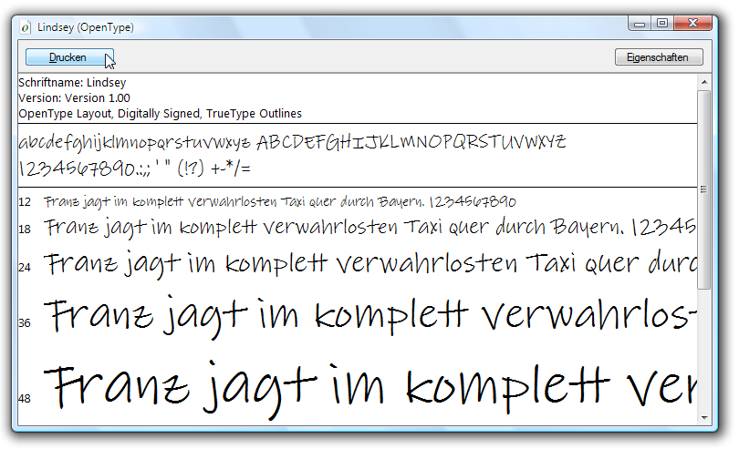

# OpenType-Beispielschriftartenpaket
Dieses Thema bietet einen Überblick über die OpenType-Beispielschriftarten, die mit dem Windows SDK verteilt werden. Die Beispielschriftarten unterstützen erweiterte OpenType-Funktionen, die von [!INCLUDE[TLA#tla_winclient](../../../../includes/tlasharptla-winclient-md.md)] Anwendungen verwendet werden können.  

## Schriftarten im OpenType-Schriftartenpaket  
 Das Windows SDK bietet eine Reihe von OpenType-Beispielschriftarten, die Sie beim Erstellen von [!INCLUDE[TLA#tla_winclient](../../../../includes/tlasharptla-winclient-md.md)] Anwendungen verwenden können. Die Beispielschriftarten werden unter der Lizenz von Ascender Corporation bereitgestellt. Diese Schriftarten implementieren nur eine Teilmenge der gesamten Features, die durch das OpenType-Format definiert werden. In der folgenden Tabelle sind die Namen der OpenType-Beispielschriftarten aufgeführt.  
  
|**Name**|**File**|  
|--------------|--------------|  
|Kootenay|Kooten.ttf|  
|Lindsey|Linds.ttf|  
|Miramonte|Miramo.ttf|  
|Miramonte Fett|Miramob.ttf|  
|Pericles|Peric.ttf|  
|Pericles Light|Pericl.ttf|  
|Pescadero|Pesca.ttf|  
|Pescadero fett|Pescab.ttf|  
  
 Die folgende Abbildung zeigt, wie die OpenType-Beispielschriftarten aussehen.  
  
   
  
 Die Beispielschriftarten werden unter der Lizenz von Ascender Corporation bereitgestellt. Ascender ist ein Anbieter von erweiterten Schriftartprodukten. Auf der [Ascender Corporation Website](https://www.monotype.com/) finden Sie erweiterte oder benutzerdefinierte Versionen, um die Beispielschriftarten zu lizenzieren.  
  
> [!NOTE]
> Aus diesem Grund liegt es in Ihrer Verantwortung als Entwickler sicherzustellen, dass Sie über die erforderlichen Lizenzrechte für alle Schriftarten verfügen, die Sie in eine Anwendung einbetten oder anders verteilen.  
  

## Installieren der Schriftarten  
 Sie haben die Möglichkeit, die OpenType-Beispielschriftarten im Standardverzeichnis Windows Fonts zu **installieren,** Verwenden Sie die Systemsteuerung „Schriftarten“, um die Schriftarten zu installieren. Sobald sich diese Schriftarten auf Ihrem Computer befinden, sind sie für alle Anwendungen zugänglich, die auf Windows-Standardschriftarten verweisen. Sie können eine repräsentative Anzahl an Zeichen in mehreren Schriftgraden anzeigen, indem Sie doppelt auf die Schriftartendatei klicken. Der folgende Screenshot zeigt die Schriftartendatei Lindsey, Linds.ttf.  
  
   
Anzeigen der Schriftart Lindsey  
  

## Verwenden der Schriftarten  
 Es gibt zwei Methoden, um die Schriftarten in Ihrer Anwendung verwenden zu können. Sie können Schriftarten als Projektinhaltselemente zu Ihrer Anwendung hinzufügen, die nicht als Ressourcen in eine Assembly eingebettet werden. Alternativ können Sie Schriftarten als Projektresourcenelemente zu Ihrer Anwendung hinzufügen, die in die Assemblydateien der Anwendung eingebettet sind. Weitere Informationen finden Sie unter [Schriftarten mit Anwendungen verpacken](packaging-fonts-with-applications.md).  
  
## Weitere Informationen

- <xref:System.Windows.Documents.Typography>
- [Features für OpenType-Schriftarten](opentype-font-features.md)
- [Verpacken von Schriftarten mit Anwendungen](packaging-fonts-with-applications.md)
