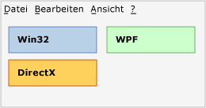
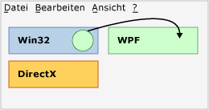
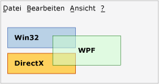
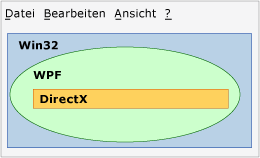

# Übersicht über die TechnologieregionenTechnology Regions Overview
Wenn mehrere Präsentationstechnologien in einer Anwendung verwendet werden, wie z.B. WPF, Win32 oder DirectX, müssen diese die Renderingbereiche in einem gemeinsamen Fenster auf der obersten Ebene gemeinsam verwenden.If multiple presentation technologies are used in an application, such as WPF, Win32, or DirectX, they must share the rendering areas within a common top-level window. In diesem Thema werden die Probleme beschrieben, welche die Präsentation und Eingabe für Ihre WPF-Interoperationsanwendung beeinflussen können.This topic describes issues that might influence the presentation and input for your WPF interoperation application.  
  
## BereicheRegions  
 In einem obersten Fenster können Sie sich jedes HWND, das eine der Technologien einer Interoperationsanwendung umfasst, so vorstellen, als verfüge es über einen eigenen Bereich (auch als „Airspace“ bezeichnet).Within a top-level window, you can conceptualize that each HWND that comprises one of the technologies of an interoperation application has its own region (also called "airspace"). Jedes Pixel im Fenster gehört zu genau einem HWND, das den Bereich dieses HWND bildet.Each pixel within the window belongs to exactly one HWND, which constitutes the region of that HWND. (Genau genommen ist mehr als ein [!INCLUDE[TLA2#tla_winclient](../../../../includes/tla2sharptla-winclient-md.md)]-Bereich vorhanden, wenn mehrere [!INCLUDE[TLA2#tla_winclient](../../../../includes/tla2sharptla-winclient-md.md)]-HWNDs vorhanden sind. Für diese Diskussion wird jedoch davon ausgegangen, dass nur ein HWND vorhanden ist).(Strictly speaking, there is more than one [!INCLUDE[TLA2#tla_winclient](../../../../includes/tla2sharptla-winclient-md.md)] region if there is more than one [!INCLUDE[TLA2#tla_winclient](../../../../includes/tla2sharptla-winclient-md.md)] HWND, but for purposes of this discussion, you can assume there is only one). Der Bereich impliziert, dass alle Ebenen oder anderen Fenster, die versuchen, während der Anwendungslebensdauer oberhalb dieses Pixels ein Rendering durchzuführen, Teil der gleichen Renderebenentechnologie sein müssen.The region implies that all layers or other windows that attempt to render above that pixel during application lifetime must be part of the same render-level technology. Der Versuch, [!INCLUDE[TLA2#tla_winclient](../../../../includes/tla2sharptla-winclient-md.md)]-Pixel über [!INCLUDE[TLA2#tla_win32](../../../../includes/tla2sharptla-win32-md.md)] zu rendern, führt zu unerwünschten Ergebnissen und ist während der Interoperation der [!INCLUDE[TLA2#tla_api#plural](../../../../includes/tla2sharptla-apisharpplural-md.md)]s so weit wie möglich zu vermeiden.Attempting to render [!INCLUDE[TLA2#tla_winclient](../../../../includes/tla2sharptla-winclient-md.md)] pixels over [!INCLUDE[TLA2#tla_win32](../../../../includes/tla2sharptla-win32-md.md)] leads to undesirable results, and is disallowed as much as possible through the interoperation [!INCLUDE[TLA2#tla_api#plural](../../../../includes/tla2sharptla-apisharpplural-md.md)].  
  
### Beispiele für BereicheRegion Examples  
 Die folgende Abbildung zeigt eine Anwendung, in der [!INCLUDE[TLA2#tla_win32](../../../../includes/tla2sharptla-win32-md.md)], [!INCLUDE[TLA2#tla_dx](../../../../includes/tla2sharptla-dx-md.md)], und [!INCLUDE[TLA2#tla_winclient](../../../../includes/tla2sharptla-winclient-md.md)] kombiniert werden.The following illustration shows an application that mixes [!INCLUDE[TLA2#tla_win32](../../../../includes/tla2sharptla-win32-md.md)], [!INCLUDE[TLA2#tla_dx](../../../../includes/tla2sharptla-dx-md.md)], and [!INCLUDE[TLA2#tla_winclient](../../../../includes/tla2sharptla-winclient-md.md)]. Jede Technologie verwendet einen eigenen, nicht überlappenden Satz von Pixeln, und es gibt keine Probleme mit dem Bereich.Each technology uses its own separate, non-overlapping set of pixels, and there are no region issues.  
  
   
  
 Nehmen wir an, diese Anwendung verwendet die Position des Mauszeigers, um eine Animation zu erstellen, die versucht, in einem dieser drei Bereiche ein Rendering durchzuführen.Suppose that this application uses the mouse pointer position to create an animation that attempts to render over any of these three regions. Unabhängig davon, welche Technologie für die Animation selbst verantwortlich ist, würde diese Technologie den Bereich der beiden anderen verletzen.No matter which technology was responsible for the animation itself, that technology would violate the region of the other two. Die folgende Abbildung zeigt einen Versuch, einen WPF-Kreis in einem Win32-Bereich zu rendern.The following illustration shows an attempt to render a WPF circle over a Win32 region.  
  
   
  
 Auch der Versuch, Transparenz/Alphablending zwischen unterschiedlichen Technologien zu verwenden, stellt eine Verletzung dar.Another violation is if you try to use transparency/alpha blending between different technologies.  In der folgenden Abbildung verletzt das [!INCLUDE[TLA2#tla_winclient](../../../../includes/tla2sharptla-winclient-md.md)]-Feld die [!INCLUDE[TLA2#tla_win32](../../../../includes/tla2sharptla-win32-md.md)]- und [!INCLUDE[TLA2#tla_dx](../../../../includes/tla2sharptla-dx-md.md)]-Bereiche.In the following illustration, the [!INCLUDE[TLA2#tla_winclient](../../../../includes/tla2sharptla-winclient-md.md)] box violates the [!INCLUDE[TLA2#tla_win32](../../../../includes/tla2sharptla-win32-md.md)] and [!INCLUDE[TLA2#tla_dx](../../../../includes/tla2sharptla-dx-md.md)] regions. Da die Pixel in diesem [!INCLUDE[TLA2#tla_winclient](../../../../includes/tla2sharptla-winclient-md.md)]-Feld semitransparent sind, müssten sie sowohl zu [!INCLUDE[TLA2#tla_dx](../../../../includes/tla2sharptla-dx-md.md)] und [!INCLUDE[TLA2#tla_winclient](../../../../includes/tla2sharptla-winclient-md.md)] gehören, was nicht möglich ist.Because pixels in that [!INCLUDE[TLA2#tla_winclient](../../../../includes/tla2sharptla-winclient-md.md)] box are semi-transparent, they would have to be owned jointly by both [!INCLUDE[TLA2#tla_dx](../../../../includes/tla2sharptla-dx-md.md)] and [!INCLUDE[TLA2#tla_winclient](../../../../includes/tla2sharptla-winclient-md.md)], which is not possible.  Dies ist eine weitere Verletzung und kann daher nicht erstellt werden.So this is another violation and cannot be built.  
  
   
  
 In den drei vorhergehenden Beispielen wurden rechteckige Bereiche verwendet, andere Formen sind jedoch auch möglich.The previous three examples used rectangular regions, but different shapes are possible.  Ein Bereich kann z.B. ein Loch aufweisen.For example, a region can have a hole. Die folgende Abbildung zeigt einen [!INCLUDE[TLA2#tla_win32](../../../../includes/tla2sharptla-win32-md.md)]-Bereich mit einem rechteckigen Loch, dessen Größe dem kombinierten [!INCLUDE[TLA2#tla_winclient](../../../../includes/tla2sharptla-winclient-md.md)]- und [!INCLUDE[TLA2#tla_dx](../../../../includes/tla2sharptla-dx-md.md)]-Bereich entspricht.The following illustration shows a [!INCLUDE[TLA2#tla_win32](../../../../includes/tla2sharptla-win32-md.md)] region with a rectangular hole this is the size of the [!INCLUDE[TLA2#tla_winclient](../../../../includes/tla2sharptla-winclient-md.md)] and [!INCLUDE[TLA2#tla_dx](../../../../includes/tla2sharptla-dx-md.md)] regions combined.  
  
   
  
 Bereiche müssen nicht rechteckig sein, und können jede Form aufweisen, die von einem [!INCLUDE[TLA2#tla_win32](../../../../includes/tla2sharptla-win32-md.md)]-HRGN (Bereich) definiert werden kann.Regions can also be completely nonrectangular, or any shape describable by a [!INCLUDE[TLA2#tla_win32](../../../../includes/tla2sharptla-win32-md.md)] HRGN (region).  
  
   
  
## Transparenz und Fenster der obersten EbeneTransparency and Top-Level Windows  
 Der Fenster-Manager in Windows verarbeitet tatsächlich nur [!INCLUDE[TLA2#tla_win32](../../../../includes/tla2sharptla-win32-md.md)]-HWNDs.The window manager in Windows only really processes [!INCLUDE[TLA2#tla_win32](../../../../includes/tla2sharptla-win32-md.md)] HWNDs. Aus diesem Grund jede [!INCLUDE[TLA2#tla_winclient](../../../../includes/tla2sharptla-winclient-md.md)] <xref:System.Windows.Window> ein HWND.Therefore, every [!INCLUDE[TLA2#tla_winclient](../../../../includes/tla2sharptla-winclient-md.md)] <xref:System.Windows.Window> is an HWND. Die <xref:System.Windows.Window> -HWND muss die allgemeinen Richtlinien für alle HWNDS erfüllen.The <xref:System.Windows.Window> HWND must abide by the general rules for any HWND. Innerhalb dieses HWND kann von dem [!INCLUDE[TLA2#tla_winclient](../../../../includes/tla2sharptla-winclient-md.md)]-Code alles durchgeführt werden, was von [!INCLUDE[TLA2#tla_winclient](../../../../includes/tla2sharptla-winclient-md.md)] [!INCLUDE[TLA2#tla_api#plural](../../../../includes/tla2sharptla-apisharpplural-md.md)] unterstützt wird.Within that HWND, [!INCLUDE[TLA2#tla_winclient](../../../../includes/tla2sharptla-winclient-md.md)] code can do whatever the overall [!INCLUDE[TLA2#tla_winclient](../../../../includes/tla2sharptla-winclient-md.md)] [!INCLUDE[TLA2#tla_api#plural](../../../../includes/tla2sharptla-apisharpplural-md.md)] support. Bei Interaktionen mit anderen HWNDs auf dem Desktop muss [!INCLUDE[TLA2#tla_winclient](../../../../includes/tla2sharptla-winclient-md.md)] jedoch die Verarbeitungs- und Renderingregeln von [!INCLUDE[TLA2#tla_win32](../../../../includes/tla2sharptla-win32-md.md)] beachten.But for interactions with other HWNDs on the desktop, [!INCLUDE[TLA2#tla_winclient](../../../../includes/tla2sharptla-winclient-md.md)] must abide by [!INCLUDE[TLA2#tla_win32](../../../../includes/tla2sharptla-win32-md.md)] processing and rendering rules.  Durch die Verwendung von [!INCLUDE[TLA2#tla_win32](../../../../includes/tla2sharptla-win32-md.md)] [!INCLUDE[TLA2#tla_api#plural](../../../../includes/tla2sharptla-apisharpplural-md.md)]-HRGNs unterstützt [!INCLUDE[TLA2#tla_winclient](../../../../includes/tla2sharptla-winclient-md.md)] nicht rechteckige Fenster und überlappende Fenster für das Alphablending pro Pixel.[!INCLUDE[TLA2#tla_winclient](../../../../includes/tla2sharptla-winclient-md.md)] supports non-rectangular windows by using [!INCLUDE[TLA2#tla_win32](../../../../includes/tla2sharptla-win32-md.md)] [!INCLUDE[TLA2#tla_api#plural](../../../../includes/tla2sharptla-apisharpplural-md.md)]—HRGNs for non-rectangular windows, and layered windows for a per-pixel alpha.  
  
 Konstante Alpha-Schlüssel und Farbhintergründe werden nicht unterstützt.Constant alpha and color keys are not supported.  Die [!INCLUDE[TLA2#tla_win32](../../../../includes/tla2sharptla-win32-md.md)]-Funktionen für überlappende Fenster variieren je nach Plattform.[!INCLUDE[TLA2#tla_win32](../../../../includes/tla2sharptla-win32-md.md)] layered window capabilities vary by platform.  
  
 Überlappende Fenster können dazu führen, dass das gesamte Fenster transparent (semitransparent) wird, indem ein auf jedes Pixel im Fenster anzuwendender Alphawert festgelegt wird.Layered windows can make the entire window translucent (semi-transparent) by specifying an alpha value to apply to every pixel in the window.  ([!INCLUDE[TLA2#tla_win32](../../../../includes/tla2sharptla-win32-md.md)] unterstützt Alphablending pro Pixel, dessen Verwendung in praktischen Programmen allerdings sehr schwierig ist, da Sie in diesem Modus jedes untergeordnete HWND selbst zeichnen müssen, einschließlich der Dialogfelder und Dropdownmenüs).([!INCLUDE[TLA2#tla_win32](../../../../includes/tla2sharptla-win32-md.md)] in fact supports per-pixel alpha, but this is very difficult to use in practical programs because in this mode you would need to draw any child HWND yourself, including dialogs and dropdowns).  
  
 [!INCLUDE[TLA2#tla_winclient](../../../../includes/tla2sharptla-winclient-md.md)] unterstützt HRGNs. Es sind jedoch keine verwalteten [!INCLUDE[TLA2#tla_api#plural](../../../../includes/tla2sharptla-apisharpplural-md.md)] für diese Funktion verfügbar.supports HRGNs; however, there are no managed [!INCLUDE[TLA2#tla_api#plural](../../../../includes/tla2sharptla-apisharpplural-md.md)] for this functionality. Sie können die Plattform aufrufen und <xref:System.Windows.Interop.HwndSource> aufrufen, die relevanten [!INCLUDE[TLA2#tla_win32](../../../../includes/tla2sharptla-win32-md.md)] [!INCLUDE[TLA2#tla_api#plural](../../../../includes/tla2sharptla-apisharpplural-md.md)].You can use platform invoke and <xref:System.Windows.Interop.HwndSource> to call the relevant [!INCLUDE[TLA2#tla_win32](../../../../includes/tla2sharptla-win32-md.md)] [!INCLUDE[TLA2#tla_api#plural](../../../../includes/tla2sharptla-apisharpplural-md.md)]. Weitere Informationen finden Sie unter [Aufrufen nativer Funktionen aus verwaltetem Code](/cpp/dotnet/calling-native-functions-from-managed-code).For more information, see [Calling Native Functions from Managed Code](/cpp/dotnet/calling-native-functions-from-managed-code).  
  
 [!INCLUDE[TLA2#tla_winclient](../../../../includes/tla2sharptla-winclient-md.md)] überlappende Fenster haben auf verschiedenen Betriebssystemen verschiedene Funktionen.layered windows have different capabilities on different operating systems. Das liegt darin, dass [!INCLUDE[TLA2#tla_winclient](../../../../includes/tla2sharptla-winclient-md.md)] zum Rendern [!INCLUDE[TLA2#tla_dx](../../../../includes/tla2sharptla-dx-md.md)] verwendet, und überlappende Fenster in erster Linie für das [!INCLUDE[TLA2#tla_gdi](../../../../includes/tla2sharptla-gdi-md.md)]-Rendering und nicht für das [!INCLUDE[TLA2#tla_dx](../../../../includes/tla2sharptla-dx-md.md)]-Rendering konzipiert sind.This is because [!INCLUDE[TLA2#tla_winclient](../../../../includes/tla2sharptla-winclient-md.md)] uses [!INCLUDE[TLA2#tla_dx](../../../../includes/tla2sharptla-dx-md.md)] to render, and layered windows were primarily designed for [!INCLUDE[TLA2#tla_gdi](../../../../includes/tla2sharptla-gdi-md.md)] rendering, not [!INCLUDE[TLA2#tla_dx](../../../../includes/tla2sharptla-dx-md.md)] rendering.  
  
-   [!INCLUDE[TLA2#tla_winclient](../../../../includes/tla2sharptla-winclient-md.md)] unterstützt hardwarebeschleunigte überlappende Fenster unter [!INCLUDE[TLA#tla_longhorn](../../../../includes/tlasharptla-longhorn-md.md)] und höher.supports hardware accelerated layered windows on [!INCLUDE[TLA#tla_longhorn](../../../../includes/tlasharptla-longhorn-md.md)] and later. Hardwarebeschleunigte überlappende Fenster unter [!INCLUDE[TLA2#tla_winxp](../../../../includes/tla2sharptla-winxp-md.md)] erfordern die Unterstützung von [!INCLUDE[TLA#tla_dx](../../../../includes/tlasharptla-dx-md.md)], sodass die Funktionen von der [!INCLUDE[TLA#tla_dx](../../../../includes/tlasharptla-dx-md.md)]-Version auf diesem Computer abhängig sind.Hardware accelerated layered windows on [!INCLUDE[TLA2#tla_winxp](../../../../includes/tla2sharptla-winxp-md.md)] require support from [!INCLUDE[TLA#tla_dx](../../../../includes/tlasharptla-dx-md.md)], so the capabilities will depend on the version of [!INCLUDE[TLA#tla_dx](../../../../includes/tlasharptla-dx-md.md)] on that machine.  
  
-   [!INCLUDE[TLA2#tla_winclient](../../../../includes/tla2sharptla-winclient-md.md)] unterstützt keine Transparenz-Hintergrundfarben, da [!INCLUDE[TLA2#tla_winclient](../../../../includes/tla2sharptla-winclient-md.md)] nicht das Rendering der genaue Farbe, die Sie angefordert haben, nicht garantieren kann, insbesondere wenn das Rendering hardwarebeschleunigt ist.does not support transparency color keys, because [!INCLUDE[TLA2#tla_winclient](../../../../includes/tla2sharptla-winclient-md.md)] cannot guarantee to render the exact color you requested, particularly when rendering is hardware-accelerated.  
  
-   Wenn die Anwendung auf [!INCLUDE[TLA2#tla_winxp](../../../../includes/tla2sharptla-winxp-md.md)] ausgeführt wird, führen überlappende Fenster über [!INCLUDE[TLA2#tla_dx](../../../../includes/tla2sharptla-dx-md.md)]-Oberflächen während des Renderings durch die [!INCLUDE[TLA2#tla_dx](../../../../includes/tla2sharptla-dx-md.md)]-Anwendung zu Flimmern.If your application is running on [!INCLUDE[TLA2#tla_winxp](../../../../includes/tla2sharptla-winxp-md.md)], layered windows on top of [!INCLUDE[TLA2#tla_dx](../../../../includes/tla2sharptla-dx-md.md)] surfaces flicker when the [!INCLUDE[TLA2#tla_dx](../../../../includes/tla2sharptla-dx-md.md)] application renders.  (Die eigentliche Rendering-Sequenz ist wie folgt: [!INCLUDE[TLA#tla_gdi](../../../../includes/tlasharptla-gdi-md.md)] blendet das überlappende Fenster aus, anschließend zeichnet [!INCLUDE[TLA2#tla_dx](../../../../includes/tla2sharptla-dx-md.md)], und dann zeigt [!INCLUDE[TLA#tla_gdi](../../../../includes/tlasharptla-gdi-md.md)] das überlappende Fenster erneut an).(The actual rendering sequence is that [!INCLUDE[TLA#tla_gdi](../../../../includes/tlasharptla-gdi-md.md)] hides the layered window, then [!INCLUDE[TLA2#tla_dx](../../../../includes/tla2sharptla-dx-md.md)] draws, and then [!INCLUDE[TLA#tla_gdi](../../../../includes/tlasharptla-gdi-md.md)] puts the layered window back).  Überlappende Fenster ohne [!INCLUDE[TLA2#tla_winclient](../../../../includes/tla2sharptla-winclient-md.md)] besitzen diese Einschränkung ebenfalls.Non-[!INCLUDE[TLA2#tla_winclient](../../../../includes/tla2sharptla-winclient-md.md)] layered windows also have this limitation.  
  
## Siehe auchSee also
- [Interaktion zwischen WPF und Win32WPF and Win32 Interoperation](../../../../docs/framework/wpf/advanced/wpf-and-win32-interoperation.md)
- [Exemplarische Vorgehensweise: Hosten einer WPF-Uhr in Win32Walkthrough: Hosting a WPF Clock in Win32](../../../../docs/framework/wpf/advanced/walkthrough-hosting-a-wpf-clock-in-win32.md)
- [Hosten von Win32-Inhalt in WPFHosting Win32 Content in WPF](../../../../docs/framework/wpf/advanced/hosting-win32-content-in-wpf.md)
