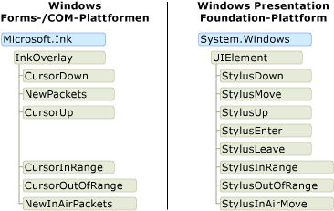
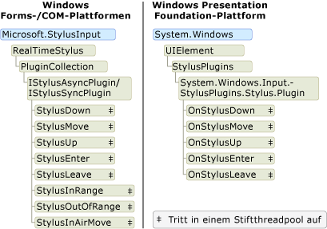

# Das Freihandobjektmodell: Windows Forms und COM im Vergleich zu WPF

Es gibt im Wesentlichen drei Plattformen, die Digital Ink unterstützen: die Tablet PC-Windows Forms Plattform, die Tablet PC-com-Plattform und die Windows Presentation Foundation (WPF)-Plattform.  Die Windows Forms-und com-Plattformen haben ein ähnliches Objektmodell, aber das Objektmodell für die WPF-Plattform unterscheidet sich erheblich.  In diesem Thema werden die Unterschiede auf hoher Ebene erläutert, damit Entwickler, die mit einem Objektmodell gearbeitet haben, die andere besser verstehen können.  
  
## Aktivieren von frei Hand Eingaben in einer Anwendung  
 Alle drei Plattformen liefern Objekte und Steuerelemente, die einer Anwendung ermöglichen, Eingaben von einem Tablettstift zu empfangen.  Die Windows Forms-und com-Plattformen werden mit den Klassen [Microsoft. Ink. InkPicture](https://docs.microsoft.com/previous-versions/dotnet/netframework-3.5/ms583740(v=vs.90)), [Microsoft. Ink. InkEdit](https://docs.microsoft.com/previous-versions/dotnet/netframework-3.5/ms552265(v=vs.90)), [Microsoft. Ink. InkOverlay](https://docs.microsoft.com/previous-versions/dotnet/netframework-3.5/ms552322(v=vs.90)) und [Microsoft. Ink. InkCollector](https://docs.microsoft.com/previous-versions/dotnet/netframework-3.5/ms583683(v=vs.90)) ausgeliefert.  [Microsoft. Ink. InkPicture](https://docs.microsoft.com/previous-versions/dotnet/netframework-3.5/ms583740(v=vs.90)) und [Microsoft. Ink. InkEdit](https://docs.microsoft.com/previous-versions/dotnet/netframework-3.5/ms552265(v=vs.90)) sind Steuerelemente, die Sie einer Anwendung hinzufügen können, um frei Hand Eingaben zu sammeln.  [Microsoft. Ink. InkOverlay](https://docs.microsoft.com/previous-versions/dotnet/netframework-3.5/ms552322(v=vs.90)) und [Microsoft. Ink. InkCollector](https://docs.microsoft.com/previous-versions/dotnet/netframework-3.5/ms583683(v=vs.90)) können an ein vorhandenes Fenster angefügt werden, um Windows-Steuerelemente und benutzerdefinierte Steuerelemente frei zu aktivieren.  
  
 Die WPF-Plattform enthält das <xref:System.Windows.Controls.InkCanvas>-Steuerelement.  Sie können der Anwendung einen <xref:System.Windows.Controls.InkCanvas> hinzufügen und sofort mit dem Sammeln von frei Hand Eingaben beginnen. Mit dem <xref:System.Windows.Controls.InkCanvas>kann der Benutzer frei Hand Eingaben kopieren, auswählen und die Größe ändern.  Sie können dem <xref:System.Windows.Controls.InkCanvas>weitere Steuerelemente hinzufügen, und der Benutzer kann auch über diese Steuerelemente hinaus schreiben.  Sie können ein benutzerdefiniertes benutzerdefiniertes Steuerelement erstellen, indem Sie ihm eine <xref:System.Windows.Controls.InkPresenter> hinzufügen und seine Tablettstiftpunkte sammeln.  
  
 In der folgenden Tabelle finden Sie Informationen zum Aktivieren von frei Hand Eingaben in einer Anwendung:  
  
|Zu diesem Zweck...|Auf der WPF-Plattform...|Auf den Windows Forms/com-Plattformen...|  
|-----------------|--------------------------|------------------------------------------|  
|Hinzufügen eines Freihand-aktivierten Steuer Elements zu einer Anwendung|Weitere Informationen finden Sie [unter Getting Started with Ink](getting-started-with-ink.md).|Siehe [Beispiel "Automatisches Anspruchsformular](/windows/desktop/tablet/auto-claims-form-sample) "|  
|Frei Hand Eingaben auf einem benutzerdefinierten Steuerelement aktivieren|Siehe [Erstellen eines](creating-an-ink-input-control.md)frei Hand Eingabe-Steuer Elements.|Weitere Informationen finden Sie unter [Ink](/windows/desktop/tablet/ink-clipboard-sample)|  
  
## Frei Hand Daten  
 Auf der Windows Forms-und der com-Plattform machen [Microsoft. Ink. InkCollector](https://docs.microsoft.com/previous-versions/dotnet/netframework-3.5/ms583683(v=vs.90)), [Microsoft. Ink. InkOverlay](https://docs.microsoft.com/previous-versions/dotnet/netframework-3.5/ms552322(v=vs.90)), [Microsoft. Ink. InkEdit](https://docs.microsoft.com/previous-versions/dotnet/netframework-3.5/ms552265(v=vs.90))und [Microsoft. Ink. InkPicture](https://docs.microsoft.com/previous-versions/dotnet/netframework-3.5/ms583740(v=vs.90)) jeweils ein [Microsoft. Ink. Ink](https://docs.microsoft.com/previous-versions/dotnet/netframework-3.5/ms583670(v=vs.90)) -Objekt verfügbar. Das [Microsoft. Ink. Ink](https://docs.microsoft.com/previous-versions/dotnet/netframework-3.5/ms583670(v=vs.90)) -Objekt enthält die Daten für ein oder mehrere [Microsoft. Ink. Stroke](https://docs.microsoft.com/previous-versions/dotnet/netframework-3.5/ms552692(v=vs.90)) -Objekte und stellt allgemeine Methoden und Eigenschaften zum Verwalten und Bearbeiten dieser Striche bereit.  Das [Microsoft. Ink. Ink](https://docs.microsoft.com/previous-versions/dotnet/netframework-3.5/ms583670(v=vs.90)) -Objekt verwaltet die Lebensdauer der darin enthaltenen Striche; Das [Microsoft. Ink. Ink](https://docs.microsoft.com/previous-versions/dotnet/netframework-3.5/ms583670(v=vs.90)) -Objekt erstellt und löscht die Striche, die es besitzt.  Jede [Microsoft. Ink. Stroke](https://docs.microsoft.com/previous-versions/dotnet/netframework-3.5/ms552692(v=vs.90)) hat einen Bezeichner, der innerhalb des übergeordneten [Microsoft. Ink. Ink](https://docs.microsoft.com/previous-versions/dotnet/netframework-3.5/ms583670(v=vs.90)) -Objekts eindeutig ist.  
  
 Auf der WPF-Plattform besitzt die <xref:System.Windows.Ink.Stroke?displayProperty=nameWithType>-Klasse die eigene Lebensdauer und verwaltet Sie. Eine Gruppe von <xref:System.Windows.Ink.Stroke> Objekten kann gemeinsam in einer <xref:System.Windows.Ink.StrokeCollection>gesammelt werden, die Methoden für häufige Freihand-Daten Verwaltungsvorgänge, z. b. Treffer Tests, das Löschen, Transformieren und Serialisieren der frei Hand Eingaben, bereitstellt. Eine <xref:System.Windows.Ink.Stroke> kann zu einem beliebigen Zeitpunkt zu 0 (null), einem oder mehreren <xref:System.Windows.Ink.StrokeCollection> Objekten gehören.  Anstelle eines [Microsoft. Ink. Ink](https://docs.microsoft.com/previous-versions/dotnet/netframework-3.5/ms583670(v=vs.90)) -Objekts enthalten die <xref:System.Windows.Controls.InkCanvas> und <xref:System.Windows.Controls.InkPresenter> eine <xref:System.Windows.Ink.StrokeCollection?displayProperty=nameWithType>.  
  
 Das folgende Paar von Abbildungen vergleicht die frei Hand Datenobjekt Modelle.  Auf den Windows Forms-und com-Plattformen schränkt das [Microsoft. Ink.](https://docs.microsoft.com/previous-versions/dotnet/netframework-3.5/ms583670(v=vs.90)) Ink-Objekt die Lebensdauer der [Microsoft. Ink. Stroke](https://docs.microsoft.com/previous-versions/dotnet/netframework-3.5/ms552692(v=vs.90)) -Objekte ein, und die Tablettstiftpakete gehören zu den einzelnen Strichen.  Zwei oder mehr Striche können auf dasselbe [Microsoft. Ink. DrawingAttributes](https://docs.microsoft.com/previous-versions/dotnet/netframework-3.5/ms583636(v=vs.90)) -Objekt verweisen, wie in der folgenden Abbildung dargestellt.  
  
   
  
 Auf dem [!INCLUDE[TLA2#tla_winclient](../../../../includes/tla2sharptla-winclient-md.md)]ist jede <xref:System.Windows.Ink.Stroke?displayProperty=nameWithType> ein Common Language Runtime Objekt, das vorhanden ist, solange ein Verweis darauf vorhanden ist.  Jede <xref:System.Windows.Ink.Stroke> verweist auf ein <xref:System.Windows.Input.StylusPointCollection> und <xref:System.Windows.Ink.DrawingAttributes?displayProperty=nameWithType> Objekt, die ebenfalls Common Language Runtime Objekte sind.  
  
   
  
 In der folgenden Tabelle wird das Ausführen einiger allgemeiner Aufgaben auf der WPF-Plattform und der Windows Forms-und com-Plattform verglichen.  
  
|Task|Windows Presentation Foundation|Windows Forms und com|  
|----------|-------------------------------------|---------------------------|  
|Freihand speichern|<xref:System.Windows.Ink.StrokeCollection.Save%2A>|[Microsoft.Ink.Ink.Save](https://docs.microsoft.com/previous-versions/dotnet/netframework-3.5/ms571335(v=vs.90))|  
|Ink laden|Erstellen Sie eine <xref:System.Windows.Ink.StrokeCollection> mit dem <xref:System.Windows.Ink.StrokeCollection.%23ctor%2A>-Konstruktor.|[Microsoft.Ink.Ink.Load](https://docs.microsoft.com/previous-versions/dotnet/netframework-3.5/ms569609(v=vs.90))|  
|Treffer Test|<xref:System.Windows.Ink.StrokeCollection.HitTest%2A>|[Microsoft.Ink.Ink.HitTest](https://docs.microsoft.com/previous-versions/dotnet/netframework-3.5/ms571330(v=vs.90))|  
|Freihand kopieren|<xref:System.Windows.Controls.InkCanvas.CopySelection%2A>|[Microsoft.Ink.Ink.ClipboardCopy](https://docs.microsoft.com/previous-versions/dotnet/netframework-3.5/ms571316(v=vs.90))|  
|Ink einfügen|<xref:System.Windows.Controls.InkCanvas.Paste%2A>|[Microsoft.Ink.Ink.ClipboardPaste](https://docs.microsoft.com/previous-versions/dotnet/netframework-3.5/ms571318(v=vs.90))|  
|Zugreifen auf benutzerdefinierte Eigenschaften für eine Auflistung von Strichen|<xref:System.Windows.Ink.StrokeCollection.AddPropertyData%2A> (die Eigenschaften werden intern gespeichert, und der Zugriff erfolgt über <xref:System.Windows.Ink.StrokeCollection.AddPropertyData%2A>, <xref:System.Windows.Ink.StrokeCollection.RemovePropertyData%2A>und <xref:System.Windows.Ink.StrokeCollection.ContainsPropertyData%2A>).|Verwenden von " [Microsoft. Ink. Ink. ExtendedProperties](https://docs.microsoft.com/previous-versions/dotnet/netframework-3.5/ms582214(v=vs.90)) "|  
  
### Freigeben von Hand Eingaben zwischen Plattformen  
 Obwohl die Plattformen über unterschiedliche Objekt Modelle für die frei Hand Daten verfügen, ist die gemeinsame Nutzung der Daten zwischen den Plattformen sehr einfach. In den folgenden Beispielen werden frei Hand Eingaben aus einer Windows Forms Anwendung gespeichert und in eine Windows Presentation Foundation Anwendung geladen.  
  
 [!code-csharp[WinFormWPFInk#UsingWinforms](~/samples/snippets/csharp/VS_Snippets_Wpf/WinformWPFInk/CSharp/Program.cs#usingwinforms)]
 [!code-vb[WinFormWPFInk#UsingWinforms](~/samples/snippets/visualbasic/VS_Snippets_Wpf/WinformWPFInk/VisualBasic/Module1.vb#usingwinforms)]  
[!code-csharp[WinFormWPFInk#SaveWinforms](~/samples/snippets/csharp/VS_Snippets_Wpf/WinformWPFInk/CSharp/Program.cs#savewinforms)]
[!code-vb[WinFormWPFInk#SaveWinforms](~/samples/snippets/visualbasic/VS_Snippets_Wpf/WinformWPFInk/VisualBasic/Module1.vb#savewinforms)]  
  
 [!code-csharp[WinFormWPFInk#UsingWPF](~/samples/snippets/csharp/VS_Snippets_Wpf/WinformWPFInk/CSharp/Program.cs#usingwpf)]
 [!code-vb[WinFormWPFInk#UsingWPF](~/samples/snippets/visualbasic/VS_Snippets_Wpf/WinformWPFInk/VisualBasic/Module1.vb#usingwpf)]  
[!code-csharp[WinFormWPFInk#LoadWPF](~/samples/snippets/csharp/VS_Snippets_Wpf/WinformWPFInk/CSharp/Program.cs#loadwpf)]
[!code-vb[WinFormWPFInk#LoadWPF](~/samples/snippets/visualbasic/VS_Snippets_Wpf/WinformWPFInk/VisualBasic/Module1.vb#loadwpf)]  
  
 In den folgenden Beispielen werden frei Hand Eingaben aus einer Windows Presentation Foundation Anwendung gespeichert und in eine Windows Forms Anwendung geladen.  
  
 [!code-csharp[WinFormWPFInk#UsingWPF](~/samples/snippets/csharp/VS_Snippets_Wpf/WinformWPFInk/CSharp/Program.cs#usingwpf)]
 [!code-vb[WinFormWPFInk#UsingWPF](~/samples/snippets/visualbasic/VS_Snippets_Wpf/WinformWPFInk/VisualBasic/Module1.vb#usingwpf)]  
[!code-csharp[WinFormWPFInk#SaveWPF](~/samples/snippets/csharp/VS_Snippets_Wpf/WinformWPFInk/CSharp/Program.cs#savewpf)]
[!code-vb[WinFormWPFInk#SaveWPF](~/samples/snippets/visualbasic/VS_Snippets_Wpf/WinformWPFInk/VisualBasic/Module1.vb#savewpf)]  
  
 [!code-csharp[WinFormWPFInk#UsingWinforms](~/samples/snippets/csharp/VS_Snippets_Wpf/WinformWPFInk/CSharp/Program.cs#usingwinforms)]
 [!code-vb[WinFormWPFInk#UsingWinforms](~/samples/snippets/visualbasic/VS_Snippets_Wpf/WinformWPFInk/VisualBasic/Module1.vb#usingwinforms)]  
[!code-csharp[WinFormWPFInk#LoadWinforms](~/samples/snippets/csharp/VS_Snippets_Wpf/WinformWPFInk/CSharp/Program.cs#loadwinforms)]
[!code-vb[WinFormWPFInk#LoadWinforms](~/samples/snippets/visualbasic/VS_Snippets_Wpf/WinformWPFInk/VisualBasic/Module1.vb#loadwinforms)]
## Ereignisse des Tablettstifts  

 Die [Microsoft. Ink. InkOverlay](https://docs.microsoft.com/previous-versions/dotnet/netframework-3.5/ms552322(v=vs.90)), [Microsoft. Ink. InkCollector](https://docs.microsoft.com/previous-versions/dotnet/netframework-3.5/ms583683(v=vs.90))und [Microsoft. Ink. InkPicture](https://docs.microsoft.com/previous-versions/dotnet/netframework-3.5/ms583740(v=vs.90)) auf der Windows Forms-und der com-Plattform empfangen Ereignisse, wenn der Benutzer Pen-Daten eingibt. [Microsoft. Ink. InkOverlay](https://docs.microsoft.com/previous-versions/dotnet/netframework-3.5/ms552322(v=vs.90)) oder [Microsoft. Ink. InkCollector](https://docs.microsoft.com/previous-versions/dotnet/netframework-3.5/ms583683(v=vs.90)) ist an ein Fenster oder ein Steuerelement angefügt und kann die Ereignisse abonnieren, die von den Tablet-Eingabedaten ausgelöst werden. Der Thread, in dem diese Ereignisse auftreten, hängt davon ab, ob die Ereignisse mit einem Stift, einer Maus oder Programm gesteuert ausgelöst werden. Weitere Informationen zum Threading in Bezug auf diese Ereignisse finden Sie unter [Allgemeine Threading Überlegungen](/windows/desktop/tablet/general-threading-considerations) und [Threads, auf die ein Ereignis](/windows/desktop/tablet/threads-on-which-an-event-can-fire)ausgelöst werden kann.  
  
 Auf der Windows Presentation Foundation Plattform enthält die <xref:System.Windows.UIElement>-Klasse Ereignisse für Stift Eingaben. Dies bedeutet, dass jedes Steuerelement den vollständigen Satz von Tablettstiftereignissen verfügbar macht.  Die Tablettstiftereignisse haben tunnelingereignisse und Blasen Ereignis Paare und treten immer im Anwendungs Thread auf.  Weitere Informationen finden Sie unter [Übersicht über Routing Ereignisse](routed-events-overview.md).  
  
 Das folgende Diagramm zeigt, wie die Objekt Modelle für die Klassen, die Stift-Ereignisse darstellen, verglichen werden. Das Windows Presentation Foundation-Objektmodell zeigt nur die bubblingereignisse an, nicht die Gegenspieler des tunnelingereignisses.  
  
   
  
## Stift Daten  
 Alle drei Plattformen bieten Ihnen die Möglichkeit, die Daten, die von einem Tablettstift stammen, abzufangen und zu bearbeiten.  Auf der Windows Forms-und der com-Plattform wird dies erreicht, indem ein [Microsoft. StylusInput. RealTimeStylus](https://docs.microsoft.com/previous-versions/dotnet/netframework-3.5/ms585724(v=vs.90))erstellt, ein Fenster oder ein Steuerelement an das Tool angehängt wird und eine Klasse erstellt wird, die die Schnittstelle [Microsoft. StylusInput. IStylusSyncPlugin](https://docs.microsoft.com/previous-versions/dotnet/netframework-3.5/ms575201(v=vs.90)) oder [Microsoft. StylusInput. IStylusAsyncPlugin](https://docs.microsoft.com/previous-versions/dotnet/netframework-3.5/ms575194(v=vs.90)) implementiert. Das benutzerdefinierte Plug-in wird dann der Plug-in-Sammlung von [Microsoft. StylusInput. RealTimeStylus](https://docs.microsoft.com/previous-versions/dotnet/netframework-3.5/ms585724(v=vs.90))hinzugefügt. Weitere Informationen zu diesem Objektmodell finden Sie unter [Architektur der StylusInput-APIs](/windows/desktop/tablet/architecture-of-the-stylusinput-apis).  
  
 Auf der WPF-Plattform stellt die <xref:System.Windows.UIElement>-Klasse eine Auflistung von Plug-Ins bereit, ähnlich wie beim Design von [Microsoft. StylusInput. RealTimeStylus](https://docs.microsoft.com/previous-versions/dotnet/netframework-3.5/ms585724(v=vs.90)).  Um Pen-Daten abzufangen, erstellen Sie eine Klasse, die von <xref:System.Windows.Input.StylusPlugIns.StylusPlugIn> erbt, und fügen das Objekt der <xref:System.Windows.UIElement.StylusPlugIns%2A> Auflistung der <xref:System.Windows.UIElement>hinzu. Weitere Informationen zu dieser Interaktion finden Sie unter [Abfangen von Eingaben des Tablettstifts](intercepting-input-from-the-stylus.md).  
  
 Auf allen Plattformen empfängt ein Thread Pool die frei Hand Daten über Tablettstiftereignisse und sendet diese an den Anwendungs Thread.  Weitere Informationen zum Threading auf den com-und Windows-Plattformen finden Sie unter [Threading Überlegungen für die StylusInput-APIs](/windows/desktop/tablet/threading-considerations-for-the-stylusinput-apis).  Weitere Informationen zum Threading der Windows Presentation Software finden Sie im frei Hand [Thread Modell](the-ink-threading-model.md).  
  
 In der folgenden Abbildung werden die Objekt Modelle für die Klassen verglichen, die die Stift Daten im Stift Thread Pool empfangen.  
  
 
