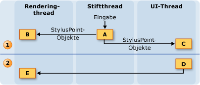
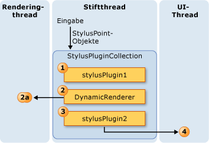
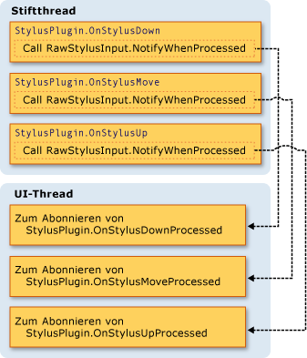
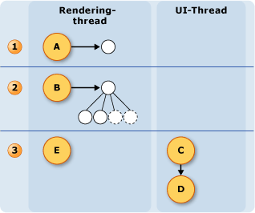

# Das Threadmodell für FreihandeingabenThe Ink Threading Model
Einer der Vorteile von Freihandeingaben auf einem Tablet PC ist, dass es viel wie beim Schreiben mit einem regulären Stift und Papier fühlt sich.One of the benefits of ink on a Tablet PC is that it feels a lot like writing with a regular pen and paper.  Um dies zu erreichen, erfasst der Tablettstift Eingabedaten sehr viel schneller als eine Maus und Freihandeingaben während des Schreibvorgangs rendert.To accomplish this, the tablet pen collects input data at a much higher rate than a mouse does and renders the ink as the user writes.  Thread (Benutzeroberflächenthread) der Anwendung ist nicht für das Sammeln von Daten und zum Rendern von Freihandeingaben, ausreichend, da er blockiert werden kann.The application's user interface (UI) thread is not sufficient for collecting pen data and rendering ink, because it can become blocked.  Um dies zu lösen eine [!INCLUDE[TLA2#tla_winclient](../../../../includes/tla2sharptla-winclient-md.md)] Anwendung verwendet zwei zusätzliche Threads aus, wenn der Freihandeingabe.To solve this, a [!INCLUDE[TLA2#tla_winclient](../../../../includes/tla2sharptla-winclient-md.md)] application uses two additional threads when a user writes ink.  
  
 Die folgende Liste beschreibt die Threads, die dadurch beim Sammeln und Rendern von Freihandeingaben schleifenspezifischen:The following list describes the threads that take part in collecting and rendering digital ink:  
  
-   Stiftthread - Threads, der Eingabe des Tablettstifts verwendet wird.Pen thread - the thread that takes input from the stylus.  (Klicken Sie in der Praxis sieht ein Threadpool, aber dieses Thema bezieht sich darauf, wie einem Stiftthread.)(In reality, this is a thread pool, but this topic refers to it as a pen thread.)  
  
-   Anwendungsbenutzeroberflächenthread - Threads, der die Benutzeroberfläche der Anwendung steuert.Application user interface thread - the thread that controls the user interface of the application.  
  
-   Thread für dynamisches Rendering - zeichnet der Thread, der rendert Freihandeingaben während der Benutzer einen Strich.Dynamic rendering thread - the thread that renders the ink while the user draws a stroke. Der Thread für dynamisches Rendering unterscheidet sich der Thread, der andere Benutzeroberflächenelemente für die Anwendung, gerendert werden, wie in Windows Presentation Foundation [Threading-Modell](threading-model.md).The dynamic rendering thread is different than the thread that renders other UI elements for the application, as mentioned in Window Presentation Foundation [Threading Model](threading-model.md).  
  
 Das bereitgestelltem Modell ist identisch, ob die Anwendung verwendet die <xref:System.Windows.Controls.InkCanvas> oder ein benutzerdefiniertes Steuerelement im ähnelt [erstellen ein Steuerelement für Freihandeingaben](creating-an-ink-input-control.md).The inking model is the same whether the application uses the <xref:System.Windows.Controls.InkCanvas> or a custom control similar to the one in [Creating an Ink Input Control](creating-an-ink-input-control.md).  Obwohl in diesem Thema wird das Threading behandeln, in Form von der <xref:System.Windows.Controls.InkCanvas>, die gleichen Konzepte gelten, wenn Sie ein benutzerdefiniertes Steuerelement erstellen.Although this topic discusses threading in terms of the <xref:System.Windows.Controls.InkCanvas>, the same concepts apply when you create a custom control.  
  
## Übersicht über ThreadingThreading Overview  
 Das folgende Diagramm veranschaulicht das Threadingmodell auf, wenn ein Benutzer einen Strich zeichnet:The following diagram illustrates the threading model when a user draws a stroke:  
  
   
  
1. Aktionen, die auftreten, während des Zeichnens durch des BenutzersActions occurring while the user draws the stroke  
  
    1.  Wenn der Benutzer einen Strich zeichnet, gibt die Tablettstiftpunkte im Stiftthread.When the user draws a stroke, the stylus points come in on the pen thread.  Stift-Plug-ins, einschließlich der <xref:System.Windows.Input.StylusPlugIns.DynamicRenderer>, akzeptieren Sie die Tablettstiftpunkte im Stiftthread und haben die Möglichkeit, die sie vor dem Ändern der <xref:System.Windows.Controls.InkCanvas> Empfangs.Stylus plug-ins, including the <xref:System.Windows.Input.StylusPlugIns.DynamicRenderer>, accept the stylus points on the pen thread and have the chance to modify them before the <xref:System.Windows.Controls.InkCanvas> receives them.  
  
    2.  Die <xref:System.Windows.Input.StylusPlugIns.DynamicRenderer> die Tablettstiftpunkte, die auf den Thread für dynamisches Rendering gerendert.The <xref:System.Windows.Input.StylusPlugIns.DynamicRenderer> renders the stylus points on the dynamic rendering thread. Dies geschieht zur gleichen Zeit wie im vorherigen Schritt.This happens at the same time as the previous step.  
  
    3.  Die <xref:System.Windows.Controls.InkCanvas> empfängt die Tablettstiftpunkte, die im UI-Thread.The <xref:System.Windows.Controls.InkCanvas> receives the stylus points on the UI thread.  
  
2. Aktionen, die auftreten, nachdem der Benutzer der Strich beendet.Actions occurring after the user ends the stroke  
  
    1.  Strich gezeichnet hat, nach Abschluss der Benutzer die <xref:System.Windows.Controls.InkCanvas> erstellt eine <xref:System.Windows.Ink.Stroke> -Objekt und fügt es der <xref:System.Windows.Controls.InkPresenter>, die statisch gerendert wird.When the user finishes drawing the stroke, the <xref:System.Windows.Controls.InkCanvas> creates a <xref:System.Windows.Ink.Stroke> object and adds it to the <xref:System.Windows.Controls.InkPresenter>, which statically renders it.  
  
    2.  Die UI-Thread-Warnungen der <xref:System.Windows.Input.StylusPlugIns.DynamicRenderer> , der der Strich gerendert wird statisch, sodass die <xref:System.Windows.Input.StylusPlugIns.DynamicRenderer> entfernt dessen visuelle Darstellung des Strichs.The UI thread alerts the <xref:System.Windows.Input.StylusPlugIns.DynamicRenderer> that the stroke is statically rendered, so the <xref:System.Windows.Input.StylusPlugIns.DynamicRenderer> removes its visual representation of the stroke.  
  
## Erfassen von Freihandeingaben Sie und Stift-Plug-insInk collection and Stylus Plug-ins  
 Jede <xref:System.Windows.UIElement> verfügt über eine <xref:System.Windows.Input.StylusPlugIns.StylusPlugInCollection>.Each <xref:System.Windows.UIElement> has a <xref:System.Windows.Input.StylusPlugIns.StylusPlugInCollection>.  Die <xref:System.Windows.Input.StylusPlugIns.StylusPlugIn> Objekte in der <xref:System.Windows.Input.StylusPlugIns.StylusPlugInCollection> erhalten, und die Tablettstiftpunkte im Stiftthread ändern können.The <xref:System.Windows.Input.StylusPlugIns.StylusPlugIn> objects in the <xref:System.Windows.Input.StylusPlugIns.StylusPlugInCollection> receive and can modify the stylus points on the pen thread. Die <xref:System.Windows.Input.StylusPlugIns.StylusPlugIn> Objekte empfangen, die Tablettstiftpunkte entsprechend ihrer Reihenfolge in der <xref:System.Windows.Input.StylusPlugIns.StylusPlugInCollection>.The <xref:System.Windows.Input.StylusPlugIns.StylusPlugIn> objects receive the stylus points according to their order in the <xref:System.Windows.Input.StylusPlugIns.StylusPlugInCollection>.  
  
 Das folgende Diagramm veranschaulicht die hypothetische Situation, in dem die <xref:System.Windows.UIElement.StylusPlugIns%2A> Auflistung von eine <xref:System.Windows.UIElement> enthält `stylusPlugin1`, eine <xref:System.Windows.Input.StylusPlugIns.DynamicRenderer>, und `stylusPlugin2`in dieser Reihenfolge.The following diagram illustrates the hypothetical situation where the <xref:System.Windows.UIElement.StylusPlugIns%2A> collection of a <xref:System.Windows.UIElement> contains `stylusPlugin1`, a <xref:System.Windows.Input.StylusPlugIns.DynamicRenderer>, and `stylusPlugin2`, in that order.  
  
   
  
 In der vorherigen Abbildung findet folgendes statt:In the previous diagram, the following behavior takes place:  
  
1. `StylusPlugin1` Ändert die Werte für x und y.`StylusPlugin1` modifies the values for x and y.  
  
2. <xref:System.Windows.Input.StylusPlugIns.DynamicRenderer> die geänderte Tablettstiftpunkte empfangen, und klicken Sie auf der Thread für dynamisches Rendering gerendert.<xref:System.Windows.Input.StylusPlugIns.DynamicRenderer> receives the modified stylus points and renders them on the dynamic rendering thread.  
  
3. `StylusPlugin2` die geänderte Tablettstiftpunkte empfangen und weitere ändert die Werte für x und y.`StylusPlugin2` receives the modified stylus points and further modifies the values for x and y.  
  
4. Die Anwendung die Tablettstiftpunkte erfasst, und wenn der Benutzer den Strich, beendet der Strich statisch gerendert.The application collects the stylus points, and, when the user finishes the stroke, statically renders the stroke.  
  
 Nehmen wir an, die `stylusPlugin1` schränkt die Tablettstiftpunkte, die ein Rechteck und `stylusPlugin2` übersetzt die Tablettstiftpunkte, die auf der rechten Seite.Suppose that `stylusPlugin1` restricts the stylus points to a rectangle and `stylusPlugin2` translates the stylus points to the right.  Im vorherigen Szenario das <xref:System.Windows.Input.StylusPlugIns.DynamicRenderer> empfängt die eingeschränkten Tablettstiftpunkte, jedoch nicht die übersetzten Tablettstiftpunkte.In the previous scenario, the <xref:System.Windows.Input.StylusPlugIns.DynamicRenderer> receives the restricted stylus points, but not the translated stylus points.  Wenn der Benutzer einen Strich zeichnet, innerhalb der Grenzen des Rechtecks der Strich gerendert wird, aber der Strich nicht übersetzt werden, bis der Benutzer den Stift wird angezeigt.When the user draws the stroke, the stroke is rendered within the bounds of the rectangle, but the stroke doesn't appear to be translated until the user lifts the pen.  
  
### Ausführen von Vorgängen mit einem Stift-Plug-in im UI-threadPerforming operations with a Stylus Plug-in on the UI thread  
 Da genauer Treffertest für den Stiftthread ausgeführt werden kann, möglicherweise einige Elemente gelegentlich nastala chyba vstupu für andere Elemente vorgesehen sind.Because accurate hit-testing cannot be performed on the pen thread, some elements might occasionally receive stylus input intended for other elements. Wenn Sie sicherstellen, dass die Eingabe ordnungsgemäß weitergeleitet wurde, bevor Sie einen Vorgang ausführen möchten, abonnieren und führen Sie den Vorgang in der <xref:System.Windows.Input.StylusPlugIns.StylusPlugIn.OnStylusDownProcessed%2A>, <xref:System.Windows.Input.StylusPlugIns.StylusPlugIn.OnStylusMoveProcessed%2A>, oder <xref:System.Windows.Input.StylusPlugIns.StylusPlugIn.OnStylusUpProcessed%2A> Methode.If you need to make sure the input was routed correctly before performing an operation, subscribe to and perform the operation in the <xref:System.Windows.Input.StylusPlugIns.StylusPlugIn.OnStylusDownProcessed%2A>, <xref:System.Windows.Input.StylusPlugIns.StylusPlugIn.OnStylusMoveProcessed%2A>, or <xref:System.Windows.Input.StylusPlugIns.StylusPlugIn.OnStylusUpProcessed%2A> method. Diese Methoden werden vom Thread Anwendung aufgerufen, nachdem die genauer Treffertest ausgeführt wurde.These methods are invoked by the application thread after accurate hit-testing has been performed. Rufen Sie zum Abonnieren dieser Methoden die <xref:System.Windows.Input.StylusPlugIns.RawStylusInput.NotifyWhenProcessed%2A> -Methode in der die Methode, die auf den Stiftthread auftritt.To subscribe to these methods, call the <xref:System.Windows.Input.StylusPlugIns.RawStylusInput.NotifyWhenProcessed%2A> method in the method that occurs on the pen thread.  
  
 Das folgende Diagramm veranschaulicht die Beziehung zwischen der Stiftthread und UI-Thread in Bezug auf den Stift-Ereignissen von einem <xref:System.Windows.Input.StylusPlugIns.StylusPlugIn>.The following diagram illustrates the relationship between the pen thread and UI thread with respect to the stylus events of a <xref:System.Windows.Input.StylusPlugIns.StylusPlugIn>.  
  
   
  
## Rendern von FreihandeingabenRendering Ink  
 Wenn der Benutzer einen Strich zeichnet <xref:System.Windows.Input.StylusPlugIns.DynamicRenderer> rendert Freihandeingaben auf einem separaten Thread aus, sodass die Freihandeingaben angezeigt wird, um "des Stifts flow" selbst, wenn der UI-Thread ausgelastet ist.As the user draws a stroke, <xref:System.Windows.Input.StylusPlugIns.DynamicRenderer> renders the ink on a separate thread so the ink appears to "flow" from the pen even when the UI thread is busy.  Die <xref:System.Windows.Input.StylusPlugIns.DynamicRenderer> der Thread für dynamisches Rendering eine visuelle Struktur basiert, wie sie die Tablettstiftpunkte erfasst.The <xref:System.Windows.Input.StylusPlugIns.DynamicRenderer> builds a visual tree on the dynamic rendering thread as it collects stylus points.  Wenn der Benutzer der Strich beendet die <xref:System.Windows.Input.StylusPlugIns.DynamicRenderer> fordert benachrichtigt werden, wenn die Anwendung mit den nächsten Renderingdurchlauf ist.When the user finishes the stroke, the <xref:System.Windows.Input.StylusPlugIns.DynamicRenderer> asks to be notified when the application does the next rendering pass.  Nachdem die Anwendung mit den nächsten Renderingdurchlauf abgeschlossen wurde die <xref:System.Windows.Input.StylusPlugIns.DynamicRenderer> der visuellen Struktur bereinigt.After the application completes the next rendering pass, the <xref:System.Windows.Input.StylusPlugIns.DynamicRenderer> cleans up its visual tree.  Das folgende Diagramm veranschaulicht diesen Prozess.The following diagram illustrates this process.  
  
   
  
1. Der Benutzer mit den Strich beginnt.The user begins the stroke.  
  
    1.  Die <xref:System.Windows.Input.StylusPlugIns.DynamicRenderer> erstellt die visuelle Struktur.The <xref:System.Windows.Input.StylusPlugIns.DynamicRenderer> creates the visual tree.  
  
2. Der Benutzer ist den Strich gezeichnet werden.The user is drawing the stroke.  
  
    1.  Die <xref:System.Windows.Input.StylusPlugIns.DynamicRenderer> erstellt die visuelle Struktur.The <xref:System.Windows.Input.StylusPlugIns.DynamicRenderer> builds the visual tree.  
  
3. Der Benutzer beendet den Strich.The user ends the stroke.  
  
    1.  Die <xref:System.Windows.Controls.InkPresenter> der visuellen Struktur den Strich hinzugefügt.The <xref:System.Windows.Controls.InkPresenter> adds the stroke to its visual tree.  
  
    2.  Der Media-Integration-Ebene (MIL) rendert statisch die Striche.The Media Integration Layer (MIL) statically renders the strokes.  
  
    3.  Die <xref:System.Windows.Input.StylusPlugIns.DynamicRenderer> bereinigt die visuellen Elemente.The <xref:System.Windows.Input.StylusPlugIns.DynamicRenderer> cleans up the visuals.
