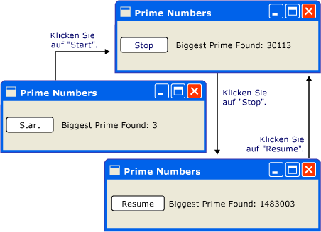
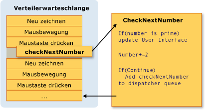
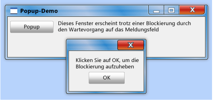
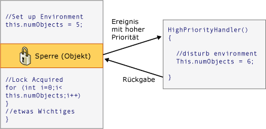

# Threading-Modell
[!INCLUDE[TLA#tla_winclient](../../../../includes/tlasharptla-winclient-md.md)] soll Entwicklern bei Problemen mit Threading helfen. Als Ergebnis der meisten [!INCLUDE[TLA2#tla_winclient](../../../../includes/tla2sharptla-winclient-md.md)] -Entwickler müssen eine Schnittstelle zu schreiben, mehrere Threads verwendet. Da Multithreadprogramme komplex und schwierig zu debuggen sind, sollten sie vermieden werden, wenn Singlethread-Lösungen vorhanden sind.  
  
 Ganz gleich, wie gut ausgelegt, jedoch keine [!INCLUDE[TLA2#tla_ui](../../../../includes/tla2sharptla-ui-md.md)] Framework wird nie in der Lage, eine Singlethread-Lösung für jede Art von Problem bereitzustellen. [!INCLUDE[TLA2#tla_winclient](../../../../includes/tla2sharptla-winclient-md.md)] Schließen, stammen, aber es noch Situationen sind, in denen mehrere Threads verbessern [!INCLUDE[TLA#tla_ui](../../../../includes/tlasharptla-ui-md.md)] Leistung Reaktionsfähigkeit oder Anwendung. In diesem Artikel werden zunächst einige Hintergrundinformationen angegeben, dann einige dieser Situationen beschrieben und am Ende einige Details auf niedriger Ebene besprochen.  
  

  
> [!NOTE]
>  In diesem Thema wird erläutert, threading mithilfe der <xref:System.Windows.Threading.Dispatcher.BeginInvoke%2A> Methode zum asynchronen Aufrufen. Sie können auch asynchrone Aufrufe vornehmen, durch Aufrufen der <xref:System.Windows.Threading.Dispatcher.InvokeAsync%2A> -Methode, die Ausführen einer <xref:System.Action> oder <xref:System.Func%601> als Parameter.  Die <xref:System.Windows.Threading.Dispatcher.InvokeAsync%2A> Methode gibt ein <xref:System.Windows.Threading.DispatcherOperation> oder <xref:System.Windows.Threading.DispatcherOperation%601>, verfügt über eine <xref:System.Windows.Threading.DispatcherOperation.Task%2A> Eigenschaft. Können Sie die `await` Schlüsselwort entweder mit der <xref:System.Windows.Threading.DispatcherOperation> oder die zugeordnete <xref:System.Threading.Tasks.Task>. Wenn Sie synchron auf das <xref:System.Threading.Tasks.Task> warten müssen, das von <xref:System.Windows.Threading.DispatcherOperation> oder <xref:System.Windows.Threading.DispatcherOperation%601> zurückgegeben wird, rufen Sie die <xref:System.Windows.Threading.TaskExtensions.DispatcherOperationWait%2A>-Erweiterungsmethode auf.  Aufrufen von <xref:System.Threading.Tasks.Task.Wait%2A?displayProperty=nameWithType> führt zu einem Deadlock. Weitere Informationen zum Verwenden einer <xref:System.Threading.Tasks.Task> zum Ausführen von asynchronen Vorgängen finden Sie unter Aufgabenparallelität.  Die <xref:System.Windows.Threading.Dispatcher.Invoke%2A> Methode verfügt auch über Überladungen, ein <xref:System.Action> oder <xref:System.Func%601> als Parameter.  Sie können die <xref:System.Windows.Threading.Dispatcher.Invoke%2A> Methode zum Erstellen von synchronen aufruft, durch die Übergabe in einem Delegaten, <xref:System.Action> oder <xref:System.Func%601>.  
  
   
## Übersicht und Verteiler  
 In der Regel [!INCLUDE[TLA2#tla_winclient](../../../../includes/tla2sharptla-winclient-md.md)] Anwendungen beginnen mit zwei Threads: eine für die Behandlung von Rendering- und eine andere für die Verwaltung der [!INCLUDE[TLA2#tla_ui](../../../../includes/tla2sharptla-ui-md.md)]. Im Renderingthread ausgeführt effektiv verborgen im Hintergrund während der [!INCLUDE[TLA2#tla_ui](../../../../includes/tla2sharptla-ui-md.md)] Thread empfängt Eingaben, Ereignisse behandelt, den Bildschirm zeichnet und Anwendungscode ausführt. Die meisten Anwendungen verwenden eine einzelne [!INCLUDE[TLA2#tla_ui](../../../../includes/tla2sharptla-ui-md.md)] thread, obwohl es in einigen Situationen empfiehlt sich, mehrere ist. Dies wird weiter unten mit einem Beispiel erläutert.  
  
 Die [!INCLUDE[TLA2#tla_ui](../../../../includes/tla2sharptla-ui-md.md)] Thread Warteschlangen Typen von Arbeitsaufgaben in einem Objekt namens eine <xref:System.Windows.Threading.Dispatcher>. Vom <xref:System.Windows.Threading.Dispatcher> werden Arbeitsaufgaben nach Priorität ausgewählt und jeweils vollständig ausgeführt.  Jede [!INCLUDE[TLA2#tla_ui](../../../../includes/tla2sharptla-ui-md.md)] Thread benötigen mindestens ein <xref:System.Windows.Threading.Dispatcher>, und jede <xref:System.Windows.Threading.Dispatcher> Arbeitsaufgaben in genau einem Thread ausgeführt werden kann.  
  
 Der Trick reaktionsfähige, benutzerfreundliche Anwendungen erstellen wird zum Maximieren der <xref:System.Windows.Threading.Dispatcher> Durchsatz klein bleiben, die Arbeitsaufgaben. Diese Elemente veralten der <xref:System.Windows.Threading.Dispatcher> Warteschlange Verarbeitung warten. Jede spürbare Verzögerung zwischen Eingabe und Antwort kann für einen Benutzer frustrierend sein.  
  
 Klicken Sie dann wie sind [!INCLUDE[TLA2#tla_winclient](../../../../includes/tla2sharptla-winclient-md.md)] Anwendungen big Vorgänge durchgeführt werden soll? Was geschieht, wenn der Code eine aufwändige Berechnung beinhaltet oder eine Abfrage einer Datenbank auf einem Remoteserver ausführen muss? In der Regel wird die Antwort zum Verarbeiten der big-Vorgangs in einem separaten Thread, wodurch die [!INCLUDE[TLA2#tla_ui](../../../../includes/tla2sharptla-ui-md.md)] Thread frei, um auf Elemente in der Regel die <xref:System.Windows.Threading.Dispatcher> Warteschlange. Wenn der umfangreiche Vorgang abgeschlossen ist, meldet sie das Ergebnis an die [!INCLUDE[TLA2#tla_ui](../../../../includes/tla2sharptla-ui-md.md)] Thread für die Anzeige.  
  
 In der Vergangenheit [!INCLUDE[TLA#tla_mswin](../../../../includes/tlasharptla-mswin-md.md)] ermöglicht [!INCLUDE[TLA2#tla_ui](../../../../includes/tla2sharptla-ui-md.md)] Elemente nur durch den Thread zugegriffen werden kann, die sie erstellt wurden. Dies bedeutet, dass ein Hintergrundthread bei einer Aufgabe mit langer Laufzeit kein Textfeld aktualisieren kann, wenn er abgeschlossen ist. [!INCLUDE[TLA#tla_mswin](../../../../includes/tlasharptla-mswin-md.md)] ist diese Option, um die Integrität gewährleistet [!INCLUDE[TLA2#tla_ui](../../../../includes/tla2sharptla-ui-md.md)] Komponenten. Ein Listenfeld könnte merkwürdig aussehen, wenn sein Inhalt während des Zeichnens von einem Hintergrundthread aktualisiert werden würde.  
  
 [!INCLUDE[TLA2#tla_winclient](../../../../includes/tla2sharptla-winclient-md.md)] verfügt über einen integrierten gegenseitigen Ausschlussmechanismus, der diese Koordination erzwingt. Die meisten Klassen in [!INCLUDE[TLA2#tla_winclient](../../../../includes/tla2sharptla-winclient-md.md)] abgeleitet <xref:System.Windows.Threading.DispatcherObject>. Bei der Konstruktion einer <xref:System.Windows.Threading.DispatcherObject> speichert einen Verweis auf die <xref:System.Windows.Threading.Dispatcher> mit den derzeit ausgeführten Thread verknüpft. Tatsächlich die <xref:System.Windows.Threading.DispatcherObject> ordnet dem Thread, der es erstellt. Während der Ausführung des Programms einer <xref:System.Windows.Threading.DispatcherObject> kann seinen öffentlichen Aufrufen <xref:System.Windows.Threading.DispatcherObject.VerifyAccess%2A> Methode. <xref:System.Windows.Threading.DispatcherObject.VerifyAccess%2A> überprüft die <xref:System.Windows.Threading.Dispatcher> dem aktuellen Thread zugeordnet, und vergleicht ihn mit der <xref:System.Windows.Threading.Dispatcher> Referenz, die während der Konstruktion gespeichert. Wenn sie nicht übereinstimmen, <xref:System.Windows.Threading.DispatcherObject.VerifyAccess%2A> löst eine Ausnahme aus. <xref:System.Windows.Threading.DispatcherObject.VerifyAccess%2A> am Anfang jeder Methode aufgerufen werden soll eine <xref:System.Windows.Threading.DispatcherObject>.  
  
 Wenn nur ein Thread ändern, kann die [!INCLUDE[TLA2#tla_ui](../../../../includes/tla2sharptla-ui-md.md)], wie interagieren Hintergrundthreads mit dem Benutzer? Bitten Sie ein Hintergrundthread kann die [!INCLUDE[TLA2#tla_ui](../../../../includes/tla2sharptla-ui-md.md)] Thread zum Ausführen eines Vorgangs in dessen Auftrag aufzubauen. Dies geschieht, indem Sie eine Arbeitsaufgabe mit registriert die <xref:System.Windows.Threading.Dispatcher> von der [!INCLUDE[TLA2#tla_ui](../../../../includes/tla2sharptla-ui-md.md)] Thread. Die <xref:System.Windows.Threading.Dispatcher> Klasse bietet zwei Methoden zum Registrieren von Arbeitsaufgaben: <xref:System.Windows.Threading.Dispatcher.Invoke%2A> und <xref:System.Windows.Threading.Dispatcher.BeginInvoke%2A>. Beide Methoden planen einen Delegaten für die Ausführung ein. <xref:System.Windows.Threading.Dispatcher.Invoke%2A> ist ein synchroner Aufruf – d. h. es ist nicht erst zurückgegeben, wenn die [!INCLUDE[TLA2#tla_ui](../../../../includes/tla2sharptla-ui-md.md)] Thread tatsächlich die Ausführung der Delegat abgeschlossen ist. <xref:System.Windows.Threading.Dispatcher.BeginInvoke%2A> ist asynchron und kehrt sofort zurück.  
  
 Die <xref:System.Windows.Threading.Dispatcher> ordnet die Elemente in seiner Warteschlange nach Priorität. Es werden zehn Stufen, die beim Hinzufügen eines Elements angegeben werden können die <xref:System.Windows.Threading.Dispatcher> Warteschlange. Diese Prioritäten werden beibehalten, der <xref:System.Windows.Threading.DispatcherPriority> Enumeration. Ausführliche Informationen zu <xref:System.Windows.Threading.DispatcherPriority> Ebenen finden Sie in der [!INCLUDE[TLA2#tla_winfxsdk](../../../../includes/tla2sharptla-winfxsdk-md.md)] Dokumentation.  
  
   
## Threads in Aktion: Beispiele  
  
   
### Eine Singlethread-Anwendung mit einer Berechnung mit langer Laufzeit  
 Die meisten [!INCLUDE[TLA#tla_gui#plural](../../../../includes/tlasharptla-guisharpplural-md.md)] verbringen einen großen Teil ihrer Zeit im Leerlauf, beim Warten auf Ereignisse, die in Reaktion auf Benutzerinteraktionen generiert werden. Eine sorgfältige Programmierung mit diesem Leerlaufzeit genutzt werden konstruktive Arbeit, ohne Auswirkungen auf die Reaktionsfähigkeit der [!INCLUDE[TLA2#tla_ui](../../../../includes/tla2sharptla-ui-md.md)]. Die [!INCLUDE[TLA2#tla_winclient](../../../../includes/tla2sharptla-winclient-md.md)] Threadingmodell lässt nicht die Eingabe für einen Vorgang im Unterbrechen der [!INCLUDE[TLA2#tla_ui](../../../../includes/tla2sharptla-ui-md.md)] Thread. Dies bedeutet, Sie müssen unbedingt zum Zurückgeben der <xref:System.Windows.Threading.Dispatcher> in regelmäßigen Abständen den Prozess ausstehende Eingabeereignisse, bevor sie veralten.  
  
 Betrachten Sie das folgende Beispiel:  
  
   
  
 Diese einfache Anwendung zählt ab drei aufwärts und sucht dabei nach Primzahlen. Wenn der Benutzer klickt auf die **starten** Schaltfläche, um die Suche beginnt. Wenn das Programm eine Primzahl findet, wird die Benutzeroberfläche mit dieser Entdeckung aktualisiert. Der Benutzer kann die Suche zu jedem Zeitpunkt beenden.  
  
 Obwohl es sich um eine einfache Anwendung handelt, könnte die Suche nach Primzahlen endlos fortgesetzt werden, was einige Probleme bereitet.  Wenn wir die gesamte Suche innerhalb der Click-Ereignishandler der Schaltfläche behandelt, es würde nie zur Verfügung stellen die [!INCLUDE[TLA2#tla_ui](../../../../includes/tla2sharptla-ui-md.md)] thread eine Möglichkeit, andere Ereignisse zu behandeln. Die [!INCLUDE[TLA2#tla_ui](../../../../includes/tla2sharptla-ui-md.md)] wäre nicht reagieren, Eingabe- oder Prozess Nachrichten. Sie würde nie neu zeichnen und nie auf Mausklicks auf die Schaltflächen reagieren.  
  
 Wir könnten die Suche nach Primzahlen in einem separaten Thread ausführen, aber dann hätten wir Synchronisierungsprobleme. Mit einem Singlethread-Ansatz können wir die Bezeichnung, die die größte gefundene Primzahl auflistet, direkt aktualisieren.  
  
 Wenn die in überschaubare Abschnitte aufgeteilt wird, können wir in regelmäßigen Abständen zurück zu den <xref:System.Windows.Threading.Dispatcher> Ereignisse und zu verarbeiten. Vergeben wir [!INCLUDE[TLA2#tla_winclient](../../../../includes/tla2sharptla-winclient-md.md)] Gelegenheit zum Aktualisieren und Verarbeiten der Eingabe.  
  
 Ist die beste Möglichkeit, die Verarbeitungszeit zwischen der Berechnung und der Ereignisbehandlung aufzuteilen Berechnung von der Verwaltung der <xref:System.Windows.Threading.Dispatcher>. Mithilfe der <xref:System.Windows.Threading.Dispatcher.BeginInvoke%2A> -Methode, können wir Primzahl Überprüfungen planen identisch, die in die Warteschlange [!INCLUDE[TLA2#tla_ui](../../../../includes/tla2sharptla-ui-md.md)] Ereignisse stammen aus. In unserem Beispiel planen wir nur eine einzige Primzahlüberprüfung zu einem Zeitpunkt ein. Nach Abschluss der Primzahlüberprüfung planen wir sofort die nächste Überprüfung ein. Diese Überprüfung fortgesetzt, nachdem ausstehende [!INCLUDE[TLA2#tla_ui](../../../../includes/tla2sharptla-ui-md.md)] behandelt wurden.  
  
   
  
 [!INCLUDE[TLA#tla_word](../../../../includes/tlasharptla-word-md.md)] führt die Rechtschreibprüfung mithilfe dieses Mechanismus durch. Rechtschreibprüfung erfolgt im Hintergrund in die Leerlaufzeit an, der die [!INCLUDE[TLA2#tla_ui](../../../../includes/tla2sharptla-ui-md.md)] Thread. Sehen wir uns den Code an.  
  
 Das folgende Beispiel zeigt die XAML, die die Benutzeroberfläche erstellt.  
  
 [!code-xaml[ThreadingPrimeNumbers#ThreadingPrimeNumberXAML](../../../../samples/snippets/csharp/VS_Snippets_Wpf/ThreadingPrimeNumbers/CSharp/Window1.xaml#threadingprimenumberxaml)]  
  
 Im folgenden Beispiel wird das CodeBehind gezeigt.  
  
 [!code-csharp[ThreadingPrimeNumbers#ThreadingPrimeNumberCodeBehind](../../../../samples/snippets/csharp/VS_Snippets_Wpf/ThreadingPrimeNumbers/CSharp/Window1.xaml.cs#threadingprimenumbercodebehind)]
 [!code-vb[ThreadingPrimeNumbers#ThreadingPrimeNumberCodeBehind](../../../../samples/snippets/visualbasic/VS_Snippets_Wpf/ThreadingPrimeNumbers/visualbasic/mainwindow.xaml.vb#threadingprimenumbercodebehind)]  
  
 Im folgenden Beispiel wird des ereignishandlers für das <xref:System.Windows.Controls.Button>.  
  
 [!code-csharp[ThreadingPrimeNumbers#ThreadingPrimeNumberStartOrStop](../../../../samples/snippets/csharp/VS_Snippets_Wpf/ThreadingPrimeNumbers/CSharp/Window1.xaml.cs#threadingprimenumberstartorstop)]
 [!code-vb[ThreadingPrimeNumbers#ThreadingPrimeNumberStartOrStop](../../../../samples/snippets/visualbasic/VS_Snippets_Wpf/ThreadingPrimeNumbers/visualbasic/mainwindow.xaml.vb#threadingprimenumberstartorstop)]  
  
 Neben dem Aktualisieren des Textes in der <xref:System.Windows.Controls.Button>, dieser Handler ist verantwortlich für die Planung der ersten Überprüfung der Primzahl durch Hinzufügen ein Delegaten an die <xref:System.Windows.Threading.Dispatcher> Warteschlange. Nachdem dieser Ereignishandler seine Arbeit abgeschlossen hat die <xref:System.Windows.Threading.Dispatcher> wählt diesen Delegaten für die Ausführung.  
  
 Wie bereits erwähnt <xref:System.Windows.Threading.Dispatcher.BeginInvoke%2A> ist die <xref:System.Windows.Threading.Dispatcher> Member verwendet, um einen Delegaten für die Ausführung zu planen. In diesem Fall wählen wir die <xref:System.Windows.Threading.DispatcherPriority.SystemIdle> Priorität. Die <xref:System.Windows.Threading.Dispatcher> führt dieser Delegat nur, wenn keine wichtige Ereignisse zum Verarbeiten vorhanden sind. [!INCLUDE[TLA2#tla_ui](../../../../includes/tla2sharptla-ui-md.md)]-Reaktionsfähigkeit ist wichtiger als die Zahlenüberprüfung. Wir übergeben auch einen neuen Delegaten, der die Zahlenüberprüfungsroutine darstellt.  
  
 [!code-csharp[ThreadingPrimeNumbers#ThreadingPrimeNumberCheckNextNumber](../../../../samples/snippets/csharp/VS_Snippets_Wpf/ThreadingPrimeNumbers/CSharp/Window1.xaml.cs#threadingprimenumberchecknextnumber)]
 [!code-vb[ThreadingPrimeNumbers#ThreadingPrimeNumberCheckNextNumber](../../../../samples/snippets/visualbasic/VS_Snippets_Wpf/ThreadingPrimeNumbers/visualbasic/mainwindow.xaml.vb#threadingprimenumberchecknextnumber)]  
  
 Diese Methode überprüft, ob die nächste ungerade Zahl eine Primzahl ist. Wenn es sich Systemdatenträgern handelt, aktualisiert die Methode direkt die `bigPrime` <xref:System.Windows.Controls.TextBlock> entsprechend der Ermittlung. Dies ist möglich, da die Berechnung im selben Thread ausgeführt wird, der für die Erstellung der Komponente verwendet wurde. Hatten wir entschieden, einen separaten Thread für die Berechnung verwendet, es müsste verwenden einen Synchronisierungsmechanismus komplizierteren, und führen das Update in der [!INCLUDE[TLA2#tla_ui](../../../../includes/tla2sharptla-ui-md.md)] Thread. Wir werden diese Situation im Folgenden zeigen.  
  
 Den vollständigen Quellcode für dieses Beispiel, finden Sie unter der [Singlethread-Anwendung mit der lang andauernde Berechnung-Beispiel](http://go.microsoft.com/fwlink/?LinkID=160038)  
  
   
### Behandeln eines blockierenden Vorgangs mit einem Hintergrundthread  
 Die Behandlung von blockierenden Vorgängen in einer grafischen Anwendung kann schwierig sein. Wir wollen keine blockierenden Methoden von Ereignishandlern aufrufen, da die Anwendung sonst scheinbar einfriert. Verwenden wir einen separaten Thread, um diese Vorgänge zu behandeln, aber wir haben eine Synchronisierung mit der [!INCLUDE[TLA2#tla_ui](../../../../includes/tla2sharptla-ui-md.md)] thread auf, da wir nicht direkt ändern können die [!INCLUDE[TLA2#tla_gui](../../../../includes/tla2sharptla-gui-md.md)] vom Arbeitsthread aus. Wir können <xref:System.Windows.Threading.Dispatcher.Invoke%2A> oder <xref:System.Windows.Threading.Dispatcher.BeginInvoke%2A> einzufügende Delegaten in der <xref:System.Windows.Threading.Dispatcher> von der [!INCLUDE[TLA2#tla_ui](../../../../includes/tla2sharptla-ui-md.md)] Thread. Schließlich werden diese Delegaten ausgeführt werden, mit der Berechtigung zum Ändern der [!INCLUDE[TLA2#tla_ui](../../../../includes/tla2sharptla-ui-md.md)] Elemente.  
  
 In diesem Beispiel simulieren wir einen Remoteprozeduraufruf, der eine Wettervorhersage abruft. Wir verwenden einen separater Arbeitsthread aus, um diesen Anruf auszuführen und wir Planen einer Update-Methode in der <xref:System.Windows.Threading.Dispatcher> von der [!INCLUDE[TLA2#tla_ui](../../../../includes/tla2sharptla-ui-md.md)] thread, wenn wir fertig sind.  
  
   
  
 [!code-csharp[ThreadingWeatherForecast#ThreadingWeatherCodeBehind](../../../../samples/snippets/csharp/VS_Snippets_Wpf/ThreadingWeatherForecast/CSharp/Window1.xaml.cs#threadingweathercodebehind)]
 [!code-vb[ThreadingWeatherForecast#ThreadingWeatherCodeBehind](../../../../samples/snippets/visualbasic/VS_Snippets_Wpf/ThreadingWeatherForecast/visualbasic/window1.xaml.vb#threadingweathercodebehind)]  
  
 Im Folgenden sind einige der Details aufgeführt, die beachtet werden sollten.  
  
-   Erstellen des Schaltflächenhandlers  
  
     [!code-csharp[ThreadingWeatherForecast#ThreadingWeatherButtonHandler](../../../../samples/snippets/csharp/VS_Snippets_Wpf/ThreadingWeatherForecast/CSharp/Window1.xaml.cs#threadingweatherbuttonhandler)]
     [!code-vb[ThreadingWeatherForecast#ThreadingWeatherButtonHandler](../../../../samples/snippets/visualbasic/VS_Snippets_Wpf/ThreadingWeatherForecast/visualbasic/window1.xaml.vb#threadingweatherbuttonhandler)]  
  
 Wenn auf die Schaltfläche geklickt wird, wird die Uhr-Zeichnung angezeigt, und wir beginnen mit der Animation. Die Schaltfläche wird deaktiviert. Wir rufen die `FetchWeatherFromServer` Methode in einen neuen Thread, und klicken Sie dann wir zurückgegeben, sodass die <xref:System.Windows.Threading.Dispatcher> Ereignisse verarbeiten, während wir warten, bis der Wettervorhersage.  
  
-   Abrufen der Wettervorhersage  
  
     [!code-csharp[ThreadingWeatherForecast#ThreadingWeatherFetchWeather](../../../../samples/snippets/csharp/VS_Snippets_Wpf/ThreadingWeatherForecast/CSharp/Window1.xaml.cs#threadingweatherfetchweather)]
     [!code-vb[ThreadingWeatherForecast#ThreadingWeatherFetchWeather](../../../../samples/snippets/visualbasic/VS_Snippets_Wpf/ThreadingWeatherForecast/visualbasic/window1.xaml.vb#threadingweatherfetchweather)]  
  
 Aus Gründen der Einfachheit verwenden wir in diesem Beispiel keinen Netzwerk-Code. Stattdessen simulieren wir die Verzögerung des Netzwerkzugriffs, indem wir den neuen Thread für vier Sekunden in den Ruhezustand versetzen. In dieser Zeit wird der ursprüngliche [!INCLUDE[TLA2#tla_ui](../../../../includes/tla2sharptla-ui-md.md)] Thread noch ausgeführt wird und reagieren auf Ereignisse. Um dies zu zeigen, führen wir eine Animation weiterhin aus, und die Schaltflächen „Minimieren“ und „Maximieren“ funktionieren ebenfalls weiterhin.  
  
 Wenn die Verzögerung abgeschlossen ist, und wir haben unsere Wettervorhersage nach dem Zufallsprinzip ausgewählt, wird es ist Zeit, die zurück an Berichten, die [!INCLUDE[TLA2#tla_ui](../../../../includes/tla2sharptla-ui-md.md)] Thread. Dazu wird einen Aufruf zum Planen `UpdateUserInterface` in der [!INCLUDE[TLA2#tla_ui](../../../../includes/tla2sharptla-ui-md.md)] thread mithilfe des betreffenden Threads <xref:System.Windows.Threading.Dispatcher>. Wir übergeben eine Zeichenfolge, die das Wetter beschreibt, an diesen eingeplanten Methodenaufruf.  
  
-   Aktualisieren der [!INCLUDE[TLA2#tla_ui](../../../../includes/tla2sharptla-ui-md.md)]  
  
     [!code-csharp[ThreadingWeatherForecast#ThreadingWeatherUpdateUI](../../../../samples/snippets/csharp/VS_Snippets_Wpf/ThreadingWeatherForecast/CSharp/Window1.xaml.cs#threadingweatherupdateui)]
     [!code-vb[ThreadingWeatherForecast#ThreadingWeatherUpdateUI](../../../../samples/snippets/visualbasic/VS_Snippets_Wpf/ThreadingWeatherForecast/visualbasic/window1.xaml.vb#threadingweatherupdateui)]  
  
 Wenn die <xref:System.Windows.Threading.Dispatcher> in der [!INCLUDE[TLA2#tla_ui](../../../../includes/tla2sharptla-ui-md.md)] Thread Zeit hat, führt er den geplanten Aufruf von `UpdateUserInterface`. Diese Methode hält die Uhr-Animation an und wählt ein Bild aus, um das Wetter zu beschreiben. Sie zeigt dieses Bild an und stellt die Schaltfläche „fetch forecast“ (Wettervorhersage abrufen) wieder her.  
  
   
### Mehrere Fenster, mehrere Threads  
 Einige [!INCLUDE[TLA2#tla_winclient](../../../../includes/tla2sharptla-winclient-md.md)] Anwendungen erfordern mehrere Fenster auf oberster Ebene. Ein Thread vollkommen akzeptabel ist /<xref:System.Windows.Threading.Dispatcher> Kombination zum Verwalten von mehreren Fenstern, aber in einigen Fällen mehrere Threads sind besser. Dies trifft besonders zu, wenn die Möglichkeit besteht, dass eines der Fenster den Thread für sich beansprucht.  
  
 [!INCLUDE[TLA#tla_mswin](../../../../includes/tlasharptla-mswin-md.md)] Explorer funktioniert auf diese Weise. Jedes neue Explorer-Fenster gehört zum ursprünglichen Prozess, wird jedoch unter der Kontrolle eines unabhängigen Threads erstellt.  
  
 Mithilfe einer [!INCLUDE[TLA2#tla_winclient](../../../../includes/tla2sharptla-winclient-md.md)] <xref:System.Windows.Controls.Frame> -Steuerelement, wir können Web Pages anzeigen. Wir können problemlos erstellen eine einfache [!INCLUDE[TLA2#tla_ie](../../../../includes/tla2sharptla-ie-md.md)] ersetzen. Wir beginnen mit einer wichtigen Funktion, und zwar der Möglichkeit, ein neues Explorerfenster zu öffnen. Wenn der Benutzer auf die Schaltfläche „Neues Fenster“ klickt, starten wir eine Kopie des Fensters in einem separaten Thread. Auf diese Weise sperren lange andauernde oder blockierende Vorgänge in einem der Fenster nicht alle anderen Fenster.  
  
 In Wirklichkeit verfügt das Webbrowser-Modell über ein eigenes kompliziertes Threadingmodell. Wir haben uns dafür entschieden, da die meisten Leser damit vertraut sein sollten.  
  
 Im folgenden Beispiel wird der Code angezeigt.  
  
 [!code-xaml[ThreadingMultipleBrowsers#ThreadingMultiBrowserXAML](../../../../samples/snippets/csharp/VS_Snippets_Wpf/ThreadingMultipleBrowsers/CSharp/Window1.xaml#threadingmultibrowserxaml)]  
  
 [!code-csharp[ThreadingMultipleBrowsers#ThreadingMultiBrowserCodeBehind](../../../../samples/snippets/csharp/VS_Snippets_Wpf/ThreadingMultipleBrowsers/CSharp/Window1.xaml.cs#threadingmultibrowsercodebehind)]
 [!code-vb[ThreadingMultipleBrowsers#ThreadingMultiBrowserCodeBehind](../../../../samples/snippets/visualbasic/VS_Snippets_Wpf/ThreadingMultipleBrowsers/VisualBasic/Window1.xaml.vb#threadingmultibrowsercodebehind)]  
  
 Die folgenden Threadingsegmente dieses Codes sind für uns in diesem Kontext am interessantesten:  
  
 [!code-csharp[ThreadingMultipleBrowsers#ThreadingMultiBrowserNewWindow](../../../../samples/snippets/csharp/VS_Snippets_Wpf/ThreadingMultipleBrowsers/CSharp/Window1.xaml.cs#threadingmultibrowsernewwindow)]
 [!code-vb[ThreadingMultipleBrowsers#ThreadingMultiBrowserNewWindow](../../../../samples/snippets/visualbasic/VS_Snippets_Wpf/ThreadingMultipleBrowsers/VisualBasic/Window1.xaml.vb#threadingmultibrowsernewwindow)]  
  
 Diese Methode wird aufgerufen, wenn die Schaltfläche „Neues Fenster“ angeklickt wird. Sie erstellt einen neuen Thread und startet diesen asynchron.  
  
 [!code-csharp[ThreadingMultipleBrowsers#ThreadingMultiBrowserThreadStart](../../../../samples/snippets/csharp/VS_Snippets_Wpf/ThreadingMultipleBrowsers/CSharp/Window1.xaml.cs#threadingmultibrowserthreadstart)]
 [!code-vb[ThreadingMultipleBrowsers#ThreadingMultiBrowserThreadStart](../../../../samples/snippets/visualbasic/VS_Snippets_Wpf/ThreadingMultipleBrowsers/VisualBasic/Window1.xaml.vb#threadingmultibrowserthreadstart)]  
  
 Diese Methode ist der Ausgangspunkt für den neuen Thread. Wir erstellen ein neues Fenster unter der Kontrolle dieses Threads. [!INCLUDE[TLA2#tla_winclient](../../../../includes/tla2sharptla-winclient-md.md)] erstellt automatisch eine neue <xref:System.Windows.Threading.Dispatcher> um den neuen Thread zu verwalten. Müssen wir tun, damit das Fenster funktionsfähig ist, starten die <xref:System.Windows.Threading.Dispatcher>.  
  
   
## Technische Details und Stolpersteine  
  
### Schreiben von Komponenten mithilfe von Threading  
 Microsoft .NET Framework-Entwicklerhandbuch beschreibt ein Muster wie eine Komponente für ihre Clients asynchrones Verhalten verfügbar machen kann (siehe [Übersicht über ereignisbasierte asynchrone Muster](../../../../docs/standard/asynchronous-programming-patterns/event-based-asynchronous-pattern-overview.md)). Angenommen, wir verpacken möchten die `FetchWeatherFromServer` Methode in einer wiederverwendbaren, nongraphical-Komponente. Gemäß des standardmäßigen Microsoft .NET Framework-Ereignismusters würde dies etwa wie folgt aussehen.  
  
 [!code-csharp[CommandingOverviewSnippets#ThreadingArticleWeatherComponent1](../../../../samples/snippets/csharp/VS_Snippets_Wpf/CommandingOverviewSnippets/CSharp/Window1.xaml.cs#threadingarticleweathercomponent1)]
 [!code-vb[CommandingOverviewSnippets#ThreadingArticleWeatherComponent1](../../../../samples/snippets/visualbasic/VS_Snippets_Wpf/CommandingOverviewSnippets/visualbasic/window1.xaml.vb#threadingarticleweathercomponent1)]  
  
 `GetWeatherAsync` würde eine der zuvor beschriebenen Techniken wie z.B. das Erstellen eines Hintergrundthreads verwenden, um die Arbeit asynchron auszuführen und den aufrufenden Thread nicht zu blockieren.  
  
 Einer der wichtigsten Teile dieses Muster ist das Aufrufen der *MethodName* `Completed` Methode auf dem gleichen Thread, die aufgerufen der *MethodName* `Async` Methode mit dem begonnen. Konnte erreichen Sie dies mit [!INCLUDE[TLA2#tla_winclient](../../../../includes/tla2sharptla-winclient-md.md)] relativ einfach durch das Speichern von <xref:System.Windows.Threading.Dispatcher.CurrentDispatcher%2A>– aber klicken Sie dann die nongraphical Komponente nur in verwendet werden konnte [!INCLUDE[TLA2#tla_winclient](../../../../includes/tla2sharptla-winclient-md.md)] Anwendungen, nicht in [!INCLUDE[TLA#tla_winforms](../../../../includes/tlasharptla-winforms-md.md)] oder [!INCLUDE[TLA#tla_aspnet](../../../../includes/tlasharptla-aspnet-md.md)] Programme.  
  
 Die <xref:System.Windows.Threading.DispatcherSynchronizationContext> Klasse diese zielt – betrachten Sie es als eine vereinfachte Version des <xref:System.Windows.Threading.Dispatcher> das funktioniert mit anderen [!INCLUDE[TLA2#tla_ui](../../../../includes/tla2sharptla-ui-md.md)] auch Frameworks.  
  
 [!code-csharp[CommandingOverviewSnippets#ThreadingArticleWeatherComponent2](../../../../samples/snippets/csharp/VS_Snippets_Wpf/CommandingOverviewSnippets/CSharp/Window1.xaml.cs#threadingarticleweathercomponent2)]
 [!code-vb[CommandingOverviewSnippets#ThreadingArticleWeatherComponent2](../../../../samples/snippets/visualbasic/VS_Snippets_Wpf/CommandingOverviewSnippets/visualbasic/window1.xaml.vb#threadingarticleweathercomponent2)]  
  
### Geschachtelte Verteilung  
 Manchmal ist es nicht möglich, vollständig gesperrt ist, bis der [!INCLUDE[TLA2#tla_ui](../../../../includes/tla2sharptla-ui-md.md)] Thread. Betrachten wir die <xref:System.Windows.MessageBox.Show%2A> Methode der <xref:System.Windows.MessageBox> Klasse. <xref:System.Windows.MessageBox.Show%2A> Gibt nicht zurück, bis der Benutzer die Schaltfläche "OK" klickt. Es wird jedoch ein Fenster erstellt, das über eine Meldungsschleife verfügen muss, um interaktiv zu sein. Während wir warten, bis der Benutzer auf „OK“ klickt, reagiert das ursprüngliche Anwendungsfenster nicht auf Benutzereingaben. Es verarbeitet jedoch weiterhin Paint-Meldungen. Das ursprüngliche Fenster zeichnet sich selbst neu, wenn es verdeckt war und dann wieder angezeigt wird.  
  
   
  
 Ein Thread muss für das Meldungsfenster zuständig sein. [!INCLUDE[TLA2#tla_winclient](../../../../includes/tla2sharptla-winclient-md.md)] könnte einen neuen Thread nur für das Meldungsfenster erstellen, aber dieser Thread wäre nicht in der Lage, die deaktivierten Elemente im ursprünglichen Fenster zu zeichnen (beachten Sie den bereits erwähnten gegenseitigen Ausschluss). Stattdessen [!INCLUDE[TLA2#tla_winclient](../../../../includes/tla2sharptla-winclient-md.md)] verwendet eine geschachtelte Nachricht System zur Verarbeitung. Die <xref:System.Windows.Threading.Dispatcher> Klasse enthält eine besondere Methode namens <xref:System.Windows.Threading.Dispatcher.PushFrame%2A>, dem aktuellen Ausführungspunkt in eine Anwendung speichert eine neue Meldungsschleife beginnt. Klicken Sie nach Abschluss die geschachtelten Meldungsschleife Ausführung wird fortgesetzt, nachdem die ursprüngliche <xref:System.Windows.Threading.Dispatcher.PushFrame%2A> aufrufen.  
  
 In diesem Fall <xref:System.Windows.Threading.Dispatcher.PushFrame%2A> verwaltet die Programmkontext, in dem Aufruf von <xref:System.Windows.MessageBox>.<xref:System.Windows.MessageBox.Show%2A>, und er beginnt eine neue Meldungsschleife zum aktualisiert das Hintergrundfenster und Eingaben für das Meldungsfenster zu behandeln. Wenn der Benutzer auf OK klickt und das Popupfenster, die geschachtelte Schleife beendet und das Steuerelement wird nach dem Aufruf von <xref:System.Windows.MessageBox.Show%2A>.  
  
### Veraltete Routingereignisse  
 Das Routingereignissystem in [!INCLUDE[TLA2#tla_winclient](../../../../includes/tla2sharptla-winclient-md.md)] ganze Strukturen werden benachrichtigt, wenn Ereignisse ausgelöst werden.  
  
 [!code-xaml[InputOvw#ThreadingArticleStaticRoutedEvent](../../../../samples/snippets/csharp/VS_Snippets_Wpf/InputOvw/CSharp/Page1.xaml#threadingarticlestaticroutedevent)]  
  
 Wenn die linke Maustaste, über die Ellipse gedrückt wird `handler2` ausgeführt wird. Nach dem `handler2` abgeschlossen ist, das Ereignis entlang übergeben wird, um die <xref:System.Windows.Controls.Canvas> -Objekt, das verwendet `handler1` verarbeitet. Dies geschieht nur, wenn `handler2` wird nicht explizit Markierung jedoch stattdessen das Ereignis als behandelt.  
  
 Es ist möglich, `handler2` dauert viel Zeit für die Verarbeitung dieses Ereignisses. `handler2` Verwenden Sie möglicherweise <xref:System.Windows.Threading.Dispatcher.PushFrame%2A> um eine geschachtelte Meldungsschleife zu beginnen, die keinen Stunden zurückgibt. Wenn `handler2` nicht markieren, die das Ereignis als behandelt, wenn diese Nachrichtenschleife ist abgeschlossen ist, wird das Ereignis oben in der Struktur übergeben, obwohl es sehr alt ist.  
  
### Wiedereintritt und Sperrung  
 Der Mechanismus zum Sperren von der [!INCLUDE[TLA#tla_clr](../../../../includes/tlasharptla-clr-md.md)] verhält sich nicht genau wie eine möglicherweise angenommen; eine erwarten einen Thread zum Vorgang vollständig eingestellt, wenn eine Sperre angefordert. In Wirklichkeit empfängt und verarbeitet der Thread weiterhin Meldungen mit hoher Priorität. Dadurch können Deadlocks vermieden und Schnittstellen minimal reaktionsfähig gemacht werden, aber dadurch können auch schwer erkennbare Fehler entstehen.  Die meisten Fällen Sie nicht zu dieser jedoch in seltenen Fällen Informationen müssen (normalerweise im Zusammenhang mit [!INCLUDE[TLA2#tla_win32](../../../../includes/tla2sharptla-win32-md.md)] fenstermeldungen oder COM-STA-Komponenten) Entwurfsalternativen möglich.  
  
 Die meisten Schnittstellen sind mit Threadsicherheit Bedenken nicht erstellt, da Entwickler unter der Annahme arbeiten, die eine [!INCLUDE[TLA2#tla_ui](../../../../includes/tla2sharptla-ui-md.md)] nie durch mehrere Threads zugegriffen wird. In diesem Fall, dass die einzelnen Thread zu unerwarteten Zeiten umgebungsänderungen treffen verursacht diese falsch Auswirkungen nach sich ziehen, die die <xref:System.Windows.Threading.DispatcherObject> gegenseitigen Ausschlussmechanismus lösen soll. Betrachten Sie den folgenden Pseudocode:  
  
   
  
 In den meisten Fällen ist richtig sei, aber es gibt Situationen, in [!INCLUDE[TLA2#tla_winclient](../../../../includes/tla2sharptla-winclient-md.md)] , in denen kann solche unerwartete Reentranz wirklich Probleme verursacht. So, Key gelegentlich [!INCLUDE[TLA2#tla_winclient](../../../../includes/tla2sharptla-winclient-md.md)] Aufrufe <xref:System.Windows.Threading.Dispatcher.DisableProcessing%2A>, welche Änderungen die Lock-Anweisung für den Thread verwendet die [!INCLUDE[TLA2#tla_winclient](../../../../includes/tla2sharptla-winclient-md.md)] Reentranz frei Sperre anstelle des üblichen [!INCLUDE[TLA2#tla_clr](../../../../includes/tla2sharptla-clr-md.md)] Sperre.  
  
 Warum also hat die [!INCLUDE[TLA2#tla_clr](../../../../includes/tla2sharptla-clr-md.md)] Team wählen Sie dieses Verhalten? Dies hatte mit COM-STA-Objekten und dem Finalizerthread zu tun. Wenn ein Objekt mit Garbage Collection durchgeführt wird, ist dessen `Finalize` -Methode nicht für die dedizierte Finalizer-Thread ausgeführt wird die [!INCLUDE[TLA2#tla_ui](../../../../includes/tla2sharptla-ui-md.md)] Thread. Und darin liegt das Problem, da eine COM-STA-Objekt, das erstellt wurde, auf die [!INCLUDE[TLA2#tla_ui](../../../../includes/tla2sharptla-ui-md.md)] Thread kann nur freigegeben werden, auf die [!INCLUDE[TLA2#tla_ui](../../../../includes/tla2sharptla-ui-md.md)] Thread. Die [!INCLUDE[TLA2#tla_clr](../../../../includes/tla2sharptla-clr-md.md)] ist das Äquivalent zu einer <xref:System.Windows.Threading.Dispatcher.BeginInvoke%2A> (in diesem Fall mithilfe von Win32 `SendMessage`). Wenn Sie allerdings die [!INCLUDE[TLA2#tla_ui](../../../../includes/tla2sharptla-ui-md.md)] Thread ausgelastet ist, im Finalizer-Thread wurde unterbrochen, und das COM-STA-Objekt kann nicht verworfen werden, wodurch erstellt einen schwerwiegenden Speicherverlust. Damit die [!INCLUDE[TLA2#tla_clr](../../../../includes/tla2sharptla-clr-md.md)] Team Aufruf der schwierig zu sperren, die Funktionsweise der dies der Fall.  
  
 Der Task für [!INCLUDE[TLA2#tla_winclient](../../../../includes/tla2sharptla-winclient-md.md)] wird zur Vermeidung unerwarteter Reentranz ohne Wiedereinführung Speicherverlust, weshalb wir überall Reentranz nicht blockieren.  
  
## Siehe auch  
 [Single-Threaded Application with Long-Running Calculation Sample (Singlethread-Anwendung mit Beispiel für Berechnung mit langer Laufzeit)](http://go.microsoft.com/fwlink/?LinkID=160038)
