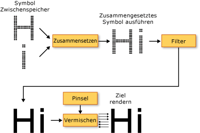

# Typografie in WPFTypography in WPF
In diesem Thema werden die wichtigsten typografischen Funktionen von [!INCLUDE[TLA2#tla_winclient](../../../../includes/tla2sharptla-winclient-md.md)] vorgestellt.This topic introduces the major typographic features of [!INCLUDE[TLA2#tla_winclient](../../../../includes/tla2sharptla-winclient-md.md)]. Diese Funktionen umfassen die verbesserte Qualität und Leistung beim Textrendering, die Unterstützung von [!INCLUDE[TLA#tla_opentype](../../../../includes/tlasharptla-opentype-md.md)]-Typografie, einen verbesserten internationalen Text, eine verbesserte Unterstützung für Schriftarten sowie neue Text-Anwendungsprogrammierschnittstellen (APIs).These features include improved quality and performance of text rendering, [!INCLUDE[TLA#tla_opentype](../../../../includes/tlasharptla-opentype-md.md)] typography support, enhanced international text, enhanced font support, and new text application programming interfaces (APIs).  
  

  
   
## Verbesserte Textqualität und -leistungImproved Quality and Performance of Text  
 Text in [!INCLUDE[TLA2#tla_winclient](../../../../includes/tla2sharptla-winclient-md.md)] wird mit [!INCLUDE[TLA#tla_ct](../../../../includes/tlasharptla-ct-md.md)] gerendert , was die Übersichtlichkeit und Lesbarkeit von Text verbessert.Text in [!INCLUDE[TLA2#tla_winclient](../../../../includes/tla2sharptla-winclient-md.md)] is rendered using [!INCLUDE[TLA#tla_ct](../../../../includes/tlasharptla-ct-md.md)], which enhances the clarity and readability of text. [!INCLUDE[TLA2#tla_ct](../../../../includes/tla2sharptla-ct-md.md)] ist eine von [!INCLUDE[TLA#tla_ms](../../../../includes/tlasharptla-ms-md.md)] entwickelte Softwaretechnologie, mit der die Lesbarkeit von Text auf vorhandenen LCDs (Liquid Crystal Displays), z.B. auf Laptopbildschirmen, Pocket PC-Bildschirmen und Flachbildschirmen, optimiert wird. is a software technology developed by [!INCLUDE[TLA#tla_ms](../../../../includes/tlasharptla-ms-md.md)] that improves the readability of text on existing LCDs (Liquid Crystal Displays), such as laptop screens, Pocket PC screens and flat panel monitors. [!INCLUDE[TLA2#tla_ct](../../../../includes/tla2sharptla-ct-md.md)] verwendet Sub-Pixel-Rendering, das durch das Ausrichten von Zeichen an Bruchteilen eines Pixels eine Textdarstellung mit größerer Genauigkeit und Wiedergabetreue ermöglicht. uses sub-pixel rendering which allows text to be displayed with a greater fidelity to its true shape by aligning characters on a fractional part of a pixel. Die zusätzliche Auflösung verbessert die Schärfe der kleinen Details in der Textanzeige, was das Lesen über lange Zeiträume hinweg erleichtert.The extra resolution increases the sharpness of the tiny details in text display, making it much easier to read over long durations. Eine weitere Verbesserung von [!INCLUDE[TLA2#tla_ct](../../../../includes/tla2sharptla-ct-md.md)] in [!INCLUDE[TLA2#tla_winclient](../../../../includes/tla2sharptla-winclient-md.md)] ist das Antialiasing in y-Richtung, das flache Kurven von Textzeichen oben und unten glättet.Another improvement of [!INCLUDE[TLA2#tla_ct](../../../../includes/tla2sharptla-ct-md.md)] in [!INCLUDE[TLA2#tla_winclient](../../../../includes/tla2sharptla-winclient-md.md)] is y-direction anti-aliasing, which smoothes the tops and bottoms of shallow curves in text characters. Weitere Informationen zu [!INCLUDE[TLA2#tla_ct](../../../../includes/tla2sharptla-ct-md.md)]-Funktionen finden Sie unter [Übersicht über ClearType](../../../../docs/framework/wpf/advanced/cleartype-overview.md).For more details on [!INCLUDE[TLA2#tla_ct](../../../../includes/tla2sharptla-ct-md.md)] features, see [ClearType Overview](../../../../docs/framework/wpf/advanced/cleartype-overview.md).  
  
   
Text mit ClearType-Antialiasing auf der y-AchseText with ClearType y-direction antialiasing  
  
 Die gesamte Textrendering-Pipeline kann in [!INCLUDE[TLA2#tla_winclient](../../../../includes/tla2sharptla-winclient-md.md)] hardwarebeschleunigt erfolgen, vorausgesetzt, dass Ihr Computer die Mindestanforderungen an die Hardware erfüllt.The entire text rendering pipeline can be hardware-accelerated in [!INCLUDE[TLA2#tla_winclient](../../../../includes/tla2sharptla-winclient-md.md)] provided your machine meets the minimum level of hardware required. Rendering, das nicht mit der Hardware ausgeführt werden kann, wird als Softwarerendering ausgeführt.Rendering that cannot be performed using hardware falls back to software rendering. Die Hardwarebeschleunigung beeinflusst alle Phasen der Textrendering-Pipeline – vom Speichern einzelner Glyphen, über die Zusammensetzung von Glyphenreihen und das Anwenden von Effekten bis hin zum Anwenden des [!INCLUDE[TLA2#tla_ct](../../../../includes/tla2sharptla-ct-md.md)]-Blendingalgorithmus auf die angezeigte Endausgabe.Hardware-acceleration affects all phases of the text rendering pipeline—from storing individual glyphs, compositing glyphs into glyph runs, applying effects, to applying the [!INCLUDE[TLA2#tla_ct](../../../../includes/tla2sharptla-ct-md.md)] blending algorithm to the final displayed output. Weitere Informationen zur Hardware-Beschleunigung finden Sie unter [Renderingebenen für Grafiken](../../../../docs/framework/wpf/advanced/graphics-rendering-tiers.md).For more information on hardware acceleration, see [Graphics Rendering Tiers](../../../../docs/framework/wpf/advanced/graphics-rendering-tiers.md).  
  
   
Diagramm der Text-Rendering-PipelineDiagram of the text rendering pipeline  
  
 Darüber hinaus nutzen Textanimation die durch [!INCLUDE[TLA2#tla_winclient](../../../../includes/tla2sharptla-winclient-md.md)] aktivierten Vorteile der Grafikhardwarefunktion mit Zeichen oder Glyphen voll aus.In addition, animated text, whether by character or glyph, takes full advantage of the graphics hardware capability enabled by [!INCLUDE[TLA2#tla_winclient](../../../../includes/tla2sharptla-winclient-md.md)]. Das Ergebnis ist eine glatte Textanimation.This results in smooth text animation.  
  
   
## Umfangreiche TypografieRich Typography  
 Das [!INCLUDE[TLA2#tla_opentype](../../../../includes/tla2sharptla-opentype-md.md)]-Schriftartformat ist eine Erweiterung des [!INCLUDE[TLA#tla_truetype](../../../../includes/tlasharptla-truetype-md.md)]-Schriftartformats.The [!INCLUDE[TLA2#tla_opentype](../../../../includes/tla2sharptla-opentype-md.md)] font format is an extension of the [!INCLUDE[TLA#tla_truetype](../../../../includes/tlasharptla-truetype-md.md)] font format. Das [!INCLUDE[TLA2#tla_opentype](../../../../includes/tla2sharptla-opentype-md.md)]-Schriftartformat wurde gemeinsam von [!INCLUDE[TLA#tla_ms](../../../../includes/tlasharptla-ms-md.md)] und Adobe entwickelt und bietet eine umfangreiche Auswahl an erweiterten typografischen Funktionen.The [!INCLUDE[TLA2#tla_opentype](../../../../includes/tla2sharptla-opentype-md.md)] font format was developed jointly by [!INCLUDE[TLA#tla_ms](../../../../includes/tlasharptla-ms-md.md)] and Adobe, and provides a rich assortment of advanced typographic features. Die <xref:System.Windows.Documents.Typography> Objekt macht viele der erweiterten Funktionen von [!INCLUDE[TLA2#tla_opentype](../../../../includes/tla2sharptla-opentype-md.md)] Schriftarten, z. B. stilistischer Varianten und Schwungschrift.The <xref:System.Windows.Documents.Typography> object exposes many of the advanced features of [!INCLUDE[TLA2#tla_opentype](../../../../includes/tla2sharptla-opentype-md.md)] fonts, such as stylistic alternates and swashes. Das [!INCLUDE[TLA2#tla_lhsdk](../../../../includes/tla2sharptla-lhsdk-md.md)] bietet eine Reihe von [!INCLUDE[TLA2#tla_opentype](../../../../includes/tla2sharptla-opentype-md.md)]-Schriftarten, die umfassende Funktionen enthalten,wie z.B. die Schriftarten Pericles und Pescadero.The [!INCLUDE[TLA2#tla_lhsdk](../../../../includes/tla2sharptla-lhsdk-md.md)] provides a set of sample [!INCLUDE[TLA2#tla_opentype](../../../../includes/tla2sharptla-opentype-md.md)] fonts that are designed with rich features, such as the Pericles and Pescadero fonts. Weitere Informationen finden Sie unter [OpenType-Beispielschriftartenpaket](../../../../docs/framework/wpf/advanced/sample-opentype-font-pack.md).For more information, see [Sample OpenType Font Pack](../../../../docs/framework/wpf/advanced/sample-opentype-font-pack.md).  
  
 Die [!INCLUDE[TLA2#tla_opentype](../../../../includes/tla2sharptla-opentype-md.md)]-Schriftart Pericles enthält zusätzliche Glyphen, die alternative Stile für den Standardsatz von Glyphen bieten.The Pericles [!INCLUDE[TLA2#tla_opentype](../../../../includes/tla2sharptla-opentype-md.md)] font contains additional glyphs that provide stylistic alternates to the standard set of glyphs. Im folgenden Text werden Symbole im alternativen Stil gezeigt.The following text displays stylistic alternate glyphs.  
  
   
Text mit alternativen OpenType-StilsymbolenText using OpenType stylistic alternate glyphs  
  
 Schwungschrift besteht aus dekorativen Symbolen, deren ausgefeilte Verzierung häufig mit Kalligraphie assoziiert wird.Swashes are decorative glyphs that use elaborate ornamentation often associated with calligraphy. Im folgenden Text werden Standard- und Schwungsymbole für die Schriftart Pescadero gezeigt.The following text displays standard and swash glyphs for the Pescadero font.  
  
   
Text mit OpenType-Standard- und ZiersymbolenText using OpenType standard and swash glyphs  
  
 Weitere Informationen zu [!INCLUDE[TLA2#tla_opentype](../../../../includes/tla2sharptla-opentype-md.md)]-Funktionen finden Sie unter [OpenType-Schriftarteigenschaften](../../../../docs/framework/wpf/advanced/opentype-font-features.md).For more details on [!INCLUDE[TLA2#tla_opentype](../../../../includes/tla2sharptla-opentype-md.md)] features, see [OpenType Font Features](../../../../docs/framework/wpf/advanced/opentype-font-features.md).  
  
   
## Verbesserte Unterstützung für internationalen TextEnhanced International Text Support  
 [!INCLUDE[TLA2#tla_winclient](../../../../includes/tla2sharptla-winclient-md.md)] bietet durch die folgenden Funktionen eine verbesserte Unterstützung für internationalen Text: provides enhanced international text support by providing the following features:  
  
-   Automatischer Zeilenabstand in allen Schriftsystem mithilfe adaptiver Maßeinheiten.Automatic line-spacing in all writing systems, using adaptive measurement.  
  
-   Umfassende Unterstützung für internationalen Text.Broad support for international text. Weitere Informationen finden Sie unter [Globalisierung für WPF](../../../../docs/framework/wpf/advanced/globalization-for-wpf.md).For more information, see [Globalization for WPF](../../../../docs/framework/wpf/advanced/globalization-for-wpf.md).  
  
-   An der Sprache orientierter Zeilenumbruch, Silbentrennung und Ausrichtung.Language-guided line breaking, hyphenation, and justification.  
  
   
## Verbesserte Unterstützung für SchriftartenEnhanced Font Support  
 [!INCLUDE[TLA2#tla_winclient](../../../../includes/tla2sharptla-winclient-md.md)] bietet durch die folgenden Funktionen eine verbesserte Unterstützung für Schriftarten: provides enhanced font support by providing the following features:  
  
-   Unicode für den jeden Text.Unicode for all text. Für Schriftartverhalten und -auswahl wird Charset oder Codepage nicht mehr benötigt.Font behavior and selection no longer require charset or codepage.  
  
-   Von globalen Einstellungen unabhängige Schriftartverhalten, z.B. Systemgebietsschema.Font behavior independent of global settings, such as system locale.  
  
-   Separate <xref:System.Windows.FontWeight>, <xref:System.Windows.FontStretch>, und <xref:System.Windows.FontStyle> Typen zum Definieren einer <xref:System.Windows.Media.FontFamily>.Separate <xref:System.Windows.FontWeight>, <xref:System.Windows.FontStretch>, and <xref:System.Windows.FontStyle> types for defining a <xref:System.Windows.Media.FontFamily>. Dies bietet mehr Flexibilität gegenüber der Programmierung in [!INCLUDE[TLA#tla_win32](../../../../includes/tlasharptla-win32-md.md)], bei der boolesche Kombinationen aus Kursiv und Fett zum Definieren einer Schriftfamilie verwendet werden.This provides greater flexibility than in [!INCLUDE[TLA#tla_win32](../../../../includes/tlasharptla-win32-md.md)] programming, in which Boolean combinations of italic and bold are used to define a font family.  
  
-   Die Schreibrichtung (horizontal oder vertikal) wird unabhängig von dem Schriftnamen behandelt.Writing direction (horizontal versus vertical) handled independent of font name.  
  
-   Verknüpfung von Schriftart und alternativer Schriftart (Fallback) in einer tragbaren [!INCLUDE[TLA#tla_xml](../../../../includes/tlasharptla-xml-md.md)]-Datei mithilfe der Technologie für zusammengesetzte Schriftarten.Font linking and font fallback in a portable [!INCLUDE[TLA#tla_xml](../../../../includes/tlasharptla-xml-md.md)] file, using composite font technology. Zusammengesetzte Schriftarten ermöglichen die Erstellung von vollständigen mehrsprachigen Schriftarten.Composite fonts allow for the construction of full range multilingual fonts. Zusammengesetzte Schriftarten verfügen zudem über einen Mechanismus, der das Anzeigen fehlender Glyphen verhindert.Composite fonts also provide a mechanism that avoids displaying missing glyphs. Weitere Informationen finden Sie unter den Hinweisen in der <xref:System.Windows.Media.FontFamily> Klasse.For more information, see the remarks in the <xref:System.Windows.Media.FontFamily> class.  
  
-   Erstellen internationaler Schriftarten aus zusammengesetzten Schriftarten mithilfe einer Gruppe an Einzelsprachenschriftarten.International fonts built from composite fonts, using a group of single-language fonts. Dadurch werden Ressourcenkosten bei der Entwicklung von Schriftarten für mehrere Sprachen gespart.This saves on resource costs when developing fonts for multiple languages.  
  
-   In einem Dokument eingebettete zusammengesetzte Schriftarten für die Portierung von Dokumenten.Composite fonts embedded in a document, thereby providing document portability. Weitere Informationen finden Sie unter den Hinweisen in der <xref:System.Windows.Media.FontFamily> Klasse.For more information, see the remarks in the <xref:System.Windows.Media.FontFamily> class.  
  
   
## Standardisierte APIs (Application Programming Interface)New Text Application Programming Interfaces (APIs)  
 [!INCLUDE[TLA2#tla_winclient](../../../../includes/tla2sharptla-winclient-md.md)] bietet Entwicklern mehrere Text-[!INCLUDE[TLA2#tla_api#plural](../../../../includes/tla2sharptla-apisharpplural-md.md)] für zum Einfügen in ihre Anwendungen. provides several text [!INCLUDE[TLA2#tla_api#plural](../../../../includes/tla2sharptla-apisharpplural-md.md)] for developers to use when including text in their applications. Diese [!INCLUDE[TLA2#tla_api#plural](../../../../includes/tla2sharptla-apisharpplural-md.md)] werden in drei Kategorien unterteilt:These [!INCLUDE[TLA2#tla_api#plural](../../../../includes/tla2sharptla-apisharpplural-md.md)] are grouped into three categories:  
  
-   **Layout und Benutzeroberfläche**.**Layout and user interface**. Die allgemeinen Textsteuerelemente für die [!INCLUDE[TLA#tla_gui](../../../../includes/tlasharptla-gui-md.md)].The common text controls for the [!INCLUDE[TLA#tla_gui](../../../../includes/tlasharptla-gui-md.md)].  
  
-   **Einfache Textzeichnung**.**Lightweight text drawing**. Ermöglicht das direkte Zeichnen von Text auf Objekten.Allows you to draw text directly to objects.  
  
-   **Erweiterte Textformatierung**.**Advanced text formatting**. Ermöglicht Ihnen, ein benutzerdefiniertes Textmodul zu implementieren.Allows you to implement a custom text engine.  
  
### Layout und BenutzeroberflächeLayout and User Interface  
 Auf der höchsten Ebene von Funktionen, die Text [!INCLUDE[TLA2#tla_api#plural](../../../../includes/tla2sharptla-apisharpplural-md.md)] bieten allgemeine [!INCLUDE[TLA#tla_ui](../../../../includes/tlasharptla-ui-md.md)] Steuerelemente wie z. B. <xref:System.Windows.Controls.Label>, <xref:System.Windows.Controls.TextBlock>, und <xref:System.Windows.Controls.TextBox>.At the highest level of functionality, the text [!INCLUDE[TLA2#tla_api#plural](../../../../includes/tla2sharptla-apisharpplural-md.md)] provide common [!INCLUDE[TLA#tla_ui](../../../../includes/tlasharptla-ui-md.md)] controls such as <xref:System.Windows.Controls.Label>, <xref:System.Windows.Controls.TextBlock>, and <xref:System.Windows.Controls.TextBox>. Diese Steuerelemente stellen innerhalb einer Anwendung die grundlegenden [!INCLUDE[TLA2#tla_ui](../../../../includes/tla2sharptla-ui-md.md)]-Elemente zur Verfügung und bieten eine einfache Möglichkeit, Text darzustellen und zu bearbeiten.These controls provide the basic [!INCLUDE[TLA2#tla_ui](../../../../includes/tla2sharptla-ui-md.md)] elements within an application, and offer an easy way to present and interact with text. Steuert, wie z. B. <xref:System.Windows.Controls.RichTextBox> und <xref:System.Windows.Controls.PasswordBox> aktivieren mehr erweiterte oder Textbehandlung spezialisiert.Controls such as <xref:System.Windows.Controls.RichTextBox> and <xref:System.Windows.Controls.PasswordBox> enable more advanced or specialized text-handling. Klassen wie <xref:System.Windows.Documents.TextRange>, <xref:System.Windows.Documents.TextSelection>, und <xref:System.Windows.Documents.TextPointer> nützlich zur textmanipulation zu aktivieren.And classes such as <xref:System.Windows.Documents.TextRange>, <xref:System.Windows.Documents.TextSelection>, and <xref:System.Windows.Documents.TextPointer> enable useful text manipulation. Diese [!INCLUDE[TLA2#tla_ui](../../../../includes/tla2sharptla-ui-md.md)] Steuerelemente stellen Eigenschaften bereit, z. B. <xref:System.Windows.Controls.Control.FontFamily%2A>, <xref:System.Windows.Controls.Control.FontSize%2A>, und <xref:System.Windows.Controls.Control.FontStyle%2A>, die ermöglichen es Ihnen, die Schriftart zu steuern, die zum Rendern von Text verwendet wird.These [!INCLUDE[TLA2#tla_ui](../../../../includes/tla2sharptla-ui-md.md)] controls provide properties such as <xref:System.Windows.Controls.Control.FontFamily%2A>, <xref:System.Windows.Controls.Control.FontSize%2A>, and <xref:System.Windows.Controls.Control.FontStyle%2A>, which enable you to control the font that is used to render the text.  
  
#### Verwenden von Bitmapeffekten, Transformationen und TexteffektenUsing Bitmap Effects, Transforms, and Text Effects  
 Mit [!INCLUDE[TLA2#tla_winclient](../../../../includes/tla2sharptla-winclient-md.md)] können Sie visuell interessante Texte mithilfe von Funktionen wie Bitmapeffekten, Transformationen und Texteffekten erstellen.[!INCLUDE[TLA2#tla_winclient](../../../../includes/tla2sharptla-winclient-md.md)] allows you to create visually interesting uses of text by uses features such as bitmap effects, transforms, and text effects. Das folgende Beispiel zeigt einen typischen auf einen Text angewandten Schlagschatteneffekt.The following example shows a typical type of a drop shadow effect applied to text.  
  
   
Text mit einem SchlagschattenText with a drop shadow  
  
 Das folgende Beispiel zeigt einen Text mit Schlagschatteneffekt und Rauschen.The following example shows a drop shadow effect and noise applied to text.  
  
   
Text mit Schlagschatten und RauschenText with a drop shadow and noise  
  
 Das folgende Beispiel zeigt einen Text mit dem Effekt Schein nach außen (Outer Glow).The following example shows an outer glow effect applied to text.  
  
   
Text mit dem Effekt Schein nach außenText with an outer glow effect  
  
 Das folgende Beispiel zeigt einen auf einen Text angewendeten Weichzeichnereffekt.The following example shows a blur effect applied to text.  
  
   
Text mit einem WeichzeichnereffektText with a blur effect  
  
 Das folgende Beispiel zeigt die zweite Textzeile, die um 150 % entlang der X-Achse skaliert ist, und die dritte Textzeile, die um 150 % entlang der Y-Achse skaliert ist.The following example shows the second line of text scaled by 150% along the x-axis, and the third line of text scaled by 150% along the y-axis.  
  
   
Mithilfe einer ScaleTransform skalierter TextText using a ScaleTransform  
  
 Das folgende Beispiel zeigt einen entlang der X-Achse geneigten Text.The following example shows text skewed along the x-axis.  
  
   
Geneigter Text mithilfe einer SkewTransformText using a SkewTransform  
  
 Ein <xref:System.Windows.Media.TextEffect> Objekt ist Hilfsobjekt, das Ihnen ermöglicht, die Text als eine oder mehrere Gruppen von Zeichen in einer Textzeichenfolge zu behandeln.A <xref:System.Windows.Media.TextEffect> object is a helper object that allows you to treat text as one or more groups of characters in a text string. Das folgende Beispiel zeigt ein einzelnes Zeichen, das gedreht wurde.The following example shows an individual character being rotated. Jedes Zeichen wird unabhängig in Intervallen von 1 Sekunde gedreht.Each character is rotated independently at 1-second intervals.  
  
   
Beispiel für eine sich drehende TexteffektanimationExample of a rotating text effect animation  
  
#### Verwenden von FlussdokumentenUsing Flow Documents  
 Zusätzlich zu den allgemeinen [!INCLUDE[TLA2#tla_ui](../../../../includes/tla2sharptla-ui-md.md)] Steuerelemente [!INCLUDE[TLA2#tla_winclient](../../../../includes/tla2sharptla-winclient-md.md)] bietet eine Layout-Steuerelement für die Textdarstellung – der <xref:System.Windows.Documents.FlowDocument> Element.In addition to the common [!INCLUDE[TLA2#tla_ui](../../../../includes/tla2sharptla-ui-md.md)] controls, [!INCLUDE[TLA2#tla_winclient](../../../../includes/tla2sharptla-winclient-md.md)] offers a layout control for text presentation—the <xref:System.Windows.Documents.FlowDocument> element. Die <xref:System.Windows.Documents.FlowDocument> Elements in Verbindung mit der <xref:System.Windows.Controls.DocumentViewer> Element stellt ein Steuerelement für große Mengen von Text mit unterschiedlichen Layout Anforderungen bereit.The <xref:System.Windows.Documents.FlowDocument> element, in conjunction with the <xref:System.Windows.Controls.DocumentViewer> element, provides a control for large amounts of text with varying layout requirements. Formularlayout-Steuerelemente bieten Zugriff auf erweiterte Typografie durch die <xref:System.Windows.Documents.Typography> Objekt und Eigenschaften anderer schriftartbezogene [!INCLUDE[TLA2#tla_ui](../../../../includes/tla2sharptla-ui-md.md)] Steuerelemente.Layout controls provide access to advanced typography through the <xref:System.Windows.Documents.Typography> object and font-related properties of other [!INCLUDE[TLA2#tla_ui](../../../../includes/tla2sharptla-ui-md.md)] controls.  
  
 Das folgende Beispiel zeigt den Textinhalt in gehosteten eine <xref:System.Windows.Controls.FlowDocumentReader>, Suche, Navigation, Paginierung und Inhalte, die Unterstützung für die Skalierung bietet.The following example shows text content hosted in a <xref:System.Windows.Controls.FlowDocumentReader>, which provides search, navigation, pagination, and content scaling support.  
  
   
In einem FlowDocumentReader gehosteter TextText hosted in a FlowDocumentReader  
  
 Weitere Informationen finden Sie unter [Dokumente in WPF](../../../../docs/framework/wpf/advanced/documents-in-wpf.md).For more information, see [Documents in WPF](../../../../docs/framework/wpf/advanced/documents-in-wpf.md).  
  
### Einfache TextzeichnungLightweight Text Drawing  
 Sie können Text direkt zu zeichnen [!INCLUDE[TLA2#tla_winclient](../../../../includes/tla2sharptla-winclient-md.md)] Objekte mithilfe der <xref:System.Windows.Media.DrawingContext.DrawText%2A> Methode der <xref:System.Windows.Media.DrawingContext> Objekt.You can draw text directly to [!INCLUDE[TLA2#tla_winclient](../../../../includes/tla2sharptla-winclient-md.md)] objects by using the <xref:System.Windows.Media.DrawingContext.DrawText%2A> method of the <xref:System.Windows.Media.DrawingContext> object. Wenn diese Methode verwenden möchten, erstellen Sie eine <xref:System.Windows.Media.FormattedText> Objekt.To use this method, you create a <xref:System.Windows.Media.FormattedText> object. Dieses Objekt ermöglicht das Zeichnen von mehrzeiligem Text, in dem jedes Zeichen einzeln formatiert werden kann.This object allows you to draw multi-line text, in which each character in the text can be individually formatted. Die Funktionalität der <xref:System.Windows.Media.FormattedText> Objekt enthält viele Funktionen der DrawText-Flags in der Win32-API.The functionality of the <xref:System.Windows.Media.FormattedText> object contains much of the functionality of the DrawText flags in the Win32 API. Darüber hinaus die <xref:System.Windows.Media.FormattedText> Objekt enthält Funktionen, z. B. mit den Auslassungspunkten-Unterstützung, in dem ein Auslassungszeichen angezeigt wird, wenn Text seiner Grenzen überschreitet.In addition, the <xref:System.Windows.Media.FormattedText> object contains functionality such as ellipsis support, in which an ellipsis is displayed when text exceeds its bounds. Das folgende Beispiel zeigt Text auf den verschiedene Formatierungen angewendet wurden, wie z.B. einen linearen Farbverlauf auf dem zweiten und dritten Wort.The following example shows text that has several formats applied to it, including a linear gradient on the second and third words.  
  
   
Mit dem FormattedText-Objekt angezeigter TextDisplayed text using FormattedText object  
  
 Sie können auch formatierten Text in konvertieren <xref:System.Windows.Media.Geometry> Objekte, sodass Sie andere Arten von visuell interessante Text zu erstellen.You can convert formatted text into <xref:System.Windows.Media.Geometry> objects, allowing you to create other types of visually interesting text. Sie können z. B. Erstellen einer <xref:System.Windows.Media.Geometry> Objekt auf Grundlage der Gliederung einer Textzeichenfolge.For example, you could create a <xref:System.Windows.Media.Geometry> object based on the outline of a text string.  
  
   
Textkontur mit einem linearen FarbverlaufspinselText outline using a linear gradient brush  
  
 Die folgenden Beispiele zeigen verschiedene Möglichkeiten zum Erstellen von visuell interessanten Effekten durch Ändern von Strich, Füllung und Hervorhebung des konvertierten Texts.The following examples illustrate several ways of creating interesting visual effects by modifying the stroke, fill, and highlight of converted text.  
  
   
Beispiel für das Festlegen von unterschiedlichen Farben für Strich und FüllungExample of setting stroke and fill to different colors  
  
   
Beispiel für die Anwendung eines Bildpinsels auf den StrichExample of an image brush applied to the stroke  
  
   
Beispiel für die Anwendung eines Bildpinsels auf den Strich und die HervorhebungExample of an image brush applied to the stroke and highlight  
  
 Weitere Informationen zu den <xref:System.Windows.Media.FormattedText> Objekt, finden Sie unter [Zeichnung formatiertem Text](../../../../docs/framework/wpf/advanced/drawing-formatted-text.md).For more information on the <xref:System.Windows.Media.FormattedText> object, see [Drawing Formatted Text](../../../../docs/framework/wpf/advanced/drawing-formatted-text.md).  
  
### Erweiterte TextformatierungAdvanced Text Formatting  
 Das am häufigsten Premiummitglied des Texts [!INCLUDE[TLA2#tla_api#plural](../../../../includes/tla2sharptla-apisharpplural-md.md)], [!INCLUDE[TLA2#tla_winclient](../../../../includes/tla2sharptla-winclient-md.md)] bietet die Möglichkeit zum Erstellen von benutzerdefinierten Textlayout mit der <xref:System.Windows.Media.TextFormatting.TextFormatter> Objekt und anderen Typen in den <xref:System.Windows.Media.TextFormatting> Namespace.At the most advanced level of the text [!INCLUDE[TLA2#tla_api#plural](../../../../includes/tla2sharptla-apisharpplural-md.md)], [!INCLUDE[TLA2#tla_winclient](../../../../includes/tla2sharptla-winclient-md.md)] offers you the ability to create custom text layout by using the <xref:System.Windows.Media.TextFormatting.TextFormatter> object and other types in the <xref:System.Windows.Media.TextFormatting> namespace. Die <xref:System.Windows.Media.TextFormatting.TextFormatter> und die zugeordneten Klassen können Sie benutzerdefinierte Textlayout implementieren, die Ihre eigenen Definitionen für Zeichenformate, Absatzformatvorlagen, unterstützt Zeile Regeln für den Zeilenumbruch und andere Layoutfeatures für internationalen Text.The <xref:System.Windows.Media.TextFormatting.TextFormatter> and associated classes allow you to implement custom text layout that supports your own definition of character formats, paragraph styles, line breaking rules, and other layout features for international text. Es gibt nur sehr wenige Fälle, in denen es sinnvoll ist, die Standardimplementierung der [!INCLUDE[TLA2#tla_winclient](../../../../includes/tla2sharptla-winclient-md.md)]-Textlayoutunterstützung zu überschreiben.There are very few cases in which you would want to override the default implementation of the [!INCLUDE[TLA2#tla_winclient](../../../../includes/tla2sharptla-winclient-md.md)] text layout support. Wenn Sie jedoch ein Steuerelement oder eine Anwendung erstellen, kann möglicherweise eine andere Implementierung als die standardmäßige [!INCLUDE[TLA2#tla_winclient](../../../../includes/tla2sharptla-winclient-md.md)]-Implementierung benötigt werden.However, if you were creating a text editing control or application, you might require a different implementation than the default [!INCLUDE[TLA2#tla_winclient](../../../../includes/tla2sharptla-winclient-md.md)] implementation.  
  
 Im Gegensatz zu herkömmlichen Text [!INCLUDE[TLA#tla_api](../../../../includes/tlasharptla-api-md.md)]die <xref:System.Windows.Media.TextFormatting.TextFormatter> interagiert mit einer Textlayout-Clients über eine Reihe von Rückrufmethoden.Unlike a traditional text [!INCLUDE[TLA#tla_api](../../../../includes/tlasharptla-api-md.md)], the <xref:System.Windows.Media.TextFormatting.TextFormatter> interacts with a text layout client through a set of callback methods. Es muss der Client diese Methoden in einer Implementierung von der <xref:System.Windows.Media.TextFormatting.TextSource> Klasse.It requires the client to provide these methods in an implementation of the <xref:System.Windows.Media.TextFormatting.TextSource> class. Das folgende Diagramm veranschaulicht die Text-Layout-Interaktion zwischen der Clientanwendung und <xref:System.Windows.Media.TextFormatting.TextFormatter>.The following diagram illustrates the text layout interaction between the client application and <xref:System.Windows.Media.TextFormatting.TextFormatter>.  
  
   
Interaktion zwischen Anwendung und TextFormatterInteraction between application and TextFormatter  
  
 Weitere Informationen zum Erstellen von benutzerdefinierten Textlayouts finden Sie unter [Advanced Text Formatting](../../../../docs/framework/wpf/advanced/advanced-text-formatting.md).For more details on creating custom text layout, see [Advanced Text Formatting](../../../../docs/framework/wpf/advanced/advanced-text-formatting.md).  
  
## Siehe auchSee Also  
 <xref:System.Windows.Media.FormattedText>  
 <xref:System.Windows.Media.TextFormatting.TextFormatter>  
 [Übersicht über ClearTypeClearType Overview](../../../../docs/framework/wpf/advanced/cleartype-overview.md)  
 [Features für OpenType-SchriftartenOpenType Font Features](../../../../docs/framework/wpf/advanced/opentype-font-features.md)  
 [Zeichnen von formatiertem TextDrawing Formatted Text](../../../../docs/framework/wpf/advanced/drawing-formatted-text.md)  
 [Erweiterte TextformatierungAdvanced Text Formatting](../../../../docs/framework/wpf/advanced/advanced-text-formatting.md)  
 [TextText](../../../../docs/framework/wpf/advanced/optimizing-performance-text.md)  
 [Microsoft-TypografieMicrosoft Typography](http://www.microsoft.com/typography/default.mspx)
