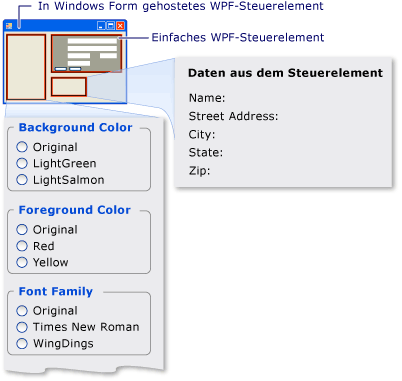

# <a name="walkthrough-hosting-a-wpf-composite-control-in-windows-forms"></a>Exemplarische Vorgehensweise: Hosten eines zusammengesetzten WPF-Steuerelements in Windows Forms
[!INCLUDE[TLA#tla_winclient](../../../../includes/tlasharptla-winclient-md.md)] stellt eine umfangreiche Umgebung zum Erstellen von Anwendungen bereit. Wenn Sie haben jedoch eine erhebliche Investition [!INCLUDE[TLA#tla_winforms](../../../../includes/tlasharptla-winforms-md.md)] Code, es kann zum Erweitern Ihrer vorhandenen effektiver sein [!INCLUDE[TLA#tla_winforms](../../../../includes/tlasharptla-winforms-md.md)] Anwendung mit [!INCLUDE[TLA2#tla_winclient](../../../../includes/tla2sharptla-winclient-md.md)] anstatt sie von Grund auf neu zu schreiben. Ein häufiges Szenario ist, wenn eine eingebettet werden soll, oder weitere Steuerelemente implementiert wird, mit [!INCLUDE[TLA2#tla_winclient](../../../../includes/tla2sharptla-winclient-md.md)] innerhalb der Windows Forms-Anwendung. Weitere Informationen zum Anpassen von WPF-Steuerelemente finden Sie unter [Anpassung von Steuerelementen](../../../../docs/framework/wpf/controls/control-customization.md).  
  
 Diese exemplarische Vorgehensweise führt Sie schrittweise durch eine Anwendung, die als Host einer [!INCLUDE[TLA2#tla_winclient](../../../../includes/tla2sharptla-winclient-md.md)] zusammengesetztes Steuerelement zum Ausführen von Eingabe von Daten in einer Windows Forms-Anwendung. Das zusammengesetzte Steuerelement ist in eine DLL verpackt. Dieses allgemeine Verfahren kann für komplexere Anwendungen und Steuerelemente erweitert werden. In dieser exemplarischen Vorgehensweise in Darstellung und Funktionalität nahezu identisch sein soll [Exemplarische Vorgehensweise: Hosten eines zusammengesetzten Windows Forms-Steuerelements in WPF](../../../../docs/framework/wpf/advanced/walkthrough-hosting-a-windows-forms-composite-control-in-wpf.md). Der Hauptunterschied besteht darin, dass das Hosting-Szenario umgekehrt ist.  
  
 Diese exemplarische Vorgehensweise ist in zwei Abschnitte unterteilt. Der erste Abschnitt beschreibt kurz die Implementierung der [!INCLUDE[TLA2#tla_winclient](../../../../includes/tla2sharptla-winclient-md.md)] zusammengesetztes Steuerelement. Der zweite Abschnitt wird detailliert erläutert, wie Sie das zusammengesetzte Steuerelement in Windows Forms-Anwendungen hosten, Ereignisse vom Steuerelement empfangen und Zugriff auf einige der Eigenschaften des Steuerelements.  
  
 In dieser exemplarischen Vorgehensweise werden u. a. folgende Aufgaben veranschaulicht:  
  
-   Implementieren des zusammengesetzten WPF-Steuerelements  
  
-   Implementieren der Windows Forms-Hostanwendung  
  
 Eine vollständige codeauflistung der Aufgaben in dieser exemplarischen Vorgehensweise veranschaulicht, finden Sie unter [Hosten eines zusammengesetzten WPF-Steuerelements in Windows Forms-Beispiel](https://go.microsoft.com/fwlink/?LinkID=159996).  
  
## <a name="prerequisites"></a>Erforderliche Komponenten  
 Zum Durchführen dieser exemplarischen Vorgehensweise benötigen Sie die folgenden Komponenten:  
  
-   [!INCLUDE[vs_dev10_long](../../../../includes/vs-dev10-long-md.md)]  
  
## <a name="implementing-the-wpf-composite-control"></a>Implementieren des zusammengesetzten WPF-Steuerelements  
 Die [!INCLUDE[TLA2#tla_winclient](../../../../includes/tla2sharptla-winclient-md.md)] zusammengesetztes Steuerelement, die in diesem Beispiel verwendeten ist ein einfaches Dateneingabeformular, die Namen und Adresse des Benutzers erfordert. Klickt der Benutzer eine der zwei Schaltflächen, um anzugeben, dass die Aufgabe abgeschlossen ist, löst das Steuerelement ein benutzerdefiniertes Ereignis aus, um diese Informationen an den Host zurückzugeben. Die folgende Abbildung zeigt das gerenderte Steuerelement.  
  
   
Zusammengesetztes WPF-Steuerelement  
  
### <a name="creating-the-project"></a>Erstellen des Projekts  
 Um das Projekt zu starten:  
  
1.  Starten Sie [!INCLUDE[TLA#tla_visualstu](../../../../includes/tlasharptla-visualstu-md.md)], und öffnen Sie die **neues Projekt** Dialogfeld.  
  
2.  Wählen Sie in Visual C#- und der Kategorie "Windows" die **WPF-Benutzersteuerelementbibliothek** Vorlage.  
  
3.  Geben Sie dem neuen Projekt den Namen `MyControls`.  
  
4.  Geben Sie für den Speicherort einen bequem benannten Ordner an der obersten Ebene, z. B. `WindowsFormsHostingWpfControl`. Sie werden die Host-Anwendung später in diesem Ordner ablegen.  
  
5.  Klicken Sie auf **OK**, um das Projekt zu erstellen. Das Standardprojekt enthält ein einzelnes Steuerelement mit dem Namen `UserControl1`.  
  
6.  Benennen Sie im Projektmappen-Explorer `UserControl1` zu `MyControl1`.  
  
 Das Projekt sollte Verweise auf die folgenden System-DLLs aufweisen. Sollten eine oder mehrere dieser DLLs nicht standardmäßig enthalten sein, fügen Sie diese manuell zum Projekt hinzu.  
  
-   PresentationCore  
  
-   PresentationFramework  
  
-   System  
  
-   WindowsBase  
  
### <a name="creating-the-user-interface"></a>Erstellen der Benutzeroberfläche  
 Die [!INCLUDE[TLA#tla_ui](../../../../includes/tlasharptla-ui-md.md)] für das zusammengesetzte Steuerelement implementiert [!INCLUDE[TLA#tla_xaml](../../../../includes/tlasharptla-xaml-md.md)]. Das zusammengesetzte Steuerelement [!INCLUDE[TLA2#tla_ui](../../../../includes/tla2sharptla-ui-md.md)] besteht aus fünf <xref:System.Windows.Controls.TextBox> Elemente. Jede <xref:System.Windows.Controls.TextBox> Element verfügt über eine zugeordnete <xref:System.Windows.Controls.TextBlock> -Element, das als Beschriftung dient. Es gibt zwei <xref:System.Windows.Controls.Button> Elemente im unteren Bereich **OK** und **Abbrechen**. Wenn der Benutzer auf eine Schaltfläche klickt, löst das Steuerelement ein benutzerdefiniertes Ereignis aus, um die Informationen an den Host zurückzugeben.  
  
#### <a name="basic-layout"></a>Grundlegendes Layout  
 Die verschiedenen [!INCLUDE[TLA2#tla_ui](../../../../includes/tla2sharptla-ui-md.md)] Elemente befinden sich einem <xref:System.Windows.Controls.Grid> Element. Können Sie <xref:System.Windows.Controls.Grid> , ordnen Sie den Inhalt der zusammengesetzten steuern im Wesentlichen die gleiche Weise verwenden Sie eine `Table` Element im HTML-Format. [!INCLUDE[TLA2#tla_winclient](../../../../includes/tla2sharptla-winclient-md.md)] verfügt auch über eine <xref:System.Windows.Documents.Table> -Element, aber <xref:System.Windows.Controls.Grid> ist kompakter und für einfache Layoutaufgaben besser geeignet.  
  
 Das grundlegende Layout ist im nachfolgenden XAML-Code beschrieben. Dieses XAML definiert die allgemeine Struktur des Steuerelements durch Angabe der Anzahl der Spalten und Zeilen in der <xref:System.Windows.Controls.Grid> Element.  
  
 Ersetzen Sie in MyControl1.xaml den vorhandenen XAML-Code durch den folgenden.  
  
 [!code-xaml[WindowsFormsHostingWpfControl#101](../../../../samples/snippets/csharp/VS_Snippets_Wpf/WindowsFormsHostingWpfControl/CSharp/MyControls/Page1.xaml#101)]  
[!code-xaml[WindowsFormsHostingWpfControl#102](../../../../samples/snippets/csharp/VS_Snippets_Wpf/WindowsFormsHostingWpfControl/CSharp/MyControls/Page1.xaml#102)]  
  
#### <a name="adding-textblock-and-textbox-elements-to-the-grid"></a>TextBlock- und TextBox-Elemente zum Raster hinzufügen  
 Sie platzieren einen [!INCLUDE[TLA2#tla_ui](../../../../includes/tla2sharptla-ui-md.md)] Element im Raster durch Festlegen des Elements <xref:System.Windows.Controls.Grid.RowProperty> und <xref:System.Windows.Controls.Grid.ColumnProperty> Attribute auf die entsprechende Anzahl von Zeilen und Spalten. Denken Sie daran, dass die Nummerierungen der Zeilen und Spalten nullbasiert sind. Sie haben ein Element mehrere Spalten erstrecken, durch Festlegen seiner <xref:System.Windows.Controls.Grid.ColumnSpanProperty> Attribut. Weitere Informationen zu <xref:System.Windows.Controls.Grid> Elemente finden Sie unter [Erstellen eines Grid-Elements](../../../../docs/framework/wpf/controls/how-to-create-a-grid-element.md).  
  
 Der folgende XAML zeigt des zusammengesetzten Steuerelements <xref:System.Windows.Controls.TextBox> und <xref:System.Windows.Controls.TextBlock> Elemente mit ihren <xref:System.Windows.Controls.Grid.RowProperty> und <xref:System.Windows.Controls.Grid.ColumnProperty> Attribute, die festgelegt werden, um die Elemente korrekt im Raster platziert.  
  
 Fügen Sie in MyControl1.xaml den folgenden XAML in die <xref:System.Windows.Controls.Grid> Element.  
  
 [!code-xaml[WindowsFormsHostingWpfControl#103](../../../../samples/snippets/csharp/VS_Snippets_Wpf/WindowsFormsHostingWpfControl/CSharp/MyControls/Page1.xaml#103)]  
  
#### <a name="styling-the-ui-elements"></a>Formatieren der Benutzeroberflächenelemente  
 Viele der Elemente auf dem Dateneingabeformular verfügen über ein ähnliches Erscheinungsbild, was bedeutet, dass viele ihrer Eigenschaften identische Einstellungen aufweisen. Statt die Attribute jedes Elements separat festzulegen, verwendet die vorherigen XAML <xref:System.Windows.Style> Elemente um standardisierte Einstellungswerte der Eigenschaften für Elementklassen zu definieren. Dieser Ansatz reduziert die Komplexität des Steuerelements und ermöglicht es Ihnen, die Darstellung mehrerer Elemente durch ein einziges Stilattribut zu ändern.  
  
 Die <xref:System.Windows.Style> Elemente befinden sich die <xref:System.Windows.Controls.Grid> des Elements <xref:System.Windows.FrameworkElement.Resources%2A> -Eigenschaft, sodass sie von allen Elementen im Steuerelement verwendet werden können. Wenn ein Stil benannt ist, Sie gelten sie auf ein Element durch das Hinzufügen einer <xref:System.Windows.Style> Element auf den Stilnamen festgelegt. Unbenannte Stile werden zum Standardstil für das Element. Weitere Informationen zu [!INCLUDE[TLA2#tla_winclient](../../../../includes/tla2sharptla-winclient-md.md)] Stilen finden Sie unter [Stile und Vorlagen](../../../../docs/framework/wpf/controls/styling-and-templating.md).  
  
 Das folgende XAML zeigt die <xref:System.Windows.Style> Elemente für das zusammengesetzte Steuerelement. Wie die Stile auf Elemente angewendet werden, können Sie dem vorherigen XAML-Code entnehmen. Z. B. das letzte <xref:System.Windows.Controls.TextBlock> Element verfügt über die `inlineText` Stil, und das letzte <xref:System.Windows.Controls.TextBox> -Element verwendet den Standardstil.  
  
 Fügen Sie Sie in MyControl1.xaml den folgenden XAML direkt nach der <xref:System.Windows.Controls.Grid> Startelement.  
  
 [!code-xaml[WindowsFormsHostingWpfControl#104](../../../../samples/snippets/csharp/VS_Snippets_Wpf/WindowsFormsHostingWpfControl/CSharp/MyControls/Page1.xaml#104)]  
  
#### <a name="adding-the-ok-and-cancel-buttons"></a>Hinzufügen der Schaltflächen „OK” und „Abbrechen”  
 Die letzten Elemente des zusammengesetzten Steuerelements sind die **OK** und **Abbrechen** <xref:System.Windows.Controls.Button> -Elemente, die die ersten beiden Spalten der letzten Zeile belegen die <xref:System.Windows.Controls.Grid>. Diese Elemente verwenden einen gemeinsamen Ereignishandler `ButtonClicked`, und die standardmäßige <xref:System.Windows.Controls.Button> Stil, die in der vorherigen XAML definiert.  
  
 Fügen Sie Sie in MyControl1.xaml den folgenden XAML nach dem letzten <xref:System.Windows.Controls.TextBox> Element. Die [!INCLUDE[TLA2#tla_xaml](../../../../includes/tla2sharptla-xaml-md.md)] Teil des zusammengesetzten Steuerelements ist nun abgeschlossen.  
  
 [!code-xaml[WindowsFormsHostingWpfControl#105](../../../../samples/snippets/csharp/VS_Snippets_Wpf/WindowsFormsHostingWpfControl/CSharp/MyControls/Page1.xaml#105)]  
  
### <a name="implementing-the-code-behind-file"></a>Implementieren der CodeBehind-Datei  
 Der Code-Behind-Datei "MyControl1.xaml.cs" implementiert drei wesentliche Aufgaben:
  
1.  Sie behandelt das Ereignis, das auftritt, wenn der Benutzer eine der Schaltflächen klickt.  
  
2.  Ruft ab, die Daten aus der <xref:System.Windows.Controls.TextBox> Elemente, und verpackt sie in ein benutzerdefiniertes Ereignisargumentobjekt.  
  
3.  Löst das benutzerdefinierte `OnButtonClick` -Ereignis, das den Host benachrichtigt, dass der Benutzer abgeschlossen ist, und die Daten an dem Host übergibt.  
  
 Das Steuerelement macht auch eine Reihe von Farb- und Schriftart-Eigenschaften verfügbar, mit deren Hilfe Sie das Erscheinungsbild anpassen können. Im Gegensatz zu den <xref:System.Windows.Forms.Integration.WindowsFormsHost> -Klasse, die zum Hosten eines Windows Forms-Steuerelements verwendet wird, die <xref:System.Windows.Forms.Integration.ElementHost> Klasse verfügbar macht, des Steuerelements <xref:System.Windows.Controls.Panel.Background%2A> nur-Eigenschaft. Verwalten Sie die Ähnlichkeit zwischen diesem Codebeispiel und dem Beispiel [Exemplarische Vorgehensweise: Hosten eines zusammengesetzten Windows Forms-Steuerelements in WPF](../../../../docs/framework/wpf/advanced/walkthrough-hosting-a-windows-forms-composite-control-in-wpf.md), macht das Steuerelement die übrigen Eigenschaften direkt verfügbar.  
  
#### <a name="the-basic-structure-of-the-code-behind-file"></a>Die grundlegende Struktur der CodeBehind-Datei  
 Die Code-Behind-Datei besteht aus einem einzelnen Namespace `MyControls`, enthält die beiden Klassen `MyControl1` und `MyControlEventArgs`.  
  
```  
namespace MyControls  
{  
  public partial class MyControl1 : Grid  
  {  
    //...  
  }  
  public class MyControlEventArgs : EventArgs  
  {  
    //...  
  }  
}  
```  
  
 Die erste Klasse, `MyControl1`, ist eine partielle Klasse, die den Code, der die Funktionalität des implementiert die [!INCLUDE[TLA2#tla_ui](../../../../includes/tla2sharptla-ui-md.md)] in "MyControl1.xaml" definiert. Wenn "MyControl1.xaml" analysiert wird, die [!INCLUDE[TLA2#tla_xaml](../../../../includes/tla2sharptla-xaml-md.md)] in die gleiche partielle Klasse konvertiert wird und die beiden partiellen Klassen werden zusammengeführt, um das kompilierte Steuerelement zu bilden. Aus diesem Grund muss der Klassenname in der CodeBehind-Datei mit dem übereinstimmen, der MyControl1.xaml zugewiesen wurde, und er muss vom Stammelement des Steuerelements erben. Die zweite Klasse, `MyControlEventArgs`, ist eine Klasse für Ereignisargumente, die verwendet wird, um die Daten an den Host zu senden.  
  
 Öffnen Sie "MyControl1.xaml.cs". Ändern Sie die vorhandene Klassendeklaration so, dass sie den folgenden Namen und von erbt <xref:System.Windows.Controls.Grid>.  
  
 [!code-csharp[WindowsFormsHostingWpfControl#21](../../../../samples/snippets/csharp/VS_Snippets_Wpf/WindowsFormsHostingWpfControl/CSharp/MyControls/Page1.xaml.cs#21)]  
  
#### <a name="initializing-the-control"></a>Initialisieren des Steuerelements  
 Im folgenden Code werden mehrere grundlegende Aufgaben implementiert:  
  
-   Deklarieren eines privaten Ereignisses, `OnButtonClick`, und seines zugeordneten Delegaten `MyControlEventHandler`.  
  
-   Erstellen von mehreren privaten globalen Variablen, welche die Benutzerdaten speichern. Diese Daten werden durch entsprechende Eigenschaften verfügbar gemacht.  
  
-   Implementieren eines Handlers `Init`, für des Steuerelements des <xref:System.Windows.FrameworkElement.Loaded> Ereignis. Dieser Handler initialisiert die globalen Variablen, indem er ihnen die in MyControl1.xaml definierten Werte zuweist. Zu diesem Zweck verwendet er die <xref:System.Windows.FrameworkElement.Name%2A> einer typischen zugewiesen <xref:System.Windows.Controls.TextBlock> Element `nameLabel`, um die Einstellungen der Eigenschaften des Elements zugreifen.  
  
 Löschen Sie den vorhandenen Konstruktor, und fügen Sie den folgenden Code Ihrer `MyControl1` Klasse.  
  
 [!code-csharp[WindowsFormsHostingWpfControl#11](../../../../samples/snippets/csharp/VS_Snippets_Wpf/WindowsFormsHostingWpfControl/CSharp/MyControls/Page1.xaml.cs#11)]  
  
#### <a name="handling-the-buttons-click-events"></a>Behandeln der Click-Ereignisse der Schaltflächen  
 Der Benutzer gibt an, dass die Dateneingabe abgeschlossen ist, indem Sie entweder auf die **OK** Schaltfläche oder die **Abbrechen** Schaltfläche. Beide Schaltflächen verwenden denselben <xref:System.Windows.Controls.Primitives.ButtonBase.Click> -Ereignishandler `ButtonClicked`. Beide Schaltflächen besitzen einen Namen, `btnOK` oder `btnCancel`, ermöglicht den Handler, um zu bestimmen, welche Schaltfläche geklickt wurde, durch die Auswertung des Werts für die `sender` Argument. Der Handler führt die folgenden Aktionen aus:  
  
-   Erstellt eine `MyControlEventArgs` -Objekt, enthält die Daten aus, der <xref:System.Windows.Controls.TextBox> Elemente.  
  
-   Wenn der Benutzer auf die **Abbrechen** Schaltfläche legt die `MyControlEventArgs` des Objekts `IsOK` Eigenschaft `false`.  
  
-   Löst die `OnButtonClick` Ereignis an den Host an, wenn der Benutzer abgeschlossen ist, und übergibt die gesammelten Daten.  
  
 Fügen Sie den folgenden Code Ihrer `MyControl1` -Klasse nach der `Init` Methode.  
  
 [!code-csharp[WindowsFormsHostingWpfControl#12](../../../../samples/snippets/csharp/VS_Snippets_Wpf/WindowsFormsHostingWpfControl/CSharp/MyControls/Page1.xaml.cs#12)]  
  
#### <a name="creating-properties"></a>Erstellen von Eigenschaften  
 Der Rest der Klasse macht lediglich Eigenschaften verfügbar, die den oben erläuterten globalen Variablen entsprechen. Wenn sich eine Eigenschaft ändert, passt der Set-Accessor das Erscheinungsbild des Steuerelements an, indem er die entsprechenden Elementeigenschaften und die zugrunde liegenden globalen Variablen aktualisiert.  
  
 Fügen Sie den folgenden Code Ihrer `MyControl1` Klasse.  
  
 [!code-csharp[WindowsFormsHostingWpfControl#13](../../../../samples/snippets/csharp/VS_Snippets_Wpf/WindowsFormsHostingWpfControl/CSharp/MyControls/Page1.xaml.cs#13)]  
  
#### <a name="sending-the-data-back-to-the-host"></a>Zurücksenden der Daten an den Host  
 Die letzte Komponente in der Datei ist die `MyControlEventArgs` -Klasse, die verwendet wird, um die gesammelten Daten an den Host zu senden.  
  
 Fügen Sie den folgenden Code Ihrer `MyControls` Namespace. Die Implementierung ist einfach und wird nicht weiter erläutert.  
  
 [!code-csharp[WindowsFormsHostingWpfControl#14](../../../../samples/snippets/csharp/VS_Snippets_Wpf/WindowsFormsHostingWpfControl/CSharp/MyControls/Page1.xaml.cs#14)]  
  
 Erstellen Sie die Projektmappe. Der Build erzeugt eine DLL mit dem Namen MyControls.dll.  
  
<a name="winforms_host_section"></a>   
## <a name="implementing-the-windows-forms-host-application"></a>Implementieren der Windows Forms-Hostanwendung  
 Die Windows-Formulare Hosten der Anwendung verwendet ein <xref:System.Windows.Forms.Integration.ElementHost> Objekt, das Hosten der [!INCLUDE[TLA2#tla_winclient](../../../../includes/tla2sharptla-winclient-md.md)] zusammengesetztes Steuerelement. Die Anwendung behandelt den `OnButtonClick` Ereignis, um die Daten vom zusammengesetzten Steuerelement zu empfangen. Die Anwendung verfügt außerdem über eine Reihe von Optionsfeldern, die Sie verwenden können, um die Darstellung des Steuerelements zu ändern. Die folgende Abbildung zeigt die Anwendung.  
  
   
In Windows Forms-Anwendung gehostetes zusammengesetztes WPF-Steuerelements  
  
### <a name="creating-the-project"></a>Erstellen des Projekts  
 Um das Projekt zu starten:  
  
1.  Starten Sie [!INCLUDE[TLA2#tla_visualstu](../../../../includes/tla2sharptla-visualstu-md.md)], und öffnen Sie die **neues Projekt** Dialogfeld.  
  
2.  Wählen Sie in Visual C#- und der Kategorie "Windows" die **Windows Forms-Anwendung** Vorlage.  
  
3.  Geben Sie dem neuen Projekt den Namen `WFHost`.  
  
4.  Geben Sie für den Speicherort denselben Stammordner an, der das Projekt „MyControls” enthält.  
  
5.  Klicken Sie auf **OK**, um das Projekt zu erstellen.  
  
 Sie müssen auch Verweise auf die DLL hinzufügen, enthält `MyControl1` und andere Assemblys.  
  
1.  Mit der rechten Maustaste des Projektnamen im Projektmappen-Explorer, und wählen **Verweis hinzufügen**.  
  
2.  Klicken Sie auf die **Durchsuchen** Registerkarte, und navigieren Sie zu dem Ordner, der MyControls.dll enthält. In dieser exemplarischen Vorgehensweise ist dies der Ordner "MyControls\bin\Debug".  
  
3.  Wählen Sie MyControls.dll aus, und klicken Sie dann auf **OK**.  
  
4.  Fügen Sie Verweise auf die folgenden Assemblys hinzu.  
  
    -   PresentationCore  
  
    -   PresentationFramework  
  
    -   System.Xaml  
  
    -   WindowsBase  
  
    -   WindowsFormsIntegration  
  
### <a name="implementing-the-user-interface-for-the-application"></a>Implementieren der Benutzeroberfläche für die Anwendung  
 Die Benutzeroberfläche für die Windows Forms-Anwendung enthält mehrere Steuerelemente, die dazu dienen, mit dem zusammengesetzten WPF-Steuerelement zu interagieren.  
  
1.  Öffnen Sie Form1 im Windows Forms-Designer.  
  
2.  Vergrößern Sie das Formular, um den Steuerelementen genügend Platz zu geben.  
  
3.  Fügen Sie in der oberen rechten Ecke des Formulars ein <xref:System.Windows.Forms.Panel?displayProperty=nameWithType> Steuerelement zum Speichern der [!INCLUDE[TLA2#tla_winclient](../../../../includes/tla2sharptla-winclient-md.md)] zusammengesetztes Steuerelement.  
  
4.  Fügen Sie die folgenden <xref:System.Windows.Forms.GroupBox?displayProperty=nameWithType> Steuerelemente im Formular.  
  
    |name|Text|  
    |----------|----------|  
    |groupBox1|Hintergrundfarbe|  
    |groupBox2|Vordergrundfarbe|  
    |groupBox3|Schriftgrad|  
    |groupBox4|Schriftfamilie|  
    |groupBox5|Schriftschnitt|  
    |groupBox6|Schriftbreite|  
    |groupBox7|Daten vom Steuerelement|  
  
5.  Fügen Sie die folgenden <xref:System.Windows.Forms.RadioButton?displayProperty=nameWithType> -Steuerelementen an die <xref:System.Windows.Forms.GroupBox?displayProperty=nameWithType> Steuerelemente.  
  
    |GroupBox|name|Text|  
    |--------------|----------|----------|  
    |groupBox1|radioBackgroundOriginal|Ursprünglich|  
    |groupBox1|radioBackgroundLightGreen|Hellgrün|  
    |groupBox1|radioBackgroundLightSalmon|Helles Lachsrot|  
    |groupBox2|radioForegroundOriginal|Ursprünglich|  
    |groupBox2|radioForegroundRed|Rot|  
    |groupBox2|radioForegroundYellow|Gelb|  
    |groupBox3|radioSizeOriginal|Ursprünglich|  
    |groupBox3|radioSizeTen|10|  
    |groupBox3|radioSizeTwelve|12|  
    |groupBox4|radioFamilyOriginal|Ursprünglich|  
    |groupBox4|radioFamilyTimes|Times New Roman|  
    |groupBox4|radioFamilyWingDings|WingDings|  
    |groupBox5|radioStyleOriginal|Normal|  
    |groupBox5|radioStyleItalic|Kursiv|  
    |groupBox6|radioWeightOriginal|Ursprünglich|  
    |groupBox6|radioWeightBold|Fett|  
  
6.  Fügen Sie die folgenden <xref:System.Windows.Forms.Label?displayProperty=nameWithType> steuert, mit dem letzten <xref:System.Windows.Forms.GroupBox?displayProperty=nameWithType>. Diese Steuerelemente zeigen die vom zurückgegebenen Daten die [!INCLUDE[TLA2#tla_winclient](../../../../includes/tla2sharptla-winclient-md.md)] zusammengesetztes Steuerelement.  
  
    |GroupBox|name|Text|  
    |--------------|----------|----------|  
    |groupBox7|lblName|Name:|  
    |groupBox7|lblAddress|Straße und Hausnummer:|  
    |groupBox7|lblCity|Ort:|  
    |groupBox7|lblState|Zustand:|  
    |groupBox7|lblZip|Postleitzahl:|  
  
### <a name="initializing-the-form"></a>Initialisieren des Formulars  
 Implementieren Sie in der Regel den Code zum Hosten des Formulars <xref:System.Windows.Forms.Form.Load> -Ereignishandler. Der folgende code zeigt die <xref:System.Windows.Forms.Form.Load> Ereignishandler, einen Handler für die [!INCLUDE[TLA2#tla_winclient](../../../../includes/tla2sharptla-winclient-md.md)] eines zusammengesetzten Steuerelements <xref:System.Windows.FrameworkElement.Loaded> -Ereignis, sowie Deklarationen für verschiedene globale Variablen, die später verwendet werden.  
  
 Doppelklicken Sie im Windows Forms-Designer auf das Formular zum Erstellen einer <xref:System.Windows.Forms.Form.Load> -Ereignishandler. Fügen Sie am Anfang von Form1.cs die folgenden `using` Anweisungen.  
  
 [!code-csharp[WindowsFormsHostingWpfControl#10](../../../../samples/snippets/csharp/VS_Snippets_Wpf/WindowsFormsHostingWpfControl/CSharp/WFHost/Form1.cs#10)]  
  
 Ersetzen Sie den Inhalt des vorhandenen `Form1` Klasse durch den folgenden Code.  
  
 [!code-csharp[WindowsFormsHostingWpfControl#2](../../../../samples/snippets/csharp/VS_Snippets_Wpf/WindowsFormsHostingWpfControl/CSharp/WFHost/Form1.cs#2)]  
  
 Die `Form1_Load` -Methode in der vorhergehende Code zeigt die allgemeine Vorgehensweise für das Hosten einer [!INCLUDE[TLA2#tla_winclient](../../../../includes/tla2sharptla-winclient-md.md)] Steuerelement:  
  
1.  Erstellen Sie ein neues <xref:System.Windows.Forms.Integration.ElementHost> Objekt.  
  
2.  Legen Sie die <xref:System.Windows.Forms.Control.Dock%2A> Eigenschaft <xref:System.Windows.Forms.DockStyle.Fill?displayProperty=nameWithType>.  
  
3.  Hinzufügen der <xref:System.Windows.Forms.Integration.ElementHost> die Steuerung an die <xref:System.Windows.Forms.Panel> des Steuerelements <xref:System.Windows.Forms.Control.Controls%2A> Auflistung.  
  
4.  Erstellen Sie eine Instanz von der [!INCLUDE[TLA2#tla_winclient](../../../../includes/tla2sharptla-winclient-md.md)] Steuerelement.  
  
5.  Das zusammengesetzte Steuerelement im Formular hosten, indem Sie das Steuerelement, das Zuweisen der <xref:System.Windows.Forms.Integration.ElementHost> des Steuerelements <xref:System.Windows.Forms.Integration.ElementHost.Child%2A> Eigenschaft.  
  
 Die verbleibenden zwei Zeilen in der `Form1_Load` -Methode binden Handler an zwei Steuerelement-Ereignisse:  
  
-   `OnButtonClick` ist ein benutzerdefiniertes Ereignis, das durch das zusammengesetzte Steuerelement ausgelöst wird, klickt der Benutzer die **OK** oder **Abbrechen** Schaltfläche. Behandeln Sie dieses Ereignis, um die Antwort des Benutzers zu erhalten und alle vom Benutzer angegebenen Daten zu erfassen.  
  
-   <xref:System.Windows.FrameworkElement.Loaded> ist ein Standardereignis, das ausgelöst wird, indem eine [!INCLUDE[TLA2#tla_winclient](../../../../includes/tla2sharptla-winclient-md.md)] steuern, wenn es vollständig geladen wurde. Das Ereignis wird hier verwendet, da dieses Beispiel mehrere globale Variablen mithilfe der Eigenschaften des Steuerelements initialisieren muss. Zum Zeitpunkt der des Formulars <xref:System.Windows.Forms.Form.Load> Ereignis, das Steuerelement ist nicht vollständig geladen, und diese Werte sind immer noch um festgelegt `null`. Sie müssen warten, bis des Steuerelements des <xref:System.Windows.FrameworkElement.Loaded> Ereignis tritt auf, bevor Sie diese Eigenschaften zugreifen können.  
  
 Die <xref:System.Windows.FrameworkElement.Loaded> -Ereignishandler wird im vorherigen Code gezeigt. Die `OnButtonClick` -Handler wird im nächsten Abschnitt erläutert.  
  
### <a name="handling-onbuttonclick"></a>Behandeln von OnButtonClick  
 Die `OnButtonClick` Ereignis tritt auf, wenn der Benutzer klickt auf die **OK** oder **Abbrechen** Schaltfläche.  
  
 Der Ereignishandler überprüft des Ereignisarguments `IsOK` Feld, um zu bestimmen, welche Schaltfläche geklickt wurde. Die `lbl` *Daten* Variablen entsprechen der <xref:System.Windows.Forms.Label> Steuerelemente, die zuvor erläutert wurden. Wenn der Benutzer klickt der **OK** Schaltfläche, die Daten des Steuerelements <xref:System.Windows.Controls.TextBox> Steuerelemente wird zugewiesen, mit der entsprechenden <xref:System.Windows.Forms.Label> Steuerelement. Wenn der Benutzer klickt **Abbrechen**, <xref:System.Windows.Forms.Label.Text%2A> Werte werden auf die standardmäßigen Zeichenfolgen festgelegt.  
  
 Die folgende Schaltfläche "hinzufügen" klicken Sie auf Ereignishandlercode, der `Form1` Klasse.  
  
 [!code-csharp[WindowsFormsHostingWpfControl#3](../../../../samples/snippets/csharp/VS_Snippets_Wpf/WindowsFormsHostingWpfControl/CSharp/WFHost/Form1.cs#3)]  
  
 Erstellen Sie die Anwendung, und führen Sie sie aus. Fügen Sie dem zusammengesetzten WPF-Steuerelement etwas Text hinzu, und klicken Sie dann auf **OK**. Der Text wird in den Beschriftungen angezeigt. Zu diesem Zeitpunkt wurde noch kein Code für die Behandlung der Optionsfelder hinzugefügt.  
  
### <a name="modifying-the-appearance-of-the-control"></a>Ändern des Erscheinungsbilds des Steuerelements  
 Die <xref:System.Windows.Forms.RadioButton> Steuerelemente auf dem Formular ermöglichen es dem Benutzer so ändern Sie die [!INCLUDE[TLA2#tla_winclient](../../../../includes/tla2sharptla-winclient-md.md)] eines zusammengesetzten Steuerelements Vorder- und Hintergrundfarben sowie einige Schriftarteigenschaften. Die Hintergrundfarbe wird verfügbar gemacht, indem die <xref:System.Windows.Forms.Integration.ElementHost> Objekt. Die übrigen Eigenschaften werden als benutzerdefinierte Eigenschaften des Steuerelements verfügbar gemacht.  
  
 Doppelklicken Sie auf jede <xref:System.Windows.Forms.RadioButton> Steuerelement im Formular erstellen <xref:System.Windows.Forms.RadioButton.CheckedChanged> -Ereignishandler. Ersetzen Sie die <xref:System.Windows.Forms.RadioButton.CheckedChanged> -Ereignishandler durch den folgenden Code.  
  
 [!code-csharp[WindowsFormsHostingWpfControl#4](../../../../samples/snippets/csharp/VS_Snippets_Wpf/WindowsFormsHostingWpfControl/CSharp/WFHost/Form1.cs#4)]  
  
 Erstellen Sie die Anwendung, und führen Sie sie aus. Klicken Sie auf die verschiedenen Optionsfelder, um die Auswirkung auf das zusammengesetzte WPF-Steuerelement zu sehen.  
  
## <a name="see-also"></a>Siehe auch  
 <xref:System.Windows.Forms.Integration.ElementHost>  
 <xref:System.Windows.Forms.Integration.WindowsFormsHost>  
 [Entwerfen von XAML-Code in Visual Studio](/visualstudio/designers/designing-xaml-in-visual-studio)  
 [Exemplarische Vorgehensweise: Hosten eines zusammengesetzten Windows Forms-Steuerelements in WPF](../../../../docs/framework/wpf/advanced/walkthrough-hosting-a-windows-forms-composite-control-in-wpf.md)  
 [Exemplarische Vorgehensweise: Hosten eines zusammengesetzten 3D-WPF-Steuerelements in Windows Forms](../../../../docs/framework/wpf/advanced/walkthrough-hosting-a-3-d-wpf-composite-control-in-windows-forms.md)
