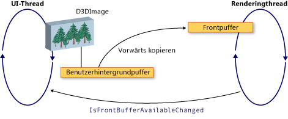

# Interaktion zwischen WPF und Direct3D9
Sie können von Direct3D9-Inhalt in eine WPF-Anwendung (Windows Presentation Foundation) einschließen. In diesem Thema wird beschrieben, wie von Direct3D9-Inhalte erstellt werden, sodass Sie effizient mit WPF interagieren.  
  
> [!NOTE]
> Wenn Sie von Direct3D9-Inhalte in WPF verwenden, müssen Sie auch die Leistung berücksichtigen. Weitere Informationen zur Leistungsoptimierung finden Sie unter [Überlegungen zur Leistung bei der von Direct3D9-und WPF-Interoperabilität](performance-considerations-for-direct3d9-and-wpf-interoperability.md).  
  
## Puffer anzeigen  
 Die <xref:System.Windows.Interop.D3DImage>-Klasse verwaltet zwei Anzeige Puffer, die als *Hintergrund Puffer* und Vordergrund *Puffer*bezeichnet werden. Der Hintergrund Puffer ist die von Direct3D9-Oberfläche. Änderungen am Hintergrund Puffer werden in den Vordergrund Puffer kopiert, wenn Sie die <xref:System.Windows.Interop.D3DImage.Unlock%2A>-Methode aufzurufen.  
  
 Die folgende Abbildung zeigt die Beziehung zwischen dem Hintergrund Puffer und dem Vorder-Puffer.  
  
   
  
## Von Direct3D9 Geräte Erstellung  
 Zum Rendering von von Direct3D9-Inhalt müssen Sie ein von Direct3D9-Gerät erstellen. Es gibt zwei von Direct3D9-Objekte, die Sie verwenden können, um ein Gerät zu erstellen, `IDirect3D9` und `IDirect3D9Ex`. Verwenden Sie diese Objekte, um `IDirect3DDevice9`-bzw. `IDirect3DDevice9Ex` Geräte zu erstellen.  
  
 Erstellen Sie ein Gerät, indem Sie eine der folgenden Methoden aufrufen.  
  
- `IDirect3D9 * Direct3DCreate9(UINT SDKVersion);`  
  
- `HRESULT Direct3DCreate9Ex(UINT SDKVersion, IDirect3D9Ex **ppD3D);`  
  
 Verwenden Sie unter Windows Vista oder einem späteren Betriebssystem die `Direct3DCreate9Ex`-Methode mit einer Anzeige, die für die Verwendung des Windows-Anzeigetreiber Modells (WDDM) konfiguriert ist. Verwenden Sie die `Direct3DCreate9`-Methode auf einer beliebigen anderen Plattform.  
  
### Verfügbarkeit der Direct3DCreate9Ex-Methode  
 D3d9. dll verfügt über die `Direct3DCreate9Ex`-Methode nur unter Windows Vista oder einem späteren Betriebssystem. Wenn Sie die Funktion unter Windows XP direkt verknüpfen, kann die Anwendung nicht geladen werden. Um zu ermitteln, ob die `Direct3DCreate9Ex`-Methode unterstützt wird, laden Sie die dll, und suchen Sie nach der proc-Adresse. Der folgende Code zeigt, wie Sie auf die `Direct3DCreate9Ex` Methode testen. Ein vollständiges Codebeispiel finden Sie unter Exemplarische Vorgehensweise [: Erstellen von von Direct3D9-Inhalten für das Hosting in WPF](walkthrough-creating-direct3d9-content-for-hosting-in-wpf.md).  
  
 [!code-cpp[System.Windows.Interop.D3DImage#RendererManager_EnsureD3DObjects](~/samples/snippets/cpp/VS_Snippets_Wpf/System.Windows.Interop.D3DImage/cpp/renderermanager.cpp#renderermanager_ensured3dobjects)]  
  
### HWND-Erstellung  
 Zum Erstellen eines Geräts ist ein HWND erforderlich. Im Allgemeinen erstellen Sie ein dummyhwnd für von Direct3D9, das verwendet werden soll. Im folgenden Codebeispiel wird gezeigt, wie ein dummyhwnd erstellt wird.  
  
 [!code-cpp[System.Windows.Interop.D3DImage#RendererManager_EnsureHWND](~/samples/snippets/cpp/VS_Snippets_Wpf/System.Windows.Interop.D3DImage/cpp/renderermanager.cpp#renderermanager_ensurehwnd)]  
  
### Vorhandene Parameter  
 Das Erstellen eines Geräts erfordert auch eine `D3DPRESENT_PARAMETERS` Struktur, aber es sind nur einige Parameter wichtig. Diese Parameter werden ausgewählt, um den Speicherbedarf zu minimieren.  
  
 Legen Sie die Felder `BackBufferHeight` und `BackBufferWidth` auf 1 fest. Wenn Sie Sie auf 0 festlegen, werden Sie auf die Dimensionen des HWND festgelegt.  
  
 Legen Sie die `D3DCREATE_MULTITHREADED`-und `D3DCREATE_FPU_PRESERVE` Flags immer fest, um zu verhindern, dass von von Direct3D9 verwendeter Arbeitsspeicher beschädigt wird, und um zu verhindern, dass von Direct3D9 FPU  
  
 Der folgende Code zeigt, wie die `D3DPRESENT_PARAMETERS` Struktur initialisiert wird.  
  
 [!code-cpp[System.Windows.Interop.D3DImage#Renderer_Init](~/samples/snippets/cpp/VS_Snippets_Wpf/System.Windows.Interop.D3DImage/cpp/renderer.cpp#renderer_init)]  
  
## Erstellen des backpufferrenderziels  
 Um von Direct3D9-Inhalt in einem <xref:System.Windows.Interop.D3DImage>anzuzeigen, erstellen Sie eine von Direct3D9-Oberfläche und weisen Sie durch Aufrufen der <xref:System.Windows.Interop.D3DImage.SetBackBuffer%2A>-Methode zu.  
  
### Überprüfen der Adapter Unterstützung  
 Vergewissern Sie sich vor dem Erstellen einer Oberfläche, dass alle Adapter die benötigten Oberflächeneigenschaften unterstützen. Auch wenn Sie nur zu einem Adapter gerenden werden, kann das WPF-Fenster auf jedem Adapter im System angezeigt werden. Sie sollten immer von Direct3D9-Code schreiben, der Konfigurationen mit mehreren Adaptern behandelt, und Sie sollten alle Adapter auf Unterstützung überprüfen, da WPF die Oberfläche möglicherweise zwischen den verfügbaren Adaptern verschiebt.  
  
 Im folgenden Codebeispiel wird gezeigt, wie alle Adapter im System auf von Direct3D9-Unterstützung überprüft werden.  
  
 [!code-cpp[System.Windows.Interop.D3DImage#RendererManager_TestSurfaceSettings](~/samples/snippets/cpp/VS_Snippets_Wpf/System.Windows.Interop.D3DImage/cpp/renderermanager.cpp#renderermanager_testsurfacesettings)]  
  
### Erstellen der Oberfläche  
 Vergewissern Sie sich vor dem Erstellen einer Oberfläche, dass die Gerätefunktionen eine gute Leistung für das Ziel Betriebssystem unterstützen. Weitere Informationen finden Sie unter [Überlegungen zur Leistung bei der von Direct3D9-und WPF-Interoperabilität](performance-considerations-for-direct3d9-and-wpf-interoperability.md).  
  
 Wenn Sie die Gerätefunktionen überprüft haben, können Sie die-Oberfläche erstellen. Im folgenden Codebeispiel wird gezeigt, wie das Renderziel erstellt wird.  
  
 [!code-cpp[System.Windows.Interop.D3DImage#Renderer_CreateSurface](~/samples/snippets/cpp/VS_Snippets_Wpf/System.Windows.Interop.D3DImage/cpp/renderer.cpp#renderer_createsurface)]  
  
### WDDM  
 Unter den Betriebssystemen Windows Vista und höher, die für die Verwendung von WDDM konfiguriert sind, können Sie eine renderzieltextur erstellen und die Oberfläche der Ebene 0 an die <xref:System.Windows.Interop.D3DImage.SetBackBuffer%2A>-Methode übergeben. Diese Vorgehensweise wird unter Windows XP nicht empfohlen, da Sie keine versperrbare renderzieltextur erstellen können und die Leistung reduziert wird.  
  
## Umgang mit Gerätestatus  
 Die <xref:System.Windows.Interop.D3DImage>-Klasse verwaltet zwei Anzeige Puffer, die als *Hintergrund Puffer* und Vordergrund *Puffer*bezeichnet werden. Der Hintergrund Puffer ist die Direct3D-Oberfläche.  Änderungen am Hintergrund Puffer werden in den Vordergrund Puffer kopiert, wenn Sie die <xref:System.Windows.Interop.D3DImage.Unlock%2A>-Methode abrufen, wo Sie auf der Hardware angezeigt wird. Gelegentlich ist der Vorder-Puffer nicht mehr verfügbar. Diese fehlende Verfügbarkeit kann durch eine Bildschirmsperre, voll Bild exklusive Direct3D Anwendungen, Benutzerwechsel oder andere Systemaktivitäten verursacht werden. Wenn dies der Fall ist, wird die WPF-Anwendung durch Behandeln des <xref:System.Windows.Interop.D3DImage.IsFrontBufferAvailableChanged> Ereignisses benachrichtigt.  Wie die Anwendung auf den Vordergrund Puffer reagiert, hängt davon ab, ob WPF auf das Software Rendering zurückgreifen kann. Die <xref:System.Windows.Interop.D3DImage.SetBackBuffer%2A>-Methode verfügt über eine-Überladung, die einen-Parameter annimmt, der angibt, ob WPF auf Software Rendering zurückgreift.  
  
 Wenn Sie die <xref:System.Windows.Interop.D3DImage.SetBackBuffer%28System.Windows.Interop.D3DResourceType%2CSystem.IntPtr%29>-Überladung aufrufen oder die <xref:System.Windows.Interop.D3DImage.SetBackBuffer%28System.Windows.Interop.D3DResourceType%2CSystem.IntPtr%2CSystem.Boolean%29>-Überladung aufrufen, wobei der `enableSoftwareFallback`-Parameter auf `false`festgelegt ist, gibt das Renderingsystem seinen Verweis auf den Hintergrund Puffer frei, wenn der Vorder-Puffer nicht verfügbar und nichts angezeigt wird Wenn der Front-Puffer wieder verfügbar ist, löst das Renderingsystem das <xref:System.Windows.Interop.D3DImage.IsFrontBufferAvailableChanged> Ereignis aus, um die WPF-Anwendung zu benachrichtigen.  Sie können einen Ereignishandler für das <xref:System.Windows.Interop.D3DImage.IsFrontBufferAvailableChanged> Ereignis erstellen, um das Rendering erneut mit einer gültigen Direct3D-Oberfläche zu starten. Um das Rendering neu zu starten, müssen Sie <xref:System.Windows.Interop.D3DImage.SetBackBuffer%2A>abrufen.  
  
 Wenn Sie die <xref:System.Windows.Interop.D3DImage.SetBackBuffer%28System.Windows.Interop.D3DResourceType%2CSystem.IntPtr%2CSystem.Boolean%29>-Überladung mit dem auf `true`festgelegten `enableSoftwareFallback`-Parameter aufrufen, behält das Renderingsystem seinen Verweis auf den Hintergrund Puffer bei, wenn der Vorder-Puffer nicht mehr verfügbar ist. Daher ist es nicht erforderlich, <xref:System.Windows.Interop.D3DImage.SetBackBuffer%2A> aufzurufen, wenn der vordere Puffer wieder verfügbar ist.  
  
 Wenn das Software Rendering aktiviert ist, kann es Situationen geben, in denen das Gerät des Benutzers nicht mehr verfügbar ist, aber das Renderingsystem einen Verweis auf die Direct3D-Oberfläche beibehält. Um zu überprüfen, ob ein von Direct3D9-Gerät nicht verfügbar ist, können Sie die `TestCooperativeLevel`-Methode Um ein Direct3D9Ex-Gerät zu überprüfen, wird die `CheckDeviceState`-Methode aufgerufen, da die `TestCooperativeLevel`-Methode veraltet ist und immer Erfolg zurückgibt. Wenn das Benutzergerät nicht mehr verfügbar ist, wenden Sie <xref:System.Windows.Interop.D3DImage.SetBackBuffer%2A> an, um den WPF-Verweis auf den Hintergrund Puffer freizugeben.  Wenn Sie Ihr Gerät zurücksetzen müssen, wenden Sie <xref:System.Windows.Interop.D3DImage.SetBackBuffer%2A> mit dem `backBuffer`-Parameter auf `null`an, und wenden Sie dann <xref:System.Windows.Interop.D3DImage.SetBackBuffer%2A> erneut an, wobei `backBuffer` auf eine gültige Direct3D-Oberfläche festgelegt ist.  
  
 Wenden Sie die `Reset`-Methode zum Wiederherstellen von einem ungültigen Gerät nur an, wenn Sie die Unterstützung für mehrere Adapter implementieren. Geben Sie andernfalls alle von Direct3D9-Schnittstellen frei, und erstellen Sie sie vollständig neu. Wenn das Adapter Layout geändert wurde, werden von Direct3D9-Objekte, die vor der Änderung erstellt wurden, nicht aktualisiert.  
  
## Behandeln der Größe von Anpassungen  
 Wenn eine <xref:System.Windows.Interop.D3DImage> mit einer anderen Auflösung als der systemeigenen Größe angezeigt wird, wird Sie entsprechend der aktuellen <xref:System.Windows.Media.RenderOptions.BitmapScalingMode%2A>skaliert, mit dem Unterschied, dass <xref:System.Windows.Media.Effects.SamplingMode.Bilinear> durch <xref:System.Windows.Media.BitmapScalingMode.Fant>ersetzt wird.  
  
 Wenn Sie eine höhere Genauigkeit benötigen, müssen Sie eine neue Oberfläche erstellen, wenn der Container des <xref:System.Windows.Interop.D3DImage> die Größe ändert.  
  
 Es gibt drei mögliche Ansätze zum Ändern der Größe.  
  
- Nehmen Sie am Layoutsystem Teil, und erstellen Sie eine neue Oberfläche, wenn sich die Größe ändert. Erstellen Sie nicht zu viele Oberflächen, da Sie den Videospeicher möglicherweise abschöpfen oder fragmentieren.  
  
- Warten Sie, bis ein Ereignis zur Größenänderung für einen bestimmten Zeitraum aufgetreten ist, um die neue Oberfläche zu erstellen.  
  
- Erstellen Sie eine <xref:System.Windows.Threading.DispatcherTimer>, mit der die Container Dimensionen mehrmals pro Sekunde überprüft werden.  
  
## Multi-Monitor-Optimierung  
 Die Leistung kann erheblich reduziert werden, wenn das Renderingsystem eine <xref:System.Windows.Interop.D3DImage> auf einen anderen Monitor verschiebt.  
  
 In WDDM ist die Leistung nicht beeinträchtigt, solange sich die Monitore auf derselben Grafikkarte befinden und Sie `Direct3DCreate9Ex`verwenden. Wenn sich die Monitore auf separaten Grafikkarten befinden, verringert sich die Leistung. Unter Windows XP wird die Leistung immer reduziert.  
  
 Wenn das <xref:System.Windows.Interop.D3DImage> zu einem anderen Monitor wechselt, können Sie eine neue Oberfläche auf dem entsprechenden Adapter erstellen, um eine gute Leistung wiederherzustellen.  
  
 Um die Leistungseinbußen zu vermeiden, schreiben Sie Code speziell für den Fall mit mehreren Monitoren. Die folgende Liste zeigt eine Möglichkeit zum Schreiben von Code mit mehreren Monitoren.  
  
1. Suchen Sie mit der `Visual.ProjectToScreen`-Methode einen Punkt der <xref:System.Windows.Interop.D3DImage> im Bildschirmbereich.  
  
2. Verwenden Sie die `MonitorFromPoint` GDI-Methode, um den Monitor zu finden, der den Punkt anzeigt.  
  
3. Verwenden Sie die `IDirect3D9::GetAdapterMonitor`-Methode, um zu ermitteln, auf welchem von Direct3D9 Adapter sich der Monitor befindet.  
  
4. Wenn der Adapter nicht mit dem Adapter mit dem Hintergrund Puffer identisch ist, erstellen Sie einen neuen BackBuffer auf dem neuen Monitor, und weisen Sie ihn dem <xref:System.Windows.Interop.D3DImage> backpuffer zu.  
  
> [!NOTE]
> Wenn sich die <xref:System.Windows.Interop.D3DImage> überwachen, ist die Leistung langsam, außer im Fall von WDDM und `IDirect3D9Ex` auf demselben Adapter. In dieser Situation gibt es keine Möglichkeit, die Leistung zu verbessern.  
  
 Im folgenden Codebeispiel wird gezeigt, wie Sie den aktuellen Monitor suchen.  
  
 [!code-cpp[System.Windows.Interop.D3DImage#RendererManager_SetAdapter](~/samples/snippets/cpp/VS_Snippets_Wpf/System.Windows.Interop.D3DImage/cpp/renderermanager.cpp#renderermanager_setadapter)]  
  
 Aktualisieren Sie den Monitor, wenn sich die Größe oder Position des <xref:System.Windows.Interop.D3DImage> Containers ändert, oder aktualisieren Sie den Monitor mithilfe einer `DispatcherTimer`, die mehrmals pro Sekunde aktualisiert wird.  
  
## WPF-Software Rendering  
 WPF wird in den folgenden Situationen synchron im UI-Thread in Software gerendert.  
  
- Wird gedruckt  
  
- <xref:System.Windows.Media.Effects.BitmapEffect>  
  
- <xref:System.Windows.Media.Imaging.RenderTargetBitmap>  
  
 Wenn eine dieser Situationen eintritt, ruft das Renderingsystem die <xref:System.Windows.Interop.D3DImage.CopyBackBuffer%2A>-Methode auf, um den Hardware Puffer in Software zu kopieren. Die Standard Implementierung ruft die `GetRenderTargetData`-Methode mit der-Oberfläche auf. Da dieser-Vorgang außerhalb des Sperr-/entsperrungs Musters erfolgt, tritt möglicherweise ein Fehler auf. In diesem Fall gibt die `CopyBackBuffer`-Methode `null` zurück, und es wird kein Bild angezeigt.  
  
 Sie können die <xref:System.Windows.Interop.D3DImage.CopyBackBuffer%2A>-Methode überschreiben, die Basis Implementierung aufzurufen. Wenn Sie `null`zurückgibt, können Sie einen Platzhalter <xref:System.Windows.Media.Imaging.BitmapSource>zurückgeben.  
  
 Sie können auch Ihr eigenes Software Rendering implementieren, anstatt die Basis Implementierung aufrufen zu können.  
  
> [!NOTE]
> Wenn WPF vollständig in der Software gerendert wird, wird <xref:System.Windows.Interop.D3DImage> nicht angezeigt, da WPF keinen Vorder-Puffer enthält.  
  
## Siehe auch

- <xref:System.Windows.Interop.D3DImage>
- [Überlegungen zur Leistung für die Interoperabilität zwischen Direct3D9 und WPF](performance-considerations-for-direct3d9-and-wpf-interoperability.md)
- [Exemplarische Vorgehensweise: Erstellen von Direct3D9-Inhalten zum Hosten in WPF](walkthrough-creating-direct3d9-content-for-hosting-in-wpf.md)
- [Exemplarische Vorgehensweise: Hosten von Direct3D9-Inhalt in WPF](walkthrough-hosting-direct3d9-content-in-wpf.md)
