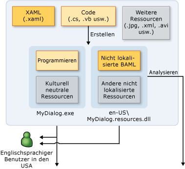
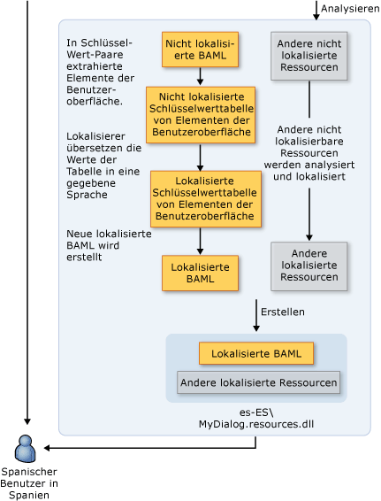

# Übersicht über WPF-Globalisierung und -LokalisierungWPF Globalization and Localization Overview
Wenn Sie die Verfügbarkeit Ihres Produkts auf eine Sprache beschränken, beschränken Sie damit auch Ihre potentielle Kundenbasis auf einen Bruchteil der 6,5 Milliarden Einwohner unseres Planeten.When you limit your product's availability to only one language, you limit your potential customer base to a fraction of our world’s 6.5 billion population. Wenn Ihre Anwendung eine globale Zielgruppe erreichen soll, ist die kostengünstige Lokalisierung Ihres Produktes eine der besten und effizientesten Möglichkeiten, mehr Kunden zu erreichen.If you want your applications to reach a global audience, cost-effective localization of your product is one of the best and most economical ways to reach more customers.  
  
 Diese Übersicht enthält, Globalisierung und Lokalisierung in [!INCLUDE[TLA#tla_winclient](../../../../includes/tlasharptla-winclient-md.md)].This overview introduces globalization and localization in [!INCLUDE[TLA#tla_winclient](../../../../includes/tlasharptla-winclient-md.md)]. Unter Globalisierung versteht man den Entwurf und die Entwicklung von Anwendungen, die an verschiedenen Orten funktionieren.Globalization is the design and development of applications that perform in multiple locations. So unterstützt Globalisierung z.B. lokalisierte Benutzeroberflächen und regionale Daten für Benutzer in unterschiedlichen Kulturen.For example, globalization supports localized user interfaces and regional data for users in different cultures. [!INCLUDE[TLA2#tla_winclient](../../../../includes/tla2sharptla-winclient-md.md)] stellt globalisierte Designfeatures zur, darunter Automatisches Layout, Satellitenassemblys sowie lokalisierte Attribute und Kommentare. provides globalized design features, including automatic layout, satellite assemblies, and localized attributes and commenting.
  
 Unter Lokalisierung versteht man die Übersetzung von Anwendungsressourcen in lokalisierte Versionen für die jeweiligen von der Anwendung unterstützten Kulturen.Localization is the translation of application resources into localized versions for the specific cultures that the application supports. Bei der Lokalisierung [!INCLUDE[TLA2#tla_winclient](../../../../includes/tla2sharptla-winclient-md.md)], verwenden Sie die APIs in der <xref:System.Windows.Markup.Localizer> Namespace.When you localize in [!INCLUDE[TLA2#tla_winclient](../../../../includes/tla2sharptla-winclient-md.md)], you use the APIs in the <xref:System.Windows.Markup.Localizer> namespace. Diese APIs Power der [Beispieltool LocBaml](https://go.microsoft.com/fwlink/?LinkID=160016) -Befehlszeilentool.These APIs power the [LocBaml Tool Sample](https://go.microsoft.com/fwlink/?LinkID=160016) command-line tool. Informationen zum Erstellen und Verwenden von LocBaml finden Sie unter [Lokalisieren einer Anwendung](../../../../docs/framework/wpf/advanced/how-to-localize-an-application.md).For information about how to build and use LocBaml, see [Localize an Application](../../../../docs/framework/wpf/advanced/how-to-localize-an-application.md).    
  
## Bewährte Methoden zur Globalisierung und Lokalisierung in WPF.Best Practices for Globalization and Localization in WPF  
 Sie können die meisten der Globalisierung und Lokalisierung Funktionen, die in integrierten machen [!INCLUDE[TLA2#tla_winclient](../../../../includes/tla2sharptla-winclient-md.md)] anhand der UI-Entwurf und die Lokalisierungs-bezogene Tipps, die dieser Abschnitt enthält.You can make the most of the globalization and localization functionality that is built into [!INCLUDE[TLA2#tla_winclient](../../../../includes/tla2sharptla-winclient-md.md)] by following the UI design and localization-related tips that this section provides.  
  
### Bewährte Methoden für den Entwurf von WPF-BenutzeroberflächenBest Practices for WPF UI Design  
 Beim Entwerfen einer [!INCLUDE[TLA2#tla_winclient](../../../../includes/tla2sharptla-winclient-md.md)]– basierten [!INCLUDE[TLA2#tla_ui](../../../../includes/tla2sharptla-ui-md.md)], sollten Sie diese bewährten Methoden halten:When you design a [!INCLUDE[TLA2#tla_winclient](../../../../includes/tla2sharptla-winclient-md.md)]–based [!INCLUDE[TLA2#tla_ui](../../../../includes/tla2sharptla-ui-md.md)], consider implementing these best practices:  
  
-   Schreiben Ihrer [!INCLUDE[TLA2#tla_ui](../../../../includes/tla2sharptla-ui-md.md)] in [!INCLUDE[TLA2#tla_xaml](../../../../includes/tla2sharptla-xaml-md.md)]; erstellen Sie keine [!INCLUDE[TLA2#tla_ui](../../../../includes/tla2sharptla-ui-md.md)] im Code.Write your [!INCLUDE[TLA2#tla_ui](../../../../includes/tla2sharptla-ui-md.md)] in [!INCLUDE[TLA2#tla_xaml](../../../../includes/tla2sharptla-xaml-md.md)]; avoid creating [!INCLUDE[TLA2#tla_ui](../../../../includes/tla2sharptla-ui-md.md)] in code. Bei der Erstellung Ihrer [!INCLUDE[TLA2#tla_ui](../../../../includes/tla2sharptla-ui-md.md)] mit [!INCLUDE[TLA2#tla_xaml](../../../../includes/tla2sharptla-xaml-md.md)], machen Sie es über den integrierten Lokalisierungs-APIs.When you create your [!INCLUDE[TLA2#tla_ui](../../../../includes/tla2sharptla-ui-md.md)] by using [!INCLUDE[TLA2#tla_xaml](../../../../includes/tla2sharptla-xaml-md.md)], you expose it through built-in localization APIs.  
  
-   Vermeiden Sie die Verwendung absoluter Positionierung und Dimensionierung zum Setzen von Inhaltselementen; Verwenden Sie stattdessen relative oder automatische größenanpassung.Avoid using absolute positions and fixed sizes to lay out content; instead, use relative or automatic sizing.
  
    -   Verwendung <xref:System.Windows.Window.SizeToContent%2A>; und halten Sie Breiten und Höhen festlegen, um `Auto`.Use <xref:System.Windows.Window.SizeToContent%2A>; and keep widths and heights set to `Auto`.  
  
    -   Verwenden Sie <xref:System.Windows.Controls.Canvas> für das Layout [!INCLUDE[TLA2#tla_ui](../../../../includes/tla2sharptla-ui-md.md)]s.Avoid using <xref:System.Windows.Controls.Canvas> to lay out [!INCLUDE[TLA2#tla_ui](../../../../includes/tla2sharptla-ui-md.md)]s.  
  
    -   Verwendung <xref:System.Windows.Controls.Grid> und das Feature Größeninformationen.Use <xref:System.Windows.Controls.Grid> and its size-sharing feature.  
  
-   Lassen Sie an den Rändern zusätzlichen freien Platz, da lokalisierter Text häufig mehr Platz beansprucht.Provide extra space in margins because localized text often requires more space. Zusätzlicher Leerraum kann überstehende Zeichen aufnehmen.Extra space allows for possible overhanging characters.  
  
-   Aktivieren Sie <xref:System.Windows.Controls.TextBlock.TextWrapping%2A> auf <xref:System.Windows.Controls.TextBlock> , dies zu vermeiden.Enable <xref:System.Windows.Controls.TextBlock.TextWrapping%2A> on <xref:System.Windows.Controls.TextBlock> to avoid clipping.
  
-   Legen Sie die **XML: lang** Attribut.Set the **xml:lang** attribute. Dieses Attribut beschreibt die Kultur eines bestimmten Elements und seiner untergeordneten Elemente.This attribute describes the culture of a specific element and its child elements. Der Wert dieser Eigenschaft ändert das Verhalten mehrerer Features in [!INCLUDE[TLA2#tla_winclient](../../../../includes/tla2sharptla-winclient-md.md)].The value of this property changes the behavior of several features in [!INCLUDE[TLA2#tla_winclient](../../../../includes/tla2sharptla-winclient-md.md)]. Es ändert z.B. das Verhalten von Silbentrennung, Rechtschreibprüfung, Zahlenersetzung, Formen komplexer Schriften und die Ausweich-Schriftart.For example, it changes the behavior of hyphenation, spell checking, number substitution, complex script shaping, and font fallback. Finden Sie unter [Globalisierung für WPF](../../../../docs/framework/wpf/advanced/globalization-for-wpf.md) für Weitere Informationen zum Festlegen der [XML: lang Handling in XAML](../../../../docs/framework/xaml-services/xml-lang-handling-in-xaml.md).See [Globalization for WPF](../../../../docs/framework/wpf/advanced/globalization-for-wpf.md) for more information about setting the [xml:lang Handling in XAML](../../../../docs/framework/xaml-services/xml-lang-handling-in-xaml.md).  
  
-   Erstellen Sie eine benutzerdefinierte zusammengesetzte Schriftart, um eine bessere Kontrolle über Schriftarten zu erhalten, die für verschiedene Sprachen verwendet werden.Create a customized composite font to obtain better control of fonts that are used for different languages. In der Standardeinstellung [!INCLUDE[TLA2#tla_winclient](../../../../includes/tla2sharptla-winclient-md.md)] verwendet die Schriftart GlobalUserInterface.composite im Verzeichnis Windows\Fonts.By default, [!INCLUDE[TLA2#tla_winclient](../../../../includes/tla2sharptla-winclient-md.md)] uses the GlobalUserInterface.composite font in your Windows\Fonts directory.  
  
-   Beim Erstellen von Navigations-Anwendungen, die lokalisiert werden kann, in einer Kultur, die Text im rechts-nach-links-Format dargestellt, explizit festlegen der <xref:System.Windows.FlowDirection> jeder Seite, um sicherzustellen, dass die Seite erbt nicht <xref:System.Windows.FlowDirection> aus der <xref:System.Windows.Navigation.NavigationWindow>.When you create navigation applications that may be localized in a culture that presents text in a right-to-left format, explicitly set the <xref:System.Windows.FlowDirection> of every page to ensure the page does not inherit <xref:System.Windows.FlowDirection> from the <xref:System.Windows.Navigation.NavigationWindow>.  
  
-   Legen Sie beim Erstellen von eigenständigen Navigations-Anwendungen, die außerhalb eines Browsers gehostet werden die <xref:System.Windows.Application.StartupUri%2A> für die erste Anwendung auf eine <xref:System.Windows.Navigation.NavigationWindow> statt auf eine Seite (z. B. `<Application StartupUri="NavigationWindow.xaml">`).When you create stand-alone navigation applications that are hosted outside a browser, set the <xref:System.Windows.Application.StartupUri%2A> for your initial application to a <xref:System.Windows.Navigation.NavigationWindow> instead of to a page (for example, `<Application StartupUri="NavigationWindow.xaml">`). Dieser Entwurf ermöglicht es Ihnen so ändern Sie die <xref:System.Windows.FlowDirection> des Fensters und in der Navigationsleiste auf.This design enables you to change the <xref:System.Windows.FlowDirection> of the Window and the navigation bar. Weitere Informationen und ein Beispiel finden Sie unter [Beispiel für eine globalisierte Homepage](https://go.microsoft.com/fwlink/?LinkID=159990).For more information and an example, see [Globalization Homepage Sample](https://go.microsoft.com/fwlink/?LinkID=159990).  
  
### Bewährte Methoden für die Lokalisierung in WPFBest Practices for WPF Localization  
 Bei der Lokalisierung [!INCLUDE[TLA2#tla_winclient](../../../../includes/tla2sharptla-winclient-md.md)]– basierenden Anwendungen, sollten Sie diese bewährten Methoden halten:When you localize [!INCLUDE[TLA2#tla_winclient](../../../../includes/tla2sharptla-winclient-md.md)]–based applications, consider implementing these best practices:  
  
-   Verwenden Sie Lokalisierungskommentare, um zusätzlichen Kontext für Lokalisierer bereitzustellen.Use localization comments to provide extra context for localizers.  
  
-   Verwenden Sie Lokalisierungsattribute, Lokalisierung, statt selektiv steuern <xref:System.Windows.Markup.Localizer.BamlLocalizableResourceKey.Uid%2A> Eigenschaften für Elemente.Use localization attributes to control localization instead of selectively omitting <xref:System.Windows.Markup.Localizer.BamlLocalizableResourceKey.Uid%2A> properties on elements. Finden Sie unter [Lokalisierungsattribute und-Kommentare](../../../../docs/framework/wpf/advanced/localization-attributes-and-comments.md) für Weitere Informationen.See [Localization Attributes and Comments](../../../../docs/framework/wpf/advanced/localization-attributes-and-comments.md) for more information.  
  
-   Verwendung **Msbuild/t: updateuid** und **checkuid** zum Hinzufügen und prüfen <xref:System.Windows.Markup.Localizer.BamlLocalizableResourceKey.Uid%2A> Eigenschaften in Ihrem [!INCLUDE[TLA2#tla_xaml](../../../../includes/tla2sharptla-xaml-md.md)].Use **msbuild /t:updateuid** and **/t:checkuid** to add and check <xref:System.Windows.Markup.Localizer.BamlLocalizableResourceKey.Uid%2A> properties in your [!INCLUDE[TLA2#tla_xaml](../../../../includes/tla2sharptla-xaml-md.md)]. Verwendung <xref:System.Windows.Markup.Localizer.BamlLocalizableResourceKey.Uid%2A> Eigenschaften zum Nachverfolgen von Änderungen zwischen Entwicklung und Lokalisierung.Use <xref:System.Windows.Markup.Localizer.BamlLocalizableResourceKey.Uid%2A> properties to track changes between development and localization. <xref:System.Windows.Markup.Localizer.BamlLocalizableResourceKey.Uid%2A> Eigenschaften können Sie die Lokalisierung neuer entwicklungsänderungen.<xref:System.Windows.Markup.Localizer.BamlLocalizableResourceKey.Uid%2A> properties help you localize new development changes. Wenn Sie manuell hinzufügen <xref:System.Windows.Markup.Localizer.BamlLocalizableResourceKey.Uid%2A> Eigenschaften, die eine [!INCLUDE[TLA2#tla_ui](../../../../includes/tla2sharptla-ui-md.md)], die Aufgabe besteht in der Regel aufwendig und weniger genau.If you manually add <xref:System.Windows.Markup.Localizer.BamlLocalizableResourceKey.Uid%2A> properties to a [!INCLUDE[TLA2#tla_ui](../../../../includes/tla2sharptla-ui-md.md)], the task is typically tedious and less accurate.  
  
    -   Bearbeiten oder ändern Sie nicht <xref:System.Windows.Markup.Localizer.BamlLocalizableResourceKey.Uid%2A> Eigenschaften, die nach Beginn der Lokalisierung.Do not edit or change <xref:System.Windows.Markup.Localizer.BamlLocalizableResourceKey.Uid%2A> properties after you begin localization.  
  
    -   Verwenden Sie keine doppelten <xref:System.Windows.Markup.Localizer.BamlLocalizableResourceKey.Uid%2A> -Eigenschaften (Denken Sie daran, wenn Sie den Befehl Kopieren und Einfügen verwenden).Do not use duplicate <xref:System.Windows.Markup.Localizer.BamlLocalizableResourceKey.Uid%2A> properties (remember this tip when you use the copy-and-paste command).  
  
    -   Legen Sie die `UltimateResourceFallback` Position in der AssemblyInfo, um die entsprechende Ausweichsprache anzugeben (z. B. `[assembly: NeutralResourcesLanguage("en-US",   UltimateResourceFallbackLocation.Satellite)]`).Set the `UltimateResourceFallback` location in AssemblyInfo.\* to specify the appropriate language for fallback (for example, `[assembly: NeutralResourcesLanguage("en-US",   UltimateResourceFallbackLocation.Satellite)]`).  
  
         Wenn Sie sich entscheiden sollen Ihre Quellsprache in der Hauptassembly durch Auslassen der `<UICulture>` markieren Sie in Ihrer Projektdatei hinzu, legen Sie die `UltimateResourceFallback` Speicherort wie die Hauptassembly statt des Satelliten (z. B. `[assembly: NeutralResourcesLanguage("en-US", UltimateResourceFallbackLocation.MainAssembly)]`).If you decide to include your source language in the main assembly by omitting the `<UICulture>` tag in your project file, set the `UltimateResourceFallback` location as the main assembly instead of the satellite (for example, `[assembly: NeutralResourcesLanguage("en-US", UltimateResourceFallbackLocation.MainAssembly)]`).  
  
   
## Lokalisieren einer WPF-AnwendungLocalize a WPF Application  
 Bei der Lokalisierung einer [!INCLUDE[TLA2#tla_winclient](../../../../includes/tla2sharptla-winclient-md.md)] -Anwendung haben Sie mehrere Optionen.When you localize a [!INCLUDE[TLA2#tla_winclient](../../../../includes/tla2sharptla-winclient-md.md)] application, you have several options. Sie können z. B. lokalisierbaren Ressourcen in Ihrer Anwendung zum Binden einer [!INCLUDE[TLA2#tla_xml](../../../../includes/tla2sharptla-xml-md.md)] Datei, lokalisierbaren Text in Resx-Tabellen speichern oder Ihren Lokalisierungsexperten anweisen verwenden [!INCLUDE[TLA#tla_xaml](../../../../includes/tlasharptla-xaml-md.md)] Dateien.For example, you can bind the localizable resources in your application to an [!INCLUDE[TLA2#tla_xml](../../../../includes/tla2sharptla-xml-md.md)] file, store localizable text in resx tables, or have your localizer use [!INCLUDE[TLA#tla_xaml](../../../../includes/tlasharptla-xaml-md.md)] files. Dieser Abschnitt beschreibt einen Lokalisierungsworkflow, der die BAML-Form von XAML, verwendet die mehrere Vorteile bietet:This section describes a localization workflow that uses the BAML form of XAML, which provides several benefits:  
  
-   Sie können lokalisieren, nachdem die Anwendung erstellt ist.You can localize after you build .  
  
-   Sie können mit lokalisierten Versionen einer älteren Version der BAML-Form von XAML auf eine neuere Version der BAML-Form von XAML aktualisieren, damit Sie lokalisieren können, während Sie noch entwickeln.You can update to a newer version of the BAML form of XAMLwith localizations from an older version of the BAML form of XAML so that you can localize at the same time that you develop.  
  
-   Sie können überprüfen, originalen Quellelemente und Semantik zum Zeitpunkt der Kompilierung, weil die BAML-Form von XAML die kompilierte Form von ist [!INCLUDE[TLA2#tla_xaml](../../../../includes/tla2sharptla-xaml-md.md)].You can validate original source elements and semantics at compile time because the BAML form of XAML is the compiled form of [!INCLUDE[TLA2#tla_xaml](../../../../includes/tla2sharptla-xaml-md.md)].  
  
### Buildprozess für die LokalisierungLocalization Build Process  
 Bei der Entwicklung einer [!INCLUDE[TLA2#tla_winclient](../../../../includes/tla2sharptla-winclient-md.md)] Anwendung des Buildprozesses für die Lokalisierung lautet wie folgt:When you develop a [!INCLUDE[TLA2#tla_winclient](../../../../includes/tla2sharptla-winclient-md.md)] application, the build process for localization is as follows:  
  
-   Der Entwickler erstellt und globalisiert die [!INCLUDE[TLA2#tla_winclient](../../../../includes/tla2sharptla-winclient-md.md)] Anwendung.The developer creates and globalizes the [!INCLUDE[TLA2#tla_winclient](../../../../includes/tla2sharptla-winclient-md.md)] application. Im Projekt die Datei der Entwickler legt `<UICulture>en-US</UICulture>` , wenn die Anwendung kompiliert wird, wird eine sprachneutrale Hauptassembly generiert.In the project file the developer sets `<UICulture>en-US</UICulture>` so that when the application is compiled, a language-neutral main assembly is generated. Diese Assembly verfügt über eine ausgelagerte .resources.dll-Datei, die alle lokalisierbaren Ressourcen enthält.This assembly has a satellite .resources.dll file that contains all the localizable resources. Optional, Sie können Anzeigen der Source-Sprache in der Hauptassembly da unsere Lokalisierungs- [!INCLUDE[TLA2#tla_api#plural](../../../../includes/tla2sharptla-apisharpplural-md.md)] Extraktion aus der Hauptassembly unterstützen.Optionally, you can keep the source language in the main assembly because our localization [!INCLUDE[TLA2#tla_api#plural](../../../../includes/tla2sharptla-apisharpplural-md.md)] support extraction from the main assembly.  
  
-   Wenn die Datei in den Build kompiliert wird die [!INCLUDE[TLA2#tla_xaml](../../../../includes/tla2sharptla-xaml-md.md)] in BAML-Form von XAML konvertiert wird.When the file is compiled into the build, the [!INCLUDE[TLA2#tla_xaml](../../../../includes/tla2sharptla-xaml-md.md)] is converted to the BAML form of XAML. Die kulturneutrale `MyDialog.exe` und die kulturspezifische (in englischer Sprache) `MyDialog.resources.dll` Dateien für die englischsprachige Kunden freigegeben werden.The culturally neutral `MyDialog.exe` and the culturally dependent (English) `MyDialog.resources.dll` files are released to the English-speaking customer.  
  
### LokalisierungsworkflowLocalization Workflow  
 Der Lokalisierungsprozess beginnt nach der nicht lokalisierte `MyDialog.resources.dll` -Datei erstellt wird.The localization process begins after the unlocalized `MyDialog.resources.dll` file is built. Die [!INCLUDE[TLA2#tla_ui](../../../../includes/tla2sharptla-ui-md.md)] Elemente und Eigenschaften in Ihrem ursprünglichen [!INCLUDE[TLA2#tla_xaml](../../../../includes/tla2sharptla-xaml-md.md)] werden mithilfe von BAML-Form von XAML in Schlüssel-Wert-Paare extrahiert die [!INCLUDE[TLA2#tla_api#plural](../../../../includes/tla2sharptla-apisharpplural-md.md)] unter <xref:System.Windows.Markup.Localizer>.The [!INCLUDE[TLA2#tla_ui](../../../../includes/tla2sharptla-ui-md.md)] elements and properties in your original [!INCLUDE[TLA2#tla_xaml](../../../../includes/tla2sharptla-xaml-md.md)] are extracted from the BAML form of XAML into key-value pairs by using the [!INCLUDE[TLA2#tla_api#plural](../../../../includes/tla2sharptla-apisharpplural-md.md)] under <xref:System.Windows.Markup.Localizer>. Lokalisierer verwenden die Schlüssel-Wert-Paare, um die Anwendung zu lokalisieren.Localizers use the key-value pairs to localize the application. Sie können nach Abschluss der Lokalisierung aus den neuen Werten eine neue .resource.dll-Datei generieren.You can generate a new .resource.dll from the new values after localization is complete.  
  
 Die Schlüssel des Schlüssel-Wert-Paare sind `x:Uid` Werte, die vom Entwickler in der ursprünglichen platziert werden [!INCLUDE[TLA2#tla_xaml](../../../../includes/tla2sharptla-xaml-md.md)].The keys of the key-value pairs are `x:Uid` values that are placed by the developer in the original [!INCLUDE[TLA2#tla_xaml](../../../../includes/tla2sharptla-xaml-md.md)]. Diese `x:Uid` Werte ermöglichen die [!INCLUDE[TLA2#tla_api](../../../../includes/tla2sharptla-api-md.md)] nachverfolgen und Änderungen, die zwischen dem Entwickler und der Lokalisierer, bei der Lokalisierung auftreten zusammenführen.These `x:Uid` values enable the [!INCLUDE[TLA2#tla_api](../../../../includes/tla2sharptla-api-md.md)] to track and merge changes that happen between the developer and the localizer during localization. Wenn der Entwickler ändert z. B. die [!INCLUDE[TLA2#tla_ui](../../../../includes/tla2sharptla-ui-md.md)] , nachdem der Lokalisierer hat begonnen, können Sie die Änderung der Entwicklung mit der Arbeit bereits abgeschlossenen Lokalisierung zusammenführen, so, dass Arbeit verloren geht.For example, if the developer changes the [!INCLUDE[TLA2#tla_ui](../../../../includes/tla2sharptla-ui-md.md)] after the localizer begins localizing, you can merge the development change with the already completed localization work so that minimal translation work is lost.  
  
 Die folgende Abbildung zeigt einen typischen auf der BAML-Form von XAML-basierenden Lokalisierungsworkflow.The following graphic shows a typical localization workflow that is based on the BAML form of XAML. In diesem Diagramm wird davon ausgegangen, dass der Entwickler die Anwendung schreibt, in englischer Sprache.This diagram assumes the developer writes the application in English. Der Entwickler erstellt und globalisiert die WPF-Anwendung.The developer creates and globalizes the WPF application. Im Projekt die Datei der Entwickler legt `<UICulture>en-US</UICulture>` , damit beim Buildvorgang eine sprachneutrale Hauptassembly generiert wird, eine. resources.dll, die alle lokalisierbare Ressourcen enthält.In the project file the developer sets `<UICulture>en-US</UICulture>` so that on build, a language neutral main assembly gets generated with a satellite .resources.dll containing all localizable resources. Alternativ dazu können Sie auch Ihre Quellsprache in der Hauptassembly belassen, da unsere Lokalisierungs-APIs eine Extraktion aus der Hauptassembly unterstützen.Alternately, one could keep the source language in the main assembly because WPF localization APIs support extraction from the main assembly. Nach dem Buildprozess wird XAML in BAML kompiliert.After the build process, the XAML get compiled into BAML. Die kulturneutrale Datei „MyDialog.exe.resources.dll” wird an den englischsprachigen Kunden ausgeliefert.The culturally neutral MyDialog.exe.resources.dll get shipped to the English speaking customer.  
  
   
  
   
  
   
## Beispiele für WPF-LokalisierungExamples of WPF Localization  
 Dieser Abschnitt enthält Beispiele von lokalisierten Anwendungen, die besser zu verstehen, wie Sie erstellen und Lokalisieren von [!INCLUDE[TLA2#tla_winclient](../../../../includes/tla2sharptla-winclient-md.md)] Anwendungen.This section contains examples of localized applications to help you understand how to build and localize [!INCLUDE[TLA2#tla_winclient](../../../../includes/tla2sharptla-winclient-md.md)] applications.  
  
#### Beispiel-Dialogfeld „Ausführen”Run Dialog Box Example  
 Die folgende Abbildung zeigt die Ausgabe der **ausführen** Beispiel für ein Dialogfeld.The following graphics show the output of the **Run** dialog box sample.  
  
 **Englisch:****English:**  
  
   
  
 **Deutsch:****German:**  
  
   
  
 **Entwerfen eines globalen Dialogfelds „Ausführen”****Designing a Global Run Dialog Box**  
  
 Dieses Beispiel erzeugt eine **ausführen** Dialogfeld mithilfe von [!INCLUDE[TLA2#tla_winclient](../../../../includes/tla2sharptla-winclient-md.md)] und [!INCLUDE[TLA2#tla_xaml](../../../../includes/tla2sharptla-xaml-md.md)].This example produces a **Run** dialog box by using [!INCLUDE[TLA2#tla_winclient](../../../../includes/tla2sharptla-winclient-md.md)] and [!INCLUDE[TLA2#tla_xaml](../../../../includes/tla2sharptla-xaml-md.md)]. Dieses Dialogfeld entspricht dem der **ausführen** Dialogfeld, das in der [!INCLUDE[TLA#tla_win](../../../../includes/tlasharptla-win-md.md)] Menü "Start".This dialog box is equivalent to the **Run** dialog box that is available from the [!INCLUDE[TLA#tla_win](../../../../includes/tlasharptla-win-md.md)] Start menu.  
  
 Einige Highlights beim Erstellen von globalen Dialogfeldern sind:Some highlights for making global dialog boxes are:  
  
 **Automatisches Layout****Automatic Layout**  
  
 *In der Datei Window1.xaml:**In Window1.xaml:*  
  
 `<Window SizeToContent="WidthAndHeight">`  
  
 Die obige Window-Eigenschaft sorgt dafür, dass sich die Fenstergröße automatisch der Inhaltsgröße entsprechend anpasst.The previous Window property automatically resizes the window according to the size of the content. Diese Eigenschaft verhindert, dass Inhalt, der nach der Lokalisierung an Größe zunimmt, abgeschnitten wird. Im Gegenzug wird auch unnötiger Leerraum entfernt, wenn die Größe des Inhalts nach der Lokalisierung geschrumpft ist.This property prevents the window from cutting off content that increases in size after localization; it also removes unneeded space when content decreases in size after localization.  
  
 `<Grid x:Uid="Grid_1">`  
  
 <xref:System.Windows.Markup.Localizer.BamlLocalizableResourceKey.Uid%2A> Eigenschaften sind erforderlich, in der Reihenfolge für [!INCLUDE[TLA2#tla_winclient](../../../../includes/tla2sharptla-winclient-md.md)] Lokalisierung [!INCLUDE[TLA2#tla_api#plural](../../../../includes/tla2sharptla-apisharpplural-md.md)] ordnungsgemäß funktioniert.<xref:System.Windows.Markup.Localizer.BamlLocalizableResourceKey.Uid%2A> properties are needed in order for [!INCLUDE[TLA2#tla_winclient](../../../../includes/tla2sharptla-winclient-md.md)] localization [!INCLUDE[TLA2#tla_api#plural](../../../../includes/tla2sharptla-apisharpplural-md.md)] to work correctly.  
  
 Sie werden verwendet, indem [!INCLUDE[TLA2#tla_winclient](../../../../includes/tla2sharptla-winclient-md.md)] Lokalisierung [!INCLUDE[TLA2#tla_api#plural](../../../../includes/tla2sharptla-apisharpplural-md.md)] zum Nachverfolgen von Änderungen zwischen der Entwicklung und Lokalisierung der [!INCLUDE[TLA#tla_ui](../../../../includes/tlasharptla-ui-md.md)].They are used by [!INCLUDE[TLA2#tla_winclient](../../../../includes/tla2sharptla-winclient-md.md)] localization [!INCLUDE[TLA2#tla_api#plural](../../../../includes/tla2sharptla-apisharpplural-md.md)] to track changes between the development and localization of the [!INCLUDE[TLA#tla_ui](../../../../includes/tlasharptla-ui-md.md)]. <xref:System.Windows.Markup.Localizer.BamlLocalizableResourceKey.Uid%2A> Eigenschaften können Sie eine neuere Version von Zusammenführen der [!INCLUDE[TLA2#tla_ui](../../../../includes/tla2sharptla-ui-md.md)] mit einer älteren Lokalisierung der der [!INCLUDE[TLA2#tla_ui](../../../../includes/tla2sharptla-ui-md.md)].<xref:System.Windows.Markup.Localizer.BamlLocalizableResourceKey.Uid%2A> properties enable you to merge a newer version of the [!INCLUDE[TLA2#tla_ui](../../../../includes/tla2sharptla-ui-md.md)] with an older localization of the [!INCLUDE[TLA2#tla_ui](../../../../includes/tla2sharptla-ui-md.md)]. Sie fügen eine <xref:System.Windows.Markup.Localizer.BamlLocalizableResourceKey.Uid%2A> Eigenschaft, indem Sie Ausführung **Msbuild/t: updateuid RunDialog.csproj** in einer Befehlsshell.You add a <xref:System.Windows.Markup.Localizer.BamlLocalizableResourceKey.Uid%2A> property by running **msbuild /t:updateuid RunDialog.csproj** in a command shell. Dies ist die empfohlene Methode zum Hinzufügen von <xref:System.Windows.Markup.Localizer.BamlLocalizableResourceKey.Uid%2A> Eigenschaften da Manuelles Hinzufügen normalerweise sehr zeitaufwändig und weniger genau ist.This is the recommended method of adding <xref:System.Windows.Markup.Localizer.BamlLocalizableResourceKey.Uid%2A> properties because manually adding them is typically time-consuming and less accurate. Sie können überprüfen, die <xref:System.Windows.Markup.Localizer.BamlLocalizableResourceKey.Uid%2A> Eigenschaften werden durch die Ausführung ordnungsgemäß festgelegt **Msbuild/t: checkuid RunDialog.csproj**.You can check that <xref:System.Windows.Markup.Localizer.BamlLocalizableResourceKey.Uid%2A> properties are correctly set by running **msbuild /t:checkuid RunDialog.csproj**.  
  
 Die [!INCLUDE[TLA2#tla_ui](../../../../includes/tla2sharptla-ui-md.md)] strukturiert ist, mithilfe der <xref:System.Windows.Controls.Grid> -Steuerelement, das ein Steuerelement nützlich, für die Ausnutzung des automatischen Layouts ist in [!INCLUDE[TLA2#tla_winclient](../../../../includes/tla2sharptla-winclient-md.md)].The [!INCLUDE[TLA2#tla_ui](../../../../includes/tla2sharptla-ui-md.md)] is structured by using the <xref:System.Windows.Controls.Grid> control, which is a useful control for taking advantage of the automatic layout in [!INCLUDE[TLA2#tla_winclient](../../../../includes/tla2sharptla-winclient-md.md)]. Beachten Sie, dass das Dialogfeld in drei Zeilen und fünf Spalten unterteilt ist.Note that the dialog box is split into three rows and five columns. Keiner der Zeilen- und Spaltendefinitionen hat eine feste Größe; daher die [!INCLUDE[TLA2#tla_ui](../../../../includes/tla2sharptla-ui-md.md)] Elemente, die in jeder Zelle positioniert werden können, erhöht sich anpassen, dass bei der Lokalisierung vergrößern oder verkleinern.Not one of the row and column definitions has a fixed size; hence, the [!INCLUDE[TLA2#tla_ui](../../../../includes/tla2sharptla-ui-md.md)] elements that are positioned in each cell can adapt to increases and decreases in size during localization.  
  
 [!code-xaml[GlobalizationRunDialog#GridColumnDef](../../../../samples/snippets/csharp/VS_Snippets_Wpf/GlobalizationRunDialog/CS/Window1.xaml#gridcolumndef)]  
  
 Die ersten beiden Spalten, in denen die **öffnen:** Bezeichnung und <xref:System.Windows.Controls.ComboBox> platziert werden 10 Prozent der der [!INCLUDE[TLA2#tla_ui](../../../../includes/tla2sharptla-ui-md.md)] Gesamtbreite.The first two columns where the **Open:** label and <xref:System.Windows.Controls.ComboBox> are placed use 10 percent of the [!INCLUDE[TLA2#tla_ui](../../../../includes/tla2sharptla-ui-md.md)] total width.  
  
 [!code-xaml[GlobalizationRunDialog#GridColumnDef2](../../../../samples/snippets/csharp/VS_Snippets_Wpf/GlobalizationRunDialog/CS/Window1.xaml#gridcolumndef2)]  
  
 Beachten Sie, die der im Beispiel die größenteilungs-Funktion von verwendet <xref:System.Windows.Controls.Grid>.Note that of the example uses the shared-sizing feature of <xref:System.Windows.Controls.Grid>. Die letzten drei Spalten nutzen diesen Umstand, in der gleichen <xref:System.Windows.Controls.DefinitionBase.SharedSizeGroup%2A>.The last three columns take advantage of this by placing themselves in the same <xref:System.Windows.Controls.DefinitionBase.SharedSizeGroup%2A>. Wie aus dem Namen der Eigenschaft zu erwarten ist, ermöglicht dies den Spalten, dieselbe Größe zu verwenden.As one would expect from the name of the property, this allows the columns to share the same size. Wenn Sie "Durchsuchen..." zur längeren Zeichenfolge "Durchsuchen..." lokalisiert wird, wachsen alle Schaltflächen im breiter. ohne eine kleine Schaltfläche "OK" und eine unverhältnismäßig große "Durchsuchen..."-Schaltfläche.So when the "Browse…" gets localized to the longer string "Durchsuchen…", all buttons grow in width instead of having a small "OK" button and a disproportionately large "Durchsuchen…" button.  
  
 **xml:lang****Xml:lang**  
  
 `Xml:lang="en-US"`  
  
 Beachten Sie, dass die [XML: lang Handling in XAML](../../../../docs/framework/xaml-services/xml-lang-handling-in-xaml.md) platziert das Stammelement der [!INCLUDE[TLA2#tla_ui](../../../../includes/tla2sharptla-ui-md.md)].Notice the [xml:lang Handling in XAML](../../../../docs/framework/xaml-services/xml-lang-handling-in-xaml.md) placed at the root element of the [!INCLUDE[TLA2#tla_ui](../../../../includes/tla2sharptla-ui-md.md)]. Diese Eigenschaft beschreibt die Kultur eines bestimmten Elements und seiner untergeordneten Elemente.This property describes the culture of a given element and its children. Dieser Wert wird verwendet, von mehreren Features in [!INCLUDE[TLA2#tla_winclient](../../../../includes/tla2sharptla-winclient-md.md)] und sollte bei der Lokalisierung entsprechend geändert werden.This value is used by several features in [!INCLUDE[TLA2#tla_winclient](../../../../includes/tla2sharptla-winclient-md.md)] and should be changed appropriately during localization. Dieser Wert bestimmt, welches Sprachwörterbuch für Silbentrennung und Rechtschreibprüfung verwendet wird.This value changes what language dictionary is use to hyphenate and spell check words. Es wirkt sich auch auf die Anzeige von Ziffern aus, und wie das Fallbacksystem für Schriftarten entscheidet, welche Schriftart zu benutzen ist.It also affects the display of digits and how the font fallback system selects which font to use. Schließlich beeinflusst die Eigenschaft auch, wie Zahlen formatiert und in welcher Form komplexe Schriften dargestellt werden.Finally, the property affects the way numbers are displayed and the way texts written in complex scripts are shaped. Der Standardwert ist „en-US”.The default value is "en-US".  
  
 **Erstellen eine Satellitenressourcenassembly****Building a Satellite Resource Assembly**  
  
 *In .csproj:**In .csproj:*  
  
 `<UICulture>en-US</UICulture>`  
  
 Beachten Sie, dass das Hinzufügen einer `UICulture` Wert.Notice the addition of a `UICulture` value. Dies ist bei Festlegung auf einen gültigen <xref:System.Globalization.CultureInfo> Wert wie z. B. En-US, beim Erstellen des Projekts eine Satellitenassembly alle lokalisierbaren Ressourcen bei der es generiert.When this is set to a valid <xref:System.Globalization.CultureInfo> value such as en-US, building the project will generate a satellite assembly with all localizable resources in it.  
  
 `<Resource Include="RunIcon.JPG">`  
  
 `<Localizable>False</Localizable>`  
  
 `</Resource>`  
  
 Die `RunIcon.JPG` muss nicht lokalisiert werden, da sie für alle Kulturen identisch angezeigt werden soll.The `RunIcon.JPG` does not need to be localized because it should appear the same for all cultures. `Localizable` nastaven NA hodnotu `false` , damit es in der sprachneutralen Hauptassembly statt der Satellitenassembly verbleibt.`Localizable` is set to `false` so that it remains in the language neutral main assembly instead of the satellite assembly. Der Standardwert aller nicht kompilierbaren Ressourcen ist `Localizable` festgelegt `true`.The default value of all noncompilable resources is `Localizable` set to `true`.  
  
 **Lokalisieren des Dialogfelds „Ausführen”****Localizing the Run Dialog**  
  
 **Auslesen****Parse**  
  
 Nachdem die Anwendung erstellt, ist der erste Schritt bei der Lokalisierung, die lokalisierbaren Ressourcen aus der Satellitenassembly auszulesen.After building the application, the first step in localizing it is parsing the localizable resources out of the satellite assembly. Für die Zwecke dieses Themas, verwenden Sie das Beispieltool LocBaml die finden Sie unter [Beispieltool LocBaml](https://go.microsoft.com/fwlink/?LinkID=160016).For the purposes of this topic, use the sample LocBaml tool which can be found at [LocBaml Tool Sample](https://go.microsoft.com/fwlink/?LinkID=160016). Beachten Sie, dass LocBaml lediglich ein Beispieltool ist, das Ihnen beim Erstellen eines Lokalisierungstools helfen soll, das Ihrem Lokalisierungsprozess entspricht.Note that LocBaml is only a sample tool meant to help you get started in building a localization tool that fits into your localization process. Verwenden von LocBaml, führen Sie Folgendes analysieren: **LocBaml/parse RunDialog.resources.dll/out:** um eine "RunDialog.resources.dll.CSV"-Datei zu generieren.Using LocBaml, run the following to parse: **LocBaml /parse RunDialog.resources.dll /out:** to generate a "RunDialog.resources.dll.CSV" file.  
  
 **Lokalisieren****Localize**  
  
 Verwenden Sie zum Bearbeiten dieser Datei Ihren bevorzugten Unicode-fähigen CSV-Editor.Use your favorite CSV editor that supports Unicode to edit this file. Filtern Sie alle Einträge mit einer Lokalisierungskategorie von „None” heraus.Filter out all entries with a localization category of "None". Sie sollten folgende Einträge sehen:You should see the following entries:  
  
|RessourcenschlüsselResource Key|LokalisierungskategorieLocalization Category|WertValue|  
|-|-|-| 
|Button_1:System.Windows.Controls.Button.$ContentButton_1:System.Windows.Controls.Button.$Content|SchaltflächeButton|OKOK|  
|Button_2:System.Windows.Controls.Button.$ContentButton_2:System.Windows.Controls.Button.$Content|SchaltflächeButton|AbbrechenCancel|  
|Button_3:System.Windows.Controls.Button.$ContentButton_3:System.Windows.Controls.Button.$Content|SchaltflächeButton|Durchsuchen...Browse...|  
|ComboBox_1:System.Windows.Controls.ComboBox.$ContentComboBox_1:System.Windows.Controls.ComboBox.$Content|ComboBoxComboBox||  
|TextBlock_1:System.Windows.Controls.TextBlock.$ContentTextBlock_1:System.Windows.Controls.TextBlock.$Content|TextText|Geben Sie den Namen eines Programms, Ordners, Dokuments oder einer Internetressource ein, damit Windows das entsprechende Objekt öffnet.Type the name of a program, folder, document, or Internet resource, and Windows will open it for you.|  
|TextBlock_2:System.Windows.Controls.TextBlock.$ContentTextBlock_2:System.Windows.Controls.TextBlock.$Content|TextText|Öffnen:Open:|  
|Window_1:System.Windows.Window.TitleWindow_1:System.Windows.Window.Title|TitelTitle|RunRun|  
  
 Um die Anwendung auf Deutsch zu lokalisieren, sind die folgenden Übersetzungen erforderlich:Localizing the application to German would require the following translations:  
  
|RessourcenschlüsselResource Key|LokalisierungskategorieLocalization Category|WertValue|  
|-|-|-| 
|Button_1:System.Windows.Controls.Button.$ContentButton_1:System.Windows.Controls.Button.$Content|SchaltflächeButton|OKOK|  
|Button_2:System.Windows.Controls.Button.$ContentButton_2:System.Windows.Controls.Button.$Content|SchaltflächeButton|AbbrechenAbbrechen|  
|Button_3:System.Windows.Controls.Button.$ContentButton_3:System.Windows.Controls.Button.$Content|SchaltflächeButton|Durchsuchen…Durchsuchen…|  
|ComboBox_1:System.Windows.Controls.ComboBox.$ContentComboBox_1:System.Windows.Controls.ComboBox.$Content|ComboBoxComboBox||  
|TextBlock_1:System.Windows.Controls.TextBlock.$ContentTextBlock_1:System.Windows.Controls.TextBlock.$Content|TextText|Geben Sie den Namen eines Programms, Ordners, Dokuments oder einer Internetressource an.Geben Sie den Namen eines Programms, Ordners, Dokuments oder einer Internetresource an.|  
|TextBlock_2:System.Windows.Controls.TextBlock.$ContentTextBlock_2:System.Windows.Controls.TextBlock.$Content|TextText|Öffnen:Öffnen:|  
|Window_1:System.Windows.Window.TitleWindow_1:System.Windows.Window.Title|TitelTitle|AusführenRun|  
  
 **Generieren****Generate**  
  
 Der letzte Schritt der Lokalisierung umfasst das Erstellen der neu lokalisierten Satellitenassembly.The last step of localization involves creating the newly localized satellite assembly. Dies kann mithilfe des folgenden LocBaml-Befehls erreicht werden:This can be accomplished with the following LocBaml command:  
  
 **LocBaml.exe /generate RunDialog.resources.dll /trans:RunDialog.resources.dll.CSV /out: . /cul:de-DE****LocBaml.exe /generate RunDialog.resources.dll /trans:RunDialog.resources.dll.CSV /out: . /cul:de-DE**  
  
 Auf Deutsch [!INCLUDE[TLA#tla_mswin](../../../../includes/tlasharptla-mswin-md.md)], wenn diese "Resources.dll"-Datei in einen Ordner "de-DE" neben der Hauptassembly platziert wird, wird diese Ressource automatisch statt der im Ordner "En-US" geladen.On German [!INCLUDE[TLA#tla_mswin](../../../../includes/tlasharptla-mswin-md.md)], if this resources.dll is placed in a de-DE folder next to the main assembly, this resource will automatically load instead of the one in the en-US folder. Wenn Sie nicht über eine deutsche Version von verfügen [!INCLUDE[TLA#tla_mswin](../../../../includes/tlasharptla-mswin-md.md)] um dies zu testen, legen Sie die Kultur auf die Kultur des [!INCLUDE[TLA#tla_mswin](../../../../includes/tlasharptla-mswin-md.md)] Sie verwenden (z.B. En-US), und Ersetzen Sie die ursprüngliche "Resources.dll"-Datei.If you do not have a German version of [!INCLUDE[TLA#tla_mswin](../../../../includes/tlasharptla-mswin-md.md)] to test this, set the culture to whatever culture of [!INCLUDE[TLA#tla_mswin](../../../../includes/tlasharptla-mswin-md.md)] you are using (i.e. en-US), and replace the original resources.dll.  
  
 **Laden der Satellitenressourcen****Satellite Resource Loading**  
  
|MyDialog.exeMyDialog.exe|en-US\MyDialog.resources.dllen-US\MyDialog.resources.dll|de-DE\MyDialog.resources.dllde-DE\MyDialog.resources.dll|  
|------------------|------------------------------------|------------------------------------|  
|CodeCode|Ursprüngliche englische BAMLOriginal English BAML|Lokalisierte BAMLLocalized BAML|  
|Kulturneutrale RessourcenCulturally neutral resources|Weitere Ressourcen auf EnglischOther resources in English|Weitere ins Deutsche lokalisierte RessourcenOther resources localized to German|  
  
 .NET Framework wählt automatisch die Satellitenressourcenassembly basierend auf der Anwendung laden `Thread.CurrentThread.CurrentUICulture`.The .NET framework automatically chooses which satellite resources assembly to load based on the application’s `Thread.CurrentThread.CurrentUICulture`. Dies ist standardmäßig auf die Kultur des Ihre [!INCLUDE[TLA#tla_mswin](../../../../includes/tlasharptla-mswin-md.md)] OS.This defaults to the culture of your [!INCLUDE[TLA#tla_mswin](../../../../includes/tlasharptla-mswin-md.md)] OS. Dies der Fall ist bei Verwendung der deutschen [!INCLUDE[TLA#tla_mswin](../../../../includes/tlasharptla-mswin-md.md)], die de-DE\MyDialog.resources.dll geladen wird, wenn Sie Englisch verwenden [!INCLUDE[TLA#tla_mswin](../../../../includes/tlasharptla-mswin-md.md)], lädt die en-US\MyDialog.resources.dll.So if you are using German [!INCLUDE[TLA#tla_mswin](../../../../includes/tlasharptla-mswin-md.md)], the de-DE\MyDialog.resources.dll loads, if you are using English [!INCLUDE[TLA#tla_mswin](../../../../includes/tlasharptla-mswin-md.md)], the en-US\MyDialog.resources.dll loads. Sie können für Ihre Anwendung die endgültige Fallbackressource durch Angabe von NeutralResourcesLanguage in der AssemblyInfo.\* Ihres Projekts festlegen.You can set the ultimate fallback resource for your application by specifying the NeutralResourcesLanguage in your project’s AssemblyInfo.\*. Wenn Sie also z.B. folgendes angeben:For example if you specify:  
  
 `[assembly: NeutralResourcesLanguage("en-US", UltimateResourceFallbackLocation.Satellite)]`  
  
 dann wird in einem deutschen Windows die „en-US\MyDialog.resources.dll” verwendet, wenn weder „de-DE\MyDialog.resources.dll” noch „de\MyDialog.resources.dll” verfügbar sind.then the en-US\MyDialog.resources.dll will be used with German Windows if a de-DE\MyDialog.resources.dll or de\MyDialog.resources.dll are both unavailable.  
  
### Homepage von Microsoft Saudi-ArabienMicrosoft Saudi Arabia Homepage  
 Die folgende Abbildung zeigt eine englische und eine arabische Homepage.The following graphics show an English and Arabic Homepage. Das vollständige Beispiel, das diese Abbildungen erzeugt finden Sie unter [Beispiel für eine globalisierte Homepage](https://go.microsoft.com/fwlink/?LinkID=159990).For the complete sample that produces these graphics see [Globalization Homepage Sample](https://go.microsoft.com/fwlink/?LinkID=159990).  
  
 **Englisch:****English:**  
  
   
  
 **Arabisch:****Arabic:**  
  
   
  
### Entwerfen einer globalen Microsoft-HomepageDesigning a Global Microsoft Homepage  
 Dieses Modell der Microsoft Saudi-Arabien Website veranschaulicht die Globalisierungsfeatures für Sprachen in rechts-nach-links-Schreibweise.This mock up of the Microsoft Saudi Arabia web site illustrates the globalization features provided for RightToLeft languages. Sprachen wie Hebräisch und Arabisch haben eine rechts-nach-Links-Lesefolge, sodass das Layout der [!INCLUDE[TLA2#tla_ui](../../../../includes/tla2sharptla-ui-md.md)] müssen häufig angeordnet werden etwas anders, als wäre es in links-nach-rechts-Sprachen wie Englisch.Languages such as Hebrew and Arabic have a right-to-left reading order so the layout of [!INCLUDE[TLA2#tla_ui](../../../../includes/tla2sharptla-ui-md.md)] must often be laid out quite differently than it would be in left-to-right languages such as English. Die Lokalisierung von einer links-nach-rechts-Sprache in eine rechts-nach-links-Sprache oder umgekehrt kann sehr anspruchsvoll sein.Localizing from a left-to-right language to a right-to-left language or vice versa can be quite challenging. [!INCLUDE[TLA2#tla_winclient](../../../../includes/tla2sharptla-winclient-md.md)] wurde entwickelt, um solche Lokalisierungsanforderungen wesentlich zu erleichtern. has been designed to make such localizations much easier.  
  
 **FlowDirection****FlowDirection**  
  
 *Homepage.xaml:**Homepage.xaml:*  
  
 [!code-xaml[GlobalizationHomepage#Homepage](../../../../samples/snippets/csharp/VS_Snippets_Wpf/GlobalizationHomepage/CS/Homepage.xaml#homepage)]  
  
 Beachten Sie, dass die <xref:System.Windows.FrameworkElement.FlowDirection%2A> Eigenschaft <xref:System.Windows.Controls.Page>.Notice the <xref:System.Windows.FrameworkElement.FlowDirection%2A> property on <xref:System.Windows.Controls.Page>. Ändern diese Eigenschaft auf <xref:System.Windows.FlowDirection.RightToLeft> ändert sich die <xref:System.Windows.FrameworkElement.FlowDirection%2A> von der <xref:System.Windows.Controls.Page> und seiner untergeordneten Elemente, damit das Layout der [!INCLUDE[TLA2#tla_ui](../../../../includes/tla2sharptla-ui-md.md)] rechts-nach-links ein Arabischer Benutzer dies erwarten würde steigender gekippt wird.Changing this property to <xref:System.Windows.FlowDirection.RightToLeft> will change the <xref:System.Windows.FrameworkElement.FlowDirection%2A> of the <xref:System.Windows.Controls.Page> and its children elements so that the layout of this [!INCLUDE[TLA2#tla_ui](../../../../includes/tla2sharptla-ui-md.md)] is flipped to become right-to-left as an Arabic user would expect. Das Vererbungsverhalten lässt sich durch Angabe einer expliziten überschreiben <xref:System.Windows.FrameworkElement.FlowDirection%2A> auf ein beliebiges Element.One can override the inheritance behavior by specifying an explicit <xref:System.Windows.FrameworkElement.FlowDirection%2A> on any element. Die <xref:System.Windows.FrameworkElement.FlowDirection%2A> Eigenschaft steht auf jedem <xref:System.Windows.FrameworkElement> oder dokumentbezogenes Element und hat den impliziten Wert <xref:System.Windows.FlowDirection.LeftToRight>.The <xref:System.Windows.FrameworkElement.FlowDirection%2A> property is available on any <xref:System.Windows.FrameworkElement> or document related element and has an implicit value of <xref:System.Windows.FlowDirection.LeftToRight>.  
  
 Beachten Sie, dass sogar die Hintergrund-Farbverlaufspinsel ordnungsgemäß, wenn gekippt werden der Stamm <xref:System.Windows.FrameworkElement.FlowDirection%2A> geändert wird:Observe that even the background gradient brushes are flipped correctly when the root <xref:System.Windows.FrameworkElement.FlowDirection%2A> is changed:  
  
 **FlowDirection="LeftToRight"****FlowDirection="LeftToRight"**  
  
   
  
 **FlowDirection="RightToLeft"****FlowDirection="RightToLeft"**  
  
   
  
 **Verwenden Sie keine feste Abmessungen für Bereiche und Steuerelemente****Avoid Using Fixed Dimensions for Panels and Controls**  
  
 Nehmen Sie sich Homepage.XAML anschauen, beachten Sie, dass abgesehen von der feste Breite und Höhe angegeben, für die gesamte [!INCLUDE[TLA2#tla_ui](../../../../includes/tla2sharptla-ui-md.md)] am oberen Rand <xref:System.Windows.Controls.DockPanel>, es gibt keine anderen festen Abmessungen.Take a look through Homepage.xaml, notice that aside from the fixed width and height specified for the entire [!INCLUDE[TLA2#tla_ui](../../../../includes/tla2sharptla-ui-md.md)] on the top <xref:System.Windows.Controls.DockPanel>, there are no other fixed dimensions. Vermeiden Sie feste Abmessungen, um zu vermeiden, dass lokalisierter Text, der länger als der Quelltext werden kann, abgeschnitten wird.Avoid using fixed dimensions to prevent clipping localized text that may be longer than the source text. [!INCLUDE[TLA2#tla_winclient](../../../../includes/tla2sharptla-winclient-md.md)]-Bereiche und Steuerelemente passen ihre Größe automatisch dem ihres Inhalts an. panels and controls will automatically resize based on the content that they contain. Die meisten Steuerelemente haben außerdem Mindest- und Höchstmaße, die Sie für mehr Kontrolle angeben können (z.B. MinWidth="20").Most controls also have minimum and maximum dimensions that you can set for more control (i.e. MinWidth= "20"). Mit <xref:System.Windows.Controls.Grid>, Sie können auch die relative Breiten und Höhen festlegen, mit "\*" (z.B. Width = "0.25\*") oder das größenteilungsfeature der Zelle verwenden.With <xref:System.Windows.Controls.Grid>, you can also set relative widths and heights by using ‘\*’ (i.e. Width= "0.25\*") or use its cell size sharing feature.  
  
 **Lokalisierungskommentare****Localization Comments**  
  
 Es gibt viele Fälle, in denen Inhalt mehrdeutig und schwierig zu übersetzen sein kann.There are many cases where content may be ambiguous and difficult to translate. Der Entwickler oder Designer verfügt über die Möglichkeit, zusätzlichen Kontext und Kommentare für Lokalisierer über Lokalisierungskommentare bereitzustellen.The developer or designer has the ability to provide extra context and comments to localizers through localization comments. So verdeutlicht z.B. „Localization.Comments” im nachstehenden Beispiel die Verwendung des Zeichens '&#124'.For example the Localization.Comments below clarifies the usage of the character ‘&#124;’.  
  
 [!code-xaml[GlobalizationHomepage#LocalizationComment](../../../../samples/snippets/csharp/VS_Snippets_Wpf/GlobalizationHomepage/CS/Homepage.xaml#localizationcomment)]  
  
 Dieser Kommentar wird im Fall des LocBaml-Tools und Inhalt von TextBlock_1 zugeordnet (finden Sie unter [Lokalisieren einer Anwendung](../../../../docs/framework/wpf/advanced/how-to-localize-an-application.md)), kann in der 6. Spalte der Zeile TextBlock_1 in der ausgegebenen CSV-Datei angezeigt werden:This comment becomes associated with TextBlock_1’s content and in the case of the LocBaml Tool, ( see [Localize an Application](../../../../docs/framework/wpf/advanced/how-to-localize-an-application.md)), it can be seen in the 6th column of the TextBlock_1 row in the output .csv file:  
  
|RessourcenschlüsselResource Key|KategorieCategory|LesbarReadable|ÄnderbarModifiable|KommentarComment|WertValue|  
|-|-|-|-|-|-|  
|TextBlock_1:System.Windows.Controls.TextBlock.$ContentTextBlock_1:System.Windows.Controls.TextBlock.$Content|TextText|TRUETRUE|trueTRUE|Dieses Zeichen wird als dekorative Abgrenzungslinie verwendet.This character is used as a decorative rule.|&#124;&#124;|  
  
 Kommentare können auf den Inhalt oder die Eigenschaften jedes Elements mithilfe der folgenden Syntax platziert werden:Comments can be placed on the content or property of any element using the following syntax:  
  
 [!code-xaml[GlobalizationHomepage#LocalizationCommentsProp](../../../../samples/snippets/csharp/VS_Snippets_Wpf/GlobalizationHomepage/CS/Homepage.xaml#localizationcommentsprop)]  
  
 **Lokalisierungsattribute****Localization Attributes**  
  
 Häufig muss der Entwickler oder Lokalisierungsmanager Kontrolle darüber haben, was Lokalisierer lesen und ändern können.Often the developer or localization manager needs control of what localizers can read and modify. Sie möchten z.B. nicht, dass der Lokalisierer den Namen Ihres Unternehmens oder eine rechtliche Floskel übersetzt.For example, you might not want the localizer to translate the name of your company or legal wording. [!INCLUDE[TLA2#tla_winclient](../../../../includes/tla2sharptla-winclient-md.md)] bietet Attribute, mit denen Sie die Lesbarkeit, Änderbarkeit und Kategorie des Inhalts eines Elements oder einer Eigenschaft festlegen können. Diese Attribute kann Ihr Lokalisierungstool zum Sperren, Ausblenden oder Sortieren von Elementen verwenden. provides attributes that enable you to set the readability, modifiability, and category of an element’s content or property which your localization tool can use to lock, hide, or sort elements. Weitere Informationen finden Sie unter <xref:System.Windows.Localization.Attributes%2A>.For more information, see <xref:System.Windows.Localization.Attributes%2A>. Für die Zwecke dieses Beispiels gibt das LocBaml-Tool nur die Werte dieser Attribute aus.For the purposes of this sample, the LocBaml Tool just outputs the values of these attributes. Alle [!INCLUDE[TLA2#tla_winclient](../../../../includes/tla2sharptla-winclient-md.md)]-Steuerelemente besitzen Standardwerte für diese Attribute, die Sie aber überschreiben können.[!INCLUDE[TLA2#tla_winclient](../../../../includes/tla2sharptla-winclient-md.md)] controls all have default values for these attributes, but you the can override them. Im folgende Beispiel überschreibt z. B. die standardmäßigen Lokalisierungsattribute für `TextBlock_1` und der Inhalt lesbar sein für Lokalisierer aber nicht änderbar festgelegt.For example, the following example overrides the default localization attributes for `TextBlock_1` and sets the content to be readable but unmodifiable for localizers.  
  
 [!code-xaml[LocalizationComAtt#LocalizationAttributes](../../../../samples/snippets/csharp/VS_Snippets_Wpf/LocalizationComAtt/CSharp/Attributes.xaml#localizationattributes)]  
  
 Zusätzlich zu den Lesbarkeit und Änderbarkeit Attribute [!INCLUDE[TLA2#tla_winclient](../../../../includes/tla2sharptla-winclient-md.md)] stellt eine Enumeration von allgemeinen Kategorien der Benutzeroberfläche (<xref:System.Windows.LocalizationCategory>), die verwendet werden kann, um Lokalisierern mehr Kontext bereitgestellt.In addition to the readability and modifiability attributes, [!INCLUDE[TLA2#tla_winclient](../../../../includes/tla2sharptla-winclient-md.md)] provides an enumeration of common UI categories (<xref:System.Windows.LocalizationCategory>) that can be used to give localizers more context. Die [!INCLUDE[TLA2#tla_winclient](../../../../includes/tla2sharptla-winclient-md.md)] -Standardkategorien für Plattformsteuerelemente können überschrieben werden, [!INCLUDE[TLA2#tla_xaml](../../../../includes/tla2sharptla-xaml-md.md)] ebenfalls:The [!INCLUDE[TLA2#tla_winclient](../../../../includes/tla2sharptla-winclient-md.md)] default categories for platform controls can be overridden in [!INCLUDE[TLA2#tla_xaml](../../../../includes/tla2sharptla-xaml-md.md)] as well:  
  
 [!code-xaml[LocalizationComAtt#LocalizationAttributesOverridden](../../../../samples/snippets/csharp/VS_Snippets_Wpf/LocalizationComAtt/CSharp/Attributes.xaml#localizationattributesoverridden)]  
  
 Die standardmäßigen Lokalisierungsattribute, [!INCLUDE[TLA2#tla_winclient](../../../../includes/tla2sharptla-winclient-md.md)] bietet kann auch über Code überschrieben werden, damit Sie die richtigen Standardwerte für benutzerdefinierte Steuerelemente ordnungsgemäß festlegen können.The default localization attributes that [!INCLUDE[TLA2#tla_winclient](../../../../includes/tla2sharptla-winclient-md.md)] provides can also be overridden through code, so you can correctly set the right default values for custom controls. Zum Beispiel:For example:  
  
 `[Localizability(Readability = Readability.Readable, Modifiability=Modifiability.Unmodifiable, LocalizationCategory.None)]`  
  
 `public class CorporateLogo: TextBlock`  
  
 `{`  
  
 `…`  
  
 `..`  
  
 `.`  
  
 `}`  
  
 Der im festgelegten [!INCLUDE[TLA2#tla_xaml](../../../../includes/tla2sharptla-xaml-md.md)] Vorrang vor den Werten, die im Code für benutzerdefinierte Steuerelemente festgelegt.The per instance attributes set in [!INCLUDE[TLA2#tla_xaml](../../../../includes/tla2sharptla-xaml-md.md)] will take precedence over the values set in code on custom controls. Weitere Informationen zu Attributen und Kommentaren finden Sie unter [Lokalisierungsattribute und-Kommentare](../../../../docs/framework/wpf/advanced/localization-attributes-and-comments.md).For more information on attributes and comments, see [Localization Attributes and Comments](../../../../docs/framework/wpf/advanced/localization-attributes-and-comments.md).  
  
 **Schriftart-Fallback und zusammengesetzte Schriftarten****Font Fallback and Composite Fonts**  
  
 Wenn Sie eine Schriftart angeben, die nicht über einen bestimmten Bereich unterstützt [!INCLUDE[TLA2#tla_winclient](../../../../includes/tla2sharptla-winclient-md.md)] führen ein automatisches fallback auf eine, die mit die globale User-Codepunkten, die im Verzeichnis Windows\Fonts befindet.If you specify a font that does not support a given codepoint range, [!INCLUDE[TLA2#tla_winclient](../../../../includes/tla2sharptla-winclient-md.md)] will automatically fallback to one that does by using the Global User Interface.compositefont that is located in your Windows\Fonts directory. Zusammengesetzte Schriftarten funktionieren wie jede andere Schriftart und können durch explizites Festlegen der FontFamily-Eigenschaft eines Elements verwendet werden (z.B. FontFamily = "Global User Interface").Composite fonts work just as any other font and can be used explicitly by setting an element’s FontFamily (i.e. FontFamily= "Global User Interface"). Sie können Ihre eigene bevorzugte Ausweichschriftart angeben, indem Sie eine eigene zusammengesetzte Schriftart erstellen und angeben, welche Schriftart jeweils für bestimmte Codepunkt-Bereiche und Sprachen verwendet werden soll.You can specify your own font fallback preference by creating your own composite font and specifying what font to use for specific codepoint ranges and languages.  
  
 Weitere Informationen zu zusammengesetzte Schriftarten finden Sie unter <xref:System.Windows.Media.FontFamily>.For more information on composite fonts see <xref:System.Windows.Media.FontFamily>.  
  
 **Lokalisieren der Microsoft-Homepage****Localizing the Microsoft Homepage**  
  
 Sie können die gleichen Schritte wie im Beispiel zum Dialogfeld „Ausführen” nutzen, um diese Anwendung zu lokalisieren.You can follow the same steps as the Run Dialog example to localize this application. Die lokalisierte CSV-Datei für Arabisch steht für Sie in der [Beispiel für eine globalisierte Homepage](https://go.microsoft.com/fwlink/?LinkID=159990).The localized .csv file for Arabic is available for you in the [Globalization Homepage Sample](https://go.microsoft.com/fwlink/?LinkID=159990).
