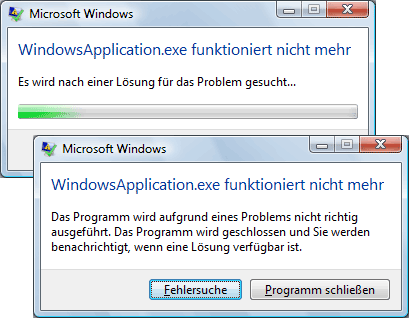

# &#220;bersicht &#252;ber die Anwendungsverwaltung
Alle Anwendungen neigen, eine einheitliche freizugeben, die von der Funktion festgelegt wird, an die Implementierung und Verwaltung von Anwendungen gelten soll.  Dieses Thema bietet eine Übersicht über die Funktionen in der <xref:System.Windows.Application>\-Klasse zum Erstellen und Verwalten von Anwendungen bereit.  
  
   
  
## Die Application\-Klasse  
 In [!INCLUDE[TLA2#tla_wpf](../../../../includes/tla2sharptla-wpf-md.md)]allgemeinen anwendungsspezifischen Funktionen wird in der <xref:System.Windows.Application>\-Klasse gekapselt.  Die <xref:System.Windows.Application>\-Klasse umfasst die folgenden Funktionen:  
  
-   Verfolgen und Beeinflussen der Lebensdauer einer Anwendung  
  
-   Abrufen und Verarbeiten von Befehlszeilenparametern  
  
-   Erkennen von und Reagieren auf nicht behandelte Ausnahmen  
  
-   Freigeben anwendungsspezifischer Eigenschaften und Ressourcen  
  
-   Verwalten von Fenstern in eigenständigen Anwendungen  
  
-   Verfolgen und Verwalten der Navigation.  
  
<a name="The_Application_Class"></a>   
## Wie Sie häufige Aufgaben mit der Anwendungsklasse ausführt  
 Wenn Sie nicht alle Details der <xref:System.Windows.Application>\-Klasse interessiert sind, werden in der folgenden Tabelle <xref:System.Windows.Application> für gängige Aufgaben aufgelistet und deren Verwendung.  Mit der verwandten APIs und die Themen anzeigen, können Sie weitere Informationen und Beispielcode finden.  
  
|Aufgabe|Vorgehensweise|  
|-------------|--------------------|  
|Ruft ein Objekt ab, das die aktuelle Anwendung darstellt|Verwenden Sie die <xref:System.Windows.Application.Current%2A?displayProperty=fullName>\-Eigenschaft.|  
|Fügen Sie einen Startbildschirm einer Anwendung hinzu|Weitere Informationen finden Sie unter [Hinzufügen eines Begrüßungsbildschirms zu einer WPF\-Anwendung](../../../../docs/framework/wpf/app-development/how-to-add-a-splash-screen-to-a-wpf-application.md).|  
|Starten einer Anwendung|Verwenden Sie die <xref:System.Windows.Application.Run%2A?displayProperty=fullName>\-Methode.|  
|Beenden einer Anwendung|Verwenden Sie die <xref:System.Windows.Application.Shutdown%2A>\-Methode des <xref:System.Windows.Application.Current%2A?displayProperty=fullName>\-Objekts.|  
|Rufen Sie Argumente in der Befehlszeile ab|Behandeln Sie das <xref:System.Windows.Application.Startup?displayProperty=fullName>\-Ereignis, und verwenden Sie die <xref:System.Windows.StartupEventArgs.Args%2A?displayProperty=fullName>\-Eigenschaft.  Ein Beispiel finden Sie unter <xref:System.Windows.Application.Startup?displayProperty=fullName>\-Ereignis.|  
|Abrufen und Festlegen von der Anwendungsexitcode fest|Legen Sie die <xref:System.Windows.ExitEventArgs.ApplicationExitCode%2A?displayProperty=fullName>\-Eigenschaft im <xref:System.Windows.Application.Exit?displayProperty=fullName>\-Ereignishandler fest, oder rufen Sie die <xref:System.Windows.Application.Shutdown%2A>\-Methode auf, und übergeben Sie eine ganze Zahl.|  
|Erkennen von und Reagieren auf Ausnahmefehler|Behandeln des <xref:System.Windows.Application.DispatcherUnhandledException>\-Ereignisses.|  
|Abrufen und Festlegen von Ressourcen für den Anwendungsbereich fest|Verwenden Sie die <xref:System.Windows.Application.Resources%2A?displayProperty=fullName>\-Eigenschaft.|  
|Verwenden Sie eine Ressource für den Anwendungsbereichen\-Wörterbuch|Weitere Informationen finden Sie unter [Verwenden eines Ressourcenwörterbuchs für den Anwendungsbereich](../../../../docs/framework/wpf/app-development/how-to-use-an-application-scope-resource-dictionary.md).|  
|Abrufen und Festlegen von Eigenschaften für den Anwendungsbereich fest|Verwenden Sie die <xref:System.Windows.Application.Properties%2A?displayProperty=fullName>\-Eigenschaft.|  
|Abrufen und speichern Sie den Zustand einer Anwendung|Weitere Informationen finden Sie unter [Beibehalten und Wiederherstellen von Eigenschaften für den Anwendungsbereich über mehrere Anwendungssitzungen](../../../../docs/framework/wpf/app-development/persist-and-restore-application-scope-properties.md).|  
|Verwalten von Datendateien ohne Code, darunter Ressourcendateien, Inhaltsdateien sowie Dateien der Ursprungssite.|Weitere Informationen finden Sie unter [WPF\-Anwendungsressource, Inhalts\- und Datendateien](../../../../docs/framework/wpf/app-development/wpf-application-resource-content-and-data-files.md).|  
|Verwalten von Fenstern in eigenständigen Anwendungen|Weitere Informationen finden Sie unter [Übersicht über WPF\-Fenster](../../../../docs/framework/wpf/app-development/wpf-windows-overview.md).|  
|Verfolgen Sie nach und Verwalten der Navigation|Weitere Informationen finden Sie unter [Übersicht über die Navigation](../../../../docs/framework/wpf/app-development/navigation-overview.md).|  
  
<a name="The_Application_Definition"></a>   
## Die Anwendungsdefinition  
 Um die Funktionalität der <xref:System.Windows.Application>\-Klasse zu verwenden, müssen Sie eine Anwendungsdefinition implementieren.  Bei einer [!INCLUDE[TLA2#tla_wpf](../../../../includes/tla2sharptla-wpf-md.md)]\-Anwendungsdefinition handelt es sich um eine Klasse, die von <xref:System.Windows.Application> abgeleitet wird und mit einer speziellen [!INCLUDE[TLA#tla_msbuild](../../../../includes/tlasharptla-msbuild-md.md)]\-Einstellung konfiguriert wurde.  
  
### Implementieren einer Anwendungsdefinition  
 Eine typische [!INCLUDE[TLA2#tla_wpf](../../../../includes/tla2sharptla-wpf-md.md)]\-Anwendungsdefinition wird sowohl mit Markup als auch mit Code\-Behind implementiert.  Dies ermöglicht Ihnen die Verwendung von Markup zum deklarativen Festlegen der Eigenschaften und Ressourcen von Anwendungen sowie zum Registrieren von Ereignissen, während im Code\-Behind die Ereignisbehandlung erfolgt und anwendungsspezifisches Verhalten implementiert wird.  
  
 Im folgenden Beispiel wird gezeigt, wie Sie eine Anwendungsdefinition sowohl mit Markup als auch mit Code\-Behind implementieren:  
  
 [!code-xml[ApplicationSnippets#ApplicationXAML](../../../../samples/snippets/csharp/VS_Snippets_Wpf/ApplicationSnippets/CSharp/App.xaml#applicationxaml)]  
  
 [!code-csharp[ApplicationSnippets#ApplicationCODEBEHIND](../../../../samples/snippets/csharp/VS_Snippets_Wpf/ApplicationSnippets/CSharp/App.xaml.cs#applicationcodebehind)]
 [!code-vb[ApplicationSnippets#ApplicationCODEBEHIND](../../../../samples/snippets/visualbasic/VS_Snippets_Wpf/ApplicationSnippets/visualbasic/application.xaml.vb#applicationcodebehind)]  
  
 Damit Markup\- und Code\-Behind\-Datei zusammenarbeiten können, müssen folgende Voraussetzungen erfüllt sein:  
  
-   Im Markup muss das `Application`\-Element das `x:Class`\-Attribut enthalten.  Beim Erstellen der Anwendung führt das Vorhandensein von `x:Class` in der Markupdatei dazu, dass [!INCLUDE[TLA2#tla_msbuild](../../../../includes/tla2sharptla-msbuild-md.md)] eine `partial`\-Klasse erstellt, die aus <xref:System.Windows.Application> abgeleitet wird und den durch das `x:Class`\-Attribut festgelegten Namen hat.  Dies erfordert das Hinzufügen einer [!INCLUDE[TLA2#tla_xml](../../../../includes/tla2sharptla-xml-md.md)]\-Namespacedeklaration für das [!INCLUDE[TLA2#tla_xaml](../../../../includes/tla2sharptla-xaml-md.md)]\-Schema \(`xmlns:x="http://schemas.microsoft.com/winfx/2006/xaml"`\).  
  
-   Im Code\-Behind muss die Klasse eine `partial`\-Klasse mit demselben Namen sein, der im Markup durch das `x:Class`\-Attribut angegeben ist, und sie muss von <xref:System.Windows.Application> abgeleitet werden.  Auf diese Weise kann die Code\-Behind\-Datei mit der `partial`\-Klasse verknüpft werden, die beim Erstellen der Anwendung \(siehe [Erstellen einer WPF\-Anwendung](../../../../docs/framework/wpf/app-development/building-a-wpf-application-wpf.md)\) für die Markupdatei generiert wird.  
  
> [!NOTE]
>  Wenn Sie mithilfe von [!INCLUDE[TLA#tla_visualstu](../../../../includes/tlasharptla-visualstu-md.md)] ein neues WPF\-Anwendungsprojekt oder ein WPF\-Browseranwendungsprojekt erstellen, ist standardmäßig eine Anwendungsdefinition enthalten, und die Definition erfolgt sowohl mit Markup als auch mit Code\-Behind.  
  
 Dieser Code stellt die Mindestanforderung zum Implementieren einer Anwendungsdefinition dar.  Bevor die Anwendung erstellt und ausgeführt werden kann, muss in der Anwendungsdefinition jedoch eine zusätzliche [!INCLUDE[TLA2#tla_msbuild](../../../../includes/tla2sharptla-msbuild-md.md)]\-Konfiguration vorgenommen werden.  
  
### Konfigurieren der Anwendungsdefinition für MSBuild  
 Eigenständige Anwendungen und [!INCLUDE[TLA#tla_xbap#plural](../../../../includes/tlasharptla-xbapsharpplural-md.md)] erfordern die Implementierung einer bestimmten Infrastrukturebene, bevor sie ausgeführt werden können.  Der wichtigste Teil dieser Infrastruktur ist der Einstiegspunkt.  Wenn eine Anwendung von einem Benutzer gestartet wird, ruft das Betriebssystem den Einstiegspunkt auf. Diese Funktion ist bekannt für das Starten von Anwendungen.  
  
 Bisher mussten Entwickler diesen Code zum Teil oder auch komplett selbst schreiben, je nach Technologie.  In [!INCLUDE[TLA2#tla_wpf](../../../../includes/tla2sharptla-wpf-md.md)] wird dieser Code jedoch für Sie generiert, wenn die Markupdatei Ihrer Anwendungsdefinition als `ApplicationDefinition`\-Element von [!INCLUDE[TLA2#tla_msbuild](../../../../includes/tla2sharptla-msbuild-md.md)] konfiguriert ist, wie in der folgenden Projektdatei von [!INCLUDE[TLA2#tla_msbuild](../../../../includes/tla2sharptla-msbuild-md.md)] veranschaulicht:  
  
```  
<Project   
  DefaultTargets="Build"  
  xmlns="http://schemas.microsoft.com/developer/msbuild/2003">  
  ...  
  <ApplicationDefinition Include="App.xaml" />  
  <Compile Include="App.xaml.cs" />  
  ...  
</Project>  
```  
  
 Da die Code\-Behind\-Datei Code enthält, wird sie ganz normal als ein `Compile`\-Element von [!INCLUDE[TLA2#tla_msbuild](../../../../includes/tla2sharptla-msbuild-md.md)] gekennzeichnet.  
  
 Werden diese [!INCLUDE[TLA2#tla_msbuild](../../../../includes/tla2sharptla-msbuild-md.md)]\-Konfigurationen auf die Markup\- und Code\-Behind\-Dateien einer Anwendungsdefinition angewendet, generiert [!INCLUDE[TLA2#tla_msbuild](../../../../includes/tla2sharptla-msbuild-md.md)] Code, der dem folgenden ähnelt:  
  
 [!code-csharp[AppDefAugSnippets#AppDefAugCODE1](../../../../samples/snippets/csharp/VS_Snippets_Wpf/AppDefAugSnippets/CSharp/App.cs#appdefaugcode1)]
 [!code-vb[AppDefAugSnippets#AppDefAugCODE1](../../../../samples/snippets/visualbasic/VS_Snippets_Wpf/AppDefAugSnippets/VisualBasic/App.vb#appdefaugcode1)]  
[!code-csharp[AppDefAugSnippets#AppDefAugCODE2](../../../../samples/snippets/csharp/VS_Snippets_Wpf/AppDefAugSnippets/CSharp/App.cs#appdefaugcode2)]
[!code-vb[AppDefAugSnippets#AppDefAugCODE2](../../../../samples/snippets/visualbasic/VS_Snippets_Wpf/AppDefAugSnippets/VisualBasic/App.vb#appdefaugcode2)]  
  
 Durch den resultierenden Code wird die Anwendungsdefinition um zusätzlichen Infrastrukturcode erweitert, darunter die Einstiegspunktmethode `Main`.  Das <xref:System.STAThreadAttribute>\-Attribut wird auf die `Main`\-Methode angewendet. Damit wird angegeben, dass der Hauptthread der [!INCLUDE[TLA2#tla_ui](../../../../includes/tla2sharptla-ui-md.md)] für die [!INCLUDE[TLA2#tla_wpf](../../../../includes/tla2sharptla-wpf-md.md)]\-Anwendung ein STA\-Thread ist, der für [!INCLUDE[TLA2#tla_wpf](../../../../includes/tla2sharptla-wpf-md.md)]\-Anwendungen erforderlich ist. Beim Aufrufen erstellt `Main` eine neue Instanz von `App`, bevor die `InitializeComponent`\-Methode aufgerufen wird, um die Ereignisse zu registrieren und die im Markup implementierten Eigenschaften festzulegen.  Da `InitializeComponent` automatisch für Sie generiert wird, müssen Sie `InitializeComponent` nicht explizit aus einer Anwendungsdefinition aufrufen, wie es bei einer <xref:System.Windows.Controls.Page>\-Implementierung und <xref:System.Windows.Window>\-Implementierung der Fall ist.  Abschließend wird die <xref:System.Windows.Application.Run%2A>\-Methode zum Starten der Anwendung aufgerufen.  
  
<a name="Getting_the_Current_Application"></a>   
## Abrufen der aktuellen Anwendung  
 Da die Funktionen der <xref:System.Windows.Application>\-Klasse zu einer Anwendung gemeinsam verwendet werden, kann es nur eine Instanz der <xref:System.Windows.Application>\-Klasse pro <xref:System.AppDomain>geben.  Um dies zu erzwingen, wird die <xref:System.Windows.Application>\-Klasse als Singletonklasse implementiert \(siehe [Implementing Singleton in C\#](http://go.microsoft.com/fwlink/?LinkId=100567)\). Diese erstellt eine einzelne Instanz von sich selbst und ermöglicht den gemeinsamen Zugriff mit der `static` <xref:System.Windows.Application.Current%2A>\-Eigenschaft.  
  
 Der folgende Code zeigt, wie ein Verweis auf das <xref:System.Windows.Application>\-Objekt für die aktuelle <xref:System.AppDomain> abgerufen wird.  
  
 [!code-csharp[ApplicationManagementOverviewSnippets#GetCurrentAppCODE](../../../../samples/snippets/csharp/VS_Snippets_Wpf/ApplicationManagementOverviewSnippets/CSharp/MainWindow.xaml.cs#getcurrentappcode)]
 [!code-vb[ApplicationManagementOverviewSnippets#GetCurrentAppCODE](../../../../samples/snippets/visualbasic/VS_Snippets_Wpf/ApplicationManagementOverviewSnippets/VisualBasic/MainWindow.xaml.vb#getcurrentappcode)]  
  
 <xref:System.Windows.Application.Current%2A> gibt einen Verweis auf eine Instanz der <xref:System.Windows.Application>\-Klasse zurück.  Wenn Sie einen Verweis auf die abgeleitete <xref:System.Windows.Application>\-Klasse benötigen, müssen Sie den Wert der <xref:System.Windows.Application.Current%2A>\-Eigenschaft umwandeln, wie im folgenden Beispiel gezeigt.  
  
 [!code-csharp[ApplicationManagementOverviewSnippets#GetSTCurrentAppCODE](../../../../samples/snippets/csharp/VS_Snippets_Wpf/ApplicationManagementOverviewSnippets/CSharp/MainWindow.xaml.cs#getstcurrentappcode)]
 [!code-vb[ApplicationManagementOverviewSnippets#GetSTCurrentAppCODE](../../../../samples/snippets/visualbasic/VS_Snippets_Wpf/ApplicationManagementOverviewSnippets/VisualBasic/MainWindow.xaml.vb#getstcurrentappcode)]  
  
 Sie können den Wert von <xref:System.Windows.Application.Current%2A> zu jedem Zeitpunkt in der Lebensdauer eines <xref:System.Windows.Application>\-Objekts überprüfen.  Gehen Sie dabei vorsichtig vor.  Nachdem die <xref:System.Windows.Application>\-Klasse instanziiert wurde, tritt ein Zeitraum auf, in dem der Zustand des <xref:System.Windows.Application>\-Objekts inkonsistent ist.  Während dieses Zeitraums führt <xref:System.Windows.Application> die verschiedenen Initialisierungsaufgaben durch, die zum Ausführen des Codes erforderlich sind. Dazu gehören das Einrichten der Anwendungsinfrastruktur, das Festlegen von Eigenschaften und das Registrieren von Ereignissen.  Wenn Sie während dieses Zeitraums versuchen, das <xref:System.Windows.Application>\-Objekt zu verwenden, gibt der Code möglicherweise unerwartete Ergebnisse zurück, insbesondere dann, wenn er von den verschiedenen festgelegten <xref:System.Windows.Application>\-Eigenschaften abhängt.  
  
 Wenn <xref:System.Windows.Application> die Initialisierung abgeschlossen hat, beginnt die eigentliche Lebensdauer.  
  
<a name="Application_Lifetime"></a>   
## Lebensdauer der Anwendung  
 Die Lebensdauer einer [!INCLUDE[TLA2#tla_wpf](../../../../includes/tla2sharptla-wpf-md.md)]\-Anwendung ist durch verschiedene Ereignisse gekennzeichnet, die von <xref:System.Windows.Application> ausgelöst werden. Sie informieren darüber, wann die Anwendung gestartet, aktiviert und deaktiviert sowie heruntergefahren wurde.  
  
   
  
<a name="Splash_Screen"></a>   
### Begrüßungsbildschirm  
 Wenn Sie in [!INCLUDE[net_v35SP1_short](../../../../includes/net-v35sp1-short-md.md)] starten, können Sie ein Bild angeben, das in einem Startfenster oder im *Begrüßungsbildschirm* verwendet werden soll.  Mit der <xref:System.Windows.SplashScreen>\-Klasse ist es einfach, ein Startfenster anzuzeigen, während die Anwendung geladen wird.  Das Fenster <xref:System.Windows.SplashScreen> wird erstellt und angezeigt, bevor <xref:System.Windows.Application.Run%2A> aufgerufen wird.  Weitere Informationen finden Sie unter [Startzeit der Anwendung](../../../../docs/framework/wpf/advanced/application-startup-time.md) und unter [Hinzufügen eines Begrüßungsbildschirms zu einer WPF\-Anwendung](../../../../docs/framework/wpf/app-development/how-to-add-a-splash-screen-to-a-wpf-application.md).  
  
<a name="Starting_an_Application"></a>   
### Starten einer Anwendung  
 Nach dem Aufrufen von <xref:System.Windows.Application.Run%2A> und dem Initialisieren der Anwendung kann sie ausgeführt werden.  Dieser Zeitpunkt wird durch Auslösen des <xref:System.Windows.Application.Startup>\-Ereignisses angezeigt:  
  
 [!code-csharp[ApplicationStartupSnippets#StartupCODEBEHIND1](../../../../samples/snippets/csharp/VS_Snippets_Wpf/ApplicationStartupSnippets/CSharp/App.xaml.cs#startupcodebehind1)]
 [!code-vb[ApplicationStartupSnippets#StartupCODEBEHIND1](../../../../samples/snippets/visualbasic/VS_Snippets_Wpf/ApplicationStartupSnippets/visualbasic/application.xaml.vb#startupcodebehind1)]  
[!code-csharp[ApplicationStartupSnippets#StartupCODEBEHIND2](../../../../samples/snippets/csharp/VS_Snippets_Wpf/ApplicationStartupSnippets/CSharp/App.xaml.cs#startupcodebehind2)]
[!code-vb[ApplicationStartupSnippets#StartupCODEBEHIND2](../../../../samples/snippets/visualbasic/VS_Snippets_Wpf/ApplicationStartupSnippets/visualbasic/application.xaml.vb#startupcodebehind2)]  
  
 Wenn dieser Zeitpunkt in der Lebensdauer einer Anwendung gekommen ist, wird in der Regel eine [!INCLUDE[TLA2#tla_ui](../../../../includes/tla2sharptla-ui-md.md)] angezeigt.  
  
<a name="Showing_a_User_Interface"></a>   
### Anzeigen einer Benutzeroberfläche  
 In den meisten eigenständigen [!INCLUDE[TLA2#tla_mswin](../../../../includes/tla2sharptla-mswin-md.md)]\-Anwendungen wird <xref:System.Windows.Window> geöffnet, wenn ihre Ausführung beginnt.  Wie im folgenden Code veranschaulicht, stellt der <xref:System.Windows.Application.Startup>\-Ereignishandler einen geeigneten Ausgangspunkt dafür dar.  
  
 [!code-xml[AppShowWindowHardSnippets#StartupEventMARKUP](../../../../samples/snippets/csharp/VS_Snippets_Wpf/AppShowWindowHardSnippets/CSharp/App.xaml#startupeventmarkup)]  
  
 [!code-csharp[AppShowWindowHardSnippets#StartupEventCODEBEHIND](../../../../samples/snippets/csharp/VS_Snippets_Wpf/AppShowWindowHardSnippets/CSharp/App.xaml.cs#startupeventcodebehind)]
 [!code-vb[AppShowWindowHardSnippets#StartupEventCODEBEHIND](../../../../samples/snippets/visualbasic/VS_Snippets_Wpf/AppShowWindowHardSnippets/VisualBasic/Application.xaml.vb#startupeventcodebehind)]  
  
> [!NOTE]
>  Das erste <xref:System.Windows.Window>, das in einer eigenständigen Anwendung instanziiert werden soll, wird standardmäßig zum Hauptanwendungsfenster.  Auf dieses <xref:System.Windows.Window>\-Objekt wird von der <xref:System.Windows.Application.MainWindow%2A?displayProperty=fullName>\-Eigenschaft verwiesen.  Der Wert der <xref:System.Windows.Application.MainWindow%2A>\-Eigenschaft kann programmgesteuert geändert werden, wenn ein anderes Fenster als das zuerst instanziierte <xref:System.Windows.Window> das Hauptfenster sein soll.  
  
 Wenn zuerst eine [!INCLUDE[TLA2#tla_xbap](../../../../includes/tla2sharptla-xbap-md.md)] gestartet wird, navigiert diese wahrscheinlich zu einer <xref:System.Windows.Controls.Page>.  Dies wird im folgenden Code veranschaulicht.  
  
 [!code-xml[XBAPAppStartupSnippets#StartupXBAPMARKUP](../../../../samples/snippets/csharp/VS_Snippets_Wpf/XBAPAppStartupSnippets/CSharp/App.xaml#startupxbapmarkup)]  
  
 [!code-csharp[XBAPAppStartupSnippets#StartupXBAPCODEBEHIND](../../../../samples/snippets/csharp/VS_Snippets_Wpf/XBAPAppStartupSnippets/CSharp/App.xaml.cs#startupxbapcodebehind)]
 [!code-vb[XBAPAppStartupSnippets#StartupXBAPCODEBEHIND](../../../../samples/snippets/visualbasic/VS_Snippets_Wpf/XBAPAppStartupSnippets/VisualBasic/Application.xaml.vb#startupxbapcodebehind)]  
  
 Wenn Sie <xref:System.Windows.Application.Startup> so behandeln, dass nur ein <xref:System.Windows.Window> geöffnet oder zu einer <xref:System.Windows.Controls.Page> navigiert wird, können Sie stattdessen das `StartupUri`\-Attribut im Markup festlegen.  
  
 Im folgenden Beispiel wird gezeigt, wie Sie die <xref:System.Windows.Application.StartupUri%2A> einer eigenständigen Anwendung verwenden, um ein <xref:System.Windows.Window> zu öffnen.  
  
 [!code-xml[ApplicationManagementOverviewSnippets#OverviewStartupUriMARKUP](../../../../samples/snippets/csharp/VS_Snippets_Wpf/ApplicationManagementOverviewSnippets/CSharp/App.xaml#overviewstartupurimarkup)]  
  
 Im folgenden Beispiel wird gezeigt, wie Sie unter Verwendung von <xref:System.Windows.Application.StartupUri%2A> von einer [!INCLUDE[TLA2#tla_xbap](../../../../includes/tla2sharptla-xbap-md.md)] zu einer <xref:System.Windows.Controls.Page> navigieren können.  
  
 [!code-xml[PageSnippets#XBAPStartupUriMARKUP](../../../../samples/snippets/csharp/VS_Snippets_Wpf/PageSnippets/CSharp/App.xaml#xbapstartupurimarkup)]  
  
 Dieses Markup hat denselben Effekt wie der vorherige Code zum Öffnen eines Fensters.  
  
> [!NOTE]
>  Weitere Informationen zur Navigation finden Sie unter [Übersicht über die Navigation](../../../../docs/framework/wpf/app-development/navigation-overview.md).  
  
 Sie müssen das <xref:System.Windows.Application.Startup>\-Ereignis behandeln, um ein <xref:System.Windows.Window> zu öffnen, wenn Sie es mithilfe eines nicht standardmäßigen Konstruktors instanziieren müssen. Oder Sie müssen die Eigenschaften festlegen bzw. Ereignisse abonnieren, bevor Sie das Fenster anzeigen. Sie können aber auch alle Befehlszeilenargumente verarbeiten, die beim Starten der Anwendung bereitgestellt wurden.  
  
<a name="Processing_Command_Line_Arguments"></a>   
### Verarbeiten von Befehlszeilenargumenten  
 In [!INCLUDE[TLA2#tla_mswin](../../../../includes/tla2sharptla-mswin-md.md)] können eigenständige Anwendungen über eine Eingabeaufforderung oder auf dem Desktop gestartet werden.  In beiden Fällen können Befehlszeilenargumente an die Anwendung übergeben werden. Im folgenden Beispiel sehen Sie eine Anwendung, die mit nur einem Befehlszeilenargument \("\/StartMinimized"\) gestartet wird:  
  
 `wpfapplication.exe /StartMinimized`  
  
 Während der Anwendungsinitialisierung ruft [!INCLUDE[TLA2#tla_wpf](../../../../includes/tla2sharptla-wpf-md.md)] die Befehlszeilenargumente vom Betriebssystem ab und übergibt sie über die <xref:System.Windows.StartupEventArgs.Args%2A>\-Eigenschaft des <xref:System.Windows.StartupEventArgs>\-Parameters an den <xref:System.Windows.Application.Startup>\-Ereignishandler.  Mit Code wie dem folgenden können Sie Befehlszeilenargumente abrufen und speichern.  
  
 [!code-xml[ApplicationStartupSnippets#HandleStartupXAML](../../../../samples/snippets/csharp/VS_Snippets_Wpf/ApplicationStartupSnippets/CSharp/App.xaml#handlestartupxaml)]  
  
 [!code-csharp[ApplicationStartupSnippets#HandleStartupCODEBEHIND](../../../../samples/snippets/csharp/VS_Snippets_Wpf/ApplicationStartupSnippets/CSharp/App.xaml.cs#handlestartupcodebehind)]
 [!code-vb[ApplicationStartupSnippets#HandleStartupCODEBEHIND](../../../../samples/snippets/visualbasic/VS_Snippets_Wpf/ApplicationStartupSnippets/visualbasic/application.xaml.vb#handlestartupcodebehind)]  
  
 Der Code behandelt <xref:System.Windows.Application.Startup>, um zu überprüfen, ob das **\/StartMinimized**\-Befehlszeilenargument angegeben wurde. Ist das der Fall, wird das Hauptfenster mit der <xref:System.Windows.WindowState>\-Eigenschaft <xref:System.Windows.WindowState> geöffnet.  Da die <xref:System.Windows.Window.WindowState%2A>\-Eigenschaft programmgesteuert festgelegt sein muss, ist es erforderlich, das Haupt\-<xref:System.Windows.Window> explizit im Code zu öffnen.  
  
 [!INCLUDE[TLA2#tla_xbap#plural](../../../../includes/tla2sharptla-xbapsharpplural-md.md)] können keine Befehlszeilenargumente abrufen und verarbeiten, da sie mit [!INCLUDE[TLA#tla_clickonce](../../../../includes/tlasharptla-clickonce-md.md)]\-Bereitstellung gestartet werden \(siehe [Bereitstellen von WPF\-Anwendungen](../../../../docs/framework/wpf/app-development/deploying-a-wpf-application-wpf.md)\).  Von den zum Starten verwendeten URLs können jedoch Abfragezeichenfolgenparameter abgerufen und verarbeitet werden.  
  
<a name="Application_Activation_and_Deactivation"></a>   
### Aktivieren und Deaktivieren von Anwendungen  
 [!INCLUDE[TLA2#tla_mswin](../../../../includes/tla2sharptla-mswin-md.md)] ermöglicht es Benutzern, zwischen Anwendungen zu wechseln. Meistens wird dazu die Tastenkombination ALT\+TAB verwendet.  Es kann nur dann zu einer Anwendung gewechselt werden, wenn sie über ein sichtbares <xref:System.Windows.Window> verfügt, das ein Benutzer auswählen kann.  Das derzeit ausgewählte <xref:System.Windows.Window> ist das *aktive Fenster* \(oder *Vordergrundfenster*\) und das <xref:System.Windows.Window>, das Benutzereingaben empfängt. Die Anwendung mit dem aktiven Fenster ist die *aktive Anwendung* \(oder *Vordergrundanwendung*\). Eine Anwendung wird unter folgenden Umständen zur aktiven Anwendung:  
  
-   Sie wird gestartet und zeigt ein <xref:System.Windows.Window> an.  
  
-   Ein Benutzer wechselt von einer anderen Anwendung, indem er in der Anwendung ein <xref:System.Windows.Window> auswählt.  
  
 Sie können erkennen, wann eine Anwendung aktiv wird, indem Sie das <xref:System.Windows.Application.Activated?displayProperty=fullName>\-Ereignis behandeln.  
  
 Auf ähnliche Weise kann eine Anwendung unter folgenden Umständen inaktiv werden:  
  
-   Ein Benutzer wechselt von der aktuellen zu einer anderen Anwendung.  
  
-   Wenn die Anwendung heruntergefahren wird.  
  
 Sie können erkennen, wann eine Anwendung inaktiv wird, indem Sie das <xref:System.Windows.Application.Deactivated?displayProperty=fullName>\-Ereignis behandeln.  
  
 Der folgende Code veranschaulicht, wie Sie das <xref:System.Windows.Application.Activated>\-Ereignis und das <xref:System.Windows.Application.Deactivated>\-Ereignis behandeln, um zu ermitteln, ob eine Anwendung aktiv ist.  
  
 [!code-xml[ApplicationActivationSnippets#DetectActivationStateXAML](../../../../samples/snippets/csharp/VS_Snippets_Wpf/ApplicationActivationSnippets/CSharp/App.xaml#detectactivationstatexaml)]  
  
 [!code-csharp[ApplicationActivationSnippets#DetectActivationStateCODEBEHIND](../../../../samples/snippets/csharp/VS_Snippets_Wpf/ApplicationActivationSnippets/CSharp/App.xaml.cs#detectactivationstatecodebehind)]
 [!code-vb[ApplicationActivationSnippets#DetectActivationStateCODEBEHIND](../../../../samples/snippets/visualbasic/VS_Snippets_Wpf/ApplicationActivationSnippets/visualbasic/application.xaml.vb#detectactivationstatecodebehind)]  
  
 Ein <xref:System.Windows.Window> kann auch aktiviert und deaktiviert werden.  Weitere Informationen finden Sie unter <xref:System.Windows.Window.Activated?displayProperty=fullName> und <xref:System.Windows.Window.Deactivated?displayProperty=fullName>.  
  
> [!NOTE]
>  Weder <xref:System.Windows.Application.Activated?displayProperty=fullName> noch <xref:System.Windows.Application.Deactivated?displayProperty=fullName> werden für [!INCLUDE[TLA2#tla_xbap#plural](../../../../includes/tla2sharptla-xbapsharpplural-md.md)] ausgelöst.  
  
<a name="Application_Shutdown"></a>   
### Herunterfahren einer Anwendung  
 Die Lebensdauer einer Anwendung endet mit dem Herunterfahren, das aus folgenden Gründen erfolgen kann:  
  
-   Ein Benutzer schließt die einzelnen <xref:System.Windows.Window>.  
  
-   Ein Benutzer schließt das Haupt\-<xref:System.Windows.Window>.  
  
-   Der Benutzer beendet die [!INCLUDE[TLA2#tla_mswin](../../../../includes/tla2sharptla-mswin-md.md)]\-Sitzung, indem er sich abmeldet oder die Anwendung herunterfährt.  
  
-   Eine anwendungsspezifische Bedingung wurde erfüllt.  
  
 Um Sie bei der Verwaltung des Herunterfahrens von Anwendungen zu unterstützen, stellt <xref:System.Windows.Application> die <xref:System.Windows.Application.Shutdown%2A>\-Methode, die <xref:System.Windows.Application.ShutdownMode%2A>\-Eigenschaft und das <xref:System.Windows.Application.SessionEnding>\-Ereignis sowie das <xref:System.Windows.Application.Exit>\-Ereignis bereit.  
  
> [!NOTE]
>  <xref:System.Windows.Application.Shutdown%2A> kann nur von Anwendungen aufgerufen werden, die über <xref:System.Security.Permissions.UIPermission> verfügen.  Eigenständige [!INCLUDE[TLA2#tla_wpf](../../../../includes/tla2sharptla-wpf-md.md)]\-Anwendungen verfügen immer über diese Berechtigung.  Dies ist bei [!INCLUDE[TLA2#tla_xbap#plural](../../../../includes/tla2sharptla-xbapsharpplural-md.md)], die im teilweise vertrauenswürdigen Sicherheitsbereich \(Sandbox\) der Internetzone ausgeführt werden, nicht der Fall.  
  
#### Modus für das Herunterfahren  
 Anwendungen werden in der Regel entweder heruntergefahren, wenn alle Fenster geschlossen werden, oder wenn das Hauptfenster geschlossen wird.  Manchmal kann jedoch auch durch andere anwendungsspezifische Bedingungen bestimmt werden, wann eine Anwendung heruntergefahren wird.  Sie können die Bedingungen, unter denen eine Anwendung heruntergefahren werden soll, dadurch angeben, dass Sie <xref:System.Windows.Application.ShutdownMode%2A> mit einem der folgenden <xref:System.Windows.ShutdownMode>\-Enumerationswerte festlegen:  
  
-   <xref:System.Windows.ShutdownMode>  
  
-   <xref:System.Windows.ShutdownMode>  
  
-   <xref:System.Windows.ShutdownMode>  
  
 Der Standardwert von <xref:System.Windows.Application.ShutdownMode%2A> ist <xref:System.Windows.ShutdownMode>, was bedeutet, dass eine Anwendung automatisch heruntergefahren wird, sobald das letzte Fenster in der Anwendung vom Benutzer geschlossen wird.  Ein Herunterfahren der Anwendung beim Schließen des Hauptfensters wird von [!INCLUDE[TLA2#tla_wpf](../../../../includes/tla2sharptla-wpf-md.md)] automatisch ausgeführt, wenn Sie <xref:System.Windows.Application.ShutdownMode%2A> auf <xref:System.Windows.ShutdownMode> festlegen.  Dies wird im folgenden Beispiel gezeigt.  
  
 [!code-xml[ApplicationShutdownModeSnippets#OnMainWindowCloseMARKUP](../../../../samples/snippets/csharp/VS_Snippets_Wpf/ApplicationShutdownModeSnippets/CS/Page1.xaml#onmainwindowclosemarkup)]  
  
 Liegen anwendungsspezifische Bedingungen zum Herunterfahren vor, legen Sie <xref:System.Windows.Application.ShutdownMode%2A> auf <xref:System.Windows.ShutdownMode> fest.  In diesem Fall müssen Sie sicherstellen, dass Sie eine Anwendung herunterfahren, indem Sie explizit die <xref:System.Windows.Application.Shutdown%2A>\-Methode aufrufen. Andernfalls wird die Anwendung weiterhin ausgeführt, auch wenn alle Fenster geschlossen sind.  Beachten Sie, dass <xref:System.Windows.Application.Shutdown%2A> implizit aufgerufen wird, wenn <xref:System.Windows.Application.ShutdownMode%2A> entweder <xref:System.Windows.ShutdownMode> oder <xref:System.Windows.ShutdownMode> ist.  
  
> [!NOTE]
>  <xref:System.Windows.Application.ShutdownMode%2A> kann von einer [!INCLUDE[TLA2#tla_xbap](../../../../includes/tla2sharptla-xbap-md.md)] festgelegt werden, wird aber ignoriert. Eine [!INCLUDE[TLA2#tla_xbap](../../../../includes/tla2sharptla-xbap-md.md)] wird immer heruntergefahren, wenn in einem Browser von ihr weg navigiert wird oder wenn der Browser, der die [!INCLUDE[TLA2#tla_xbap](../../../../includes/tla2sharptla-xbap-md.md)] hostet, geschlossen wird.  Weitere Informationen finden Sie unter [Übersicht über die Navigation](../../../../docs/framework/wpf/app-development/navigation-overview.md).  
  
#### Beenden einer Sitzung  
 Die durch die <xref:System.Windows.Application.ShutdownMode%2A>\-Eigenschaft beschriebenen Bedingungen zum Herunterfahren sind spezifisch für eine Anwendung.  In einigen Fällen kann eine Anwendung aber auch als Ergebnis einer externen Bedingung heruntergefahren werden.  Die gängigste externe Bedingung tritt auf, wenn ein Benutzer die [!INCLUDE[TLA2#tla_mswin](../../../../includes/tla2sharptla-mswin-md.md)]\-Sitzung durch die folgenden Aktionen beendet:  
  
-   Abmelden  
  
-   Herunterfahren  
  
-   Neustarten  
  
-   Wechseln in den Ruhezustand  
  
 Um zu erkennen, wann eine [!INCLUDE[TLA2#tla_mswin](../../../../includes/tla2sharptla-mswin-md.md)]\-Sitzung endet, können Sie das <xref:System.Windows.Application.SessionEnding>\-Ereignis behandeln, wie in folgendem Beispiel gezeigt.  
  
 [!code-xml[ApplicationSessionEndingSnippets#HandlingSessionEndingXAML](../../../../samples/snippets/csharp/VS_Snippets_Wpf/ApplicationSessionEndingSnippets/CSharp/App.xaml#handlingsessionendingxaml)]  
  
 [!code-csharp[ApplicationSessionEndingSnippets#HandlingSessionEndingCODEBEHIND](../../../../samples/snippets/csharp/VS_Snippets_Wpf/ApplicationSessionEndingSnippets/CSharp/App.xaml.cs#handlingsessionendingcodebehind)]
 [!code-vb[ApplicationSessionEndingSnippets#HandlingSessionEndingCODEBEHIND](../../../../samples/snippets/visualbasic/VS_Snippets_Wpf/ApplicationSessionEndingSnippets/visualbasic/application.xaml.vb#handlingsessionendingcodebehind)]  
  
 In diesem Beispiel überprüft der Code die <xref:System.Windows.SessionEndingCancelEventArgs.ReasonSessionEnding%2A>\-Eigenschaft, um festzustellen, wie die [!INCLUDE[TLA2#tla_mswin](../../../../includes/tla2sharptla-mswin-md.md)]\-Sitzung beendet wird.  Dieser Wert wird verwendet, um dem Benutzer eine Bestätigungsmeldung anzuzeigen.  Wenn der Benutzer das Beenden der Sitzung verhindern möchte, wird <xref:System.ComponentModel.CancelEventArgs.Cancel%2A> durch den Code auf `true` festgelegt. Dann wird die [!INCLUDE[TLA2#tla_mswin](../../../../includes/tla2sharptla-mswin-md.md)]\-Sitzung nicht beendet.  
  
> [!NOTE]
>  <xref:System.Windows.Application.SessionEnding> wird für [!INCLUDE[TLA2#tla_xbap#plural](../../../../includes/tla2sharptla-xbapsharpplural-md.md)] nicht ausgelöst.  
  
#### Exit  
 Beim Herunterfahren einer Anwendung werden evtl. abschließende Verarbeitungsaufgaben ausgeführt, z. B. Beibehalten des Anwendungszustands.  In diesen Situationen können Sie das <xref:System.Windows.Application.Exit>\-Ereignis behandeln.  
  
 [!code-xml[HOWTOApplicationModelSnippets#PersistRestoreAppScopePropertiesXAML1](../../../../samples/snippets/csharp/VS_Snippets_Wpf/HOWTOApplicationModelSnippets/CSharp/App.xaml#persistrestoreappscopepropertiesxaml1)]  
[!code-xml[HOWTOApplicationModelSnippets#PersistRestoreAppScopePropertiesXAML2](../../../../samples/snippets/csharp/VS_Snippets_Wpf/HOWTOApplicationModelSnippets/CSharp/App.xaml#persistrestoreappscopepropertiesxaml2)]  
  
 [!code-csharp[HOWTOApplicationModelSnippets#PersistAppScopePropertiesCODEBEHIND1](../../../../samples/snippets/csharp/VS_Snippets_Wpf/HOWTOApplicationModelSnippets/CSharp/App.xaml.cs#persistappscopepropertiescodebehind1)]
 [!code-vb[HOWTOApplicationModelSnippets#PersistAppScopePropertiesCODEBEHIND1](../../../../samples/snippets/visualbasic/VS_Snippets_Wpf/HOWTOApplicationModelSnippets/visualbasic/application.xaml.vb#persistappscopepropertiescodebehind1)]  
[!code-csharp[HOWTOApplicationModelSnippets#PersistAppScopePropertiesCODEBEHIND2](../../../../samples/snippets/csharp/VS_Snippets_Wpf/HOWTOApplicationModelSnippets/CSharp/App.xaml.cs#persistappscopepropertiescodebehind2)]
[!code-vb[HOWTOApplicationModelSnippets#PersistAppScopePropertiesCODEBEHIND2](../../../../samples/snippets/visualbasic/VS_Snippets_Wpf/HOWTOApplicationModelSnippets/visualbasic/application.xaml.vb#persistappscopepropertiescodebehind2)]  
  
 Das vollständige Beispiel finden Sie unter [Beibehalten und Wiederherstellen von Eigenschaften für den Anwendungsbereich über mehrere Anwendungssitzungen](../../../../docs/framework/wpf/app-development/persist-and-restore-application-scope-properties.md).  
  
 <xref:System.Windows.Application.Exit> kann sowohl von eigenständigen Anwendungen als auch von [!INCLUDE[TLA2#tla_xbap#plural](../../../../includes/tla2sharptla-xbapsharpplural-md.md)] behandelt werden.  Bei [!INCLUDE[TLA2#tla_xbap#plural](../../../../includes/tla2sharptla-xbapsharpplural-md.md)] wird <xref:System.Windows.Application.Exit> unter den folgenden Umständen ausgelöst:  
  
-   Es wird von einer [!INCLUDE[TLA2#tla_xbap](../../../../includes/tla2sharptla-xbap-md.md)] weg navigiert.  
  
-   In [!INCLUDE[TLA2#tla_ie7](../../../../includes/tla2sharptla-ie7-md.md)], wenn die Registerkarte geschlossen wird, die die [!INCLUDE[TLA2#tla_xbap](../../../../includes/tla2sharptla-xbap-md.md)] hostet.  
  
-   Wenn der Browser geschlossen wird.  
  
#### Exitcode  
 Anwendungen werden meistens durch das Betriebssystem als Reaktion auf eine Benutzeranforderung gestartet.  Eine Anwendung kann aber auch von einer anderen Anwendung gestartet werden, um eine bestimmte Aufgabe zu übernehmen.  Wenn die gestartete Anwendung heruntergefahren wird, muss die startende Anwendung möglicherweise über die Bedingung informiert werden, unter der die gestartete Anwendung heruntergefahren wurde.  In diesen Situationen ermöglicht [!INCLUDE[TLA2#tla_mswin](../../../../includes/tla2sharptla-mswin-md.md)] es Anwendungen, beim Herunterfahren einen Anwendungsexitcode zurückzugeben.  Standardmäßig geben [!INCLUDE[TLA2#tla_wpf](../../../../includes/tla2sharptla-wpf-md.md)]\-Anwendungen den Exitcodewert 0 \(null\) zurück.  
  
> [!NOTE]
>  Wenn Sie aus [!INCLUDE[TLA2#tla_visualstu](../../../../includes/tla2sharptla-visualstu-md.md)] debuggen, wird der Anwendungsexitcode beim Herunterfahren im **Ausgabefenster** angezeigt. Die entsprechende Meldung sieht ungefähr folgendermaßen aus:  
>   
>  `The program '[5340] AWPFApp.vshost.exe: Managed' has exited with code 0 (0x0).`  
>   
>  Sie öffnen das **Ausgabefenster**, indem Sie im Menü **Ansicht** auf **Ausgabe** klicken.  
  
 Zum Ändern des Exitcodes können Sie die <xref:System.Windows.Application.Shutdown%28System.Int32%29>\-Überladung aufrufen, die ein Ganzzahlargument als Exitcode akzeptiert:  
  
 [!code-csharp[ApplicationExitSnippets#AppExitCODE](../../../../samples/snippets/csharp/VS_Snippets_Wpf/ApplicationExitSnippets/CSharp/MainWindow.xaml.cs#appexitcode)]
 [!code-vb[ApplicationExitSnippets#AppExitCODE](../../../../samples/snippets/visualbasic/VS_Snippets_Wpf/ApplicationExitSnippets/visualbasic/mainwindow.xaml.vb#appexitcode)]  
  
 Sie können den Wert des Exitcodes ermitteln und ändern, indem Sie das <xref:System.Windows.Application.Exit>\-Ereignis behandeln.  Der <xref:System.Windows.Application.Exit>\-Ereignishandler wird an <xref:System.Windows.ExitEventArgs> übergeben. Dadurch wird der Zugriff auf den Exitcode mit der <xref:System.Windows.ExitEventArgs.ApplicationExitCode%2A>\-Eigenschaft ermöglicht.  Weitere Informationen finden Sie unter <xref:System.Windows.Application.Exit>.  
  
> [!NOTE]
>  Sie können den Exitcode sowohl in eigenständigen Anwendungen als auch in [!INCLUDE[TLA2#tla_xbap#plural](../../../../includes/tla2sharptla-xbapsharpplural-md.md)] festlegen.  Der Exitcodewert wird für [!INCLUDE[TLA2#tla_xbap#plural](../../../../includes/tla2sharptla-xbapsharpplural-md.md)] allerdings ignoriert.  
  
<a name="Unhandled_Exceptions"></a>   
### Nicht behandelte Ausnahmen  
 Es kommt vor, dass eine Anwendung unter nicht ordnungsgemäßen Bedingungen heruntergefahren wird, z. B. wenn eine unerwartete Ausnahme ausgelöst wird.  In diesem Fall verfügt die Anwendung möglicherweise nicht über den Code, der zum Erkennen und Verarbeiten der Ausnahme erforderlich ist.  Eine solche Ausnahme wird als nicht behandelte Ausnahme bezeichnet. Vor dem Schließen der Anwendung wird eine Meldung angezeigt, die der folgenden ähnelt.  
  
   
  
 Für die Benutzererfahrung ist es vorteilhafter, wenn eine Anwendung dieses Standardverhalten vermeidet. Dazu dienen mehrere oder alle der folgenden Aktionen:  
  
-   Anzeigen von benutzerfreundlichen Informationen  
  
-   Versuchen, eine Anwendung weiterhin auszuführen  
  
-   Aufzeichnen ausführlicher, entwicklerfreundlicher Ausnahmeinformationen im [!INCLUDE[TLA2#tla_mswin](../../../../includes/tla2sharptla-mswin-md.md)]\-Ereignisprotokoll  
  
 Die Implementierung dieser Unterstützung hängt von der Fähigkeit ab, nicht behandelte Ausnahmen zu erkennen, was der Grund für das Auslösen des <xref:System.Windows.Application.DispatcherUnhandledException>\-Ereignisses ist.  
  
 [!code-xml[ApplicationDispatcherUnhandledExceptionSnippets#HandleDispatcherUnhandledExceptionXAML](../../../../samples/snippets/csharp/VS_Snippets_Wpf/ApplicationDispatcherUnhandledExceptionSnippets/CSharp/App.xaml#handledispatcherunhandledexceptionxaml)]  
  
 [!code-csharp[ApplicationDispatcherUnhandledExceptionSnippets#HandleDispatcherUnhandledExceptionCODEBEHIND1](../../../../samples/snippets/csharp/VS_Snippets_Wpf/ApplicationDispatcherUnhandledExceptionSnippets/CSharp/App.xaml.cs#handledispatcherunhandledexceptioncodebehind1)]
 [!code-vb[ApplicationDispatcherUnhandledExceptionSnippets#HandleDispatcherUnhandledExceptionCODEBEHIND1](../../../../samples/snippets/visualbasic/VS_Snippets_Wpf/ApplicationDispatcherUnhandledExceptionSnippets/visualbasic/application.xaml.vb#handledispatcherunhandledexceptioncodebehind1)]  
[!code-csharp[ApplicationDispatcherUnhandledExceptionSnippets#HandleDispatcherUnhandledExceptionCODEBEHIND2](../../../../samples/snippets/csharp/VS_Snippets_Wpf/ApplicationDispatcherUnhandledExceptionSnippets/CSharp/App.xaml.cs#handledispatcherunhandledexceptioncodebehind2)]
[!code-vb[ApplicationDispatcherUnhandledExceptionSnippets#HandleDispatcherUnhandledExceptionCODEBEHIND2](../../../../samples/snippets/visualbasic/VS_Snippets_Wpf/ApplicationDispatcherUnhandledExceptionSnippets/visualbasic/application.xaml.vb#handledispatcherunhandledexceptioncodebehind2)]  
  
 An den <xref:System.Windows.Application.DispatcherUnhandledException>\-Ereignishandler wird ein <xref:System.Windows.Threading.DispatcherUnhandledExceptionEventArgs>\-Parameter übergeben, der Kontextinformationen zur nicht behandelten Ausnahme enthält, darunter die Ausnahme selbst \(<xref:System.Windows.Threading.DispatcherUnhandledExceptionEventArgs.Exception%2A?displayProperty=fullName>\).  Sie können anhand dieser Informationen feststellen, wie die Ausnahme behandelt werden soll.  
  
 Beim Behandeln von <xref:System.Windows.Application.DispatcherUnhandledException> sollten Sie die <xref:System.Windows.Threading.DispatcherUnhandledExceptionEventArgs.Handled%2A?displayProperty=fullName>\-Eigenschaft auf `true` festlegen. Ansonsten betrachtet [!INCLUDE[TLA2#tla_wpf](../../../../includes/tla2sharptla-wpf-md.md)] die Ausnahme weiterhin als unbehandelt und stellt das zuvor beschriebene Standardverhalten wieder her.  Wird eine nicht behandelte Ausnahme ausgelöst und das <xref:System.Windows.Application.DispatcherUnhandledException>\-Ereignis nicht behandelt, oder es wird behandelt, während <xref:System.Windows.Threading.DispatcherUnhandledExceptionEventArgs.Handled%2A> auf `false` festgelegt ist, wird die Anwendung sofort heruntergefahren.  Darüber hinaus werden keine anderen <xref:System.Windows.Application>\-Ereignisse ausgelöst.  Folglich müssen Sie <xref:System.Windows.Application.DispatcherUnhandledException> behandeln, wenn die Anwendung über Code verfügt, der vor dem Herunterfahren ausgeführt werden muss.  
  
 Obwohl eine Anwendung wegen einer nicht behandelten Ausnahme heruntergefahren werden kann, erfolgt das Herunterfahren normalerweise als Reaktion auf eine Benutzeranforderung, wie im nächsten Abschnitt beschrieben.  
  
<a name="Application_Lifetime_Events"></a>   
### Lebensdauerereignisse der Anwendung  
 Eigenständige Anwendungen und [!INCLUDE[TLA2#tla_xbap#plural](../../../../includes/tla2sharptla-xbapsharpplural-md.md)] haben nicht genau dieselbe Lebensdauer. Die folgende Abbildung veranschaulicht die wichtigsten Ereignisse in der Lebensdauer einer eigenständigen Anwendung und die Reihenfolge, in der sie ausgelöst werden.  
  
   
  
 Entsprechend veranschaulicht die folgende Abbildung die wichtigsten Ereignisse in der Lebensdauer einer [!INCLUDE[TLA2#tla_xbap](../../../../includes/tla2sharptla-xbap-md.md)] und zeigt, in welcher Reihenfolge diese ausgelöst werden.  
  
   
  
## Siehe auch  
 <xref:System.Windows.Application>   
 [Übersicht über WPF\-Fenster](../../../../docs/framework/wpf/app-development/wpf-windows-overview.md)   
 [Übersicht über die Navigation](../../../../docs/framework/wpf/app-development/navigation-overview.md)   
 [WPF\-Anwendungsressource, Inhalts\- und Datendateien](../../../../docs/framework/wpf/app-development/wpf-application-resource-content-and-data-files.md)   
 [Paket\-URI in WPF](../../../../docs/framework/wpf/app-development/pack-uris-in-wpf.md)   
 [Application Model: How\-to Topics](http://msdn.microsoft.com/de-de/76771b09-3688-4d1c-8818-9b3f4cf39a30)   
 [Anwendungsentwicklung](../../../../docs/framework/wpf/app-development/index.md)