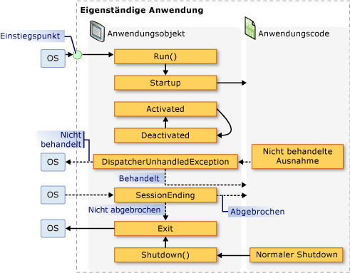
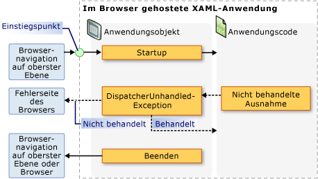

# <a name="application-management-overview"></a><span data-ttu-id="9fde0-102">Übersicht über die Anwendungsverwaltung</span><span class="sxs-lookup"><span data-stu-id="9fde0-102">Application Management Overview</span></span>

<span data-ttu-id="9fde0-103">Alle Anwendungen nutzen in der Regel einen gemeinsamen Satz von Funktionen, der für die Implementierung und Verwaltung der Anwendung gilt.</span><span class="sxs-lookup"><span data-stu-id="9fde0-103">All applications tend to share a common set of functionality that applies to application implementation and management.</span></span> <span data-ttu-id="9fde0-104">Dieses Thema enthält eine Übersicht über die Funktionen in der <xref:System.Windows.Application>-Klasse zum Erstellen und Verwalten von Anwendungen.</span><span class="sxs-lookup"><span data-stu-id="9fde0-104">This topic provides an overview of the functionality in the <xref:System.Windows.Application> class for creating and managing applications.</span></span>

## <a name="the-application-class"></a><span data-ttu-id="9fde0-105">Die Application-Klasse</span><span class="sxs-lookup"><span data-stu-id="9fde0-105">The Application Class</span></span>

<span data-ttu-id="9fde0-106">In WPF werden allgemeine Funktionen für Anwendungsbereiche in der <xref:System.Windows.Application>-Klasse gekapselt.</span><span class="sxs-lookup"><span data-stu-id="9fde0-106">In WPF, common application-scoped functionality is encapsulated in the <xref:System.Windows.Application> class.</span></span> <span data-ttu-id="9fde0-107">Die <xref:System.Windows.Application>-Klasse umfasst die folgenden Funktionen:</span><span class="sxs-lookup"><span data-stu-id="9fde0-107">The <xref:System.Windows.Application> class includes the following functionality:</span></span>

- <span data-ttu-id="9fde0-108">Lebensdauer der Anwendung nachverfolgen und mit ihr interagieren</span><span class="sxs-lookup"><span data-stu-id="9fde0-108">Tracking and interacting with application lifetime.</span></span>

- <span data-ttu-id="9fde0-109">Abrufen und Verarbeiten von Befehlszeilenparametern</span><span class="sxs-lookup"><span data-stu-id="9fde0-109">Retrieving and processing command-line parameters.</span></span>

- <span data-ttu-id="9fde0-110">Nicht behandelte Ausnahmen erkennen und darauf reagieren</span><span class="sxs-lookup"><span data-stu-id="9fde0-110">Detecting and responding to unhandled exceptions.</span></span>

- <span data-ttu-id="9fde0-111">Anwendungsspezifische Eigenschaften und Ressourcen teilen</span><span class="sxs-lookup"><span data-stu-id="9fde0-111">Sharing application-scope properties and resources.</span></span>

- <span data-ttu-id="9fde0-112">Verwalten von Fenstern in eigenständigen Anwendungen</span><span class="sxs-lookup"><span data-stu-id="9fde0-112">Managing windows in standalone applications.</span></span>

- <span data-ttu-id="9fde0-113">Navigation nachverfolgen und verwalten</span><span class="sxs-lookup"><span data-stu-id="9fde0-113">Tracking and managing navigation.</span></span>

<a name="The_Application_Class"></a>

## <a name="how-to-perform-common-tasks-using-the-application-class"></a><span data-ttu-id="9fde0-114">Ausführen allgemeiner Aufgaben mithilfe der Application-Klasse</span><span class="sxs-lookup"><span data-stu-id="9fde0-114">How to Perform Common Tasks Using the Application Class</span></span>

<span data-ttu-id="9fde0-115">Wenn Sie nicht an allen Details der <xref:System.Windows.Application>-Klasse interessiert sind, werden in der folgenden Tabelle einige der allgemeinen Aufgaben für <xref:System.Windows.Application> und deren erreichen aufgeführt.</span><span class="sxs-lookup"><span data-stu-id="9fde0-115">If you are not interested in all of the details of the <xref:System.Windows.Application> class, the following table lists some of the common tasks for <xref:System.Windows.Application> and how to accomplish them.</span></span> <span data-ttu-id="9fde0-116">Weitere Informationen und entsprechenden Beispielcode finden Sie über die zugehörigen APIs und Themen.</span><span class="sxs-lookup"><span data-stu-id="9fde0-116">By viewing the related API and topics, you can find more information and sample code.</span></span>

|<span data-ttu-id="9fde0-117">Aufgabe</span><span class="sxs-lookup"><span data-stu-id="9fde0-117">Task</span></span>|<span data-ttu-id="9fde0-118">Vorgehensweise</span><span class="sxs-lookup"><span data-stu-id="9fde0-118">Approach</span></span>|
|----------|--------------|
|<span data-ttu-id="9fde0-119">Ein Objekt abrufen, das die aktuelle Anwendung darstellt.</span><span class="sxs-lookup"><span data-stu-id="9fde0-119">Get an object that represents the current application</span></span>|<span data-ttu-id="9fde0-120">Verwenden Sie die <xref:System.Windows.Application.Current%2A?displayProperty=nameWithType>-Eigenschaft.</span><span class="sxs-lookup"><span data-stu-id="9fde0-120">Use the <xref:System.Windows.Application.Current%2A?displayProperty=nameWithType> property.</span></span>|
|<span data-ttu-id="9fde0-121">Einen Startbildschirm zu einer Anwendung hinzufügen.</span><span class="sxs-lookup"><span data-stu-id="9fde0-121">Add a startup screen to an application</span></span>|<span data-ttu-id="9fde0-122">Siehe [Hinzufügen eines Begrüßungs Bildschirms zu einer WPF-Anwendung](how-to-add-a-splash-screen-to-a-wpf-application.md).</span><span class="sxs-lookup"><span data-stu-id="9fde0-122">See [Add a Splash Screen to a WPF Application](how-to-add-a-splash-screen-to-a-wpf-application.md).</span></span>|
|<span data-ttu-id="9fde0-123">Eine Anwendung starten.</span><span class="sxs-lookup"><span data-stu-id="9fde0-123">Start an application</span></span>|<span data-ttu-id="9fde0-124">Verwenden Sie die <xref:System.Windows.Application.Run%2A?displayProperty=nameWithType>-Methode.</span><span class="sxs-lookup"><span data-stu-id="9fde0-124">Use the <xref:System.Windows.Application.Run%2A?displayProperty=nameWithType> method.</span></span>|
|<span data-ttu-id="9fde0-125">Eine Anwendung beenden.</span><span class="sxs-lookup"><span data-stu-id="9fde0-125">Stop an application</span></span>|<span data-ttu-id="9fde0-126">Verwenden Sie die <xref:System.Windows.Application.Shutdown%2A>-Methode des <xref:System.Windows.Application.Current%2A?displayProperty=nameWithType>-Objekts.</span><span class="sxs-lookup"><span data-stu-id="9fde0-126">Use the <xref:System.Windows.Application.Shutdown%2A> method of the <xref:System.Windows.Application.Current%2A?displayProperty=nameWithType> object.</span></span>|
|<span data-ttu-id="9fde0-127">Argumente über die Befehlszeile abrufen.</span><span class="sxs-lookup"><span data-stu-id="9fde0-127">Get arguments from the command line</span></span>|<span data-ttu-id="9fde0-128">Behandeln Sie das <xref:System.Windows.Application.Startup?displayProperty=nameWithType>-Ereignis, und verwenden Sie die <xref:System.Windows.StartupEventArgs.Args%2A?displayProperty=nameWithType>-Eigenschaft.</span><span class="sxs-lookup"><span data-stu-id="9fde0-128">Handle the <xref:System.Windows.Application.Startup?displayProperty=nameWithType> event and use the <xref:System.Windows.StartupEventArgs.Args%2A?displayProperty=nameWithType> property.</span></span> <span data-ttu-id="9fde0-129">Ein Beispiel finden Sie unter dem <xref:System.Windows.Application.Startup?displayProperty=nameWithType>-Ereignis.</span><span class="sxs-lookup"><span data-stu-id="9fde0-129">For an example, see the <xref:System.Windows.Application.Startup?displayProperty=nameWithType> event.</span></span>|
|<span data-ttu-id="9fde0-130">Exitcode der Anwendung abrufen und festlegen.</span><span class="sxs-lookup"><span data-stu-id="9fde0-130">Get and set the application exit code</span></span>|<span data-ttu-id="9fde0-131">Legen Sie die <xref:System.Windows.ExitEventArgs.ApplicationExitCode%2A?displayProperty=nameWithType>-Eigenschaft im <xref:System.Windows.Application.Exit?displayProperty=nameWithType>-Ereignishandler fest, oder nennen Sie die <xref:System.Windows.Application.Shutdown%2A>-Methode, und übergeben Sie eine ganze Zahl.</span><span class="sxs-lookup"><span data-stu-id="9fde0-131">Set the <xref:System.Windows.ExitEventArgs.ApplicationExitCode%2A?displayProperty=nameWithType> property in the <xref:System.Windows.Application.Exit?displayProperty=nameWithType> event handler or call the <xref:System.Windows.Application.Shutdown%2A> method and pass in an integer.</span></span>|
|<span data-ttu-id="9fde0-132">Nicht behandelte Ausnahmen erkennen und darauf reagieren.</span><span class="sxs-lookup"><span data-stu-id="9fde0-132">Detect and respond to unhandled exceptions</span></span>|<span data-ttu-id="9fde0-133">Behandeln Sie das <xref:System.Windows.Application.DispatcherUnhandledException>-Ereignis.</span><span class="sxs-lookup"><span data-stu-id="9fde0-133">Handle the <xref:System.Windows.Application.DispatcherUnhandledException> event.</span></span>|
|<span data-ttu-id="9fde0-134">Anwendungsspezifische Ressourcen abrufen und festlegen.</span><span class="sxs-lookup"><span data-stu-id="9fde0-134">Get and set application-scoped resources</span></span>|<span data-ttu-id="9fde0-135">Verwenden Sie die <xref:System.Windows.Application.Resources%2A?displayProperty=nameWithType>-Eigenschaft.</span><span class="sxs-lookup"><span data-stu-id="9fde0-135">Use the <xref:System.Windows.Application.Resources%2A?displayProperty=nameWithType> property.</span></span>|
|<span data-ttu-id="9fde0-136">Ein anwendungsspezifisches Ressourcenverzeichnis verwenden.</span><span class="sxs-lookup"><span data-stu-id="9fde0-136">Use an application-scope resource dictionary</span></span>|<span data-ttu-id="9fde0-137">Siehe [Verwenden eines Ressourcen Wörterbuchs für den Anwendungsbereich](how-to-use-an-application-scope-resource-dictionary.md).</span><span class="sxs-lookup"><span data-stu-id="9fde0-137">See [Use an Application-Scope Resource Dictionary](how-to-use-an-application-scope-resource-dictionary.md).</span></span>|
|<span data-ttu-id="9fde0-138">Anwendungsspezifische Eigenschaften abrufen und festlegen.</span><span class="sxs-lookup"><span data-stu-id="9fde0-138">Get and set application-scoped properties</span></span>|<span data-ttu-id="9fde0-139">Verwenden Sie die <xref:System.Windows.Application.Properties%2A?displayProperty=nameWithType>-Eigenschaft.</span><span class="sxs-lookup"><span data-stu-id="9fde0-139">Use the <xref:System.Windows.Application.Properties%2A?displayProperty=nameWithType> property.</span></span>|
|<span data-ttu-id="9fde0-140">Den Zustand einer Anwendung abrufen und speichern.</span><span class="sxs-lookup"><span data-stu-id="9fde0-140">Get and save an application's state</span></span>|<span data-ttu-id="9fde0-141">Weitere Informationen finden Sie unter beibehalten [und Wiederherstellen von Anwendungsbereichs Eigenschaften über Anwendungs Sitzungen hinweg](persist-and-restore-application-scope-properties.md).</span><span class="sxs-lookup"><span data-stu-id="9fde0-141">See [Persist and Restore Application-Scope Properties Across Application Sessions](persist-and-restore-application-scope-properties.md).</span></span>|
|<span data-ttu-id="9fde0-142">Datendateien ohne Code verwalten, einschließlich Ressourcendateien, Inhalts- und Ursprungssitedateien.</span><span class="sxs-lookup"><span data-stu-id="9fde0-142">Manage non-code data files, including resource files, content files, and site-of-origin files.</span></span>|<span data-ttu-id="9fde0-143">Weitere Informationen finden Sie [unter WPF-Anwendungs Ressource, Inhalts-und Datendateien](wpf-application-resource-content-and-data-files.md).</span><span class="sxs-lookup"><span data-stu-id="9fde0-143">See [WPF Application Resource, Content, and Data Files](wpf-application-resource-content-and-data-files.md).</span></span>|
|<span data-ttu-id="9fde0-144">Fenster in eigenständigen Anwendungen verwalten.</span><span class="sxs-lookup"><span data-stu-id="9fde0-144">Manage windows in standalone applications</span></span>|<span data-ttu-id="9fde0-145">Weitere Informationen finden Sie unter [Übersicht über WPF-Fenster](wpf-windows-overview.md).</span><span class="sxs-lookup"><span data-stu-id="9fde0-145">See [WPF Windows Overview](wpf-windows-overview.md).</span></span>|
|<span data-ttu-id="9fde0-146">Navigation überwachen und verwalten.</span><span class="sxs-lookup"><span data-stu-id="9fde0-146">Track and manage navigation</span></span>|<span data-ttu-id="9fde0-147">Siehe [Navigations Übersicht](navigation-overview.md).</span><span class="sxs-lookup"><span data-stu-id="9fde0-147">See [Navigation Overview](navigation-overview.md).</span></span>|

<a name="The_Application_Definition"></a>

## <a name="the-application-definition"></a><span data-ttu-id="9fde0-148">Die Anwendungsdefinition</span><span class="sxs-lookup"><span data-stu-id="9fde0-148">The Application Definition</span></span>

<span data-ttu-id="9fde0-149">Um die Funktionalität der <xref:System.Windows.Application>-Klasse zu nutzen, müssen Sie eine Anwendungs Definition implementieren.</span><span class="sxs-lookup"><span data-stu-id="9fde0-149">To utilize the functionality of the <xref:System.Windows.Application> class, you must implement an application definition.</span></span> <span data-ttu-id="9fde0-150">Eine WPF-Anwendungs Definition ist eine Klasse, die von <xref:System.Windows.Application> abgeleitet ist und mit einer speziellen MSBuild-Einstellung konfiguriert ist.</span><span class="sxs-lookup"><span data-stu-id="9fde0-150">A WPF application definition is a class that derives from <xref:System.Windows.Application> and is configured with a special MSBuild setting.</span></span>

### <a name="implementing-an-application-definition"></a><span data-ttu-id="9fde0-151">Implementieren einer Anwendungsdefinition</span><span class="sxs-lookup"><span data-stu-id="9fde0-151">Implementing an Application Definition</span></span>

<span data-ttu-id="9fde0-152">Eine typische WPF-Anwendungs Definition wird sowohl mit Markup als auch mit Code Behind implementiert.</span><span class="sxs-lookup"><span data-stu-id="9fde0-152">A typical WPF application definition is implemented using both markup and code-behind.</span></span> <span data-ttu-id="9fde0-153">Dadurch können Sie Anwendungseigenschaften und Ressourcen deklarativ mithilfe des Markups festlegen und Ereignisse registrieren, während mit CodeBehind Ereignisse behandelt und anwendungsspezifisches Verhalten implementiert wird.</span><span class="sxs-lookup"><span data-stu-id="9fde0-153">This allows you to use markup to declaratively set application properties, resources, and register events, while handling events and implementing application-specific behavior in code-behind.</span></span>

<span data-ttu-id="9fde0-154">Das folgende Beispiel veranschaulicht die Implementierung einer Anwendungsdefinition mithilfe von Markup und CodeBehind:</span><span class="sxs-lookup"><span data-stu-id="9fde0-154">The following example shows how to implement an application definition using both markup and code-behind:</span></span>

[!code-xaml[ApplicationSnippets#ApplicationXAML](~/samples/snippets/csharp/VS_Snippets_Wpf/ApplicationSnippets/CSharp/App.xaml#applicationxaml)]

[!code-csharp[ApplicationSnippets#ApplicationCODEBEHIND](~/samples/snippets/csharp/VS_Snippets_Wpf/ApplicationSnippets/CSharp/App.xaml.cs#applicationcodebehind)]
[!code-vb[ApplicationSnippets#ApplicationCODEBEHIND](~/samples/snippets/visualbasic/VS_Snippets_Wpf/ApplicationSnippets/visualbasic/application.xaml.vb#applicationcodebehind)]

<span data-ttu-id="9fde0-155">Damit eine Markup- und eine CodeBehind-Datei zusammenarbeiten können, ist Folgendes erforderlich:</span><span class="sxs-lookup"><span data-stu-id="9fde0-155">To allow a markup file and code-behind file to work together, the following needs to happen:</span></span>

- <span data-ttu-id="9fde0-156">Im Markup muss das `Application`-Element das `x:Class`-Attribut enthalten.</span><span class="sxs-lookup"><span data-stu-id="9fde0-156">In markup, the `Application` element must include the `x:Class` attribute.</span></span> <span data-ttu-id="9fde0-157">Wenn die Anwendung erstellt wird, bewirkt das vorhanden sein von `x:Class` in der Markup Datei, dass MSBuild eine `partial` Klasse erstellt, die von <xref:System.Windows.Application> abgeleitet ist und über den Namen verfügt, der durch das `x:Class`-Attribut angegeben wird.</span><span class="sxs-lookup"><span data-stu-id="9fde0-157">When the application is built, the existence of `x:Class` in the markup file causes MSBuild to create a `partial` class that derives from <xref:System.Windows.Application> and has the name that is specified by the `x:Class` attribute.</span></span> <span data-ttu-id="9fde0-158">Dies erfordert das Hinzufügen einer XML-Namespace Deklaration für das XAML-Schema (`xmlns:x="http://schemas.microsoft.com/winfx/2006/xaml"`).</span><span class="sxs-lookup"><span data-stu-id="9fde0-158">This requires the addition of an XML namespace declaration for the XAML schema (`xmlns:x="http://schemas.microsoft.com/winfx/2006/xaml"`).</span></span>

- <span data-ttu-id="9fde0-159">Bei Code-Behind muss die Klasse eine `partial` Klasse mit demselben Namen sein, der im Markup durch das `x:Class`-Attribut angegeben wird und von <xref:System.Windows.Application>abgeleitet werden muss.</span><span class="sxs-lookup"><span data-stu-id="9fde0-159">In code-behind, the class must be a `partial` class with the same name that is specified by the `x:Class` attribute in markup and must derive from <xref:System.Windows.Application>.</span></span> <span data-ttu-id="9fde0-160">Dadurch kann die Code-Behind-Datei mit der `partial`-Klasse verknüpft werden, die beim Erstellen der Anwendung für die Markup Datei generiert wird (siehe [Erstellen einer WPF-Anwendung](building-a-wpf-application-wpf.md)).</span><span class="sxs-lookup"><span data-stu-id="9fde0-160">This allows the code-behind file to be associated with the `partial` class that is generated for the markup file when the application is built (see [Building a WPF Application](building-a-wpf-application-wpf.md)).</span></span>

> [!NOTE]
> <span data-ttu-id="9fde0-161">Wenn Sie ein neues WPF-Anwendungsprojekt oder ein WPF-Browser Anwendungsprojekt mithilfe von Visual Studio erstellen, ist standardmäßig eine Anwendungs Definition enthalten, die sowohl mit Markup als auch mit Code-Behind definiert wird.</span><span class="sxs-lookup"><span data-stu-id="9fde0-161">When you create a new WPF Application project or WPF Browser Application project using Visual Studio, an application definition is included by default and is defined using both markup and code-behind.</span></span>

<span data-ttu-id="9fde0-162">Dieser Code ist die Mindestanforderung zum Implementieren einer Anwendungsdefinition.</span><span class="sxs-lookup"><span data-stu-id="9fde0-162">This code is the minimum that is required to implement an application definition.</span></span> <span data-ttu-id="9fde0-163">Vor dem Erstellen und Ausführen der Anwendung muss jedoch eine zusätzliche MSBuild-Konfiguration an der Anwendungs Definition vorgenommen werden.</span><span class="sxs-lookup"><span data-stu-id="9fde0-163">However, an additional MSBuild configuration needs to be made to the application definition before building and running the application.</span></span>

### <a name="configuring-the-application-definition-for-msbuild"></a><span data-ttu-id="9fde0-164">Konfigurieren der Anwendungsdefinition für MSBuild</span><span class="sxs-lookup"><span data-stu-id="9fde0-164">Configuring the Application Definition for MSBuild</span></span>

<span data-ttu-id="9fde0-165">Eigenständige Anwendungen und XAML-Browser Anwendungen (XBAPs) erfordern die Implementierung einer bestimmten Infrastruktur Ebene, bevor Sie ausgeführt werden können.</span><span class="sxs-lookup"><span data-stu-id="9fde0-165">Standalone applications and XAML browser applications (XBAPs) require the implementation of a certain level of infrastructure before they can run.</span></span> <span data-ttu-id="9fde0-166">Der wichtigste Teil dieser Infrastruktur ist der Einstiegspunkt.</span><span class="sxs-lookup"><span data-stu-id="9fde0-166">The most important part of this infrastructure is the entry point.</span></span> <span data-ttu-id="9fde0-167">Wenn eine Anwendung von einem Benutzer gestartet wird, ruft das Betriebssystem den Einstiegspunkt auf, der eine bekannte Funktion zum Starten von Anwendungen ist.</span><span class="sxs-lookup"><span data-stu-id="9fde0-167">When an application is launched by a user, the operating system calls the entry point, which is a well-known function for starting applications.</span></span>

<span data-ttu-id="9fde0-168">In der Vergangenheit mussten Entwickler je nach Technologie einen Teil oder sämtlichen Code selbst verfassen.</span><span class="sxs-lookup"><span data-stu-id="9fde0-168">Traditionally, developers have needed to write some or all of this code for themselves, depending on the technology.</span></span> <span data-ttu-id="9fde0-169">WPF generiert diesen Code jedoch für Sie, wenn die Markup Datei Ihrer Anwendungs Definition als MSBuild-`ApplicationDefinition` Element konfiguriert ist, wie in der folgenden MSBuild-Projektdatei gezeigt:</span><span class="sxs-lookup"><span data-stu-id="9fde0-169">However, WPF generates this code for you when the markup file of your application definition is configured as an MSBuild `ApplicationDefinition` item, as shown in the following MSBuild project file:</span></span>

```xml
<Project
  DefaultTargets="Build"
                        xmlns="http://schemas.microsoft.com/developer/msbuild/2003">
  ...
  <ApplicationDefinition Include="App.xaml" />
  <Compile Include="App.xaml.cs" />
  ...
</Project>
```

<span data-ttu-id="9fde0-170">Da die Code-Behind-Datei Code enthält, wird Sie als MSBuild-`Compile` Element gekennzeichnet, wie es normal ist.</span><span class="sxs-lookup"><span data-stu-id="9fde0-170">Because the code-behind file contains code, it is marked as an MSBuild `Compile` item, as is normal.</span></span>

<span data-ttu-id="9fde0-171">Die Anwendung dieser MSBuild-Konfigurationen auf die Markup-und Code Behind-Dateien einer Anwendungs Definition bewirkt, dass MSBuild Code wie den folgenden generiert:</span><span class="sxs-lookup"><span data-stu-id="9fde0-171">The application of these MSBuild configurations to the markup and code-behind files of an application definition causes MSBuild to generate code like the following:</span></span>

[!code-csharp[auto-generated-code](~/samples/snippets/csharp/VS_Snippets_Wpf/AppDefAugSnippets/CSharp/App.cs)]
[!code-vb[auto-generated-code](~/samples/snippets/visualbasic/VS_Snippets_Wpf/AppDefAugSnippets/VisualBasic/App.vb)]

<span data-ttu-id="9fde0-172">Der resultierende Code erweitert die Anwendungs Definition mit zusätzlichem Infrastruktur Code, der die `Main`für die Einstiegspunkt Methode einschließt.</span><span class="sxs-lookup"><span data-stu-id="9fde0-172">The resulting code augments your application definition with additional infrastructure code, which includes the entry-point method `Main`.</span></span> <span data-ttu-id="9fde0-173">Das <xref:System.STAThreadAttribute>-Attribut wird auf die `Main`-Methode angewendet, um anzugeben, dass der Hauptbenutzer Oberflächen-Thread für die WPF-Anwendung ein STA-Thread ist, der für WPF-Anwendungen erforderlich ist.</span><span class="sxs-lookup"><span data-stu-id="9fde0-173">The <xref:System.STAThreadAttribute> attribute is applied to the `Main` method to indicate that the main UI thread for the WPF application is an STA thread, which is required for WPF applications.</span></span> <span data-ttu-id="9fde0-174">Beim Aufruf erstellt `Main` eine neue Instanz von `App`, bevor die `InitializeComponent`-Methode aufgerufen wird, um die Ereignisse zu registrieren und die im Markup implementierten Eigenschaften festzulegen.</span><span class="sxs-lookup"><span data-stu-id="9fde0-174">When called, `Main` creates a new instance of `App` before calling the `InitializeComponent` method to register the events and set the properties that are implemented in markup.</span></span> <span data-ttu-id="9fde0-175">Da `InitializeComponent` für Sie generiert wird, müssen Sie `InitializeComponent` nicht explizit aus einer Anwendungs Definition aufzurufen, wie dies für <xref:System.Windows.Controls.Page>-und <xref:System.Windows.Window>-Implementierungen der Fall ist.</span><span class="sxs-lookup"><span data-stu-id="9fde0-175">Because `InitializeComponent` is generated for you, you don't need to explicitly call `InitializeComponent` from an application definition like you do for <xref:System.Windows.Controls.Page> and <xref:System.Windows.Window> implementations.</span></span> <span data-ttu-id="9fde0-176">Zum Schluss wird die <xref:System.Windows.Application.Run%2A>-Methode aufgerufen, um die Anwendung zu starten.</span><span class="sxs-lookup"><span data-stu-id="9fde0-176">Finally, the <xref:System.Windows.Application.Run%2A> method is called to start the application.</span></span>

<a name="Getting_the_Current_Application"></a>

## <a name="getting-the-current-application"></a><span data-ttu-id="9fde0-177">Abrufen der aktuellen Anwendungsdomäne</span><span class="sxs-lookup"><span data-stu-id="9fde0-177">Getting the Current Application</span></span>

<span data-ttu-id="9fde0-178">Da die Funktionalität der <xref:System.Windows.Application>-Klasse für eine Anwendung freigegeben wird, kann pro <xref:System.AppDomain>nur eine Instanz der <xref:System.Windows.Application>-Klasse vorhanden sein.</span><span class="sxs-lookup"><span data-stu-id="9fde0-178">Because the functionality of the <xref:System.Windows.Application> class are shared across an application, there can be only one instance of the <xref:System.Windows.Application> class per <xref:System.AppDomain>.</span></span> <span data-ttu-id="9fde0-179">Um dies zu erzwingen, wird die <xref:System.Windows.Application>-Klasse als Singleton-Klasse implementiert (siehe [Implementieren von C#Singleton in ](https://docs.microsoft.com/previous-versions/msp-n-p/ff650316(v=pandp.10))), mit der eine einzelne Instanz von sich selbst erstellt wird und mit der `static`<xref:System.Windows.Application.Current%2A>-Eigenschaft gemeinsamer Zugriff darauf ermöglicht wird.</span><span class="sxs-lookup"><span data-stu-id="9fde0-179">To enforce this, the <xref:System.Windows.Application> class is implemented as a singleton class (see [Implementing Singleton in C#](https://docs.microsoft.com/previous-versions/msp-n-p/ff650316(v=pandp.10))), which creates a single instance of itself and provides shared access to it with the `static`<xref:System.Windows.Application.Current%2A> property.</span></span>

<span data-ttu-id="9fde0-180">Der folgende Code zeigt, wie Sie einen Verweis auf das <xref:System.Windows.Application>-Objekt für die aktuelle <xref:System.AppDomain>abrufen.</span><span class="sxs-lookup"><span data-stu-id="9fde0-180">The following code shows how to acquire a reference to the <xref:System.Windows.Application> object for the current <xref:System.AppDomain>.</span></span>

[!code-csharp[ApplicationManagementOverviewSnippets#GetCurrentAppCODE](~/samples/snippets/csharp/VS_Snippets_Wpf/ApplicationManagementOverviewSnippets/CSharp/MainWindow.xaml.cs#getcurrentappcode)]
[!code-vb[ApplicationManagementOverviewSnippets#GetCurrentAppCODE](~/samples/snippets/visualbasic/VS_Snippets_Wpf/ApplicationManagementOverviewSnippets/VisualBasic/MainWindow.xaml.vb#getcurrentappcode)]

<span data-ttu-id="9fde0-181"><xref:System.Windows.Application.Current%2A> gibt einen Verweis auf eine Instanz der <xref:System.Windows.Application>-Klasse zurück.</span><span class="sxs-lookup"><span data-stu-id="9fde0-181"><xref:System.Windows.Application.Current%2A> returns a reference to an instance of the <xref:System.Windows.Application> class.</span></span> <span data-ttu-id="9fde0-182">Wenn Sie einen Verweis auf Ihre <xref:System.Windows.Application> abgeleitete Klasse wünschen, müssen Sie den Wert der Eigenschaft <xref:System.Windows.Application.Current%2A> umwandeln, wie im folgenden Beispiel gezeigt.</span><span class="sxs-lookup"><span data-stu-id="9fde0-182">If you want a reference to your <xref:System.Windows.Application> derived class you must cast the value of the <xref:System.Windows.Application.Current%2A> property, as shown in the following example.</span></span>

[!code-csharp[ApplicationManagementOverviewSnippets#GetSTCurrentAppCODE](~/samples/snippets/csharp/VS_Snippets_Wpf/ApplicationManagementOverviewSnippets/CSharp/MainWindow.xaml.cs#getstcurrentappcode)]
[!code-vb[ApplicationManagementOverviewSnippets#GetSTCurrentAppCODE](~/samples/snippets/visualbasic/VS_Snippets_Wpf/ApplicationManagementOverviewSnippets/VisualBasic/MainWindow.xaml.vb#getstcurrentappcode)]

<span data-ttu-id="9fde0-183">Sie können den Wert von <xref:System.Windows.Application.Current%2A> jederzeit in der Lebensdauer eines <xref:System.Windows.Application> Objekts überprüfen.</span><span class="sxs-lookup"><span data-stu-id="9fde0-183">You can inspect the value of <xref:System.Windows.Application.Current%2A> at any point in the lifetime of an <xref:System.Windows.Application> object.</span></span> <span data-ttu-id="9fde0-184">Sie sollten dabei jedoch vorsichtig sein.</span><span class="sxs-lookup"><span data-stu-id="9fde0-184">However, you should be careful.</span></span> <span data-ttu-id="9fde0-185">Nachdem die <xref:System.Windows.Application> Klasse instanziiert wurde, gibt es einen Zeitraum, in dem der Status des <xref:System.Windows.Application> Objekts inkonsistent ist.</span><span class="sxs-lookup"><span data-stu-id="9fde0-185">After the <xref:System.Windows.Application> class is instantiated, there is a period during which the state of the <xref:System.Windows.Application> object is inconsistent.</span></span> <span data-ttu-id="9fde0-186">Während dieses Zeitraums führt <xref:System.Windows.Application> die verschiedenen Initialisierungs Aufgaben aus, die von Ihrem Code für die Ausführung erforderlich sind, einschließlich dem Einrichten der Anwendungs Infrastruktur, dem Festlegen von Eigenschaften und dem Registrieren von Ereignissen.</span><span class="sxs-lookup"><span data-stu-id="9fde0-186">During this period, <xref:System.Windows.Application> is performing the various initialization tasks that are required by your code to run, including establishing application infrastructure, setting properties, and registering events.</span></span> <span data-ttu-id="9fde0-187">Wenn Sie versuchen, das <xref:System.Windows.Application>-Objekt während dieses Zeitraums zu verwenden, kann der Code unerwartete Ergebnisse aufweisen, insbesondere, wenn er von den verschiedenen <xref:System.Windows.Application> Eigenschaften abhängig ist, die festgelegt werden.</span><span class="sxs-lookup"><span data-stu-id="9fde0-187">If you try to use the <xref:System.Windows.Application> object during this period, your code may have unexpected results, particularly if it depends on the various <xref:System.Windows.Application> properties being set.</span></span>

<span data-ttu-id="9fde0-188">Wenn die Initialisierungs Arbeit <xref:System.Windows.Application> abgeschlossen ist, beginnt die Lebensdauer tatsächlich.</span><span class="sxs-lookup"><span data-stu-id="9fde0-188">When <xref:System.Windows.Application> completes its initialization work, its lifetime truly begins.</span></span>

<a name="Application_Lifetime"></a>

## <a name="application-lifetime"></a><span data-ttu-id="9fde0-189">Anwendungslebensdauer</span><span class="sxs-lookup"><span data-stu-id="9fde0-189">Application Lifetime</span></span>

<span data-ttu-id="9fde0-190">Die Lebensdauer einer WPF-Anwendung wird durch mehrere Ereignisse gekennzeichnet, die von <xref:System.Windows.Application> ausgelöst werden, um Sie zu informieren, wann die Anwendung gestartet wurde, aktiviert und deaktiviert wurde und heruntergefahren wurde.</span><span class="sxs-lookup"><span data-stu-id="9fde0-190">The lifetime of a WPF application is marked by several events that are raised by <xref:System.Windows.Application> to let you know when your application has started, has been activated and deactivated, and has been shut down.</span></span>

<a name="Splash_Screen"></a>

### <a name="splash-screen"></a><span data-ttu-id="9fde0-191">Begrüßungsbildschirm</span><span class="sxs-lookup"><span data-stu-id="9fde0-191">Splash Screen</span></span>

<span data-ttu-id="9fde0-192">Ab der .NET Framework 3,5 SP1 können Sie ein Bild angeben, das in einem Startfenster oder einem Begrüßungs *Bildschirm*verwendet werden soll.</span><span class="sxs-lookup"><span data-stu-id="9fde0-192">Starting in the .NET Framework 3.5 SP1, you can specify an image to be used in a startup window, or *splash screen*.</span></span> <span data-ttu-id="9fde0-193">Die <xref:System.Windows.SplashScreen>-Klasse vereinfacht das Anzeigen eines Start Fensters, während die Anwendung geladen wird.</span><span class="sxs-lookup"><span data-stu-id="9fde0-193">The <xref:System.Windows.SplashScreen> class makes it easy to display a startup window while your application is loading.</span></span> <span data-ttu-id="9fde0-194">Das Fenster <xref:System.Windows.SplashScreen> wird erstellt und angezeigt, bevor <xref:System.Windows.Application.Run%2A> aufgerufen wird.</span><span class="sxs-lookup"><span data-stu-id="9fde0-194">The <xref:System.Windows.SplashScreen> window is created and shown before <xref:System.Windows.Application.Run%2A> is called.</span></span> <span data-ttu-id="9fde0-195">Weitere Informationen finden Sie unter [Startzeit der Anwendung](../advanced/application-startup-time.md) und [Hinzufügen eines Begrüßungs Bildschirms zu einer WPF-Anwendung](how-to-add-a-splash-screen-to-a-wpf-application.md).</span><span class="sxs-lookup"><span data-stu-id="9fde0-195">For more information, see [Application Startup Time](../advanced/application-startup-time.md) and [Add a Splash Screen to a WPF Application](how-to-add-a-splash-screen-to-a-wpf-application.md).</span></span>

<a name="Starting_an_Application"></a>

### <a name="starting-an-application"></a><span data-ttu-id="9fde0-196">Starten einer Anwendung</span><span class="sxs-lookup"><span data-stu-id="9fde0-196">Starting an Application</span></span>

<span data-ttu-id="9fde0-197">Nachdem <xref:System.Windows.Application.Run%2A> aufgerufen und die Anwendung initialisiert wurde, ist die Anwendung zur Ausführung bereit.</span><span class="sxs-lookup"><span data-stu-id="9fde0-197">After <xref:System.Windows.Application.Run%2A> is called and the application is initialized, the application is ready to run.</span></span> <span data-ttu-id="9fde0-198">Dieser Moment ist gekennzeichnet, wenn das <xref:System.Windows.Application.Startup>-Ereignis ausgelöst wird:</span><span class="sxs-lookup"><span data-stu-id="9fde0-198">This moment is signified when the <xref:System.Windows.Application.Startup> event is raised:</span></span>

[!code-csharp[Startup-event](~/samples/snippets/csharp/VS_Snippets_Wpf/ApplicationStartupSnippets/CSharp/App.xaml.cs?range=3-11,31-33)]
[!code-vb[Startup-event](~/samples/snippets/visualbasic/VS_Snippets_Wpf/ApplicationStartupSnippets/visualbasic/application.xaml.vb?range=5-11,30-32)]

<span data-ttu-id="9fde0-199">An diesem Punkt in der Lebensdauer einer Anwendung ist es am häufigsten, eine Benutzeroberfläche anzuzeigen.</span><span class="sxs-lookup"><span data-stu-id="9fde0-199">At this point in an application's lifetime, the most common thing to do is to show a UI.</span></span>

<a name="Showing_a_User_Interface"></a>

### <a name="showing-a-user-interface"></a><span data-ttu-id="9fde0-200">Anzeigen einer Benutzeroberfläche</span><span class="sxs-lookup"><span data-stu-id="9fde0-200">Showing a User Interface</span></span>

<span data-ttu-id="9fde0-201">Die meisten eigenständigen Windows-Anwendungen öffnen eine <xref:System.Windows.Window>, wenn Sie mit der Ausführung beginnen.</span><span class="sxs-lookup"><span data-stu-id="9fde0-201">Most standalone Windows applications open a <xref:System.Windows.Window> when they begin running.</span></span> <span data-ttu-id="9fde0-202">Der <xref:System.Windows.Application.Startup> Ereignishandler ist ein Speicherort, von dem aus Sie dies tun können, wie im folgenden Code veranschaulicht.</span><span class="sxs-lookup"><span data-stu-id="9fde0-202">The <xref:System.Windows.Application.Startup> event handler is one location from which you can do this, as demonstrated by the following code.</span></span>

[!code-xaml[AppShowWindowHardSnippets#StartupEventMARKUP](~/samples/snippets/csharp/VS_Snippets_Wpf/AppShowWindowHardSnippets/CSharp/App.xaml#startupeventmarkup)]

[!code-csharp[AppShowWindowHardSnippets#StartupEventCODEBEHIND](~/samples/snippets/csharp/VS_Snippets_Wpf/AppShowWindowHardSnippets/CSharp/App.xaml.cs#startupeventcodebehind)]
[!code-vb[AppShowWindowHardSnippets#StartupEventCODEBEHIND](~/samples/snippets/visualbasic/VS_Snippets_Wpf/AppShowWindowHardSnippets/VisualBasic/Application.xaml.vb#startupeventcodebehind)]

> [!NOTE]
> <span data-ttu-id="9fde0-203">Der erste <xref:System.Windows.Window>, der in einer eigenständigen Anwendung instanziiert werden soll, wird standardmäßig zum Hauptanwendungsfenster.</span><span class="sxs-lookup"><span data-stu-id="9fde0-203">The first <xref:System.Windows.Window> to be instantiated in a standalone application becomes the main application window by default.</span></span> <span data-ttu-id="9fde0-204">Auf dieses <xref:System.Windows.Window> Objekt wird von der <xref:System.Windows.Application.MainWindow%2A?displayProperty=nameWithType>-Eigenschaft verwiesen.</span><span class="sxs-lookup"><span data-stu-id="9fde0-204">This <xref:System.Windows.Window> object is referenced by the <xref:System.Windows.Application.MainWindow%2A?displayProperty=nameWithType> property.</span></span> <span data-ttu-id="9fde0-205">Der Wert der <xref:System.Windows.Application.MainWindow%2A>-Eigenschaft kann Programm gesteuert geändert werden, wenn ein anderes Fenster als das erste instanziierte <xref:System.Windows.Window> das Hauptfenster sein sollte.</span><span class="sxs-lookup"><span data-stu-id="9fde0-205">The value of the <xref:System.Windows.Application.MainWindow%2A> property can be changed programmatically if a different window than the first instantiated <xref:System.Windows.Window> should be the main window.</span></span>

<span data-ttu-id="9fde0-206">Wenn eine XBAP zum ersten Mal gestartet wird, navigiert Sie höchstwahrscheinlich zu einem <xref:System.Windows.Controls.Page>.</span><span class="sxs-lookup"><span data-stu-id="9fde0-206">When an XBAP first starts, it will most likely navigate to a <xref:System.Windows.Controls.Page>.</span></span> <span data-ttu-id="9fde0-207">Dies wird im folgenden Code dargestellt.</span><span class="sxs-lookup"><span data-stu-id="9fde0-207">This is shown in the following code.</span></span>

[!code-xaml[XBAPAppStartupSnippets#StartupXBAPMARKUP](~/samples/snippets/csharp/VS_Snippets_Wpf/XBAPAppStartupSnippets/CSharp/App.xaml#startupxbapmarkup)]

[!code-csharp[XBAPAppStartupSnippets#StartupXBAPCODEBEHIND](~/samples/snippets/csharp/VS_Snippets_Wpf/XBAPAppStartupSnippets/CSharp/App.xaml.cs#startupxbapcodebehind)]
[!code-vb[XBAPAppStartupSnippets#StartupXBAPCODEBEHIND](~/samples/snippets/visualbasic/VS_Snippets_Wpf/XBAPAppStartupSnippets/VisualBasic/Application.xaml.vb#startupxbapcodebehind)]

<span data-ttu-id="9fde0-208">Wenn Sie <xref:System.Windows.Application.Startup> nur eine <xref:System.Windows.Window> öffnen oder zu einem <xref:System.Windows.Controls.Page>navigieren, können Sie stattdessen das `StartupUri`-Attribut im Markup festlegen.</span><span class="sxs-lookup"><span data-stu-id="9fde0-208">If you handle <xref:System.Windows.Application.Startup> to only open a <xref:System.Windows.Window> or navigate to a <xref:System.Windows.Controls.Page>, you can set the `StartupUri` attribute in markup instead.</span></span>

<span data-ttu-id="9fde0-209">Im folgenden Beispiel wird gezeigt, wie das <xref:System.Windows.Application.StartupUri%2A> aus einer eigenständigen Anwendung verwendet wird, um eine <xref:System.Windows.Window>zu öffnen.</span><span class="sxs-lookup"><span data-stu-id="9fde0-209">The following example shows how to use the <xref:System.Windows.Application.StartupUri%2A> from a standalone application to open a <xref:System.Windows.Window>.</span></span>

[!code-xaml[ApplicationManagementOverviewSnippets#OverviewStartupUriMARKUP](~/samples/snippets/csharp/VS_Snippets_Wpf/ApplicationManagementOverviewSnippets/CSharp/App.xaml#overviewstartupurimarkup)]

<span data-ttu-id="9fde0-210">Im folgenden Beispiel wird gezeigt, wie <xref:System.Windows.Application.StartupUri%2A> aus einer XBAP verwendet wird, um zu einer <xref:System.Windows.Controls.Page>zu navigieren.</span><span class="sxs-lookup"><span data-stu-id="9fde0-210">The following example shows how to use <xref:System.Windows.Application.StartupUri%2A> from an XBAP to navigate to a <xref:System.Windows.Controls.Page>.</span></span>

[!code-xaml[PageSnippets#XBAPStartupUriMARKUP](~/samples/snippets/csharp/VS_Snippets_Wpf/PageSnippets/CSharp/App.xaml#xbapstartupurimarkup)]

<span data-ttu-id="9fde0-211">Dieses Markup hat denselben Effekt wie der vorherige Code zum Öffnen eines Fensters.</span><span class="sxs-lookup"><span data-stu-id="9fde0-211">This markup has the same effect as the previous code for opening a window.</span></span>

> [!NOTE]
> <span data-ttu-id="9fde0-212">Weitere Informationen zur Navigation finden Sie unter [Übersicht](navigation-overview.md)über die Navigation.</span><span class="sxs-lookup"><span data-stu-id="9fde0-212">For more information on navigation, see [Navigation Overview](navigation-overview.md).</span></span>

<span data-ttu-id="9fde0-213">Sie müssen das <xref:System.Windows.Application.Startup>-Ereignis behandeln, um eine <xref:System.Windows.Window> zu öffnen, wenn Sie Sie mit einem nicht parameterlosen Konstruktor instanziieren müssen, oder Sie müssen die Eigenschaften festlegen oder die zugehörigen Ereignisse abonnieren, bevor Sie angezeigt werden, oder Sie müssen alle Befehlszeilenargumente verarbeiten, die beim Starten der Anwendung bereitgestellt wurden.</span><span class="sxs-lookup"><span data-stu-id="9fde0-213">You need to handle the <xref:System.Windows.Application.Startup> event to open a <xref:System.Windows.Window> if you need to instantiate it using a non-parameterless constructor, or you need to set its properties or subscribe to its events before showing it, or you need to process any command-line arguments that were supplied when the application was launched.</span></span>

<a name="Processing_Command_Line_Arguments"></a>

### <a name="processing-command-line-arguments"></a><span data-ttu-id="9fde0-214">Verarbeiten von Befehlszeilenargumenten</span><span class="sxs-lookup"><span data-stu-id="9fde0-214">Processing Command-Line Arguments</span></span>

<span data-ttu-id="9fde0-215">In Windows können eigenständige Anwendungen entweder über eine Eingabeaufforderung oder über den Desktop gestartet werden.</span><span class="sxs-lookup"><span data-stu-id="9fde0-215">In Windows, standalone applications can be launched from either a command prompt or the desktop.</span></span> <span data-ttu-id="9fde0-216">In beiden Fällen können Befehlszeilenargumente an die Anwendung übergeben werden.</span><span class="sxs-lookup"><span data-stu-id="9fde0-216">In both cases, command-line arguments can be passed to the application.</span></span> <span data-ttu-id="9fde0-217">Im folgenden Beispiel sehen Sie eine Anwendung, die mit nur einem Befehlszeilenargument („/StartMinimized“) gestartet wird:</span><span class="sxs-lookup"><span data-stu-id="9fde0-217">The following example shows an application that is launched with a single command-line argument, "/StartMinimized":</span></span>

`wpfapplication.exe /StartMinimized`

<span data-ttu-id="9fde0-218">Während der Anwendungs Initialisierung ruft WPF die Befehlszeilenargumente aus dem Betriebssystem ab und übergibt sie über die <xref:System.Windows.StartupEventArgs.Args%2A>-Eigenschaft des <xref:System.Windows.StartupEventArgs>-Parameters an den <xref:System.Windows.Application.Startup>-Ereignishandler.</span><span class="sxs-lookup"><span data-stu-id="9fde0-218">During application initialization, WPF retrieves the command-line arguments from the operating system and passes them to the <xref:System.Windows.Application.Startup> event handler via the <xref:System.Windows.StartupEventArgs.Args%2A> property of the <xref:System.Windows.StartupEventArgs> parameter.</span></span> <span data-ttu-id="9fde0-219">Mit Code wie dem folgenden können Sie Befehlszeilenargumente abrufen und speichern.</span><span class="sxs-lookup"><span data-stu-id="9fde0-219">You can retrieve and store the command-line arguments using code like the following.</span></span>

[!code-xaml[ApplicationStartupSnippets#HandleStartupXAML](~/samples/snippets/csharp/VS_Snippets_Wpf/ApplicationStartupSnippets/CSharp/App.xaml#handlestartupxaml)]

[!code-csharp[ApplicationStartupSnippets#HandleStartupCODEBEHIND](~/samples/snippets/csharp/VS_Snippets_Wpf/ApplicationStartupSnippets/CSharp/App.xaml.cs#handlestartupcodebehind)]
[!code-vb[ApplicationStartupSnippets#HandleStartupCODEBEHIND](~/samples/snippets/visualbasic/VS_Snippets_Wpf/ApplicationStartupSnippets/visualbasic/application.xaml.vb#handlestartupcodebehind)]

<span data-ttu-id="9fde0-220">Der Code behandelt <xref:System.Windows.Application.Startup>, um zu überprüfen, ob das **/StartMinimized** -Befehlszeilenargument bereitgestellt wurde. Wenn dies der Fall ist, wird das Hauptfenster mit einer <xref:System.Windows.WindowState> <xref:System.Windows.WindowState.Minimized>geöffnet.</span><span class="sxs-lookup"><span data-stu-id="9fde0-220">The code handles <xref:System.Windows.Application.Startup> to check whether the **/StartMinimized** command-line argument was provided; if so, it opens the main window with a <xref:System.Windows.WindowState> of <xref:System.Windows.WindowState.Minimized>.</span></span> <span data-ttu-id="9fde0-221">Beachten Sie, dass die <xref:System.Windows.Window.WindowState%2A>-Eigenschaft Programm gesteuert festgelegt werden muss, da der Haupt <xref:System.Windows.Window> explizit im Code geöffnet werden muss.</span><span class="sxs-lookup"><span data-stu-id="9fde0-221">Note that because the <xref:System.Windows.Window.WindowState%2A> property must be set programmatically, the main <xref:System.Windows.Window> must be opened explicitly in code.</span></span>

<span data-ttu-id="9fde0-222">XBAPs können Befehlszeilenargumente nicht abrufen und verarbeiten, da Sie mithilfe der ClickOnce-Bereitstellung gestartet werden (siehe bereitstellen [einer WPF-Anwendung](deploying-a-wpf-application-wpf.md)).</span><span class="sxs-lookup"><span data-stu-id="9fde0-222">XBAPs cannot retrieve and process command-line arguments because they are launched using ClickOnce deployment (see [Deploying a WPF Application](deploying-a-wpf-application-wpf.md)).</span></span> <span data-ttu-id="9fde0-223">Von den zum Starten verwendeten URLs können jedoch Abfragezeichenfolgenparameter abgerufen und verarbeitet werden.</span><span class="sxs-lookup"><span data-stu-id="9fde0-223">However, they can retrieve and process query string parameters from the URLs that are used to launch them.</span></span>

<a name="Application_Activation_and_Deactivation"></a>

### <a name="application-activation-and-deactivation"></a><span data-ttu-id="9fde0-224">Aktivieren und Deaktivieren von Anwendungen</span><span class="sxs-lookup"><span data-stu-id="9fde0-224">Application Activation and Deactivation</span></span>

<span data-ttu-id="9fde0-225">Windows ermöglicht es Benutzern, zwischen Anwendungen zu wechseln.</span><span class="sxs-lookup"><span data-stu-id="9fde0-225">Windows allows users to switch between applications.</span></span> <span data-ttu-id="9fde0-226">Meistens wird dazu die Tastenkombination ALT+TAB verwendet.</span><span class="sxs-lookup"><span data-stu-id="9fde0-226">The most common way is to use the ALT+TAB key combination.</span></span> <span data-ttu-id="9fde0-227">Eine Anwendung kann nur dann auf gewechselt werden, wenn Sie über ein sichtbares <xref:System.Windows.Window> verfügt, das ein Benutzer auswählen kann.</span><span class="sxs-lookup"><span data-stu-id="9fde0-227">An application can only be switched to if it has a visible <xref:System.Windows.Window> that a user can select.</span></span> <span data-ttu-id="9fde0-228">Der aktuell ausgewählte <xref:System.Windows.Window> ist das *aktive Fenster* (auch als *Vordergrund Fenster*bezeichnet) und ist der <xref:System.Windows.Window>, der Benutzereingaben empfängt.</span><span class="sxs-lookup"><span data-stu-id="9fde0-228">The currently selected <xref:System.Windows.Window> is the *active window* (also known as the *foreground window*) and is the <xref:System.Windows.Window> that receives user input.</span></span> <span data-ttu-id="9fde0-229">Die Anwendung mit dem aktiven Fenster ist die *aktive Anwendung* (oder *Vordergrund Anwendung*).</span><span class="sxs-lookup"><span data-stu-id="9fde0-229">The application with the active window is the *active application* (or *foreground application*).</span></span> <span data-ttu-id="9fde0-230">Eine Anwendung wird unter folgenden Umständen zur aktiven Anwendung:</span><span class="sxs-lookup"><span data-stu-id="9fde0-230">An application becomes the active application in the following circumstances:</span></span>

- <span data-ttu-id="9fde0-231">Es wird gestartet und zeigt eine <xref:System.Windows.Window>an.</span><span class="sxs-lookup"><span data-stu-id="9fde0-231">It is launched and shows a <xref:System.Windows.Window>.</span></span>

- <span data-ttu-id="9fde0-232">Ein Benutzer wechselt von einer anderen Anwendung, indem er eine <xref:System.Windows.Window> in der Anwendung auswählt.</span><span class="sxs-lookup"><span data-stu-id="9fde0-232">A user switches from another application by selecting a <xref:System.Windows.Window> in the application.</span></span>

<span data-ttu-id="9fde0-233">Sie können erkennen, wenn eine Anwendung aktiv wird, indem Sie das <xref:System.Windows.Application.Activated?displayProperty=nameWithType>-Ereignis behandeln.</span><span class="sxs-lookup"><span data-stu-id="9fde0-233">You can detect when an application becomes active by handling the <xref:System.Windows.Application.Activated?displayProperty=nameWithType> event.</span></span>

<span data-ttu-id="9fde0-234">Auf ähnliche Weise kann eine Anwendung unter folgenden Umständen inaktiv werden:</span><span class="sxs-lookup"><span data-stu-id="9fde0-234">Likewise, an application can become inactive in the following circumstances:</span></span>

- <span data-ttu-id="9fde0-235">Ein Benutzer wechselt von der aktuellen zu einer anderen Anwendung.</span><span class="sxs-lookup"><span data-stu-id="9fde0-235">A user switches to another application from the current one.</span></span>

- <span data-ttu-id="9fde0-236">Wenn die Anwendung heruntergefahren wird.</span><span class="sxs-lookup"><span data-stu-id="9fde0-236">When the application shuts down.</span></span>

<span data-ttu-id="9fde0-237">Sie können erkennen, wenn eine Anwendung inaktiv wird, indem Sie das <xref:System.Windows.Application.Deactivated?displayProperty=nameWithType>-Ereignis behandeln.</span><span class="sxs-lookup"><span data-stu-id="9fde0-237">You can detect when an application becomes inactive by handling the <xref:System.Windows.Application.Deactivated?displayProperty=nameWithType> event.</span></span>

<span data-ttu-id="9fde0-238">Der folgende Code zeigt, wie die <xref:System.Windows.Application.Activated> und <xref:System.Windows.Application.Deactivated> Ereignisse behandelt werden, um zu bestimmen, ob eine Anwendung aktiv ist.</span><span class="sxs-lookup"><span data-stu-id="9fde0-238">The following code shows how to handle the <xref:System.Windows.Application.Activated> and <xref:System.Windows.Application.Deactivated> events to determine whether an application is active.</span></span>

[!code-xaml[ApplicationActivationSnippets#DetectActivationStateXAML](~/samples/snippets/csharp/VS_Snippets_Wpf/ApplicationActivationSnippets/CSharp/App.xaml#detectactivationstatexaml)]

[!code-csharp[ApplicationActivationSnippets#DetectActivationStateCODEBEHIND](~/samples/snippets/csharp/VS_Snippets_Wpf/ApplicationActivationSnippets/CSharp/App.xaml.cs#detectactivationstatecodebehind)]
[!code-vb[ApplicationActivationSnippets#DetectActivationStateCODEBEHIND](~/samples/snippets/visualbasic/VS_Snippets_Wpf/ApplicationActivationSnippets/visualbasic/application.xaml.vb#detectactivationstatecodebehind)]

<span data-ttu-id="9fde0-239">Eine <xref:System.Windows.Window> kann auch aktiviert und deaktiviert werden.</span><span class="sxs-lookup"><span data-stu-id="9fde0-239">A <xref:System.Windows.Window> can also be activated and deactivated.</span></span> <span data-ttu-id="9fde0-240">Weitere Informationen finden Sie unter <xref:System.Windows.Window.Activated?displayProperty=nameWithType> und <xref:System.Windows.Window.Deactivated?displayProperty=nameWithType>.</span><span class="sxs-lookup"><span data-stu-id="9fde0-240">See <xref:System.Windows.Window.Activated?displayProperty=nameWithType> and <xref:System.Windows.Window.Deactivated?displayProperty=nameWithType> for more information.</span></span>

> [!NOTE]
> <span data-ttu-id="9fde0-241">Weder <xref:System.Windows.Application.Activated?displayProperty=nameWithType> noch <xref:System.Windows.Application.Deactivated?displayProperty=nameWithType> werden für XBAPs ausgelöst.</span><span class="sxs-lookup"><span data-stu-id="9fde0-241">Neither <xref:System.Windows.Application.Activated?displayProperty=nameWithType> nor <xref:System.Windows.Application.Deactivated?displayProperty=nameWithType> is raised for XBAPs.</span></span>

<a name="Application_Shutdown"></a>

### <a name="application-shutdown"></a><span data-ttu-id="9fde0-242">Herunterfahren einer Anwendung</span><span class="sxs-lookup"><span data-stu-id="9fde0-242">Application Shutdown</span></span>

<span data-ttu-id="9fde0-243">Die Lebensdauer einer Anwendung endet mit dem Herunterfahren, das aus folgenden Gründen erfolgen kann:</span><span class="sxs-lookup"><span data-stu-id="9fde0-243">The life of an application ends when it is shut down, which can occur for the following reasons:</span></span>

- <span data-ttu-id="9fde0-244">Ein Benutzer schließt alle <xref:System.Windows.Window>.</span><span class="sxs-lookup"><span data-stu-id="9fde0-244">A user closes every <xref:System.Windows.Window>.</span></span>

- <span data-ttu-id="9fde0-245">Ein Benutzer schließt das Haupt <xref:System.Windows.Window>.</span><span class="sxs-lookup"><span data-stu-id="9fde0-245">A user closes the main <xref:System.Windows.Window>.</span></span>

- <span data-ttu-id="9fde0-246">Ein Benutzer beendet die Windows-Sitzung, indem er sich abmeldet oder herunterfährt.</span><span class="sxs-lookup"><span data-stu-id="9fde0-246">A user ends the Windows session by logging off or shutting down.</span></span>

- <span data-ttu-id="9fde0-247">Eine anwendungsspezifische Bedingung wurde erfüllt.</span><span class="sxs-lookup"><span data-stu-id="9fde0-247">An application-specific condition has been met.</span></span>

<span data-ttu-id="9fde0-248">Zur Unterstützung beim Herunterfahren der Anwendung können <xref:System.Windows.Application> die <xref:System.Windows.Application.Shutdown%2A>-Methode, die <xref:System.Windows.Application.ShutdownMode%2A>-Eigenschaft sowie die <xref:System.Windows.Application.SessionEnding>-und <xref:System.Windows.Application.Exit>-Ereignisse bereitstellen.</span><span class="sxs-lookup"><span data-stu-id="9fde0-248">To help you manage application shutdown, <xref:System.Windows.Application> provides the <xref:System.Windows.Application.Shutdown%2A> method, the <xref:System.Windows.Application.ShutdownMode%2A> property, and the <xref:System.Windows.Application.SessionEnding> and <xref:System.Windows.Application.Exit> events.</span></span>

> [!NOTE]
> <span data-ttu-id="9fde0-249"><xref:System.Windows.Application.Shutdown%2A> können nur von Anwendungen aufgerufen werden, die über <xref:System.Security.Permissions.UIPermission>verfügen.</span><span class="sxs-lookup"><span data-stu-id="9fde0-249"><xref:System.Windows.Application.Shutdown%2A> can only be called from applications that have <xref:System.Security.Permissions.UIPermission>.</span></span> <span data-ttu-id="9fde0-250">Eigenständige WPF-Anwendungen verfügen immer über diese Berechtigung.</span><span class="sxs-lookup"><span data-stu-id="9fde0-250">Standalone WPF applications always have this permission.</span></span> <span data-ttu-id="9fde0-251">XBAPs, die in der Sicherheits Sandbox mit teilweiser Vertrauenswürdigkeit der Internet Zone ausgeführt werden, ist jedoch nicht.</span><span class="sxs-lookup"><span data-stu-id="9fde0-251">However, XBAPs running in the Internet zone partial-trust security sandbox do not.</span></span>

#### <a name="shutdown-mode"></a><span data-ttu-id="9fde0-252">Modus für das Herunterfahren</span><span class="sxs-lookup"><span data-stu-id="9fde0-252">Shutdown Mode</span></span>

<span data-ttu-id="9fde0-253">Anwendungen werden in der Regel entweder heruntergefahren, wenn alle Fenster geschlossen werden, oder wenn das Hauptfenster geschlossen wird.</span><span class="sxs-lookup"><span data-stu-id="9fde0-253">Most applications shut down either when all the windows are closed or when the main window is closed.</span></span> <span data-ttu-id="9fde0-254">Manchmal kann jedoch auch durch andere anwendungsspezifische Bedingungen bestimmt werden, wann eine Anwendung heruntergefahren wird.</span><span class="sxs-lookup"><span data-stu-id="9fde0-254">Sometimes, however, other application-specific conditions may determine when an application shuts down.</span></span> <span data-ttu-id="9fde0-255">Sie können die Bedingungen angeben, unter denen die Anwendung heruntergefahren wird, indem Sie <xref:System.Windows.Application.ShutdownMode%2A> mit einem der folgenden <xref:System.Windows.ShutdownMode> Enumerationswerte festlegen:</span><span class="sxs-lookup"><span data-stu-id="9fde0-255">You can specify the conditions under which your application will shut down by setting <xref:System.Windows.Application.ShutdownMode%2A> with one of the following <xref:System.Windows.ShutdownMode> enumeration values:</span></span>

- <xref:System.Windows.ShutdownMode.OnLastWindowClose>

- <xref:System.Windows.ShutdownMode.OnMainWindowClose>

- <xref:System.Windows.ShutdownMode.OnExplicitShutdown>

<span data-ttu-id="9fde0-256">Der Standardwert <xref:System.Windows.Application.ShutdownMode%2A> ist <xref:System.Windows.ShutdownMode.OnLastWindowClose>. Dies bedeutet, dass eine Anwendung automatisch heruntergefahren wird, wenn das letzte Fenster in der Anwendung vom Benutzer geschlossen wird.</span><span class="sxs-lookup"><span data-stu-id="9fde0-256">The default value of <xref:System.Windows.Application.ShutdownMode%2A> is <xref:System.Windows.ShutdownMode.OnLastWindowClose>, which means that an application automatically shuts down when the last window in the application is closed by the user.</span></span> <span data-ttu-id="9fde0-257">Wenn die Anwendung jedoch heruntergefahren werden soll, wenn das Hauptfenster geschlossen wird, führt WPF dies automatisch aus, wenn Sie <xref:System.Windows.Application.ShutdownMode%2A> auf <xref:System.Windows.ShutdownMode.OnMainWindowClose>festlegen.</span><span class="sxs-lookup"><span data-stu-id="9fde0-257">However, if your application should be shut down when the main window is closed, WPF automatically does that if you set <xref:System.Windows.Application.ShutdownMode%2A> to <xref:System.Windows.ShutdownMode.OnMainWindowClose>.</span></span> <span data-ttu-id="9fde0-258">Dies wird im folgenden Beispiel gezeigt.</span><span class="sxs-lookup"><span data-stu-id="9fde0-258">This is shown in the following example.</span></span>

[!code-xaml[ApplicationShutdownModeSnippets#OnMainWindowCloseMARKUP](~/samples/snippets/csharp/VS_Snippets_Wpf/ApplicationShutdownModeSnippets/CS/Page1.xaml#onmainwindowclosemarkup)]

<span data-ttu-id="9fde0-259">Wenn Sie anwendungsspezifische Bedingungen für das Herunterfahren festgelegt haben, legen Sie <xref:System.Windows.Application.ShutdownMode%2A> auf <xref:System.Windows.ShutdownMode.OnExplicitShutdown>fest.</span><span class="sxs-lookup"><span data-stu-id="9fde0-259">When you have application-specific shutdown conditions, you set <xref:System.Windows.Application.ShutdownMode%2A> to <xref:System.Windows.ShutdownMode.OnExplicitShutdown>.</span></span> <span data-ttu-id="9fde0-260">In diesem Fall müssen Sie eine Anwendung Herunterfahren, indem Sie explizit die <xref:System.Windows.Application.Shutdown%2A>-Methode aufrufen. Andernfalls wird die Anwendung weiterhin ausgeführt, auch wenn alle Fenster geschlossen sind.</span><span class="sxs-lookup"><span data-stu-id="9fde0-260">In this case, it is your responsibility to shut an application down by explicitly calling the <xref:System.Windows.Application.Shutdown%2A> method; otherwise, your application will continue running even if all the windows are closed.</span></span> <span data-ttu-id="9fde0-261">Beachten Sie, dass <xref:System.Windows.Application.Shutdown%2A> implizit aufgerufen wird, wenn der <xref:System.Windows.Application.ShutdownMode%2A> entweder <xref:System.Windows.ShutdownMode.OnLastWindowClose> oder <xref:System.Windows.ShutdownMode.OnMainWindowClose>ist.</span><span class="sxs-lookup"><span data-stu-id="9fde0-261">Note that <xref:System.Windows.Application.Shutdown%2A> is called implicitly when the <xref:System.Windows.Application.ShutdownMode%2A> is either <xref:System.Windows.ShutdownMode.OnLastWindowClose> or <xref:System.Windows.ShutdownMode.OnMainWindowClose>.</span></span>

> [!NOTE]
> <span data-ttu-id="9fde0-262"><xref:System.Windows.Application.ShutdownMode%2A> kann von einer XBAP aus festgelegt werden, wird jedoch ignoriert. eine XBAP wird immer heruntergefahren, wenn Sie von einem Browser entfernt wird oder wenn der Browser, der die XBAP hostet, geschlossen ist.</span><span class="sxs-lookup"><span data-stu-id="9fde0-262"><xref:System.Windows.Application.ShutdownMode%2A> can be set from an XBAP, but it is ignored; an XBAP is always shut down when it is navigated away from in a browser or when the browser that hosts the XBAP is closed.</span></span> <span data-ttu-id="9fde0-263">Weitere Informationen finden Sie unter [Übersicht über die Navigation](navigation-overview.md).</span><span class="sxs-lookup"><span data-stu-id="9fde0-263">For more information, see [Navigation Overview](navigation-overview.md).</span></span>

#### <a name="session-ending"></a><span data-ttu-id="9fde0-264">Beenden einer Sitzung</span><span class="sxs-lookup"><span data-stu-id="9fde0-264">Session Ending</span></span>

<span data-ttu-id="9fde0-265">Die von der <xref:System.Windows.Application.ShutdownMode%2A>-Eigenschaft beschriebenen Beendigungs Bedingungen gelten für eine Anwendung.</span><span class="sxs-lookup"><span data-stu-id="9fde0-265">The shutdown conditions that are described by the <xref:System.Windows.Application.ShutdownMode%2A> property are specific to an application.</span></span> <span data-ttu-id="9fde0-266">In einigen Fällen kann eine Anwendung aber auch als Ergebnis einer externen Bedingung heruntergefahren werden.</span><span class="sxs-lookup"><span data-stu-id="9fde0-266">In some cases, though, an application may shut down as a result of an external condition.</span></span> <span data-ttu-id="9fde0-267">Die häufigste externe Bedingung tritt auf, wenn ein Benutzer die Windows-Sitzung mit den folgenden Aktionen beendet:</span><span class="sxs-lookup"><span data-stu-id="9fde0-267">The most common external condition occurs when a user ends the Windows session by the following actions:</span></span>

- <span data-ttu-id="9fde0-268">Abmelden</span><span class="sxs-lookup"><span data-stu-id="9fde0-268">Logging off</span></span>

- <span data-ttu-id="9fde0-269">Herunterfahren</span><span class="sxs-lookup"><span data-stu-id="9fde0-269">Shutting down</span></span>

- <span data-ttu-id="9fde0-270">Neustarten</span><span class="sxs-lookup"><span data-stu-id="9fde0-270">Restarting</span></span>

- <span data-ttu-id="9fde0-271">Wechseln in den Ruhezustand</span><span class="sxs-lookup"><span data-stu-id="9fde0-271">Hibernating</span></span>

<span data-ttu-id="9fde0-272">Um zu erkennen, wann eine Windows-Sitzung beendet wird, können Sie das <xref:System.Windows.Application.SessionEnding>-Ereignis behandeln, wie im folgenden Beispiel veranschaulicht.</span><span class="sxs-lookup"><span data-stu-id="9fde0-272">To detect when a Windows session ends, you can handle the <xref:System.Windows.Application.SessionEnding> event, as illustrated in the following example.</span></span>

[!code-xaml[ApplicationSessionEndingSnippets#HandlingSessionEndingXAML](~/samples/snippets/csharp/VS_Snippets_Wpf/ApplicationSessionEndingSnippets/CSharp/App.xaml#handlingsessionendingxaml)]

[!code-csharp[ApplicationSessionEndingSnippets#HandlingSessionEndingCODEBEHIND](~/samples/snippets/csharp/VS_Snippets_Wpf/ApplicationSessionEndingSnippets/CSharp/App.xaml.cs#handlingsessionendingcodebehind)]
[!code-vb[ApplicationSessionEndingSnippets#HandlingSessionEndingCODEBEHIND](~/samples/snippets/visualbasic/VS_Snippets_Wpf/ApplicationSessionEndingSnippets/visualbasic/application.xaml.vb#handlingsessionendingcodebehind)]

<span data-ttu-id="9fde0-273">In diesem Beispiel überprüft der Code die <xref:System.Windows.SessionEndingCancelEventArgs.ReasonSessionEnding%2A>-Eigenschaft, um zu bestimmen, wie die Windows-Sitzung beendet wird.</span><span class="sxs-lookup"><span data-stu-id="9fde0-273">In this example, the code inspects the <xref:System.Windows.SessionEndingCancelEventArgs.ReasonSessionEnding%2A> property to determine how the Windows session is ending.</span></span> <span data-ttu-id="9fde0-274">Dieser Wert wird verwendet, um dem Benutzer eine Bestätigungsmeldung anzuzeigen.</span><span class="sxs-lookup"><span data-stu-id="9fde0-274">It uses this value to display a confirmation message to the user.</span></span> <span data-ttu-id="9fde0-275">Wenn der Benutzer die Sitzung nicht beenden möchte, legt der Code <xref:System.ComponentModel.CancelEventArgs.Cancel%2A> auf `true` fest, um zu verhindern, dass die Windows-Sitzung beendet wird.</span><span class="sxs-lookup"><span data-stu-id="9fde0-275">If the user does not want the session to end, the code sets <xref:System.ComponentModel.CancelEventArgs.Cancel%2A> to `true` to prevent the Windows session from ending.</span></span>

> [!NOTE]
> <span data-ttu-id="9fde0-276"><xref:System.Windows.Application.SessionEnding> wird für XBAPs nicht ausgelöst.</span><span class="sxs-lookup"><span data-stu-id="9fde0-276"><xref:System.Windows.Application.SessionEnding> is not raised for XBAPs.</span></span>

#### <a name="exit"></a><span data-ttu-id="9fde0-277">Beenden</span><span class="sxs-lookup"><span data-stu-id="9fde0-277">Exit</span></span>

<span data-ttu-id="9fde0-278">Beim Herunterfahren einer Anwendung werden evtl. abschließende Verarbeitungsaufgaben ausgeführt, z. B. Beibehalten des Anwendungszustands.</span><span class="sxs-lookup"><span data-stu-id="9fde0-278">When an application shuts down, it may need to perform some final processing, such as persisting application state.</span></span> <span data-ttu-id="9fde0-279">In diesen Situationen können Sie das <xref:System.Windows.Application.Exit>-Ereignis behandeln, wie der `App_Exit`-Ereignishandler im folgenden Beispiel bewirkt.</span><span class="sxs-lookup"><span data-stu-id="9fde0-279">For these situations, you can handle the <xref:System.Windows.Application.Exit> event, as the `App_Exit` event handler does in the following example.</span></span> <span data-ttu-id="9fde0-280">Sie wird als Ereignishandler in der Datei " *app. XAML* " definiert.</span><span class="sxs-lookup"><span data-stu-id="9fde0-280">It is defined as an event handler in the *App.xaml* file.</span></span> <span data-ttu-id="9fde0-281">Die Implementierung wird in den Dateien *app.XAML.cs* und *Application. XAML. vb* hervorgehoben.</span><span class="sxs-lookup"><span data-stu-id="9fde0-281">Its implementation is highlighted in the *App.xaml.cs* and *Application.xaml.vb* files.</span></span>

[!code-xaml[Defining-the-Exit-event-handler](~/samples/snippets/csharp/VS_Snippets_Wpf/HOWTOApplicationModelSnippets/CSharp/App.xaml?highlight=1-7)]

[!code-csharp[Handling-the-Exit-event](~/samples/snippets/csharp/VS_Snippets_Wpf/HOWTOApplicationModelSnippets/CSharp/App.xaml.cs?highlight=42-55)]
[!code-vb[Handling-the-Exit-event](~/samples/snippets/visualbasic/VS_Snippets_Wpf/HOWTOApplicationModelSnippets/visualbasic/application.xaml.vb?highlight=34-45)]

<span data-ttu-id="9fde0-282">Das komplette Beispiel finden Sie unter beibehalten [und Wiederherstellen von Anwendungsbereichs Eigenschaften über Anwendungs Sitzungen hinweg](persist-and-restore-application-scope-properties.md).</span><span class="sxs-lookup"><span data-stu-id="9fde0-282">For the complete example, see [Persist and Restore Application-Scope Properties Across Application Sessions](persist-and-restore-application-scope-properties.md).</span></span>

<span data-ttu-id="9fde0-283"><xref:System.Windows.Application.Exit> können sowohl von eigenständigen Anwendungen als auch von XBAPs verarbeitet werden.</span><span class="sxs-lookup"><span data-stu-id="9fde0-283"><xref:System.Windows.Application.Exit> can be handled by both standalone applications and XBAPs.</span></span> <span data-ttu-id="9fde0-284">Bei XBAPs wird <xref:System.Windows.Application.Exit> in den folgenden Situationen ausgelöst:</span><span class="sxs-lookup"><span data-stu-id="9fde0-284">For XBAPs, <xref:System.Windows.Application.Exit> is raised when in the following circumstances:</span></span>

- <span data-ttu-id="9fde0-285">Eine XBAP wird von der navigiert.</span><span class="sxs-lookup"><span data-stu-id="9fde0-285">An XBAP is navigated away from.</span></span>

- <span data-ttu-id="9fde0-286">In Internet Explorer, wenn die Registerkarte, auf der die XBAP gehostet wird, geschlossen wird.</span><span class="sxs-lookup"><span data-stu-id="9fde0-286">In Internet Explorer, when the tab that is hosting the XBAP is closed.</span></span>

- <span data-ttu-id="9fde0-287">Wenn der Browser geschlossen wird.</span><span class="sxs-lookup"><span data-stu-id="9fde0-287">When the browser is closed.</span></span>

#### <a name="exit-code"></a><span data-ttu-id="9fde0-288">Exitcode</span><span class="sxs-lookup"><span data-stu-id="9fde0-288">Exit Code</span></span>

<span data-ttu-id="9fde0-289">Anwendungen werden meistens durch das Betriebssystem als Reaktion auf eine Benutzeranforderung gestartet.</span><span class="sxs-lookup"><span data-stu-id="9fde0-289">Applications are mostly launched by the operating system in response to a user request.</span></span> <span data-ttu-id="9fde0-290">Eine Anwendung kann aber auch von einer anderen Anwendung gestartet werden, um eine bestimmte Aufgabe zu übernehmen.</span><span class="sxs-lookup"><span data-stu-id="9fde0-290">However, an application can be launched by another application to perform some specific task.</span></span> <span data-ttu-id="9fde0-291">Wenn die gestartete Anwendung heruntergefahren wird, muss die startende Anwendung möglicherweise über die Bedingung informiert werden, unter der die gestartete Anwendung heruntergefahren wurde.</span><span class="sxs-lookup"><span data-stu-id="9fde0-291">When the launched application shuts down, the launching application may want to know the condition under which the launched application shut down.</span></span> <span data-ttu-id="9fde0-292">In diesen Situationen ermöglicht Windows Anwendungen, beim Herunterfahren einen Anwendungsexitcode zurückzugeben.</span><span class="sxs-lookup"><span data-stu-id="9fde0-292">In these situations, Windows allows applications to return an application exit code on shutdown.</span></span> <span data-ttu-id="9fde0-293">Standardmäßig geben WPF-Anwendungen einen Exitcodewert von 0 zurück.</span><span class="sxs-lookup"><span data-stu-id="9fde0-293">By default, WPF applications return an exit code value of 0.</span></span>

> [!NOTE]
> <span data-ttu-id="9fde0-294">Wenn Sie in Visual Studio debuggen, wird der Anwendungsexitcode im Fenster **Ausgabe** angezeigt, wenn die Anwendung heruntergefahren wird, und zwar in einer Meldung, die wie folgt aussieht:</span><span class="sxs-lookup"><span data-stu-id="9fde0-294">When you debug from Visual Studio, the application exit code is displayed in the **Output** window when the application shuts down, in a message that looks like the following:</span></span>
>
> `The program '[5340] AWPFApp.vshost.exe: Managed' has exited with code 0 (0x0).`
>
> <span data-ttu-id="9fde0-295">Öffnen Sie das **Ausgabe** Fenster, indem Sie im Menü **Ansicht** auf **Ausgabe** klicken.</span><span class="sxs-lookup"><span data-stu-id="9fde0-295">You open the **Output** window by clicking **Output** on the **View** menu.</span></span>

<span data-ttu-id="9fde0-296">Um den Exitcode zu ändern, können Sie die <xref:System.Windows.Application.Shutdown%28System.Int32%29>-Überladung aufrufen, die ein ganzzahliges Argument als Exitcode akzeptiert:</span><span class="sxs-lookup"><span data-stu-id="9fde0-296">To change the exit code, you can call the <xref:System.Windows.Application.Shutdown%28System.Int32%29> overload, which accepts an integer argument to be the exit code:</span></span>

[!code-csharp[ApplicationExitSnippets#AppExitCODE](~/samples/snippets/csharp/VS_Snippets_Wpf/ApplicationExitSnippets/CSharp/MainWindow.xaml.cs#appexitcode)]
[!code-vb[ApplicationExitSnippets#AppExitCODE](~/samples/snippets/visualbasic/VS_Snippets_Wpf/ApplicationExitSnippets/visualbasic/mainwindow.xaml.vb#appexitcode)]

<span data-ttu-id="9fde0-297">Sie können den Wert des Exitcodes erkennen und ändern, indem Sie das <xref:System.Windows.Application.Exit>-Ereignis behandeln.</span><span class="sxs-lookup"><span data-stu-id="9fde0-297">You can detect the value of the exit code, and change it, by handling the <xref:System.Windows.Application.Exit> event.</span></span> <span data-ttu-id="9fde0-298">Dem <xref:System.Windows.Application.Exit>-Ereignishandler wird ein <xref:System.Windows.ExitEventArgs> übermittelt, der den Zugriff auf den Exitcode mit der <xref:System.Windows.ExitEventArgs.ApplicationExitCode%2A>-Eigenschaft ermöglicht.</span><span class="sxs-lookup"><span data-stu-id="9fde0-298">The <xref:System.Windows.Application.Exit> event handler is passed an <xref:System.Windows.ExitEventArgs> which provides access to the exit code with the <xref:System.Windows.ExitEventArgs.ApplicationExitCode%2A> property.</span></span> <span data-ttu-id="9fde0-299">Weitere Informationen finden Sie unter <xref:System.Windows.Application.Exit>.</span><span class="sxs-lookup"><span data-stu-id="9fde0-299">For more information, see <xref:System.Windows.Application.Exit>.</span></span>

> [!NOTE]
> <span data-ttu-id="9fde0-300">Sie können den Exitcode sowohl in eigenständigen Anwendungen als auch in XBAPs festlegen.</span><span class="sxs-lookup"><span data-stu-id="9fde0-300">You can set the exit code in both standalone applications and XBAPs.</span></span> <span data-ttu-id="9fde0-301">Der Exitcodewert wird für XBAPs jedoch ignoriert.</span><span class="sxs-lookup"><span data-stu-id="9fde0-301">However, the exit code value is ignored for XBAPs.</span></span>

<a name="Unhandled_Exceptions"></a>

### <a name="unhandled-exceptions"></a><span data-ttu-id="9fde0-302">Nicht behandelte Ausnahmen</span><span class="sxs-lookup"><span data-stu-id="9fde0-302">Unhandled Exceptions</span></span>

<span data-ttu-id="9fde0-303">Es kommt vor, dass eine Anwendung unter nicht ordnungsgemäßen Bedingungen heruntergefahren wird, z. B. wenn eine unerwartete Ausnahme ausgelöst wird.</span><span class="sxs-lookup"><span data-stu-id="9fde0-303">Sometimes an application may shut down under abnormal conditions, such as when an unanticipated exception is thrown.</span></span> <span data-ttu-id="9fde0-304">In diesem Fall verfügt die Anwendung möglicherweise nicht über den Code, der zum Erkennen und Verarbeiten der Ausnahme erforderlich ist.</span><span class="sxs-lookup"><span data-stu-id="9fde0-304">In this case, the application may not have the code to detect and process the exception.</span></span> <span data-ttu-id="9fde0-305">Eine solche Ausnahme wird als nicht behandelte Ausnahme bezeichnet. Vor dem Schließen der Anwendung wird eine Meldung angezeigt, die der folgenden ähnelt.</span><span class="sxs-lookup"><span data-stu-id="9fde0-305">This type of exception is an unhandled exception; a notification similar to that shown in the following figure is displayed before the application is closed.</span></span>


<span data-ttu-id="9fde0-307">Für die Benutzererfahrung ist es vorteilhafter, wenn eine Anwendung dieses Standardverhalten vermeidet. Dazu dienen mehrere oder alle der folgenden Aktionen:</span><span class="sxs-lookup"><span data-stu-id="9fde0-307">From the user experience perspective, it is better for an application to avoid this default behavior by doing some or all of the following:</span></span>

- <span data-ttu-id="9fde0-308">Anzeigen von benutzerfreundlichen Informationen</span><span class="sxs-lookup"><span data-stu-id="9fde0-308">Displaying user-friendly information.</span></span>

- <span data-ttu-id="9fde0-309">Versuchen, eine Anwendung weiterhin auszuführen</span><span class="sxs-lookup"><span data-stu-id="9fde0-309">Attempting to keep an application running.</span></span>

- <span data-ttu-id="9fde0-310">Aufzeichnen detaillierter, Entwickler freundlicher Ausnahme Informationen im Windows-Ereignisprotokoll.</span><span class="sxs-lookup"><span data-stu-id="9fde0-310">Recording detailed, developer-friendly exception information in the Windows event log.</span></span>

<span data-ttu-id="9fde0-311">Die Implementierung dieser Unterstützung ist davon abhängig, dass nicht behandelte Ausnahmen erkannt werden können. Dies ist das, wofür das <xref:System.Windows.Application.DispatcherUnhandledException> Ereignis ausgelöst wird.</span><span class="sxs-lookup"><span data-stu-id="9fde0-311">Implementing this support depends on being able to detect unhandled exceptions, which is what the <xref:System.Windows.Application.DispatcherUnhandledException> event is raised for.</span></span>

[!code-xaml[detecting-unhandled-exceptions](~/samples/snippets/csharp/VS_Snippets_Wpf/ApplicationDispatcherUnhandledExceptionSnippets/CSharp/App.xaml#handledispatcherunhandledexceptionxaml)]

[!code-csharp[code-to-detect-unhandled-exceptions](~/samples/snippets/csharp/VS_Snippets_Wpf/ApplicationDispatcherUnhandledExceptionSnippets/CSharp/App.xaml.cs)]
[!code-vb[code-to-detect-unhandled-exceptions](~/samples/snippets/visualbasic/VS_Snippets_Wpf/ApplicationDispatcherUnhandledExceptionSnippets/visualbasic/application.xaml.vb)]

<span data-ttu-id="9fde0-312">Dem <xref:System.Windows.Application.DispatcherUnhandledException>-Ereignishandler wird ein <xref:System.Windows.Threading.DispatcherUnhandledExceptionEventArgs> Parameter übergeben, der Kontextinformationen bezüglich der nicht behandelten Ausnahme enthält, einschließlich der Ausnahme selbst (<xref:System.Windows.Threading.DispatcherUnhandledExceptionEventArgs.Exception%2A?displayProperty=nameWithType>).</span><span class="sxs-lookup"><span data-stu-id="9fde0-312">The <xref:System.Windows.Application.DispatcherUnhandledException> event handler is passed a <xref:System.Windows.Threading.DispatcherUnhandledExceptionEventArgs> parameter that contains contextual information regarding the unhandled exception, including the exception itself (<xref:System.Windows.Threading.DispatcherUnhandledExceptionEventArgs.Exception%2A?displayProperty=nameWithType>).</span></span> <span data-ttu-id="9fde0-313">Sie können anhand dieser Informationen feststellen, wie die Ausnahme behandelt werden soll.</span><span class="sxs-lookup"><span data-stu-id="9fde0-313">You can use this information to determine how to handle the exception.</span></span>

<span data-ttu-id="9fde0-314">Wenn Sie <xref:System.Windows.Application.DispatcherUnhandledException>behandeln, sollten Sie die <xref:System.Windows.Threading.DispatcherUnhandledExceptionEventArgs.Handled%2A?displayProperty=nameWithType>-Eigenschaft auf `true`festlegen. Andernfalls wird die Ausnahme von WPF weiterhin als nicht behandelt betrachtet, und das zuvor beschriebene Standardverhalten wird wieder hergestellt.</span><span class="sxs-lookup"><span data-stu-id="9fde0-314">When you handle <xref:System.Windows.Application.DispatcherUnhandledException>, you should set the <xref:System.Windows.Threading.DispatcherUnhandledExceptionEventArgs.Handled%2A?displayProperty=nameWithType> property to `true`; otherwise, WPF still considers the exception to be unhandled and reverts to the default behavior described earlier.</span></span> <span data-ttu-id="9fde0-315">Wenn eine nicht behandelte Ausnahme ausgelöst wird und entweder das <xref:System.Windows.Application.DispatcherUnhandledException>-Ereignis nicht behandelt wird oder das Ereignis behandelt wird und <xref:System.Windows.Threading.DispatcherUnhandledExceptionEventArgs.Handled%2A> auf `false`festgelegt ist, wird die Anwendung sofort heruntergefahren.</span><span class="sxs-lookup"><span data-stu-id="9fde0-315">If an unhandled exception is raised and either the <xref:System.Windows.Application.DispatcherUnhandledException> event is not handled, or the event is handled and <xref:System.Windows.Threading.DispatcherUnhandledExceptionEventArgs.Handled%2A> is set to `false`, the application shuts down immediately.</span></span> <span data-ttu-id="9fde0-316">Darüber hinaus werden keine anderen <xref:System.Windows.Application> Ereignisse ausgelöst.</span><span class="sxs-lookup"><span data-stu-id="9fde0-316">Furthermore, no other <xref:System.Windows.Application> events are raised.</span></span> <span data-ttu-id="9fde0-317">Folglich müssen Sie <xref:System.Windows.Application.DispatcherUnhandledException> behandeln, wenn Ihre Anwendung über Code verfügt, der ausgeführt werden muss, bevor die Anwendung heruntergefahren wird.</span><span class="sxs-lookup"><span data-stu-id="9fde0-317">Consequently, you need to handle <xref:System.Windows.Application.DispatcherUnhandledException> if your application has code that must run before the application shuts down.</span></span>

<span data-ttu-id="9fde0-318">Obwohl eine Anwendung wegen einer nicht behandelten Ausnahme heruntergefahren werden kann, erfolgt das Herunterfahren normalerweise als Reaktion auf eine Benutzeranforderung, wie im nächsten Abschnitt beschrieben.</span><span class="sxs-lookup"><span data-stu-id="9fde0-318">Although an application may shut down as a result of an unhandled exception, an application usually shuts down in response to a user request, as discussed in the next section.</span></span>

<a name="Application_Lifetime_Events"></a>

### <a name="application-lifetime-events"></a><span data-ttu-id="9fde0-319">Anwendungslebensdauer-Ereignisse</span><span class="sxs-lookup"><span data-stu-id="9fde0-319">Application Lifetime Events</span></span>

<span data-ttu-id="9fde0-320">Eigenständige Anwendungen und XBAPs haben nicht genau die gleiche Lebensdauer.</span><span class="sxs-lookup"><span data-stu-id="9fde0-320">Standalone applications and XBAPs don't have exactly the same lifetimes.</span></span> <span data-ttu-id="9fde0-321">Die folgende Abbildung veranschaulicht die wichtigsten Ereignisse in der Lebensdauer einer eigenständigen Anwendung und die Reihenfolge, in der sie ausgelöst werden.</span><span class="sxs-lookup"><span data-stu-id="9fde0-321">The following figure illustrates the key events in the lifetime of a standalone application and shows the sequence in which they are raised.</span></span>

<span data-ttu-id="9fde0-322"></span><span class="sxs-lookup"><span data-stu-id="9fde0-322"></span></span>

<span data-ttu-id="9fde0-323">Die folgende Abbildung veranschaulicht die wichtigsten Ereignisse in der Lebensdauer einer XBAP und zeigt die Reihenfolge an, in der Sie ausgelöst werden.</span><span class="sxs-lookup"><span data-stu-id="9fde0-323">Likewise, the following figure illustrates the key events in the lifetime of an XBAP, and shows the sequence in which they are raised.</span></span>

<span data-ttu-id="9fde0-324"></span><span class="sxs-lookup"><span data-stu-id="9fde0-324"></span></span>

## <a name="see-also"></a><span data-ttu-id="9fde0-325">Weitere Informationen</span><span class="sxs-lookup"><span data-stu-id="9fde0-325">See also</span></span>

- <xref:System.Windows.Application>
- [<span data-ttu-id="9fde0-326">Übersicht über WPF-Fenster</span><span class="sxs-lookup"><span data-stu-id="9fde0-326">WPF Windows Overview</span></span>](wpf-windows-overview.md)
- [<span data-ttu-id="9fde0-327">Übersicht über die Navigation</span><span class="sxs-lookup"><span data-stu-id="9fde0-327">Navigation Overview</span></span>](navigation-overview.md)
- [<span data-ttu-id="9fde0-328">WPF-Anwendungsressource, Inhalts- und Datendateien</span><span class="sxs-lookup"><span data-stu-id="9fde0-328">WPF Application Resource, Content, and Data Files</span></span>](wpf-application-resource-content-and-data-files.md)
- [<span data-ttu-id="9fde0-329">Paket-URI in WPF</span><span class="sxs-lookup"><span data-stu-id="9fde0-329">Pack URIs in WPF</span></span>](pack-uris-in-wpf.md)
- <span data-ttu-id="9fde0-330">[Anwendungsmodell: Themen zur Vorgehensweise](https://docs.microsoft.com/previous-versions/dotnet/netframework-4.0/ms749013(v=vs.100))</span><span class="sxs-lookup"><span data-stu-id="9fde0-330">[Application Model: How-to Topics](https://docs.microsoft.com/previous-versions/dotnet/netframework-4.0/ms749013(v=vs.100))</span></span>
- [<span data-ttu-id="9fde0-331">Anwendungsentwicklung</span><span class="sxs-lookup"><span data-stu-id="9fde0-331">Application Development</span></span>](index.md)
