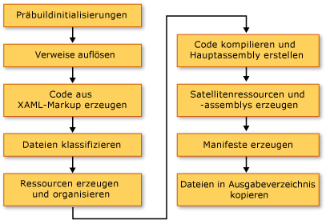

# <a name="compile-a-wpf-application"></a><span data-ttu-id="3dc73-102">Kompilieren einer WPF-Anwendung</span><span class="sxs-lookup"><span data-stu-id="3dc73-102">Compile a WPF Application</span></span>

<span data-ttu-id="3dc73-103">WPF-Anwendungen (Windows Presentation Foundation) können als .NET Framework ausführbare Dateien (exe-Dateien), Bibliotheken (DLL-Dateien) oder eine Kombination aus beiden Assemblytypen erstellt werden.</span><span class="sxs-lookup"><span data-stu-id="3dc73-103">Windows Presentation Foundation (WPF) applications can be built as .NET Framework executables (.exe), libraries (.dll), or a combination of both types of assemblies.</span></span> <span data-ttu-id="3dc73-104">In diesem Thema wird erläutert, wie WPF-Anwendungen erstellt und die wichtigsten Schritte im Buildprozess beschrieben werden.</span><span class="sxs-lookup"><span data-stu-id="3dc73-104">This topic introduces how to build WPF applications and describes the key steps in the build process.</span></span>

<a name="Building_a_WPF_Application_using_Command_Line"></a>

## <a name="building-a-wpf-application"></a><span data-ttu-id="3dc73-105">Erstellen einer WPF-Anwendung</span><span class="sxs-lookup"><span data-stu-id="3dc73-105">Building a WPF Application</span></span>

<span data-ttu-id="3dc73-106">Zum Kompilieren einer WPF-Anwendung stehen folgende Methoden zur Verfügung:</span><span class="sxs-lookup"><span data-stu-id="3dc73-106">A WPF application can be compiled in the following ways:</span></span>

- <span data-ttu-id="3dc73-107">Befehlszeile.</span><span class="sxs-lookup"><span data-stu-id="3dc73-107">Command-line.</span></span> <span data-ttu-id="3dc73-108">Die Anwendung darf nur Code (kein XAML) und eine Anwendungsdefinitionsdatei enthalten.</span><span class="sxs-lookup"><span data-stu-id="3dc73-108">The application must contain only code (no XAML) and an application definition file.</span></span> <span data-ttu-id="3dc73-109">Weitere Informationen finden Sie unter [Erstellen über die Befehlszeile mit csc.exe](../../../csharp/language-reference/compiler-options/command-line-building-with-csc-exe.md) oder [Erstellen von der Befehlszeile aus (Visual Basic)](../../../visual-basic/reference/command-line-compiler/building-from-the-command-line.md).</span><span class="sxs-lookup"><span data-stu-id="3dc73-109">For more information, see [Command-line Building With csc.exe](../../../csharp/language-reference/compiler-options/command-line-building-with-csc-exe.md) or [Building from the Command Line (Visual Basic)](../../../visual-basic/reference/command-line-compiler/building-from-the-command-line.md).</span></span>

- <span data-ttu-id="3dc73-110">Microsoft Build Engine (MSBuild).</span><span class="sxs-lookup"><span data-stu-id="3dc73-110">Microsoft Build Engine (MSBuild).</span></span> <span data-ttu-id="3dc73-111">Neben dem Code und XAML-Dateien muss die Anwendung eine MSBuild-Projektdatei enthalten.</span><span class="sxs-lookup"><span data-stu-id="3dc73-111">In addition to the code and XAML files, the application must contain an MSBuild project file.</span></span> <span data-ttu-id="3dc73-112">Weitere Informationen finden Sie unter „MSBuild“.</span><span class="sxs-lookup"><span data-stu-id="3dc73-112">For more information, see "MSBuild".</span></span>

- <span data-ttu-id="3dc73-113">Visual Studio.</span><span class="sxs-lookup"><span data-stu-id="3dc73-113">Visual Studio.</span></span> <span data-ttu-id="3dc73-114">Visual Studio ist eine integrierte Entwicklungsumgebung, die WPF-Anwendungen mit MSBuild kompiliert und einen visuellen Designer für das Erstellen der Benutzeroberfläche enthält.</span><span class="sxs-lookup"><span data-stu-id="3dc73-114">Visual Studio is an integrated development environment that compiles WPF applications with MSBuild and includes a visual designer for creating UI.</span></span> <span data-ttu-id="3dc73-115">Weitere Informationen finden Sie unter [schreiben und Verwalten von Code mithilfe von Visual Studio](/visualstudio/ide/index-writing-code) und [Entwerfen von XAML in Visual Studio](/visualstudio/xaml-tools/designing-xaml-in-visual-studio).</span><span class="sxs-lookup"><span data-stu-id="3dc73-115">For more information, see [Write and manage code using Visual Studio](/visualstudio/ide/index-writing-code) and [Design XAML in Visual Studio](/visualstudio/xaml-tools/designing-xaml-in-visual-studio).</span></span>

<a name="The_Windows_Presentation_Foundation_Build_Pipeline"></a>

## <a name="wpf-build-pipeline"></a><span data-ttu-id="3dc73-116">WPF-Buildpipeline</span><span class="sxs-lookup"><span data-stu-id="3dc73-116">WPF Build Pipeline</span></span>

<span data-ttu-id="3dc73-117">Wenn ein WPF-Projekt erstellt wird, wird die Kombination von sprachspezifischen und WPF-spezifischen Zielen aufgerufen.</span><span class="sxs-lookup"><span data-stu-id="3dc73-117">When a WPF project is built, the combination of language-specific and WPF-specific targets are invoked.</span></span> <span data-ttu-id="3dc73-118">Das Ausführen dieser Ziele wird als Buildpipeline bezeichnet. Die wichtigsten Schritte werden in der folgenden Abbildung dargestellt.</span><span class="sxs-lookup"><span data-stu-id="3dc73-118">The process of executing these targets is called the build pipeline, and the key steps are illustrated by the following figure.</span></span>

<span data-ttu-id="3dc73-119"></span><span class="sxs-lookup"><span data-stu-id="3dc73-119"></span></span>

<a name="Pre_Build_Initializations"></a>

### <a name="pre-build-initializations"></a><span data-ttu-id="3dc73-120">Präbuildinitialisierungen</span><span class="sxs-lookup"><span data-stu-id="3dc73-120">Pre-Build Initializations</span></span>

<span data-ttu-id="3dc73-121">Vor dem Erstellen bestimmt MSBuild den Speicherort wichtiger Tools und Bibliotheken, einschließlich der folgenden:</span><span class="sxs-lookup"><span data-stu-id="3dc73-121">Before building, MSBuild determines the location of important tools and libraries, including the following:</span></span>

- <span data-ttu-id="3dc73-122">Der .NET Framework.</span><span class="sxs-lookup"><span data-stu-id="3dc73-122">The .NET Framework.</span></span>

- <span data-ttu-id="3dc73-123">Die Windows SDK Verzeichnisse.</span><span class="sxs-lookup"><span data-stu-id="3dc73-123">The Windows SDK directories.</span></span>

- <span data-ttu-id="3dc73-124">Der Speicherort der WPF-Verweisassemblys</span><span class="sxs-lookup"><span data-stu-id="3dc73-124">The location of WPF reference assemblies.</span></span>

- <span data-ttu-id="3dc73-125">Die Eigenschaft für die Assemblysuchpfade.</span><span class="sxs-lookup"><span data-stu-id="3dc73-125">The property for the assembly search paths.</span></span>

<span data-ttu-id="3dc73-126">Der erste Speicherort, an dem MSBuild nach Assemblys sucht, ist das verweisassemblyverzeichnis (%ProgramFiles%\Reference Assemblies\Microsoft\Framework\v3.0\\).</span><span class="sxs-lookup"><span data-stu-id="3dc73-126">The first location where MSBuild searches for assemblies is the reference assembly directory (%ProgramFiles%\Reference Assemblies\Microsoft\Framework\v3.0\\).</span></span> <span data-ttu-id="3dc73-127">In diesem Schritt initialisiert der Buildprozess auch die verschiedenen Eigenschaften und Elementgruppen und führt die erforderlichen Bereinigungen durch.</span><span class="sxs-lookup"><span data-stu-id="3dc73-127">During this step, the build process also initializes the various properties and item groups and performs any required cleanup work.</span></span>

<a name="Resolving_references"></a>

### <a name="resolving-references"></a><span data-ttu-id="3dc73-128">Auflösen von Verweisen</span><span class="sxs-lookup"><span data-stu-id="3dc73-128">Resolving References</span></span>

<span data-ttu-id="3dc73-129">Der Buildprozess sucht und bindet die Assemblys, die zum Erstellen des Anwendungsprojekts erforderlich sind.</span><span class="sxs-lookup"><span data-stu-id="3dc73-129">The build process locates and binds the assemblies required to build the application project.</span></span> <span data-ttu-id="3dc73-130">Diese Logik ist in der `ResolveAssemblyReference`-Aufgabe enthalten.</span><span class="sxs-lookup"><span data-stu-id="3dc73-130">This logic is contained in the `ResolveAssemblyReference` task.</span></span> <span data-ttu-id="3dc73-131">Alle in der Projektdatei als `Reference` deklarierten Assemblys werden der Aufgabe mit Informationen zu Suchpfaden und Metadaten für Assemblys, die bereits im System installiert sind, zur Verfügung gestellt.</span><span class="sxs-lookup"><span data-stu-id="3dc73-131">All assemblies declared as `Reference` in the project file are provided to the task along with information on the search paths and metadata on assemblies already installed on the system.</span></span> <span data-ttu-id="3dc73-132">Der Task sucht Assemblys und verwendet die Metadaten der installierten Assembly, um die WPF-Kernassemblys herauszufiltern, die in den Ausgabe Manifesten nicht angezeigt werden müssen.</span><span class="sxs-lookup"><span data-stu-id="3dc73-132">The task looks up assemblies and uses the installed assembly's metadata to filter out those core WPF assemblies that need not show up in the output manifests.</span></span> <span data-ttu-id="3dc73-133">Auf diese Weise vermeiden Sie redundante Informationen in den ClickOnce-Manifesten.</span><span class="sxs-lookup"><span data-stu-id="3dc73-133">This is done to avoid redundant information in the ClickOnce manifests.</span></span> <span data-ttu-id="3dc73-134">Da "presentationframework. dll" beispielsweise als repräsentativ für eine Anwendung angesehen werden kann, die auf und für WPF basiert, und da alle WPF-Assemblys am gleichen Speicherort auf jedem Computer vorhanden sind, auf dem der .NET Framework installiert ist, müssen Sie nicht alle Informationen zu allen .NET Framework Verweisassemblys in den Manifesten.</span><span class="sxs-lookup"><span data-stu-id="3dc73-134">For example, since PresentationFramework.dll can be considered representative of an application built on and for WPF, and since all WPF assemblies exist at the same location on every machine that has the .NET Framework installed, there's no need to include all information on all .NET Framework reference assemblies in the manifests.</span></span>

<a name="Markup_Compilation___Pass_1"></a>

### <a name="markup-compilationpass-1"></a><span data-ttu-id="3dc73-135">Markupkompilierungsdurchlauf 1</span><span class="sxs-lookup"><span data-stu-id="3dc73-135">Markup Compilation—Pass 1</span></span>

<span data-ttu-id="3dc73-136">In diesem Schritt werden [!INCLUDE[TLA2#tla_xaml](../../../../includes/tla2sharptla-xaml-md.md)] Dateien analysiert und kompiliert, sodass die Laufzeit keine Zeit für das Analysieren von XML und das Validieren von Eigenschafts Werten benötigt.</span><span class="sxs-lookup"><span data-stu-id="3dc73-136">In this step, [!INCLUDE[TLA2#tla_xaml](../../../../includes/tla2sharptla-xaml-md.md)] files are parsed and compiled so that the runtime does not spend time parsing XML and validating property values.</span></span> <span data-ttu-id="3dc73-137">Die kompilierte [!INCLUDE[TLA2#tla_xaml](../../../../includes/tla2sharptla-xaml-md.md)]-Datei wird zuvor mit Token versehen, sodass das Laden zur Laufzeit sehr viel schneller verläuft als das Laden einer [!INCLUDE[TLA2#tla_xaml](../../../../includes/tla2sharptla-xaml-md.md)]-Datei.</span><span class="sxs-lookup"><span data-stu-id="3dc73-137">The compiled [!INCLUDE[TLA2#tla_xaml](../../../../includes/tla2sharptla-xaml-md.md)] file is pre-tokenized so that, at run time, loading it should be much faster than loading a [!INCLUDE[TLA2#tla_xaml](../../../../includes/tla2sharptla-xaml-md.md)] file.</span></span>

<span data-ttu-id="3dc73-138">In diesem Schritt werden für jede [!INCLUDE[TLA2#tla_xaml](../../../../includes/tla2sharptla-xaml-md.md)]-Datei, die ein `Page`-Buildelement ist, die folgenden Aktionen ausgeführt:</span><span class="sxs-lookup"><span data-stu-id="3dc73-138">During this step, the following activities take place for every [!INCLUDE[TLA2#tla_xaml](../../../../includes/tla2sharptla-xaml-md.md)] file that is a `Page` build item:</span></span>

1. <span data-ttu-id="3dc73-139">Die [!INCLUDE[TLA2#tla_xaml](../../../../includes/tla2sharptla-xaml-md.md)]-Datei wird vom Markupcompiler analysiert.</span><span class="sxs-lookup"><span data-stu-id="3dc73-139">The [!INCLUDE[TLA2#tla_xaml](../../../../includes/tla2sharptla-xaml-md.md)] file is parsed by the markup compiler.</span></span>

2. <span data-ttu-id="3dc73-140">Eine kompilierte Darstellung wird für diese [!INCLUDE[TLA2#tla_xaml](../../../../includes/tla2sharptla-xaml-md.md)] erstellt und in den Ordner „obj\Release“ kopiert.</span><span class="sxs-lookup"><span data-stu-id="3dc73-140">A compiled representation is created for that [!INCLUDE[TLA2#tla_xaml](../../../../includes/tla2sharptla-xaml-md.md)] and copied to the obj\Release folder.</span></span>

3. <span data-ttu-id="3dc73-141">Eine CodeDOM-Darstellung einer neuen Teilklasse wird erstellt und in den Ordner „obj\Release“ kopiert.</span><span class="sxs-lookup"><span data-stu-id="3dc73-141">A CodeDOM representation of a new partial class is created and copied to the obj\Release folder.</span></span>

<span data-ttu-id="3dc73-142">Außerdem wird eine sprachspezifische Codedatei für jede [!INCLUDE[TLA2#tla_xaml](../../../../includes/tla2sharptla-xaml-md.md)]-Datei generiert.</span><span class="sxs-lookup"><span data-stu-id="3dc73-142">In addition, a language-specific code file is generated for every [!INCLUDE[TLA2#tla_xaml](../../../../includes/tla2sharptla-xaml-md.md)] file.</span></span> <span data-ttu-id="3dc73-143">Beispielsweise wird für eine "Page1. XAML-Seite in einem Visual Basic Projekt eine" Page1. g. vb-Datei generiert. für eine "Page1. XAML-Seite in C# einem Projekt wird ein Page1.g.cs generiert.</span><span class="sxs-lookup"><span data-stu-id="3dc73-143">For example, for a Page1.xaml page in a Visual Basic project, a Page1.g.vb is generated; for a Page1.xaml page in a C# project, a Page1.g.cs is generated.</span></span> <span data-ttu-id="3dc73-144">Das „.g“ im Dateinamen gibt an, dass die Datei generierten Code darstellt, der über eine Deklaration der partiellen Klasse für das Element der oberen Ebene der Markupdatei entspricht (z. B. `Page` oder `Window`).</span><span class="sxs-lookup"><span data-stu-id="3dc73-144">The ".g" in the file name indicates the file is generated code that has a partial class declaration for the top-level element of the markup file (such as `Page` or `Window`).</span></span> <span data-ttu-id="3dc73-145">Die-Klasse wird mit dem `partial`-Modifizierer in C# (`Extends` in Visual Basic) deklariert, um anzugeben, dass an anderer Stelle eine andere Deklaration für die Klasse vorliegt (normalerweise in der Code Behind-Datei Page1.XAML.cs).</span><span class="sxs-lookup"><span data-stu-id="3dc73-145">The class is declared with the `partial` modifier in C# (`Extends` in Visual Basic) to indicate there is another declaration for the class elsewhere, usually in the code-behind file Page1.xaml.cs.</span></span>

<span data-ttu-id="3dc73-146">Die partielle Klasse erstreckt sich von der entsprechenden Basisklasse (z. b. <xref:System.Windows.Controls.Page> für eine Seite) und implementiert die <xref:System.Windows.Markup.IComponentConnector?displayProperty=nameWithType>-Schnittstelle.</span><span class="sxs-lookup"><span data-stu-id="3dc73-146">The partial class extends from the appropriate base class (such as <xref:System.Windows.Controls.Page> for a page) and implements the <xref:System.Windows.Markup.IComponentConnector?displayProperty=nameWithType> interface.</span></span> <span data-ttu-id="3dc73-147">Die <xref:System.Windows.Markup.IComponentConnector>-Schnittstelle verfügt über Methoden, um eine Komponente zu initialisieren und Namen und Ereignisse für Elemente im Inhalt zu verbinden.</span><span class="sxs-lookup"><span data-stu-id="3dc73-147">The <xref:System.Windows.Markup.IComponentConnector> interface has methods to initialize a component and connect names and events on elements in its content.</span></span> <span data-ttu-id="3dc73-148">Folglich sieht die Methodenimplementierung der generierten Codedatei folgendermaßen aus:</span><span class="sxs-lookup"><span data-stu-id="3dc73-148">Consequently, the generated code file has a method implementation like the following:</span></span>

```csharp
public void InitializeComponent() {
    if (_contentLoaded) {
        return;
    }
    _contentLoaded = true;
    System.Uri resourceLocater =
        new System.Uri(
            "window1.xaml",
            System.UriKind.RelativeOrAbsolute);
    System.Windows.Application.LoadComponent(this, resourceLocater);
}
```

```vb
Public Sub InitializeComponent() _

    If _contentLoaded Then
        Return
    End If

    _contentLoaded = True
    Dim resourceLocater As System.Uri = _
        New System.Uri("mainwindow.xaml", System.UriKind.Relative)

    System.Windows.Application.LoadComponent(Me, resourceLocater)

End Sub
```

<span data-ttu-id="3dc73-149">Standardmäßig wird die Markup Kompilierung im gleichen <xref:System.AppDomain> wie die MSBuild-Engine ausgeführt.</span><span class="sxs-lookup"><span data-stu-id="3dc73-149">By default, markup compilation runs in the same <xref:System.AppDomain> as the MSBuild engine.</span></span> <span data-ttu-id="3dc73-150">Dies ermöglicht einen erheblichen Leistungszuwachs.</span><span class="sxs-lookup"><span data-stu-id="3dc73-150">This provides significant performance gains.</span></span> <span data-ttu-id="3dc73-151">Dieses Verhalten kann mit der `AlwaysCompileMarkupFilesInSeparateDomain`-Eigenschaft umgeschaltet werden.</span><span class="sxs-lookup"><span data-stu-id="3dc73-151">This behavior can be toggled with the `AlwaysCompileMarkupFilesInSeparateDomain` property.</span></span> <span data-ttu-id="3dc73-152">Dies hat den Vorteil, dass alle Verweisassemblys durch Entladen der separaten <xref:System.AppDomain>entladen werden.</span><span class="sxs-lookup"><span data-stu-id="3dc73-152">This has the advantage of unloading all reference assemblies by unloading the separate <xref:System.AppDomain>.</span></span>

<a name="Pass_2_of_Markup_Compilation"></a>

### <a name="markup-compilationpass-2"></a><span data-ttu-id="3dc73-153">Markupkompilierungsdurchlauf 2</span><span class="sxs-lookup"><span data-stu-id="3dc73-153">Markup Compilation—Pass 2</span></span>

<span data-ttu-id="3dc73-154">Während des Durchlaufs 1 der Markupkompilierung werden nicht alle [!INCLUDE[TLA2#tla_xaml](../../../../includes/tla2sharptla-xaml-md.md)]-Seiten kompiliert.</span><span class="sxs-lookup"><span data-stu-id="3dc73-154">Not all [!INCLUDE[TLA2#tla_xaml](../../../../includes/tla2sharptla-xaml-md.md)] pages are compiled at during pass 1 of markup compilation.</span></span> [!INCLUDE[TLA2#tla_xaml](../../../../includes/tla2sharptla-xaml-md.md)]<span data-ttu-id="3dc73-155">-Dateien, die lokal definierte Typverweise aufweisen (Verweise auf Typen, die im Code an anderer Stelle im selben Projekt definiert sind), werden derzeit von der Kompilierung ausgenommen.</span><span class="sxs-lookup"><span data-stu-id="3dc73-155">files that have locally defined type references (references to types defined in code elsewhere in the same project) are exempt from compilation at this time.</span></span> <span data-ttu-id="3dc73-156">Das liegt daran, dass diese lokal definierten Typen nur im Quellcode existieren und noch nicht kompiliert wurden.</span><span class="sxs-lookup"><span data-stu-id="3dc73-156">This is because those locally defined types exist only in source and have not yet been compiled.</span></span> <span data-ttu-id="3dc73-157">Um dies zu bestimmen, verwendet der Parser heuristische Verfahren, die das Suchen nach Elementen umfassen, z. B. `x:Name` in der Markupdatei.</span><span class="sxs-lookup"><span data-stu-id="3dc73-157">In order to determine this, the parser uses heuristics that involve looking for items such as `x:Name` in the markup file.</span></span> <span data-ttu-id="3dc73-158">Wird eine solche Instanz gefunden, wird die Kompilierung der Markupdatei bis zur Kompilierung der Codedateien zurückgestellt. Anschließend werden diese Dateien im zweiten Durchlauf der Markupkompilierung verarbeitet.</span><span class="sxs-lookup"><span data-stu-id="3dc73-158">When such an instance is found, that markup file’s compilation is postponed until the code files have been compiled, after which, the second markup compilation pass processes these files.</span></span>

<a name="File_Classification"></a>

### <a name="file-classification"></a><span data-ttu-id="3dc73-159">Dateiklassifizierung</span><span class="sxs-lookup"><span data-stu-id="3dc73-159">File Classification</span></span>

<span data-ttu-id="3dc73-160">Der Buildprozess fügt Ausgabedateien in verschiedene Ressourcengruppen ein, und zwar abhängig von der Anwendungsassembly, in die sie platziert werden.</span><span class="sxs-lookup"><span data-stu-id="3dc73-160">The build process puts output files into different resource groups based on which application assembly they will be placed in.</span></span> <span data-ttu-id="3dc73-161">In einer normalen nicht lokalisierten Anwendung werden alle als `Resource` markierten Datendateien in der Hauptassembly platziert (ausführbare Datei oder Bibliothek).</span><span class="sxs-lookup"><span data-stu-id="3dc73-161">In a typical nonlocalized application, all data files marked as `Resource` are placed in the main assembly (executable or library).</span></span> <span data-ttu-id="3dc73-162">Wenn `UICulture` im Projekt festgelegt ist, werden alle kompilierten [!INCLUDE[TLA2#tla_xaml](../../../../includes/tla2sharptla-xaml-md.md)]-Dateien und speziell als sprachspezifisch markierte Ressourcen in die Satellitenressourcenassembly eingefügt.</span><span class="sxs-lookup"><span data-stu-id="3dc73-162">When `UICulture` is set in the project, all compiled [!INCLUDE[TLA2#tla_xaml](../../../../includes/tla2sharptla-xaml-md.md)] files and those resources specifically marked as language-specific are placed in the satellite resource assembly.</span></span> <span data-ttu-id="3dc73-163">Außerdem werden alle sprachneutralen Ressourcen in die Hauptassembly eingefügt.</span><span class="sxs-lookup"><span data-stu-id="3dc73-163">Furthermore, all language-neutral resources are placed in the main assembly.</span></span> <span data-ttu-id="3dc73-164">In diesem Schritt des Buildprozesses wird diese Bestimmung vorgenommen.</span><span class="sxs-lookup"><span data-stu-id="3dc73-164">In this step of the build process, that determination is made.</span></span>

<span data-ttu-id="3dc73-165">Die Buildaktionen `ApplicationDefinition`, `Page` und `Resource` in der Projektdatei können mit den `Localizable`-Metadaten erweitert werden (zulässige Werte sind `true` und `false`), die festlegen, ob die Datei sprachspezifisch oder sprachneutral ist.</span><span class="sxs-lookup"><span data-stu-id="3dc73-165">The `ApplicationDefinition`, `Page`, and `Resource` build actions in the project file can be augmented with the `Localizable` metadata (acceptable values are `true` and `false`), which dictates whether the file is language-specific or language-neutral.</span></span>

<a name="Core_Compilation"></a>

### <a name="core-compilation"></a><span data-ttu-id="3dc73-166">Kernkompilierung</span><span class="sxs-lookup"><span data-stu-id="3dc73-166">Core Compilation</span></span>

<span data-ttu-id="3dc73-167">In dem Schritt der Kernkompilierung wird die Kompilierung von Codedateien ausgeführt.</span><span class="sxs-lookup"><span data-stu-id="3dc73-167">The core compile step involves compilation of code files.</span></span> <span data-ttu-id="3dc73-168">Dieser Vorgang wird in den sprachspezifischen Zieldateien „Microsoft.CSharp.targets“ und „Microsoft.VisualBasic.targets“ logisch koordiniert.</span><span class="sxs-lookup"><span data-stu-id="3dc73-168">This is orchestrated by logic in the language-specific targets files Microsoft.CSharp.targets and Microsoft.VisualBasic.targets.</span></span> <span data-ttu-id="3dc73-169">Die Hauptassembly wird generiert, wenn die Heuristik einen einzelnen Durchlauf des Markupcompilers als ausreichend einschätzt.</span><span class="sxs-lookup"><span data-stu-id="3dc73-169">If heuristics have determined that a single pass of the markup compiler is sufficient, then the main assembly is generated.</span></span> <span data-ttu-id="3dc73-170">Wenn jedoch eine oder mehrere [!INCLUDE[TLA2#tla_xaml](../../../../includes/tla2sharptla-xaml-md.md)]-Dateien im Projekt Verweise auf lokal definierte Typen aufweisen, wird eine temporäre DLL-Datei generiert, damit die finalen Anwendungsassemblys nach Abschluss des zweiten Durchlaufs der Markupkompilierung erstellt werden können.</span><span class="sxs-lookup"><span data-stu-id="3dc73-170">However, if one or more [!INCLUDE[TLA2#tla_xaml](../../../../includes/tla2sharptla-xaml-md.md)] files in the project have references to locally defined types, then a temporary .dll file is generated so the final application assemblies may be created after the second pass of markup compilation is complete.</span></span>

<a name="Manifest_generation"></a>

### <a name="manifest-generation"></a><span data-ttu-id="3dc73-171">Manifestgenerierung</span><span class="sxs-lookup"><span data-stu-id="3dc73-171">Manifest Generation</span></span>

<span data-ttu-id="3dc73-172">Nachdem alle Anwendungsassemblys und Inhalts Dateien bereit sind, werden am Ende des Buildprozesses die ClickOnce-Manifeste für die Anwendung generiert.</span><span class="sxs-lookup"><span data-stu-id="3dc73-172">At the end of the build process, after all the application assemblies and content files are ready, the ClickOnce manifests for the application are generated.</span></span>

<span data-ttu-id="3dc73-173">Mit der Bereiststellungsmanifestdatei wird das Bereitstellungsmodell beschrieben: die aktuelle Version, Aktualisierungsverhalten und die Identität des Herausgebers mit der digitalen Signatur.</span><span class="sxs-lookup"><span data-stu-id="3dc73-173">The deployment manifest file describes the deployment model: the current version, update behavior, and publisher identity along with digital signature.</span></span> <span data-ttu-id="3dc73-174">Dieses Manifest sollte von Administratoren erstellt werden, die für die Bereitstellung zuständig sind.</span><span class="sxs-lookup"><span data-stu-id="3dc73-174">This manifest is intended to be authored by administrators who handle deployment.</span></span> <span data-ttu-id="3dc73-175">Die Dateierweiterung ist. XBAP (für XAML-Browser Anwendungen (XBAPs)) und. Application für installierte Anwendungen.</span><span class="sxs-lookup"><span data-stu-id="3dc73-175">The file extension is .xbap (for XAML browser applications (XBAPs)) and .application for installed applications.</span></span> <span data-ttu-id="3dc73-176">Erstere wird durch die `HostInBrowser`-Projekteigenschaft vorgeschrieben. Als Ergebnis identifiziert das Manifest die Anwendung als vom Browser gehostet.</span><span class="sxs-lookup"><span data-stu-id="3dc73-176">The former is dictated by the `HostInBrowser` project property and as a result the manifest identifies the application as browser-hosted.</span></span>

<span data-ttu-id="3dc73-177">Im Anwendungsmanifest (die Datei „.exe.manifest“) werden die Anwendungsassemblys und abhängigen Bibliotheken beschrieben und die von der Anwendung benötigten Berechtigungen aufgeführt.</span><span class="sxs-lookup"><span data-stu-id="3dc73-177">The application manifest (an .exe.manifest file) describes the application assemblies and dependent libraries and lists permissions required by the application.</span></span> <span data-ttu-id="3dc73-178">Diese Datei sollte vom Anwendungsentwickler erstellt werden.</span><span class="sxs-lookup"><span data-stu-id="3dc73-178">This file is intended to be authored by the application developer.</span></span> <span data-ttu-id="3dc73-179">Um eine ClickOnce-Anwendung zu starten, öffnet ein Benutzer die Bereitstellungs Manifest-Datei der Anwendung.</span><span class="sxs-lookup"><span data-stu-id="3dc73-179">In order to launch a ClickOnce application, a user opens the application's deployment manifest file.</span></span>

<span data-ttu-id="3dc73-180">Diese Manifest-Dateien werden immer für XBAPs erstellt.</span><span class="sxs-lookup"><span data-stu-id="3dc73-180">These manifest files are always created for XBAPs.</span></span> <span data-ttu-id="3dc73-181">Für installierte Anwendungen werden sie nicht erstellt, sofern die `GenerateManifests`-Eigenschaft in der Projektdatei nicht mit dem Wert `true` angegeben wird.</span><span class="sxs-lookup"><span data-stu-id="3dc73-181">For installed applications, they are not created unless the `GenerateManifests` property is specified in the project file with value `true`.</span></span>

<span data-ttu-id="3dc73-182">XBAPs erhält über die Berechtigungen, die typischen Internet Zonen Anwendungen zugewiesen sind, zwei zusätzliche Berechtigungen: <xref:System.Security.Permissions.WebBrowserPermission> und <xref:System.Security.Permissions.MediaPermission>.</span><span class="sxs-lookup"><span data-stu-id="3dc73-182">XBAPs get two additional permissions over and above those permissions assigned to typical Internet zone applications: <xref:System.Security.Permissions.WebBrowserPermission> and <xref:System.Security.Permissions.MediaPermission>.</span></span> <span data-ttu-id="3dc73-183">Das WPF-Buildsystem deklariert diese Berechtigungen im Anwendungs Manifest.</span><span class="sxs-lookup"><span data-stu-id="3dc73-183">The WPF build system declares those permissions in the application manifest.</span></span>

<a name="Incremental_Build_Support"></a>

## <a name="incremental-build-support"></a><span data-ttu-id="3dc73-184">Unterstützung für inkrementelle Builds</span><span class="sxs-lookup"><span data-stu-id="3dc73-184">Incremental Build Support</span></span>

<span data-ttu-id="3dc73-185">Das WPF-Buildsystem unterstützt inkrementelle Builds.</span><span class="sxs-lookup"><span data-stu-id="3dc73-185">The WPF build system provides support for incremental builds.</span></span> <span data-ttu-id="3dc73-186">An Markup oder Code vorgenommene Änderungen werden auf intelligente Weise ermittelt. Außerdem werden nur jene Artefakte kompiliert, die von den Änderungen beeinflusst wurden.</span><span class="sxs-lookup"><span data-stu-id="3dc73-186">It is fairly intelligent about detecting changes made to markup or code, and it compiles only those artifacts affected by the change.</span></span> <span data-ttu-id="3dc73-187">Der Mechanismus für inkrementelle Builds verwendet die folgenden Dateien:</span><span class="sxs-lookup"><span data-stu-id="3dc73-187">The incremental build mechanism uses the following files:</span></span>

- <span data-ttu-id="3dc73-188">Die Datei $(*AssemblyName*)_MarkupCompiler.Cache zum Verwalten des aktuellen Compilerzustands.</span><span class="sxs-lookup"><span data-stu-id="3dc73-188">An $(*AssemblyName*)_MarkupCompiler.Cache file to maintain current compiler state.</span></span>

- <span data-ttu-id="3dc73-189">Die Datei $(*AssemblyName*)_MarkupCompiler.lref, um [!INCLUDE[TLA2#tla_xaml](../../../../includes/tla2sharptla-xaml-md.md)]-Dateien mit Verweisen auf lokal definierte Typen zwischenzuspeichern.</span><span class="sxs-lookup"><span data-stu-id="3dc73-189">An $(*AssemblyName*)_MarkupCompiler.lref file to cache the [!INCLUDE[TLA2#tla_xaml](../../../../includes/tla2sharptla-xaml-md.md)] files with references to locally defined types.</span></span>

<span data-ttu-id="3dc73-190">Im Folgenden finden Sie einen Satz von Regeln für inkrementelle Builds:</span><span class="sxs-lookup"><span data-stu-id="3dc73-190">The following is a set of rules governing incremental build:</span></span>

- <span data-ttu-id="3dc73-191">Die Datei ist die kleinste Einheit, bei der das Buildsystem eine Änderung erkennt.</span><span class="sxs-lookup"><span data-stu-id="3dc73-191">The file is the smallest unit at which the build system detects change.</span></span> <span data-ttu-id="3dc73-192">Demnach kann das Buildsystem bei einer Codedatei nicht erkennen, ob ein Typ geändert oder ob Code hinzugefügt wurde.</span><span class="sxs-lookup"><span data-stu-id="3dc73-192">So, for a code file, the build system cannot tell if a type was changed or if code was added.</span></span> <span data-ttu-id="3dc73-193">Dasselbe gilt für Projektdateien.</span><span class="sxs-lookup"><span data-stu-id="3dc73-193">The same holds for project files.</span></span>

- <span data-ttu-id="3dc73-194">Der Mechanismus für inkrementelle Builds muss wissen, ob eine [!INCLUDE[TLA2#tla_xaml](../../../../includes/tla2sharptla-xaml-md.md)]-Seite entweder eine Klasse definiert oder andere Klassen verwendet.</span><span class="sxs-lookup"><span data-stu-id="3dc73-194">The incremental build mechanism must be cognizant that a [!INCLUDE[TLA2#tla_xaml](../../../../includes/tla2sharptla-xaml-md.md)] page either defines a class or uses other classes.</span></span>

- <span data-ttu-id="3dc73-195">Wenn sich `Reference`-Einträge ändern, kompilieren Sie alle Seiten neu.</span><span class="sxs-lookup"><span data-stu-id="3dc73-195">If `Reference` entries change, then recompile all pages.</span></span>

- <span data-ttu-id="3dc73-196">Wenn sich eine Codedatei ändert, kompilieren Sie alle Seiten mit lokal definierten Typverweisen neu.</span><span class="sxs-lookup"><span data-stu-id="3dc73-196">If a code file changes, recompile all pages with locally defined type references.</span></span>

- <span data-ttu-id="3dc73-197">Wenn sich eine [!INCLUDE[TLA2#tla_xaml](../../../../includes/tla2sharptla-xaml-md.md)]-Datei ändert:</span><span class="sxs-lookup"><span data-stu-id="3dc73-197">If a [!INCLUDE[TLA2#tla_xaml](../../../../includes/tla2sharptla-xaml-md.md)] file changes:</span></span>

  - <span data-ttu-id="3dc73-198">Wenn [!INCLUDE[TLA2#tla_xaml](../../../../includes/tla2sharptla-xaml-md.md)] als Page `Page` Projekt deklariert wird: Wenn [!INCLUDE[TLA2#tla_xaml](../../../../includes/tla2sharptla-xaml-md.md)] keine lokal definierten Typverweise besitzt, kompilieren Sie diese [!INCLUDE[TLA2#tla_xaml](../../../../includes/tla2sharptla-xaml-md.md)] und alle [!INCLUDE[TLA2#tla_xaml](../../../../includes/tla2sharptla-xaml-md.md)]-Seiten mit lokalen Verweisen neu. Wenn [!INCLUDE[TLA2#tla_xaml](../../../../includes/tla2sharptla-xaml-md.md)] lokale Verweise aufweist, kompilieren Sie alle [!INCLUDE[TLA2#tla_xaml](../../../../includes/tla2sharptla-xaml-md.md)]-Seiten mit lokalen Verweisen neu.</span><span class="sxs-lookup"><span data-stu-id="3dc73-198">If [!INCLUDE[TLA2#tla_xaml](../../../../includes/tla2sharptla-xaml-md.md)] is declared as `Page` in the project: if the [!INCLUDE[TLA2#tla_xaml](../../../../includes/tla2sharptla-xaml-md.md)] does not have locally defined type references, recompile that [!INCLUDE[TLA2#tla_xaml](../../../../includes/tla2sharptla-xaml-md.md)] plus all [!INCLUDE[TLA2#tla_xaml](../../../../includes/tla2sharptla-xaml-md.md)] pages with local references; if the [!INCLUDE[TLA2#tla_xaml](../../../../includes/tla2sharptla-xaml-md.md)] has local references, recompile all [!INCLUDE[TLA2#tla_xaml](../../../../includes/tla2sharptla-xaml-md.md)] pages with local references.</span></span>

  - <span data-ttu-id="3dc73-199">Wenn [!INCLUDE[TLA2#tla_xaml](../../../../includes/tla2sharptla-xaml-md.md)] als `ApplicationDefinition` im Projekt deklariert ist: Kompilieren Sie alle [!INCLUDE[TLA2#tla_xaml](../../../../includes/tla2sharptla-xaml-md.md)] Seiten neu (Ursache: jede [!INCLUDE[TLA2#tla_xaml](../../../../includes/tla2sharptla-xaml-md.md)] hat einen Verweis auf einen <xref:System.Windows.Application> Typ, der sich möglicherweise geändert hat).</span><span class="sxs-lookup"><span data-stu-id="3dc73-199">If [!INCLUDE[TLA2#tla_xaml](../../../../includes/tla2sharptla-xaml-md.md)] is declared as `ApplicationDefinition` in the project: recompile all [!INCLUDE[TLA2#tla_xaml](../../../../includes/tla2sharptla-xaml-md.md)] pages (reason: each [!INCLUDE[TLA2#tla_xaml](../../../../includes/tla2sharptla-xaml-md.md)] has reference to an <xref:System.Windows.Application> type that may have changed).</span></span>

- <span data-ttu-id="3dc73-200">Wenn die Projektdatei statt einer [!INCLUDE[TLA2#tla_xaml](../../../../includes/tla2sharptla-xaml-md.md)]-Datei eine Codedatei als Anwendungsdefinition deklariert:</span><span class="sxs-lookup"><span data-stu-id="3dc73-200">If the project file declares a code file as application definition instead of a [!INCLUDE[TLA2#tla_xaml](../../../../includes/tla2sharptla-xaml-md.md)] file:</span></span>

  - <span data-ttu-id="3dc73-201">Überprüfen Sie, ob sich der `ApplicationClassName`-Wert in der Projektdatei geändert hat (gibt es einen neuen Anwendungstyp?).</span><span class="sxs-lookup"><span data-stu-id="3dc73-201">Check if the `ApplicationClassName` value in the project file has changed (is there a new application type?).</span></span> <span data-ttu-id="3dc73-202">Kompilieren Sie in diesem Fall die gesamte Anwendung neu.</span><span class="sxs-lookup"><span data-stu-id="3dc73-202">If so, recompile the entire application.</span></span>

  - <span data-ttu-id="3dc73-203">Kompilieren Sie ansonsten alle [!INCLUDE[TLA2#tla_xaml](../../../../includes/tla2sharptla-xaml-md.md)]-Seiten mit lokalen Verweisen neu.</span><span class="sxs-lookup"><span data-stu-id="3dc73-203">Otherwise, recompile all [!INCLUDE[TLA2#tla_xaml](../../../../includes/tla2sharptla-xaml-md.md)] pages with local references.</span></span>

- <span data-ttu-id="3dc73-204">Wenn sich eine Projektdatei ändert: Wenden Sie alle vorangehenden Regeln an, und stellen Sie fest, was neu kompiliert werden muss.</span><span class="sxs-lookup"><span data-stu-id="3dc73-204">If a project file changes: apply all preceding rules and see what needs to be recompiled.</span></span> <span data-ttu-id="3dc73-205">Änderungen an den folgenden Eigenschaften lösen eine vollständige Neukompilierung aus: `AssemblyName`, `IntermediateOutputPath`, `RootNamespace` und `HostInBrowser`.</span><span class="sxs-lookup"><span data-stu-id="3dc73-205">Changes to the following properties trigger a complete recompile: `AssemblyName`, `IntermediateOutputPath`, `RootNamespace`, and `HostInBrowser`.</span></span>

<span data-ttu-id="3dc73-206">Folgende Rekompilierungsszenarien sind möglich:</span><span class="sxs-lookup"><span data-stu-id="3dc73-206">The following recompile scenarios are possible:</span></span>

- <span data-ttu-id="3dc73-207">Die gesamte Anwendung wird neu kompiliert.</span><span class="sxs-lookup"><span data-stu-id="3dc73-207">The entire application is recompiled.</span></span>

- <span data-ttu-id="3dc73-208">Nur [!INCLUDE[TLA2#tla_xaml](../../../../includes/tla2sharptla-xaml-md.md)]-Dateien, die lokal definierte Typverweise enthalten, werden neu kompiliert.</span><span class="sxs-lookup"><span data-stu-id="3dc73-208">Only those [!INCLUDE[TLA2#tla_xaml](../../../../includes/tla2sharptla-xaml-md.md)] files that have locally defined type references are recompiled.</span></span>

- <span data-ttu-id="3dc73-209">Nichts wird neu kompiliert (es hat keine Änderung im Projekt stattgefunden).</span><span class="sxs-lookup"><span data-stu-id="3dc73-209">Nothing is recompiled (if nothing in the project has changed).</span></span>

## <a name="see-also"></a><span data-ttu-id="3dc73-210">Weitere Informationen</span><span class="sxs-lookup"><span data-stu-id="3dc73-210">See also</span></span>

- [<span data-ttu-id="3dc73-211">Bereitstellen von WPF-Anwendungen (WPF)</span><span class="sxs-lookup"><span data-stu-id="3dc73-211">Deploying a WPF Application</span></span>](deploying-a-wpf-application-wpf.md)
- [<span data-ttu-id="3dc73-212">WPF-MSBuild-Referenz</span><span class="sxs-lookup"><span data-stu-id="3dc73-212">WPF MSBuild Reference</span></span>](/visualstudio/msbuild/wpf-msbuild-reference)
- [<span data-ttu-id="3dc73-213">Paket-URI in WPF</span><span class="sxs-lookup"><span data-stu-id="3dc73-213">Pack URIs in WPF</span></span>](pack-uris-in-wpf.md)
- [<span data-ttu-id="3dc73-214">WPF-Anwendungsressource, Inhalts- und Datendateien</span><span class="sxs-lookup"><span data-stu-id="3dc73-214">WPF Application Resource, Content, and Data Files</span></span>](wpf-application-resource-content-and-data-files.md)
