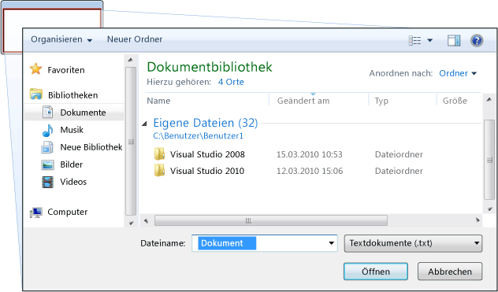
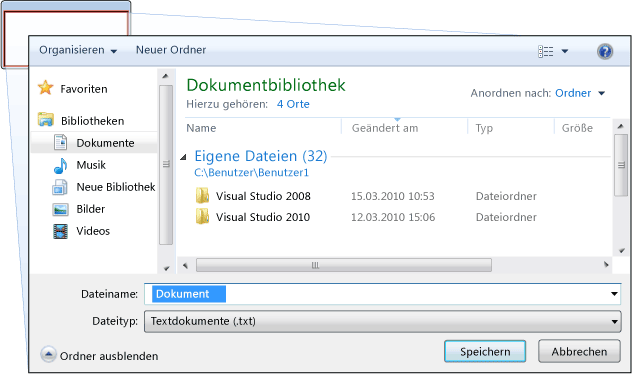
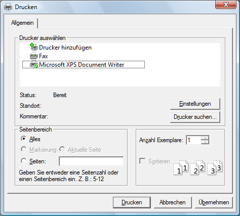
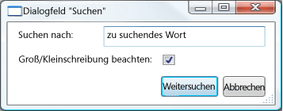

# Übersicht über Dialogfelder
Eigenständige Anwendungen haben in der Regel ein Hauptfenster, dass sowohl die hauptsächlichen Daten über den die Anwendung ausgeführt wird, und macht die Funktionalität zum Verarbeiten dieser Daten über zeigt [!INCLUDE[TLA#tla_ui](../../../../includes/tlasharptla-ui-md.md)] -Mechanismen wie Menüleisten, Symbolleisten und Statusleisten. Eine nicht triviale Anwendung kann auch zusätzliche Fenster anzeigen, um Folgendes auszuführen:  
  
-   Spezifische Informationen für Benutzer anzeigen.  
  
-   Informationen von Benutzern erfassen.  
  
-   Informationen sowohl anzeigen als auch erfassen.  
  
 Diese Fenstertypen werden als bezeichnet *Dialogfelder*, und es gibt zwei Arten: modale und nicht modale.  
  
 Ein *modale* Dialogfeld wird von einer Funktion angezeigt, wenn die Funktion zusätzliche Daten von einem Benutzer, um den Vorgang fortzusetzen. Da die Funktion beim Erfassen der Daten vom modalen Dialogfeld abhängig ist, verhindert das modale Dialogfeld auch, dass der Benutzer andere Fenster in der Anwendung aktiviert, während das Dialogfeld geöffnet bleibt. In den meisten Fällen kann ein modales Dialogfeld einen Benutzer aus, um zu signalisieren, wenn sie mit das modale Dialogfeld abgeschlossen haben, drücken Sie eine eine **OK** oder **Abbrechen** Schaltfläche. Drücken Sie die **OK** Schaltfläche gibt an, dass ein Benutzer Daten eingegeben hat und möchte, die Funktion zum Fortsetzen der Verarbeitung dieser Daten dass. Drücken Sie die **Abbrechen** Schaltfläche gibt an, dass ein Benutzer möchte auf die Funktion die Ausführung komplett abbricht. Die häufigsten Beispiele für modale Dialogfelder sind das Öffnen, Speichern und Drucken von Daten.  
  
 Ein *nicht modale* im Dialogfeld auf der anderen Seite verhindert nicht, dass einen Benutzer über andere Fenster aktiviert wird, während er geöffnet ist. Wenn ein Benutzer z. B. Vorkommen eines bestimmten Worts in einem Dokument finden möchte, wird in einem Hauptfenster oft ein Dialogfeld geöffnet, um den Benutzer zu fragen, nach welchem Wort er sucht. Da die Suche nach einem Wort einen Benutzer aber nicht an der Bearbeitung des Dokuments hindert, muss das Dialogfeld nicht unbedingt modal sein. Ein nicht modales Dialogfeld enthält mindestens ein **schließen** Schaltfläche, um das Dialogfeld zu schließen, und möglicherweise zusätzliche Schaltflächen, um bestimmte Funktionen auszuführen, z. B. eine **Weitersuchen** Schaltfläche, um die nächste Wort, das entspricht die Suchkriterien einer Wortsuche.  
  
 Windows Presentation Foundation (WPF) können Sie mehrere Typen von Dialogfeldern, einschließlich Meldungsfelder, Standarddialogfelder und benutzerdefinierte Dialogfelder erstellen. In diesem Thema wird erläutert, und die [Dialogfeldbeispiel](https://go.microsoft.com/fwlink/?LinkID=159984) stellt entsprechende Beispiele bereit.  
  
 
  
   
## Meldungsfelder  
 Ein *Meldungsfeld* ist ein Dialogfeld mit dem Textinformationen angezeigt und können Benutzer mithilfe von Schaltflächen Entscheidungen treffen werden kann. In der folgenden Abbildung ist ein Meldungsfeld dargestellt, in dem Textinformationen angezeigt werden, eine Frage gestellt wird und der Benutzer mithilfe von drei Schaltflächen die Frage beantworten kann.  
  
   
  
 Um ein Meldungsfeld zu erstellen, verwenden Sie die <xref:System.Windows.MessageBox> Klasse. <xref:System.Windows.MessageBox> können Sie Text in Meldungsfeldern, Titel, Symbol und Schaltflächen, die mithilfe von Code wie folgt zu konfigurieren.  
  
 [!code-csharp[DialogBoxesOverviewSnippets#MsgBoxConfigureCODEBEHIND](../../../../samples/snippets/csharp/VS_Snippets_Wpf/DialogBoxesOverviewSnippets/CSharp/Window1.xaml.cs#msgboxconfigurecodebehind)]
 [!code-vb[DialogBoxesOverviewSnippets#MsgBoxConfigureCODEBEHIND](../../../../samples/snippets/visualbasic/VS_Snippets_Wpf/DialogBoxesOverviewSnippets/VisualBasic/window1.xaml.vb#msgboxconfigurecodebehind)]  
  
 Um ein Meldungsfeld anzuzeigen, rufen Sie die `static` <xref:System.Windows.MessageBox.Show%2A> -Methode, wie im folgenden Code gezeigt.  
  
 [!code-csharp[DialogBoxesOverviewSnippets#MsgBoxShowCODEBEHIND](../../../../samples/snippets/csharp/VS_Snippets_Wpf/DialogBoxesOverviewSnippets/CSharp/Window1.xaml.cs#msgboxshowcodebehind)]
 [!code-vb[DialogBoxesOverviewSnippets#MsgBoxShowCODEBEHIND](../../../../samples/snippets/visualbasic/VS_Snippets_Wpf/DialogBoxesOverviewSnippets/VisualBasic/window1.xaml.vb#msgboxshowcodebehind)]  
  
 Wenn Code, der ein Meldungsfeld anzeigt, die Entscheidung des Benutzers (welche Schaltfläche angeklickt wurde) erkennen und verarbeiten muss, kann der Code das Ergebnis des Meldungsfelds überprüfen, wie im folgenden Code gezeigt.  
  
 [!code-csharp[DialogBoxesOverviewSnippets#MsgBoxShowAndResultCODEBEHIND1](../../../../samples/snippets/csharp/VS_Snippets_Wpf/DialogBoxesOverviewSnippets/CSharp/Window1.xaml.cs#msgboxshowandresultcodebehind1)]
 [!code-vb[DialogBoxesOverviewSnippets#MsgBoxShowAndResultCODEBEHIND1](../../../../samples/snippets/visualbasic/VS_Snippets_Wpf/DialogBoxesOverviewSnippets/VisualBasic/window1.xaml.vb#msgboxshowandresultcodebehind1)]  
  
 Weitere Informationen zur Verwendung von Meldungsfeldern finden Sie unter <xref:System.Windows.MessageBox>, [MessageBox-Beispiel](https://go.microsoft.com/fwlink/?LinkID=160023), und [Dialogfeldbeispiel](https://go.microsoft.com/fwlink/?LinkID=159984).  
  
 Obwohl <xref:System.Windows.MessageBox> kann eine einfaches Dialogfeld benutzererfahrung mit Dialogfeldern, bietet den Vorteil bieten <xref:System.Windows.MessageBox> ist, ist die einzige Art von Fenster, das von Anwendungen angezeigt werden kann, die in einer teilweise vertrauenswürdigen Sicherheits-Sandbox ausgeführt (finden Sie unter [Sicherheit](../../../../docs/framework/wpf/security-wpf.md)), wie z. B. [!INCLUDE[TLA#tla_xbap#plural](../../../../includes/tlasharptla-xbapsharpplural-md.md)].  
  
 In den meisten Dialogfeldern werden komplexere Daten angezeigt und gesammelt als im Ergebnis eines Meldungsfelds. Dazu zählen Text, Auswahlmöglichkeiten (Kontrollkästchen), sich gegenseitig ausschließende Auswahlmöglichkeiten (Optionsfelder) und Auswahlmöglichkeiten in einer Liste (Listenfelder, Kombinationsfelder, Dropdown-Listenfelder). Für diese Windows Presentation Foundation (WPF) bietet mehrere häufig verwendete Dialogfelder und ermöglicht Ihnen, eigene Dialogfelder zu erstellen, obwohl die Verwendung beider auf Anwendungen, die mit voller Vertrauenswürdigkeit ausgeführt wird.  
  
   
## Häufig verwendete Dialogfelder  
 [!INCLUDE[TLA#tla_mswin](../../../../includes/tlasharptla-mswin-md.md)] implementiert eine Reihe von wiederverwendbaren Dialogfeldern, die für alle Anwendungen gleich sind. Dazu zählen Dialogfelder zum Öffnen und Speichern von Dateien und zum Drucken. Da diese Dialogfelder durch das Betriebssystem implementiert werden, können sie von allen Anwendungen, die unter dem Betriebssystem ausgeführt werden, genutzt werden. Dies trägt zu einer konsistenten Benutzererfahrung bei: Wenn Benutzer mit der Verwendung eines durch das Betriebssystem bereitgestellten Dialogfelds in einer Anwendung vertraut sind, müssen Sie nicht lernen, wie sie dieses Dialogfeld in anderen Anwendungen verwenden. Da diese Dialogfelder allen Anwendungen zur Verfügung stehen, und sie bieten eine konsistente benutzererfahrung zu bieten, werden sie als bezeichnet *Standarddialogfelder*.  
  
 Windows Presentation Foundation (WPF) kapselt die geöffnete Datei, speichern Sie die Datei, und Drucken der häufig verwendete Dialogfelder und macht sie als verwaltete Klassen für die Verwendung in eigenständigen Anwendungen verwenden. Dieses Thema enthält eine kurze Übersicht über die einzelnen Dialogfelder.  
  
   
### Dialogfeld „Datei öffnen“  
 Das Dialogfeld „Datei öffnen“, das in der folgenden Abbildung gezeigt wird, wird von Funktionen zum Öffnen von Dateien verwendet, um den Namen einer zu öffnenden Datei abzurufen.  
  
   
  
 Das Standarddialogfeld Datei öffnen, wird als implementiert die <xref:Microsoft.Win32.OpenFileDialog> Klasse und befindet sich in der <xref:Microsoft.Win32> Namespace. Im folgenden Code wird gezeigt, wie ein solches Dialogfeld erstellt, konfiguriert und angezeigt und wie das Ergebnis verarbeitet wird.  
  
 [!code-csharp[DialogBoxesOverviewSnippets#OpenFileDialogBoxCODEBEHIND](../../../../samples/snippets/csharp/VS_Snippets_Wpf/DialogBoxesOverviewSnippets/CSharp/Window1.xaml.cs#openfiledialogboxcodebehind)]
 [!code-vb[DialogBoxesOverviewSnippets#OpenFileDialogBoxCODEBEHIND](../../../../samples/snippets/visualbasic/VS_Snippets_Wpf/DialogBoxesOverviewSnippets/VisualBasic/window1.xaml.vb#openfiledialogboxcodebehind)]  
  
 Weitere Informationen zu den im Dialogfeld Datei öffnen, finden Sie unter <xref:Microsoft.Win32.OpenFileDialog?displayProperty=nameWithType>.  
  
> [!NOTE]
>  <xref:Microsoft.Win32.OpenFileDialog> dienen zum sicher abrufen, die Namen von Anwendungen, die mit teilweiser Vertrauenswürdigkeit ausgeführt (finden Sie unter [Sicherheit](../../../../docs/framework/wpf/security-wpf.md)).  
  
   
### Dialogfeld „Datei speichern“  
 Das Dialogfeld „Datei speichern“, das in der folgenden Abbildung gezeigt wird, wird von Funktionen zum Speichern von Dateien verwendet, um den Namen einer zu speichernden Datei abzurufen.  
  
   
  
 Das Standarddialogfeld speichern Datei wird als implementiert die <xref:Microsoft.Win32.SaveFileDialog> Klasse, und befindet sich in der <xref:Microsoft.Win32> Namespace. Im folgenden Code wird gezeigt, wie ein solches Dialogfeld erstellt, konfiguriert und angezeigt und wie das Ergebnis verarbeitet wird.  
  
 [!code-csharp[DialogBoxesOverviewSnippets#SaveFileDialogBoxCODEBEHIND](../../../../samples/snippets/csharp/VS_Snippets_Wpf/DialogBoxesOverviewSnippets/CSharp/Window1.xaml.cs#savefiledialogboxcodebehind)]
 [!code-vb[DialogBoxesOverviewSnippets#SaveFileDialogBoxCODEBEHIND](../../../../samples/snippets/visualbasic/VS_Snippets_Wpf/DialogBoxesOverviewSnippets/VisualBasic/window1.xaml.vb#savefiledialogboxcodebehind)]  
  
 Weitere Informationen zu speichern (Dialogfeld), finden Sie unter <xref:Microsoft.Win32.SaveFileDialog?displayProperty=nameWithType>.  
  
   
### Dialogfeld „Drucken“  
 Das Dialogfeld „Drucken“, das in der folgenden Abbildung gezeigt wird, wird von Funktionen zum Drucken verwendet, um den Drucker auszuwählen und zu konfigurieren, auf dem der Benutzer Daten ausgeben möchte.  
  
   
  
 Das Standarddialogfeld Drucken wird implementiert, als die <xref:System.Windows.Controls.PrintDialog> Klasse, und befindet sich in der <xref:System.Windows.Controls> Namespace. Im folgenden Code wird gezeigt, wie ein solches Dialogfeld erstellt, konfiguriert und angezeigt wird.  
  
 [!code-csharp[DialogBoxesOverviewSnippets#PrintDialogBoxCODEBEHIND](../../../../samples/snippets/csharp/VS_Snippets_Wpf/DialogBoxesOverviewSnippets/CSharp/Window1.xaml.cs#printdialogboxcodebehind)]
 [!code-vb[DialogBoxesOverviewSnippets#PrintDialogBoxCODEBEHIND](../../../../samples/snippets/visualbasic/VS_Snippets_Wpf/DialogBoxesOverviewSnippets/VisualBasic/window1.xaml.vb#printdialogboxcodebehind)]  
  
 Klicken Sie im Dialogfeld "Drucken" auf Weitere Informationen finden Sie unter <xref:System.Windows.Controls.PrintDialog?displayProperty=nameWithType>. Für ausführliche Informationen über das Drucken in [!INCLUDE[TLA2#tla_wpf](../../../../includes/tla2sharptla-wpf-md.md)], finden Sie unter [Übersicht über das Drucken](../../../../docs/framework/wpf/advanced/printing-overview.md).  
  
   
## Benutzerdefinierte Dialogfelder  
 Obwohl Standarddialogfelder hilfreich sind und nach Möglichkeit verwendet werden sollten, unterstützen sie nicht die Anforderungen von domänenspezifischen Dialogfeldern. In diesen Fällen müssen Sie eigene Dialogfelder erstellen. Wie später ersichtlich wird, ist ein Dialogfeld ein Fenster mit besonderen Verhaltensweisen. <xref:System.Windows.Window> implementiert jene Verhaltensweisen und infolgedessen verwenden Sie das <xref:System.Windows.Window> um benutzerdefinierte modale und nicht modale Dialogfelder zu erstellen.  
  
   
### Erstellen eines modalen benutzerdefinierten Dialogfelds  
 In diesem Thema wird gezeigt, wie Sie mit <xref:System.Windows.Window> eine typische modale dialogfeldimplementierung zu erstellen. mit der `Margins` Dialogfeld als Beispiel (finden Sie unter [Dialogfeldbeispiel](https://go.microsoft.com/fwlink/?LinkID=159984)). Die `Margins` Dialogfeld wird in der folgenden Abbildung dargestellt.  
  
   
  
#### Konfigurieren eines modalen Dialogfelds  
 Die Benutzeroberfläche für ein normales Dialogfeld enthält Folgendes:  
  
-   Die verschiedenen Steuerelemente, die zum Erfassen der gewünschten Daten erforderlich sind.  
  
-   Zeigt eine **OK** Schaltfläche, durch die Benutzer klicken, um das Schließen des Dialogfelds, das an die Funktion zurück und setzt die Verarbeitung fort.  
  
-   Zeigt eine **Abbrechen** Schaltfläche, die Benutzer klicken, um das Dialogfeld schließen und die Funktion die weitere Verarbeitung zu beenden.  
  
-   Zeigt eine **schließen** Schaltfläche in der Titelleiste angezeigt.  
  
-   Ein Symbol.  
  
-   Mit **Minimieren**, **Maximieren**, und **wiederherstellen** Schaltflächen.  
  
-   Zeigt eine **System** Menü zu minimieren, maximieren, wiederherstellen und das Dialogfeld zu schließen.  
  
-   Eine freie Stelle über und in der Mitte des Fensters, das das Dialogfeld geöffnet hat.  
  
-   Die Größe von Dialogfeldern sollte sich nach Möglichkeit ändern lassen. Um zu verhindern, dass das Dialogfeld zu klein ist, und um für den Benutzer eine sinnvolle Standardgröße bereitzustellen, müssen Sie jeweils die Standard- und Mindestgröße festlegen.  
  
-   Drücken die ESC-Taste sollte als Tastenkombination, die bewirkt, dass konfiguriert werden die **Abbrechen** Schaltfläche gedrückt wird. Dies wird erreicht, indem die <xref:System.Windows.Controls.Button.IsCancel%2A> Eigenschaft der **Abbrechen** Schaltfläche `true`.  
  
-   Drücken der EINGABETASTE (oder des RÜCKGABEWERTS)-Taste als Tastenkombination, die bewirkt, dass konfiguriert werden sollte die **OK** Schaltfläche gedrückt wird. Dies wird erreicht, indem die <xref:System.Windows.Controls.Button.IsDefault%2A> Eigenschaft der **OK** Schaltfläche `true`.  
  
 Im folgenden Code wird diese Konfiguration veranschaulicht.  
  
 [!code-xaml[DialogBoxSample#MarginsDialogBoxMainBitsMARKUP1](../../../../samples/snippets/csharp/VS_Snippets_Wpf/DialogBoxSample/CSharp/MarginsDialogBox.xaml#marginsdialogboxmainbitsmarkup1)]  
[!code-xaml[DialogBoxSample#MarginsDialogBoxMainBitsMARKUP2](../../../../samples/snippets/csharp/VS_Snippets_Wpf/DialogBoxSample/CSharp/MarginsDialogBox.xaml#marginsdialogboxmainbitsmarkup2)]  
  
 [!code-csharp[DialogBoxSample#MarginsDialogBoxMainBitsCODEBEHIND1](../../../../samples/snippets/csharp/VS_Snippets_Wpf/DialogBoxSample/CSharp/MarginsDialogBox.xaml.cs#marginsdialogboxmainbitscodebehind1)]
 [!code-vb[DialogBoxSample#MarginsDialogBoxMainBitsCODEBEHIND1](../../../../samples/snippets/visualbasic/VS_Snippets_Wpf/DialogBoxSample/VisualBasic/MarginsDialogBox.xaml.vb#marginsdialogboxmainbitscodebehind1)]  
[!code-csharp[DialogBoxSample#MarginsDialogBoxMainBitsCODEBEHIND2](../../../../samples/snippets/csharp/VS_Snippets_Wpf/DialogBoxSample/CSharp/MarginsDialogBox.xaml.cs#marginsdialogboxmainbitscodebehind2)]
[!code-vb[DialogBoxSample#MarginsDialogBoxMainBitsCODEBEHIND2](../../../../samples/snippets/visualbasic/VS_Snippets_Wpf/DialogBoxSample/VisualBasic/MarginsDialogBox.xaml.vb#marginsdialogboxmainbitscodebehind2)]  
  
 Die Benutzererfahrung eines Dialogfelds setzt sich auch in der Menüleiste des Fensters fort, das das Dialogfeld öffnet. Wenn ein Menüelement eine Funktion ausführt, die eine Benutzerinteraktion über ein Dialogfeld benötigt, bevor die Funktion fortfahren kann, weist das Menüelement für die Funktion Auslassungszeichen im Header auf, wie nachfolgend gezeigt.  
  
 [!code-xaml[DialogBoxSample#MainWindowMarginsDialogBoxMenuItemMARKUP1](../../../../samples/snippets/csharp/VS_Snippets_Wpf/DialogBoxSample/CSharp/MainWindow.xaml#mainwindowmarginsdialogboxmenuitemmarkup1)]  
[!code-xaml[DialogBoxSample#MainWindowMarginsDialogBoxMenuItemMARKUP2](../../../../samples/snippets/csharp/VS_Snippets_Wpf/DialogBoxSample/CSharp/MainWindow.xaml#mainwindowmarginsdialogboxmenuitemmarkup2)]  
  
 Wenn ein Menüelement eine Funktion ausführt, die ein Dialogfeld anzeigt, das ohne Benutzerinteraktion auskommt, z. B. das Dialogfeld „Info“, werden die Auslassungszeichen nicht benötigt.  
  
#### Öffnen eines modalen Dialogfelds  
 Ein Dialogfeld wird üblicherweise als Ergebnis des Vorgangs angezeigt, bei dem ein Benutzer ein Menüelement auswählt, um eine domänenspezifische Funktion auszuführen, z. B. das Festlegen der Ränder eines Dokuments in einem Textverarbeitungsprogramm. Das Anzeigen eines Fensters als Dialogfeld ähnelt dem Anzeigen eines normalen Fensters, benötigt jedoch eine zusätzliche dialogfeldspezifische Konfiguration. Der vollständige Vorgang des Instanziierens, Konfigurierens und Öffnens eines Dialogfelds wird im folgenden Code gezeigt.  
  
 [!code-csharp[DialogBoxSample#OpenMarginsDialogCODEBEHIND1](../../../../samples/snippets/csharp/VS_Snippets_Wpf/DialogBoxSample/CSharp/MainWindow.xaml.cs#openmarginsdialogcodebehind1)]
 [!code-vb[DialogBoxSample#OpenMarginsDialogCODEBEHIND1](../../../../samples/snippets/visualbasic/VS_Snippets_Wpf/DialogBoxSample/VisualBasic/MainWindow.xaml.vb#openmarginsdialogcodebehind1)]  
[!code-csharp[DialogBoxSample#OpenMarginsDialogCODEBEHIND2](../../../../samples/snippets/csharp/VS_Snippets_Wpf/DialogBoxSample/CSharp/MainWindow.xaml.cs#openmarginsdialogcodebehind2)]
[!code-vb[DialogBoxSample#OpenMarginsDialogCODEBEHIND2](../../../../samples/snippets/visualbasic/VS_Snippets_Wpf/DialogBoxSample/VisualBasic/MainWindow.xaml.vb#openmarginsdialogcodebehind2)]  
[!code-csharp[DialogBoxSample#OpenMarginsDialogCODEBEHIND3](../../../../samples/snippets/csharp/VS_Snippets_Wpf/DialogBoxSample/CSharp/MainWindow.xaml.cs#openmarginsdialogcodebehind3)]
[!code-vb[DialogBoxSample#OpenMarginsDialogCODEBEHIND3](../../../../samples/snippets/visualbasic/VS_Snippets_Wpf/DialogBoxSample/VisualBasic/MainWindow.xaml.vb#openmarginsdialogcodebehind3)]  
[!code-csharp[DialogBoxSample#OpenMarginsDialogCODEBEHIND4](../../../../samples/snippets/csharp/VS_Snippets_Wpf/DialogBoxSample/CSharp/MainWindow.xaml.cs#openmarginsdialogcodebehind4)]
[!code-vb[DialogBoxSample#OpenMarginsDialogCODEBEHIND4](../../../../samples/snippets/visualbasic/VS_Snippets_Wpf/DialogBoxSample/VisualBasic/MainWindow.xaml.vb#openmarginsdialogcodebehind4)]  
  
 An dieser Stelle werden vom Code Standardinformationen (die aktuellen Ränder) an das Dialogfeld übergeben. Es ist auch das Festlegen der <xref:System.Windows.Window.Owner%2A?displayProperty=nameWithType> Eigenschaft mit einem Verweis auf das Fenster, das das Dialogfeld angezeigt wird. Im Allgemeinen sollten Sie immer den Besitzer für ein Dialogfeld, Fenster Status Verhalten bereitzustellen, die für alle Dialogfelder gelten festlegen (siehe [Übersicht über WPF-Windows](../../../../docs/framework/wpf/app-development/wpf-windows-overview.md) für Weitere Informationen).  
  
> [!NOTE]
>  Sie müssen einen Besitzer unterstützen bereitstellen [!INCLUDE[TLA#tla_ui](../../../../includes/tlasharptla-ui-md.md)] -Automatisierung für Dialogfelder (finden Sie unter [UI Automation Overview](../../../../docs/framework/ui-automation/ui-automation-overview.md)).  
  
 Nachdem Sie das Dialogfeld konfiguriert ist, wird es modal angezeigt werden, durch den Aufruf der <xref:System.Windows.Window.ShowDialog%2A> Methode.  
  
#### Überprüfen der vom Benutzer bereitgestellten Daten  
 Wenn ein Dialogfeld geöffnet wird und der Benutzer die benötigten Daten zur Verfügung stellt, ist ein Dialogfeld aus folgenden Gründen dafür verantwortlich, dass die bereitgestellten Daten gültig sind:  
  
-   Aus Gründen der Datensicherheit sollten alle Eingaben überprüft werden.  
  
-   Aus domänenspezifischer Sicht verhindert die Datenvalidierung, dass fehlerhafte Daten vom Code verarbeitet werden, was zum Auslösen von Ausnahmen führen kann.  
  
-   Aus Gründen der Benutzererfahrung kann ein Dialogfeld dazu beitragen, Benutzern zu helfen, indem ihnen gezeigt wird, welche der von ihnen eingegebenen Daten ungültig sind.  
  
-   Unter Leistungsaspekten betrachtet, kann die Datenvalidierung in einer Anwendung mit mehreren Ebenen die Anzahl von Roundtrips zwischen der Client- und der Anwendungsebene vermindern, insbesondere, wenn die Anwendung aus Webdiensten oder serverbasierten Datenbanken besteht.  
  
 Um ein gebundenes Steuerelement in überprüfen [!INCLUDE[TLA2#tla_wpf](../../../../includes/tla2sharptla-wpf-md.md)], müssen Sie eine Validierungsregel definieren und die Bindung zuordnen. Eine Validierungsregel ist eine benutzerdefinierte abgeleitete Klasse <xref:System.Windows.Controls.ValidationRule>. Das folgende Beispiel zeigt eine Validierungsregel `MarginValidationRule`, der überprüft werden, die ein gebundener Wert ist eine <xref:System.Double> und innerhalb eines bestimmten Bereichs ist.  
  
 [!code-csharp[DialogBoxSample#MarginValidationRuleCODE](../../../../samples/snippets/csharp/VS_Snippets_Wpf/DialogBoxSample/CSharp/MarginValidationRule.cs#marginvalidationrulecode)]
 [!code-vb[DialogBoxSample#MarginValidationRuleCODE](../../../../samples/snippets/visualbasic/VS_Snippets_Wpf/DialogBoxSample/VisualBasic/MarginValidationRule.vb#marginvalidationrulecode)]  
  
 In diesem Code wird die Validierungslogik einer Validierungsregel durch Überschreiben implementiert die <xref:System.Windows.Controls.ValidationRule.Validate%2A> -Methode, die die Daten überprüft und gibt eine entsprechende <xref:System.Windows.Controls.ValidationResult>.  
  
 Um die Validierungsregel dem gebundenen Steuerelement zuzuordnen, wird das folgende Markup verwendet.  
  
 [!code-xaml[DialogBoxSample#MarginsValidationMARKUP1](../../../../samples/snippets/csharp/VS_Snippets_Wpf/DialogBoxSample/CSharp/MarginsDialogBox.xaml#marginsvalidationmarkup1)]  
[!code-xaml[DialogBoxSample#MarginsValidationMARKUP2](../../../../samples/snippets/csharp/VS_Snippets_Wpf/DialogBoxSample/CSharp/MarginsDialogBox.xaml#marginsvalidationmarkup2)]  
[!code-xaml[DialogBoxSample#MarginsValidationMARKUP3](../../../../samples/snippets/csharp/VS_Snippets_Wpf/DialogBoxSample/CSharp/MarginsDialogBox.xaml#marginsvalidationmarkup3)]  
  
 Nachdem die Validierungsregel zugeordnet ist, wird [!INCLUDE[TLA2#tla_wpf](../../../../includes/tla2sharptla-wpf-md.md)] automatisch angewendet, wenn Daten in das gebundene Steuerelement eingegeben werden. Wenn ein Steuerelement ungültige Daten enthält [!INCLUDE[TLA2#tla_wpf](../../../../includes/tla2sharptla-wpf-md.md)] zeigt einen roten Rahmen um das ungültige Steuerelement, wie in der folgenden Abbildung dargestellt.  
  
   
  
 [!INCLUDE[TLA2#tla_wpf](../../../../includes/tla2sharptla-wpf-md.md)] beschränkt Benutzer nicht so lange auf das ungültige Steuerelement, bis sie gültige Daten eingegeben haben. Das wird als gutes Verhalten für ein Dialogfeld verstanden: Benutzer sollten in einem Dialogfeld frei durch die Steuerelemente navigieren können, unabhängig davon, ob die Daten gültig sind. Dies bedeutet jedoch ein Benutzer eingeben kann ungültige Daten, und drücken Sie die **OK** Schaltfläche. Aus diesem Grund müssen vom Code auch zum Validieren aller Steuerelemente in einem Dialogfeld Feld, wenn die **OK** gedrückt wird durch Behandeln der <xref:System.Windows.Controls.Primitives.ButtonBase.Click> Ereignis.  
  
 [!code-csharp[DialogBoxSample#MarginsDialogBoxValidationCODEBEHIND1](../../../../samples/snippets/csharp/VS_Snippets_Wpf/DialogBoxSample/CSharp/MarginsDialogBox.xaml.cs#marginsdialogboxvalidationcodebehind1)]
 [!code-vb[DialogBoxSample#MarginsDialogBoxValidationCODEBEHIND1](../../../../samples/snippets/visualbasic/VS_Snippets_Wpf/DialogBoxSample/VisualBasic/MarginsDialogBox.xaml.vb#marginsdialogboxvalidationcodebehind1)]  
[!code-csharp[DialogBoxSample#MarginsDialogBoxValidationCODEBEHIND2](../../../../samples/snippets/csharp/VS_Snippets_Wpf/DialogBoxSample/CSharp/MarginsDialogBox.xaml.cs#marginsdialogboxvalidationcodebehind2)]
[!code-vb[DialogBoxSample#MarginsDialogBoxValidationCODEBEHIND2](../../../../samples/snippets/visualbasic/VS_Snippets_Wpf/DialogBoxSample/VisualBasic/MarginsDialogBox.xaml.vb#marginsdialogboxvalidationcodebehind2)]  
[!code-csharp[DialogBoxSample#MarginsDialogBoxValidationCODEBEHIND3](../../../../samples/snippets/csharp/VS_Snippets_Wpf/DialogBoxSample/CSharp/MarginsDialogBox.xaml.cs#marginsdialogboxvalidationcodebehind3)]
[!code-vb[DialogBoxSample#MarginsDialogBoxValidationCODEBEHIND3](../../../../samples/snippets/visualbasic/VS_Snippets_Wpf/DialogBoxSample/VisualBasic/MarginsDialogBox.xaml.vb#marginsdialogboxvalidationcodebehind3)]  
  
 Dieser Code Listet alle Abhängigkeitsobjekte in einem Fenster und, falls ungültige (wie vom <xref:System.Windows.Controls.Validation.GetHasError%2A>, erhält das ungültige Steuerelement den Fokus erhält, die `IsValid` Methodenrückgabe `false`, und das Fenster wird als ungültig angesehen.  
  
 Sobald ein Dialogfeld gültig ist, kann es sicher geschlossen und zurückgegeben werden. Als Teil des Rückgabevorgangs muss es ein Ergebnis an die aufrufende Funktion zurückgeben.  
  
#### Festlegen des modalen Dialogergebnisses  
 Öffnen eines Dialogfelds mithilfe <xref:System.Windows.Window.ShowDialog%2A> entspricht im Wesentlichen dem Aufrufen einer Methode: der Code, der Öffnen des Dialogfelds mit <xref:System.Windows.Window.ShowDialog%2A> wartet, bis <xref:System.Windows.Window.ShowDialog%2A> zurückgibt. Wenn <xref:System.Windows.Window.ShowDialog%2A> gibt, wird der Code, die diese Anforderungen aufgerufen, zu entscheiden, ob die Verarbeitung fortgesetzt oder abgebrochen wird, basierend auf vom Benutzer gedrückten der **OK** Schaltfläche oder die **Abbrechen** Schaltfläche. Um diese Entscheidung zu erleichtern, muss das Dialogfeld die Auswahl des Benutzers als Zurückgeben einer <xref:System.Boolean> aus zurückgegebene Wert die <xref:System.Windows.Window.ShowDialog%2A> Methode.  
  
 Wenn die **OK** Schaltfläche geklickt wird, <xref:System.Windows.Window.ShowDialog%2A> sollte zurückgeben `true`. Dies wird erreicht, indem die <xref:System.Windows.Window.DialogResult%2A> Eigenschaft im Dialogfeld im Feld, wenn die **OK** geklickt wird.  
  
 [!code-csharp[DialogBoxSample#MarginsDialogBoxOKResultSetCODEBEHIND1](../../../../samples/snippets/csharp/VS_Snippets_Wpf/DialogBoxSample/CSharp/MarginsDialogBox.xaml.cs#marginsdialogboxokresultsetcodebehind1)]
 [!code-vb[DialogBoxSample#MarginsDialogBoxOKResultSetCODEBEHIND1](../../../../samples/snippets/visualbasic/VS_Snippets_Wpf/DialogBoxSample/VisualBasic/MarginsDialogBox.xaml.vb#marginsdialogboxokresultsetcodebehind1)]  
[!code-csharp[DialogBoxSample#MarginsDialogBoxOKResultSetCODEBEHIND2](../../../../samples/snippets/csharp/VS_Snippets_Wpf/DialogBoxSample/CSharp/MarginsDialogBox.xaml.cs#marginsdialogboxokresultsetcodebehind2)]
[!code-vb[DialogBoxSample#MarginsDialogBoxOKResultSetCODEBEHIND2](../../../../samples/snippets/visualbasic/VS_Snippets_Wpf/DialogBoxSample/VisualBasic/MarginsDialogBox.xaml.vb#marginsdialogboxokresultsetcodebehind2)]  
[!code-csharp[DialogBoxSample#MarginsDialogBoxOKResultSetCODEBEHIND3](../../../../samples/snippets/csharp/VS_Snippets_Wpf/DialogBoxSample/CSharp/MarginsDialogBox.xaml.cs#marginsdialogboxokresultsetcodebehind3)]
[!code-vb[DialogBoxSample#MarginsDialogBoxOKResultSetCODEBEHIND3](../../../../samples/snippets/visualbasic/VS_Snippets_Wpf/DialogBoxSample/VisualBasic/MarginsDialogBox.xaml.vb#marginsdialogboxokresultsetcodebehind3)]  
[!code-csharp[DialogBoxSample#MarginsDialogBoxOKResultSetCODEBEHIND4](../../../../samples/snippets/csharp/VS_Snippets_Wpf/DialogBoxSample/CSharp/MarginsDialogBox.xaml.cs#marginsdialogboxokresultsetcodebehind4)]
[!code-vb[DialogBoxSample#MarginsDialogBoxOKResultSetCODEBEHIND4](../../../../samples/snippets/visualbasic/VS_Snippets_Wpf/DialogBoxSample/VisualBasic/MarginsDialogBox.xaml.vb#marginsdialogboxokresultsetcodebehind4)]  
  
 Beachten Sie diese Einstellung die <xref:System.Windows.Window.DialogResult%2A> Eigenschaft bewirkt auch, dass das Fenster automatisch geschlossen, die die explizit nicht aufgerufen werden muss <xref:System.Windows.Window.Close%2A>.  
  
 Wenn die **Abbrechen** Schaltfläche geklickt wird, <xref:System.Windows.Window.ShowDialog%2A> sollte zurückgeben `false`, erfordert ebenfalls die Einstellung der <xref:System.Windows.Window.DialogResult%2A> Eigenschaft.  
  
 [!code-csharp[DialogBoxSample#MarginsDialogBoxCancelResultSetCODEBEHIND1](../../../../samples/snippets/csharp/VS_Snippets_Wpf/DialogBoxSample/CSharp/MarginsDialogBox.xaml.cs#marginsdialogboxcancelresultsetcodebehind1)]
 [!code-vb[DialogBoxSample#MarginsDialogBoxCancelResultSetCODEBEHIND1](../../../../samples/snippets/visualbasic/VS_Snippets_Wpf/DialogBoxSample/VisualBasic/MarginsDialogBox.xaml.vb#marginsdialogboxcancelresultsetcodebehind1)]  
[!code-csharp[DialogBoxSample#MarginsDialogBoxCancelResultSetCODEBEHIND2](../../../../samples/snippets/csharp/VS_Snippets_Wpf/DialogBoxSample/CSharp/MarginsDialogBox.xaml.cs#marginsdialogboxcancelresultsetcodebehind2)]
[!code-vb[DialogBoxSample#MarginsDialogBoxCancelResultSetCODEBEHIND2](../../../../samples/snippets/visualbasic/VS_Snippets_Wpf/DialogBoxSample/VisualBasic/MarginsDialogBox.xaml.vb#marginsdialogboxcancelresultsetcodebehind2)]  
[!code-csharp[DialogBoxSample#MarginsDialogBoxCancelResultSetCODEBEHIND3](../../../../samples/snippets/csharp/VS_Snippets_Wpf/DialogBoxSample/CSharp/MarginsDialogBox.xaml.cs#marginsdialogboxcancelresultsetcodebehind3)]
[!code-vb[DialogBoxSample#MarginsDialogBoxCancelResultSetCODEBEHIND3](../../../../samples/snippets/visualbasic/VS_Snippets_Wpf/DialogBoxSample/VisualBasic/MarginsDialogBox.xaml.vb#marginsdialogboxcancelresultsetcodebehind3)]  
  
 Beim Klicken auf einer Schaltfläche des <xref:System.Windows.Controls.Button.IsCancel%2A> -Eigenschaftensatz auf `true` und der Benutzer drückt die **Abbrechen** Schaltfläche oder die ESC-Taste, <xref:System.Windows.Window.DialogResult%2A> wird automatisch festgelegt, um `false`. Das folgende Markup hat dieselbe Wirkung wie der vorhergehende Code, ohne die Notwendigkeit, behandeln die <xref:System.Windows.Controls.Primitives.ButtonBase.Click> Ereignis.  
  
 [!code-xaml[DialogBoxSample#MarginsDialogDefaultCancelMARKUP](../../../../samples/snippets/csharp/VS_Snippets_Wpf/DialogBoxSample/CSharp/MarginsDialogBox.xaml#marginsdialogdefaultcancelmarkup)]  
  
 Ein Dialogfeld gibt automatisch zurück `false` Wenn ein Benutzer drückt die **schließen** Schaltfläche in der Titelleiste an oder wählt die **schließen** Menüelement der **System** Menü.  
  
#### Verarbeiten von Daten, die von einem modalen Dialogfeld zurückgegeben werden  
 Wenn <xref:System.Windows.Window.DialogResult%2A> festgelegt ist von einem Dialogfeld kann die Funktion, die es geöffnet das Dialogfeldergebnis abrufen, indem Sie überprüfen die <xref:System.Windows.Window.DialogResult%2A> Eigenschaft beim <xref:System.Windows.Window.ShowDialog%2A> zurückgibt.  
  
 [!code-csharp[DialogBoxSample#OpenMarginsDialogProcessReturnCODEBEHIND1](../../../../samples/snippets/csharp/VS_Snippets_Wpf/DialogBoxSample/CSharp/MainWindow.xaml.cs#openmarginsdialogprocessreturncodebehind1)]
 [!code-vb[DialogBoxSample#OpenMarginsDialogProcessReturnCODEBEHIND1](../../../../samples/snippets/visualbasic/VS_Snippets_Wpf/DialogBoxSample/VisualBasic/MainWindow.xaml.vb#openmarginsdialogprocessreturncodebehind1)]  
[!code-csharp[DialogBoxSample#OpenMarginsDialogProcessReturnCODEBEHIND2](../../../../samples/snippets/csharp/VS_Snippets_Wpf/DialogBoxSample/CSharp/MainWindow.xaml.cs#openmarginsdialogprocessreturncodebehind2)]
[!code-vb[DialogBoxSample#OpenMarginsDialogProcessReturnCODEBEHIND2](../../../../samples/snippets/visualbasic/VS_Snippets_Wpf/DialogBoxSample/VisualBasic/MainWindow.xaml.vb#openmarginsdialogprocessreturncodebehind2)]  
[!code-csharp[DialogBoxSample#OpenMarginsDialogProcessReturnCODEBEHIND3](../../../../samples/snippets/csharp/VS_Snippets_Wpf/DialogBoxSample/CSharp/MainWindow.xaml.cs#openmarginsdialogprocessreturncodebehind3)]
[!code-vb[DialogBoxSample#OpenMarginsDialogProcessReturnCODEBEHIND3](../../../../samples/snippets/visualbasic/VS_Snippets_Wpf/DialogBoxSample/VisualBasic/MainWindow.xaml.vb#openmarginsdialogprocessreturncodebehind3)]  
[!code-csharp[DialogBoxSample#OpenMarginsDialogProcessReturnCODEBEHIND4](../../../../samples/snippets/csharp/VS_Snippets_Wpf/DialogBoxSample/CSharp/MainWindow.xaml.cs#openmarginsdialogprocessreturncodebehind4)]
[!code-vb[DialogBoxSample#OpenMarginsDialogProcessReturnCODEBEHIND4](../../../../samples/snippets/visualbasic/VS_Snippets_Wpf/DialogBoxSample/VisualBasic/MainWindow.xaml.vb#openmarginsdialogprocessreturncodebehind4)]  
  
 Wenn das Dialogergebnis `true`, die Funktion verwendet, die als Hinweis zum Abrufen und verarbeiten, die vom Benutzer bereitgestellten Daten.  
  
> [!NOTE]
>  Nach dem <xref:System.Windows.Window.ShowDialog%2A> zurückgegeben wurde, wird ein Dialogfeld kann nicht erneut geöffnet werden. Stattdessen müssen Sie eine neue Instanz erstellen.  
  
 Wenn das Dialogergebnis `false`, sollte die Funktion die Verarbeitung entsprechend beenden.  
  
   
### Erstellen eines nicht modalen benutzerdefinierten Dialogfelds  
 Ein nicht modales Dialogfeld, z. B. das in der folgenden Abbildung dargestellte Dialogfeld „Suchen“, besitzt dasselbe grundlegende Aussehen wie das modale Dialogfeld.  
  
   
  
 Allerdings ist das Verhalten etwas anders, wie in den folgenden Abschnitten beschrieben wird.  
  
#### Öffnen eines nicht modalen Dialogfelds  
 Ein nicht modales Dialogfeld geöffnet wird, durch den Aufruf der <xref:System.Windows.Window.Show%2A> Methode.  
  
 [!code-xaml[DialogBoxSample#OpenFindDialogMARKUP1](../../../../samples/snippets/csharp/VS_Snippets_Wpf/DialogBoxSample/CSharp/MainWindow.xaml#openfinddialogmarkup1)]  
  
 [!code-csharp[DialogBoxSample#OpenFindDialogCODEBEHIND1](../../../../samples/snippets/csharp/VS_Snippets_Wpf/DialogBoxSample/CSharp/MainWindow.xaml.cs#openfinddialogcodebehind1)]
 [!code-vb[DialogBoxSample#OpenFindDialogCODEBEHIND1](../../../../samples/snippets/visualbasic/VS_Snippets_Wpf/DialogBoxSample/VisualBasic/MainWindow.xaml.vb#openfinddialogcodebehind1)]  
[!code-csharp[DialogBoxSample#OpenFindDialogCODEBEHIND2](../../../../samples/snippets/csharp/VS_Snippets_Wpf/DialogBoxSample/CSharp/MainWindow.xaml.cs#openfinddialogcodebehind2)]
[!code-vb[DialogBoxSample#OpenFindDialogCODEBEHIND2](../../../../samples/snippets/visualbasic/VS_Snippets_Wpf/DialogBoxSample/VisualBasic/MainWindow.xaml.vb#openfinddialogcodebehind2)]  
[!code-csharp[DialogBoxSample#OpenFindDialogCODEBEHIND3](../../../../samples/snippets/csharp/VS_Snippets_Wpf/DialogBoxSample/CSharp/MainWindow.xaml.cs#openfinddialogcodebehind3)]
[!code-vb[DialogBoxSample#OpenFindDialogCODEBEHIND3](../../../../samples/snippets/visualbasic/VS_Snippets_Wpf/DialogBoxSample/VisualBasic/MainWindow.xaml.vb#openfinddialogcodebehind3)]  
  
 Im Gegensatz zu <xref:System.Windows.Window.ShowDialog%2A>, <xref:System.Windows.Window.Show%2A> kehrt sofort zurück. Dementsprechend kann das aufrufende Fenster nicht erkennen, wann das nicht modale Dialogfeld geschlossen wird, und weiß deshalb auch nicht, wann es ein Dialogfeldergebnis überprüfen oder Daten vom Dialogfeld zur weiteren Verarbeitung abrufen soll. Stattdessen muss vom Dialogfeld eine andere Möglichkeit erstellt werden, um Daten an das aufrufende Fenster zur Verarbeitung zurückzugeben.  
  
#### Verarbeiten von Daten, die von einem nicht modalen Dialogfeld zurückgegeben werden  
 In diesem Beispiel die `FindDialogBox` kann eine oder mehrere Suchergebnisse an das Hauptfenster, je nach dem Suchtext ohne besondere Häufigkeit zurückgeben kann. Wie ein modales Dialogfeld kann auch ein nicht modales Dialogfeld Ergebnisse mithilfe von Eigenschaften zurückgeben. Das Fenster, das Besitzer des Dialogfelds ist, muss jedoch wissen, wann es diese Eigenschaften überprüfen soll. Diese Funktionalität kann z. B. dadurch aktiviert werden, dass das Dialogfeld ein Ereignis implementiert, das jedes Mal ausgelöst wird, wenn Text gefunden wird. `FindDialogBox` implementiert die `TextFoundEvent` zu diesem Zweck der zuerst ein Delegat erforderlich ist.  
  
 [!code-csharp[DialogBoxSample#TextFoundEventHandlerCODE](../../../../samples/snippets/csharp/VS_Snippets_Wpf/DialogBoxSample/CSharp/TextFoundEventHandler.cs#textfoundeventhandlercode)]
 [!code-vb[DialogBoxSample#TextFoundEventHandlerCODE](../../../../samples/snippets/visualbasic/VS_Snippets_Wpf/DialogBoxSample/VisualBasic/TextFoundEventHandler.vb#textfoundeventhandlercode)]  
  
 Mithilfe der `TextFoundEventHandler` zu delegieren, `FindDialogBox` implementiert die `TextFoundEvent`.  
  
 [!code-csharp[DialogBoxSample#TextFoundEventCODEBEHIND1](../../../../samples/snippets/csharp/VS_Snippets_Wpf/DialogBoxSample/CSharp/FindDialogBox.xaml.cs#textfoundeventcodebehind1)]
 [!code-vb[DialogBoxSample#TextFoundEventCODEBEHIND1](../../../../samples/snippets/visualbasic/VS_Snippets_Wpf/DialogBoxSample/VisualBasic/FindDialogBox.xaml.vb#textfoundeventcodebehind1)]  
[!code-csharp[DialogBoxSample#TextFoundEventCODEBEHIND2](../../../../samples/snippets/csharp/VS_Snippets_Wpf/DialogBoxSample/CSharp/FindDialogBox.xaml.cs#textfoundeventcodebehind2)]
[!code-vb[DialogBoxSample#TextFoundEventCODEBEHIND2](../../../../samples/snippets/visualbasic/VS_Snippets_Wpf/DialogBoxSample/VisualBasic/FindDialogBox.xaml.vb#textfoundeventcodebehind2)]  
  
 Folglich `Find` können Auslösen des Ereignisses, wenn ein Suchergebnis gefunden wird.  
  
 [!code-csharp[DialogBoxSample#TextFoundEventRaiseCODEBEHIND1](../../../../samples/snippets/csharp/VS_Snippets_Wpf/DialogBoxSample/CSharp/FindDialogBox.xaml.cs#textfoundeventraisecodebehind1)]
 [!code-vb[DialogBoxSample#TextFoundEventRaiseCODEBEHIND1](../../../../samples/snippets/visualbasic/VS_Snippets_Wpf/DialogBoxSample/VisualBasic/FindDialogBox.xaml.vb#textfoundeventraisecodebehind1)]  
[!code-csharp[DialogBoxSample#TextFoundEventRaiseCODEBEHIND2](../../../../samples/snippets/csharp/VS_Snippets_Wpf/DialogBoxSample/CSharp/FindDialogBox.xaml.cs#textfoundeventraisecodebehind2)]
[!code-vb[DialogBoxSample#TextFoundEventRaiseCODEBEHIND2](../../../../samples/snippets/visualbasic/VS_Snippets_Wpf/DialogBoxSample/VisualBasic/FindDialogBox.xaml.vb#textfoundeventraisecodebehind2)]  
[!code-csharp[DialogBoxSample#TextFoundEventRaiseCODEBEHIND3](../../../../samples/snippets/csharp/VS_Snippets_Wpf/DialogBoxSample/CSharp/FindDialogBox.xaml.cs#textfoundeventraisecodebehind3)]
[!code-vb[DialogBoxSample#TextFoundEventRaiseCODEBEHIND3](../../../../samples/snippets/visualbasic/VS_Snippets_Wpf/DialogBoxSample/VisualBasic/FindDialogBox.xaml.vb#textfoundeventraisecodebehind3)]  
[!code-csharp[DialogBoxSample#TextFoundEventRaiseCODEBEHIND4](../../../../samples/snippets/csharp/VS_Snippets_Wpf/DialogBoxSample/CSharp/FindDialogBox.xaml.cs#textfoundeventraisecodebehind4)]
[!code-vb[DialogBoxSample#TextFoundEventRaiseCODEBEHIND4](../../../../samples/snippets/visualbasic/VS_Snippets_Wpf/DialogBoxSample/VisualBasic/FindDialogBox.xaml.vb#textfoundeventraisecodebehind4)]  
[!code-csharp[DialogBoxSample#TextFoundEventRaiseCODEBEHIND5](../../../../samples/snippets/csharp/VS_Snippets_Wpf/DialogBoxSample/CSharp/FindDialogBox.xaml.cs#textfoundeventraisecodebehind5)]
[!code-vb[DialogBoxSample#TextFoundEventRaiseCODEBEHIND5](../../../../samples/snippets/visualbasic/VS_Snippets_Wpf/DialogBoxSample/VisualBasic/FindDialogBox.xaml.vb#textfoundeventraisecodebehind5)]  
  
 Das Besitzerfenster muss anschließend bei diesem Ereignis registriert werden und es behandeln.  
  
 [!code-csharp[DialogBoxSample#OpenFindDialogResultCODEBEHIND1](../../../../samples/snippets/csharp/VS_Snippets_Wpf/DialogBoxSample/CSharp/MainWindow.xaml.cs#openfinddialogresultcodebehind1)]
 [!code-vb[DialogBoxSample#OpenFindDialogResultCODEBEHIND1](../../../../samples/snippets/visualbasic/VS_Snippets_Wpf/DialogBoxSample/VisualBasic/MainWindow.xaml.vb#openfinddialogresultcodebehind1)]  
[!code-csharp[DialogBoxSample#OpenFindDialogResultCODEBEHIND2](../../../../samples/snippets/csharp/VS_Snippets_Wpf/DialogBoxSample/CSharp/MainWindow.xaml.cs#openfinddialogresultcodebehind2)]
[!code-vb[DialogBoxSample#OpenFindDialogResultCODEBEHIND2](../../../../samples/snippets/visualbasic/VS_Snippets_Wpf/DialogBoxSample/VisualBasic/MainWindow.xaml.vb#openfinddialogresultcodebehind2)]  
  
#### Schließen eines nicht modalen Dialogfelds  
 Da <xref:System.Windows.Window.DialogResult%2A> muss nicht festgelegt werden kann, ein nicht modales Dialogfeld kann geschlossen werden, mithilfe von System bieten Mechanismen, einschließlich der folgenden:  
  
-   Klicken auf die **schließen** Schaltfläche in der Titelleiste angezeigt.  
  
-   Drücken von ALT+F4.  
  
-   Auswahl **schließen** aus der **System** Menü.  
  
 Sie können auch Ihren Code Aufrufen <xref:System.Windows.Window.Close%2A> bei der **schließen** geklickt wird.  
  
 [!code-csharp[DialogBoxSample#FindDialogCloseCODEBEHIND1](../../../../samples/snippets/csharp/VS_Snippets_Wpf/DialogBoxSample/CSharp/FindDialogBox.xaml.cs#finddialogclosecodebehind1)]
 [!code-vb[DialogBoxSample#FindDialogCloseCODEBEHIND1](../../../../samples/snippets/visualbasic/VS_Snippets_Wpf/DialogBoxSample/VisualBasic/FindDialogBox.xaml.vb#finddialogclosecodebehind1)]  
[!code-csharp[DialogBoxSample#FindDialogCloseCODEBEHIND2](../../../../samples/snippets/csharp/VS_Snippets_Wpf/DialogBoxSample/CSharp/FindDialogBox.xaml.cs#finddialogclosecodebehind2)]
[!code-vb[DialogBoxSample#FindDialogCloseCODEBEHIND2](../../../../samples/snippets/visualbasic/VS_Snippets_Wpf/DialogBoxSample/VisualBasic/FindDialogBox.xaml.vb#finddialogclosecodebehind2)]  
  
## Siehe auch  
 [Übersicht über Popups](../../../../docs/framework/wpf/controls/popup-overview.md)  
 [Beispiel für ein Dialogfeld](https://go.microsoft.com/fwlink/?LinkID=159984)  
 [Beispiel zum benutzerdefinierten ColorPicker-Steuerelement](https://go.microsoft.com/fwlink/?LinkID=159977)
