# &#220;bersicht &#252;ber die Navigation
[!INCLUDE[TLA#tla_wpf](../../../../includes/tlasharptla-wpf-md.md)] unterstützt die Navigation im Browserstil, die in zwei Anwendungstypen verwendet werden kann: eigenständige Anwendungen und [!INCLUDE[TLA#tla_xbap#plural](../../../../includes/tlasharptla-xbapsharpplural-md.md)]. Um Inhalt für die Navigation zu packen, stellt [!INCLUDE[TLA2#tla_wpf](../../../../includes/tla2sharptla-wpf-md.md)] die <xref:System.Windows.Controls.Page>\-Klasse bereit.  Sie können deklarativ von einer <xref:System.Windows.Controls.Page> zur anderen navigieren, entweder unter Verwendung von <xref:System.Windows.Documents.Hyperlink> oder programmgesteuert unter Verwendung von <xref:System.Windows.Navigation.NavigationService>. [!INCLUDE[TLA2#tla_wpf](../../../../includes/tla2sharptla-wpf-md.md)] verwendet das Journal, um Seiten zu speichern, von denen weg navigiert wurde, und um wieder zu den Seiten zurück zu navigieren.  
  
 <xref:System.Windows.Controls.Page>, <xref:System.Windows.Documents.Hyperlink>, <xref:System.Windows.Navigation.NavigationService> und das Journal bilden den Kern der Navigationsunterstützung, die von [!INCLUDE[TLA2#tla_wpf](../../../../includes/tla2sharptla-wpf-md.md)] angeboten wird.  In dieser Übersicht werden diese Features ausführlich untersucht, bevor die erweiterte Navigationsunterstützung behandelt wird, die die Navigation zu Loose [!INCLUDE[TLA#tla_xaml](../../../../includes/tlasharptla-xaml-md.md)]\-Dateien, [!INCLUDE[TLA#tla_html](../../../../includes/tlasharptla-html-md.md)]\-Dateien und \-Objekten umfasst.  
  
> [!NOTE]
>  In diesem Thema bezieht sich der Begriff "Browser" lediglich auf Browser, die [!INCLUDE[TLA2#tla_wpf](../../../../includes/tla2sharptla-wpf-md.md)]\-Anwendungen hosten können. Gegenwärtig zählen [!INCLUDE[TLA#tla_ie](../../../../includes/tlasharptla-ie-md.md)] und Firefox zu diesen Browsern.  Die Browserversion wird angegeben, wenn spezielle [!INCLUDE[TLA2#tla_wpf](../../../../includes/tla2sharptla-wpf-md.md)]\-Features nur von einem bestimmten Browser unterstützt werden.  
  
   
  
   
## Navigation in WPF\-Anwendungen  
 In diesem Thema erhalten Sie eine Übersicht über die entscheidenden Navigationsfunktionen in [!INCLUDE[TLA2#tla_wpf](../../../../includes/tla2sharptla-wpf-md.md)].  Diese Funktionen sind sowohl für eigenständige Anwendungen als auch für [!INCLUDE[TLA2#tla_xbap#plural](../../../../includes/tla2sharptla-xbapsharpplural-md.md)] verfügbar, obwohl sie in diesem Thema im Kontext von [!INCLUDE[TLA2#tla_xbap](../../../../includes/tla2sharptla-xbap-md.md)] vorgestellt werden.  
  
> [!NOTE]
>  In diesem Thema wird das Erstellen und Bereitstellen von [!INCLUDE[TLA2#tla_xbap#plural](../../../../includes/tla2sharptla-xbapsharpplural-md.md)] nicht erläutert.  Weitere Information zu [!INCLUDE[TLA2#tla_xbap#plural](../../../../includes/tla2sharptla-xbapsharpplural-md.md)] finden Sie unter [Übersicht über WPF\-XAML\-Browseranwendungen](../../../../docs/framework/wpf/app-development/wpf-xaml-browser-applications-overview.md).  
  
 In diesem Abschnitt werden die folgenden Aspekte der Navigation erklärt und veranschaulicht:  
  
-   [Implementieren einer Seite](#CreatingAXAMLPage)  
  
-   [Konfigurieren einer Startseite](#Configuring_a_Start_Page)  
  
-   [Konfigurieren von Titel, Breite und Höhe des Hostfensters](#ConfiguringAXAMLPage)  
  
-   [Linknavigation](#NavigatingBetweenXAMLPages)  
  
-   [Fragmentnavigation](#FragmentNavigation)  
  
-   [Navigationsdienst](#NavigationService)  
  
-   [Programmgesteuerte Navigation mit dem Navigationsdienst](#Programmatic_Navigation_with_the_Navigation_Service)  
  
-   [Navigationslebensdauer](#Navigation_Lifetime)  
  
-   [Aufzeichnung der Navigation mithilfe des Journals](#NavigationHistory)  
  
-   [Seitenlebensdauer und das Journal](#PageLifetime)  
  
-   [Beibehalten des Inhaltszustands über den Navigationsverlauf](#RetainingContentStateWithNavigationHistory)  
  
-   [Cookies](#Cookies)  
  
-   [Strukturierte Navigation](#Structured_Navigation)  
  
   
### Implementieren einer Seite  
 In [!INCLUDE[TLA2#tla_wpf](../../../../includes/tla2sharptla-wpf-md.md)] können Sie zu mehreren Inhaltstypen navigieren, die [!INCLUDE[TLA2#tla_winfx](../../../../includes/tla2sharptla-winfx-md.md)]\-Objekte, benutzerdefinierte Objekte, Enumerationswerte, Benutzersteuerelemente, [!INCLUDE[TLA2#tla_xaml](../../../../includes/tla2sharptla-xaml-md.md)]\-Dateien und [!INCLUDE[TLA#tla_html](../../../../includes/tlasharptla-html-md.md)]\-Dateien umfassen.  Sie werden jedoch merken, dass die Verwendung von <xref:System.Windows.Controls.Page> die gebräuchlichste und bequemste Methode zum Packen von Inhalt ist.  Außerdem implementiert <xref:System.Windows.Controls.Page> navigationsspezifische Features, um deren Darstellung zu verbessern und die Entwicklung zu vereinfachen.  
  
 Die Verwendung von <xref:System.Windows.Controls.Page> ermöglicht Ihnen das deklarative Implementieren einer navigierbaren Seite von [!INCLUDE[TLA2#tla_xaml](../../../../includes/tla2sharptla-xaml-md.md)]\-Inhalt, indem Sie folgendes Markup verwenden.  
  
 [!code-xml[NavigationOverviewSnippets#Page1XAML](../../../../samples/snippets/csharp/VS_Snippets_Wpf/NavigationOverviewSnippets/CSharp/Page1.xaml#page1xaml)]  
  
 Eine in [!INCLUDE[TLA2#tla_xaml](../../../../includes/tla2sharptla-xaml-md.md)] implementierte <xref:System.Windows.Controls.Page> verfügt über `Page` als Stammelement und erfordert die [!INCLUDE[TLA2#tla_wpf](../../../../includes/tla2sharptla-wpf-md.md)] [!INCLUDE[TLA#tla_xml](../../../../includes/tlasharptla-xml-md.md)]\-Namespacedeklaration.  Das `Page`\-Element enthält den Inhalt, zu dem Sie navigieren und den Sie anzeigen möchten.  Sie fügen Inhalt hinzu, indem Sie das `Page.Content`\-Eigenschaftenelement festlegen, wie im folgenden Markup gezeigt.  
  
 [!code-xml[NavigationOverviewSnippets#Page2XAML](../../../../samples/snippets/csharp/VS_Snippets_Wpf/NavigationOverviewSnippets/CSharp/Page2.xaml#page2xaml)]  
  
 `Page.Content` kann nur ein untergeordnetes Element enthalten. Im vorherigen Beispiel besteht der Inhalt aus einer einzelnen Zeichenfolge, "Hello, Page\!". In der Praxis verwenden Sie normalerweise ein Layoutsteuerelement als untergeordnetes Element \(siehe [Layout](../../../../docs/framework/wpf/advanced/layout.md)\), um den Inhalt zu speichern und zu erstellen.  
  
 Die untergeordneten Elemente eines `Page`\-Elements gelten als Inhalt von <xref:System.Windows.Controls.Page>. Folglich müssen Sie die explizite `Page.Content`\-Deklaration nicht verwenden.  Das folgende Markup stellt die deklarative Entsprechung zum vorherigen Beispiel dar.  
  
 [!code-xml[NavigationOverviewSnippets#Page3XAML](../../../../samples/snippets/csharp/VS_Snippets_Wpf/NavigationOverviewSnippets/CSharp/Page3.xaml#page3xaml)]  
  
 In diesem Fall wird `Page.Content` automatisch mit den untergeordneten Elementen des `Page`\-Elements festgelegt.  Weitere Informationen finden Sie unter [WPF\-Inhaltsmodell](../../../../docs/framework/wpf/controls/wpf-content-model.md).  
  
 Eine Markup\-<xref:System.Windows.Controls.Page> ist hilfreich zum Anzeigen von Inhalt.  Allerdings kann <xref:System.Windows.Controls.Page> auch Steuerelemente anzeigen, mit deren Hilfe Benutzer mit der Seite interagieren. Außerdem kann die Klasse auf Benutzerinteraktionen reagieren, indem Ereignisse behandelt und Anwendungslogik aufgerufen wird.  Eine interaktive <xref:System.Windows.Controls.Page> wird durch eine Kombination aus Markup und Code\-Behind implementiert, wie im folgenden Beispiel dargestellt.  
  
 [!code-xml[XBAPAppDefSnippets#HomePageMARKUP](../../../../samples/snippets/csharp/VS_Snippets_Wpf/XBAPAppDefSnippets/CSharp/HomePage.xaml#homepagemarkup)]  
  
 [!code-csharp[XBAPAppDefSnippets#HomePageCODEBEHIND](../../../../samples/snippets/csharp/VS_Snippets_Wpf/XBAPAppDefSnippets/CSharp/HomePage.xaml.cs#homepagecodebehind)]
 [!code-vb[XBAPAppDefSnippets#HomePageCODEBEHIND](../../../../samples/snippets/visualbasic/VS_Snippets_Wpf/XBAPAppDefSnippets/VisualBasic/HomePage.xaml.vb#homepagecodebehind)]  
  
 Damit eine Markup\- und eine Code\-Behind\-Datei zusammenarbeiten können, ist die folgende Konfiguration erforderlich:  
  
-   Im Markup muss das `Page`\-Element das `x:Class`\-Attribut enthalten.  Beim Erstellen der Anwendung führt das Vorhandensein von `x:Class` in der Markupdatei dazu, dass [!INCLUDE[TLA#tla_msbuild](../../../../includes/tlasharptla-msbuild-md.md)] eine `partial`\-Klasse erstellt, die aus <xref:System.Windows.Controls.Page> abgeleitet wird und den durch das `x:Class`\-Attribut festgelegten Namen hat.  Dies erfordert das Hinzufügen einer [!INCLUDE[TLA2#tla_xml](../../../../includes/tla2sharptla-xml-md.md)]\-Namespacedeklaration für das [!INCLUDE[TLA2#tla_xaml](../../../../includes/tla2sharptla-xaml-md.md)]\-Schema \(`xmlns:x="http://schemas.microsoft.com/winfx/2006/xaml"`\).  Die erzeugte `partial`\-Klasse implementiert `InitializeComponent`, die zum Registrieren der Ereignisse und Festlegen der im Markup implementierten Eigenschaften aufgerufen wird.  
  
-   Bei Code\-Behind muss die Klasse eine `partial`\-Klasse mit demselben Namen sein, der im Markup durch das `x:Class`\-Attribut angegeben ist, und sie muss von <xref:System.Windows.Controls.Page> abgeleitet werden.  Auf diese Weise kann die Code\-Behind\-Datei mit der `partial`\-Klasse verknüpft werden, die beim Erstellen der Anwendung \(siehe [Erstellen einer WPF\-Anwendung](../../../../docs/framework/wpf/app-development/building-a-wpf-application-wpf.md)\) für die Markupdatei generiert wird.  
  
-   Bei Code\-Behind muss die <xref:System.Windows.Controls.Page>\-Klasse einen Konstruktor implementieren, der die `InitializeComponent`\-Methode aufruft.  `InitializeComponent` wird durch die generierte `partial`\-Klasse der Markupdatei implementiert, um Ereignisse zu registrieren und im Markup definierte Eigenschaften festzulegen.  
  
> [!NOTE]
>  Wenn Sie Ihrem Projekt eine neue <xref:System.Windows.Controls.Page> mithilfe von [!INCLUDE[TLA#tla_visualstu](../../../../includes/tlasharptla-visualstu-md.md)] hinzufügen, wird <xref:System.Windows.Controls.Page> unter Verwendung von Markup und Code\-Behind implementiert. Außerdem wird die Konfiguration eingefügt, die zum Erstellen der Verknüpfung zwischen Markup\- und Code\-Behind\-Dateien, wie hier beschrieben, benötigt wird.  
  
 Wenn <xref:System.Windows.Controls.Page> vorhanden ist, können Sie dorthin navigieren.  Um die erste <xref:System.Windows.Controls.Page> anzugeben, zu der eine Anwendung navigiert, müssen Sie die Start\-<xref:System.Windows.Controls.Page> konfigurieren.  
  
   
### Konfigurieren einer Startseite  
 [!INCLUDE[TLA2#tla_xbap#plural](../../../../includes/tla2sharptla-xbapsharpplural-md.md)] erfordern einen gewissen Umfang an Anwendungsinfrastruktur, um in einem Browser gehostet zu werden.  In [!INCLUDE[TLA2#tla_wpf](../../../../includes/tla2sharptla-wpf-md.md)] ist die <xref:System.Windows.Application>\-Klasse Teil einer Anwendungsdefinition, die die erforderliche Anwendungsinfrastruktur \(siehe [Übersicht über die Anwendungsverwaltung](../../../../docs/framework/wpf/app-development/application-management-overview.md)\) festlegt.  
  
 Eine Anwendungsdefinition wird normalerweise mithilfe von Markup und CodeBehind implementiert. Dabei wird die Markupdatei als ein [!INCLUDE[TLA2#tla_msbuild](../../../../includes/tla2sharptla-msbuild-md.md)]\-`ApplicationDefinition`\-Element konfiguriert. Das folgende Beispiel ist eine Anwendungsdefinition für eine [!INCLUDE[TLA2#tla_xbap](../../../../includes/tla2sharptla-xbap-md.md)].  
  
 [!code-xml[XBAPAppDefSnippets#XBAPApplicationDefinitionMARKUP](../../../../samples/snippets/csharp/VS_Snippets_Wpf/XBAPAppDefSnippets/CSharp/App.xaml#xbapapplicationdefinitionmarkup)]  
  
 [!code-csharp[XBAPAppDefSnippets#XBAPApplicationDefinitionCODEBEHIND](../../../../samples/snippets/csharp/VS_Snippets_Wpf/XBAPAppDefSnippets/CSharp/App.xaml.cs#xbapapplicationdefinitioncodebehind)]
 [!code-vb[XBAPAppDefSnippets#XBAPApplicationDefinitionCODEBEHIND](../../../../samples/snippets/visualbasic/VS_Snippets_Wpf/XBAPAppDefSnippets/VisualBasic/Application.xaml.vb#xbapapplicationdefinitioncodebehind)]  
  
 Eine [!INCLUDE[TLA2#tla_xbap](../../../../includes/tla2sharptla-xbap-md.md)] kann die Anwendungsdefinition zum Angeben einer Start\-<xref:System.Windows.Controls.Page> verwenden. Diese entspricht der <xref:System.Windows.Controls.Page>, die beim Start von [!INCLUDE[TLA2#tla_xbap](../../../../includes/tla2sharptla-xbap-md.md)] automatisch geladen wird.  Zu diesem Zweck legen Sie die <xref:System.Windows.Application.StartupUri%2A>\-Eigenschaft mit dem [!INCLUDE[TLA#tla_uri](../../../../includes/tlasharptla-uri-md.md)] für die gewünschte <xref:System.Windows.Controls.Page> fest.  
  
> [!NOTE]
>  In den meisten Fällen wird <xref:System.Windows.Controls.Page> entweder in eine Anwendung kompiliert oder mit einer Anwendung bereitgestellt.  In diesen Fällen handelt es sich beim [!INCLUDE[TLA2#tla_uri](../../../../includes/tla2sharptla-uri-md.md)], der eine <xref:System.Windows.Controls.Page> identifiziert um einen Paket\-[!INCLUDE[TLA2#tla_uri](../../../../includes/tla2sharptla-uri-md.md)]. Dieser wiederum entspricht einem [!INCLUDE[TLA2#tla_uri](../../../../includes/tla2sharptla-uri-md.md)], der mit dem *Paket*\-Schema übereinstimmt.  Paket\-[!INCLUDE[TLA2#tla_uri#plural](../../../../includes/tla2sharptla-urisharpplural-md.md)] werden unter [Paket\-URI in WPF](../../../../docs/framework/wpf/app-development/pack-uris-in-wpf.md) ausführlicher erläutert. Sie können auch mit dem HTTP\-Schema zum Inhalt navigieren. Das Schema wird nachfolgend erklärt.  
  
 Sie können <xref:System.Windows.Application.StartupUri%2A> deklarativ in Markup festlegen, wie im folgenden Beispiel veranschaulicht.  
  
 [!code-xml[NavigationOverviewSnippets#XBAPApplicationDefinitionMARKUP](../../../../samples/snippets/csharp/VS_Snippets_Wpf/NavigationOverviewSnippets/CSharp/App.xaml#xbapapplicationdefinitionmarkup)]  
  
 In diesem Beispiel wird das `StartupUri`\-Attribut mit einem relativen Paket\-[!INCLUDE[TLA2#tla_uri](../../../../includes/tla2sharptla-uri-md.md)] festgelegt, der HomePage.xaml identifiziert.  Wenn [!INCLUDE[TLA2#tla_xbap](../../../../includes/tla2sharptla-xbap-md.md)] gestartet wird, wird automatisch zu HomePage.xaml navigiert und diese Datei angezeigt.  Dies wird in der folgenden Abbildung veranschaulicht, in der eine [!INCLUDE[TLA2#tla_xbap](../../../../includes/tla2sharptla-xbap-md.md)] gezeigt wird, die von einem Webserver gestartet wird.  
  
 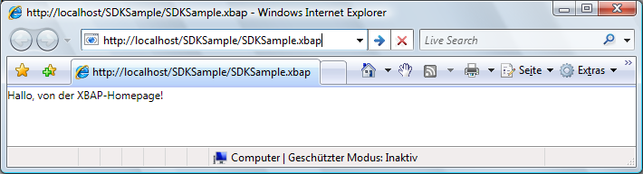  
  
> [!NOTE]
>  Weitere Informationen zu Entwicklung und Bereitstellung von [!INCLUDE[TLA2#tla_xbap#plural](../../../../includes/tla2sharptla-xbapsharpplural-md.md)] finden Sie [Übersicht über WPF\-XAML\-Browseranwendungen](../../../../docs/framework/wpf/app-development/wpf-xaml-browser-applications-overview.md) unter [Bereitstellen von WPF\-Anwendungen](../../../../docs/framework/wpf/app-development/deploying-a-wpf-application-wpf.md).  
  
   
### Konfigurieren von Titel, Breite und Höhe des Hostfensters  
 In der vorherigen Abbildung ist Ihnen möglicherweise aufgefallen, dass der Titel sowohl des Browsers als auch des Registerkartenbereichs dem [!INCLUDE[TLA2#tla_uri](../../../../includes/tla2sharptla-uri-md.md)] für eine [!INCLUDE[TLA2#tla_xbap](../../../../includes/tla2sharptla-xbap-md.md)] entspricht.  Der Titel ist zum einen lang und zum anderen weder ansprechend noch informativ.  Daher bietet <xref:System.Windows.Controls.Page> eine Möglichkeit zum Ändern des Titels, indem die <xref:System.Windows.Controls.Page.WindowTitle%2A>\-Eigenschaft festgelegt wird.  Darüber hinaus können Sie die Breite und Höhe des Browserfensters durch Festlegen von <xref:System.Windows.Controls.Page.WindowWidth%2A> bzw. <xref:System.Windows.Controls.Page.WindowHeight%2A> konfigurieren.  
  
 <xref:System.Windows.Controls.Page.WindowTitle%2A>, <xref:System.Windows.Controls.Page.WindowWidth%2A> und <xref:System.Windows.Controls.Page.WindowHeight%2A> können deklarativ in Markup festgelegt werden, wie im folgenden Beispiel veranschaulicht.  
  
 [!code-xml[NavigationOverviewSnippets#HomePageMARKUP](../../../../samples/snippets/csharp/VS_Snippets_Wpf/NavigationOverviewSnippets/CSharp/HomePage.xaml#homepagemarkup)]  
  
 Das Ergebnis wird in der folgenden Abbildung dargestellt.  
  
   
  
   
### Linknavigation  
 Eine typische [!INCLUDE[TLA2#tla_xbap](../../../../includes/tla2sharptla-xbap-md.md)] umfasst mehrere Seiten.  Mithilfe von <xref:System.Windows.Documents.Hyperlink> kann am einfachsten von einer Seite zur nächsten navigiert werden.  Sie können einer <xref:System.Windows.Controls.Page> einen <xref:System.Windows.Documents.Hyperlink> deklarativ hinzufügen, indem Sie das `Hyperlink`\-Element verwenden, das im folgenden Markup veranschaulicht wird.  
  
 [!code-xml[NavigationOverviewSnippets#HyperlinkXAML1](../../../../samples/snippets/csharp/VS_Snippets_Wpf/NavigationOverviewSnippets/CSharp/PageWithHyperlink.xaml#hyperlinkxaml1)]  
[!code-xml[NavigationOverviewSnippets#HyperlinkXAML2](../../../../samples/snippets/csharp/VS_Snippets_Wpf/NavigationOverviewSnippets/CSharp/PageWithHyperlink.xaml#hyperlinkxaml2)]  
[!code-xml[NavigationOverviewSnippets#HyperlinkXAML3](../../../../samples/snippets/csharp/VS_Snippets_Wpf/NavigationOverviewSnippets/CSharp/PageWithHyperlink.xaml#hyperlinkxaml3)]  
  
 Für ein `Hyperlink`\-Element benötigen Sie Folgendes:  
  
-   Den Paket\-[!INCLUDE[TLA2#tla_uri](../../../../includes/tla2sharptla-uri-md.md)] der <xref:System.Windows.Controls.Page>, zu der Sie navigieren, wie vom `NavigateUri`\-Attribut angegeben.  
  
-   Inhalt, auf den ein Benutzer zum Einleiten der Navigation klicken kann, z. B. Text und Bilder \(Informationen zum Inhalt, den das `Hyperlink`\-Element enthalten kann, finden Sie unter <xref:System.Windows.Documents.Hyperlink>\).  
  
 In der folgenden Abbildung wird eine [!INCLUDE[TLA2#tla_xbap](../../../../includes/tla2sharptla-xbap-md.md)] mit <xref:System.Windows.Controls.Page> dargestellt, die einen <xref:System.Windows.Documents.Hyperlink> besitzt.  
  
 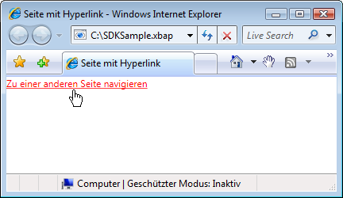  
  
 Erwartungsgemäß verursacht das Klicken auf <xref:System.Windows.Documents.Hyperlink>, dass eine [!INCLUDE[TLA2#tla_xbap](../../../../includes/tla2sharptla-xbap-md.md)] zu <xref:System.Windows.Controls.Page> navigiert, die durch das `NavigateUri`\-Attribut identifiziert wird.  Darüber hinaus fügt [!INCLUDE[TLA2#tla_xbap](../../../../includes/tla2sharptla-xbap-md.md)] der Liste Zuletzt besuchte Seiten in [!INCLUDE[TLA2#tla_ie](../../../../includes/tla2sharptla-ie-md.md)] einen Eintrag für die vorherige <xref:System.Windows.Controls.Page> hinzu.  Das wird in der folgenden Abbildung gezeigt.  
  
 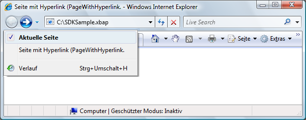  
  
 Genauso wie das Unterstützen der Navigation von einer <xref:System.Windows.Controls.Page> zur anderen, unterstützt <xref:System.Windows.Documents.Hyperlink> auch Fragmentnavigation.  
  
   
### Fragmentnavigation  
 *Fragmentnavigation* beschreibt die Navigation zu einem Inhaltsfragment entweder in der aktuellen <xref:System.Windows.Controls.Page> oder in einer anderen <xref:System.Windows.Controls.Page>.  In [!INCLUDE[TLA2#tla_wpf](../../../../includes/tla2sharptla-wpf-md.md)] entspricht ein Inhaltsfragment dem Inhalt, der im benannten Element enthalten ist.  Ein benanntes Element ist ein Element, dessen `Name`\-Attribut festgelegt wurde.  Im folgenden Markup wird ein benanntes `TextBlock`\-Element gezeigt, das ein Inhaltsfragment enthält.  
  
 [!code-xml[NavigationOverviewSnippets#PageWithContentFragmentsMARKUP1](../../../../samples/snippets/csharp/VS_Snippets_Wpf/NavigationOverviewSnippets/CSharp/PageWithFragments.xaml#pagewithcontentfragmentsmarkup1)]  
[!code-xml[NavigationOverviewSnippets#PageWithContentFragmentsMARKUP2](../../../../samples/snippets/csharp/VS_Snippets_Wpf/NavigationOverviewSnippets/CSharp/PageWithFragments.xaml#pagewithcontentfragmentsmarkup2)]  
[!code-xml[NavigationOverviewSnippets#PageWithContentFragmentsMARKUP3](../../../../samples/snippets/csharp/VS_Snippets_Wpf/NavigationOverviewSnippets/CSharp/PageWithFragments.xaml#pagewithcontentfragmentsmarkup3)]  
  
 Damit ein <xref:System.Windows.Documents.Hyperlink> zu einem Inhaltsfragment navigiert, muss das `NavigateUri`\-Attribut Folgendes einschließen:  
  
-   Den [!INCLUDE[TLA2#tla_uri](../../../../includes/tla2sharptla-uri-md.md)] von <xref:System.Windows.Controls.Page> mit dem Inhaltsfragment, zu dem navigiert werden soll.  
  
-   Ein "\#"\-Zeichen  
  
-   Den Namen des Elements für die <xref:System.Windows.Controls.Page>, die das Inhaltsfragment enthält.  
  
 Ein Fragment\-[!INCLUDE[TLA2#tla_uri](../../../../includes/tla2sharptla-uri-md.md)] hat das folgende Format.  
  
 *SeitenURI* `#` *Elementname*  
  
 Im Folgenden finden Sie ein Beispiel für einen `Hyperlink`, der für die Navigation zu einem Inhaltsfragment konfiguriert ist.  
  
 [!code-xml[NavigationOverviewSnippets#PageThatNavigatesXAML1](../../../../samples/snippets/csharp/VS_Snippets_Wpf/NavigationOverviewSnippets/CSharp/PageThatNavigatesToFragment.xaml#pagethatnavigatesxaml1)]  
[!code-xml[NavigationOverviewSnippets#PageThatNavigatesXAML2](../../../../samples/snippets/csharp/VS_Snippets_Wpf/NavigationOverviewSnippets/CSharp/PageThatNavigatesToFragment.xaml#pagethatnavigatesxaml2)]  
[!code-xml[NavigationOverviewSnippets#PageThatNavigatesXAML3](../../../../samples/snippets/csharp/VS_Snippets_Wpf/NavigationOverviewSnippets/CSharp/PageThatNavigatesToFragment.xaml#pagethatnavigatesxaml3)]  
  
> [!NOTE]
>  In diesem Abschnitt wird die standardmäßige Implementierung der Fragmentnavigation in [!INCLUDE[TLA2#tla_wpf](../../../../includes/tla2sharptla-wpf-md.md)] beschrieben.  Mit [!INCLUDE[TLA2#tla_wpf](../../../../includes/tla2sharptla-wpf-md.md)] können Sie Ihr eigenes Fragmentnavigationsschema implementieren, das teilweise die Behandlung des <xref:System.Windows.Navigation.NavigationService.FragmentNavigation?displayProperty=fullName>\-Ereignisses erfordert.  
  
> [!IMPORTANT]
>  Zu Fragmenten in Loose [!INCLUDE[TLA2#tla_xaml](../../../../includes/tla2sharptla-xaml-md.md)]\-Seiten \(Markup\-[!INCLUDE[TLA2#tla_xaml](../../../../includes/tla2sharptla-xaml-md.md)]\-Dateien mit `Page` als Stammelement\) können Sie nur dann navigieren, wenn die Seiten über [!INCLUDE[TLA2#tla_http](../../../../includes/tla2sharptla-http-md.md)] gesucht werden können.  
>   
>  Das Navigieren zu den eigenen Fragmenten ist für eine Loose [!INCLUDE[TLA2#tla_xaml](../../../../includes/tla2sharptla-xaml-md.md)]\-Seite jedoch möglich.  
  
   
### Navigationsdienst  
 Mit <xref:System.Windows.Documents.Hyperlink> kann ein Benutzer die Navigation zu einer bestimmten <xref:System.Windows.Controls.Page> initiieren. Das Suchen und Herunterladen der Seite wird durch die <xref:System.Windows.Navigation.NavigationService>\-Klasse ausgeführt.  Im Wesentlichen ermöglicht <xref:System.Windows.Navigation.NavigationService> die Verarbeitung einer Navigationsanforderung im Namen eine Clientcodes, z. B. <xref:System.Windows.Documents.Hyperlink>.  Darüber hinaus implementiert <xref:System.Windows.Navigation.NavigationService> Unterstützung auf höherer Ebene zum Nachverfolgen und Beeinflussen einer Navigationsanforderung.  
  
 Wenn Sie auf <xref:System.Windows.Documents.Hyperlink> klicken, ruft [!INCLUDE[TLA2#tla_wpf](../../../../includes/tla2sharptla-wpf-md.md)] den <xref:System.Windows.Navigation.NavigationService.Navigate%2A?displayProperty=fullName> auf, um <xref:System.Windows.Controls.Page> unter dem angegebenen Paket\-[!INCLUDE[TLA2#tla_uri](../../../../includes/tla2sharptla-uri-md.md)] zu suchen und herunterzuladen.  Die heruntergeladene <xref:System.Windows.Controls.Page> wird in eine Struktur von Objekten konvertiert, deren Stammobjekt eine Instanz der heruntergeladenen <xref:System.Windows.Controls.Page> ist.  Ein Verweis auf das <xref:System.Windows.Controls.Page>\-Stammobjekt wird in der <xref:System.Windows.Navigation.NavigationService.Content%2A?displayProperty=fullName>\-Eigenschaft gespeichert.  Der Paket\-[!INCLUDE[TLA2#tla_uri](../../../../includes/tla2sharptla-uri-md.md)] für den Inhalt, zu dem Sie navigiert sind, ist in der <xref:System.Windows.Navigation.NavigationService.Source%2A?displayProperty=fullName>\-Eigenschaft gespeichert. Dagegen speichert <xref:System.Windows.Navigation.NavigationService.CurrentSource%2A?displayProperty=fullName> den Paket\-[!INCLUDE[TLA2#tla_uri](../../../../includes/tla2sharptla-uri-md.md)] für die letzte Seite, zu der navigiert wurde.  
  
> [!NOTE]
>  Eine [!INCLUDE[TLA2#tla_wpf](../../../../includes/tla2sharptla-wpf-md.md)]\-Anwendung kann mehrere derzeit aktive <xref:System.Windows.Navigation.NavigationService>\-Elemente haben.  Weitere Informationen finden Sie unter [Navigationshosts](#Navigation_Hosts) weiter unten in diesem Thema.  
  
   
### Programmgesteuerte Navigation mit dem Navigationsdienst  
 Sie müssen nichts über <xref:System.Windows.Navigation.NavigationService> wissen, wenn die Navigation durch <xref:System.Windows.Documents.Hyperlink> deklarativ im Markup implementiert wird, da <xref:System.Windows.Documents.Hyperlink> in Ihrem Namen <xref:System.Windows.Navigation.NavigationService> verwendet.  Dies bedeutet, dass <xref:System.Windows.Documents.Hyperlink> den Navigationsdienst des Navigationshosts finden und verwenden kann, um eine Navigationsanforderung zu verarbeiten, solange entweder das direkte oder das indirekte übergeordnete Element von <xref:System.Windows.Documents.Hyperlink> ein Navigationshost ist \(siehe [Navigationshosts](#Navigation_Hosts)\).  
  
 Es treten allerdings Situationen auf, in denen Sie <xref:System.Windows.Navigation.NavigationService> direkt verwenden müssen, darunter die folgenden:  
  
-   Wenn Sie <xref:System.Windows.Controls.Page> unter Verwendung eines nicht standardmäßigen Konstruktors instanziieren müssen.  
  
-   Wenn Sie Eigenschaften auf <xref:System.Windows.Controls.Page> festlegen müssen, bevor Sie dorthin navigieren.  
  
-   Wenn die <xref:System.Windows.Controls.Page>, zu der navigiert werden muss, nur zur Laufzeit bestimmt werden kann.  
  
 In diesen Fällen müssen Sie Code schreiben, um die Navigation programmgesteuert zu initiieren, indem Sie die <xref:System.Windows.Navigation.NavigationService.Navigate%2A>\-Methode des <xref:System.Windows.Navigation.NavigationService>\-Objekts aufrufen.  Dies macht das Abrufen eines Verweises auf <xref:System.Windows.Navigation.NavigationService> erforderlich.  
  
#### Abrufen eines Verweises auf NavigationService  
 Aus den im Abschnitt [Navigationshosts](#Navigation_Hosts) genannten Gründen kann eine [!INCLUDE[TLA2#tla_wpf](../../../../includes/tla2sharptla-wpf-md.md)]\-Anwendung mehrere <xref:System.Windows.Navigation.NavigationService>\-Elemente haben.  Daher muss Ihr Code in der Lage sein, nach einem <xref:System.Windows.Navigation.NavigationService> zu suchen. In der Regel handelt es sich dabei um den <xref:System.Windows.Navigation.NavigationService>, der zur aktuellen <xref:System.Windows.Controls.Page> navigiert ist. Sie können einen Verweis auf einen <xref:System.Windows.Navigation.NavigationService> abrufen, indem Sie die `static` <xref:System.Windows.Navigation.NavigationService.GetNavigationService%2A?displayProperty=fullName>\-Methode aufrufen.  Zum Abrufen von <xref:System.Windows.Navigation.NavigationService>, der zu einer bestimmten <xref:System.Windows.Controls.Page> navigiert ist, übergeben Sie einen Verweis auf <xref:System.Windows.Controls.Page> als Argument der <xref:System.Windows.Navigation.NavigationService.GetNavigationService%2A>\-Methode.  Im folgenden Code wird das Abrufen von <xref:System.Windows.Navigation.NavigationService> für die aktuelle <xref:System.Windows.Controls.Page> dargestellt.  
  
 [!code-csharp[NavigationOverviewSnippets#GetNSCODEBEHIND1](../../../../samples/snippets/csharp/VS_Snippets_Wpf/NavigationOverviewSnippets/CSharp/GetNSPage.xaml.cs#getnscodebehind1)]  
[!code-csharp[NavigationOverviewSnippets#GetNSCODEBEHIND2](../../../../samples/snippets/csharp/VS_Snippets_Wpf/NavigationOverviewSnippets/CSharp/GetNSPage.xaml.cs#getnscodebehind2)]
[!code-vb[NavigationOverviewSnippets#GetNSCODEBEHIND2](../../../../samples/snippets/visualbasic/VS_Snippets_Wpf/NavigationOverviewSnippets/VisualBasic/GetNSPage.xaml.vb#getnscodebehind2)]  
  
 Als Arbeitserleichterung zum Suchen von <xref:System.Windows.Navigation.NavigationService> für <xref:System.Windows.Controls.Page> implementiert <xref:System.Windows.Controls.Page> die <xref:System.Windows.Controls.Page.NavigationService%2A>\-Eigenschaft.  Dies wird im folgenden Beispiel gezeigt.  
  
 [!code-csharp[NavigationOverviewSnippets#GetNSShortcutCODEBEHIND1](../../../../samples/snippets/csharp/VS_Snippets_Wpf/NavigationOverviewSnippets/CSharp/GetNSPageShortCut.xaml.cs#getnsshortcutcodebehind1)]  
[!code-csharp[NavigationOverviewSnippets#GetNSShortcutCODEBEHIND2](../../../../samples/snippets/csharp/VS_Snippets_Wpf/NavigationOverviewSnippets/CSharp/GetNSPageShortCut.xaml.cs#getnsshortcutcodebehind2)]
[!code-vb[NavigationOverviewSnippets#GetNSShortcutCODEBEHIND2](../../../../samples/snippets/visualbasic/VS_Snippets_Wpf/NavigationOverviewSnippets/VisualBasic/GetNSPageShortCut.xaml.vb#getnsshortcutcodebehind2)]  
  
> [!NOTE]
>  Eine <xref:System.Windows.Controls.Page> kann einen Verweis auf <xref:System.Windows.Navigation.NavigationService> nur dann abrufen, wenn <xref:System.Windows.Controls.Page> das <xref:System.Windows.FrameworkElement.Loaded>\-Ereignis auslöst.  
  
#### Programmgesteuerte Navigation zu einem Seitenobjekt  
 Im folgenden Beispiel wird die Verwendung von <xref:System.Windows.Navigation.NavigationService> zur programmgesteuerten Navigation zu <xref:System.Windows.Controls.Page> veranschaulicht.  Programmgesteuerte Navigation wird benötigt, da die <xref:System.Windows.Controls.Page>, zu der navigiert wird, nur über einen einzelnen, nicht standardmäßigen Konstruktor instanziiert werden kann.  Die <xref:System.Windows.Controls.Page> mit dem nicht standardmäßigen Konstruktor wird im folgenden Markup und Code gezeigt.  
  
 [!code-xml[NavigationOverviewSnippets#PageWithNonDefaultConstructorXAML](../../../../samples/snippets/csharp/VS_Snippets_Wpf/NavigationOverviewSnippets/CSharp/PageWithNonDefaultConstructor.xaml#pagewithnondefaultconstructorxaml)]  
  
 [!code-csharp[NavigationOverviewSnippets#PageWithNonDefaultConstructorCODEBEHIND](../../../../samples/snippets/csharp/VS_Snippets_Wpf/NavigationOverviewSnippets/CSharp/PageWithNonDefaultConstructor.xaml.cs#pagewithnondefaultconstructorcodebehind)]
 [!code-vb[NavigationOverviewSnippets#PageWithNonDefaultConstructorCODEBEHIND](../../../../samples/snippets/visualbasic/VS_Snippets_Wpf/NavigationOverviewSnippets/VisualBasic/PageWithNonDefaultConstructor.xaml.vb#pagewithnondefaultconstructorcodebehind)]  
  
 Die <xref:System.Windows.Controls.Page>, die zu <xref:System.Windows.Controls.Page> mit dem nicht standardmäßigen Konstruktor navigiert, wird im folgenden Markup und Code gezeigt.  
  
 [!code-xml[NavigationOverviewSnippets#NSNavigationPageXAML](../../../../samples/snippets/csharp/VS_Snippets_Wpf/NavigationOverviewSnippets/CSharp/NSNavigationPage.xaml#nsnavigationpagexaml)]  
  
 [!code-csharp[NavigationOverviewSnippets#NSNavigationPageCODEBEHIND](../../../../samples/snippets/csharp/VS_Snippets_Wpf/NavigationOverviewSnippets/CSharp/NSNavigationPage.xaml.cs#nsnavigationpagecodebehind)]
 [!code-vb[NavigationOverviewSnippets#NSNavigationPageCODEBEHIND](../../../../samples/snippets/visualbasic/VS_Snippets_Wpf/NavigationOverviewSnippets/VisualBasic/NSNavigationPage.xaml.vb#nsnavigationpagecodebehind)]  
  
 Wenn auf dieser <xref:System.Windows.Controls.Page> auf <xref:System.Windows.Documents.Hyperlink> geklickt wird, wird die Navigation durch Instanziieren der <xref:System.Windows.Controls.Page> eingeleitet, zu der navigiert wird, indem der nicht standardmäßige Konstruktor verwendet und die <xref:System.Windows.Navigation.NavigationService.Navigate%2A?displayProperty=fullName>\-Methode aufgerufen wird.  <xref:System.Windows.Navigation.NavigationService.Navigate%2A> akzeptiert einen Verweis auf das Objekt, zu dem <xref:System.Windows.Navigation.NavigationService> navigiert, jedoch keinen Paket\-[!INCLUDE[TLA2#tla_uri](../../../../includes/tla2sharptla-uri-md.md)].  
  
#### Programmgesteuerte Navigation mit einem Paket\-URI  
 Wenn Sie einen Paket\-[!INCLUDE[TLA2#tla_uri](../../../../includes/tla2sharptla-uri-md.md)] programmgesteuert erstellen müssen \(falls der Paket\-[!INCLUDE[TLA2#tla_uri](../../../../includes/tla2sharptla-uri-md.md)] beispielsweise nur zur Laufzeit bestimmt werden kann\), können Sie die <xref:System.Windows.Navigation.NavigationService.Navigate%2A?displayProperty=fullName>\-Methode verwenden.  Dies wird im folgenden Beispiel gezeigt.  
  
 [!code-xml[NavigationOverviewSnippets#NSUriNavigationPageXAML](../../../../samples/snippets/csharp/VS_Snippets_Wpf/NavigationOverviewSnippets/CSharp/NSUriNavigationPage.xaml#nsurinavigationpagexaml)]  
  
 [!code-csharp[NavigationOverviewSnippets#NSUriNavigationPageCODEBEHIND](../../../../samples/snippets/csharp/VS_Snippets_Wpf/NavigationOverviewSnippets/CSharp/NSUriNavigationPage.xaml.cs#nsurinavigationpagecodebehind)]
 [!code-vb[NavigationOverviewSnippets#NSUriNavigationPageCODEBEHIND](../../../../samples/snippets/visualbasic/VS_Snippets_Wpf/NavigationOverviewSnippets/VisualBasic/NSUriNavigationPage.xaml.vb#nsurinavigationpagecodebehind)]  
  
#### Aktualisieren der aktuellen Seite  
 Eine <xref:System.Windows.Controls.Page> wird nicht heruntergeladen, wenn sie denselben Paket\-[!INCLUDE[TLA2#tla_uri](../../../../includes/tla2sharptla-uri-md.md)] besitzt wie der Paket\-[!INCLUDE[TLA2#tla_uri](../../../../includes/tla2sharptla-uri-md.md)], der in der <xref:System.Windows.Navigation.NavigationService.Source%2A?displayProperty=fullName>\-Eigenschaft gespeichert wird.  Wenn Sie erzwingen möchten, dass [!INCLUDE[TLA2#tla_wpf](../../../../includes/tla2sharptla-wpf-md.md)] die aktuelle Seite erneut herunterlädt, können Sie die <xref:System.Windows.Navigation.NavigationService.Refresh%2A?displayProperty=fullName>\-Methode aufrufen, wie im folgenden Beispiel dargestellt.  
  
 [!code-xml[NavigationOverviewSnippets#NSRefreshNavigationPageXAML1](../../../../samples/snippets/csharp/VS_Snippets_Wpf/NavigationOverviewSnippets/CSharp/NSRefreshNavigationPage.xaml#nsrefreshnavigationpagexaml1)]  
  
 [!code-csharp[NavigationOverviewSnippets#NSRefreshNavigationPageCODEBEHIND1](../../../../samples/snippets/csharp/VS_Snippets_Wpf/NavigationOverviewSnippets/CSharp/NSRefreshNavigationPage.xaml.cs#nsrefreshnavigationpagecodebehind1)]
 [!code-vb[NavigationOverviewSnippets#NSRefreshNavigationPageCODEBEHIND1](../../../../samples/snippets/visualbasic/VS_Snippets_Wpf/NavigationOverviewSnippets/VisualBasic/NSRefreshNavigationPage.xaml.vb#nsrefreshnavigationpagecodebehind1)]  
[!code-csharp[NavigationOverviewSnippets#NSRefreshNavigationPageCODEBEHIND2](../../../../samples/snippets/csharp/VS_Snippets_Wpf/NavigationOverviewSnippets/CSharp/NSRefreshNavigationPage.xaml.cs#nsrefreshnavigationpagecodebehind2)]
[!code-vb[NavigationOverviewSnippets#NSRefreshNavigationPageCODEBEHIND2](../../../../samples/snippets/visualbasic/VS_Snippets_Wpf/NavigationOverviewSnippets/VisualBasic/NSRefreshNavigationPage.xaml.vb#nsrefreshnavigationpagecodebehind2)]  
  
   
### Navigationslebensdauer  
 Wie Sie sehen, gibt es viele Möglichkeiten zum Einleiten der Navigation.  Nachdem die Navigation initiiert wurde und während sie ausgeführt wird, können Sie die Navigation mit den folgenden Ereignissen, die von <xref:System.Windows.Navigation.NavigationService> implementiert werden, nachverfolgen und beeinflussen:  
  
-   <xref:System.Windows.Navigation.NavigationService.Navigating>.  Tritt ein, wenn eine neue Navigation angefordert wird.  Kann zum Abbrechen der Navigation verwendet werden.  
  
-   <xref:System.Windows.Navigation.NavigationService.NavigationProgress>.  Tritt während eines Downloads regelmäßig ein, um Informationen zum Navigationsfortschritt bereitzustellen.  
  
-   <xref:System.Windows.Navigation.NavigationService.Navigated>.  Tritt ein, nachdem die Seite gefunden und heruntergeladen wurde.  
  
-   <xref:System.Windows.Navigation.NavigationService.NavigationStopped>.  Tritt ein, nachdem die Navigation \(durch Aufrufen von <xref:System.Windows.Navigation.NavigationService.StopLoading%2A>\) angehalten wurde oder wenn eine neue Navigation angefordert wird, während die aktuelle Navigation noch ausgeführt wird.  
  
-   <xref:System.Windows.Navigation.NavigationService.NavigationFailed>.  Tritt ein, wenn ein Fehler ausgelöst wird, während zum angeforderten Inhalt navigiert wird.  
  
-   <xref:System.Windows.Navigation.NavigationService.LoadCompleted>.  Tritt ein, wenn der Inhalt, zu dem navigiert wurde, geladen und analysiert wird und mit dem Rendering begonnen wurde.  
  
-   <xref:System.Windows.Navigation.NavigationService.FragmentNavigation>.  Tritt ein, wenn die Navigation zu einem Inhaltsfragment beginnt, was in folgenden Fällen geschieht:  
  
    -   Sofort, falls sich das gewünschte Fragment im aktuellen Inhalt befindet.  
  
    -   Nachdem der Inhalt der Quelldatei geladen wurde und sich das gewünschte Fragment in einem anderen Inhalt befindet.  
  
 Die Navigationsereignisse werden in der Reihenfolge ausgelöst, die in der folgenden Abbildung dargestellt wird.  
  
 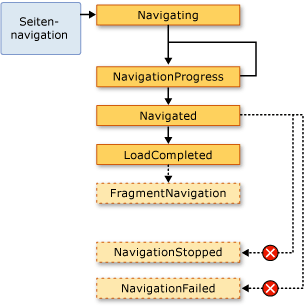  
  
 Im Allgemeinen befasst sich <xref:System.Windows.Controls.Page> nicht mit diesen Ereignissen.  Es ist viel wahrscheinlicher, dass sich eine Anwendung mit ihnen befasst. Aus diesem Grund werden diese Ereignisse ebenfalls von der <xref:System.Windows.Application>\-Klasse ausgelöst:  
  
-   <xref:System.Windows.Application.Navigating?displayProperty=fullName>  
  
-   <xref:System.Windows.Application.NavigationProgress?displayProperty=fullName>  
  
-   <xref:System.Windows.Application.Navigated?displayProperty=fullName>  
  
-   <xref:System.Windows.Application.NavigationFailed?displayProperty=fullName>  
  
-   <xref:System.Windows.Application.NavigationStopped?displayProperty=fullName>  
  
-   <xref:System.Windows.Application.LoadCompleted?displayProperty=fullName>  
  
-   <xref:System.Windows.Application.FragmentNavigation?displayProperty=fullName>  
  
 Jedes Mal, wenn <xref:System.Windows.Navigation.NavigationService> ein Ereignis auslöst, löst die <xref:System.Windows.Application>\-Klasse das entsprechende Ereignis aus.  <xref:System.Windows.Controls.Frame> und <xref:System.Windows.Navigation.NavigationWindow> bieten dieselben Ereignisse, mit denen Navigation in ihren jeweiligen Gültigkeitsbereichen erkannt wird.  
  
 In einigen Fällen könnten diese Ereignisse für <xref:System.Windows.Controls.Page> von Interesse sein.  Eine <xref:System.Windows.Controls.Page> könnte beispielsweise das <xref:System.Windows.Navigation.NavigationService.Navigating?displayProperty=fullName>\-Ereignis verarbeiten, um zu bestimmen, ob die Navigation von der Seite weg abgebrochen werden soll.  Dies wird im folgenden Beispiel gezeigt.  
  
 [!code-xml[NavigationOverviewSnippets#CancelNavigationPageXAML](../../../../samples/snippets/csharp/VS_Snippets_Wpf/NavigationOverviewSnippets/CSharp/CancelNavigationPage.xaml#cancelnavigationpagexaml)]  
  
 [!code-csharp[NavigationOverviewSnippets#CancelNavigationPageCODEBEHIND](../../../../samples/snippets/csharp/VS_Snippets_Wpf/NavigationOverviewSnippets/CSharp/CancelNavigationPage.xaml.cs#cancelnavigationpagecodebehind)]
 [!code-vb[NavigationOverviewSnippets#CancelNavigationPageCODEBEHIND](../../../../samples/snippets/visualbasic/VS_Snippets_Wpf/NavigationOverviewSnippets/VisualBasic/CancelNavigationPage.xaml.vb#cancelnavigationpagecodebehind)]  
  
 Wenn Sie einen Handler für ein Navigationsereignis aus <xref:System.Windows.Controls.Page> registrieren \(siehe vorheriges Beispiel\), dann müssen Sie auch die Registrierung des Ereignishandlers aufheben.  Wenn Sie das versäumen, kann das Nebeneffekte im Hinblick darauf auslösen, wie die [!INCLUDE[TLA2#tla_wpf](../../../../includes/tla2sharptla-wpf-md.md)]\-Navigation die <xref:System.Windows.Controls.Page>\-Navigation mithilfe des Journals speichert.  
  
   
### Aufzeichnung der Navigation mithilfe des Journals  
 [!INCLUDE[TLA2#tla_wpf](../../../../includes/tla2sharptla-wpf-md.md)] verwendet zwei Stapel, um die Seiten zu speichern, von denen Sie weg navigiert sind: jeweils einen Stapel für die Rückwärts\- und einen Stapel für die Vorwärtsnavigation.  Wenn Sie von der aktuellen <xref:System.Windows.Controls.Page> zu einer neuen <xref:System.Windows.Controls.Page> oder vorwärts zu einer vorhandenen <xref:System.Windows.Controls.Page> navigieren, wird dem *Rückwärtsstapel* die aktuelle <xref:System.Windows.Controls.Page> hinzugefügt.  Wenn Sie von der aktuellen <xref:System.Windows.Controls.Page> zurück zur vorherigen <xref:System.Windows.Controls.Page> navigieren, wird dem *Vorwärtsstapel* die aktuelle <xref:System.Windows.Controls.Page> hinzugefügt.  Der Rückwärts\- und der Vorwärtsstapel sowie die Funktion zum Verwalten der Stapel werden zusammen als das Journal bezeichnet.  Jedes Element in den beiden Stapeln stellt eine Instanz der <xref:System.Windows.Navigation.JournalEntry>\-Klasse dar und wird als *Journaleintrag* bezeichnet.  
  
#### Navigieren im Journal in Internet Explorer  
 Prinzipiell funktioniert das Journal auf dieselbe Weise wie die Schaltflächen **Zurück** und **Vorwärts** in [!INCLUDE[TLA2#tla_ie](../../../../includes/tla2sharptla-ie-md.md)].  Diese sind in der folgenden Abbildung dargestellt.  
  
   
  
 Bei [!INCLUDE[TLA2#tla_xbap#plural](../../../../includes/tla2sharptla-xbapsharpplural-md.md)], die von [!INCLUDE[TLA2#tla_ie](../../../../includes/tla2sharptla-ie-md.md)] gehostet werden, integriert [!INCLUDE[TLA2#tla_wpf](../../../../includes/tla2sharptla-wpf-md.md)] das Journal in die Navigations\-[!INCLUDE[TLA2#tla_ui](../../../../includes/tla2sharptla-ui-md.md)] von [!INCLUDE[TLA2#tla_ie](../../../../includes/tla2sharptla-ie-md.md)].  Auf diese Weise können Benutzer zu Seiten in einer [!INCLUDE[TLA2#tla_xbap](../../../../includes/tla2sharptla-xbap-md.md)] navigieren, indem sie die Schaltflächen **Zurück**, **Vorwärts** und **Zuletzt besuchte Seiten** in [!INCLUDE[TLA2#tla_ie](../../../../includes/tla2sharptla-ie-md.md)] verwenden. Das Journal wird in [!INCLUDE[TLA2#tla_ie6](../../../../includes/tla2sharptla-ie6-md.md)] nicht auf dieselbe Weise integriert wie in [!INCLUDE[TLA2#tla_ie7](../../../../includes/tla2sharptla-ie7-md.md)] oder Internet Explorer 8.  Stattdessen rendert [!INCLUDE[TLA2#tla_wpf](../../../../includes/tla2sharptla-wpf-md.md)] eine Ersatznavigations\-[!INCLUDE[TLA2#tla_ui](../../../../includes/tla2sharptla-ui-md.md)].  
  
> [!IMPORTANT]
>  Wenn ein Benutzer in [!INCLUDE[TLA2#tla_ie](../../../../includes/tla2sharptla-ie-md.md)] von [!INCLUDE[TLA2#tla_xbap](../../../../includes/tla2sharptla-xbap-md.md)] weg und wieder dorthin zurück navigiert, werden nur die Journaleinträge für Seiten, die nicht aktiv beibehalten wurden, im Journal beibehalten.  Eine Erklärung, wie Sie Seiten beibehalten, finden Sie unter [Seitenlebensdauer und das Journal](#PageLifetime) weiter unten in diesem Thema.  
  
 Standardmäßig entspricht der Text für jede <xref:System.Windows.Controls.Page>, die in der Liste **Zuletzt besuchte Seiten** von [!INCLUDE[TLA2#tla_ie](../../../../includes/tla2sharptla-ie-md.md)] angezeigt wird, dem [!INCLUDE[TLA2#tla_uri](../../../../includes/tla2sharptla-uri-md.md)] für <xref:System.Windows.Controls.Page>.  In vielen Fällen ist das für den Benutzer nicht besonders sinnvoll.  Sie können den Text jedoch mithilfe einer der folgenden Optionen ändern:  
  
1.  Dem angefügten `JournalEntry.Name`\-Attributwert  
  
2.  Dem `Page.Title`\-Attributwert  
  
3.  Dem `Page.WindowTitle`\-Attributwert und dem [!INCLUDE[TLA2#tla_uri](../../../../includes/tla2sharptla-uri-md.md)] für die aktuelle <xref:System.Windows.Controls.Page>  
  
4.  Dem [!INCLUDE[TLA2#tla_uri](../../../../includes/tla2sharptla-uri-md.md)] für die aktuelle <xref:System.Windows.Controls.Page>.  \(Standard\)  
  
 Die Reihenfolge, in der die Optionen aufgeführt sind, entspricht der Rangfolge zum Suchen von Text.  Wenn `JournalEntry.Name` festgelegt wurde, werden die anderen Werte beispielsweise ignoriert.  
  
 Im folgenden Beispiel wird das `Page.Title`\-Attribut verwendet, um den Text zu ändern, der für einen Journaleintrag angezeigt wird.  
  
 [!code-xml[NavigationOverviewSnippets#PageTitleMARKUP1](../../../../samples/snippets/csharp/VS_Snippets_Wpf/NavigationOverviewSnippets/CSharp/PageWithTitle.xaml#pagetitlemarkup1)]  
[!code-xml[NavigationOverviewSnippets#PageTitleMARKUP2](../../../../samples/snippets/csharp/VS_Snippets_Wpf/NavigationOverviewSnippets/CSharp/PageWithTitle.xaml#pagetitlemarkup2)]  
  
 [!code-csharp[NavigationOverviewSnippets#PageTitleCODEBEHIND1](../../../../samples/snippets/csharp/VS_Snippets_Wpf/NavigationOverviewSnippets/CSharp/PageWithTitle.xaml.cs#pagetitlecodebehind1)]
 [!code-vb[NavigationOverviewSnippets#PageTitleCODEBEHIND1](../../../../samples/snippets/visualbasic/VS_Snippets_Wpf/NavigationOverviewSnippets/VisualBasic/PageWithTitle.xaml.vb#pagetitlecodebehind1)]  
[!code-csharp[NavigationOverviewSnippets#PageTitleCODEBEHIND2](../../../../samples/snippets/csharp/VS_Snippets_Wpf/NavigationOverviewSnippets/CSharp/PageWithTitle.xaml.cs#pagetitlecodebehind2)]
[!code-vb[NavigationOverviewSnippets#PageTitleCODEBEHIND2](../../../../samples/snippets/visualbasic/VS_Snippets_Wpf/NavigationOverviewSnippets/VisualBasic/PageWithTitle.xaml.vb#pagetitlecodebehind2)]  
  
#### Navigieren im Journal mit WPF  
 Obwohl der Benutzer mithilfe der Schaltflächen **Zurück**, **Vorwärts** und **Zuletzt besuchte Seiten** in [!INCLUDE[TLA2#tla_ie](../../../../includes/tla2sharptla-ie-md.md)] im Journal navigieren kann, können Sie auch sowohl mit dem deklarativen als auch mit dem programmgesteuerten Mechanismus von [!INCLUDE[TLA2#tla_wpf](../../../../includes/tla2sharptla-wpf-md.md)] im Journal navigieren.  Ein Grund dafür besteht darin, benutzerdefinierte Navigations\-[!INCLUDE[TLA2#tla_ui#plural](../../../../includes/tla2sharptla-uisharpplural-md.md)] in den Seiten zur Verfügung zu stellen.  
  
 Sie können die Unterstützung der Journalnavigation deklarativ hinzufügen, indem Sie die Navigationsbefehle verwenden, die von <xref:System.Windows.Input.NavigationCommands> verfügbar gemacht werden.  Im folgenden Beispiel wird die Verwendung des `BrowseBack`\-Navigationsbefehls erläutert.  
  
 [!code-xml[NavigationOverviewSnippets#NavigationCommandsPageXAML1](../../../../samples/snippets/csharp/VS_Snippets_Wpf/NavigationOverviewSnippets/CSharp/NavigationCommandsPage.xaml#navigationcommandspagexaml1)]  
[!code-xml[NavigationOverviewSnippets#NavigationCommandsPageXAML2](../../../../samples/snippets/csharp/VS_Snippets_Wpf/NavigationOverviewSnippets/CSharp/NavigationCommandsPage.xaml#navigationcommandspagexaml2)]  
[!code-xml[NavigationOverviewSnippets#NavigationCommandsPageXAML3](../../../../samples/snippets/csharp/VS_Snippets_Wpf/NavigationOverviewSnippets/CSharp/NavigationCommandsPage.xaml#navigationcommandspagexaml3)]  
[!code-xml[NavigationOverviewSnippets#NavigationCommandsPageXAML4](../../../../samples/snippets/csharp/VS_Snippets_Wpf/NavigationOverviewSnippets/CSharp/NavigationCommandsPage.xaml#navigationcommandspagexaml4)]  
  
 Sie können programmgesteuert mit einem der folgenden Member der <xref:System.Windows.Navigation.NavigationService>\-Klasse im Journal navigieren:  
  
-   <xref:System.Windows.Navigation.NavigationService.GoBack%2A>  
  
-   <xref:System.Windows.Navigation.NavigationService.GoForward%2A>  
  
-   <xref:System.Windows.Navigation.NavigationService.CanGoBack%2A>  
  
-   <xref:System.Windows.Navigation.NavigationService.CanGoForward%2A>  
  
 Das Journal kann auch programmgesteuert geändert werden, wie in [Beibehalten des Inhaltszustands über den Navigationsverlauf](#RetainingContentStateWithNavigationHistory) weiter unten in diesem Thema erläutert wird.  
  
   
### Seitenlebensdauer und das Journal  
 Beispiel: Eine [!INCLUDE[TLA2#tla_xbap](../../../../includes/tla2sharptla-xbap-md.md)] mit mehreren Seiten, die umfangreichem Inhalt, einschließlich Grafiken, Animationen und Medien, enthalten.  Die Speicherbeanspruchung für Seiten wie diese könnte recht groß sein, insbesondere, wenn Video\- und Audiomedien verwendet werden.  Wenn das Journal Seiten "speichert", zu denen navigiert wurde, könnte [!INCLUDE[TLA2#tla_xbap](../../../../includes/tla2sharptla-xbap-md.md)] schnell einen beträchtlichen Speicherplatz belegen.  
  
 Aus diesem Grund besteht das Standardverhalten des Journals im Speichern von <xref:System.Windows.Controls.Page>\-Metadaten in jedem Journaleintrag, anstatt auf ein <xref:System.Windows.Controls.Page>\-Objekt zu verweisen.  Wird zu einem Journaleintrag navigiert, werden seine <xref:System.Windows.Controls.Page>\-Metadaten zum Erstellen einer neuen Instanz der angegebenen <xref:System.Windows.Controls.Page> verwendet.  Folglich hat jede <xref:System.Windows.Controls.Page>, zu der navigiert wird, die in der folgenden Abbildung dargestellte Lebensdauer.  
  
 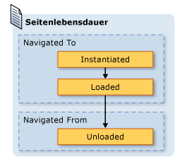  
  
 Obwohl das Standardverhalten des Journals zu einer geringeren Speicherauslastung führen kann, kann die Leistung beim Rendern pro Seite gemindert werden; das erneute Instanziieren von <xref:System.Windows.Controls.Page> kann zeitaufwändig sein, insbesondere bei umfangreichem Inhalt.  Wenn Sie eine <xref:System.Windows.Controls.Page>\-Instanz im Journal beibehalten müssen, können Sie hierzu die folgenden beiden Techniken verwenden.  Navigieren Sie zuerst programmgesteuert zu einem <xref:System.Windows.Controls.Page>\-Objekt, indem Sie die <xref:System.Windows.Navigation.NavigationService.Navigate%2A?displayProperty=fullName>\-Methode aufrufen.  
  
 Als Nächstes können Sie angeben, dass [!INCLUDE[TLA2#tla_wpf](../../../../includes/tla2sharptla-wpf-md.md)] eine Instanz von <xref:System.Windows.Controls.Page> im Journal beibehält, indem die <xref:System.Windows.Controls.Page.KeepAlive%2A>\-Eigenschaft auf `true` \(der Standard ist `false`\) festgelegt wird.  Sie können <xref:System.Windows.Controls.Page.KeepAlive%2A> deklarativ in Markup festlegen, wie im folgenden Beispiel veranschaulicht.  
  
 [!code-xml[NavigationOverviewSnippets#KeepAlivePageXAML](../../../../samples/snippets/csharp/VS_Snippets_Wpf/NavigationOverviewSnippets/CSharp/KeepAlivePage.xaml#keepalivepagexaml)]  
  
 Die Lebensdauer einer aktiv beibehaltenen <xref:System.Windows.Controls.Page> unterscheidet sich nur wenig von einer nicht beibehaltenen Seite.  Beim ersten Navigieren zu einer <xref:System.Windows.Controls.Page>, die aktiv beibehalten wird, wird diese wie eine <xref:System.Windows.Controls.Page> instanziiert, die nicht aktiv beibehalten wird.  Da jedoch eine Instanz von <xref:System.Windows.Controls.Page> im Journal beibehalten wird, wird sie für die Dauer ihrer Aufbewahrung im Journal nicht mehr instanziiert.  Wenn eine <xref:System.Windows.Controls.Page> also eine Initialisierungslogik hat, die bei jedem Navigieren zu <xref:System.Windows.Controls.Page> aufgerufen werden muss, sollten Sie sie aus dem Konstruktor in einen Handler für das <xref:System.Windows.FrameworkElement.Loaded>\-Ereignis verschieben.  Wie in der folgenden Abbildung dargestellt, werden das <xref:System.Windows.FrameworkElement.Loaded>\-Ereignis und das <xref:System.Windows.FrameworkElement.Unloaded>\-Ereignis nach wie vor jedes Mal ausgelöst, wenn zu <xref:System.Windows.Controls.Page> hin und wieder zurücknavigiert wird.  
  
 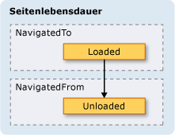  
  
 Wenn <xref:System.Windows.Controls.Page> nicht aktiv beibehalten wird, sollten Sie Folgendes unterlassen:  
  
-   Speichern eines Verweises auf die Seite oder einen Teil der Seite  
  
-   Registrieren von Ereignishandlern für Ereignisse, die nicht von ihr implementiert werden  
  
 Mit jedem dieser Schritte werden Verweise erstellt, die erzwingen, dass <xref:System.Windows.Controls.Page> im Speicher beibehalten wird, nachdem sie aus dem Journal entfernt wurde.  
  
 Im Allgemeinen sollten Sie das Standardverhalten von <xref:System.Windows.Controls.Page> vorziehen, d.h. <xref:System.Windows.Controls.Page> nicht aktiv beibehalten.  Dies zieht jedoch Auswirkungen auf den Zustand nach sich, die im nächsten Abschnitt erörtert werden.  
  
   
### Beibehalten des Inhaltszustands über den Navigationsverlauf  
 Angenommen, <xref:System.Windows.Controls.Page> wird nicht aktiv beibehalten und verfügt über Steuerelemente, die Benutzerdaten erfassen. Wie wirkt es sich auf die Daten aus, wenn ein Benutzer von <xref:System.Windows.Controls.Page> weg und dorthin zurück navigiert?  Aus Gründen der Benutzererfahrung sollte der Benutzer erwarten, dass die zuvor eingegebenen Daten angezeigt werden.  Da mit jeder Navigation eine neue Instanz von <xref:System.Windows.Controls.Page> erstellt wird, werden die Steuerelemente, die die Daten erfasst haben, jedoch neu instanziiert, und die Daten gehen verloren.  
  
 Das Journal unterstützt jedoch das Speichern von Daten über <xref:System.Windows.Controls.Page>\-Navigationen hinweg, einschließlich Steuerelementdaten.  Insbesondere der Journaleintrag für jede <xref:System.Windows.Controls.Page> fungiert als temporärer Container für den zugeordneten <xref:System.Windows.Controls.Page>\-Zustand.  In den folgenden Schritten wird beschrieben, wie diese Unterstützung verwendet wird, wenn von <xref:System.Windows.Controls.Page> weg navigiert wird:  
  
1.  Dem Journal wird ein Eintrag für die aktuelle <xref:System.Windows.Controls.Page> hinzugefügt.  
  
2.  Der Zustand von <xref:System.Windows.Controls.Page> wird im Journaleintrag für diese Seite gespeichert, die dem Rückwärtsstapel hinzugefügt wird.  
  
3.  Es wird zur neuen <xref:System.Windows.Controls.Page> navigiert.  
  
 Wenn zurück zur Seite <xref:System.Windows.Controls.Page> navigiert wird, werden beim Verwenden des Journals die folgenden Schritte ausgeführt:  
  
1.  Die <xref:System.Windows.Controls.Page> \(der oberste Journaleintrag im Rückwärtsstapel\) wird instanziiert.  
  
2.  Die <xref:System.Windows.Controls.Page> wird mit dem Zustand aktualisiert, der mit dem Journaleintrag für <xref:System.Windows.Controls.Page> gespeichert wurde.  
  
3.  Es wird zurück zur neuen <xref:System.Windows.Controls.Page> navigiert.  
  
 [!INCLUDE[TLA2#tla_wpf](../../../../includes/tla2sharptla-wpf-md.md)] verwendet diese Unterstützung automatisch, wenn die folgenden Steuerelemente für <xref:System.Windows.Controls.Page> verwendet werden:  
  
-   <xref:System.Windows.Controls.CheckBox>  
  
-   <xref:System.Windows.Controls.ComboBox>  
  
-   <xref:System.Windows.Controls.Expander>  
  
-   <xref:System.Windows.Controls.Frame>  
  
-   <xref:System.Windows.Controls.ListBox>  
  
-   <xref:System.Windows.Controls.ListBoxItem>  
  
-   <xref:System.Windows.Controls.MenuItem>  
  
-   <xref:System.Windows.Controls.ProgressBar>  
  
-   <xref:System.Windows.Controls.RadioButton>  
  
-   <xref:System.Windows.Controls.Slider>  
  
-   <xref:System.Windows.Controls.TabControl>  
  
-   <xref:System.Windows.Controls.TabItem>  
  
-   <xref:System.Windows.Controls.TextBox>  
  
 Wenn <xref:System.Windows.Controls.Page> diese Steuerelemente verwendet, werden die dort eingegebenen Daten über <xref:System.Windows.Controls.Page>\-Navigationen hinweg gespeichert, wie durch **Bevorzugte Farbe** <xref:System.Windows.Controls.ListBox> in der folgenden Abbildung veranschaulicht wird.  
  
   
  
 Wenn eine <xref:System.Windows.Controls.Page> andere Steuerelemente aufweist als die oben aufgeführten oder wenn ein Zustand in benutzerdefinierten Objekten gespeichert wird, müssen Sie Code schreiben, durch den das Journal den Zustand über <xref:System.Windows.Controls.Page>\-Navigationen hinweg speichert.  
  
 Wenn Sie kleinere Mengen der Zustandsinformationen über <xref:System.Windows.Controls.Page>\-Navigationen hinweg speichern müssen, können Sie Abhängigkeitseigenschaften verwenden \(siehe <xref:System.Windows.DependencyProperty>\), die mit dem <xref:System.Windows.FrameworkPropertyMetadata.Journal%2A?displayProperty=fullName>\-Metadatenflag konfiguriert werden.  
  
 Wenn der Zustand, den <xref:System.Windows.Controls.Page> über mehrere Navigationen hinweg speichern muss, aus mehreren Datenmengen besteht, kann sich das Kapseln Ihres Zustands in einer einzelnen Klasse und Implementieren der <xref:System.Windows.Navigation.IProvideCustomContentState>\-Schnittstelle als weniger codeintensiv erweisen.  
  
 Wenn Sie durch verschiedene Zustände einer einzelnen <xref:System.Windows.Controls.Page> navigieren müssen, können Sie <xref:System.Windows.Navigation.IProvideCustomContentState> und <xref:System.Windows.Navigation.NavigationService.AddBackEntry%2A?displayProperty=fullName> verwenden, ohne von <xref:System.Windows.Controls.Page> weg zu navigieren.  
  
   
### Cookies  
 [!INCLUDE[TLA2#tla_wpf](../../../../includes/tla2sharptla-wpf-md.md)]\-Anwendungen können Daten auch mit Cookies speichern, die unter Verwendung der <xref:System.Windows.Application.SetCookie%2A>\-Methode und der <xref:System.Windows.Application.GetCookie%2A>\-Methode erstellt, aktualisiert und gelöscht werden.  Die Cookies, die Sie in [!INCLUDE[TLA2#tla_wpf](../../../../includes/tla2sharptla-wpf-md.md)] erstellen können, sind mit den Cookies identisch, die von anderen Webanwendungen verwendet werden. Cookies bestehen aus willkürlichen Daten, die von einer Anwendung entweder während oder über Anwendungssitzungen hinweg auf einem Clientcomputer gespeichert werden.  Cookiedaten weisen meist das folgende Format eines Name\-Wert\-Paares auf.  
  
 *Name* `=` *Wert*  
  
 Wenn die Daten an <xref:System.Windows.Application.SetCookie%2A> übergeben werden, wird zusammen mit dem <xref:System.Uri> des Standorts, für den das Cookie festgelegt werden soll, ein Cookie speicherintern erstellt. Für die Dauer der aktuellen Anwendungssitzung ist es das einzig verfügbare Cookie.  Diese Art von Cookies wird als *Sitzungscookie* bezeichnet.  
  
 Wenn Sie ein Cookie über Anwendungssitzungen speichern möchten, muss dem Cookie unter Verwendung des folgenden Formats ein Ablaufdatum hinzugefügt werden.  
  
 *NAME* `=` *WERT* `; expires=DAY, DD-MMM-YYYY HH:MM:SS GMT`  
  
 Ein Cookie mit einem Ablaufdatum wird im Ordner Temporäre Internetdateien der aktuellen [!INCLUDE[TLA#tla_mswin](../../../../includes/tlasharptla-mswin-md.md)]\-Installation gespeichert, bis das Cookie abläuft.  Ein solches Cookie wird als *dauerhaftes Cookie* bezeichnet, da es über Anwendungssitzungen erhalten bleibt.  
  
 Sie rufen sowohl Sitzungscookies als auch dauerhafte Cookies auf, indem Sie die <xref:System.Windows.Application.GetCookie%2A>\-Methode aufrufen. Dabei übergeben Sie den <xref:System.Uri> des Speicherorts, an dem das Cookie festgelegt wurde, mit der <xref:System.Windows.Application.SetCookie%2A>\-Methode.  
  
 Im Folgenden werden einige der Methoden zum Unterstützen von Cookies in [!INCLUDE[TLA2#tla_wpf](../../../../includes/tla2sharptla-wpf-md.md)] dargestellt:  
  
-   Eigenständige [!INCLUDE[TLA2#tla_wpf](../../../../includes/tla2sharptla-wpf-md.md)]\-Anwendungen und [!INCLUDE[TLA2#tla_xbap#plural](../../../../includes/tla2sharptla-xbapsharpplural-md.md)] können Cookies erstellen und verwalten.  
  
-   Auf Cookies, die von [!INCLUDE[TLA2#tla_xbap](../../../../includes/tla2sharptla-xbap-md.md)] erstellt werden, kann vom Browser zugegriffen werden.  
  
-   [!INCLUDE[TLA2#tla_xbap#plural](../../../../includes/tla2sharptla-xbapsharpplural-md.md)] aus derselben Domäne können Cookies erstellen und gemeinsam verwenden.  
  
-   [!INCLUDE[TLA2#tla_xbap#plural](../../../../includes/tla2sharptla-xbapsharpplural-md.md)]\- und [!INCLUDE[TLA2#tla_html](../../../../includes/tla2sharptla-html-md.md)]\-Seiten aus derselben Domäne können Cookies erstellen und gemeinsam verwenden.  
  
-   Cookies werden gesendet, wenn [!INCLUDE[TLA2#tla_xbap#plural](../../../../includes/tla2sharptla-xbapsharpplural-md.md)] und Loose [!INCLUDE[TLA2#tla_xaml](../../../../includes/tla2sharptla-xaml-md.md)]\-Seiten Webanforderungen stellen.  
  
-   Die [!INCLUDE[TLA2#tla_xbap#plural](../../../../includes/tla2sharptla-xbapsharpplural-md.md)] der oberen Ebene und [!INCLUDE[TLA2#tla_xbap#plural](../../../../includes/tla2sharptla-xbapsharpplural-md.md)], die in IFRAMES gehostet werden, können auf Cookies zugreifen.  
  
-   Die Cookieunterstützung in [!INCLUDE[TLA2#tla_wpf](../../../../includes/tla2sharptla-wpf-md.md)] ist für alle unterstützten Browser gleich.  
  
-   In [!INCLUDE[TLA2#tla_ie](../../../../includes/tla2sharptla-ie-md.md)] wird die P3P\-Richtlinie, die Cookies betrifft, von [!INCLUDE[TLA2#tla_wpf](../../../../includes/tla2sharptla-wpf-md.md)] berücksichtigt, insbesondere in Bezug auf [!INCLUDE[TLA2#tla_xbap#plural](../../../../includes/tla2sharptla-xbapsharpplural-md.md)] von Erst\- und Drittanbietern.  
  
   
### Strukturierte Navigation  
 Wenn Sie Daten von einer <xref:System.Windows.Controls.Page> zur anderen übergeben müssen, können Sie die Daten als Argumente an einen nicht standardmäßigen Konstruktor von <xref:System.Windows.Controls.Page> übergeben.  Beachten Sie, dass Sie bei der Verwendung dieses Verfahrens <xref:System.Windows.Controls.Page> aktiv beibehalten müssen. Andernfalls wird [!INCLUDE[TLA2#tla_wpf](../../../../includes/tla2sharptla-wpf-md.md)] <xref:System.Windows.Controls.Page> beim nächsten Navigieren zu <xref:System.Windows.Controls.Page> mithilfe des standardmäßigen Konstruktors erneut instanziiert.  
  
 Alternativ dazu kann <xref:System.Windows.Controls.Page> Eigenschaften implementieren, die mit den zu übergebenden Daten festgelegt werden.  Kompliziert wird dies, wenn <xref:System.Windows.Controls.Page> Daten zurück an die <xref:System.Windows.Controls.Page> übergeben muss, die dorthin navigiert ist.  Das Problem besteht darin, dass die Navigation keine direkte Unterstützung für Mechanismen bietet, die garantieren können, dass zu einer <xref:System.Windows.Controls.Page> zurückgekehrt wird, nachdem von ihr weg navigiert wurde.  Im Grunde unterstützt die Navigation keine Semantik mit Aufruf\/Rückgabe.  Zur Behebung dieses Problems stellt [!INCLUDE[TLA2#tla_wpf](../../../../includes/tla2sharptla-wpf-md.md)] die <xref:System.Windows.Navigation.PageFunction%601>\-Klasse zur Verfügung, mit der Sie sicherstellen können, dass in einer vorhersehbaren und strukturierten Weise zu <xref:System.Windows.Controls.Page> zurückgekehrt wird.  Weitere Informationen finden Sie unter [Übersicht über die strukturierte Navigation](../../../../docs/framework/wpf/app-development/structured-navigation-overview.md).  
  
   
## Die NavigationWindow\-Klasse  
 Bis jetzt haben Sie das Spektrum der Navigationsdienste kennengelernt, die Sie zum Erstellen von Anwendungen mit navigierbarem Inhalt normalerweise verwenden werden.  Diese Dienste wurden im Kontext von [!INCLUDE[TLA2#tla_xbap#plural](../../../../includes/tla2sharptla-xbapsharpplural-md.md)] behandelt, obwohl sie nicht auf [!INCLUDE[TLA2#tla_xbap#plural](../../../../includes/tla2sharptla-xbapsharpplural-md.md)] beschränkt sind.  Moderne Betriebssysteme und [!INCLUDE[TLA2#tla_mswin](../../../../includes/tla2sharptla-mswin-md.md)]\-Anwendungen nutzen die Browsererfahrung zeitgemäßer Benutzer, um die Navigation im Browserstil in eigenständige Anwendungen zu integrieren. Gängige Beispiele:  
  
-   **Word\-Thesaurus**: Navigieren durch verschiedene Benennungen \(Synonyme\)  
  
-   **Datei\-Explorer**: Navigieren in Dateien und Ordnern  
  
-   **Assistenten**: Untergliedern einer komplexen Aufgabe in mehrere Seiten, zwischen denen navigiert werden kann.  Ein Beispiel ist der Assistent für Windows\-Komponenten, der das Hinzufügen und Entfernen von [!INCLUDE[TLA2#tla_mswin](../../../../includes/tla2sharptla-mswin-md.md)]\-Features verarbeitet.  
  
 Um die Navigation im Browserstil in Ihre eigenständigen Anwendungen zu integrieren, können Sie die <xref:System.Windows.Navigation.NavigationWindow>\-Klasse verwenden.  <xref:System.Windows.Navigation.NavigationWindow> wird von <xref:System.Windows.Window> abgeleitet und bietet die gleiche Navigationsunterstützung wie [!INCLUDE[TLA2#tla_xbap#plural](../../../../includes/tla2sharptla-xbapsharpplural-md.md)]. Verwenden Sie <xref:System.Windows.Navigation.NavigationWindow> entweder als Hauptfenster der eigenständigen Anwendung oder als sekundäres Fenster, z. B. ein Dialogfeld.  
  
 Wenn Sie <xref:System.Windows.Navigation.NavigationWindow> implementieren möchten, verwenden Sie, wie bei den meisten Klassen der obersten Ebene in [!INCLUDE[TLA2#tla_wpf](../../../../includes/tla2sharptla-wpf-md.md)] \(<xref:System.Windows.Window>, <xref:System.Windows.Controls.Page> usw.\), eine Kombination aus Markup und Code\-Behind.  Dies wird im folgenden Beispiel gezeigt.  
  
 [!code-xml[IntroToNavNavigationWindowSnippets#NavigationWindowMARKUP](../../../../samples/snippets/csharp/VS_Snippets_Wpf/IntroToNavNavigationWindowSnippets/CSharp/MainWindow.xaml#navigationwindowmarkup)]  
  
 [!code-csharp[IntroToNavNavigationWindowSnippets#NavigationWindowCODEBEHIND](../../../../samples/snippets/csharp/VS_Snippets_Wpf/IntroToNavNavigationWindowSnippets/CSharp/MainWindow.xaml.cs#navigationwindowcodebehind)]
 [!code-vb[IntroToNavNavigationWindowSnippets#NavigationWindowCODEBEHIND](../../../../samples/snippets/visualbasic/VS_Snippets_Wpf/IntroToNavNavigationWindowSnippets/VisualBasic/MainWindow.xaml.vb#navigationwindowcodebehind)]  
  
 Mit diesem Code wird ein <xref:System.Windows.Navigation.NavigationWindow> erstellt, das automatisch zu <xref:System.Windows.Controls.Page> \(HomePage.xaml\) navigiert, wenn <xref:System.Windows.Navigation.NavigationWindow> geöffnet wird.  Wenn <xref:System.Windows.Navigation.NavigationWindow> das Hauptanwendungsfenster ist, können Sie das `StartupUri`\-Attribut verwenden, um es zu öffnen.  Dies wird im folgenden Markup gezeigt.  
  
 [!code-xml[IntroToNavNavigationWindowSnippets#AppLaunchNavWindow](../../../../samples/snippets/csharp/VS_Snippets_Wpf/IntroToNavNavigationWindowSnippets/CSharp/App.xaml#applaunchnavwindow)]  
  
 In der folgenden Abbildung wird <xref:System.Windows.Navigation.NavigationWindow> als Hauptanwendungsfenster einer eigenständigen Anwendung gezeigt.  
  
   
  
 Sie können in der Abbildung sehen, dass <xref:System.Windows.Navigation.NavigationWindow> einen Titel hat, obwohl dies nicht im <xref:System.Windows.Navigation.NavigationWindow>\-Implementierungscode aus dem vorherigen Beispiel festgelegt wurde.  Stattdessen wurde der Titel mithilfe der <xref:System.Windows.Controls.Page.WindowTitle%2A>\-Eigenschaft festgelegt, die im folgenden Code dargestellt wird.  
  
 [!code-xml[IntroToNavNavigationWindowSnippets#HomePageMARKUP1](../../../../samples/snippets/csharp/VS_Snippets_Wpf/IntroToNavNavigationWindowSnippets/CSharp/HomePage.xaml#homepagemarkup1)]  
[!code-xml[IntroToNavNavigationWindowSnippets#HomePageMARKUP2](../../../../samples/snippets/csharp/VS_Snippets_Wpf/IntroToNavNavigationWindowSnippets/CSharp/HomePage.xaml#homepagemarkup2)]  
  
 Das Festlegen der <xref:System.Windows.Controls.Page.WindowWidth%2A>\-Eigenschaft und der <xref:System.Windows.Controls.Page.WindowHeight%2A>\-Eigenschaft wirkt sich auch auf <xref:System.Windows.Navigation.NavigationWindow> aus.  
  
 Normalerweise implementieren Sie Ihr eigenes <xref:System.Windows.Navigation.NavigationWindow>, wenn Sie entweder das Verhalten oder die Anzeige anpassen müssen.  Wenn keines von beiden angepasst werden muss, können Sie eine Verknüpfung verwenden.  Wenn Sie den Paket\-[!INCLUDE[TLA2#tla_uri](../../../../includes/tla2sharptla-uri-md.md)] von <xref:System.Windows.Controls.Page> als <xref:System.Windows.Application.StartupUri%2A> in einer eigenständigen Anwendung angeben, erstellt <xref:System.Windows.Application> automatisch <xref:System.Windows.Navigation.NavigationWindow> zum Hosten von <xref:System.Windows.Controls.Page>.  Im folgenden Markup wird gezeigt, wie Sie das aktivieren.  
  
 [!code-xml[IntroToNavNavigationWindowSnippets#AppLaunchPage](../../../../samples/snippets/csharp/VS_Snippets_Wpf/IntroToNavNavigationWindowSnippets/CSharp/AnotherApp.xaml#applaunchpage)]  
  
 Wenn Sie möchten, dass ein sekundäres Anwendungsfenster \(z. B. ein Dialogfenster\) ein <xref:System.Windows.Navigation.NavigationWindow> ist, können Sie den Code aus dem folgenden Beispiel verwenden, um es zu öffnen.  
  
 [!code-csharp[IntroToNavNavigationWindowSnippets#CreateNWDialogBox](../../../../samples/snippets/csharp/VS_Snippets_Wpf/IntroToNavNavigationWindowSnippets/CSharp/DialogOwnerWindow.xaml.cs#createnwdialogbox)]
 [!code-vb[IntroToNavNavigationWindowSnippets#CreateNWDialogBox](../../../../samples/snippets/visualbasic/VS_Snippets_Wpf/IntroToNavNavigationWindowSnippets/VisualBasic/DialogOwnerWindow.xaml.vb#createnwdialogbox)]  
  
 In der folgenden Abbildung wird das Ergebnis dargestellt.  
  
   
  
 Wie Sie sehen, zeigt <xref:System.Windows.Navigation.NavigationWindow> die Schaltflächen **Zurück** und **Vorwärts**, mit denen Benutzer im Journal navigieren können, im Stil von [!INCLUDE[TLA2#tla_ie](../../../../includes/tla2sharptla-ie-md.md)] an.  Wie in der folgenden Abbildung veranschaulicht, bieten diese Schaltflächen dieselbe Benutzererfahrung.  
  
   
  
 Wenn Ihre Seiten eine eigene Navigationsunterstützung für Journal und Benutzeroberfläche zur Verfügung stellen, können Sie die Schaltflächen **Zurück** und **Vorwärts**, die von <xref:System.Windows.Navigation.NavigationWindow> angezeigt werden, ausblenden, indem Sie den Wert der <xref:System.Windows.Navigation.NavigationWindow.ShowsNavigationUI%2A>\-Eigenschaft auf `false` festlegen.  
  
 Wahlweise können Sie die Unterstützung der Anpassung in [!INCLUDE[TLA2#tla_wpf](../../../../includes/tla2sharptla-wpf-md.md)] verwenden, um die [!INCLUDE[TLA2#tla_ui](../../../../includes/tla2sharptla-ui-md.md)] von <xref:System.Windows.Navigation.NavigationWindow> selbst zu ersetzen.  
  
   
## Die Frame\-Klasse  
 Sowohl Browser und <xref:System.Windows.Navigation.NavigationWindow> sind Fenster, die navigierbaren Inhalt hosten.  In einigen Fällen verfügen Anwendungen über Inhalt, der nicht von einem ganzen Fenster gehostet werden muss.  Stattdessen kann solcher Inhalt in anderem Inhalt gehostet werden.  Sie können navigierbaren Inhalt in anderen Inhalt einfügen, indem Sie die <xref:System.Windows.Controls.Frame>\-Klasse verwenden.  <xref:System.Windows.Controls.Frame> bietet dieselbe Unterstützung wie <xref:System.Windows.Navigation.NavigationWindow> und [!INCLUDE[TLA2#tla_xbap#plural](../../../../includes/tla2sharptla-xbapsharpplural-md.md)].  
  
 Im folgenden Beispiel wird gezeigt, wie Sie <xref:System.Windows.Controls.Page> das Element <xref:System.Windows.Controls.Frame> deklarativ hinzufügen, indem Sie das `Frame`\-Element verwenden.  
  
 [!code-xml[NavigationOverviewSnippets#FrameHostPageXAML1](../../../../samples/snippets/csharp/VS_Snippets_Wpf/NavigationOverviewSnippets/CSharp/FrameHostPage.xaml#framehostpagexaml1)]  
[!code-xml[NavigationOverviewSnippets#FrameHostPageXAML2](../../../../samples/snippets/csharp/VS_Snippets_Wpf/NavigationOverviewSnippets/CSharp/FrameHostPage.xaml#framehostpagexaml2)]  
[!code-xml[NavigationOverviewSnippets#FrameHostPageXAML3](../../../../samples/snippets/csharp/VS_Snippets_Wpf/NavigationOverviewSnippets/CSharp/FrameHostPage.xaml#framehostpagexaml3)]  
  
 Mit diesem Markup wird das `Source`\-Attribut des `Frame`\-Elements mit einem Paket\-[!INCLUDE[TLA2#tla_uri](../../../../includes/tla2sharptla-uri-md.md)] für <xref:System.Windows.Controls.Page> festgelegt, zu der <xref:System.Windows.Controls.Frame> zunächst navigieren sollte.  In der folgenden Abbildung wird eine [!INCLUDE[TLA2#tla_xbap](../../../../includes/tla2sharptla-xbap-md.md)] mit <xref:System.Windows.Controls.Page> angezeigt, die einen <xref:System.Windows.Controls.Frame> aufweist, der zwischen mehreren Seiten navigiert ist.  
  
 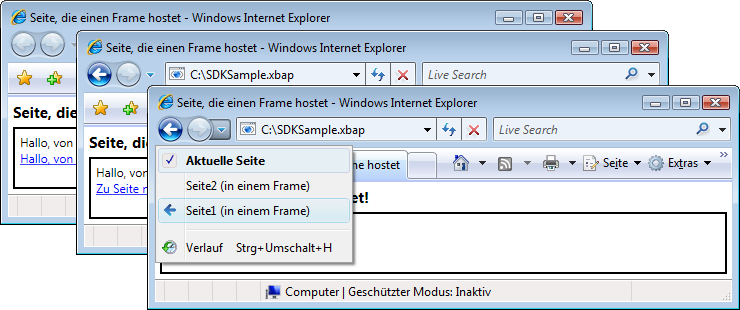  
  
 Sie sind nicht auf die Verwendung von <xref:System.Windows.Controls.Frame> innerhalb des Inhalts von <xref:System.Windows.Controls.Page> beschränkt.  Es ist auch üblich, <xref:System.Windows.Controls.Frame> im Inhalt von <xref:System.Windows.Window> zu hosten.  
  
 Standardmäßig verwendet <xref:System.Windows.Controls.Frame> nur sein eigenes Journal, wenn kein anderes angegeben ist.  Wenn ein <xref:System.Windows.Controls.Frame> Teil des Inhalts ist, der in einem <xref:System.Windows.Navigation.NavigationWindow> oder einer [!INCLUDE[TLA2#tla_xbap](../../../../includes/tla2sharptla-xbap-md.md)] gehostet wird, verwendet <xref:System.Windows.Controls.Frame> das Journal, das zu <xref:System.Windows.Navigation.NavigationWindow> oder [!INCLUDE[TLA2#tla_xbap](../../../../includes/tla2sharptla-xbap-md.md)] gehört. Allerdings kommt es vor, dass ein <xref:System.Windows.Controls.Frame> für das eigene Journal zuständig ist.  Ein Grund dafür besteht darin, eine Navigation mithilfe des Journals innerhalb der Seiten zu ermöglichen, die durch <xref:System.Windows.Controls.Frame> gehostet werden.  Dies wird in der folgenden Abbildung verdeutlicht.  
  
 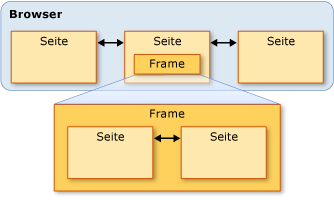  
  
 Sie können <xref:System.Windows.Controls.Frame> in diesem Fall so konfigurieren, dass sein eigenes Journal verwendet wird. Dazu legen Sie die <xref:System.Windows.Controls.Frame.JournalOwnership%2A>\-Eigenschaft von <xref:System.Windows.Controls.Frame> auf <xref:System.Windows.Navigation.JournalOwnership> fest.  Dies wird im folgenden Markup gezeigt.  
  
 [!code-xml[NavigationOverviewSnippets#FrameHostPageOwnJournalXAML1](../../../../samples/snippets/csharp/VS_Snippets_Wpf/NavigationOverviewSnippets/CSharp/FrameHostPageOwnJournal.xaml#framehostpageownjournalxaml1)]  
[!code-xml[NavigationOverviewSnippets#FrameHostPageOwnJournalXAML2](../../../../samples/snippets/csharp/VS_Snippets_Wpf/NavigationOverviewSnippets/CSharp/FrameHostPageOwnJournal.xaml#framehostpageownjournalxaml2)]  
[!code-xml[NavigationOverviewSnippets#FrameHostPageOwnJournalXAML3](../../../../samples/snippets/csharp/VS_Snippets_Wpf/NavigationOverviewSnippets/CSharp/FrameHostPageOwnJournal.xaml#framehostpageownjournalxaml3)]  
  
 In der folgenden Abbildung wird die Auswirkung der Navigation in <xref:System.Windows.Controls.Frame> dargestellt, der sein eigenes Journal verwendet.  
  
 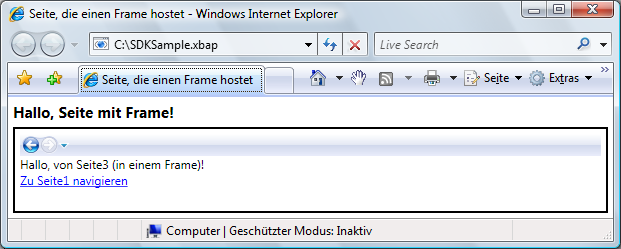  
  
 Beachten Sie, dass die Journaleinträge von der Navigations\-[!INCLUDE[TLA2#tla_ui](../../../../includes/tla2sharptla-ui-md.md)] im <xref:System.Windows.Controls.Frame> angezeigt werden und nicht von [!INCLUDE[TLA2#tla_ie](../../../../includes/tla2sharptla-ie-md.md)].  
  
> [!NOTE]
>  Wenn <xref:System.Windows.Controls.Frame> Teil des Inhalts ist, der in <xref:System.Windows.Window> gehostet wird, verwendet <xref:System.Windows.Controls.Frame> das eigene Journal und zeigt folglich die eigene Navigations\-[!INCLUDE[TLA2#tla_ui](../../../../includes/tla2sharptla-ui-md.md)] an.  
  
 Wenn Ihre Benutzererfahrung es erforderlich macht, dass <xref:System.Windows.Controls.Frame> ein eigenes Journal zur Verfügung stellt, ohne dass die Navigations\-[!INCLUDE[TLA2#tla_ui](../../../../includes/tla2sharptla-ui-md.md)] angezeigt wird, können Sie die Navigations\-[!INCLUDE[TLA2#tla_ui](../../../../includes/tla2sharptla-ui-md.md)] ausblenden, indem Sie <xref:System.Windows.Controls.Frame.NavigationUIVisibility%2A> auf <xref:System.Windows.Visibility> festlegen.  Dies wird im folgenden Markup gezeigt.  
  
 [!code-xml[NavigationOverviewSnippets#FrameHostPageHidesUIXAML1](../../../../samples/snippets/csharp/VS_Snippets_Wpf/NavigationOverviewSnippets/CSharp/FrameHostPageOwnHiddenJournal.xaml#framehostpagehidesuixaml1)]  
[!code-xml[NavigationOverviewSnippets#FrameHostPageHidesUIXAML2](../../../../samples/snippets/csharp/VS_Snippets_Wpf/NavigationOverviewSnippets/CSharp/FrameHostPageOwnHiddenJournal.xaml#framehostpagehidesuixaml2)]  
[!code-xml[NavigationOverviewSnippets#FrameHostPageHidesUIXAML3](../../../../samples/snippets/csharp/VS_Snippets_Wpf/NavigationOverviewSnippets/CSharp/FrameHostPageOwnHiddenJournal.xaml#framehostpagehidesuixaml3)]  
  
   
## Navigationshosts  
 <xref:System.Windows.Controls.Frame> und <xref:System.Windows.Navigation.NavigationWindow> sind Klassen, die als Navigationshosts bezeichnet werden.  Ein *Navigationshost* ist eine Klasse, die zu Inhalt navigieren und diesen anzeigen kann.  Hierzu verwendet jeder Navigationshost den eigenen <xref:System.Windows.Navigation.NavigationService> und das eigene Journal.  Die grundlegende Konstruktion eines Navigationshosts wird in der folgenden Abbildung gezeigt.  
  
   
  
 Im Wesentlichen erlaubt dies <xref:System.Windows.Navigation.NavigationWindow> und <xref:System.Windows.Controls.Frame>, dieselbe Navigationsunterstützung zur Verfügung zu stellen, die eine [!INCLUDE[TLA2#tla_xbap](../../../../includes/tla2sharptla-xbap-md.md)] verfügbar macht, wenn sie im Browser gehostet wird.  
  
 Neben dem Verwenden von <xref:System.Windows.Navigation.NavigationService> und einem Journal, implementieren Navigationshosts dieselben Member, die <xref:System.Windows.Navigation.NavigationService> implementiert.  Dies wird in der folgenden Abbildung verdeutlicht.  
  
   
  
 Dies ermöglicht es Ihnen, Navigationsunterstützung direkt für sie zu programmieren.  Ziehen Sie dies in Erwägung, wenn Sie eine benutzerdefinierte Navigations\-[!INCLUDE[TLA2#tla_ui](../../../../includes/tla2sharptla-ui-md.md)] für einen <xref:System.Windows.Controls.Frame> bereitstellen müssen, der in einem <xref:System.Windows.Window> gehostet wird. Darüber hinaus implementieren beide Typen zusätzliche Member, die für die Navigation erforderlich sind, einschließlich `BackStack` \(<xref:System.Windows.Navigation.NavigationWindow.BackStack%2A?displayProperty=fullName>, <xref:System.Windows.Controls.Frame.BackStack%2A?displayProperty=fullName>\) und `ForwardStack` \(<xref:System.Windows.Navigation.NavigationWindow.ForwardStack%2A?displayProperty=fullName>, <xref:System.Windows.Controls.Frame.ForwardStack%2A?displayProperty=fullName>\), mit denen Sie die Journaleinträge im Rückwärts\- bzw. Vorwärtsstapel auflisten können.  
  
 Wie bereits erwähnt, können in einer Anwendung mehrere Journale vorhanden sein.  Die folgende Abbildung enthält ein Beispiel für die Fälle, in denen das auftreten kann.  
  
   
  
   
## Navigieren zu anderem Inhalt als XAML\-Seiten  
 In diesem Thema wurden <xref:System.Windows.Controls.Page> und Paket\-[!INCLUDE[TLA2#tla_xbap#plural](../../../../includes/tla2sharptla-xbapsharpplural-md.md)] dazu verwendet, die verschiedenen Navigationsfunktionen von [!INCLUDE[TLA2#tla_wpf](../../../../includes/tla2sharptla-wpf-md.md)] zu veranschaulichen.  Eine <xref:System.Windows.Controls.Page>, die in eine Anwendung kompiliert wird, ist nicht die einzige Art von Inhalt, zu der navigiert werden kann. Paket\-[!INCLUDE[TLA2#tla_xbap#plural](../../../../includes/tla2sharptla-xbapsharpplural-md.md)] sind nicht die einzige Möglichkeit zum Identifizieren von Inhalt.  
  
 Wie in diesem Abschnitt veranschaulicht wird, können Sie auch zu Loose [!INCLUDE[TLA2#tla_xaml](../../../../includes/tla2sharptla-xaml-md.md)]\-Dateien, [!INCLUDE[TLA2#tla_html](../../../../includes/tla2sharptla-html-md.md)]\-Dateien und Objekten navigieren.  
  
   
### Navigieren zu Loose XAML\-Dateien  
 Unter einer Loose [!INCLUDE[TLA2#tla_xaml](../../../../includes/tla2sharptla-xaml-md.md)]\-Datei versteht man eine Datei mit den folgenden Eigenschaften:  
  
-   Enthält nur [!INCLUDE[TLA2#tla_xaml](../../../../includes/tla2sharptla-xaml-md.md)] \(d. h., keinen Code\).  
  
-   Verfügt über eine entsprechende Namespacedeklaration.  
  
-   Hat die Dateinamenerweiterung .xaml.  
  
 Stellen Sie sich z. B. den folgenden, zu speichernden Inhalt als Loose [!INCLUDE[TLA2#tla_xaml](../../../../includes/tla2sharptla-xaml-md.md)]\-Datei Person.xaml vor.  
  
 [!code-xml[NavigationOverviewSnippets#LooseXAML](../../../../samples/snippets/csharp/VS_Snippets_Wpf/NavigationOverviewSnippets/CSharp/Person.xaml#loosexaml)]  
  
 Wenn Sie auf die Datei doppelklicken, wird der Browser geöffnet und navigiert zur Datei und zeigt den Inhalt an.  Das wird in der folgenden Abbildung gezeigt.  
  
 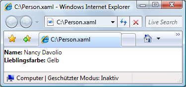  
  
 Sie können eine Loose [!INCLUDE[TLA2#tla_xaml](../../../../includes/tla2sharptla-xaml-md.md)]\-Datei von folgenden Orten aus anzeigen:  
  
-   Einer Website auf dem lokalen Computer, dem Intranet oder dem Internet  
  
-   Einer [!INCLUDE[TLA#tla_unc](../../../../includes/tlasharptla-unc-md.md)]\-Dateifreigabe  
  
-   Dem lokalen Datenträger  
  
 Eine Loose [!INCLUDE[TLA2#tla_xaml](../../../../includes/tla2sharptla-xaml-md.md)]\-Datei kann den Favoriten des Browsers hinzugefügt werden oder die Homepage des Browsers darstellen.  
  
> [!NOTE]
>  Weitere Informationen zum Veröffentlichen und Starten von Loose [!INCLUDE[TLA2#tla_xaml](../../../../includes/tla2sharptla-xaml-md.md)]\-Seiten finden Sie unter [Bereitstellen von WPF\-Anwendungen](../../../../docs/framework/wpf/app-development/deploying-a-wpf-application-wpf.md).  
  
 Loose [!INCLUDE[TLA2#tla_xaml](../../../../includes/tla2sharptla-xaml-md.md)] ist dahingehend eingeschränkt, dass nur Inhalt gehostet werden kann, der zum Ausführen mit teilweiser Vertrauenswürdigkeit sicher ist.  Beispielsweise kann `Window` nicht das Stammelement einer Loose [!INCLUDE[TLA2#tla_xaml](../../../../includes/tla2sharptla-xaml-md.md)]\-Datei sein.  Weitere Informationen finden Sie unter [WPF\-Sicherheit mit teilweiser Vertrauenswürdigkeit](../../../../docs/framework/wpf/wpf-partial-trust-security.md).  
  
   
### Navigieren zu HTML\-Dateien mit Frame  
 Wie erwartet, können Sie auch zu [!INCLUDE[TLA2#tla_html](../../../../includes/tla2sharptla-html-md.md)] navigieren.  Sie müssen lediglich einen [!INCLUDE[TLA2#tla_uri](../../../../includes/tla2sharptla-uri-md.md)] zur Verfügung stellen, der das http\-Schema verwendet.  In der folgenden [!INCLUDE[TLA2#tla_xaml](../../../../includes/tla2sharptla-xaml-md.md)] wird beispielsweise <xref:System.Windows.Controls.Frame> angezeigt, der zu einer [!INCLUDE[TLA2#tla_html](../../../../includes/tla2sharptla-html-md.md)]\-Seite navigiert.  
  
 [!code-xml[NavigationOverviewSnippets#FrameHtmlNavMARKUP](../../../../samples/snippets/csharp/VS_Snippets_Wpf/NavigationOverviewSnippets/CSharp/FrameHTMLNavPage.xaml#framehtmlnavmarkup)]  
  
 Zum Navigieren zu [!INCLUDE[TLA2#tla_html](../../../../includes/tla2sharptla-html-md.md)] sind besondere Berechtigungen erforderlich.  Sie können z. B. nicht von einer [!INCLUDE[TLA2#tla_xbap](../../../../includes/tla2sharptla-xbap-md.md)] navigieren, die im teilweise vertrauenswürdigen Sicherheitsbereich \(Sandbox\) der Internetzone ausgeführt wird. Weitere Informationen finden Sie unter [WPF\-Sicherheit mit teilweiser Vertrauenswürdigkeit](../../../../docs/framework/wpf/wpf-partial-trust-security.md).  
  
   
### Navigieren mit dem WebBrowser\-Steuerelement zu HTML\-Dateien  
 Das <xref:System.Windows.Controls.WebBrowser>\-Steuerelement unterstützt das [!INCLUDE[TLA2#tla_html](../../../../includes/tla2sharptla-html-md.md)]\-Dokumenthosting, die Navigation und die Interoperabilität Skript\/verwalteter Code.  Ausführliche Informationen zum <xref:System.Windows.Controls.WebBrowser>\-Steuerelement finden Sie im <xref:System.Windows.Controls.WebBrowser>.  
  
 Wie im Falle von <xref:System.Windows.Controls.Frame>, sind für die Navigation zu [!INCLUDE[TLA2#tla_html](../../../../includes/tla2sharptla-html-md.md)] unter Verwendung von <xref:System.Windows.Controls.WebBrowser> spezielle Berechtigungen erforderlich.  Von einer teilweise vertrauenswürdigen Anwendung können Sie nur zu [!INCLUDE[TLA2#tla_html](../../../../includes/tla2sharptla-html-md.md)] navigieren, das auf der Ursprungssite gespeichert ist.  Weitere Informationen finden Sie unter [WPF\-Sicherheit mit teilweiser Vertrauenswürdigkeit](../../../../docs/framework/wpf/wpf-partial-trust-security.md).  
  
   
### Navigieren zu benutzerdefinierten Objekten  
 Wenn Sie Daten als benutzerdefinierte Objekte gespeichert haben, können die Daten u. a. durch Erstellen von <xref:System.Windows.Controls.Page> mit Inhalt angezeigt werden, der an diese Objekte gebunden wird \(siehe [Übersicht über Datenbindung](../../../../docs/framework/wpf/data/data-binding-overview.md)\).  Wenn Sie eine ganze Seite nicht nur zu dem Zweck erstellen möchten, die Objekte anzuzeigen, können Sie stattdessen direkt zu ihnen navigieren.  
  
 Betrachten Sie die im folgenden Code implementierte `Person`\-Klasse.  
  
 [!code-csharp[NavigateToObjectSnippets#PersonClassCODE](../../../../samples/snippets/csharp/VS_Snippets_Wpf/NavigateToObjectSnippets/CSharp/Person.cs#personclasscode)]
 [!code-vb[NavigateToObjectSnippets#PersonClassCODE](../../../../samples/snippets/visualbasic/VS_Snippets_Wpf/NavigateToObjectSnippets/VisualBasic/Person.vb#personclasscode)]  
  
 Rufen Sie die <xref:System.Windows.Navigation.NavigationWindow.Navigate%2A?displayProperty=fullName>\-Methode auf, um zu ihr zu navigieren, wie mit dem folgenden Code veranschaulicht.  
  
 [!code-xml[NavigateToObjectSnippets#PageThatNavsToObject1](../../../../samples/snippets/csharp/VS_Snippets_Wpf/NavigateToObjectSnippets/CSharp/HomePage.xaml#pagethatnavstoobject1)]  
[!code-xml[NavigateToObjectSnippets#PageThatNavsToObject2](../../../../samples/snippets/csharp/VS_Snippets_Wpf/NavigateToObjectSnippets/CSharp/HomePage.xaml#pagethatnavstoobject2)]  
[!code-xml[NavigateToObjectSnippets#PageThatNavsToObject3](../../../../samples/snippets/csharp/VS_Snippets_Wpf/NavigateToObjectSnippets/CSharp/HomePage.xaml#pagethatnavstoobject3)]  
  
 [!code-csharp[NavigateToObjectSnippets#PageThatNavsToObjectCODEBEHIND](../../../../samples/snippets/csharp/VS_Snippets_Wpf/NavigateToObjectSnippets/CSharp/HomePage.xaml.cs#pagethatnavstoobjectcodebehind)]
 [!code-vb[NavigateToObjectSnippets#PageThatNavsToObjectCODEBEHIND](../../../../samples/snippets/visualbasic/VS_Snippets_Wpf/NavigateToObjectSnippets/VisualBasic/HomePage.xaml.vb#pagethatnavstoobjectcodebehind)]  
  
 In der folgenden Abbildung wird das Ergebnis dargestellt.  
  
 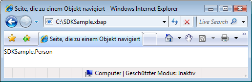  
  
 Aus dieser Abbildung können Sie ersehen, dass nichts Nützliches angezeigt wird.  Tatsächlich handelt es sich beim angezeigten Wert um den Rückgabewert der `ToString`\-Methode für das **Person**\-Objekt. Standardmäßig ist das der einzige Wert, den [!INCLUDE[TLA2#tla_wpf](../../../../includes/tla2sharptla-wpf-md.md)] zum Darstellen des Objekts verwenden kann.  Sie könnten die `ToString`\-Methode überschreiben, um aussagekräftigere Informationen zu erhalten. Allerdings wird auch dann nur ein Zeichenfolgenwert zurückgegeben.  Mit einer Datenvorlage lassen sich die Darstellungsfunktionen von [!INCLUDE[TLA2#tla_wpf](../../../../includes/tla2sharptla-wpf-md.md)] nutzen.  Sie können eine Datenvorlage implementieren, die [!INCLUDE[TLA2#tla_wpf](../../../../includes/tla2sharptla-wpf-md.md)] dem Objekt eines bestimmten Typs zuordnen kann.  Im folgenden Code wird eine Datenvorlage für das `Person`\-Objekt gezeigt.  
  
 [!code-xml[NavigateToObjectSnippets#DataTemplateMARKUP](../../../../samples/snippets/csharp/VS_Snippets_Wpf/NavigateToObjectSnippets/CSharp/App.xaml#datatemplatemarkup)]  
  
 In diesem Fall wird die Datenvorlage dem `Person`\-Typ unter Verwendung der `x:Type`\-Markuperweiterung im `DataType`\-Attribut zugeordnet.  Die Datenvorlage bindet dann `TextBlock`\-Elemente \(siehe <xref:System.Windows.Controls.TextBlock>\) an die Eigenschaften der `Person`\-Klasse.  In der folgenden Abbildung wird die aktualisierte Darstellung des `Person`\-Objekts angezeigt.  
  
   
  
 Ein Vorteil dieser Technik liegt in der Konsistenz, die Ihnen die Wiederverwendung der Datenvorlage zur konsistenten Anzeige Ihrer Objekte in der gesamten Anwendung erlaubt.  
  
 Weitere Informationen zu Datenvorlagen finden Sie unter [Übersicht über Datenvorlagen](../../../../docs/framework/wpf/data/data-templating-overview.md).  
  
   
## Sicherheit  
 Die [!INCLUDE[TLA2#tla_wpf](../../../../includes/tla2sharptla-wpf-md.md)]\-Navigationsunterstützung ermöglicht es, dass über das Internet zu [!INCLUDE[TLA2#tla_xbap#plural](../../../../includes/tla2sharptla-xbapsharpplural-md.md)] navigiert werden kann. Außerdem können Anwendungen Inhalt von Drittanbietern hosten.  Um Benutzer und Anwendungen vor bedrohlichem Verhalten zu schützen, stellt [!INCLUDE[TLA2#tla_wpf](../../../../includes/tla2sharptla-wpf-md.md)] eine Palette an Sicherheitsfeatures bereit, die unter [Sicherheit](../../../../docs/framework/wpf/security-wpf.md) und [WPF\-Sicherheit mit teilweiser Vertrauenswürdigkeit](../../../../docs/framework/wpf/wpf-partial-trust-security.md) behandelt werden.  
  
## Siehe auch  
 <xref:System.Windows.Application.SetCookie%2A>   
 <xref:System.Windows.Application.GetCookie%2A>   
 [Übersicht über die Anwendungsverwaltung](../../../../docs/framework/wpf/app-development/application-management-overview.md)   
 [Paket\-URI in WPF](../../../../docs/framework/wpf/app-development/pack-uris-in-wpf.md)   
 [Übersicht über die strukturierte Navigation](../../../../docs/framework/wpf/app-development/structured-navigation-overview.md)   
 [Übersicht über Navigationstopologien](../../../../docs/framework/wpf/app-development/navigation-topologies-overview.md)   
 [Gewusst wie\-Themen](../../../../docs/framework/wpf/app-development/navigation-how-to-topics.md)   
 [Bereitstellen von WPF\-Anwendungen](../../../../docs/framework/wpf/app-development/deploying-a-wpf-application-wpf.md)