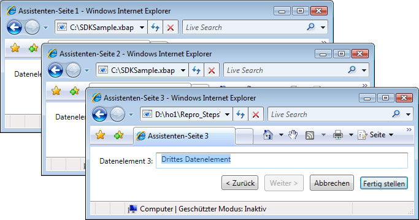
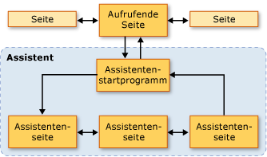
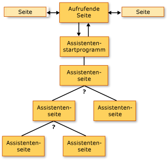
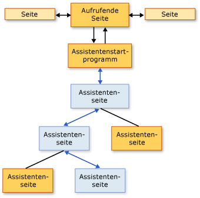
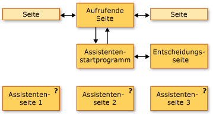
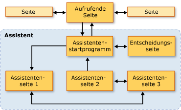

# Übersicht über NavigationstopologienNavigation Topologies Overview
 Diese Übersicht bietet eine Einführung in die Navigationstopologien [!INCLUDE[TLA2#tla_wpf](../../../../includes/tla2sharptla-wpf-md.md)].This overview provides an introduction to navigation topologies in [!INCLUDE[TLA2#tla_wpf](../../../../includes/tla2sharptla-wpf-md.md)]. Anschließend werden drei allgemeine Navigationstopologien mit Beispielen erläutert.Three common navigation topologies, with samples, are subsequently discussed.  
  
> [!NOTE]
>  Bevor Sie dieses Thema lesen, sollten Sie mit dem Konzept der strukturierten Navigation in vertraut sein [!INCLUDE[TLA2#tla_wpf](../../../../includes/tla2sharptla-wpf-md.md)] Seitenfunktionen verwenden.Before reading this topic, you should be familiar with the concept of structured navigation in [!INCLUDE[TLA2#tla_wpf](../../../../includes/tla2sharptla-wpf-md.md)] using page functions. Weitere Informationen zu diesen beiden Themen, finden Sie unter [Übersicht über die strukturierte Navigation](../../../../docs/framework/wpf/app-development/structured-navigation-overview.md).For more information on both of these topics, see [Structured Navigation Overview](../../../../docs/framework/wpf/app-development/structured-navigation-overview.md).  
  
 Dieses Thema enthält folgende Abschnitte:This topic contains the following sections:  
  
-   [NavigationstopologienNavigation Topologies](#Navigation_Topologies)  
  
-   [Strukturierte NavigationstopologienStructured Navigation Topologies](#Structured_Navigation_Topologies)  
  
-   [Navigation über eine feste lineare TopologieNavigation over a Fixed Linear Topology](#Navigation_over_a_Fixed_Linear_Topology)  
  
-   [Dynamische Navigation über eine feste hierarchische TopologieDynamic Navigation over a Fixed Hierarchical Topology](#Dynamic_Navigation_over_a_Fixed_Hierarchical_Topology)  
  
-   [Navigation über eine dynamisch generierte TopologieNavigation over a Dynamically Generated Topology](#Navigation_over_a_Dynamically_Generated_Topology)  
  
   
## NavigationstopologienNavigation Topologies  
 In [!INCLUDE[TLA2#tla_wpf](../../../../includes/tla2sharptla-wpf-md.md)], Navigation normalerweise über Seiten (<xref:System.Windows.Controls.Page>) links (<xref:System.Windows.Documents.Hyperlink>), die auf andere Seiten gelangt navigieren.In [!INCLUDE[TLA2#tla_wpf](../../../../includes/tla2sharptla-wpf-md.md)], navigation typically consists of pages (<xref:System.Windows.Controls.Page>) with hyperlinks (<xref:System.Windows.Documents.Hyperlink>) that navigate to other pages when clicked. Seiten, zu dem navigiert werden, durch identifiziert [!INCLUDE[TLA#tla_uri#plural](../../../../includes/tlasharptla-urisharpplural-md.md)] (finden Sie unter [Paket-URIs in WPF](../../../../docs/framework/wpf/app-development/pack-uris-in-wpf.md)).Pages that are navigated to are identified by [!INCLUDE[TLA#tla_uri#plural](../../../../includes/tlasharptla-urisharpplural-md.md)] (see [Pack URIs in WPF](../../../../docs/framework/wpf/app-development/pack-uris-in-wpf.md)). Betrachten Sie das folgende einfache Beispiel, das zeigt, Seiten, links und [!INCLUDE[TLA#tla_uri#plural](../../../../includes/tlasharptla-urisharpplural-md.md)]:Consider the following simple example that shows pages, hyperlinks, and [!INCLUDE[TLA#tla_uri#plural](../../../../includes/tlasharptla-urisharpplural-md.md)]:  
  
 [!code-xaml[NavigationTopologiesOverviewSnippets#Page1](../../../../samples/snippets/csharp/VS_Snippets_Wpf/NavigationTopologiesOverviewSnippets/CS/Page1.xaml#page1)]  
  
 [!code-xaml[NavigationTopologiesOverviewSnippets#Page2](../../../../samples/snippets/csharp/VS_Snippets_Wpf/NavigationTopologiesOverviewSnippets/CS/Page2.xaml#page2)]  
  
 In diesen Seiten angeordnet sind eine *Navigationstopologie* , dessen Struktur richtet sich nach, wie Sie zwischen den Seiten wechseln können.These pages are arranged in a *navigation topology* whose structure is determined by how you can navigate between the pages. Die gezeigte Navigationstopologie ist für einfache Szenarien geeignet. In bestimmten Fällen können jedoch komplexere Topologien erforderlich sein, die zum Teil nur definiert werden können, während eine Anwendung ausgeführt wird.This particular navigation topology is suitable in simple scenarios, although navigation can require more complex topologies, some of which can only be defined when an application is running.  
  
 In diesem Thema werden drei allgemeine Navigationstopologien behandelt: *feste lineare*, *feste hierarchische*, und *dynamisch generierten*.This topic covers three common navigation topologies: *fixed linear*, *fixed hierarchical*, and *dynamically generated*. Jede Navigationstopologie wird anhand eines Beispiels, die erläutert ein [!INCLUDE[TLA2#tla_ui](../../../../includes/tla2sharptla-ui-md.md)] wie derjenige, der in der folgenden Abbildung gezeigt wird:Each navigation topology is demonstrated with a sample that has a [!INCLUDE[TLA2#tla_ui](../../../../includes/tla2sharptla-ui-md.md)] like the one that is shown in the following figure:  
  
   
  
   
## Strukturierte NavigationstopologienStructured Navigation Topologies  
 Es gibt zwei umfassende Typen von Navigationstopologien:There are two broad types of navigation topologies:  
  
-   **Feste Topologie**: Diese Topologie wird zum Zeitpunkt der Kompilierung definiert und ändert sich während der Laufzeit nicht.**Fixed Topology**: defined at compile time and does not change at run time. Feste Topologien sind hilfreich, wenn die Navigation durch die Seiten in einer festen Reihenfolge (linear oder hierarchisch) erfolgt.Fixed topologies are useful for navigation through a fixed sequence of pages in either a linear or hierarchical order.  
  
-   **Dynamische Topologie**: Diese Topologie wird während der Laufzeit und auf Grundlage von Eingaben definiert, die vom Benutzer, der Anwendung oder dem System gemacht werden.**Dynamic Topology**: defined at run time based on input that is collected from the user, the application, or the system. Dynamische Topologien sind hilfreich, wenn die Navigation durch Seiten in unterschiedlichen Reihenfolgen möglich ist.Dynamic topologies are useful when pages can be navigated in different sequences.  
  
 Obwohl es möglich ist, Navigationstopologien mithilfe von Seiten zu erstellen, werden in den Beispielen Seitenfunktionen verwendet. Seitenfunktionen bieten zusätzliche Unterstützung für die Weiter- und Rückgabe von Daten zwischen den einzelnen Seiten einer Topologie.Although it is possible to create navigation topologies using pages, the samples use page functions because they provide additional support that simplifies support for passing and returning data through the pages of a topology.  
  
   
## Navigation über eine feste lineare TopologieNavigation over a Fixed Linear Topology  
 Die Struktur einer festen linearen Topologie entspricht der eines Assistenten, der aus einer oder mehreren Seiten besteht, durch die in einer festen Reihenfolge navigiert wird.A fixed linear topology is analogous to the structure of a wizard that has one or more wizard pages that are navigated in a fixed sequence. Die folgende Abbildung zeigt den Verlauf eines Assistenten mit einer festen linearen Topologie sowie dessen Struktur auf oberster Ebene.The following figure shows the high-level structure and flow of a wizard with a fixed linear topology.  
  
   
  
 Folgende Verhaltensweisen sind für die Navigation über eine feste lineare Topologie typisch:The typical behaviors for navigating over a fixed linear topology include the following:  
  
-   Die Navigation von einer aufrufenden Seite zu einer Starterseite, die den Assistenten initialisiert und zur ersten Seite des Assistenten navigiert.Navigating from the calling page to a launcher page that initializes the wizard and navigates to the first wizard page. Eine Starterseite (eine [!INCLUDE[TLA2#tla_ui](../../../../includes/tla2sharptla-ui-md.md)]-weniger <xref:System.Windows.Navigation.PageFunction%601>) ist nicht erforderlich, da eine aufrufende Seite die erste Seite des Assistenten direkt aufrufen kann.A launcher page (a [!INCLUDE[TLA2#tla_ui](../../../../includes/tla2sharptla-ui-md.md)]-less <xref:System.Windows.Navigation.PageFunction%601>) is not required, since a calling page can call the first wizard page directly. Durch die Verwendung einer Starterseite kann die Initialisierung des Assistenten jedoch vereinfacht werden.Using a launcher page, however, can simplify wizard initialization, particularly if initialization is complex.  
  
-   Benutzer können über die Schaltflächen „Vorwärts“ und „Zurück“ (oder Links) zwischen den Seiten navigieren.Users can navigate between pages by using Back and Forward buttons (or hyperlinks).  
  
-   Benutzer können mithilfe des Journals zwischen den Seiten navigieren.Users can navigate between pages using the journal.  
  
-   Benutzer können den Assistenten auf jeder Assistentenseite abbrechen, indem sie auf die Schaltfläche „Abbrechen“ klicken.Users can cancel the wizard from any wizard page by pressing a Cancel button.  
  
-   Benutzer können den Assistenten auf der letzten Assistentenseite abschließen, indem sie auf die Schaltfläche „Fertig stellen“ klicken.Users can accept the wizard on the last wizard page by pressing a Finish button.  
  
-   Wenn ein Assistent abgebrochen wird, gibt der Assistent ein entsprechendes Ergebnis und keine Daten zurück.If a wizard is canceled, the wizard returns an appropriate result, and does not return any data.  
  
-   Wenn ein Assistent abgeschlossen wird, gibt der Assistent ein entsprechendes Ergebnis und die gesammelten Daten zurück.If a user accepts a wizard, the wizard returns an appropriate result, and returns the data it collected.  
  
-   Wenn der Assistent abgeschlossen oder abgebrochen wird, werden die Seiten, die der Assistent umfasst, aus dem Journal entfernt.When the wizard is complete (accepted or canceled), the pages that the wizard comprises are removed from the journal. Dadurch wird jede Instanz des Assistenten isoliert, und potenzielle Daten- oder Zustandsanomalien werden vermieden.This keeps each instance of the wizard isolated, thereby avoiding potential data or state anomalies.  
  
   
## Dynamische Navigation über eine feste hierarchische TopologieDynamic Navigation over a Fixed Hierarchical Topology  
 In einigen Anwendungen gibt es Seiten, die eine Navigation zu zwei oder mehreren anderen Seiten ermöglichen, wie in der folgenden Abbildung veranschaulicht wird.In some applications, pages allow navigation to two or more other pages, as shown in the following figure.  
  
   
  
 Diese Struktur bezeichnet man als feste hierarchische Topologie. Die Reihenfolge, in der die Hierarchie durchlaufen wird, wird häufig zur Laufzeit durch die Anwendung oder den Benutzer bestimmt.This structure is known as a fixed hierarchical topology, and the sequence in which the hierarchy is traversed is often determined at run time by either the application or the user. Jede Seite in der Hierarchie, die eine Navigation zu zwei oder mehreren Seiten ermöglicht, sammelt zur Laufzeit Daten, die erforderlich sind, zu bestimmen, zu welcher Seite navigiert wird.At run time, each page in the hierarchy that allows navigation to two or more other pages gathers the data required to determine which page to navigate to. Die folgende Abbildung veranschaulicht eine von mehreren möglichen Navigationsreihenfolgen auf Grundlage der vorherigen Abbildung.The following figure illustrates one of several possible navigation sequences based on the previous figure.  
  
   
  
 Obwohl bei dieser Topologie die Reihenfolge für die Navigation durch die Seiten einer festen hierarchischen Struktur zur Laufzeit bestimmt wird, ist die Benutzererfahrung dieselbe wie bei einer festen linearen Topologie:Even though the sequence in which pages in a fixed hierarchical structure are navigated is determined at run time, the user experience is the same as the user experience for a fixed linear topology:  
  
-   Die Navigation von einer aufrufenden Seite zu einer Starterseite, die den Assistenten initialisiert und zur ersten Seite des Assistenten navigiert.Navigating from the calling page to a launcher page that initializes the wizard and navigates to the first wizard page. Eine Starterseite (eine [!INCLUDE[TLA2#tla_ui](../../../../includes/tla2sharptla-ui-md.md)]-weniger <xref:System.Windows.Navigation.PageFunction%601>) ist nicht erforderlich, da eine aufrufende Seite die erste Seite des Assistenten direkt aufrufen kann.A launcher page (a [!INCLUDE[TLA2#tla_ui](../../../../includes/tla2sharptla-ui-md.md)]-less <xref:System.Windows.Navigation.PageFunction%601>) is not required, since a calling page can call the first wizard page directly. Durch die Verwendung einer Starterseite kann die Initialisierung des Assistenten jedoch vereinfacht werden.Using a launcher page, however, can simplify wizard initialization, particularly if initialization is complex.  
  
-   Benutzer können über die Schaltflächen „Vorwärts“ und „Zurück“ (oder Links) zwischen den Seiten navigieren.Users can navigate between pages by using Back and Forward buttons (or hyperlinks).  
  
-   Benutzer können mithilfe des Journals zwischen den Seiten navigieren.Users can navigate between pages using the journal.  
  
-   Benutzer können die Navigationsreihenfolge ändern, wenn sie mithilfe des Journals zurück navigieren.Users can change the navigation sequence if they navigate back through the journal.  
  
-   Benutzer können den Assistenten auf jeder Assistentenseite abbrechen, indem sie auf die Schaltfläche „Abbrechen“ klicken.Users can cancel the wizard from any wizard page by pressing a Cancel button.  
  
-   Benutzer können den Assistenten auf der letzten Assistentenseite abschließen, indem sie auf die Schaltfläche „Fertig stellen“ klicken.Users can accept the wizard on the last wizard page by pressing a Finish button.  
  
-   Wenn ein Assistent abgebrochen wird, gibt der Assistent ein entsprechendes Ergebnis und keine Daten zurück.If a wizard is canceled, the wizard returns an appropriate result, and does not return any data.  
  
-   Wenn ein Assistent abgeschlossen wird, gibt der Assistent ein entsprechendes Ergebnis und die gesammelten Daten zurück.If a user accepts a wizard, the wizard returns an appropriate result, and returns the data it collected.  
  
-   Wenn der Assistent abgeschlossen oder abgebrochen wird, werden die Seiten, die der Assistent umfasst, aus dem Journal entfernt.When the wizard is complete (accepted or canceled), the pages that the wizard comprises are removed from the journal. Dadurch wird jede Instanz des Assistenten isoliert, und potenzielle Daten- oder Zustandsanomalien werden vermieden.This keeps each instance of the wizard isolated, thereby avoiding potential data or state anomalies.  
  
   
## Navigation über eine dynamisch generierte TopologieNavigation over a Dynamically Generated Topology  
 In einigen Anwendungen kann die Reihenfolge, in der durch zwei oder mehrere Seiten navigiert wird, nur zur Laufzeit bestimmt werden, sei es durch den Benutzer, die Anwendung oder durch externe Daten.In some applications, the sequence in which two or more pages are navigated can only be determined at run time, whether by the user, the application, or external data. Die folgende Abbildung veranschaulicht einen Satz von Seiten mit einer unbestimmten Navigationsreihenfolge.The following figure illustrates a set of pages with an undetermined navigation sequence.  
  
   
  
 Die nächste Abbildung veranschaulicht eine Navigationsreihenfolge, die zur Laufzeit vom Benutzer ausgewählt wurde.The next figure illustrates a navigation sequence that was chosen by the user at run time.  
  
   
  
 Die Navigationsreihenfolge wird als dynamisch generierte Topologie bezeichnet.The navigation sequence is known as a dynamically generated topology. Wie bei den anderen Navigationstopologien bleibt die Benutzererfahrung dieselbe:For the user, as with the other navigation topologies, the user experience is the same as it is for the previous topologies:  
  
-   Die Navigation von einer aufrufenden Seite zu einer Starterseite, die den Assistenten initialisiert und zur ersten Seite des Assistenten navigiert.Navigating from the calling page to a launcher page that initializes the wizard and navigates to the first wizard page. Eine Starterseite (eine [!INCLUDE[TLA2#tla_ui](../../../../includes/tla2sharptla-ui-md.md)]-weniger <xref:System.Windows.Navigation.PageFunction%601>) ist nicht erforderlich, da eine aufrufende Seite die erste Seite des Assistenten direkt aufrufen kann.A launcher page (a [!INCLUDE[TLA2#tla_ui](../../../../includes/tla2sharptla-ui-md.md)]-less <xref:System.Windows.Navigation.PageFunction%601>) is not required, since a calling page can call the first wizard page directly. Durch die Verwendung einer Starterseite kann die Initialisierung des Assistenten jedoch vereinfacht werden.Using a launcher page, however, can simplify wizard initialization, particularly if initialization is complex.  
  
-   Benutzer können über die Schaltflächen „Vorwärts“ und „Zurück“ (oder Links) zwischen den Seiten navigieren.Users can navigate between pages by using Back and Forward buttons (or hyperlinks).  
  
-   Benutzer können mithilfe des Journals zwischen den Seiten navigieren.Users can navigate between pages using the journal.  
  
-   Benutzer können den Assistenten auf jeder Assistentenseite abbrechen, indem sie auf die Schaltfläche „Abbrechen“ klicken.Users can cancel the wizard from any wizard page by pressing a Cancel button.  
  
-   Benutzer können den Assistenten auf der letzten Assistentenseite abschließen, indem sie auf die Schaltfläche „Fertig stellen“ klicken.Users can accept the wizard on the last wizard page by pressing a Finish button.  
  
-   Wenn ein Assistent abgebrochen wird, gibt der Assistent ein entsprechendes Ergebnis und keine Daten zurück.If a wizard is canceled, the wizard returns an appropriate result, and does not return any data.  
  
-   Wenn ein Assistent abgeschlossen wird, gibt der Assistent ein entsprechendes Ergebnis und die gesammelten Daten zurück.If a user accepts a wizard, the wizard returns an appropriate result, and returns the data it collected.  
  
-   Wenn der Assistent abgeschlossen oder abgebrochen wird, werden die Seiten, die der Assistent umfasst, aus dem Journal entfernt.When the wizard is complete (accepted or canceled), the pages that the wizard comprises are removed from the journal. Dadurch wird jede Instanz des Assistenten isoliert, und potenzielle Daten- oder Zustandsanomalien werden vermieden.This keeps each instance of the wizard isolated, thereby avoiding potential data or state anomalies.  
  
## Siehe auchSee also
- <xref:System.Windows.Controls.Page>
- <xref:System.Windows.Navigation.PageFunction%601>
- <xref:System.Windows.Navigation.NavigationService>
- [Übersicht über die strukturierte NavigationStructured Navigation Overview](../../../../docs/framework/wpf/app-development/structured-navigation-overview.md)
