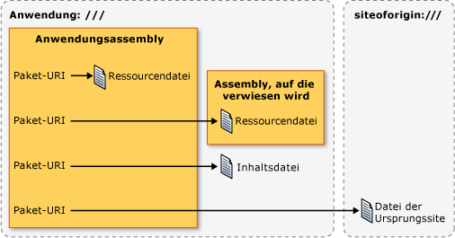

# <a name="pack-uris-in-wpf"></a>Paket-URI in WPF
In [!INCLUDE[TLA#tla_wpf](../../../../includes/tlasharptla-wpf-md.md)], [!INCLUDE[TLA#tla_uri#plural](../../../../includes/tlasharptla-urisharpplural-md.md)] dienen zum Identifizieren und Laden von Dateien in vielerlei Hinsicht, u. a. folgende:  
  
-   Angeben der [!INCLUDE[TLA#tla_ui](../../../../includes/tlasharptla-ui-md.md)] anzuzeigende beim ersten Starten einer Anwendung.  
  
-   Laden von Bildern  
  
-   Navigieren zu Seiten  
  
-   Laden von nicht ausführbaren Datendateien  
  
 Darüber hinaus [!INCLUDE[TLA2#tla_uri#plural](../../../../includes/tla2sharptla-urisharpplural-md.md)] kann verwendet werden, um zu identifizieren, und Laden von Dateien aus einer Vielzahl von Standorten, einschließlich der folgenden:  
  
-   Die aktuelle Assembly.  
  
-   Eine Assembly, auf die verwiesen wird.  
  
-   Ein zu einer Assembly relativer Speicherort.  
  
-   Die Ursprungssite der Anwendung.  
  
 Um einen konsistenten Mechanismus zum Identifizieren und laden diese Typen von Dateien von diesen Speicherorten bieten [!INCLUDE[TLA2#tla_wpf](../../../../includes/tla2sharptla-wpf-md.md)] nutzt die Erweiterbarkeit von der *Paket-URI-Schema*. Dieses Thema bietet eine Übersicht über das Schema, beschrieben, wie Paket-erstellen [!INCLUDE[TLA2#tla_uri#plural](../../../../includes/tla2sharptla-urisharpplural-md.md)] für eine Vielzahl von Szenarien, erläutert absoluten und relativen [!INCLUDE[TLA2#tla_uri#plural](../../../../includes/tla2sharptla-urisharpplural-md.md)] und [!INCLUDE[TLA2#tla_uri](../../../../includes/tla2sharptla-uri-md.md)] Auflösung, vor dem anzeigen wie Packs [!INCLUDE[TLA2#tla_uri#plural](../../../../includes/tla2sharptla-urisharpplural-md.md)] aus beiden Markup und Code.  
  
  
<a name="The_Pack_URI_Scheme"></a>   
## <a name="the-pack-uri-scheme"></a>Das Paket-URI-Schema  
 Das Pack [!INCLUDE[TLA2#tla_uri](../../../../includes/tla2sharptla-uri-md.md)] Schema wird verwendet, durch die [Open Packaging Conventions](http://go.microsoft.com/fwlink/?LinkID=71255) (OPC)-Spezifikation, die ein Modell zum Organisieren und Identifizieren von Inhalt beschreibt. Die wichtigsten Elemente dieses Modells sind Pakete und Teile, wobei ein *Paket* ist ein logischer Container für ein oder mehr logische *Teile*. Die folgende Abbildung veranschaulicht dieses Konzept.  
  
   
  
 Um Komponenten zu identifizieren, nutzt die OPC-Spezifikation die Erweiterbarkeit von RFC 2396 (Uniform Resource Identifiers (URI): Generic Syntax) definieren Sie das Pack [!INCLUDE[TLA2#tla_uri](../../../../includes/tla2sharptla-uri-md.md)] Schema.  
  
 Das Schema, das angegeben wird eine [!INCLUDE[TLA2#tla_uri](../../../../includes/tla2sharptla-uri-md.md)] wird definiert, indem ein Präfix; http, ftp und Datei sind bekannte Beispiele. Das Pack [!INCLUDE[TLA2#tla_uri](../../../../includes/tla2sharptla-uri-md.md)] Schema "Pack" als ihr Schema verwendet und enthält zwei Komponenten: Autorität und Pfad. Im folgenden ist das Format für ein Pack [!INCLUDE[TLA2#tla_uri](../../../../includes/tla2sharptla-uri-md.md)].  
  
 Pack: / /*Autorität*/*Pfad*
  
 Die *Autorität* gibt den Typ des Pakets, das ein Teil enthalten ist, während die *Pfad* gibt den Speicherort eines Teils innerhalb eines Pakets.  
  
 Dieses Konzept wird in der folgenden Abbildung verdeutlicht:  
  
   
  
 Pakete und Teile entsprechen Anwendungen und Dateien: eine Anwendung (ein Paket) kann eine oder mehrere Dateien (Teile) enthalten, darunter:  
  
-   Ressourcendateien, die in die lokale Assembly kompiliert werden  
  
-   Ressourcendateien, die in eine Assembly kompiliert werden, auf die verwiesen wird  
  
-   Ressourcendateien, die in eine verweisende Assembly kompiliert werden  
  
-   Inhaltsdateien  
  
-   Dateien der Ursprungssite  
  
 Zugriff auf diese Typen von Dateien, [!INCLUDE[TLA2#tla_wpf](../../../../includes/tla2sharptla-wpf-md.md)] unterstützt zwei Behörden: Application: / / / und Siteoforigin: / / /. Durch die Autorität „application:///“ werden Anwendungsdatendateien identifiziert, die zur Kompilierungszeit bekannt sind, darunter Ressourcen- und Inhaltsdateien. Durch die Autorität „siteoforigin:///“ werden die Dateien der Ursprungssite identifiziert. Der Bereich der Autoritäten wird in der folgenden Abbildung veranschaulicht.  
  
   
  
> [!NOTE]
>  Die für die Autoritätskomponente eines Packs [!INCLUDE[TLA2#tla_uri](../../../../includes/tla2sharptla-uri-md.md)] ist ein eingebetteter [!INCLUDE[TLA2#tla_uri](../../../../includes/tla2sharptla-uri-md.md)] , die auf ein Paket verweist und RFC 2396 entsprechen. Außerdem muss das Zeichen „/“ durch „,“ ersetzt werden, und reservierte Zeichen wie „%“ und „?“ müssen mit Escapezeichen versehen werden. Ausführliche Informationen finden Sie in der OPC.  
  
 In den folgenden Abschnitten wird erläutert, wie Paket-erstellen [!INCLUDE[TLA2#tla_uri#plural](../../../../includes/tla2sharptla-urisharpplural-md.md)] mit diesen beiden Autoritäten in Verbindung mit den entsprechenden Pfaden zum Identifizieren von Ressourcen, Inhalte und Dateien der Ursprungssite.  
  
<a name="Resource_File_Pack_URIs___Local_Assembly"></a>   
## <a name="resource-file-pack-uris"></a>Paket-URIs der Ressourcendatei  
 Ressourcendateien sind so konfiguriert, als [!INCLUDE[TLA2#tla_msbuild](../../../../includes/tla2sharptla-msbuild-md.md)] `Resource` Elemente und werden in Assemblys kompiliert. [!INCLUDE[TLA2#tla_wpf](../../../../includes/tla2sharptla-wpf-md.md)]unterstützt die Erstellung von Paket- [!INCLUDE[TLA2#tla_uri#plural](../../../../includes/tla2sharptla-urisharpplural-md.md)] , die verwendet werden kann, um Ressourcendateien zu identifizieren, die entweder in der lokalen Assembly kompiliert oder in einer Assembly, die von der lokalen Assembly verwiesen wird kompiliert.  
  
<a name="Local_Assembly_Resource_File"></a>   
### <a name="local-assembly-resource-file"></a>Ressourcendatei der lokalen Assembly  
 Das Pack [!INCLUDE[TLA2#tla_uri](../../../../includes/tla2sharptla-uri-md.md)] -Datei, die in der lokalen Assembly kompiliert wird für eine Ressource verwendet, folgende Autorität und Pfad:  
  
-   **Autorität**: application:///.  
  
-   **Pfad**: Der Name der Ressourcendatei, einschließlich des Pfads, relativ zum Stammverzeichnis des Projektordners der lokalen Assembly.  
  
 Das folgende Beispiel zeigt das Pack [!INCLUDE[TLA2#tla_uri](../../../../includes/tla2sharptla-uri-md.md)] für eine [!INCLUDE[TLA2#tla_xaml](../../../../includes/tla2sharptla-xaml-md.md)] Ressourcendatei, die im Stammverzeichnis des Projektordners der lokalen Assembly befindet.  
  
 `pack://application:,,,/ResourceFile.xaml`  
  
 Das folgende Beispiel zeigt das Pack [!INCLUDE[TLA2#tla_uri](../../../../includes/tla2sharptla-uri-md.md)] für eine [!INCLUDE[TLA2#tla_xaml](../../../../includes/tla2sharptla-xaml-md.md)] Ressourcendatei, die in einem Unterordner des Projektordners der lokalen Assembly befindet.  
  
 `pack://application:,,,/Subfolder/ResourceFile.xaml`  
  
<a name="Resource_File_Pack_URIs___Referenced_Assembly"></a>   
### <a name="referenced-assembly-resource-file"></a>Ressourcendatei der Assembly, auf die verwiesen wird  
 Das Pack [!INCLUDE[TLA2#tla_uri](../../../../includes/tla2sharptla-uri-md.md)] -Datei, die in einer referenzierten Assembly kompiliert wird für eine Ressource verwendet, folgende Autorität und Pfad:  
  
-   **Autorität**: application:///.  
  
-   **Pfad**: Der Name einer Ressourcendatei, die in eine Assembly kompiliert wurde, auf die verwiesen wird. Der Pfad muss dem folgenden Format entsprechen:  
  
     *AssemblyShortName*{*; Version*] {*; PublicKey*]; Component /*Pfad*  
  
    -   **AssemblyShortName**: Der Kurzname für die Assembly, auf die verwiesen wird.  
  
    -   **;Version** [optional]: Die Version der Assembly, auf die verwiesen wird, die die Ressourcendatei enthält. Wird verwendet, wenn mindestens zwei Assemblys, auf die verwiesen wird und die über denselben Kurznamen verfügen, geladen werden.  
  
    -   **;PublicKey** [optional]: Der öffentliche Schlüssel, der zum Signieren der Assembly verwendet wird, auf die verwiesen wird. Wird verwendet, wenn mindestens zwei Assemblys, auf die verwiesen wird und die über denselben Kurznamen verfügen, geladen werden.  
  
    -   **;component**: Gibt an, dass von der lokalen Assembly auf die Assembly verwiesen wird.  
  
    -   **/Path**: Der Name der Ressourcendatei, einschließlich des Pfads, relativ zum Stammverzeichnis des Projektordners der Assembly, auf die verwiesen wird.  
  
 Das folgende Beispiel zeigt das Pack [!INCLUDE[TLA2#tla_uri](../../../../includes/tla2sharptla-uri-md.md)] für eine [!INCLUDE[TLA2#tla_xaml](../../../../includes/tla2sharptla-xaml-md.md)] Ressourcendatei, die im Stammverzeichnis des Projektordners für die referenzierte Assembly befindet.  
  
 `pack://application:,,,/ReferencedAssembly;component/ResourceFile.xaml`  
  
 Das folgende Beispiel zeigt das Pack [!INCLUDE[TLA2#tla_uri](../../../../includes/tla2sharptla-uri-md.md)] für eine [!INCLUDE[TLA2#tla_xaml](../../../../includes/tla2sharptla-xaml-md.md)] Ressourcendatei, die in einem Unterordner des Projektordners für die referenzierte Assembly befindet.  
  
 `pack://application:,,,/ReferencedAssembly;component/Subfolder/ResourceFile.xaml`  
  
 Das folgende Beispiel zeigt das Pack [!INCLUDE[TLA2#tla_uri](../../../../includes/tla2sharptla-uri-md.md)] für eine [!INCLUDE[TLA2#tla_xaml](../../../../includes/tla2sharptla-xaml-md.md)] Ressourcendatei, die in den Stammordner des Projektordners eine Assembly verwiesen wird, hängt von der Version befindet.  
  
 `pack://application:,,,/ReferencedAssembly;v1.0.0.1;component/ResourceFile.xaml`  
  
 Beachten Sie, dass das Pack [!INCLUDE[TLA2#tla_uri](../../../../includes/tla2sharptla-uri-md.md)] Syntax für referenzierte assemblyressourcendateien kann nur mit der Anwendung verwendet werden: / / / Autorität. Beispielsweise wird Folgendes nicht unterstützt [!INCLUDE[TLA2#tla_wpf](../../../../includes/tla2sharptla-wpf-md.md)].  
  
 `pack://siteoforigin:,,,/SomeAssembly;component/ResourceFile.xaml`  
  
<a name="Content_File_Pack_URIs"></a>   
## <a name="content-file-pack-uris"></a>Paket-URIs der Inhaltsdatei  
 Das Pack [!INCLUDE[TLA2#tla_uri](../../../../includes/tla2sharptla-uri-md.md)] für eine Datei Inhalte folgende Autorität und Pfad verwendet:  
  
-   **Autorität**: application:///.  
  
-   **Pfad**: Der Name der Inhaltsdatei, einschließlich des Pfads, relativ zum Speicherort des Dateisystems der ausführbaren Hauptassembly der Anwendung.  
  
 Das folgende Beispiel zeigt das Pack [!INCLUDE[TLA2#tla_uri](../../../../includes/tla2sharptla-uri-md.md)] für eine [!INCLUDE[TLA2#tla_xaml](../../../../includes/tla2sharptla-xaml-md.md)] Inhaltsdatei befindet sich im gleichen Ordner wie die ausführbare Assembly.  
  
 `pack://application:,,,/ContentFile.xaml`  
  
 Das folgende Beispiel zeigt das Pack [!INCLUDE[TLA2#tla_uri](../../../../includes/tla2sharptla-uri-md.md)] für eine [!INCLUDE[TLA2#tla_xaml](../../../../includes/tla2sharptla-xaml-md.md)] Inhaltsdatei befindet sich in einem Unterordner, der relativ zum ausführbare Assembly von der Anwendung.  
  
 `pack://application:,,,/Subfolder/ContentFile.xaml`  
  
> [!NOTE]
>  Zu [!INCLUDE[TLA2#tla_html](../../../../includes/tla2sharptla-html-md.md)]-Inhaltsdateien kann nicht navigiert werden. Die [!INCLUDE[TLA2#tla_uri](../../../../includes/tla2sharptla-uri-md.md)] Schema unterstützt nur die Navigation zu [!INCLUDE[TLA2#tla_html](../../../../includes/tla2sharptla-html-md.md)] Dateien, die sich auf die Ursprungssite befinden.  
  
<a name="The_siteoforigin_____Authority"></a>   
## <a name="site-of-origin-pack-uris"></a>Paket-URIs der Ursprungssite  
 Das Pack [!INCLUDE[TLA2#tla_uri](../../../../includes/tla2sharptla-uri-md.md)] für einen Standort der Ursprung verwendet die folgenden Autorität und Pfad:  
  
-   **Autorität**: siteoforigin:///.  
  
-   **Pfad**: Der Name der Datei der Ursprungssite, einschließlich des Pfads, relativ zum Speicherort, von dem die ausführbare Assembly gestartet wurde.  
  
 Das folgende Beispiel zeigt das Pack [!INCLUDE[TLA2#tla_uri](../../../../includes/tla2sharptla-uri-md.md)] für eine [!INCLUDE[TLA2#tla_xaml](../../../../includes/tla2sharptla-xaml-md.md)] Standort für die Ursprungsdatei, an dem Speicherort, in dem die ausführbare Assembly gestartet wird, gespeichert.  
  
 `pack://siteoforigin:,,,/SiteOfOriginFile.xaml`  
  
 Das folgende Beispiel zeigt das Pack [!INCLUDE[TLA2#tla_uri](../../../../includes/tla2sharptla-uri-md.md)] für eine [!INCLUDE[TLA2#tla_xaml](../../../../includes/tla2sharptla-xaml-md.md)] Standort für die Ursprungsdatei, gespeichert in Unterordner, der relativ zum Speicherort wird von der ausführbaren Assembly für die Anwendung gestartet wird.  
  
 `pack://siteoforigin:,,,/Subfolder/SiteOfOriginFile.xaml`  
  
<a name="Page_Files"></a>   
## <a name="page-files"></a>Seitendateien  
 [!INCLUDE[TLA2#tla_xaml](../../../../includes/tla2sharptla-xaml-md.md)]Dateien, die als konfiguriert sind [!INCLUDE[TLA2#tla_msbuild](../../../../includes/tla2sharptla-msbuild-md.md)] `Page` Elemente werden auf die gleiche Weise wie die Ressourcendateien in Assemblys kompiliert. Folglich [!INCLUDE[TLA2#tla_msbuild](../../../../includes/tla2sharptla-msbuild-md.md)] `Page` Elemente können ermittelt werden, mithilfe von Pack [!INCLUDE[TLA2#tla_uri#plural](../../../../includes/tla2sharptla-urisharpplural-md.md)] für Ressourcendateien.  
  
 Die Typen von [!INCLUDE[TLA2#tla_xaml](../../../../includes/tla2sharptla-xaml-md.md)] Dateien, die häufig als konfiguriert sind [!INCLUDE[TLA2#tla_msbuild](../../../../includes/tla2sharptla-msbuild-md.md)] `Page` Elemente einen der folgenden Werte als Stammelement aufweisen:  
  
-   <xref:System.Windows.Window?displayProperty=nameWithType>  
  
-   <xref:System.Windows.Controls.Page?displayProperty=nameWithType>  
  
-   <xref:System.Windows.Navigation.PageFunction%601?displayProperty=nameWithType>  
  
-   <xref:System.Windows.ResourceDictionary?displayProperty=nameWithType>  
  
-   <xref:System.Windows.Documents.FlowDocument?displayProperty=nameWithType>  
  
-   <xref:System.Windows.Controls.UserControl?displayProperty=nameWithType>  
  
<a name="Absolute_vs_Relative_Pack_URIs"></a>   
## <a name="absolute-vs-relative-pack-uris"></a>Absolute und relative Paket-URIs  
 Ein vollqualifizierter Paket- [!INCLUDE[TLA2#tla_uri](../../../../includes/tla2sharptla-uri-md.md)] enthält das Schema, die Zertifizierungsstelle und den Pfad, und es wird als absoluter Paket- [!INCLUDE[TLA2#tla_uri](../../../../includes/tla2sharptla-uri-md.md)]. Als eine Vereinfachung für Entwickler [!INCLUDE[TLA2#tla_xaml](../../../../includes/tla2sharptla-xaml-md.md)] der Elemente in der Regel können Sie durch Festlegen der entsprechenden Attribute mit einem relativen Paket- [!INCLUDE[TLA2#tla_uri](../../../../includes/tla2sharptla-uri-md.md)], die nur den Pfad enthält.  
  
 Angenommen, Sie haben das folgende absolute Pack [!INCLUDE[TLA2#tla_uri](../../../../includes/tla2sharptla-uri-md.md)] für eine Ressourcendatei in der lokalen Assembly.  
  
 `pack://application:,,,/ResourceFile.xaml`  
  
 Der relative Pack [!INCLUDE[TLA2#tla_uri](../../../../includes/tla2sharptla-uri-md.md)] , verweist auf diese Ressource Datei sind die folgenden.  
  
 `/ResourceFile.xaml`  
  
> [!NOTE]
>  Da Dateien der Ursprungssite nicht mit Assemblys verknüpft sind, sie können nur werden bezeichnet absolute Pack [!INCLUDE[TLA2#tla_uri#plural](../../../../includes/tla2sharptla-urisharpplural-md.md)].  
  
 Standardmäßig wird ein relativer Pack [!INCLUDE[TLA2#tla_uri](../../../../includes/tla2sharptla-uri-md.md)] gilt relativ zum Speicherort des Markups oder Code, der den Verweis enthält. Wenn ein führender umgekehrten Schrägstrich verwendet wird, jedoch die Relative pack [!INCLUDE[TLA2#tla_uri](../../../../includes/tla2sharptla-uri-md.md)] Verweis wird relativ zum Stammverzeichnis der Anwendung angesehen. Betrachten Sie beispielsweise die folgende Projektstruktur:  
  
 `App.xaml`  
  
 `Page2.xaml`  
  
 `\SubFolder`  
  
 `+ Page1.xaml`  
  
 `+ Page2.xaml`  
  
 Wenn Page1.xaml enthält eine [!INCLUDE[TLA2#tla_uri](../../../../includes/tla2sharptla-uri-md.md)] verweist, die auf *Root*\SubFolder\Page2.xaml, der Verweis können Sie die folgenden relative Pack [!INCLUDE[TLA2#tla_uri](../../../../includes/tla2sharptla-uri-md.md)].  
  
 `Page2.xaml`  
  
 Wenn Page1.xaml enthält eine [!INCLUDE[TLA2#tla_uri](../../../../includes/tla2sharptla-uri-md.md)] verweist, die auf *Root*\Page2.xaml, der Verweis können Sie die folgenden relative Pack [!INCLUDE[TLA2#tla_uri](../../../../includes/tla2sharptla-uri-md.md)].  
  
 `/Page2.xaml`  
  
<a name="Pack_URI_Resolution"></a>   
## <a name="pack-uri-resolution"></a>Paket-URI-Auflösung  
 Das Format der Pack [!INCLUDE[TLA2#tla_uri#plural](../../../../includes/tla2sharptla-urisharpplural-md.md)] macht es ist möglich, für das Paket [!INCLUDE[TLA2#tla_uri#plural](../../../../includes/tla2sharptla-urisharpplural-md.md)] für verschiedene Arten von Dateien identisch aussehen. Angenommen, Sie haben das folgende absolute Pack [!INCLUDE[TLA2#tla_uri](../../../../includes/tla2sharptla-uri-md.md)].  
  
 `pack://application:,,,/ResourceOrContentFile.xaml`  
  
 Dieser absolute Paket- [!INCLUDE[TLA2#tla_uri](../../../../includes/tla2sharptla-uri-md.md)] konnte finden Sie entweder eine Ressourcendatei in der lokalen Assembly oder einer Inhaltsdatei. Dasselbe gilt für folgenden relativen [!INCLUDE[TLA2#tla_uri](../../../../includes/tla2sharptla-uri-md.md)].  
  
 `/ResourceOrContentFile.xaml`  
  
 Um zu bestimmen, der Typ der Datei, die ein Pack [!INCLUDE[TLA2#tla_uri](../../../../includes/tla2sharptla-uri-md.md)] verweist, [!INCLUDE[TLA2#tla_wpf](../../../../includes/tla2sharptla-wpf-md.md)] löst [!INCLUDE[TLA2#tla_uri#plural](../../../../includes/tla2sharptla-urisharpplural-md.md)] für Ressourcendateien in lokalen Assemblys und Inhaltsdateien mithilfe der folgenden Heuristik:  
  
1.  Überprüfen der Assemblymetadaten für eine <xref:System.Windows.Resources.AssemblyAssociatedContentFileAttribute> -Attribut, das Pack entspricht [!INCLUDE[TLA2#tla_uri](../../../../includes/tla2sharptla-uri-md.md)].  
  
2.  Wenn die <xref:System.Windows.Resources.AssemblyAssociatedContentFileAttribute> Attribut gefunden wird, wird den Pfad des Packs [!INCLUDE[TLA2#tla_uri](../../../../includes/tla2sharptla-uri-md.md)] bezieht sich auf einer Inhaltsdatei.  
  
3.  Wenn die <xref:System.Windows.Resources.AssemblyAssociatedContentFileAttribute> Attribut wurde nicht gefunden, überprüfen Sie die Set-Ressourcendateien, die in die lokale Assembly kompiliert werden.  
  
4.  Wenn eine Ressourcendatei, die den Pfad des Packs entspricht [!INCLUDE[TLA2#tla_uri](../../../../includes/tla2sharptla-uri-md.md)] gefunden wird, wird den Pfad des Packs [!INCLUDE[TLA2#tla_uri](../../../../includes/tla2sharptla-uri-md.md)] bezieht sich auf eine Ressourcendatei.  
  
5.  Wenn die Ressource nicht gefunden wird, der intern erstellte <xref:System.Uri> ist ungültig.  
  
 [!INCLUDE[TLA2#tla_uri](../../../../includes/tla2sharptla-uri-md.md)]Auflösung gilt nicht für [!INCLUDE[TLA2#tla_uri#plural](../../../../includes/tla2sharptla-urisharpplural-md.md)] mit Verweisen auf die folgenden:  
  
-   Inhaltsdateien in Assemblys, auf die verwiesen wird: Diese Dateitypen werden nicht unterstützt, indem Sie [!INCLUDE[TLA2#tla_wpf](../../../../includes/tla2sharptla-wpf-md.md)].  
  
-   Dateien in den referenzierten Assemblys eingebettet: [!INCLUDE[TLA2#tla_uri#plural](../../../../includes/tla2sharptla-urisharpplural-md.md)] , kennzeichnen sie eindeutig sind, da sie sowohl den Namen der referenzierten Assembly enthalten, und die `;component` Suffix.  
  
-   Dateien der Ursprungssite: [!INCLUDE[TLA2#tla_uri#plural](../../../../includes/tla2sharptla-urisharpplural-md.md)] , kennzeichnen sie eindeutig sind, da sie nur Dateien sind, die vom Pack identifiziert werden können [!INCLUDE[TLA2#tla_uri#plural](../../../../includes/tla2sharptla-urisharpplural-md.md)] Siteoforigin enthalten: / / / Autorität.  
  
 Eine Vereinfachung, die pack [!INCLUDE[TLA2#tla_uri](../../../../includes/tla2sharptla-uri-md.md)] Auflösung zulässt, ist für Code etwas unabhängig von den Speicherorten der Ressourcen-und Inhaltsdateien. Angenommen, Sie haben eine Ressourcendatei in der lokalen Assembly, die neu konfiguriert wird, um eine Inhaltsdatei das Pack werden [!INCLUDE[TLA2#tla_uri](../../../../includes/tla2sharptla-uri-md.md)] für die Ressource unverändert bleibt, wie der Code, der die Pack verwendet [!INCLUDE[TLA2#tla_uri](../../../../includes/tla2sharptla-uri-md.md)].  
  
<a name="Programming_with_Pack_URIs"></a>   
## <a name="programming-with-pack-uris"></a>Programmieren mit Paket-URIs  
 Viele [!INCLUDE[TLA2#tla_wpf](../../../../includes/tla2sharptla-wpf-md.md)] Klassen implementiert werden Eigenschaften, die mit Pack festgelegt werden können [!INCLUDE[TLA2#tla_uri#plural](../../../../includes/tla2sharptla-urisharpplural-md.md)], einschließlich:  
  
-   <xref:System.Windows.Application.StartupUri%2A?displayProperty=nameWithType>  
  
-   <xref:System.Windows.Controls.Frame.Source%2A?displayProperty=nameWithType>  
  
-   <xref:System.Windows.Navigation.NavigationWindow.Source%2A?displayProperty=nameWithType>  
  
-   <xref:System.Windows.Documents.Hyperlink.NavigateUri%2A?displayProperty=nameWithType>  
  
-   <xref:System.Windows.Window.Icon%2A?displayProperty=nameWithType>  
  
-   <xref:System.Windows.Controls.Image.Source%2A?displayProperty=nameWithType>  
  
 Diese Eigenschaften können sowohl im Markup als auch im Code festgelegt werden. In diesem Abschnitt werden die grundlegenden Konstruktionen beider Varianten beschrieben, und es werden Beispiele für allgemeine Szenarien gezeigt.  
  
<a name="Using_Pack_URIs_in_Markup"></a>   
### <a name="using-pack-uris-in-markup"></a>Verwenden von Paket-URIs im Markup  
 Ein Pack [!INCLUDE[TLA2#tla_uri](../../../../includes/tla2sharptla-uri-md.md)] im Markup angegeben wird, durch Festlegen des Elements eines Attributs mit dem Pack [!INCLUDE[TLA2#tla_uri](../../../../includes/tla2sharptla-uri-md.md)]. Zum Beispiel:  
  
 `<element attribute="pack://application:,,,/File.xaml" />`  
  
 Tabelle 1 veranschaulicht die verschiedenen absolute Pack [!INCLUDE[TLA2#tla_uri#plural](../../../../includes/tla2sharptla-urisharpplural-md.md)] , die Sie im Markup angeben können.  
  
 Tabelle 1: Absolute Paket-URIs im Markup  
  
|Datei|Absolute pack[!INCLUDE[TLA2#tla_uri](../../../../includes/tla2sharptla-uri-md.md)]|  
|----------|-------------------------------------------------------------------------------------------------------------------------|  
|Ressourcendatei – lokale Assembly|`"pack://application:,,,/ResourceFile.xaml"`|  
|Ressourcendatei im Unterordner – lokale Assembly|`"pack://application:,,,/Subfolder/ResourceFile.xaml"`|  
|Ressourcendatei – Assembly, auf die verwiesen wird|`"pack://application:,,,/ReferencedAssembly;component/ResourceFile.xaml"`|  
|Ressourcendatei im Unterordner der Assembly, auf die verwiesen wird|`"pack://application:,,,/ReferencedAssembly;component/Subfolder/ResourceFile.xaml"`|  
|Ressourcendatei in Assembly mit Versionsangabe, auf die verwiesen wird|`"pack://application:,,,/ReferencedAssembly;v1.0.0.0;component/ResourceFile.xaml"`|  
|Inhaltsdatei|`"pack://application:,,,/ContentFile.xaml"`|  
|Inhaltsdatei im Unterordner|`"pack://application:,,,/Subfolder/ContentFile.xaml"`|  
|Datei der Ursprungssite|`"pack://siteoforigin:,,,/SOOFile.xaml"`|  
|Datei der Ursprungssite im Unterordner|`"pack://siteoforigin:,,,/Subfolder/SOOFile.xaml"`|  
  
 Tabelle 2 zeigt die verschiedenen relative Pack [!INCLUDE[TLA2#tla_uri#plural](../../../../includes/tla2sharptla-urisharpplural-md.md)] , die Sie im Markup angeben können.  
  
 Tabelle 2: Relative Paket-URIs im Markup  
  
|Datei|Relative pack[!INCLUDE[TLA2#tla_uri](../../../../includes/tla2sharptla-uri-md.md)]|  
|----------|-------------------------------------------------------------------------------------------------------------------------|  
|Ressourcendatei in lokaler Assembly|`"/ResourceFile.xaml"`|  
|Ressourcendatei im Unterordner der lokalen Assembly|`"/Subfolder/ResourceFile.xaml"`|  
|Ressourcendatei in Assembly, auf die verwiesen wird|`"/ReferencedAssembly;component/ResourceFile.xaml"`|  
|Ressourcendatei im Unterordner der Assembly, auf die verwiesen wird|`"/ReferencedAssembly;component/Subfolder/ResourceFile.xaml"`|  
|Inhaltsdatei|`"/ContentFile.xaml"`|  
|Inhaltsdatei im Unterordner|`"/Subfolder/ContentFile.xaml"`|  
  
<a name="Using_Pack_URIs_in_Code"></a>   
### <a name="using-pack-uris-in-code"></a>Verwenden von Paket-URIs im Code  
 Sie geben einen Paket- [!INCLUDE[TLA2#tla_uri](../../../../includes/tla2sharptla-uri-md.md)] im Code durch Instanziierung der <xref:System.Uri> -Klasse, und übergeben das Pack [!INCLUDE[TLA2#tla_uri](../../../../includes/tla2sharptla-uri-md.md)] als Parameter an den Konstruktor übergibt. Dies wird im folgenden Beispiel dargestellt.  
  
```csharp  
Uri uri = new Uri("pack://application:,,,/File.xaml");  
```  
  
 Wird standardmäßig die <xref:System.Uri> Klasse betrachtet Pack [!INCLUDE[TLA2#tla_uri#plural](../../../../includes/tla2sharptla-urisharpplural-md.md)] als absolut. Daher wird eine Ausnahme ausgelöst, wenn eine Instanz von der <xref:System.Uri> Klasse wird erstellt, mit einem relativen Pack [!INCLUDE[TLA2#tla_uri](../../../../includes/tla2sharptla-uri-md.md)].  
  
```csharp  
Uri uri = new Uri("/File.xaml");  
```  
  
 Glücklicherweise der <xref:System.Uri.%23ctor%28System.String%2CSystem.UriKind%29> Überladung der der <xref:System.Uri> Klassenkonstruktor akzeptiert einen Parameter vom Typ <xref:System.UriKind> ermöglichen Ihnen die Angabe, ob ein Pack [!INCLUDE[TLA2#tla_uri](../../../../includes/tla2sharptla-uri-md.md)] absolut oder relativ ist.  
  
```csharp  
// Absolute URI (default)  
Uri absoluteUri = new Uri("pack://application:,,,/File.xaml", UriKind.Absolute);  
// Relative URI  
Uri relativeUri = new Uri("/File.xaml",   
                        UriKind.Relative);  
```  
  
 Geben Sie nur <xref:System.UriKind.Absolute> oder <xref:System.UriKind.Relative> Wenn sind Sie sicher, dass das bereitgestellte Pack [!INCLUDE[TLA2#tla_uri](../../../../includes/tla2sharptla-uri-md.md)] wird eines dieser Zuordnungsverfahren. Wenn Sie nicht, dass den Typ des Pack wissen [!INCLUDE[TLA2#tla_uri](../../../../includes/tla2sharptla-uri-md.md)] verwendet wird, z. B. wenn ein Benutzer einen Paket- [!INCLUDE[TLA2#tla_uri](../../../../includes/tla2sharptla-uri-md.md)] zur Laufzeit verwenden <xref:System.UriKind.RelativeOrAbsolute> stattdessen.  
  
```csharp  
// Relative or Absolute URI provided by user via a text box  
TextBox userProvidedUriTextBox = new TextBox();  
Uri uri = new Uri(userProvidedUriTextBox.Text, UriKind.RelativeOrAbsolute);  
```  
  
 Tabelle 3 veranschaulicht die verschiedenen relative Pack [!INCLUDE[TLA2#tla_uri#plural](../../../../includes/tla2sharptla-urisharpplural-md.md)] , die Sie im Code angeben können, mit <xref:System.Uri?displayProperty=nameWithType>.  
  
 Tabelle 3: Absolute Paket-URIs im Code  
  
|Datei|Absolute pack[!INCLUDE[TLA2#tla_uri](../../../../includes/tla2sharptla-uri-md.md)]|  
|----------|-------------------------------------------------------------------------------------------------------------------------|  
|Ressourcendatei – lokale Assembly|`Uri uri = new Uri("pack://application:,,,/ResourceFile.xaml", UriKind.Absolute);`|  
|Ressourcendatei im Unterordner – lokale Assembly|`Uri uri = new Uri("pack://application:,,,/Subfolder/ResourceFile.xaml", UriKind.Absolute);`|  
|Ressourcendatei – Assembly, auf die verwiesen wird|`Uri uri = new Uri("pack://application:,,,/ReferencedAssembly;component/ResourceFile.xaml", UriKind.Absolute);`|  
|Ressourcendatei im Unterordner der Assembly, auf die verwiesen wird|`Uri uri = new Uri("pack://application:,,,/ReferencedAssembly;component/Subfolder/ResourceFile.xaml", UriKind.Absolute);`|  
|Ressourcendatei in Assembly mit Versionsangabe, auf die verwiesen wird|`Uri uri = new Uri("pack://application:,,,/ReferencedAssembly;v1.0.0.0;component/ResourceFile.xaml", UriKind.Absolute);`|  
|Inhaltsdatei|`Uri uri = new Uri("pack://application:,,,/ContentFile.xaml", UriKind.Absolute);`|  
|Inhaltsdatei im Unterordner|`Uri uri = new Uri("pack://application:,,,/Subfolder/ContentFile.xaml", UriKind.Absolute);`|  
|Datei der Ursprungssite|`Uri uri = new Uri("pack://siteoforigin:,,,/SOOFile.xaml", UriKind.Absolute);`|  
|Datei der Ursprungssite im Unterordner|`Uri uri = new Uri("pack://siteoforigin:,,,/Subfolder/SOOFile.xaml", UriKind.Absolute);`|  
  
 Tabelle 4 sehen Sie die verschiedenen relative Paket- [!INCLUDE[TLA2#tla_uri#plural](../../../../includes/tla2sharptla-urisharpplural-md.md)] , die Sie angeben können, in Code mit <xref:System.Uri?displayProperty=nameWithType>.  
  
 Tabelle 4: Relative Paket-URIs im Code  
  
|Datei|Relative pack[!INCLUDE[TLA2#tla_uri](../../../../includes/tla2sharptla-uri-md.md)]|  
|----------|-------------------------------------------------------------------------------------------------------------------------|  
|Ressourcendatei – lokale Assembly|`Uri uri = new Uri("/ResourceFile.xaml", UriKind.Relative);`|  
|Ressourcendatei im Unterordner – lokale Assembly|`Uri uri = new Uri("/Subfolder/ResourceFile.xaml", UriKind.Relative);`|  
|Ressourcendatei – Assembly, auf die verwiesen wird|`Uri uri = new Uri("/ReferencedAssembly;component/ResourceFile.xaml", UriKind.Relative);`|  
|Ressourcendatei im Unterordner – Assembly, auf die verwiesen wird|`Uri uri = new Uri("/ReferencedAssembly;component/Subfolder/ResourceFile.xaml", UriKind.Relative);`|  
|Inhaltsdatei|`Uri uri = new Uri("/ContentFile.xaml", UriKind.Relative);`|  
|Inhaltsdatei im Unterordner|`Uri uri = new Uri("/Subfolder/ContentFile.xaml", UriKind.Relative);`|  
  
<a name="Common_Pack_URI_Scenarios"></a>   
### <a name="common-pack-uri-scenarios"></a>Häufige Szenarien mit Paket-URIs  
 In den vorherigen Abschnitten wurde erläutert, wie Sie Paket-erstellen [!INCLUDE[TLA2#tla_uri#plural](../../../../includes/tla2sharptla-urisharpplural-md.md)] Ressource, Inhalte und Dateien der Ursprungssite identifiziert. In [!INCLUDE[TLA2#tla_wpf](../../../../includes/tla2sharptla-wpf-md.md)], werden diese Konstruktionen in einer Vielzahl von Möglichkeiten verwendet und den folgenden Abschnitten werden einige allgemeine Verwendungen.  
  
<a name="Specifying_the_UI_to_Show_when_an_Application_Starts"></a>   
#### <a name="specifying-the-ui-to-show-when-an-application-starts"></a>Angeben der Benutzeroberfläche, die beim Starten einer Anwendung angezeigt werden soll  
 <xref:System.Windows.Application.StartupUri%2A>Gibt das erste [!INCLUDE[TLA2#tla_ui](../../../../includes/tla2sharptla-ui-md.md)] anzuzeigende wann eine [!INCLUDE[TLA2#tla_wpf](../../../../includes/tla2sharptla-wpf-md.md)] Anwendung gestartet wird. Für eigenständige Anwendungen die [!INCLUDE[TLA2#tla_ui](../../../../includes/tla2sharptla-ui-md.md)] kann ein Fenster aus, wie im folgenden Beispiel gezeigt.  
  
 [!code-xaml[PackURIOverviewSnippets#StartupUriWindow](../../../../samples/snippets/csharp/VS_Snippets_Wpf/PackURIOverviewSnippets/CS/Copy of App.xaml#startupuriwindow)]  
  
 Eigenständige Anwendungen und [!INCLUDE[TLA#tla_xbap#plural](../../../../includes/tlasharptla-xbapsharpplural-md.md)] können auch als Benutzeroberfläche für die erste Seite angeben, wie im folgenden Beispiel gezeigt.  
  
 [!code-xaml[PackURIOverviewSnippets#StartupUriPage](../../../../samples/snippets/csharp/VS_Snippets_Wpf/PackURIOverviewSnippets/CS/App.xaml#startupuripage)]  
  
 Wenn die Anwendung eine eigenständige Anwendung ist und eine Seite wird angegeben, mit <xref:System.Windows.Application.StartupUri%2A>, [!INCLUDE[TLA2#tla_wpf](../../../../includes/tla2sharptla-wpf-md.md)] öffnet eine <xref:System.Windows.Navigation.NavigationWindow> zum Hosten der Seite. Für [!INCLUDE[TLA2#tla_xbap#plural](../../../../includes/tla2sharptla-xbapsharpplural-md.md)], die Seite in den Hostbrowser angezeigt wird.  
  
<a name="Navigating_to_a_Page"></a>   
#### <a name="navigating-to-a-page"></a>Navigieren zu einer Seite  
 Im folgenden Beispiel wird das Navigieren zu einer Seite veranschaulicht.  
  
 [!code-xaml[NavigationOverviewSnippets#HyperlinkXAML1](../../../../samples/snippets/csharp/VS_Snippets_Wpf/NavigationOverviewSnippets/CSharp/PageWithHyperlink.xaml#hyperlinkxaml1)]  
[!code-xaml[NavigationOverviewSnippets#HyperlinkXAML2](../../../../samples/snippets/csharp/VS_Snippets_Wpf/NavigationOverviewSnippets/CSharp/PageWithHyperlink.xaml#hyperlinkxaml2)]  
[!code-xaml[NavigationOverviewSnippets#HyperlinkXAML3](../../../../samples/snippets/csharp/VS_Snippets_Wpf/NavigationOverviewSnippets/CSharp/PageWithHyperlink.xaml#hyperlinkxaml3)]  
  
 Weitere Informationen zu den verschiedenen Möglichkeiten zum Navigieren in [!INCLUDE[TLA2#tla_wpf](../../../../includes/tla2sharptla-wpf-md.md)], finden Sie unter [Navigation Overview](../../../../docs/framework/wpf/app-development/navigation-overview.md).  
  
<a name="Specifying_a_Window_Icon"></a>   
#### <a name="specifying-a-window-icon"></a>Angeben eines Fenstersymbols  
 Im folgenden Beispiel wird gezeigt, wie Sie mithilfe eines URIs das Symbol eines Fensters angeben.  
  
 [!code-xaml[WindowIconSnippets#WindowIconSetXAML](../../../../samples/snippets/xaml/VS_Snippets_Wpf/WindowIconSnippets/XAML/MainWindow.xaml#windowiconsetxaml)]  
  
 Weitere Informationen finden Sie unter <xref:System.Windows.Window.Icon%2A>.  
  
<a name="Loading_Image__Audio__and_Video_Files"></a>   
#### <a name="loading-image-audio-and-video-files"></a>Laden von Bild-, Audio- und Videodateien  
 [!INCLUDE[TLA2#tla_wpf](../../../../includes/tla2sharptla-wpf-md.md)]ermöglicht es Anwendungen, die eine Vielzahl von Medientypen, verwenden alle identifiziert und Pack geladen werden können [!INCLUDE[TLA2#tla_uri#plural](../../../../includes/tla2sharptla-urisharpplural-md.md)], wie in den folgenden Beispielen gezeigt.  
  
 [!code-xaml[MediaPlayerVideoSample#VideoPackURIAtSOO](../../../../samples/snippets/csharp/VS_Snippets_Wpf/MediaPlayerVideoSample/CS/HomePage.xaml#videopackuriatsoo)]  
  
 [!code-xaml[MediaPlayerAudioSample#AudioPackURIAtSOO](../../../../samples/snippets/csharp/VS_Snippets_Wpf/MediaPlayerAudioSample/CS/HomePage.xaml#audiopackuriatsoo)]  
  
 [!code-xaml[ImageSample#ImagePackURIContent](../../../../samples/snippets/csharp/VS_Snippets_Wpf/ImageSample/CS/HomePage.xaml#imagepackuricontent)]  
  
 Weitere Informationen zum Arbeiten mit Medieninhalten finden Sie unter [Grafiken und Multimedia](../../../../docs/framework/wpf/graphics-multimedia/index.md).  
  
<a name="Loading_a_Resource_Dictionary_from_the_Site_of_Origin"></a>   
#### <a name="loading-a-resource-dictionary-from-the-site-of-origin"></a>Laden eines Ressourcenverzeichnisses von der Ursprungssite  
 Ressourcenverzeichnis (<xref:System.Windows.ResourceDictionary>) kann verwendet werden, um die Anwendungsdesigns unterstützen. Eine Möglichkeit, Designs zu erstellen und zu verwalten, besteht darin, mehrere Designs als Ressourcenverzeichnisse zu erstellen, die auf der Ursprungssite einer Anwendung gespeichert sind. Dadurch können Designs hinzugefügt und aktualisiert werden, ohne dass eine Anwendung erneut kompiliert und bereitgestellt werden muss. Diese Ressourcenwörterbücher kann ermittelt werden, und mithilfe von Pack geladen [!INCLUDE[TLA2#tla_uri#plural](../../../../includes/tla2sharptla-urisharpplural-md.md)], die im folgenden Beispiel dargestellt ist.  
  
 [!code-xaml[ResourceDictionarySnippets#ResourceDictionaryPackURI](../../../../samples/snippets/csharp/VS_Snippets_Wpf/ResourceDictionarySnippets/CS/App.xaml#resourcedictionarypackuri)]  
  
 Eine Übersicht über Designs in [!INCLUDE[TLA2#tla_wpf](../../../../includes/tla2sharptla-wpf-md.md)], finden Sie unter [Erstellen von Formaten und Vorlagen](../../../../docs/framework/wpf/controls/styling-and-templating.md).  
  
## <a name="see-also"></a>Siehe auch  
 [WPF-Anwendungsressource, Inhalts- und Datendateien](../../../../docs/framework/wpf/app-development/wpf-application-resource-content-and-data-files.md)
